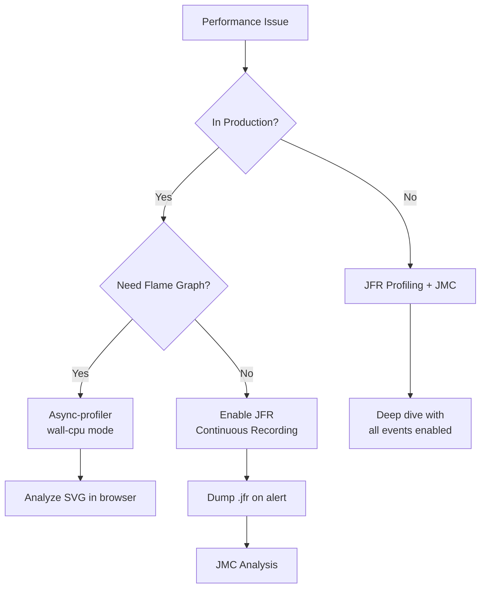

# Application Profiling: Async-profiler, JFR, JMC

## 1. Mục tiêu của task

Hiểu bản chất các công cụ profiling Java production-grade, phân biệt use case của từng loại, và biết cách vận hành chúng trong môi trường thực tế với minimal overhead.

---

## 2. Bản chất và cơ chế hoạt động

### 2.1 Vấn đề cốt lõi: Tại sao cần profiling?

Khi JVM chạy, nó biến đổi liên tục:
- **JIT Compiler** biên dịch bytecode thành native code
- **Garbage Collector** di chuyển object trong heap
- **Thread scheduling** chiếm dụng CPU theo cách không deterministic

Profiling không đơn thuần là "đo" — nó là **lấy mẫu (sampling)** hoặc **instrumentation** hệ thống đang chạy mà không làm thay đổi hành vi cốt lõi.

> **Nguyên tắc Observer Effect**: Bất kỳ công cụ đo lường nào cũng ảnh hưởng đến hệ thống. Nhiệm vụ của profiling tool là giảm ảnh hưởng này xuống mức chấp nhận được (<5%).

### 2.2 Ba loại profiling cơ bản

| Loại | Đơn vị đo | Use case chính | Cơ chế |
|------|-----------|----------------|--------|
| **CPU Profiling** | Thờigian CPU | Tìm method nào "ngốn" CPU | Sampling stack trace |
| **Memory Profiling** | Object allocation | Tìm memory leak, allocation hotspot | Instrumentation / TLAB sampling |
| **Wall-clock Profiling** | Thờigian thực | Tìm latency ẩn (I/O wait, lock) | Sampling không phân biệt running/waiting |

---

## 3. Async-profiler: Bản chất và cơ chế

### 3.1 Tại sao Async-profiler sinh ra?

Các công cụ truyền thống như `jvisualvm`, `jmc` dùng **safepoint sampling**:
- JVM chỉ lấy stack trace khi thread ở safepoint
- Thread phải dừng lại để GC, deoptimization, v.v.
- **Bias**: Method ngắn, nhanh bị "bỏ sót" vì thread qua nhanh trước khi safepoint kích hoạt

**Async-profiler** (Andrei Pangin - JetBrains) giải quyết bằng:
- **AsyncGetCallTrace** (JVM API không chính thức): lấy stack trace mà không cần safepoint
- **perf_event_open** (Linux): lấy native stack từ kernel
- Kết hợp Java stack + Native stack thành **mixed-mode flame graph**

```
┌─────────────────────────────────────────────────────────┐
│              User Space (Java Application)              │
│  ┌─────────────────┐    ┌─────────────────────────┐    │
│  │   Java Stack    │    │    Native Libraries     │    │
│  │  (AsyncGetCall  │◄──►│  (JVM, JNI, Netty EPoll)│    │
│  │     Trace)      │    │                         │    │
│  └────────┬────────┘    └───────────┬─────────────┘    │
│           │                         │                  │
│           └───────────┬─────────────┘                  │
│                       ▼                                │
│              Async-profiler Agent                      │
└───────────────────────┬────────────────────────────────┘
                        │
┌───────────────────────┼────────────────────────────────┐
│         Kernel Space  │                                │
│  ┌────────────────────┴────────────────────────────┐   │
│  │         perf_event_open (Linux PMU)             │   │
│  │  - CPU cycles, cache misses, branch misses      │   │
│  │  - Hardware performance counters                │   │
│  └─────────────────────────────────────────────────┘   │
└────────────────────────────────────────────────────────┘
```

### 3.2 Cơ chế sampling không safepoint

**AsyncGetCallTrace** là JNI call không chính thức tồn tại trong HotSpot JVM:

```c
// Pseudocode cơ chế
void signal_handler(int sig, siginfo_t* info, void* ucontext) {
    // Được gọi bởi SIGPROF timer
    // Không cần thread ở safepoint!
    
    JNIEnv* env = get_jni_env();
    jmethodID* methods;
    int depth = AsyncGetCallTrace(methods, max_depth, ucontext);
    
    // Ghi nhận stack trace ngay lập tức
    record_stack_trace(methods, depth);
}
```

**Tại sao không cần safepoint?**
- `AsyncGetCallTrace` dùng frame pointer walk để xây dựng stack trace
- Nó đọc trực tiếp từ thread's execution context (`ucontext`)
- Không yêu cầu thread dừng hoặc cập nhật JVM state

### 3.3 Wall-clock vs CPU profiling

```bash
# CPU profiling (default) - chỉ đo thờigian thực thực
./profiler.sh -d 60 -f cpu.svg <pid>

# Wall-clock profiling - đo tất cả thờigian (bao gồm sleep, I/O, lock wait)
./profiler.sh -e wall -d 60 -f wall.svg <pid>
```

| Mode | Event trigger | Use case |
|------|---------------|----------|
| `-e cpu` | CPU cycles | Tìm CPU hotspot, inefficient algorithm |
| `-e wall` | Real time | Tìm latency, I/O bottleneck, lock contention |
| `-e alloc` | Object allocation | Memory allocation profiling |
| `-e lock` | Lock contention | Deadlock, monitor contention |

### 3.4 Flame Graph: Tại sao là định dạng chuẩn?

Flame graph không phải là "graph" — nó là **icicle plot**:
- Y-axis: Stack depth (bottom = entry point, top = leaf)
- X-axis: Alphabetical (KHÔNG phải timeline)
- Width: Relative frequency (càng rộng = càng nhiều samples)

```
┌─────────────────────────────────────────────────────────────┐
│  _______________    _______    _____________    _______    │  ← Leaf methods
│ │  processRow   │  │ parse │  │ writeBatch │  │ flush │   │
│ │_______________│  │_______│  │____________│  │_______│   │
│       │               │              │             │       │
│   ┌───┴───┐       ┌───┴───┐      ┌───┴───┐     ┌───┴───┐   │
│   │fetch  │       │tokenize│      │commit │     │sync  │   │  ← Callers
│   │_______│       │_______│      │_______│     │_______│   │
│       │               │              │             │       │
│   ┌───┴───────────┬───┴──────────┬───┴────────┬───┴───┐   │
│   │  handleRequest │  parseJSON  │  saveToDB  │ fsync │   │
│   │________________│_____________│____________│_______│   │
└─────────────────────────────────────────────────────────────┘
```

**Đọc flame graph:**
1. **Tìm "plateau"** (ngọn núi phẳng) → đó là method chiếm nhiều thờigian
2. **Tìm "spire"** (ngọn nhọn cao) → call stack sâu, xem xét có cần refactor không
3. **So sánh chiều rộng** giữa các nhánh cùng cấp

### 3.5 Allocation profiling mechanism

Async-profiler hỗ trợ allocation profiling bằng **TLAB (Thread Local Allocation Buffer) sampling**:

```
┌────────────────────────────────────────────────────────────┐
│                    Eden Space (Young Generation)           │
│  ┌──────────┐  ┌──────────┐  ┌──────────┐                  │
│  │ Thread A │  │ Thread B │  │ Thread C │  ...             │
│  │   TLAB   │  │   TLAB   │  │   TLAB   │                  │
│  │ ┌──────┐ │  │ ┌──────┐ │  │ ┌──────┐ │                  │
│  │ │ Obj1 │ │  │ │ Obj4 │ │  │ │ Obj7 │ │                  │
│  │ │ Obj2 │ │  │ │ Obj5 │ │  │ │ Obj8 │ │                  │
│  │ │ Obj3 │ │  │ │ Obj6 │ │  │ │ Obj9 │ │                  │
│  │ └──────┘ │  │ └──────┘ │  │ └──────┘ │                  │
│  └──────────┘  └──────────┘  └──────────┘                  │
│       ▲                                                      │
│       │ Thread gặp TLAB full → allocation event → profiler   │
└────────────────────────────────────────────────────────────┘
```

**Tại sao TLAB sampling hiệu quả?**
- Mỗi thread có TLAB riêng → allocation không cần synchronization
- Khi TLAB hết, JVM cấp TLAB mới → trigger sample point
- Chi phí: ~0.1% overhead (so với instrumentation profiling ~20-50%)

---

## 4. Java Flight Recorder (JFR): Flight Data Recorder của JVM

### 4.1 Bản chất: Event streaming architecture

JFR không phải là "profiler" — nó là **event recorder**:

```
┌─────────────────────────────────────────────────────────────┐
│                    JVM Event Sources                        │
│  ┌──────────┐ ┌──────────┐ ┌──────────┐ ┌──────────┐       │
│  │  JIT     │ │   GC     │ │ Thread   │ │  I/O     │       │
│  │ Compiler │ │  Events  │ │ Events   │ │ Events   │       │
│  └────┬─────┘ └────┬─────┘ └────┬─────┘ └────┬─────┘       │
│       │            │            │            │              │
│       └────────────┴────────────┴────────────┘              │
│                      │                                       │
│                      ▼                                       │
│  ┌───────────────────────────────────────────────────────┐  │
│  │              JFR Event Stream                         │  │
│  │  - Ring buffer (circular, lock-free)                  │  │
│  │  - Pre-allocated memory (không allocate trong flight) │  │
│  │  - Low-latency event commit                           │  │
│  └─────────────────────────┬─────────────────────────────┘  │
│                            │                                 │
│              ┌─────────────┼─────────────┐                   │
│              ▼             ▼             ▼                   │
│        ┌──────────┐  ┌──────────┐  ┌──────────┐             │
│        │  .jfr    │  │  JMC     │  │ Custom   │             │
│        │  File    │  │  GUI     │  │ Handler  │             │
│        └──────────┘  └──────────┘  └──────────┘             │
└─────────────────────────────────────────────────────────────┘
```

**Tại sao JFR có overhead thấp?**
1. **Pre-allocated ring buffers**: Event committed vào buffer có sẵn, không malloc trong flight
2. **Lock-free data structures**: Multiple threads ghi event không cần lock
3. **Lazy serialization**: Event chỉ được serialize khi cần (write to disk / network)
4. **Native implementation**: Core JFR code nằm trong JVM native layer

### 4.2 Event types và configuration

```xml
<!-- flight-config.xml - Custom profile -->
<configuration version="2.0">
    <event name="jdk.CPULoad">
        <setting name="enabled">true</setting>
        <setting name="period">1000 ms</setting>
    </event>
    <event name="jdk.GCPhasePause">
        <setting name="enabled">true</setting>
        <setting name="threshold">10 ms</setting>
    </event>
    <event name="jdk.ObjectAllocationInNewTLAB">
        <setting name="enabled">true</setting>
        <setting name="stackTrace">true</setting>
    </event>
</configuration>
```

| Event Category | Examples | Use case |
|---------------|----------|----------|
| **Execution** | MethodProfiling, ExceptionThrow, ThreadSleep | CPU profiling, exception tracking |
| **Memory** | GCPhasePause, ObjectAllocation, HeapSummary | GC tuning, allocation analysis |
| **I/O** | FileRead, FileWrite, SocketRead, SocketWrite | I/O bottleneck identification |
| **Locking** | JavaMonitorEnter, JavaMonitorWait, ThreadPark | Contention detection |
| **Compiler** | Compilation, CodeCacheFull | JIT optimization tracking |

### 4.3 Continuous recording vs profiling recording

```bash
# Continuous recording (always-on, low overhead ~1%)
-XX:StartFlightRecording=disk=true,dumponexit=true,filename=continuous.jfr,maxsize=100m

# Profiling recording (higher overhead ~2-5%, more events)
-XX:StartFlightRecording=settings=profile,filename=profile.jfr
```

| Aspect | Continuous | Profiling |
|--------|-----------|-----------|
| Overhead | ~1% | ~2-5% |
| Duration | Hours/days | Minutes |
| Events | GC, exceptions, I/O | + Method profiling, allocation |
| Use case | Production monitoring | Performance investigation |

---

## 5. Java Mission Control (JMC): Phân tích JFR

### 5.1 Kiến trúc tổng thể

```
┌─────────────────────────────────────────────────────────────────┐
│                      JMC Client                                  │
│  ┌─────────────────────────────────────────────────────────┐    │
│  │                    JFR Model                            │    │
│  │  - Parse .jfr binary format                             │    │
│  │  - Build in-memory event graph                          │    │
│  │  - Calculate aggregations                               │    │
│  └──────────────────────────┬──────────────────────────────┘    │
│                             │                                    │
│     ┌───────────────────────┼───────────────────────┐           │
│     ▼                       ▼                       ▼           │
│  ┌──────────┐          ┌──────────┐          ┌──────────┐       │
│  │  Pages   │          │  Charts  │          │  Rules   │       │
│  │  (Tabs)  │          │  (Graphs)│          │  (Alerts)│       │
│  └──────────┘          └──────────┘          └──────────┘       │
└─────────────────────────────────────────────────────────────────┘
```

### 5.2 Automated Analysis Rules

JMC có hệ thống **Automated Analysis** đánh giá recording:

| Severity | Examples | Action |
|----------|----------|--------|
| 🔴 **Critical** | Long GC pauses > 1s, Memory leak detected | Immediate investigation |
| 🟠 **Warning** | High allocation rate, Frequent exceptions | Monitor and plan fix |
| 🟡 **Info** | Many thread parks, High compilation time | Awareness |
| 🟢 **OK** | All metrics within thresholds | - |

---

## 6. So sánh ba công cụ

| Tiêu chí | Async-profiler | JFR | JMC |
|----------|---------------|-----|-----|
| **Loại** | External profiler | JVM built-in recorder | Analysis tool |
| **Overhead** | <1% (async) | 1-5% | 0% (post-analysis) |
| **Flame graph** | ✅ Native support | ❌ (cần 3rd party) | ❌ |
| **Time range** | Point-in-time | Continuous/recording window | Post-hoc |
| **Event types** | CPU, alloc, lock, wall | Comprehensive JVM events | N/A (consumer) |
| **Production** | ✅ Safe, low overhead | ✅ Designed for production | N/A (analysis) |
| **Native stack** | ✅ Mixed-mode | ❌ Java only | ❌ Java only |
| **Continuous** | ❌ Manual trigger | ✅ Yes | N/A |
| **File format** | Collapsed stacks, SVG | .jfr binary | .jfr consumer |

### 6.1 Khi nào dùng cái nào?



---

## 7. Rủi ro, anti-patterns và pitfall

### 7.1 Async-profiler pitfalls

#### 7.1.1 Safepoint bias misconception

```bash
# ❌ WRONG: JFR mặc định có safepoint bias trong một số configuration
-XX:StartFlightRecording=method-profiling=true  # Có thể có bias

# ✅ CORRECT: Async-profiler không có safepoint bias
./profiler.sh -e cpu -t -f flame.html <pid>
```

#### 7.1.2 Overhead khi dùng sai mode

```bash
# ❌ DANGEROUS: Wall-clock với interval quá nhỏ trên production
./profiler.sh -e wall -i 1ms -d 300 <pid>  # Có thể gây >10% overhead

# ✅ SAFE: CPU profiling với interval hợp lý
./profiler.sh -e cpu -i 10ms -d 60 <pid>   # ~0.5% overhead
```

#### 7.1.3 Missing native context

```bash
# ❌ INCOMPLETE: Chỉ lấy Java stack bỏ qua JNI, Netty native
./profiler.sh -e cpu --no-native <pid>

# ✅ COMPLETE: Mixed-mode profiling
./profiler.sh -e cpu -t <pid>  # -t = include threads, mặc định mixed-mode
```

### 7.2 JFR/JMC pitfalls

#### 7.2.1 Recording size explosion

```bash
# ❌ DANGEROUS: Không giới hạn size recording
-XX:StartFlightRecording=disk=true,maxsize=0  # Có thể fill disk

# ✅ SAFE: Giới hạn size và age
-XX:StartFlightRecording=disk=true,maxsize=100m,maxage=1h
```

#### 7.2.2 Misleading allocation profiling

> **Quan trọng**: JFR allocation profiling chỉ sample khi TLAB full. Nếu object nhỏ và TLAB lớn, có thể miss allocation hotspot.

```bash
# ✅ Workaround: Giảm TLAB size để tăng sample rate
-XX:MinTLABSize=2k

# ✅ Hoặc dùng Async-profiler allocation profiling
./profiler.sh -e alloc -d 60 -f alloc.html <pid>
```

#### 7.2.3 Event threshold too high

```xml
<!-- ❌ Cấu hình này sẽ miss nhiều GC pause < 50ms -->
<event name="jdk.GCPhasePause">
    <setting name="threshold">50 ms</setting>
</event>

<!-- ✅ Nên để threshold thấp, filter sau khi analysis -->
<event name="jdk.GCPhasePause">
    <setting name="threshold">0 ms</setting>
</event>
```

### 7.3 Production concerns

#### 7.3.1 Security: JFR có thể capture sensitive data

```
JFR events có thể chứa:
- SQL queries (jdk.JVMInformation)
- File paths (jdk.FileRead/Write)
- Socket addresses (jdk.SocketRead/Write)
```

**Mitigation:**
- Giới hạn access vào .jfr files
- Dùng event filter để exclude sensitive events
- Không upload .jfr lên public

#### 7.3.2 Thread dump side effects

```bash
# ❌ KHÔNG dùng jstack hoặc SIGQUIT khi đang JFR recording
# Có thể gây safepoint storm

# ✅ Dùng JFR native thread dump event thay thế
jcmd <pid> JFR.dump filename=thread_dump.jfr
```

---

## 8. Khuyến nghị thực chiến trong production

### 8.1 Kiến trúc profiling trong production

```
┌─────────────────────────────────────────────────────────────────┐
│                        Production Cluster                        │
│                                                                  │
│  ┌──────────────┐  ┌──────────────┐  ┌──────────────┐           │
│  │   App Node 1 │  │   App Node 2 │  │   App Node N │           │
│  │  ┌────────┐  │  │  ┌────────┐  │  │  ┌────────┐  │           │
│  │  │JFR     │  │  │  │JFR     │  │  │  │JFR     │  │           │
│  │  │Continuous│ │  │  │Continuous│ │  │  │Continuous│ │           │
│  │  └────────┘  │  │  └────────┘  │  │  └────────┘  │           │
│  └──────┬───────┘  └──────┬───────┘  └──────┬───────┘           │
│         │                 │                 │                    │
│         └─────────────────┼─────────────────┘                    │
│                           │                                      │
│                    ┌──────┴──────┐                               │
│                    │   On Alert  │                               │
│                    │  (Trigger)  │                               │
│                    └──────┬──────┘                               │
│                           │                                      │
│              ┌────────────┼────────────┐                        │
│              ▼            ▼            ▼                        │
│        ┌──────────┐ ┌──────────┐ ┌──────────┐                   │
│        │ Dump .jfr│ │Async-prof│ │ Notify   │                   │
│        │ to S3    │ │ sample   │ │ PagerDuty│                   │
│        └──────────┘ └──────────┘ └──────────┘                   │
└─────────────────────────────────────────────────────────────────┘
```

### 8.2 Recommended JVM flags

```bash
# === Continuous JFR (Always-on) ===
-XX:+UnlockDiagnosticVMOptions
-XX:+DebugNonSafepoints
-XX:StartFlightRecording=
    disk=true,
    dumponexit=false,
    filename=/var/log/jfr/continuous.jfr,
    maxsize=100m,
    maxage=1h,
    settings=default

# === Async-profiler agent (Optional - chỉ khi cần deep profiling) ===
# Không dùng agent mặc định, trigger on-demand thay vì attach liên tục
```

### 8.3 Alert và trigger strategy

| Condition | Action | Tool |
|-----------|--------|------|
| P99 latency > threshold | Dump 60s JFR + Async-profiler wall-clock | Automated |
| CPU usage > 80% | Async-profiler CPU mode 30s | Automated |
| GC pause > 500ms | JFR dump + analyze GC events | Automated |
| Memory growth rate high | Async-profiler alloc mode | Manual trigger |
| Deployment verification | JFR profiling 5 minutes | Manual |

### 8.4 Integration với monitoring stack

```bash
# Export JFR metrics sang Prometheus (jfr-exporter)
java -javaagent:jfr-exporter.jar=port=9090 -jar app.jar

# Async-profiler trong container
kubectl exec -it pod/app-xxx -- /profiler/profiler.sh -d 30 -f - 1 > flame.html
```

---

## 9. Kết luận

### Bản chất cốt lõi

1. **Async-profiler**: Sampling không safepoint, mixed-mode flame graph, overhead cực thấp. Best cho **point-in-time investigation**.

2. **JFR**: Event streaming architecture, comprehensive JVM telemetry, designed cho **continuous production monitoring**.

3. **JMC**: Analysis and visualization tool cho JFR data, automated rule engine.

### Trade-off tổng kết

| Yếu tố | Best choice |
|--------|-------------|
| Tìm CPU hotspot nhanh | Async-profiler |
| Continuous monitoring | JFR |
| Native code analysis | Async-profiler |
| GC/Memory deep dive | JFR + JMC |
| Lowest overhead | Async-profiler (<1%) |
| Automated alerting | JFR + custom exporter |

### Anti-pattern quan trọng nhất

> Đừng dùng profiling như debugger. Profiling cho biết **WHERE** time được spent, không phải **WHY**. Sau khi identify hotspot, dùng logging, debugging, hoặc code review để hiểu root cause.

---

## 10. References

- [Async-profiler GitHub](https://github.com/jvm-profiling-tools/async-profiler)
- [JEP 328: Flight Recorder](https://openjdk.org/jeps/328)
- [JEP 331: Low-Overhead Heap Profiling](https://openjdk.org/jeps/331)
- [Java Performance: The Definitive Guide - Scott Oaks](https://www.oreilly.com/library/view/java-performance-the/9781449363512/)
- [Optimizing Java - O'Reilly Media](https://www.oreilly.com/library/view/optimizing-java/9781492039259/)

---

*Document version: 1.0*
*Last updated: 2026-03-28*
