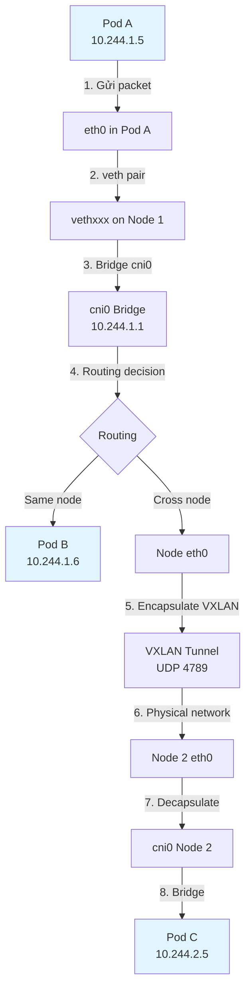
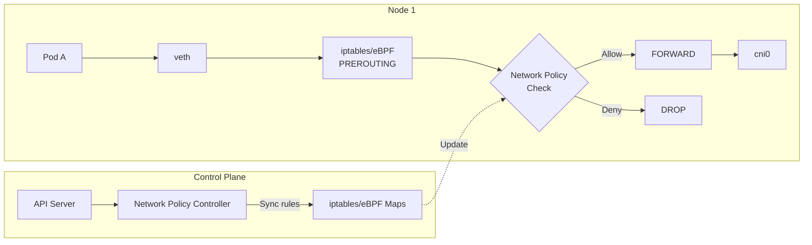
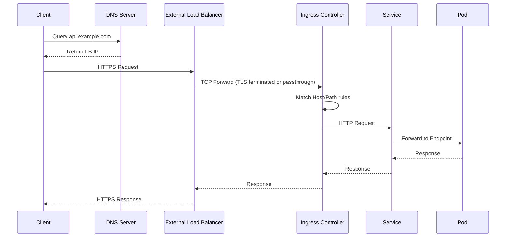

# Advanced Kubernetes Networking - CNI, Network Policies, Ingress Controllers

## 1. Mục tiêu của Task

Hiểu sâu cơ chế networking trong Kubernetes ở tầng infrastructure, bao gồm:
- **CNI (Container Network Interface)**: Bản chất giao tiếp giữa container và network stack của host
- **Network Policies**: Cơ chế firewall ảo hoạt động như thế nào, dựa trên đâu
- **Ingress Controllers**: Luồng traffic từ external đến cluster và các pattern quản lý

> **Tầm quan trọng**: Kubernetes networking là nền tảng của mọi microservice deployment. Hiểu sai hoặc cấu hình sai ở layer này gây ra security breach, performance bottleneck, hoặc downtime hoàn toàn.

---

## 2. Bản Chất và Cơ Chế Hoạt Động

### 2.1 Container Network Interface (CNI)

#### Bản chất cơ chế

Kubernetes **không tự implement networking**. Thay vào đó, nó định nghĩa một **spec** mà các network provider phải tuân theo - đó là CNI.

**CNI Spec định nghĩa 4 operations:**

```
ADD    → Tạo network interface cho container
DEL    → Xóa network interface
CHECK  → Kiểm tra network interface còn healthy không
VERSION→ Trao đổi version giữa runtime và plugin
```

**Luồng hoạt động khi Pod được tạo:**

```
Kubelet tạo Pod
    ↓
CRI (container runtime) tạo network namespace
    ↓
Gọi CNI plugin (thông qua /opt/cni/bin)
    ↓
CNI plugin:
  1. Tạo veth pair (một đầu trong container, một đầu trên host)
  2. Gán IP từ CIDR được cấp phát
  3. Setup routing rules
  4. Thiết lập connectivity giữa các node (overlay/underlay)
    ↓
Trả về IP cho Kubelet
```

**Cấu trúc Network Namespace:**

```
┌─────────────────────────────────────┐
│         Host (Node)                 │
│  ┌───────────────────────────────┐  │
│  │     eth0 (Physical NIC)       │  │
│  │   192.168.1.10/24             │  │
│  └───────────┬───────────────────┘  │
│              │                       │
│  ┌───────────▼───────────────────┐  │
│  │     cni0 / docker0 (Bridge)   │  │
│  │   10.244.0.1/24               │  │
│  └──────┬──────────────┬─────────┘  │
│         │              │            │
│  ┌──────▼────┐  ┌──────▼────┐       │
│  │  vethxxx  │  │  vethyyy  │       │
│  │  (host)   │  │  (host)   │       │
│  └─────┬─────┘  └─────┬─────┘       │
│        │              │             │
│  ┌─────▼──────┐ ┌─────▼──────┐      │
│  │  eth0      │ │  eth0      │      │
│  │  10.244.0.2│ │  10.244.0.3│      │
│  │  (Pod A)   │ │  (Pod B)   │      │
│  │  Namespace │ │  Namespace │      │
│  └────────────┘ └────────────┘      │
└─────────────────────────────────────┘
```

**CNI Configuration:**

```json
// /etc/cni/net.d/10-calico.conflist
{
  "cniVersion": "0.3.1",
  "name": "k8s-pod-network",
  "plugins": [
    {
      "type": "calico",
      "log_level": "info",
      "datastore_type": "kubernetes",
      "nodename": "node-1",
      "ipam": {
        "type": "calico-ipam"
      },
      "policy": {"type": "k8s"},
      "kubernetes": {"kubeconfig": "/etc/cni/net.d/calico-kubeconfig"}
    },
    {
      "type": "portmap",
      "snat": true,
      "capabilities": {"portMappings": true}
    }
  ]
}
```

> **Lưu ý quan trọng**: CNI plugin là **binary thực thi** được gọi bởi container runtime, không phải DaemonSet chạy trong cluster (mặc dù các CNI như Calico/Flannel thường deploy cả binary lẫn control plane dưới dạng DaemonSet).

#### Mục tiêu thiết kế

| Mục tiêu | Giải thích | Giới hạn chấp nhận |
|----------|-----------|-------------------|
| **Unique IP per Pod** | Mỗi Pod có IP riêng, không NAT giữa các Pod | IP exhaustion ở large scale (10.0.0.0/8 = ~16M IPs) |
| **Direct Pod-to-Pod** | Pod có thể communicate trực tiếp không cần NAT | Network partition là single point of failure |
| **Same IP across Node** | IP của Pod không đổi khi di chuyển giữa các node | Cần distributed IPAM hoặc coordinated allocation |

#### So sánh các CNI phổ biến

| CNI | Data Plane | Overlay | Network Policy | eBPF | Scale | Best For |
|-----|------------|---------|----------------|------|-------|----------|
| **Calico** | BGP/iptables/VPP | Optional (IPIP/VXLAN) | ✅ Native | ✅ Cilium mode | Large | Enterprise, on-prem |
| **Flannel** | VXLAN/UDP/host-gw | Required | ❌ External (Calico) | ❌ | Small-Medium | Simple, quick start |
| **Cilium** | eBPF | Optional | ✅ Native (eBPF) | ✅ Native | Large | Security, observability |
| **Weave** | VXLAN | Required | ✅ Native | ❌ | Small-Medium | Simple, encrypted |
| **AWS VPC CNI** | ENI | No (native VPC) | ✅ (VPC Security Groups) | ❌ | Large | AWS native |

**Trade-off phân tích:**

1. **Overlay vs Underlay:**
   - **Overlay (VXLAN/IPIP)**: Encapsulate traffic, hoạt động trên mọi network infrastructure. Cost: MTU overhead (~50 bytes), CPU cho encapsulation.
   - **Underlay (BGP)**: Native routing, không overhead. Yêu cầu: Network infrastructure phải hỗ trợ BGP routing.

2. **iptables vs eBPF:**
   - **iptables**: Mature, debuggable (iptables -L -v -n), nhưng O(n) với số rules. Với 1000+ services, iptables lookup trở thành bottleneck.
   - **eBPF**: O(1) lookup, programmable, observability tốt hơn. Learning curve cao, kernel dependency (4.19+).

### 2.2 Kubernetes Network Policies

#### Bản chất cơ chế

Network Policies là **abstraction của firewall rules** nhưng có một số khác biệt quan trọng:

1. **Layer abstraction**: Kubernetes Network Policy = **L3/L4 filtering** (IP, port, protocol). Không có L7 (HTTP path/method) ở native Network Policy.
2. **Default deny**: Mặc định, mọi traffic đều được allow. Chỉ khi có Network Policy selector match Pod, default chuyển thành deny-all.
3. **Implementation dependency**: Network Policy là API spec. Việc enforce phụ thuộc vào CNI (Calico, Cilium, Weave).

**Luồng xử lý packet với Network Policy:**

```
Packet đến Pod
    ↓
[CNI Data Plane - iptables/eBPF]
    ↓
Traverse iptables chains:
  → PREROUTING
  → FORWARD (nếu cross-node)
  → CNI-specific chains (KUBE-NWPLCY-xxx)
    ↓
Check Network Policy rules:
  1. Pod selector match?
  2. Namespace selector match?
  3. IPBlock match?
  4. Port/protocol match?
    ↓
[ACCEPT] hoặc [DROP]
```

**iptables implementation detail (Calico):**

```bash
# Chain được tạo cho mỗi Network Policy
-A cali-pi-_dKwcutKO3FIA5iANh0I -m comment --comment "cali:xxx" \
  -p tcp -m set --match-set cali40s:xxx src \
  -m multiport --dports 80,443 \
  -j MARK --set-xmark 0x10000/0x10000
```

**eBPF implementation detail (Cilium):**

```c
// Simplified eBPF program attached to cgroup/sock
__section("cgroup/sock")
int sock_connect(struct bpf_sock_addr *ctx) {
    // O(1) lookup trong eBPF map
    struct policy_key key = {
        .identity = get_identity(ctx),
        .dport = ctx->user_port,
    };
    
    struct policy_entry *policy = map_lookup_elem(&POLICY_MAP, &key);
    if (!policy || !(policy->action == ACTION_ALLOW)) {
        return SEND_DROP;  // Deny
    }
    return SEND_ACCEPT;
}
```

> **Quan trọng**: Native Kubernetes Network Policy **không log denied traffic**. Để biết policy nào block, cần CNI hỗ trợ (Cilium có hmetric, Calico cần flow log).

#### Pattern: Defense in Depth

```yaml
# Layer 1: Namespace-level default deny
apiVersion: networking.k8s.io/v1
kind: NetworkPolicy
metadata:
  name: default-deny-all
  namespace: production
spec:
  podSelector: {}  # Match all pods
  policyTypes:
  - Ingress
  - Egress
---
# Layer 2: Allow specific ingress
apiVersion: networking.k8s.io/v1
kind: NetworkPolicy
metadata:
  name: allow-frontend-to-api
spec:
  podSelector:
    matchLabels:
      app: api
  policyTypes:
  - Ingress
  ingress:
  - from:
    - namespaceSelector:
        matchLabels:
          name: frontend
    - podSelector:
        matchLabels:
          app: frontend
    ports:
    - protocol: TCP
      port: 8080
```

#### Limitations & Extensions

| Limitation | Native Network Policy | Cilium Network Policy | Calico Network Policy |
|------------|----------------------|----------------------|----------------------|
| L7 (HTTP) | ❌ | ✅ | ✅ (with Envoy) |
| DNS filtering | ❌ | ✅ | ✅ |
| FQDN policies | ❌ | ✅ | ✅ |
| Audit logging | ❌ | ✅ | ✅ (flow logs) |
| Hierarchical policies | ❌ | ✅ | ✅ (GlobalNetworkPolicy) |

### 2.3 Ingress Controllers

#### Bản chất cơ chế

Ingress Controller là **Layer 7 reverse proxy** chạy trong cluster, đảm nhận:
1. **North-South traffic**: External → Cluster
2. **Routing**: Host-based, path-based routing
3. **TLS termination**: HTTPS → HTTP inside cluster
4. **Load balancing**: Distribute traffic đến backend services

**Kiến trúc tổng quan:**

```
                    Internet
                       │
                       ▼
              ┌─────────────────┐
              │  Cloud LB /     │
              │  External LB    │
              │  (Layer 4)      │
              └────────┬────────┘
                       │
        ┌──────────────┼──────────────┐
        │              │              │
   ┌────▼────┐    ┌────▼────┐   ┌────▼────┐
   │Ingress  │    │Ingress  │   │Ingress  │
   │Controller│   │Controller│   │Controller│
   │Pod 1    │    │Pod 2    │   │Pod 3    │
   └────┬────┘    └────┬────┘   └────┬────┘
        │              │              │
        └──────────────┼──────────────┘
                       │
              ┌────────▼────────┐
              │   Services      │
              │   (ClusterIP)   │
              └────────┬────────┘
                       │
                 ┌─────┴─────┐
                 ▼           ▼
              ┌──────┐   ┌──────┐
              │ Pod  │   │ Pod  │
              └──────┘   └──────┘
```

**Ingress Resource vs Ingress Controller:**

- **Ingress Resource**: Kubernetes API object (YAML spec) - "muốn gì"
- **Ingress Controller**: Software thực thi (Nginx, Traefik, HAProxy) - "làm gì"

**Luồng request:**

```
Client DNS lookup → External LB IP
    ↓
TLS handshake với LB (hoặc pass-through)
    ↓
TCP connection đến Ingress Controller Pod
    ↓
HTTP parsing (Host header, Path)
    ↓
Match với Ingress rules → xác định backend Service
    ↓
Service DNS lookup (CoreDNS) → Endpoint IPs
    ↓
Load balancing algorithm → chọn Pod
    ↓
HTTP request đến Pod
```

#### So sánh Ingress Controllers

| Controller | Underlying Engine | Performance | Features | Resource Usage | Best For |
|------------|------------------|-------------|----------|----------------|----------|
| **NGINX** | NGINX | ⭐⭐⭐⭐⭐ | Rich | Medium | General purpose |
| **Traefik** | Go (custom) | ⭐⭐⭐⭐ | Auto HTTPS, Middleware | Low | Dynamic environments |
| **HAProxy** | HAProxy | ⭐⭐⭐⭐⭐⭐ | Enterprise features | Low-Medium | High throughput |
| **Contour** | Envoy | ⭐⭐⭐⭐⭐ | HTTPProxy CRD | Medium | Advanced routing |
| **Istio Gateway** | Envoy | ⭐⭐⭐⭐⭐ | mTLS, Traffic mgmt | High | Service mesh |
| **ALB (AWS)** | AWS ALB | ⭐⭐⭐⭐ | Native integration | N/A (managed) | AWS environments |

#### Advanced Patterns

**1. SSL Passthrough vs Termination:**

```yaml
# SSL Termination at Ingress
apiVersion: networking.k8s.io/v1
kind: Ingress
metadata:
  annotations:
    nginx.ingress.kubernetes.io/ssl-redirect: "true"
spec:
  tls:
  - hosts:
    - api.example.com
    secretName: api-tls-secret  # Cert ở đây
  rules:
  - host: api.example.com
    http:
      paths:
      - backend:
          service:
            name: api-service
            port:
              number: 80  # HTTP inside cluster

# SSL Passthrough (encrypt end-to-end)
apiVersion: networking.k8s.io/v1
kind: Ingress
metadata:
  annotations:
    nginx.ingress.kubernetes.io/ssl-passthrough: "true"
    # L4 proxy, không thể inspect HTTP
```

**Trade-off:**
- **Termination**: Ingress có thể apply L7 features (rate limiting, rewriting), nhưng traffic nội bộ unencrypted.
- **Passthrough**: End-to-end encryption, nhưng mất L7 features.

**2. Multi-tenancy với Ingress Classes:**

```yaml
apiVersion: networking.k8s.io/v1
kind: IngressClass
metadata:
  name: nginx-internal
spec:
  controller: k8s.io/ingress-nginx
  parameters:
    apiGroup: k8s.io
    kind: IngressParameters
    name: internal-config
    namespace: ingress-nginx
---
apiVersion: networking.k8s.io/v1
kind: Ingress
metadata:
  name: internal-app
spec:
  ingressClassName: nginx-internal  # Chọn controller cụ thể
  rules:
  - host: internal.company.com
    ...
```

---

## 3. Kiến Trúc và Luồng Xử Lý

### 3.1 Packet Flow trong Kubernetes Cluster



### 3.2 Network Policy Enforcement Points



### 3.3 Ingress Traffic Flow



---

## 4. So Sánh Các Lựa Chọn

### 4.1 CNI Selection Decision Tree

```
Bắt đầu
  │
  ├─ Chạy trên AWS/GCP/Azure?
  │   ├─ Yes → Dùng VPC-native CNI (AWS VPC CNI, GCP VPC)
  │   │        Lý do: Native integration, no overlay overhead
  │   └─ No → Tiếp tục
  │
  ├─ Cần advanced security (L7 policies, FQDN)?
  │   ├─ Yes → Cilium
  │   │        Lý do: eBPF-based L7 filtering, DNS-aware
  │   └─ No → Tiếp tục
  │
  ├─ Cần BGP/on-prem integration?
  │   ├─ Yes → Calico (BGP mode)
  │   │        Lý do: Native BGP, no overlay
  │   └─ No → Tiếp tục
  │
  ├─ Scale > 1000 nodes?
  │   ├─ Yes → Cilium hoặc Calico (eBPF mode)
  │   │        Lý do: O(1) policy enforcement
  │   └─ No → Tiếp tục
  │
  └─ Simple, quick start?
      ├─ Yes → Flannel (VXLAN)
      └─ No → Calico (default choice)
```

### 4.2 Ingress Controller Selection Matrix

| Use Case | Recommended | Lý do |
|----------|-------------|-------|
| High throughput (10k+ RPS) | NGINX / HAProxy | C-based, minimal overhead |
| Dynamic microservices | Traefik | Auto-discovery, dynamic config |
| Advanced traffic management | Contour (Envoy) | Traffic splitting, retries, circuit breaking |
| Service mesh integration | Istio Gateway | Unified control plane |
| AWS native | ALB Ingress | Managed, integration với WAF/Shield |
| Multi-protocol (gRPC, TCP) | NGINX / Envoy | Native support |

---

## 5. Rủi Ro, Anti-Patterns, Lỗi Thường Gặp

### 5.1 CNI Related

| Anti-Pattern | Hậu quả | Cách khắc phục |
|--------------|---------|---------------|
| **IP exhaustion** | Pod không thể scheduled | Tăng node CIDR size, dùng VPC-native CNI |
| **VXLAN without MTU adjustment** | Packet fragmentation, performance drop | Giảm Pod MTU (e.g., 1450 cho VXLAN) |
| **Calico IPIP cross-subnet** | Unnecessary encapsulation intra-subnet | Dùng `CrossSubnet` mode |
| **No CNI network policy support** | Security gap | Verify CNI supports NetworkPolicy (Flannel cần addon) |

### 5.2 Network Policies

| Anti-Pattern | Hậu quả | Cách khắc phục |
|--------------|---------|---------------|
| **No default deny** | Implicit allow all = security risk | Implement default-deny namespace policy |
| **Overly permissive egress** | Data exfiltration risk | Restrict egress to known endpoints |
| **Allow 0.0.0.0/0 ingress** | Exposure to internet | Dùng IPBlock hạn chế, hoặc chỉ allow từ ingress namespace |
| **Policy chỉ có ingress** | Egress traffic không kiểm soát | Always define cả ingress và egress |

### 5.3 Ingress

| Anti-Pattern | Hậu quả | Cách khắc phục |
|--------------|---------|---------------|
| **TLS termination only at LB** | Traffic internal unencrypted | Enable TLS pass-through hoặc service mesh mTLS |
| **No rate limiting** | DDoS vulnerability | Implement NGINX rate limiting annotation |
| **Large proxy buffer** | Memory pressure, OOM | Tune `proxy-buffer-size`, `proxy-buffers` |
| **No health checks** | Traffic đến unhealthy pods | Configure readiness/liveness properly |

### 5.4 Common Failure Modes

**1. DNS Resolution Loop:**
```
Pod → CoreDNS → External DNS → CoreDNS (nếu DNS policy sai)
```
→ **Fix**: Exclude CoreDNS IPs khỏi egress proxy/policy

**2. Asymmetric Routing (Calico BGP):**
```
Traffic đi: Pod → Node A → External
Traffic về: External → Node B → Pod (bị drop vì không biết flow)
```
→ **Fix**: Enable `nodeToNodeMesh` hoặc dùng single ToR

**3. Conntrack Table Overflow:**
```
High connection churn → nf_conntrack table full → DROP
```
→ **Fix**: Tăng `net.netfilter.nf_conntrack_max`, reduce timeout

---

## 6. Khuyến Nghị Thực Chiến Production

### 6.1 CNI Deployment

```yaml
# Calico với eBPF mode (production recommended)
apiVersion: operator.tigera.io/v1
kind: Installation
metadata:
  name: default
spec:
  variant: Calico
  calicoNetwork:
    linuxDataplane: BPF  # Enable eBPF
    hostPorts: Enabled
    multiInterfaceMode: Multinode
    ipPools:
    - name: default-ipv4-ippool
      blockSize: 26       # /26 = 64 IPs per block
      cidr: 10.244.0.0/16
      encapsulation: VXLANCrossSubnet
      natOutgoing: Enabled
      nodeSelector: all()
```

### 6.2 Network Policies Best Practices

```yaml
# 1. Default deny namespace
apiVersion: networking.k8s.io/v1
kind: NetworkPolicy
metadata:
  name: default-deny
  namespace: production
spec:
  podSelector: {}
  policyTypes:
  - Ingress
  - Egress
---
# 2. Allow DNS (critical!)
apiVersion: networking.k8s.io/v1
kind: NetworkPolicy
metadata:
  name: allow-dns
spec:
  podSelector: {}
  policyTypes:
  - Egress
  egress:
  - to:
    - namespaceSelector:
        matchLabels:
          kubernetes.io/metadata.name: kube-system
    ports:
    - protocol: UDP
      port: 53
    - protocol: TCP
      port: 53
---
# 3. Application-specific policy
apiVersion: networking.k8s.io/v1
kind: NetworkPolicy
metadata:
  name: api-policy
spec:
  podSelector:
    matchLabels:
      app: api
  policyTypes:
  - Ingress
  - Egress
  ingress:
  - from:
    - namespaceSelector:
        matchLabels:
          name: ingress-nginx  # Chỉ allow từ ingress
    ports:
    - protocol: TCP
      port: 8080
  egress:
  - to:
    - podSelector:
        matchLabels:
          app: database
    ports:
    - protocol: TCP
      port: 5432
  - to:
    - podSelector:
        matchLabels:
          app: redis
    ports:
    - protocol: TCP
      port: 6379
```

### 6.3 Ingress Production Checklist

- [ ] **SSL/TLS**: Valid certificates, auto-renewal (cert-manager)
- [ ] **Rate Limiting**: NGINX `limit-rps`, `limit-connections`
- [ ] **Timeout tuning**: `proxy-read-timeout`, `proxy-send-timeout`
- [ ] **Buffer tuning**: `proxy-buffer-size: "16k"` cho large headers
- [ ] **Health checks**: Readiness probe trên `/healthz`
- [ ] **HPA**: Autoscale ingress controller pods
- [ ] **PodDisruptionBudget**: Đảm bảo min replicas during disruption

```yaml
# Production Ingress example
apiVersion: networking.k8s.io/v1
kind: Ingress
metadata:
  name: production-api
  annotations:
    # Rate limiting
    nginx.ingress.kubernetes.io/limit-rps: "100"
    nginx.ingress.kubernetes.io/limit-connections: "50"
    
    # Timeouts
    nginx.ingress.kubernetes.io/proxy-read-timeout: "60"
    nginx.ingress.kubernetes.io/proxy-send-timeout: "60"
    
    # Buffer
    nginx.ingress.kubernetes.io/proxy-buffer-size: "16k"
    nginx.ingress.kubernetes.io/proxy-buffers: "4 16k"
    
    # SSL
    nginx.ingress.kubernetes.io/ssl-redirect: "true"
    nginx.ingress.kubernetes.io/force-ssl-redirect: "true"
    
    # CORS (nếu cần)
    nginx.ingress.kubernetes.io/enable-cors: "true"
spec:
  ingressClassName: nginx
  tls:
  - hosts:
    - api.production.com
    secretName: api-tls
  rules:
  - host: api.production.com
    http:
      paths:
      - path: /
        pathType: Prefix
        backend:
          service:
            name: api-service
            port:
              number: 80
```

### 6.4 Observability

| Metric | Tool | Alert Threshold |
|--------|------|-----------------|
| Conntrack usage | Node exporter | >80% |
| CNI IP pool exhaustion | CNI metrics | <20% IPs available |
| Ingress latency | NGINX metrics | P99 > 500ms |
| Ingress error rate | NGINX metrics | >1% 5xx |
| Network policy drops | Cilium/Calico flow logs | Sudden spike |

---

## 7. Kết Luận

**Bản chất cốt lõi của Kubernetes Networking:**

1. **CNI** là interface spec, không phải implementation. Mỗi CNI có trade-off rõ rệt giữa simplicity (Flannel) và capability (Cilium/Calico). eBPF đang trở thành standard cho scale và observability.

2. **Network Policies** là distributed firewall. Default allow là rủi ro security phải được mitigate bằng default-deny pattern. Không có audit log ở native policy là limitation cần external tooling.

3. **Ingress Controllers** là reverse proxy chạy in-cluster. Selection phụ thuộc vào throughput needs và feature requirements. SSL termination vs passthrough là trade-off giữa security và functionality.

**Trade-off quan trọng nhất:**
- **Simplicity vs Capability**: Flannel đơn giản nhưng thiếu network policies. Cilium/Calico phức tạp hơn nhưng cung cấp enterprise-grade networking.
- **Performance vs Security**: iptables nhanh ở small scale, eBPF scalable hơn. SSL passthrough secure hơn nhưng hạn chế L7 features.

**Rủi ro lớn nhất:**
- **IP exhaustion** gây scheduling failure
- **Missing default deny policies** tạo security holes
- **Conntrack overflow** trên high-connection workloads

**Khuyến nghị cuối cùng:**
- Small cluster (<50 nodes): Flannel + Calico policy addon
- Medium-Large: Calico với eBPF hoặc Cilium
- AWS: VPC CNI cho native integration
- Always: Implement default-deny network policies
- Always: Monitor conntrack và IP pool usage
