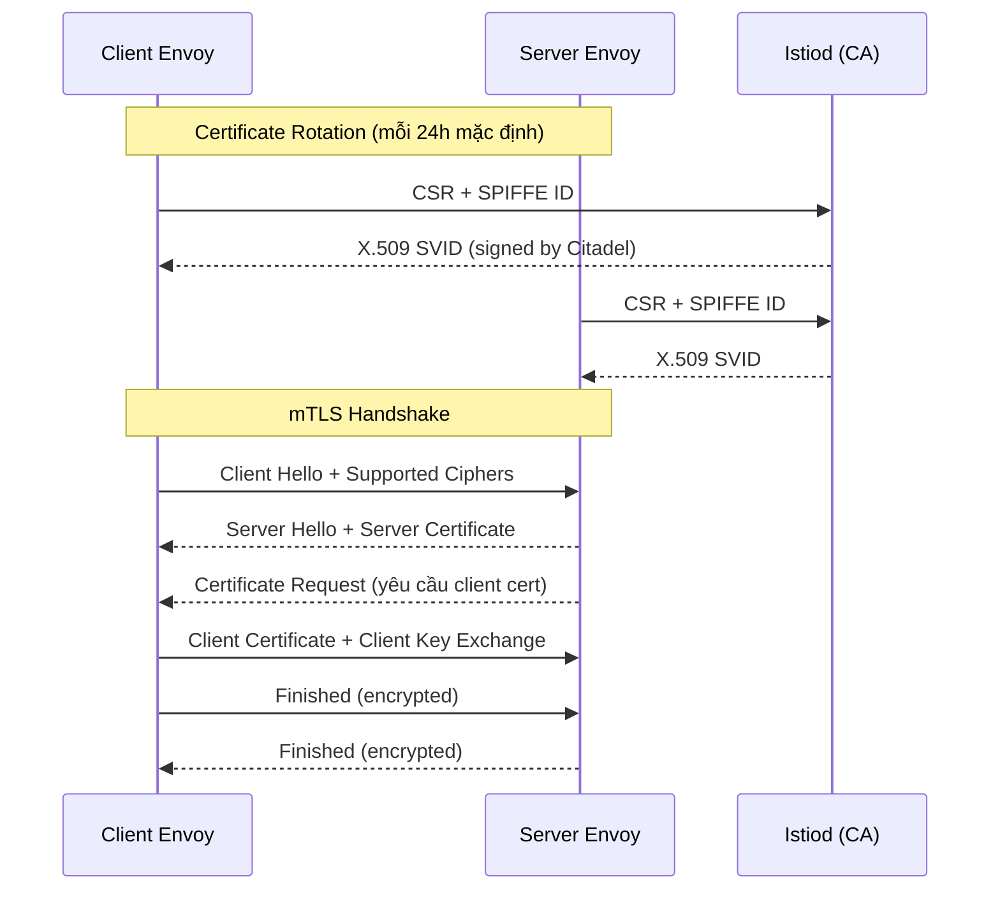
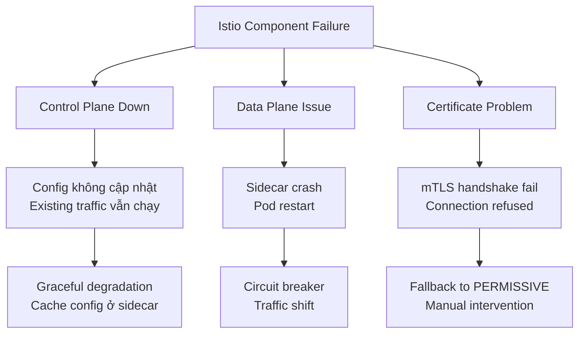

# Istio Deep Dive: Traffic Management, mTLS & Observability

## 1. Mục tiêu của task

Hiểu sâu bản chất Service Mesh thông qua Istio - từ cơ chế traffic management, security model mTLS đến observability stack. Mục tiêu là nắm được **tại sao** Istio được thiết kế như vậy, **trade-off** khi áp dụng, và **rủi ro production** thực tế.

---

## 2. Bản chất và cơ chế hoạt động

### 2.1 Kiến trúc cốt lõi: Sidecar Pattern

Istio triển khai Service Mesh thông qua **sidecar proxy** (Envoy) được inject vào mỗi Pod. Đây là quyết định kiến trúc quan trọng nhất:

```
┌─────────────────────────────────────┐
│              Kubernetes Pod         │
│  ┌─────────────┐  ┌─────────────┐  │
│  │ Application │  │   Envoy     │  │
│  │   (Port)    │◄─┤   Proxy     │  │
│  │             │  │  (Port 15001)│ │
│  └─────────────┘  └──────┬──────┘  │
│                          │         │
│                    iptables/NFT    │
│                    REDIRECT/TPROXY │
└─────────────────────────────────────┘
```

**Cơ chế traffic interception:**

Istio sử dụng `iptables` (hoặc `nftables` từ v1.19+) với `REDIRECT` hoặc `TPROXY` để capture traffic:

| Mechanism | Mô tả | Trade-off |
|-----------|-------|-----------|
| **REDIRECT** | NAT-based, thay đổi destination IP/port | Đơn giản, mất thông tin origin IP |
| **TPROXY** | Transparent proxy, giữ nguyên IP gốc | Phức tạp hơn, cần kernel support, giữ được source IP |
| **EBPF** (Ambient Mode) | Kernel-level redirection, không cần sidecar | Giảm latency, nhưng cần kernel 5.10+, giới hạn một số tính năng |

> **Quan trọng:** Ambient Mesh (beta từ 1.18+) là hướng đi tương lai của Istio - ztunnel chạy ở node-level, waypoint proxy chạy khi cần L7 processing. Điều này giải quyết vấn đề resource overhead của sidecar pattern.

### 2.2 Istio Control Plane

```
┌─────────────────────────────────────────────────────────┐
│                    Istio Control Plane                  │
│  ┌──────────────┐  ┌──────────────┐  ┌──────────────┐  │
│  │   istiod     │  │   istiod     │  │   istiod     │  │
│  │  (Pilot)     │  │  (Citadel)   │  │ (Galley)     │  │
│  │              │  │              │  │              │  │
│  │ • XDS Server │  │ • mTLS certs │  │ • Validation │  │
│  │ • Config     │  │ • Root CA    │  │ • Distribution│ │
│  │   Discovery  │  │ • SPIFFE IDs │  │              │  │
│  └──────┬───────┘  └──────────────┘  └──────────────┘  │
│         │                                               │
│    gRPC/XDS (ADS)                                       │
│         │                                               │
└─────────┼───────────────────────────────────────────────┘
          │
    ┌─────┴─────┐
    ▼           ▼
┌────────┐  ┌────────┐
│ Envoy  │  │ Envoy  │
│Sidecar │  │Sidecar │
└────────┘  └────────┘
```

**Istiod tích hợp 3 thành phần cốt lõi:**

1. **Pilot (XDS Server)**: Cung cấp cấu hình động cho Envoy thông qua XDS APIs:
   - `LDS` (Listener Discovery Service)
   - `RDS` (Route Discovery Service) 
   - `CDS` (Cluster Discovery Service)
   - `EDS` (Endpoint Discovery Service)

2. **Citadel (Certificate Management)**: Tự động rotate TLS certificates, issue SPIFFE identities

3. **Galley (Config Validation)**: Validate và distribute configuration

---

## 3. Traffic Management

### 3.1 Bản chất routing: VirtualService + DestinationRule

Istio triển khai **Layer 7 traffic management** thông qua Envoy's HTTP connection manager. Cơ chế cốt lõi:

**VirtualService** định nghĩa **matching rules** và **routing actions**:

```yaml
apiVersion: networking.istio.io/v1beta1
kind: VirtualService
metadata:
  name: reviews-route
spec:
  hosts:
  - reviews
  http:
  - match:
    - headers:
        end-user:
          exact: jason
    route:
    - destination:
        host: reviews
        subset: v2
  - route:
    - destination:
        host: reviews
        subset: v1
      weight: 90
    - destination:
        host: reviews
        subset: v3
      weight: 10
```

**DestinationRule** định nghĩa **traffic policies** và **subset selection**:

```yaml
apiVersion: networking.istio.io/v1beta1
kind: DestinationRule
metadata:
  name: reviews-destination
spec:
  host: reviews
  trafficPolicy:
    connectionPool:
      tcp:
        maxConnections: 100
      http:
        http1MaxPendingRequests: 50
        maxRequestsPerConnection: 10
    loadBalancer:
      simple: LEAST_REQUEST
    outlierDetection:
      consecutiveErrors: 5
      interval: 30s
      baseEjectionTime: 30s
  subsets:
  - name: v1
    labels:
      version: v1
  - name: v2
    labels:
      version: v2
```

### 3.2 Luồng xử lý request


**Chi tiết từng bước:**

| Stage | Component | Chức năng | Trade-off |
|-------|-----------|-----------|-----------|
| 1. Listener | LDS | Nhận traffic, xác định protocol (HTTP/TCP) | Mỗi port cần 1 listener, tăng memory |
| 2. Route | RDS | HTTP routing, path matching, header manipulation | Regex matching expensive |
| 3. Cluster | CDS | Connection pool, LB policy, health checks | Pool size ảnh hưởng memory |
| 4. Endpoint | EDS | Service discovery, subset selection | Stale endpoint = 503 errors |

### 3.3 Traffic Shifting & Canary Deployment

**Cơ chế weight-based routing:**

Envoy thực hiện weighted routing thông qua **weighted cluster selection**:

```
Tổng weight = 90 (v1) + 10 (v3) = 100
- Random number 0-89 → route đến v1
- Random number 90-99 → route đến v3
```

> **Lưu ý quan trọng:** Weighted routing của Istio là **probabilistic**, không phải **deterministic** dựa trên user. Để sticky canary (cùng user → cùng version), cần dùng **consistent hash** hoặc **header-based routing**.

### 3.4 Circuit Breaker Implementation

Istio circuit breaker dựa trên Envoy's **outlier detection** + **connection pool limits**:

```yaml
trafficPolicy:
  connectionPool:
    http:
      http1MaxPendingRequests: 100    # Hàng đợi pending
      http2MaxRequests: 1000           # Concurrent streams
      maxRequestsPerConnection: 100    # Keep-alive limit
      maxRetries: 3                     # Retry budget
  outlierDetection:
    consecutive5xxErrors: 5            # Ngưỡng error
    interval: 10s                      # Detection window
    baseEjectionTime: 30s              # Thời gian loại ban đầu
    maxEjectionPercent: 50             # % pod có thể loại
```

**Circuit Breaker States:**

```
┌─────────────┐     Error > threshold     ┌─────────────┐
│   CLOSED    │ ────────────────────────► │    OPEN     │
│  (Normal)   │                           │ (Ejecting)  │
└─────────────┘                           └──────┬──────┘
       ▲                                         │
       │         baseEjectionTime * 2^n          │
       └─────────────────────────────────────────┘
                      (Half-open retry)
```

**Trade-off của circuit breaker:**

| Ưu điểm | Nhược điểm |
|---------|------------|
| Fail fast, tránh cascading failure | Có thể eject quá nhiều pod nếu threshold thấp |
| Tự động recovery | Ejection time exponential growth có thể quá lâu |
| Protect downstream services | Không phát hiện slow requests (chỉ detect errors) |

> **Production tip:** Kết hợp outlier detection với **retry budgets** và **timeout** để tránh retry storm.

---

## 4. mTLS & Security Model

### 4.1 SPIFFE/SPIRE Identity Model

Istio sử dụng **SPIFFE** (Secure Production Identity Framework For Everyone) để identity management:

```
SPIFFE ID format: spiffe://<trust-domain>/<workload-identifier>

Ví dụ: spiffe://cluster.local/ns/default/sa/bookinfo-productpage
              │           │      │          │
              │           │      │          └── ServiceAccount
              │           │      └───────────── Namespace
              │           └──────────────────── Trust Domain
              └──────────────────────────────── Scheme
```

**X.509 SVID (SPIFFE Verifiable Identity Document):**

```
Certificate:
    Data:
        Subject: CN = spiffe://cluster.local/ns/default/sa/productpage
        Subject Alternative Name:
            URI:spiffe://cluster.local/ns/default/sa/productpage
    Signature Algorithm: ECDSA-SHA256
    Validity:
        Not Before: Mar 28 08:00:00 2026 GMT
        Not After:  Mar 28 08:00:00 2026 GMT (24h rotation)
```

### 4.2 mTLS Handshake Flow



### 4.3 mTLS Modes

Istio hỗ trợ 3 chế độ mTLS:

| Mode | Mô tả | Use case |
|------|-------|----------|
| **PERMISSIVE** | Accept cả plaintext lẫn mTLS | Migration phase, backward compatibility |
| **STRICT** | Chỉ accept mTLS | Production, full zero-trust |
| **DISABLE** | Không mTLS | Legacy integration, debugging |

```yaml
apiVersion: security.istio.io/v1beta1
kind: PeerAuthentication
metadata:
  name: default
  namespace: production
spec:
  mtls:
    mode: STRICT
```

### 4.4 Authorization Policy

**Authorization** hoạt động **sau khi authentication hoàn tất**:

```yaml
apiVersion: security.istio.io/v1beta1
kind: AuthorizationPolicy
metadata:
  name: productpage-policy
  namespace: default
spec:
  selector:
    matchLabels:
      app: productpage
  action: ALLOW
  rules:
  - from:
    - source:
        principals: ["cluster.local/ns/default/sa/details"]
    to:
    - operation:
        methods: ["GET"]
        paths: ["/api/v1/products/*"]
    when:
    - key: request.headers[x-api-version]
      values: ["v2"]
```

**Evaluation order:**

```
1. DENY policies (short-circuit)
2. ALLOW policies (nếu không match → DENY)
3. Default: ALLOW (nếu không có policy nào)
```

### 4.5 Trade-off Security

| Lựa chọn | Impact |
|----------|--------|
| **PERMISSIVE mode** | Dễ migrate nhưng không có zero-trust |
| **STRICT mode** | Zero-trust nhưng cần rollout cẩn thận |
| **Certificate rotation 1h** | Giảm blast radius nếu key leak, nhưng tăng CA load |
| **Custom CA** | Full control nhưng phải tự quản lý root trust |

---

## 5. Observability Stack

### 5.1 Telemetry Architecture

Istio cung cấp observability qua 3 pillars:

```
┌──────────────────────────────────────────────────────────┐
│                     Istio Mesh                           │
│  ┌──────────┐  ┌──────────┐  ┌──────────┐               │
│  │  Envoy   │  │  Envoy   │  │  Envoy   │               │
│  │  Proxy   │  │  Proxy   │  │  Proxy   │               │
│  └────┬─────┘  └────┬─────┘  └────┬─────┘               │
│       │             │             │                      │
│       ├─────────────┼─────────────┤                      │
│       │   WASM/Stats Extensions     │                    │
│       ▼             ▼             ▼                      │
│  ┌──────────┐  ┌──────────┐  ┌──────────┐               │
│  │Prometheus│  │  Zipkin  │  │  Grafana │               │
│  │ (Metrics)│  │ (Traces) │  │(Dashboard)│              │
│  └──────────┘  └──────────┘  └──────────┘               │
└──────────────────────────────────────────────────────────┘
```

### 5.2 Metrics: RED Method

Istio tự động export **RED metrics** theo mô hình service mesh:

| Metric | Name | Mô tả |
|--------|------|-------|
| **R**equest Rate | `istio_requests_total` | QPS, throughput |
| **E**rror Rate | `istio_requests_total{response_code=~"5.*"}` | % lỗi |
| **D**uration | `istio_request_duration_milliseconds` | P50, P95, P99 latency |

**Metric labels quan trọng:**

```
istio_requests_total{
  reporter="destination",           # source/destination
  source_workload="productpage",
  destination_workload="reviews",
  destination_service="reviews.default.svc.cluster.local",
  response_code="200",
  request_protocol="http"
}
```

> **Production tip:** Cardinality explosion nếu quá nhiều unique values (ví dụ: user_id trong label). Giới hạn custom dimensions.

### 5.3 Distributed Tracing

**Trace propagation:** Istio tự động inject/extract tracing headers:

```
┌──────────────┬────────────────────────────────────────────┐
│ Header       │ Format                                     │
├──────────────┼────────────────────────────────────────────┤
│ x-request-id │ UUID, unique per request                   │
│ x-b3-traceid │ 64-bit/128-bit hex (Zipkin)               │
│ x-b3-spanid  │ Current span ID                           │
│ x-b3-sampled │ 0/1, sampling decision                    │
│ traceparent  │ W3C Trace Context (standard)              │
└──────────────┴────────────────────────────────────────────┘
```

**Sampling strategies:**

| Strategy | Ưu điểm | Nhược điểm |
|----------|---------|------------|
| **Fixed rate** (1%) | Đơn giản, predictable cost | Có thể miss rare errors |
| **Adaptive** (Pilot) | Tự động adjust based on QPS | Phức tạp |
| **Tail-based** | Capture 100% errors | Yêu cầu ingestion pipeline phức tạp |

### 5.4 Access Logging

Istio 1.19+ sử dụng **Telemetry API** thay thế Mixer:

```yaml
apiVersion: telemetry.istio.io/v1alpha1
kind: Telemetry
metadata:
  name: mesh-default
spec:
  accessLogging:
  - providers:
    - name: envoy
    filter:
      expression: "response.code >= 400"
```

---

## 6. So sánh giải pháp

### 6.1 Istio vs Linkerd vs Consul Connect

| Tiêu chí | Istio | Linkerd | Consul Connect |
|----------|-------|---------|----------------|
| **Proxy** | Envoy (C++) | Linkerd-proxy (Rust) | Envoy hoặc built-in |
| **Resource** | Cao (100-150MB/sidecar) | Thấp (10-20MB/sidecar) | Trung bình |
| **Feature set** | Cao nhất | Core features | Tích hợp Consul |
| **Complexity** | Cao | Thấp | Trung bình |
| **mTLS** | SPIFFE/SPIRE | SPIFFE (v2.12+) | Consul CA |
| **Multi-cluster** | Có | Có (phức tạp hơn) | Có |
| **Enterprise** | Tetrate, Solo.io | Buoyant | HashiCorp |

### 6.2 Khi nào chọn Istio?

**Nên dùng Istio khi:**
- Cần advanced traffic management (canary, circuit breaker, retry)
- Multi-cluster/multi-region mesh
- Yêu cầu WASM extensibility
- Cần enterprise support

**Không nên dùng khi:**
- Resource constraints (nhỏ hơn 500MB memory per node)
- Team chưa sẵn sàng cho operational complexity
- Chỉ cần mTLS đơn giản (dùng Linkerd hoặc Cilium)

---

## 7. Rủi ro, Anti-patterns & Pitfalls

### 7.1 Production Issues thường gặp

| Issue | Nguyên nhân | Giải pháp |
|-------|-------------|-----------|
| **503 errors** | Endpoint stale, sidecar chưa nhận update | `holdApplicationUntilProxyStarts`, increase `concurrency` |
| **High latency** | Sidecar processing overhead | Profiling Envoy, reduce regex matching |
| **Memory leak** | Stats cardinality explosion | Giới hạn labels, custom metrics |
| **Certificate expiry** | Citadel CA down, rotation fails | Monitoring cert expiry, backup CA |
| **Config propagation delay** | Large config, slow XDS | Reduce sidecar scope, `Sidecar` resource |

### 7.2 Anti-patterns

**❌ Anti-pattern 1: Wildcard VirtualService**
```yaml
# KHÔNG NÊN: Catch-all route
tcp:
- match:
  - port: 3306
  route:
  - destination:
      host: mysql
```
→ Thay bằng explicit service configuration

**❌ Anti-pattern 2: Over-reliance on retries**
```yaml
retries:
  attempts: 10        # QUÁ NHIỀU
  perTryTimeout: 2s   # Tổng timeout = 20s!
```
→ Retry budget + timeout appropriate

**❌ Anti-pattern 3: No Sidecar resource**
→ Mỗi sidecar nhận toàn bộ mesh config, memory explosion

```yaml
# NÊN: Giới hạn scope
apiVersion: networking.istio.io/v1beta1
kind: Sidecar
metadata:
  name: default
spec:
  egress:
  - hosts:
    - "./*"           # Chỉ services trong namespace
    - "istio-system/*"
```

### 7.3 Failure Modes



---

## 8. Khuyến nghị thực chiến Production

### 8.1 Setup Checklist

- [ ] **Resource limits**: Sidecar 100m CPU / 128Mi memory minimum
- [ ] **Health probes**: Configure proper startup probe cho sidecar
- [ ] **Sidecar scope**: Giới hạn egress hosts trong namespace
- [ ] **mTLS mode**: Start với PERMISSIVE, migrate to STRICT
- [ ] **Circuit breakers**: Cấu hình cho tất cả external calls
- [ ] **Monitoring**: Alert trên 503 rate, p99 latency

### 8.2 Performance Tuning

```yaml
# Sidecar resource optimization
proxy.istio.io/config: |
  concurrency: 2           # Worker threads
  terminationDrainDuration: 30s
  holdApplicationUntilProxyStarts: true
```

### 8.3 Upgrade Strategy

| Version | Canary upgrade | In-place upgrade |
|---------|----------------|------------------|
| Control Plane | ✅ Khuyến nghị | ⚠️ Có thể downtime |
| Data Plane | ✅ Từ từ rollout | ⚠️ Restart required |

---

## 9. Kết luận

**Bản chất của Istio:**

1. **Sidecar proxy** là abstraction layer giữa application và network, cho phép triển khai cross-cutting concerns (security, traffic, observability) **without code change**.

2. **Trade-off chính:** Operational complexity vs. Platform capabilities. Istio cung cấp feature set cao nhất nhưng đòi hỏi investment đáng kể.

3. **mTLS trong Istio** không chỉ là encryption - đó là **identity-based security model** với automatic certificate rotation.

4. **Observability** là first-class citizen: metrics, traces, logs được tự động collect từ data plane.

5. **Hướng tương lai:** Ambient Mesh (sidecar-less) hứa hẹn giảm overhead nhưng vẫn giữ capability.

**Quyết định quan trọng khi áp dụng:**
- Đánh giá kỹ operational cost trước khi adopt
- Start simple, add complexity incrementally
- Invest vào observability từ ngày đầu
- Chuẩn bị runbook cho certificate issues

---

## 10. References

- [Istio Architecture](https://istio.io/latest/docs/ops/deployment/architecture/)
- [Envoy Proxy Documentation](https://www.envoyproxy.io/docs/envoy/latest/)
- [SPIFFE Specification](https://github.com/spiffe/spiffe/blob/main/standards/SPIFFE-ID.md)
- [Istio Ambient Mesh](https://istio.io/latest/docs/ops/ambient/)
- [NIST Zero Trust Architecture](https://www.nist.gov/publications/zero-trust-architecture)
