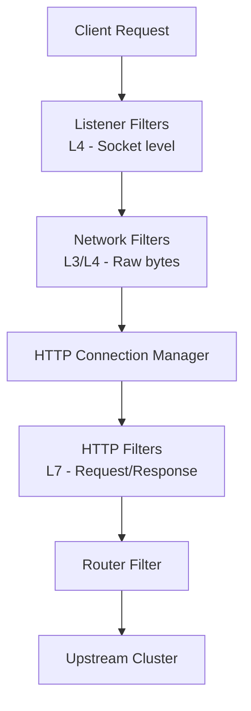
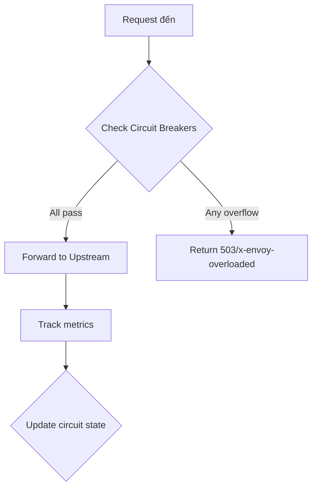
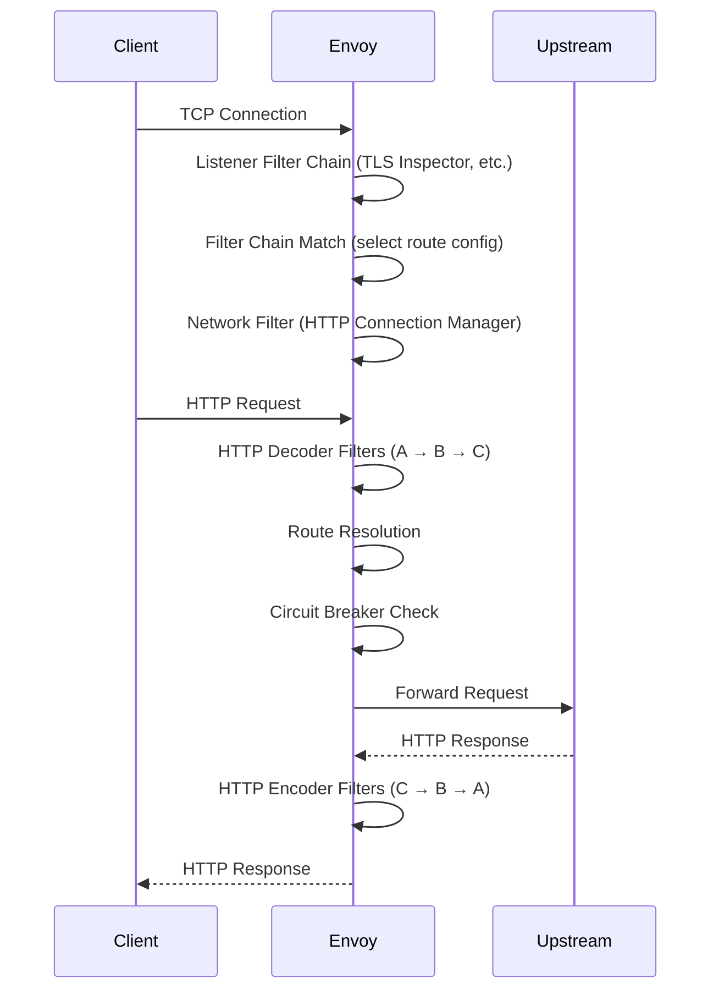
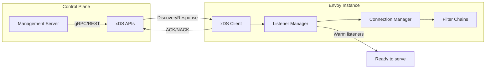

# Envoy Proxy - Configuration, Filters, Circuit Breaking

## 1. Mục tiêu của task

Nghiên cứu bản chất và cơ chế hoạt động của **Envoy Proxy** - một L7 proxy và communication bus được thiết kế cho kiến trúc microservices hiện đại, tập trung vào:
- Kiến trúc cấu hình và cách Envoy xử lý configuration
- Hệ thống Filter chain (L3/L4 và L7)
- Circuit breaking mechanism và các loại circuit breaker
- Production concerns và operational best practices

---

## 2. Bản chất và cơ chế hoạt động

### 2.1. Kiến trúc tổng quan: Out-of-Process Architecture

> **Nguyên tắc cốt lõi**: Network nên transparent đối với applications. Envoy chạy như một self-contained process bên cạnh mỗi application server, tạo thành một transparent communication mesh.

**Tại sao Out-of-Process?**

| Aspect | Library Approach | Envoy Out-of-Process |
|--------|-----------------|---------------------|
| Language support | Mỗi language cần implementation riêng | Language-agnostic, hoạt động với mọi stack (Java, Go, Python, Node.js...) |
| Deployment friction | Upgrade library = redeploy application | Upgrade proxy độc lập, không ảnh hưởng ứng dụng |
| Network topology awareness | Application phải biết topology | Application chỉ gọi `localhost`, Envoy xử lý routing |
| Observability | Cần instrument từng app | Centralized tại network layer |

**Trade-off chính**:
- ✅ **Pros**: Language independence, centralized control, easier upgrades, consistent observability
- ❌ **Cons**: Additional hop latency (~sub-millisecond), resource overhead (memory/cpu per sidecar), operational complexity

### 2.2. Cấu trúc Configuration

Envoy sử dụng **hierarchical configuration** với bootstrap file làm root:

```
Bootstrap Configuration
├── node (identity)
├── static_resources (listeners, clusters, secrets)
├── dynamic_resources (xDS APIs)
├── cluster_manager
├── stats_sinks
├── admin
├── overload_manager
└── tracing
```

**Static vs Dynamic Configuration**:

| Type | Use Case | Update Mechanism |
|------|----------|-----------------|
| Static | Simple deployments, initial cluster cho management server | Restart Envoy |
| Dynamic (xDS) | Production mesh, frequent route changes | Real-time via gRPC/REST APIs (LDS, CDS, RDS, EDS, SDS) |

**Dynamic Configuration APIs (xDS)**:
- **LDS (Listener Discovery Service)**: Cập nhật listeners
- **CDS (Cluster Discovery Service)**: Cập nhật upstream clusters
- **RDS (Route Discovery Service)**: Cập nhật route tables
- **EDS (Endpoint Discovery Service)**: Cập nhật endpoints trong cluster
- **SDS (Secret Discovery Service)**: Cập nhật TLS certificates

> **Production Insight**: Dynamic config cho phép "zero-downtime" updates. Filter chains có thể được update independently mà không cần drain toàn bộ listener.

### 2.3. Filter Architecture

Envoy có **3 tầng filter** hoạt động theo pipeline:



#### 2.3.1. Listener Filters (L4 - Socket Level)

**Mục đích**: Manipulate connection metadata trước khi network filters được chọn.

**Các loại chính**:
- **Original Source Filter**: Preserve source IP (transparent proxying)
- **Proxy Protocol Filter**: Xử lý PROXY protocol header
- **TLS Inspector**: Detect TLS và extract SNI/ALPN để chọn filter chain
- **HTTP Inspector**: Detect HTTP để route đến HTTP connection manager

**Quan trọng**: Listener filters được thực thi trước khi filter chain match diễn ra. Kết quả của listener filter ảnh hưởng đến việc chọn filter chain nào sẽ xử lý connection.

#### 2.3.2. Network Filters (L3/L4)

**API đơn giản**: Operate trên raw bytes + connection events (TLS handshake, disconnect).

**Loại filters**:
- **Read filters**: Khi nhận data từ downstream
- **Write filters**: Khi gửi data đến downstream  
- **Read/Write filters**: Cả hai chiều

**Common Network Filters**:
| Filter | Purpose |
|--------|---------|
| TCP Proxy | Basic 1:1 connection proxy |
| HTTP Connection Manager | Bridge sang HTTP L7 processing |
| MongoDB/Postgres/Redis | Protocol-specific metrics và routing |
| Rate Limit | L4 rate limiting |
| Connection Limit | Giới hạn số connection |

#### 2.3.3. HTTP Filters (L7)

**Filter Chain Processing**:

```
Request Path (Decode):  Filter A → Filter B → Filter C (Router)
Response Path (Encode): Filter C → Filter B → Filter A
```

**Execution Order**:
- **Decoder filters**: Xử lý request (headers → body → trailers)
- **Encoder filters**: Xử lý response (headers → body → trailers)
- **Decoder/Encoder**: Cả request và response

**Key HTTP Filters**:

| Filter | Function | When to Use |
|--------|----------|-------------|
| **Router** | Forward request đến upstream cluster | Required, always last |
| **Buffer** | Buffer request/response body | Cần inspect toàn bộ body |
| **Rate Limit** | Call external rate limiting service | Global rate limiting |
| **Ext Authz** | External authorization (OAuth, JWT, custom) | Centralized auth |
| **Lua** | Script custom logic | Prototyping, simple mutations |
| **Ext Proc** | External processing (gRPC) | Complex request/response transformation |
| **Gzip/Brotli** | Compression | Reduce bandwidth |
| **CORS** | Handle CORS preflight | API Gateway |

**Filter Ordering - Security Consideration**:

> ⚠️ **Critical**: Thứ tự filter quan trọng cho security. Nếu một filter sau `ExtAuthz` gọi `clearRouteCache()`, request có thể match route khác với authorization requirements khác → **Authorization Bypass**.

**Mitigation**:
```
Đúng:  ExtAuthz → Buffer → Transform → Router
Sai:   Buffer → ExtAuthz → Lua (clearRouteCache) → Router
```

### 2.4. Circuit Breaking

**Bản chất**: Circuit breaker là cơ chế **fail-fast** để ngăn cascading failures trong distributed systems. Envoy enforces circuit breaking ở **network level**, không cần code trong ứng dụng.

**6 Loại Circuit Breakers** (theo thứ tự severity):

| Type | Purpose | Counter Overflow |
|------|---------|-----------------|
| **Max Connections** | Giới hạn tổng connections đến cluster | `upstream_cx_overflow` |
| **Max Pending Requests** | Giới hạn requests đang chờ connection pool | `upstream_rq_pending_overflow` |
| **Max Requests** | Giới hạn concurrent requests đến cluster | `upstream_rq_pending_overflow` |
| **Max Active Retries** | Giới hạn concurrent retries | `upstream_rq_retry_overflow` |
| **Max Concurrent Connection Pools** | Giới hạn số connection pools | `upstream_cx_pool_overflow` |
| **Retry Budget** | Dynamic limit dựa trên request rate | - |

**Cơ chế hoạt động**:



**Important Implementation Details**:

1. **Per-cluster, per-priority tracking**: Mỗi cluster có circuit breakers riêng, tracked theo priority (default vs high vs low)

2. **Eventually consistent across workers**: Workers threads share circuit breaker limits nhưng không phải strongly consistent. Nếu limit là 500, worker 1 có 498 connections, worker 2 chỉ có thể allocate 2 connections → **có thể exceed limit nhẹ**

3. **Default values modest** (1024 connections) → **Production cần tuning**

**Retry Budget vs Static Circuit Breaking**:

| Static Retry Limit | Retry Budget |
|-------------------|--------------|
| Fixed number (e.g., max 10 retries) | Percentage of active requests (e.g., 20%) |
| Simple nhưng không adaptive | Scales with traffic volume |
| Risk: Too low = miss sporadic failures; Too high = amplify load | Auto-adjusts to system capacity |
| **Recommendation**: Use for aggressive static limiting | **Recommendation**: Preferred for production |

---

## 3. Kiến trúc và luồng xử lý

### 3.1. Life of a Request



### 3.2. Configuration Update Flow (Dynamic xDS)



**Filter Chain Only Updates**:
- Nếu chỉ filter chains thay đổi (không phải listener metadata), Envoy update incrementally
- Connections của filter chains không thay đổi được giữ nguyên
- Filter chains bị xóa sẽ bị drain gradually

---

## 4. So sánh các lựa chọn

### 4.1. Envoy vs Alternatives

| Aspect | Envoy | Nginx | HAProxy | Traefik |
|--------|-------|-------|---------|---------|
| **Design goal** | Service mesh, cloud-native | Web server/reverse proxy | High-performance load balancer | Cloud-native edge router |
| **API-first** | ✅ Native xDS APIs | ❌ Config files only | ❌ Config files/CLI | ✅ REST API |
| **Hot reload** | ✅ Dynamic config | ⚠️ Signal-based reload | ✅ Dynamic updates | ✅ Dynamic config |
| **Observability** | ✅ Best-in-class (statsd, tracing) | ⚠️ Basic | ✅ Good | ✅ Good |
| **HTTP/2, gRPC** | ✅ First-class | ⚠️ Limited | ✅ Yes | ✅ Yes |
| **Wasm filters** | ✅ Supported | ❌ No | ❌ No | ❌ No |
| **Learning curve** | Steep | Moderate | Moderate | Low |
| **Resource usage** | Higher | Lower | Low | Moderate |

### 4.2. When to Use / When NOT to Use Envoy

**✅ Use Envoy when**:
- Building service mesh (Istio, Consul Connect)
- Cần advanced traffic management (circuit breaking, retry, rate limiting)
- Multi-language microservices environment
- Cần deep observability (distributed tracing, detailed metrics)
- Dynamic routing requirements

**❌ DON'T use Envoy when**:
- Simple reverse proxy needs (Nginx đủ)
- Tight resource constraints (embedded, IoT)
- Single-language monolith (library approach simpler)
- Team không có bandwidth để học và operate

---

## 5. Rủi ro, Anti-patterns, Lỗi thường gặp

### 5.1. Configuration Pitfalls

**1. Filter Order Security Bug**:
```yaml
# ❌ BAD: Authorization có thể bị bypass
http_filters:
  - ext_authz
  - lua  # lua gọi clearRouteCache() → route khác, auth bị skip
  - router

# ✅ GOOD: Auth luôn sau cùng
http_filters:
  - lua
  - ext_authz  # Auth chạy sau khi mọi mutation hoàn tất
  - router
```

**2. Circuit Breaker Tuning**:
```yaml
# ❌ BAD: Defaults hoặc quá cao
circuit_breakers:
  thresholds:
    - priority: DEFAULT
      max_connections: 1024  # Quá cao cho downstream issue

# ✅ GOOD: Tune theo actual capacity
circuit_breakers:
  thresholds:
    - priority: DEFAULT
      max_connections: 100   # Giới hạn realistic
      max_pending_requests: 50
      max_retries: 3
```

**3. Connection Pool Configuration**:
- Không cấu hình `max_requests_per_connection` cho HTTP/2 → connections sống mãi
- Không set `idle_timeout` → resource leak
- HTTP/1.1 vs HTTP/2 pool configuration khác nhau cần hiểu rõ

### 5.2. Operational Issues

**Memory Bloat**:
- Envoy giữ stats cho mọi cluster x mọi endpoint
- 1000 services × 10 pods × 100 metrics = 1M+ time series
- **Solution**: Stats pruning, cluster subsetting

**CPU Spike trên config update**:
- Large config updates trigger full rebuild
- **Solution**: Delta xDS, filter chain only updates

**Circuit Breaker Thundering Herd**:
- Khi circuit mở, tất cả requests fail nhanh
- Retry logic amplify load
- **Solution**: Retry budgets, exponential backoff, jitter

### 5.3. Debugging Techniques

**Admin Interface**:
```
/config_dump - Full effective config
/clusters - Cluster status, health, circuit breaker state
/stats/prometheus - Metrics
/logging - Runtime log level changes
```

**Key Metrics to Monitor**:
- `upstream_cx_overflow` - Circuit breaker triggered
- `upstream_rq_pending_overflow` - Request queue full
- `upstream_rq_retry_overflow` - Retry limit hit
- `upstream_rq_time` - Latency distribution

---

## 6. Khuyến nghị thực chiến trong Production

### 6.1. Configuration Best Practices

**1. Layered Configuration**:
```yaml
# Bootstrap: Static bootstrap cho management server connection
static_resources:
  clusters:
    - name: xds_cluster
      # Connection to control plane

# Dynamic: Mọi thứ khác via xDS
dynamic_resources:
  cds_config:
    resource_api_version: V3
    api_config_source:
      api_type: GRPC
      grpc_services:
        - envoy_grpc:
            cluster_name: xds_cluster
```

**2. Health Checking Strategy**:
- **Active health checks**: Phát hiện nhanh failures
- **Passive (outlier detection)**: Detect based on error rates
- **Combine**: Union của service discovery + health checking

**3. Circuit Breaker Defaults cho Production**:
```yaml
circuit_breakers:
  thresholds:
    - priority: DEFAULT
      max_connections: 100
      max_pending_requests: 50
      max_requests: 100
      max_retries: 3
      retry_budget:
        budget_percent:
          value: 20.0  # 20% of active requests
        min_retry_concurrency: 10
```

### 6.2. Observability Setup

**Stats Configuration**:
```yaml
stats_sinks:
  - name: envoy.stat_sinks.statsd
    typed_config:
      '@type': type.googleapis.com/envoy.config.metrics.v3.StatsdSink
      address:
        socket_address:
          address: statsd
          port_value: 8125
stats_flush_interval: 5s
```

**Distributed Tracing**:
```yaml
tracing:
  http:
    name: envoy.tracers.zipkin
    typed_config:
      '@type': type.googleapis.com/envoy.config.trace.v3.ZipkinConfig
      collector_cluster: zipkin
      collector_endpoint: /api/v2/spans
```

**Access Logging**:
```yaml
access_log:
  - name: envoy.access_loggers.file
    typed_config:
      '@type': type.googleapis.com/envoy.extensions.access_loggers.file.v3.FileAccessLog
      path: /var/log/envoy/access.log
      log_format:
        json_format:
          timestamp: '%START_TIME%'
          method: '%REQ(:METHOD)%'
          path: '%REQ(X-ENVOY-ORIGINAL-PATH?:PATH)%'
          response_code: '%RESPONSE_CODE%'
          duration: '%DURATION%'
          upstream_host: '%UPSTREAM_HOST%'
```

### 6.3. Security Checklist

- ✅ TLS termination certificates via SDS (rotation tự động)
- ✅ mTLS giữa services (client certificates)
- ✅ RBAC filter cho authorization
- ✅ Rate limiting chống abuse
- ✅ Overload manager để protect proxy itself
- ✅ External authorization cho complex auth logic

---

## 7. Kết luận

**Bản chất của Envoy** là một **universal data plane** - layer abstraction giữa application và network, cung cấp:

1. **Traffic Management**: Routing, load balancing, circuit breaking, retries
2. **Observability**: Metrics, logging, distributed tracing tập trung
3. **Security**: mTLS, authentication, authorization, rate limiting
4. **Extensibility**: Filter chain architecture cho phép customize mà không sửa core

**Trade-off cốt lõi**: Envoy đánh đổi **resource overhead và complexity** lấy **consistency, observability, và control** trong distributed systems.

**Khi nào dùng**: Multi-language microservices, dynamic environments (Kubernetes), nơi network observability và traffic control là critical.

**Khi nào không dùng**: Simple use cases, tight constraints, teams không sẵn sàng invest vào operational complexity.

> **Chốt lại**: Envoy không phải silver bullet. Nó là công cụ powerful cho specific problem domain - making the network transparent và manageable trong large-scale distributed systems.
