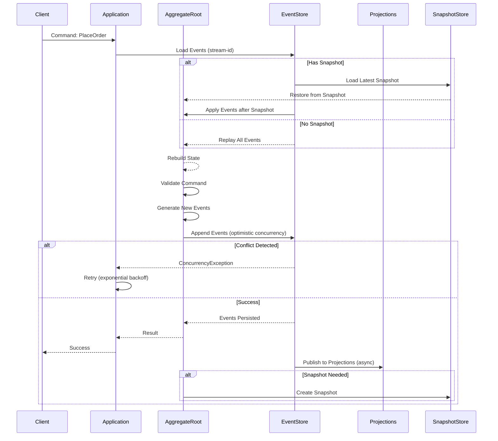

# Event Sourcing Patterns: Aggregate Versioning, Event Versioning, Snapshots

## 1. Mục tiêu của Task

Hiểu sâu bản chất Event Sourcing (ES) ở tầng kiến trúc hệ thống phân tán, tập trung vào 3 vấn đề cốt lõi:
- **Aggregate Versioning**: Quản lý thay đổi cấu trúc Aggregate qua thởi gian
- **Event Versioning**: Xử lý thay đổi schema của Event khi hệ thống evolve
- **Snapshots**: Tối ưu hóa performance khi reconstruct Aggregate từ event stream dài

> **Core Principle**: Event Sourcing không chỉ là "lưu lịch sử thay đổi" — đó là **single source of truth** dưới dạng immutable event stream, từ đó reconstruct toàn bộ trạng thái hệ thống.

---

## 2. Bản Chất và Cơ Chế Hoạt Động

### 2.1 Event Sourcing Architecture

```
┌─────────────────────────────────────────────────────────────────┐
│                        EVENT STORE                              │
│  ┌─────────────────────────────────────────────────────────┐   │
│  │  Event Stream: Order-123                                │   │
│  │  ─────────────────────────────────────────────────────  │   │
│  │  [1] OrderCreated        {orderId, customerId, items}   │   │
│  │  [2] ItemAdded           {productId, quantity, price}   │   │
│  │  [3] ShippingAddressSet  {address, contact}             │   │
│  │  [4] PaymentProcessed    {amount, method, txnId}        │   │
│  │  [5] OrderShipped        {trackingNumber, carrier}      │   │
│  └─────────────────────────────────────────────────────────┘   │
│                            ↑                                    │
│                    ┌───────┴───────┐                           │
│                    │  Aggregate    │                           │
│                    │  (Order)      │                           │
│                    └───────┬───────┘                           │
│                            ↓                                    │
│                    Current State                                │
└─────────────────────────────────────────────────────────────────┘
```

**Bản chất cơ chế**:
- Event là **immutable** — không bao giờ delete hay update
- Aggregate được reconstruct bằng cách **replay** toàn bộ events theo sequence
- Event Store đảm bảo **total ordering** trong mỗi stream (optimistic concurrency via version)

### 2.2 Aggregate Versioning

**Vấn đề**: Aggregate là domain model — nó **thay đổi** khi business evolve.

**Mechanism**: Mỗi Aggregate instance mang theo **version** (sequence number của event cuối cùng đã apply).

```
Optimistic Concurrency Control (OCC):

Client A: Read Aggregate v5 → Add Event → Save v6
                              ↓
Client B: Read Aggregate v5 → Add Event → Save v6 ❌ CONFLICT!
                                              
Event Store: Version 5 exists, expected 6, got 6 (duplicate) → Reject
```

**Bản chất**: Version là **logical clock** cho mỗi Aggregate instance, đảm bảo linearizability trong concurrent writes.

**Trade-offs của OCC**:

| Aspect | Optimistic | Pessimistic |
|--------|-----------|-------------|
| Performance | High throughput, no locking | Lock overhead, contention |
| Conflict Rate | Tốt khi conflict hiếm | Cần thiết khi conflict cao |
| Retry Logic | Client phải handle retry | Blocking, no retry needed |
| Scalability | Horizontal scaling friendly | Distributed locks phức tạp |

> **Rule of Thumb**: Dùng OCC cho Event Sourcing vì events thường được append, không modify — conflict rate thấp trong hầu hết domains.

### 2.3 Event Versioning (Schema Evolution)

**Vấn đề thực tế**: Event schema thay đổi — thêm field, đổi tên, split/merge events.

**Ví dụ**: Event `OrderCreated` từ v1 → v2:
```json
// v1 (2022)
{
  "eventType": "OrderCreated",
  "orderId": "ORD-123",
  "customerId": "CUST-456",
  "items": [...]
}

// v2 (2024) - Thêm shippingMethod, đổi items structure
{
  "eventType": "OrderCreated",
  "version": 2,
  "orderId": "ORD-123", 
  "customerId": "CUST-456",
  "items": [...],
  "shippingMethod": "EXPRESS"  // NEW FIELD
}
```

**3 Strategies cho Event Versioning**:

#### Strategy 1: Upcasting (Runtime Transformation)
```
┌─────────────────┐     ┌─────────────────┐     ┌─────────────────┐
│   Event v1      │────→│   Upcaster      │────→│   Event v2      │
│   (on disk)     │     │   (transform)   │     │   (in memory)   │
└─────────────────┘     └─────────────────┘     └─────────────────┘
```

- **Khi dùng**: Schema changes đơn giản (thêm field, rename)
- **Cách làm**: Register upcaster chain, transform khi deserialize
- **Trade-off**: Runtime overhead, complexity tăng theo số versions

#### Strategy 2: Event Migration (Eager Rewrite)
```
┌─────────────────┐     ┌─────────────────┐     ┌─────────────────┐
│   Event v1      │────→│   Migration     │────→│   Event v2      │
│   (old stream)  │     │   (background)  │     │   (new stream)  │
└─────────────────┘     └─────────────────┘     └─────────────────┘
```

- **Khi dùng**: Major schema changes, cleanup legacy
- **Cách làm**: Tạo stream mới, migrate data, switchover
- **Trade-off**: Downtime hoặc dual-write complexity, có thể rollback

#### Strategy 3: Polyglot Events (Multiple Schemas)
```
Event Store chứa song song:
- OrderCreated_v1 (old clients)
- OrderCreated_v2 (new clients)
- Both map về cùng domain concept
```

- **Khi dùng**: Dịch vụ khác nhau cần different views của cùng event
- **Trade-off**: Storage overhead, deserialization complexity

**Recommendation**:
- **Start với Upcasting** — đơn giản, non-destructive
- **Plan cho Migration** — khi upcaster chain quá dài (>5 versions)
- **Polyglot chỉ khi cần** — cross-team boundaries

### 2.4 Snapshots

**Vấn đề**: Event stream dài → Reconstruct Aggregate chậm (O(n) events).

**Ví dụ thực tế**: Bank account với 10 năm transactions = ~10,000 events. Reconstruct 10K events chỉ để check balance là lãng phí.

**Cơ chế Snapshot**:

```
Event Stream (10,000 events):
├─ [1-5000]   Old events
├─ [SNAPSHOT] State at v5000  ←───┐
└─ [5001-10000] Recent events     │
                                  │
Reconstruct:                     │
  1. Load SNAPSHOT (v5000)    ────┘
  2. Apply [5001-10000] (500 events)
  3. Result: Same as replaying 10,000
```

**Snapshot Strategy**:

| Strategy | Trigger Condition | Pros | Cons |
|----------|------------------|------|------|
| **Count-based** | Every N events | Predictable, simple | Không consider event size |
| **Time-based** | Every T time units | Consistent staleness | Snapshot có thể outdated |
| **Size-based** | When stream > threshold | Optimal for large events | Hard to predict |
| **On-demand** | When query slow | Adaptive | First query always slow |

**Critical Decision**: **Snapshot không phải source of truth** — nó là cache có thể regenerate. Nếu snapshot corrupt, delete và rebuild từ events.

---

## 3. Kiến Trúc và Luồng Xử Lý

### 3.1 Complete Event Sourcing Flow



### 3.2 Event Store Schema Design

**Bản chất**: Event Store là **append-only log** với 2 index chính:

```sql
-- PostgreSQL/CockroachDB-style
CREATE TABLE events (
    stream_id VARCHAR(255) NOT NULL,      -- Aggregate instance ID
    version INT NOT NULL,                  -- Sequence trong stream
    event_type VARCHAR(255) NOT NULL,      -- FQCN hoặc event name
    payload JSONB NOT NULL,                -- Event data
    metadata JSONB,                        -- Correlation, causation IDs
    timestamp TIMESTAMPTZ DEFAULT now(),
    PRIMARY KEY (stream_id, version)       -- Optimistic concurrency
);

CREATE INDEX idx_events_global ON events(timestamp, stream_id, version);
-- Cho event bus: read tất cả events theo thởi gian
```

**Key Design Decisions**:

1. **Global Ordering**: `timestamp` không đảm bảo total order giữa streams. Cần `global_position` (sequence toàn hệ thống) nếu cần cross-stream ordering.

2. **Event Size**: Payload nên < 1MB. Large binary data (images, files) → lưu reference, không lưu trực tiếp.

3. **Metadata**: Bắt buộc có `correlation_id` và `causation_id` cho distributed tracing.

---

## 4. So Sánh Các Lựa Chọn

### 4.1 Event Sourcing vs State-Based Persistence

| Dimension | Event Sourcing | State-Based (CRUD) |
|-----------|---------------|-------------------|
| **Audit Trail** | Built-in, complete | Requires manual logging |
| **Temporal Queries** | Natural ("what was state at T?") | Complex, requires history tables |
| **Debugging** | Replay events to reproduce | Harder to reconstruct |
| **Complexity** | High learning curve, complex infra | Simple, familiar |
| **Storage** | Append-only grows fast | Update-in-place, compact |
| **Query Performance** | Requires projections/CQRS | Direct, no indirection |
| **Team Experience** | Needs training | Standard skillset |

### 4.2 When to Use Event Sourcing

**Strong Fit**:
- Audit là mandatory (finance, healthcare, legal)
- Complex domains với business rules thay đổi theo thởi gian
- Need temporal analysis ("How did we get here?")
- Event-driven microservices integration
- Saga/CQRS patterns

**Poor Fit**:
- CRUD simple, không có audit requirements
- Team chưa sẵn sàng cho complexity
- Read-heavy workloads không cần audit
- Small data, short-lived entities

### 4.3 Versioning Strategies Comparison

```
┌─────────────────────────────────────────────────────────────────┐
│                    VERSIONING STRATEGY MAP                      │
├─────────────────────────────────────────────────────────────────┤
│                                                                 │
│  Schema Change Complexity                                       │
│       ↑                                                         │
│  High │                    ┌──────────────┐                    │
│       │                    │   Migration  │                    │
│       │                    │   (Rewrite)  │                    │
│       │                    └──────────────┘                    │
│       │                           │                            │
│  Med  │         ┌────────────────┼────────────────┐            │
│       │         ↓                ↓                ↓            │
│       │    ┌─────────┐      ┌─────────┐      ┌─────────┐       │
│       │    │ Polyglot│      │Upcasting│      │Polyglot │       │
│       │    │ Events  │      │+ Trans  │      │+ Adapters│       │
│       │    └─────────┘      └─────────┘      └─────────┘       │
│       │                                                         │
│  Low  │    ┌─────────────────────────────────────────────┐      │
│       │    │         Simple Upcasting                    │      │
│       │    │    (Add field, rename with @JsonAlias)      │      │
│       │    └─────────────────────────────────────────────┘      │
│       └────────────────────────────────────────────────────→    │
│                Event Volume / History Length                    │
│                   Small                    Large                │
│                                                                 │
└─────────────────────────────────────────────────────────────────┘
```

---

## 5. Rủi Ro, Anti-Patterns, Lỗi Thường Gặp

### 5.1 Critical Anti-Patterns

#### ❌ Anti-Pattern 1: External System Calls trong Aggregate
```java
// KHÔNG BAO GIỜ làm điều này
public class Order extends AggregateRoot {
    public void processPayment() {
        // ❌ External call trong domain logic
        PaymentResult result = paymentGateway.charge(...); 
        if (result.isSuccess()) {
            apply(new PaymentProcessed(...));
        }
    }
}
```

**Why**: Events phải **deterministic** — replay 10 lần phải cho cùng kết quả. External calls là non-deterministic.

**Fix**: Saga/Orchestration pattern — command gửi event, external handler xử lý async, gửi event kết quả về.

#### ❌ Anti-Pattern 2: Mutable Events
```java
// ❌ Event là mutable object
public class OrderCreated {
    private List<Item> items; // Mutable list!
    
    public List<Item> getItems() { 
        return items; // ❌ Expose mutable reference
    }
}
```

**Why**: Event Store là immutable log. Nếu event bị modify sau khi publish, replay sẽ cho kết quả khác.

**Fix**: Immutable objects, defensive copies, final fields.

#### ❌ Anti-Pattern 3: Event as API Contract
```
Dịch vụ A publish: OrderCreated
Dịch vụ B subscribe trực tiếp

→ A change event schema → B break
```

**Why**: Event schema là **internal implementation detail** của Aggregate.

**Fix**: Anti-corruption layer — internal events → public integration events (hoặc dùng schema registry).

### 5.2 Failure Modes

#### ⚠️ Conflict Storm (Thundering Herd)
**Scenario**: Hot aggregate (ví dụ: flash sale product inventory) với 1000 concurrent updates.

**Problem**: 99% requests fail với concurrency conflict, liên tục retry → system overload.

**Mitigations**:
- **Command Deduplication**: Client gửi idempotent key
- **Backpressure**: Rate limit per aggregate
- **Shedding**: Tạm reject requests khi conflict rate > threshold
- **Optimistic batching**: Buffer và merge compatible commands

#### ⚠️ Snapshot Drift
**Scenario**: Snapshot được tạo tại version N, nhưng một event được insert vào giữa stream (manual fix).

**Problem**: Snapshot không còn valid — reconstruct từ snapshot sẽ miss event.

**Mitigation**: 
- Không bao giờ manually modify event stream
- Nếu cần fix, append compensating event
- Validate snapshot: checksum của events từ snapshot.version → current

#### ⚠️ Event Version Hell
**Scenario**: 5 năm development, 50 versions của cùng event type, upcaster chain dài và phức tạp.

**Mitigation**:
- **Migration strategy**: Periodic rewrite old streams
- **Bounded context split**: New context với new event model
- **Snapshot isolation**: Old events → snapshot → new stream starts fresh

---

## 6. Khuyến Nghị Thực Chiến trong Production

### 6.1 Technology Stack (Java Ecosystem)

| Component | Recommendation | Rationale |
|-----------|---------------|-----------|
| **Event Store** | PostgreSQL / CockroachDB / EventStoreDB | PostgreSQL: proven, good JSONB; EventStoreDB: purpose-built |
| **Framework** | Axon Framework / Eventuate / DIY | Axon: full-featured, enterprise; DIY: flexibility, less magic |
| **Serialization** | Avro / Protobuf + Schema Registry | Schema evolution built-in, compact |
| **Snapshots** | Redis / PostgreSQL | Redis: fast; PostgreSQL: transactional consistency |
| **Projections** | Read replicas / Elasticsearch / Materialized Views | Depends on query patterns |

### 6.2 Observability

**Mandatory Metrics**:
```
es_aggregate_rebuild_duration_seconds{aggregate_type}  # P95 < 100ms
es_event_append_duration_seconds                       # P95 < 10ms  
es_snapshot_creation_duration_seconds
es_concurrent_modification_exceptions_total           # Alert if > 1%
es_projection_lag_seconds                             # Alert if > 5s
```

**Tracing**: Mỗi event phải carry:
- `correlation_id`: End-to-end request trace
- `causation_id`: ID của event/command trigger event này

### 6.3 Operational Runbooks

**Scenario 1: Aggregate Rebuild Timeout**
```bash
# Diagnose
1. Check stream length: SELECT COUNT(*) FROM events WHERE stream_id = ?
2. If > 1000 events without snapshot:
   - Force snapshot creation
   - Review snapshot frequency config
3. Consider archive: old events → cold storage, snapshot = new baseline
```

**Scenario 2: Event Schema Mismatch**
```bash
# Deserialize error in production
1. Log event_id, stream_id, event_type
2. Implement emergency upcaster
3. Deploy hotfix
4. Replay failed projections
```

### 6.4 Java 21+ Considerations

**Virtual Threads** (Project Loom):
- Aggregate reconstruction I/O-bound → dùng virtual threads
- Nhưng cẩn thận: Event Store driver phải support

**Records cho Events**:
```java
// Java 16+ immutable events
public record OrderCreated(
    OrderId orderId,
    CustomerId customerId,
    List<OrderItem> items,
    Instant occurredOn
) implements DomainEvent {}
```

**Pattern Matching for Event Handling**:
```java
// Java 21 switch expression
public void apply(DomainEvent event) {
    switch (event) {
        case OrderCreated created -> handle(created);
        case ItemAdded added -> handle(added);
        case OrderShipped shipped -> handle(shipped);
        default -> throw new UnknownEventException(event);
    }
}
```

---

## 7. Kết Luận

### Bản Chất Cốt Lõi

Event Sourcing là **functional core** của hệ thống:
- **State = fold(events, initialState, apply)**
- **No mutable state** — mọi thay đổi là event append
- **Time is a first-class concept** — history là data, không phải metadata

### Key Trade-offs

| Decision | Trade-off |
|----------|-----------|
| **Event Sourcing vs CRUD** | Audit completeness + temporal query ↔ Complexity + learning curve |
| **Upcasting vs Migration** | Flexibility + no downtime ↔ Simplicity + storage efficiency |
| **Snapshot frequency** | Rebuild performance ↔ Storage + snapshot management overhead |
| **OCC vs Locking** | Scalability ↔ Conflict handling complexity |

### When to Apply

**Dùng Event Sourcing khi**:
- Audit trail là business requirement (không phải nice-to-have)
- Domain có temporal dimension quan trọng
- Team đã có experience với DDD và distributed systems
- Infrastructure budget cho phép (projections, snapshots, monitoring)

**Không dùng khi**:
- Simple CRUD đáp ứng đủ nghiệp vụ
- Team chưa sẵn sàng cho operational complexity
- Performance requirements không cho phép eventual consistency của projections

### Final Thought

> Event Sourcing không phải default pattern — nó là **scalpel, không phải hammer**. Dùng khi bạn cần audit, temporal analysis, và event-driven integration. Đừng dùng vì nó "cool" hay "modern". Complexity cost là real và ongoing.

---

## 8. References

1. **"Implementing Domain-Driven Design"** — Vaughn Vernon (Aggregate + Event Sourcing chapters)
2. **"Exploring CQRS and Event Sourcing"** — Microsoft patterns & practices
3. **Axon Framework Reference Guide** — axoniq.io
4. **Event StoreDB Documentation** — eventstore.com
5. **"Versioning in an Event Sourced System"** — Greg Young (leanpub)
6. **"Designing Event-Driven Systems"** — Ben Stopford (Confluent)

---

*Research completed: 2026-03-28*
*Author: Senior Backend Architect*
