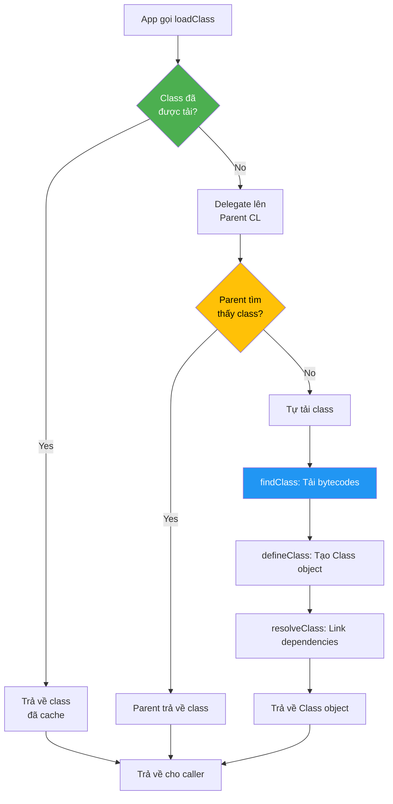

# ClassLoader Hierarchy: Bản Chất và Thực Chiến

## 1. Mục tiêu của Task

Hiểu sâu cơ chế phân cấp ClassLoader trong JVM - không chỉ dừng ở việc nhớ tên 3 loại ClassLoader, mà là thấu hiểu:
- Vì sao Java thiết kế theo mô hình phân cấp (Delegation Model)
- Cơ chế tải class xảy ra như thế nào ở tầng bytecode
- Ứng dụng thực tế: hot-reload, plugin architecture, isolation
- Rủi ro production: ClassNotFoundException, NoClassDefFoundError, LinkageError, memory leak

---

## 2. Bản Chất và Cơ Chế Hoạt động

### 2.1. Vấn đề cốt lõi ClassLoader giải quyết

Java cần đảm bảo **type safety** và **namespace isolation**:
- Cùng một class `com.example.User` được tải bởi 2 ClassLoader khác nhau = 2 type hoàn toàn khác nhau
- Điều này cho phép:
  - Chạy nhiều version của cùng một library trong cùng JVM
  - Hot-reload code mà không restart JVM
  - Plugin architecture với isolation giữa các module

> **Bản chất:** ClassLoader là một namespace manager. Nó quản lý "vùng đất" riêng cho các class, đảm bảo class từ nguồn A không thể truy cập trực tiếp class từ nguồn B trừ khi được exposed qua well-defined interface.

### 2.2. Delegation Model - "Cha trước, con sau"

```
┌─────────────────────────────────────────────────────────────┐
│                    ClassLoader Hierarchy                     │
├─────────────────────────────────────────────────────────────┤
│                                                              │
│  ┌──────────────────────┐                                   │
│  │  Bootstrap CL        │  ← Tải core Java (rt.jar, etc.)   │
│  │  (Native C++)        │    Không phải Java object!        │
│  └──────────┬───────────┘                                   │
│             │ delegates                                      │
│             ▼                                                │
│  ┌──────────────────────┐                                   │
│  │  Platform CL         │  ← Tải platform extensions        │
│  │  (Java 9+)           │    (trước: Extension CL)          │
│  └──────────┬───────────┘                                   │
│             │ delegates                                      │
│             ▼                                                │
│  ┌──────────────────────┐                                   │
│  │  Application CL      │  ← Tải classpath ứng dụng         │
│  │  (System CL)         │    -cp, -classpath                │
│  └──────────┬───────────┘                                   │
│             │ delegates                                      │
│             ▼                                                │
│  ┌──────────────────────┐                                   │
│  │  Custom CL           │  ← URLClassLoader, plugin CL...   │
│  └──────────────────────┘                                   │
│                                                              │
└─────────────────────────────────────────────────────────────┘
```

**Quy tắc Delegation:**
1. Trước khi tự tải class, ClassLoader **phải** delegate lên parent
2. Chỉ khi parent không tìm thấy class, child mới được phép tải
3. Đảm bảo core Java classes (String, Object...) chỉ được tải bởi Bootstrap CL

> **Tại sao?** Để tránh **ClassCastException** do version mismatch. Ví dụ: Nếu 2 ClassLoader khác nhau tải `com.mysql.Driver`, driver từ ClassLoader A không thể cast sang driver từ ClassLoader B dù cùng fully-qualified name.

### 2.3. Cơ chế tải class - 3 bước chính

```
loadClass(String name) {
    1. findLoadedClass(name)     ← Đã tải chưa? (cache)
    2. parent.loadClass(name)    ← Delegate lên cha
    3. findClass(name)           ← Tự tải nếu cha fail
}
```

**Chi tiết từng bước:**

| Bước | Phương thức | Mục đích | Rủi ro |
|------|-------------|----------|--------|
| 1 | `findLoadedClass()` | Kiểm tra cache nội bộ | Nếu class đã tải với version khác, không reload được |
| 2 | `parent.loadClass()` | Delegation | Nếu parent tìm thấy class cũ, child không override được |
| 3 | `findClass()` | Tải từ source riêng | URL không đúng, file corrupt, bytecode invalid |

> **Lưu ý quan trọng:** ClassLoader **không unload class**. Một khi class đã được tải, nó tồn tại đến khi ClassLoader bị garbage collected. Đây là cơ chế để hot-reload: tạo ClassLoader mới thay vì unload class cũ.

### 2.4. ClassLoader vs Class Identity

```java
// Đoạn code này minh họa bản chất namespace isolation
ClassLoader cl1 = new URLClassLoader(new URL[]{jarUrl});
ClassLoader cl2 = new URLClassLoader(new URL[]{jarUrl});

Class<?> classA = cl1.loadClass("com.example.Service");
Class<?> classB = cl2.loadClass("com.example.Service");

System.out.println(classA == classB);  // FALSE!
System.out.println(classA.equals(classB));  // FALSE!

// Cast sẽ throw ClassCastException!
Object instanceA = classA.getDeclaredConstructor().newInstance();
Object instanceB = classB.cast(instanceA);  // ❌ ClassCastException
```

**Hệ quả:**
- `instanceof` check thất bại giữa object từ different ClassLoader
- Reflection cache có thể trỏ đến class cũ sau hot-reload
- Static fields được "reset" vì là class mới hoàn toàn

---

## 3. Kiến trúc và Luồng Xử Lý

### 3.1. Ba ClassLoader chuẩn trong JVM

```
┌────────────────────────────────────────────────────────────────┐
│ Bootstrap ClassLoader                                          │
├────────────────────────────────────────────────────────────────┤
│ • Triển khai: Native code (C++), không phải Java class         │
│ • Scope: <JAVA_HOME>/lib (rt.jar, tools.jar pre-Java 9)        │
│ • Class: Không thể lấy reference (getParent() trả về null)     │
│ • Nhiệm vụ: Tải core Java classes (java.lang.*, java.util.*)   │
│                                                                │
│ Java 9+ Module System:                                         │
│ • Bootstrap CL tải từ jimage (runtime image) thay vì rt.jar    │
│ • Platform classes trong java.base, java.logging, etc.         │
└────────────────────────────────────────────────────────────────┘

┌────────────────────────────────────────────────────────────────┐
│ Platform ClassLoader (Java 9+) / Extension CL (Java 8-)        │
├────────────────────────────────────────────────────────────────┤
│ • Triển khai: Java class (sun.misc.Launcher$ExtClassLoader)    │
│ • Scope: <JAVA_HOME>/lib/ext, hoặc java.ext.dirs               │
│ • Nhiệm vụ: Tải platform extensions (security providers, etc.) │
│                                                                │
│ Java 9 Migration:                                              │
│ • Extension mechanism bị remove                                │
│ • Platform CL là parent của App CL, không còn ext dir          │
└────────────────────────────────────────────────────────────────┘

┌────────────────────────────────────────────────────────────────┐
│ Application ClassLoader (System CL)                            │
├────────────────────────────────────────────────────────────────┤
│ • Triển khai: sun.misc.Launcher$AppClassLoader                 │
│ • Scope: -cp, -classpath, CLASSPATH env var, -jar              │
│ • Nhiệm vụ: Tải application classes                            │
│ • Đây là context ClassLoader của main thread                   │
└────────────────────────────────────────────────────────────────┘
```

### 3.2. Luồng tải class điển hình



### 3.3. Thread Context ClassLoader

Mỗi Thread có một `contextClassLoader` riêng, có thể khác với CL của class đang chạy:

```java
// Framework code (loaded by App CL)
public class Framework {
    public void executeCallback(Runnable callback) {
        // callback đến từ plugin (loaded by Custom CL)
        // Nhưng framework chỉ thấy classes từ App CL!
        
        // Giải pháp: dùng Thread context CL
        ClassLoader original = Thread.currentThread().getContextClassLoader();
        try {
            Thread.currentThread().setContextClassLoader(
                callback.getClass().getClassLoader()
            );
            callback.run();
        } finally {
            Thread.currentThread().setContextClassLoader(original);
        }
    }
}
```

**Use case quan trọng:**
- SPI (Service Provider Interface): `ServiceLoader` dùng context CL
- JNDI, JDBC, JAXP: framework cần load implementation classes
- OSGi, Java EE: component isolation với delegation

---

## 4. So Sánh Các Lựa Chọn Triển Khai

### 4.1. Kế thừa ClassLoader vs URLClassLoader

| Tiêu chí | Kế thừa `ClassLoader` | `URLClassLoader` |
|----------|----------------------|------------------|
| **Mức độ kiểm soát** | Cao - override tất cả | Trung bình - chỉ định URLs |
| **Độ phức tạp** | Cao - phải tự implement `findClass()` | Thấp - sẵn dùng |
| **Flexibility** | Tối đa - có thể tải từ DB, network, encrypted source | Hạn chế - chỉ từ URL/FILE |
| **Use case** | Plugin system, hot-reload, custom protocol | Đơn giản, external JARs |

### 4.2. Parent-First vs Parent-Last Delegation

```
Parent-First (Default - An toàn hơn):
   Child CL ──delegates──► Parent CL
   (Giữ type consistency cho core classes)

Parent-Last (Risky - Khi cần override):
   Child CL ──tự tải trước──► Parent CL (fallback)
   (Cho phép shadow system classes - nguy hiểm!)
```

**Khi nào dùng Parent-Last:**
- Ứng dụng cần newer version của library có sẵn trong container (e.g., Tomcat, Spring Boot)
- Servlet container isolation: ứng dụng dùng JAXB 2.0, container có JAXB 1.0
- **Rủi ro:** Có thể tạo ra type mismatch với classes từ parent (ClassCastException)

### 4.3. So sánh với Module System (Java 9+)

| ClassLoader Approach | Java Module System |
|---------------------|-------------------|
| Runtime phân tách | Compile-time + runtime phân tách |
| ClassLoader per component | Một ClassLoader, nhưng multiple layers |
| Có thể có duplicate classes | Strong encapsulation, không duplicate |
| Complex delegation logic | Declarative module-info.java |
| Memory overhead nhiều CL | Hiệu quả hơn về memory |

> **Khuyến nghị:** Java 9+ nên ưu tiên Module System cho new projects. ClassLoader customization chỉ dùng cho legacy hoặc specific use cases (plugins, scripting engines).

---

## 5. Rủi Ro, Anti-Patterns và Lỗi Thường Gặp

### 5.1. ClassNotFoundException vs NoClassDefFoundError

| Exception | Khi nào xảy ra | Nguyên nhân phổ biến |
|-----------|----------------|---------------------|
| **ClassNotFoundException** | Runtime, `Class.forName()` | Class không có trong classpath, sai tên, ClassLoader không tìm thấy |
| **NoClassDefFoundError** | Sau khi class đã tải thành công | Class tồn tại lúc compile nhưng thiếu lúc runtime, static initializer lỗi |

**Ví dụ NoClassDefFoundError:**
```java
// Class A tải thành công
// Class B extends/uses A, nhưng A có static block throw exception
public class A {
    static {
        if (someCondition) throw new RuntimeException("Init failed");
    }
}
// Lần 1: ClassNotFoundException wrapper
// Lần 2+: NoClassDefFoundError (JVM đánh dấu class init failed)
```

### 5.2. Memory Leak với ClassLoader

```
┌────────────────────────────────────────────────────────────┐
│ ClassLoader Memory Leak Pattern                            │
├────────────────────────────────────────────────────────────┤
│                                                            │
│  ClassLoader ──references──► Classes ──references──►       │
│       ▲           static fields        Objects             │
│       │                             (ThreadLocal, etc.)    │
│       └────────────────────────────────────────────────    │
│                    (Long-lived objects)                    │
│                                                            │
│  Vấn đề: Nếu object sống lâu hơn ClassLoader expected,    │
│  ClassLoader không thể GC, dẫn đến Metaspace leak          │
│                                                            │
└────────────────────────────────────────────────────────────┘
```

**Các nguồn leak phổ biến:**

| Nguồn | Cơ chế | Giải pháp |
|-------|--------|-----------|
| **ThreadLocal** | Value giữ reference đến class → CL | `ThreadLocal.remove()` khi done |
| **JDBC Drivers** | DriverManager giữ static reference | `DriverManager.deregisterDriver()` |
| **Custom CL cache** | Map<String, Class<?>> không clear | WeakReference hoặc explicit clear |
| **JNI Global Ref** | Native code giữ object references | Proper cleanup trong native code |
| **Reflection cache** | Method/Field objects giữ CL reference | Không cache quá nhiều, dùng WeakHashMap |

### 5.3. Anti-Patterns

> **❌ Anti-Pattern 1: ClassLoader per-request**
> ```java
> // TẠO MỚI CLASSLOADER CHO MỖI REQUEST
> public void handleRequest() {
>     ClassLoader cl = new URLClassLoader(urls);  // ❌
>     // Metaspace sẽ overflow!
> }
> ```

> **❌ Anti-Pattern 2: Không đóng URLClassLoader**
> ```java
> URLClassLoader cl = new URLClassLoader(urls);
> // Sử dụng...
> // cl.close() // BỊ QUÊN!
> // File handles leak, memory leak
> ```

> **❌ Anti-Pattern 3: ThreadLocal với Custom CL mà không cleanup**
> ```java
> ThreadLocal<Context> ctx = new ThreadLocal<>();
> ctx.set(new Context(pluginClass));  // Giữ reference đến plugin CL
> // Request xong nhưng không ctx.remove()
> // CL leak cho đến khi Thread terminate
> ```

### 5.4. LinkageError và Version Conflict

```
LinkageError: loader constraint violation

Scenario:
1. Parent CL tải interface I từ lib-v1.jar
2. Child CL tải class C implements I từ lib-v2.jar
3. C implements I nhưng I từ 2 nguồn khác nhau
4. JVM throw LinkageError tại link time
```

**Giải pháp:**
- Đảm bảo shared interfaces được tải bởi common ancestor CL
- OSGi: uses constraints, package versioning
- Spring Boot: `loader.properties` để control parent-first/parent-last

---

## 6. Khuyến Nghị Thực Chiến trong Production

### 6.1. Khi nào cần Custom ClassLoader

| Use Case | Khuyến nghị | Lưu ý |
|----------|-------------|-------|
| **Hot-reload** | Tạo new CL, dispose old | Đảm bảo old CL GC được, cleanup ThreadLocal |
| **Plugin system** | One CL per plugin | Define clear API boundary, SPI pattern |
| **Multi-tenancy** | CL isolation giữa tenants | Cân nhắc memory overhead |
| **Scripting engine** | CL per script context | Sandboxing, resource limits |

### 6.2. Best Practices

**1. Luôn implement proper cleanup:**
```java
public class PluginClassLoader extends URLClassLoader {
    private final List<Runnable> cleanupTasks = new ArrayList<>();
    
    public void registerCleanup(Runnable task) {
        cleanupTasks.add(task);
    }
    
    @Override
    public void close() throws IOException {
        cleanupTasks.forEach(Runnable::run);
        super.close();  // Đóng file handles!
    }
}
```

**2. Monitoring và Observability:**
```java
// Theo dõi số lượng ClassLoader đang hoạt động
ManagementFactory.getMemoryPoolMXBeans().stream()
    .filter(bean -> bean.getName().contains("Metaspace"))
    .forEach(bean -> {
        // Alert nếu Metaspace usage tăng đột biến
    });

// JMX: java.lang:type=ClassLoading
// LoadedClassCount, UnloadedClassCount, TotalLoadedClassCount
```

**3. Testing ClassLoader isolation:**
```java
@Test
public void testClassLoaderIsolation() {
    ClassLoader cl1 = createPluginCL("plugin-v1.jar");
    ClassLoader cl2 = createPluginCL("plugin-v2.jar");
    
    Object obj1 = loadAndInstantiate(cl1, "PluginService");
    Object obj2 = loadAndInstantiate(cl2, "PluginService");
    
    assertThat(obj1.getClass()).isNotEqualTo(obj2.getClass());
    
    // Đảm bảo không có leak
    cl1 = null; cl2 = null;
    System.gc();
    // Verify classes unloaded (khó, cần JVMTI)
}
```

### 6.3. Tools cho Debugging

| Tool | Mục đích |
|------|----------|
| **jcmd** | `jcmd <pid> VM.classloader_stats` - Xem CL stats |
| **jhsdb** | `jhsdb clhsdb` - CLDB command để xem CL hierarchy |
| **VisualVM** | ClassLoader plugin để visualize CL tree |
| **Eclipse MAT** | Analyze heap dump, tìm CL leak |
| **-verbose:class** | Log mỗi class được tải |

### 6.4. Java 9+ Considerations

```java
// Layer API cho complex scenarios
ModuleLayer parent = ModuleLayer.boot();
Configuration cf = parent.configuration()
    .resolve(ModuleFinder.of(pluginPath), 
             ModuleFinder.of(), 
             Set.of("plugin.module"));

ModuleLayer layer = parent.defineModulesWithOneLoader(cf, 
    ClassLoader.getSystemClassLoader());

// Giờ có thể load class từ layer
Class<?> clazz = layer.findLoader("plugin.module")
    .loadClass("com.plugin.Service");
```

---

## 7. Kết Luận

**Bản chất ClassLoader:**
- Là **namespace manager** - mỗi CL tạo một "vùng đất" class riêng biệt
- **Delegation model** đảm bảo type safety cho core Java classes
- Class identity = Fully-qualified name + ClassLoader
- **Không có unload** - chỉ có "tạo CL mới, để CL cũ GC"

**Trade-off chính:**
- **Flexibility vs Complexity:** Custom CL cho phép hot-reload, plugin nhưng tăng complexity đáng kể
- **Isolation vs Memory:** Nhiều CL = nhiều Metaspace, cần cân bằng

**Rủi ro lớn nhất trong production:**
1. **Metaspace leak** - ClassLoader không GC được do dangling references
2. **LinkageError** - Version conflict giữa parent và child
3. **ClassCastException** - Cùng class từ different CL không tương thích

**Khuyến nghị cuối cùng:**
- Java 9+: Ưu tiên Module System, dùng ClassLoader customization chỉ khi thực sự cần
- Luôn implement cleanup đúng cách: `close()`, ThreadLocal.remove(), deregister drivers
- Monitor Metaspace usage, test isolation kỹ lưỡng
- Document rõ ràng: ClassLoader nào tải class nào, dependency boundaries

---

## 8. Tài Liệu Tham Khảo

- JVM Specification: Loading, Linking, and Initializing
- Java 9 Module System specification (JSR 376)
- "Java Classloaders" book by Jevgeni Kabanov
- Tomcat ClassLoader HOW-TO (real-world parent-last implementation)
- OSGi Core Specification (advanced ClassLoader patterns)
