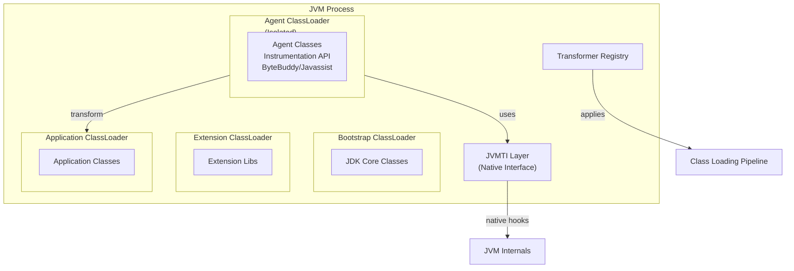
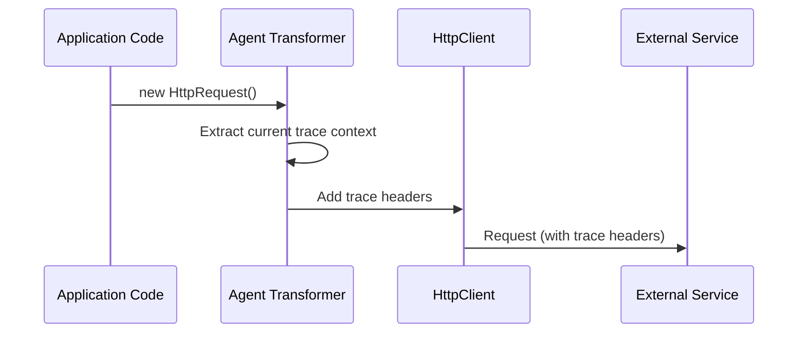
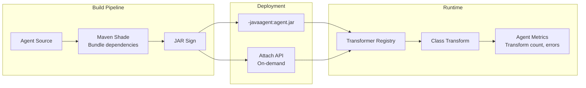

# Java Agents & Instrumentation: Cơ Chế Thâm Nhập và Kiểm Soát JVM

## 1. Mục tiêu của Task

Hiểu sâu cơ chế **Java Instrumentation API** - công cụ cho phép can thiệp vào bytecode của ứng dụng Java tại runtime. Tập trung vào:
- Cơ chế hoạt động tại tầng JVM
- Hai phương thức tải agent: `premain` (khởi động) và `agentmain` (runtime)
- Thư viện bytecode manipulation: Javassist vs ByteBuddy
- Ứng dụng thực tế: AOP, monitoring, profiling, hot-reload
- Rủi ro và constraints trong production

---

## 2. Bản Chất và Cơ Chế Hoạt Động

### 2.1 Bản Chất: Tại Sao JVM Cho Phép Instrumentation?

Java Instrumentation API được giới thiệu từ **Java 5 (JEP 163)** và mở rộng mạnh mẽ ở **Java 6**, không phải là "lỗ hổng" mà là **tính năng thiết kế có chủ đích**:

| Mục tiêu Thiết Kế | Giải Thích |
|------------------|------------|
| **Observability** | Theo dõi ứng dụng không cần sửa code (profiling, tracing) |
| **AOP without source modification** | Cross-cutting concerns (logging, security, metrics) tách biệt |
| **Legacy compatibility** | Patch ứng dụng cũ không rebuild |
| **Hot-fix capability** | Sửa lỗi critical mà không restart JVM |

> **Core Principle:** Agent chạy trong cùng JVM nhưng ở **isolated classloader**, có quyền can thiệp vào class loading pipeline của JVM.

### 2.2 Kiến Trúc: Agent Nằm Ở Đâu?



**Luồng xử lý khi class được load:**
1. Class file được đọc từ disk/jar
2. JVM kiểm tra `Transformer` registry
3. Mỗi registered transformer nhận `byte[]` (raw bytecode)
4. Transformer return `byte[]` đã modify (hoặc null nếu không thay đổi)
5. JVM verify và load modified bytecode

### 2.3 Cơ Chế `premain` vs `agentmain`

| Aspect | `premain` (Static Agent) | `agentmain` (Dynamic Agent) |
|--------|-------------------------|----------------------------|
| **Thởi điểm thực thi** | Trước khi `main()` được gọi | Sau khi JVM đã chạy |
| **Cách tải** | `-javaagent:path/to/agent.jar` | Attach API (com.sun.tools.attach) |
| **PID required** | Không | Có - cần target JVM PID |
| **Class đã loaded** | Chưa - agent "thấy" tất cả class từ đầu | Một phần - phải retransform classes đã load |
| **Use case chính** | Monitoring từ startup, AOP framework | Hot-fix, diagnostic, profiling on-demand |
| **Constraints** | Không gọi được hàm static của app class | Một số class không thể retransform (native, arrays) |

> **Quan trọng:** Cùng một agent JAR có thể chứa **cả hai** `premain` và `agentmain`, cho phép linh hoạt deployment.

---

## 3. Cơ Chế Bytecode Transformation

### 3.1 Instrumentation API Core

```java
public interface Instrumentation {
    // Đăng ký transformer
    void addTransformer(ClassFileTransformer transformer, boolean canRetransform);
    
    // Retransform classes đã loaded (agentmain)
    void retransformClasses(Class<?>... classes);
    
    // Redefine classes (hạn chế hơn retransform)
    void redefineClasses(ClassDefinition... definitions);
    
    // Kiểm tra khả năng
    boolean isRetransformClassesSupported();
    boolean isRedefineClassesSupported();
    
    // Memory info
    long getObjectSize(Object objectToSize);
}
```

**ClassFileTransformer Interface:**
```java
byte[] transform(ClassLoader loader, String className,
                 Class<?> classBeingRedefined,
                 ProtectionDomain protectionDomain,
                 byte[] classfileBuffer)
```

### 3.2 Bytecode Manipulation Libraries

| Tiêu chí | **Javassist** | **ByteBuddy** |
|----------|---------------|---------------|
| **Abstraction level** | Source-level (giống Java code) | DSL + Type-safe builder |
| **Performance** | Chậm hơn (compile source) | Nhanh hơn (direct ASM) |
| **Dependency size** | ~700KB | ~3MB (core + dependencies) |
| **Learning curve** | Dễ - viết Java-like | Steeper - DSL pattern |
| **Type safety** | Runtime (String-based) | Compile-time |
| **Best for** | Prototyping, simple transformation | Production, complex instrumentation |
| **Maintenance** | Less active (maintained) | Very active, modern Java support |

**Trade-off quan trọng:**
- **Javassist** dễ viết nhưng error-prone (runtime compilation), khó debug
- **ByteBuddy** type-safe, compile-time verification, nhưng cú pháp phức tạp hơn

### 3.3 ByteBuddy Deep Dive (Production Choice)

ByteBuddy sử dụng **ASM** bên dưới nhưng cung cấp abstraction an toàn:

```java
// Agent với ByteBuddy
new AgentBuilder.Default()
    .type(ElementMatchers.nameStartsWith("com.myapp.service"))
    .transform((builder, typeDescription, classLoader, module) -> 
        builder.method(ElementMatchers.named("execute"))
               .intercept(MethodDelegation.to(TimingInterceptor.class))
    )
    .installOn(instrumentation);
```

**Cơ chế hoạt động:**
1. **Type matching:** ByteBuddy quét classpath/filter theo matcher
2. **Transformation:** Tạo subclass (default) hoặc rebase original class
3. **Injection:** Sử dụng `Unsafe` hoặc `MethodHandles.Lookup` để inject
4. **Caching:** Agent được cache để tái sử dụng

---

## 4. Use Cases và So Sánh Giải Pháp

### 4.1 Application Performance Monitoring (APM)

**Ví dụ:** Theo dõi latency của tất cả database queries

| Giải pháp | Cách làm | Trade-off |
|-----------|----------|-----------|
| **Manual instrumentation** | Thêm code vào từng DAO | Accurate nhưng tedious, miss edge cases |
| **ByteBuddy agent** | Intercept JDBC `PreparedStatement.execute()` | Zero code change, overhead ~1-5% |
| **JDBC proxy** | Wrap DataSource | Transparent nhưng chỉ cover JDBC, không cover ORM |
| **MyBatis/Hibernate interceptors** | Framework hooks | Framework-specific, không cover raw JDBC |

> **Khuyến nghị:** Agent instrumentation cho APM là **standard practice** (New Relic, Datadog, Elastic APM đều dùng).

### 4.2 Distributed Tracing

**Bài toán:** Inject trace ID vào tất cả HTTP calls mà không sửa code



**Transformer approach:**
- Match: `java.net.http.HttpClient` hoặc `okhttp3.OkHttpClient`
- Intercept: `send()` hoặc `sendAsync()`
- Inject: Headers `X-Trace-Id`, `X-Span-Id`

### 4.3 AOP Implementation

| AOP Approach | Implementation | Khi nào dùng |
|--------------|----------------|--------------|
| **Spring AOP** | JDK Proxy / CGLIB | Spring app, compile-time weaving không cần thiết |
| **AspectJ LTW** | Agent + `.aj` files | Cần compile-time type checking, cross-cut nhiều layer |
| **Custom Agent** | ByteBuddy/Javassist | Non-Spring app, cần zero-dependency |

> **Lưu ý:** Spring AOP proxy-based có overhead (reflection), trong khi agent-based là true bytecode transformation.

---

## 5. Rủi Ro, Anti-patterns và Failure Modes

### 5.1 Rủi Ro Production Nghiêm Trọng

| Rủi ro | Nguyên nhân | Phòng ngừa |
|--------|-------------|------------|
| **VerifyError** | Bytecode không hợp lệ sau transform | Always validate với ASM `CheckClassAdapter` |
| **NoClassDefFoundError** | Agent dùng class chưa loaded | Đảm bảo agent dependencies trong agent JAR (shade) |
| **ClassCircularityError** | Transformer trigger class load của chính class đang transform | Avoid loading application classes trong transform() |
| **Memory leak** | Transformer không deregister, hoặc giữ reference | Always deregister trong shutdown hook |
| **Performance degradation** | Transform logic quá nặng | Move work ra ngoài transform(), dùng Advice pattern |
| **Deadlock** | Synchronization trong transform() | Không bao giờ synchronize trên class loading |

### 5.2 Anti-patterns

```java
// ❌ ANTI-PATTERN: Load app class trong transformer
public byte[] transform(...) {
    if (className.equals("com/myapp/User")) {
        User.class.getName(); // Triggers loading! Deadlock risk!
    }
}

// ❌ ANTI-PATTERN: Synchronize trong transform
public synchronized byte[] transform(...) {
    // Blocks class loading toàn JVM!
}

// ❌ ANTI-PATTERN: Tạo class mới trong transform
public byte[] transform(...) {
    return new MyClassWeaver().weave(classfileBuffer); // Heap pressure
}
```

### 5.3 Retransform Limitations

Không phải class nào cũng có thể retransform:

- ✅ **Có thể:** Application classes, library classes
- ❌ **Không thể:** 
  - Arrays (không có class file)
  - Primitives
  - Classes với native methods (nếu native stub đã generated)
  - Interfaces (hạn chế)
  - Classes đã redefine bởi agent khác

### 5.4 Security Concerns

Agent có **quyền rất cao** - tương đương native code:

| Capability | Rủi ro |
|------------|--------|
| `Instrumentation.redefineClasses()` | Có thể patch bỏ security checks |
| `sun.misc.Unsafe` access | Raw memory access, bypass access control |
| `setAccessible(true)` | Access private fields/methods |
| Native JVMTI hooks | Dump heap, inspect object internals |

> **Security Best Practice:** Chỉ sign và deploy agents từ trusted sources. Agent JARs should be treated as **critical security components**.

---

## 6. Production Concerns

### 6.1 Deployment và Versioning



### 6.2 Monitoring và Observability

Agent phải **tự observability**:

```java
// Agent should expose:
- transformCount: Số class đã transform
- transformErrors: Số lỗi verify/fail
- transformTime: Thởi gian transform trung bình
- activeTransformers: Danh sách transformer đang chạy
```

**JMX MBean** là cách phổ biến để expose agent metrics.

### 6.3 Testing Strategy

| Test Type | Mục tiêu | Công cụ |
|-----------|----------|---------|
| **Unit** | Transformer logic đúng | JUnit + ASM `ClassReader` validation |
| **Integration** | Agent không break app | Testcontainers với agent attached |
| **Regression** | Bytecode valid | Bytecode Verifier (JVM flag `-XX:-RelaxAccessControl`) |
| **Performance** | Overhead chấp nhận được | JMH benchmark với/without agent |

### 6.4 Java 21+ Considerations

| Feature | Impact trên Agents |
|---------|-------------------|
| **Virtual Threads** | Agent tracking thread-local cần cập nhật (carrier thread vs virtual thread) |
| **Scoped Values** | Thay thế ThreadLocal, agents cần hỗ trợ propagation |
| **Foreign Function & Memory API** | Native instrumentation thay thế JNI, agents có thể cần adapt |
| **ZGC Generational** | Object allocation tracking agents cần aware của new ZGC behavior |

---

## 7. Khuyến Nghị Thực Chiến

### 7.1 Khi Nào Dùng Agent

✅ **Nên dùng khi:**
- APM/Monitoring cho legacy app không thể sửa code
- Cross-cutting concerns (tracing, metrics) không liên quan đến business logic
- Hot-fix critical production issue mà không thể restart
- Plugin architecture cần class isolation

❌ **Không nên dùng khi:**
- Có thể đạt được mục tiêu bằng dependency injection (Spring, Guice)
- App đang viết mới - hãy design đúng từ đầu
- Team không có expertise về bytecode/JVM
- Overhead > 10% (benchmark kỹ trước deploy)

### 7.2 Tech Stack Recommendation

```
Instrumentation: ByteBuddy (1.14+)
Build: Maven Shade Plugin (bundle all deps)
Testing: JUnit 5 + ASM CheckClassAdapter
Metrics: Micrometer hoặc JMX MBean
Java Version: 17+ LTS (Virtual Threads support)
```

### 7.3 Checklist Production

- [ ] Agent JAR signed (jarsigner)
- [ ] Dependencies shaded (tránh version conflict)
- [ ] Transformer registered với `canRetransform=true` nếu cần
- [ ] Error handling không throw exception (return null thay vì crash)
- [ ] Thread-safe transformer implementation
- [ ] Memory-efficient (không allocate trong transform loop)
- [ ] MBeans exposed cho monitoring
- [ ] Integration tests pass với agent attached
- [ ] Performance benchmarked (latency, throughput)
- [ ] Rollback plan (agent detach capability)

---

## 8. Kết Luận

Java Instrumentation là **công cụ phẫu thuật chính xác**, không phải **búa tạ đập mọi vấn đề**.

**Bản chất cốt lõi:**
- Agent chạy cùng JVM nhưng ở isolated classloader
- Can thiệp vào class loading pipeline thông qua `ClassFileTransformer`
- `premain` cho startup instrumentation, `agentmain` cho runtime attach

**Trade-off quan trọng nhất:**
- **Power vs Risk:** Agent có quyền cao nhưng dễ gây VerifyError, performance issues
- **ByteBuddy vs Javassist:** Type-safety và performance vs ease-of-use

**Rủi ro lớn nhất:**
- Class loading deadlocks nếu transformer không thread-safe
- Memory leaks nếu transformer không deregister đúng cách
- Security vulnerabilities nếu agent từ untrusted source

**Quy tắc vàng:**
> "Code không vào agent nếu có thể đạt được bằng dependency injection. Nhưng khi cần observability cho legacy system - agent là giải pháp duy nhất."

---

## 9. Tài Liệu Tham Khảo

- [JVM Tool Interface (JVMTI) Specification](https://docs.oracle.com/javase/8/docs/platform/jvmti/jvmti.html)
- [ByteBuddy Documentation](https://bytebuddy.net/#/tutorial)
- [Javassist Tutorial](https://www.javassist.org/tutorial/tutorial.html)
- [Java Instrumentation API (Java 21)](https://docs.oracle.com/en/java/javase/21/docs/api/java.instrument/java/lang/instrument/Instrumentation.html)
- [New Relic Java Agent Architecture](https://github.com/newrelic/newrelic-java-agent)
- [OpenTelemetry Java Agent](https://github.com/open-telemetry/opentelemetry-java-instrumentation)
