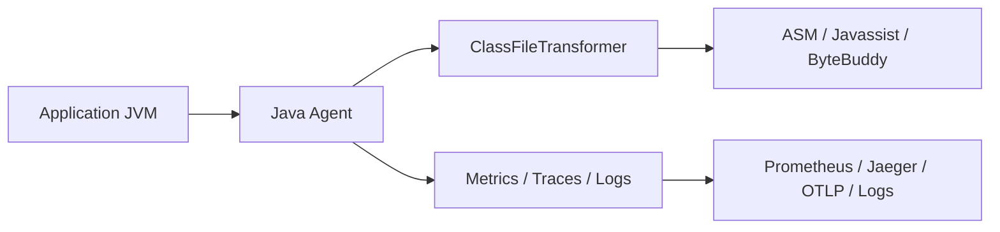

# Java Agents & Instrumentation

## 1. Mục tiêu của task

Java Agents và Instrumentation giải quyết một bài toán rất thực tế: **can thiệp vào bytecode hoặc theo dõi runtime của ứng dụng Java mà không cần sửa mã nguồn gốc**. Đây là nền tảng cho:

- APM / tracing / metrics
- Profiler, debugger, code coverage
- Hot patch, feature toggle ở tầng bytecode
- AOP động và quan sát hệ thống trong production

Bản chất của chủ đề này không nằm ở “viết agent cho vui”, mà là hiểu **JVM cho phép chèn điểm kiểm soát ở đâu, thời điểm nào, và cái giá phải trả là gì**.

> Điểm cốt lõi: agent không “thêm tính năng” vào Java theo nghĩa thông thường; nó **thay đổi quá trình nạp và thực thi class** bằng cách can thiệp vào pipeline của JVM.

---

## 2. Bản chất và cơ chế hoạt động

### 2.1 Hai cơ chế chính

Java Instrumentation thường đi theo 2 con đường:

1. **`premain`**: agent được nạp lúc JVM khởi động
2. **`agentmain`**: agent được attach vào JVM đang chạy

Cả hai đều dựa trên `java.lang.instrument.Instrumentation`, cho phép:

- quan sát class đã nạp
- transform bytecode trước khi class được define hoặc khi retransform
- thay thế implementation của method ở mức bytecode

### 2.2 Pipeline thực thi ở tầng thấp

Luồng logic thực tế thường như sau:

```mermaid
flowchart TD
    A[JVM start / Attach runtime] --> B[Load agent jar]
    B --> C[Call premain or agentmain]
    C --> D[Register ClassFileTransformer]
    D --> E[JVM loads or retransforms class]
    E --> F[Transformer receives raw bytecode]
    F --> G[Agent modifies byte[]
via ASM / Javassist / ByteBuddy]
    G --> H[JVM defines transformed class]
    H --> I[Application executes transformed methods]
```

### 2.3 Điều JVM thực sự làm

Khi JVM load một class:

1. đọc bytecode thô từ classpath / module path
2. kiểm tra format, constant pool, access flags
3. chạy các hook transformer đã đăng ký
4. nhận lại `byte[]` mới nếu agent thay đổi
5. define class vào class loader tương ứng

Nói cách khác, agent không “gắn hook vào method” theo kiểu reflection. Nó làm việc với **bytecode trước khi class được JVM chấp nhận** hoặc qua cơ chế retransformation/redefinition.

### 2.4 `premain` vs `agentmain`

| Tiêu chí | `premain` | `agentmain` |
|---|---|---|
| Thời điểm | Trước `main()` | Khi JVM đã chạy |
| Mục tiêu | Bootstrapping, monitoring sớm | Dynamic attach, hot troubleshooting |
| Độ ổn định | Cao hơn | Rủi ro cao hơn vì trạng thái runtime đã tồn tại |
| Khả năng ảnh hưởng class | Rộng hơn nếu cài sớm | Bị giới hạn bởi class đã load và policy attach |
| Use case điển hình | APM agent, security agent | Attach profiler, diagnose production issue |

### 2.5 Bytecode manipulation hoạt động ra sao

Có 3 nhóm công cụ phổ biến:

- **ASM**: mức thấp, thao tác bytecode trực tiếp, rất mạnh nhưng khó đọc
- **Javassist**: thao tác gần với source hơn, dễ tiếp cận nhưng kém “tinh” hơn ASM
- **ByteBuddy**: cân bằng tốt, dùng nhiều trong production vì API an toàn hơn và tích hợp tốt với Instrumentation

Bytecode transformation thường rơi vào các kiểu:

- chèn lệnh đầu method / cuối method
- wrap method để đo latency
- thay đổi interceptor chain
- instrument constructor / static initializer
- thêm field hoặc method hỗ trợ tracing

---

## 3. Kiến trúc / luồng xử lý / sơ đồ nếu phù hợp

### 3.1 Kiến trúc agent production điển hình



### 3.2 Các thành phần quan trọng

- **Agent entrypoint**: `premain(String args, Instrumentation inst)` hoặc `agentmain(...)`
- **Transformer**: nơi nhận raw bytecode và quyết định sửa gì
- **Instrumentation API**: công cụ trung tâm để query/redefine class
- **Bytecode library**: lớp trừu tượng hóa việc chỉnh bytecode
- **Export pipeline**: đẩy metric/traces ra hệ thống observability

### 3.3 Cách agent “lọc” class

Agent thực tế không nên transform mọi class. Nó thường áp dụng:

- whitelist package
- loại trừ JDK classes
- loại trừ framework nội bộ nhạy cảm
- tránh instrument class quá sớm như logging, reflection, classloader

> Nếu instrument bừa, agent sẽ tự gây vòng lặp: logging cần logger, logger lại bị instrument, và JVM có thể rơi vào deadlock hoặc recursion vô hạn.

### 3.4 Retransformation và redefine

- **Retransformation**: JVM chạy lại transformer trên class đã load, nếu supported
- **Redefinition**: thay định nghĩa class đã tồn tại, nhưng giới hạn hơn

Đây là điểm rất quan trọng: không phải mọi thay đổi đều hợp lệ. JVM hạn chế mạnh việc đổi cấu trúc class đang sống để bảo toàn tính nhất quán runtime.

---

## 4. So sánh các lựa chọn hoặc cách triển khai

### 4.1 Agent vs AOP framework

| Tiêu chí | Java Agent | Spring AOP / Proxy | AspectJ compile-time/weaving |
|---|---|---|---|
| Mức can thiệp | Bytecode / JVM class loading | Proxy layer | Bytecode weaving |
| Không sửa source | Có | Có | Có/không tùy cách weave |
| Phủ object nội bộ | Có | Không hoàn toàn | Có |
| Ảnh hưởng private/final/static | Có thể | Hạn chế | Có thể |
| Độ phức tạp | Cao | Thấp | Trung bình - cao |
| Production observability | Rất mạnh | Tốt cho app layer | Mạnh nhưng vận hành phức tạp hơn |

### 4.2 ASM vs Javassist vs ByteBuddy

| Tiêu chí | ASM | Javassist | ByteBuddy |
|---|---|---|---|
| Mức thấp | Rất cao | Thấp hơn | Trung bình |
| Hiệu năng transform | Tốt nhất | Tốt | Tốt |
| Độ dễ dùng | Khó | Dễ | Dễ - vừa |
| An toàn khi maintain | Thấp | Trung bình | Cao |
| Thường dùng trong production | Có, nhưng niche | Ít hơn | Rất phổ biến |

### 4.3 Khi nào nên dùng agent thay vì sửa code

Nên dùng khi:

- cần observability toàn cục
- cần đo thời gian gọi method trên nhiều service mà không muốn đụng business code
- cần hot attach vào production để chẩn đoán sự cố
- cần tương thích ngược cao với hệ thống legacy

Không nên dùng khi:

- bài toán đơn giản có thể giải bằng interceptor / filter / AOP
- team không đủ năng lực debug bytecode
- yêu cầu bảo trì lâu dài nhưng không có ownership rõ ràng

---

## 5. Rủi ro, anti-patterns, lỗi thường gặp

### 5.1 Failure modes phổ biến

- **VerifyError / ClassFormatError**: bytecode sinh ra không hợp lệ
- **NoClassDefFoundError**: agent tham chiếu class không có mặt ở classloader phù hợp
- **LinkageError**: xung đột định nghĩa class
- **Deadlock lúc startup**: agent giữ lock khi JVM đang load class liên quan
- **Recursion vô hạn**: instrument chính logging / metrics pipeline của agent
- **Performance regression**: transform quá nhiều class hoặc insert logic nặng trong hot path

### 5.2 Anti-patterns

- instrument mọi thứ “cho chắc”
- dùng reflection thay vì hiểu classloader boundary
- ghi log quá nhiều ở transformer
- allocate object nặng trong hot method instrumentation
- không có denylist cho `java.*`, `sun.*`, `jdk.*` và các package nội bộ của agent
- hardcode assumptions về method signature, sau đó nâng cấp thư viện và vỡ ngay

### 5.3 Edge cases đáng sợ

- class được load bởi nhiều classloader khác nhau nhưng agent chỉ test với một loader
- lambdas, synthetic methods, bridge methods làm matcher sai lệch
- method overload làm interceptor gắn nhầm
- instrument constructor hoặc `<clinit>` gây trạng thái nửa sống nửa chết
- class đã JIT compile rồi nhưng thay đổi runtime làm profile bị méo

### 5.4 Lỗi production hay bị bỏ qua

- agent chạy ổn ở dev nhưng crash ở app server do classloader phức tạp
- attach thành công nhưng không có quyền attach từ xa
- tool hoạt động nhưng làm tăng latency tail p99 do allocation/locking
- metrics/traces bị double-count khi retransformation xảy ra nhiều lần

---

## 6. Khuyến nghị thực chiến trong production

### 6.1 Thiết kế agent theo nguyên tắc tối thiểu hóa ảnh hưởng

- chỉ instrument đúng package / đúng method pattern
- tránh logic phức tạp trong transformer
- tách “selection” và “execution”: matcher nhẹ, instrumentation logic rõ ràng
- cache metadata nếu cần, nhưng phải cẩn thận với memory leak từ classloader

### 6.2 Quan sát và vận hành

Nên có:

- flag bật/tắt agent behavior
- sampling thay vì đo 100% nếu lưu lượng lớn
- metrics nội bộ của agent: số class transformed, số lỗi transform, thời gian transform
- log riêng cho agent, không lẫn vào business log
- guardrail để tắt transform khi vượt ngưỡng lỗi

### 6.3 Backward compatibility

- thiết kế agent chống lại thay đổi minor version của dependency
- không phụ thuộc chặt vào implementation details của framework nếu không cần
- kiểm tra tương thích với Java version mục tiêu, đặc biệt từ Java 9+ có module system

### 6.4 Java 21+ và hiện đại hóa

Java hiện đại không làm agent “mất vai trò”, nhưng thay đổi bối cảnh:

- **JPMS (Java Platform Module System)** làm access nội bộ khó hơn; cần chú ý `--add-opens` khi debug/instrument một số package
- **Virtual threads** có thể làm profiling/tracing cần cách đo khác với thread pool truyền thống
- **JFR** ngày càng là lựa chọn quan sát nhẹ hơn trong nhiều tình huống; agent custom nên cân nhắc trước khi tự phát minh lại profiler

> Nếu mục tiêu chỉ là observability chuẩn, hãy ưu tiên chuẩn công nghiệp như OpenTelemetry, JFR, async-profiler trước khi tự viết agent “đo hết mọi thứ”.

### 6.5 Checklist production

- [ ] whitelist package rõ ràng
- [ ] test trên nhiều classloader
- [ ] test với startup thời gian dài và load cao
- [ ] kiểm thử rollback / disable nhanh
- [ ] giới hạn allocation trong hot path
- [ ] không instrument chính agent runtime

---

## 7. Kết luận ngắn gọn, chốt lại bản chất

Java Agents và Instrumentation là cơ chế cho phép **thay đổi hoặc quan sát hành vi class ở tầng JVM**, trước hoặc trong khi ứng dụng đang chạy. Giá trị lớn nhất của nó là observability, hot attach và can thiệp sâu vào hệ thống legacy; đổi lại là **độ phức tạp cao, nguy cơ lỗi bytecode, rủi ro classloader và chi phí vận hành**.

Nếu hiểu đúng, đây là một công cụ rất mạnh. Nếu hiểu mơ hồ, nó là nguồn bug khó nhất trong toàn bộ stack Java.

---

## 8. Code tối thiểu minh họa cơ chế

### 8.1 Entrypoint của agent

```java
public class MyAgent {
    public static void premain(String args, Instrumentation inst) {
        inst.addTransformer(new MyTransformer(), true);
    }
}
```

Ý nghĩa:
- `premain` chạy trước `main()`
- `Instrumentation` là cổng vào JVM instrumentation
- `addTransformer(..., true)` cho phép hỗ trợ retransformation nếu JVM cho phép

### 8.2 Transformer tối giản

```java
public class MyTransformer implements ClassFileTransformer {
    @Override
    public byte[] transform(ClassLoader loader,
                            String className,
                            Class<?> classBeingRedefined,
                            ProtectionDomain protectionDomain,
                            byte[] classfileBuffer) {
        if (className == null || !className.startsWith("com/example/")) {
            return null;
        }
        return classfileBuffer;
    }
}
```

Ý nghĩa:
- trả `null` nghĩa là không sửa bytecode
- lọc package là bước bắt buộc để giảm rủi ro
- `classfileBuffer` là bytecode gốc JVM cung cấp

Điểm quan trọng: trong production, phần khó không nằm ở mẫu code trên, mà nằm ở **quyết định class nào được phép transform và transform theo cách nào để không phá JVM invariants**.