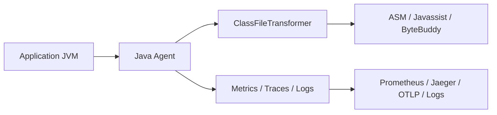

# Java Agents & Instrumentation — Deep Research

## 1. Mục tiêu của task

Java Agents và `Instrumentation` giải quyết một bài toán rất “senior”: **can thiệp vào hành vi của ứng dụng Java ở tầng JVM mà không cần sửa mã nguồn business**.

Nó được dùng khi ta cần:

- quan sát runtime trong production (APM, tracing, metrics)
- chèn logic cross-cutting mà không đụng code gốc
- hot attach để điều tra sự cố đang chạy
- bytecode weaving cho profiler, coverage, security policy, feature flag ở tầng thấp

> Bản chất của chủ đề này không phải “viết một agent”, mà là hiểu **JVM cho phép ta chạm vào đâu trong pipeline nạp class và cái giá phải trả là gì**.

---

## 2. Bản chất và cơ chế hoạt động

### 2.1 Agent không “gắn hook vào method” theo nghĩa reflection

Agent hoạt động bằng cách chặn hoặc sửa **bytecode thô** trước khi JVM define class, hoặc tái biến đổi class đã nạp nếu JVM cho phép.

Có hai entrypoint chính:

- `premain(...)`: agent được nạp lúc JVM khởi động
- `agentmain(...)`: agent được attach vào JVM đang chạy

Cả hai đều xoay quanh `java.lang.instrument.Instrumentation`.

### 2.2 Luồng xử lý ở tầng thấp

```mermaid
flowchart TD
    A[JVM start / Attach runtime] --> B[Load agent jar]
    B --> C[Call premain or agentmain]
    C --> D[Register ClassFileTransformer]
    D --> E[JVM loads or retransforms class]
    E --> F[Transformer receives raw bytecode]
    F --> G[Agent modifies byte[]\nvia ASM / Javassist / ByteBuddy]
    G --> H[JVM verifies and defines transformed class]
    H --> I[Application executes transformed methods]
```

### 2.3 JVM thực sự làm gì

Khi load một class, JVM đi qua các bước:

1. đọc bytecode từ classpath/module path
2. kiểm tra cấu trúc class file, constant pool, access flags
3. gọi các transformer đã đăng ký
4. nhận lại bytecode mới nếu agent sửa
5. verify lại và define class vào class loader tương ứng

Điểm quan trọng: agent can thiệp **trước khi class trở thành type hợp lệ trong JVM**, không phải sau đó bằng reflection.

### 2.4 `premain` vs `agentmain`

| Tiêu chí | `premain` | `agentmain` |
|---|---|---|
| Thời điểm | Trước `main()` | Khi JVM đã chạy |
| Mục tiêu | Bootstrapping, monitoring sớm | Dynamic attach, điều tra sự cố |
| Độ ổn định | Cao hơn | Rủi ro cao hơn do runtime đã có trạng thái |
| Phạm vi ảnh hưởng | Rộng hơn nếu cài sớm | Bị giới hạn bởi class đã load và policy attach |
| Dùng khi | APM agent, security agent | Profiler attach, production diagnosis |

### 2.5 Công cụ bytecode thường dùng

- **ASM**: mức thấp, mạnh nhất, khó nhất
- **Javassist**: gần với source, dễ dùng hơn nhưng kém tinh tế hơn
- **ByteBuddy**: cân bằng tốt, rất phổ biến trong production vì API an toàn hơn

Bytecode transformation thường làm một trong các việc sau:

- chèn logic đầu/cuối method
- đo latency, count, exception
- thay interceptor chain
- instrument constructor hoặc static initializer
- thêm field/method phụ trợ cho tracing

---

## 3. Kiến trúc / luồng xử lý / sơ đồ nếu phù hợp

### 3.1 Kiến trúc agent trong production



### 3.2 Các thành phần chính

- **Agent entrypoint**: `premain(String args, Instrumentation inst)` hoặc `agentmain(...)`
- **Transformer**: nơi nhận bytecode và quyết định sửa gì
- **Instrumentation API**: cổng vào cho redefine/retransform class
- **Bytecode library**: lớp trừu tượng hóa việc chỉnh bytecode
- **Exporter**: đẩy dữ liệu ra hệ observability

### 3.3 Class filtering là bắt buộc

Agent production không bao giờ transform mọi class. Thường phải có:

- whitelist package
- denylist `java.*`, `javax.*`, `sun.*`, `jdk.*`
- loại trừ class của chính agent
- tránh đụng logging, reflection, classloader, crypto, netty internals nếu chưa thật sự cần

> Nếu instrument bừa, agent rất dễ tự bắn vào chân: logging gọi logger, logger bị instrument, rồi vòng lặp hoặc deadlock xuất hiện ngay trong startup hoặc hot path.

### 3.4 Retransformation và redefinition

- **Retransformation**: JVM chạy lại transformer trên class đã load nếu supported
- **Redefinition**: thay định nghĩa class đã tồn tại, nhưng giới hạn hơn

Quan trọng: JVM không cho phép sửa cấu trúc class tùy tiện trong lúc chạy. Những thay đổi phá vỡ invariants của class layout, method table, hoặc verification sẽ bị từ chối.

### 3.5 Mô hình xử lý nên tách 2 pha

1. **Selection phase**: xác định class nào đủ điều kiện
2. **Instrumentation phase**: sửa bytecode thật sự

Lý do: selection cần nhẹ, còn instrumentation là nơi tốn CPU và dễ lỗi. Nếu trộn hai thứ, overhead và complexity đều tăng.

---

## 4. So sánh các lựa chọn hoặc cách triển khai

### 4.1 Java Agent vs AOP/Proxy vs AspectJ

| Tiêu chí | Java Agent | Spring AOP / Proxy | AspectJ weaving |
|---|---|---|---|
| Mức can thiệp | JVM bytecode/class loading | Proxy layer | Bytecode weaving |
| Không sửa source | Có | Có | Có/không tùy cách weave |
| Phủ object nội bộ | Có | Không hoàn toàn | Có |
| Ảnh hưởng private/final/static | Có thể | Hạn chế | Có thể |
| Độ phức tạp | Cao | Thấp | Trung bình - cao |
| Observability production | Rất mạnh | Tốt ở app layer | Mạnh nhưng vận hành phức tạp |

**Kết luận thực dụng:**
- dùng AOP/Proxy nếu bài toán chỉ ở application layer
- dùng Agent khi cần quan sát/can thiệp sâu hơn Spring proxy không chạm tới được

### 4.2 ASM vs Javassist vs ByteBuddy

| Tiêu chí | ASM | Javassist | ByteBuddy |
|---|---|---|---|
| Mức thấp | Rất cao | Thấp hơn | Trung bình |
| Hiệu năng transform | Tốt nhất | Tốt | Tốt |
| Độ dễ dùng | Khó | Dễ | Dễ - vừa |
| Maintainability | Thấp | Trung bình | Cao |
| Production usage | Có, nhưng niche | Ít hơn | Rất phổ biến |

**Khuyến nghị:**
- chọn **ByteBuddy** nếu mục tiêu là production-grade agent
- chọn **ASM** nếu cần kiểm soát bytecode cực sâu hoặc tối ưu đặc biệt
- tránh chọn Javassist cho hệ thống lâu dài nếu team không muốn gánh rủi ro maintainability

### 4.3 Khi nào nên dùng agent

Nên dùng khi:

- cần observability chung cho nhiều service mà không muốn sửa code gốc
- cần hot attach vào production để điều tra
- cần tương thích ngược với hệ thống legacy
- cần instrument framework internals mà proxy/AOP không chạm tới

Không nên dùng khi:

- chỉ cần cross-cutting đơn giản ở tầng app
- team không đủ năng lực debug bytecode/classloader
- yêu cầu bảo trì dài hạn nhưng không có ownership rõ ràng
- có thể dùng OpenTelemetry/JFR/async-profiler mà không cần tự viết thêm complexity

---

## 5. Rủi ro, anti-patterns, lỗi thường gặp

### 5.1 Failure modes phổ biến

- **VerifyError / ClassFormatError**: bytecode sinh ra không hợp lệ
- **NoClassDefFoundError**: agent tham chiếu class không nằm trong classloader phù hợp
- **LinkageError**: xung đột định nghĩa class giữa loader khác nhau
- **Deadlock lúc startup**: agent giữ lock trong lúc JVM đang load class phụ thuộc
- **Recursion vô hạn**: instrument chính logging / metrics pipeline của agent
- **Performance regression**: transform quá nhiều class hoặc chèn logic nặng vào hot path

### 5.2 Anti-patterns

- instrument “tất cả cho chắc”
- dùng reflection thay vì hiểu boundary của classloader
- log quá nhiều trong `transform(...)`
- allocate object nặng trong hot path instrumentation
- không có denylist cho core packages
- hardcode method signature rồi nâng cấp framework và vỡ ngay

### 5.3 Edge cases rất dễ dính

- một class được load bởi nhiều classloader khác nhau nhưng agent chỉ test trên một loader
- lambdas, synthetic methods, bridge methods làm matcher sai
- overload khiến interceptor gắn nhầm method
- instrument constructor hoặc `<clinit>` làm class ở trạng thái nửa sống nửa chết
- class đã JIT compile rồi nhưng runtime thay đổi, profile bị méo

### 5.4 Lỗi production hay bị bỏ qua

- chạy ổn ở dev nhưng crash trong app server do classloader phức tạp
- attach thành công nhưng thiếu quyền attach từ xa
- công cụ hoạt động nhưng làm p99 tăng do allocation/locking
- metrics/traces bị double-count khi retransformation lặp

---

## 6. Khuyến nghị thực chiến trong production

### 6.1 Thiết kế theo nguyên tắc tối thiểu hóa ảnh hưởng

- chỉ instrument package/method đã định nghĩa rõ
- giữ transformer càng mỏng càng tốt
- tách matcher khỏi logic sửa bytecode
- cache metadata cẩn thận để không giữ reference làm leak classloader

### 6.2 Quan sát và vận hành

Nên có:

- feature flag bật/tắt behavior của agent
- sampling thay vì đo 100% khi lưu lượng lớn
- metrics nội bộ: số class transformed, số lỗi transform, thời gian transform
- log riêng cho agent
- guardrail để vô hiệu hóa transform nếu lỗi vượt ngưỡng

### 6.3 Backward compatibility

- kiểm tra tương thích theo Java version mục tiêu, đặc biệt từ Java 9+ với JPMS
- không phụ thuộc chặt vào implementation details của framework nếu không cần
- test với nhiều phiên bản dependency phổ biến nhất trong fleet

### 6.4 Java 21+ và bối cảnh hiện đại

- **JPMS** làm access nội bộ khó hơn; khi cần debug/instrument package nội bộ có thể phải dùng `--add-opens`
- **Virtual threads** làm profiling/tracing cần cách đo khác với thread pool truyền thống
- **JFR** thường rẻ hơn và an toàn hơn cho nhiều use case quan sát

> Nếu mục tiêu chỉ là observability chuẩn, hãy ưu tiên OpenTelemetry, JFR, async-profiler trước khi tự viết agent “đo mọi thứ”. Tự viết agent là con đường rất nhanh để tạo ra một hệ thống khó debug hơn cả hệ thống cần quan sát.

### 6.5 Checklist production

- [ ] whitelist package rõ ràng
- [ ] test trên nhiều classloader
- [ ] test với startup dài và load cao
- [ ] có đường rollback/disable nhanh
- [ ] giới hạn allocation trong hot path
- [ ] không instrument chính agent runtime

---

## 7. Kết luận ngắn gọn, chốt lại bản chất

Java Agents và `Instrumentation` là cơ chế cho phép **thay đổi hoặc quan sát hành vi class ở tầng JVM**, trước hoặc trong khi ứng dụng đang chạy. Giá trị lớn nhất của nó là observability, hot attach và can thiệp sâu vào hệ legacy; đổi lại là **độ phức tạp cao, nguy cơ lỗi bytecode, rủi ro classloader và chi phí vận hành**.

Nếu hiểu đúng, đây là công cụ rất mạnh. Nếu hiểu mơ hồ, nó là nguồn bug khó nhất trong toàn bộ stack Java.

---

## 8. Code tối thiểu nếu cần

```java
public class MyAgent {
    public static void premain(String args, Instrumentation inst) {
        inst.addTransformer(new MyTransformer(), true);
    }
}
```

Ý nghĩa:
- `premain` chạy trước `main()`
- `Instrumentation` là cổng vào JVM instrumentation
- `addTransformer(..., true)` cho phép retransformation nếu JVM hỗ trợ

```java
public class MyTransformer implements ClassFileTransformer {
    @Override
    public byte[] transform(ClassLoader loader,
                            String className,
                            Class<?> classBeingRedefined,
                            ProtectionDomain protectionDomain,
                            byte[] classfileBuffer) {
        if (className == null || !className.startsWith("com/example/")) {
            return null;
        }
        return classfileBuffer;
    }
}
```

Ý nghĩa:
- trả `null` nghĩa là không sửa bytecode
- lọc package là bước bắt buộc để giảm rủi ro
- `classfileBuffer` là bytecode gốc JVM cung cấp

Điểm cần nhớ: phần khó không phải ở mẫu code, mà ở **quyết định class nào được phép transform và transform theo cách nào để không phá JVM invariants**.
