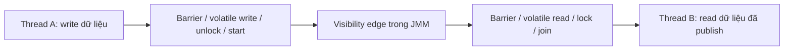
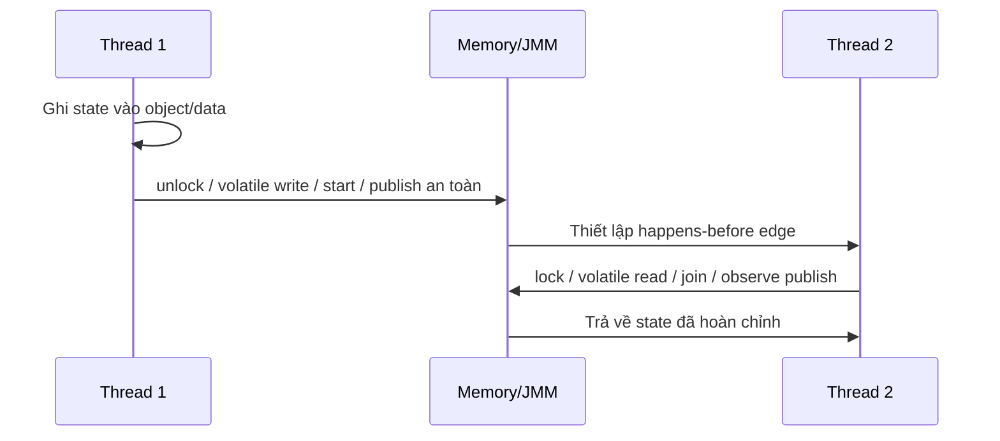

# Happens-Before Relationship: Nền tảng của tính đúng đắn trong Java Memory Model

> **Mục tiêu:** Hiểu chính xác khi nào một ghi nhớ (write) ở thread này trở thành quan sát được (visible) ở thread khác, và vì sao đó là điều kiện cần để viết concurrent code đúng.

## 1. Mục tiêu của task

Happens-before không phải là “thứ tự thực thi” theo nghĩa CPU chạy trước sau, mà là **quan hệ trật tự quan sát được** do Java Memory Model (JMM) định nghĩa. Mục tiêu của cơ chế này là:

- đảm bảo tính đúng đắn khi nhiều thread cùng truy cập dữ liệu chia sẻ;
- cho phép JVM và CPU tự do tối ưu reorder khi không làm thay đổi hành vi quan sát hợp lệ;
- tạo ra các “điểm đồng bộ” rõ ràng để xây dựng lock-based và lock-free algorithms.

> **Ý chính:** Nếu A happens-before B, thì mọi write trước A **phải** được nhìn thấy bởi B, và B không được phép quan sát trạng thái “nửa chừng” do reorder.

---

## 2. Bản chất và cơ chế hoạt động

### 2.1 Bản chất

Happens-before là một **quan hệ một chiều, mang tính bắc cầu** trên các hành động trong chương trình. Nó không ép CPU chạy tuần tự; nó chỉ nói rằng **khi một thread quan sát hành động ở thread khác**, thì mọi tác động bộ nhớ “đi trước” phải được nhìn thấy đầy đủ.

Nói ngắn gọn:

- **Program order**: trong cùng một thread, theo thứ tự source code;
- **Visibility guarantee**: write của thread trước phải visible cho thread sau;
- **Ordering guarantee**: JVM/CPU không được reorder vượt qua các ranh giới đồng bộ.

### 2.2 Các rule cốt lõi

Các quan hệ happens-before quan trọng nhất:

1. **Program order rule**
   - Trong cùng một thread, mỗi hành động happens-before hành động đứng sau nó.
2. **Monitor lock rule**
   - Một `unlock` trên monitor happens-before một `lock` tiếp theo trên cùng monitor đó.
3. **Volatile rule**
   - Một write vào volatile happens-before mọi read tiếp theo của chính biến volatile đó.
4. **Thread start rule**
   - Gọi `Thread.start()` happens-before mọi hành động trong thread mới.
5. **Thread join rule**
   - Mọi hành động trong thread được join happens-before thread join return.
6. **Interrupt rule**
   - Gọi `interrupt()` happens-before thread bị interrupt quan sát trạng thái interrupt.
7. **Final field rule**
   - Nếu object được publish an toàn sau constructor, các read về final field thấy giá trị constructor đã gán.
8. **Transitivity**
   - Nếu A hb B và B hb C thì A hb C.

### 2.3 Cơ chế thấp tầng: JVM và CPU làm gì

Ở tầng thực thi, happens-before được hiện thực bằng các **memory barriers / fences** và luật tối ưu của JVM.

Luồng tư duy:



Điểm cần hiểu:

- JVM có thể reorder instruction nếu không phá vỡ hành vi hợp lệ theo JMM.
- CPU cũng có thể reorder load/store để tối ưu pipeline, cache, speculative execution.
- Khi bạn dùng `synchronized`, `volatile`, `Lock`, `Atomic*`, `VarHandle`…, JVM chèn các rào chắn cần thiết để cấm một số reorder nguy hiểm.

> **Lưu ý quan trọng:** Happens-before không đồng nghĩa với “đã flush hết cache theo nghĩa vật lý đơn giản”. Nó là **cam kết ngữ nghĩa** được hiện thực bằng cơ chế phần cứng + JVM + compiler barrier phù hợp từng kiến trúc.

### 2.4 Tại sao thiết kế như vậy

JMM chấp nhận một đánh đổi rất thực dụng:

- **Không ép tuần tự tuyệt đối** → giữ hiệu năng.
- **Chỉ ép thứ tự ở biên đồng bộ** → code đúng khi cần, nhanh khi không cần.
- **Cho phép compiler/CPU tối ưu mạnh** → nhưng dev phải tự đặt đúng ranh giới đồng bộ.

Nếu không có mô hình này, hoặc JVM sẽ phải chạy gần như tuần tự (quá chậm), hoặc concurrent code sẽ không thể dự đoán được.

---

## 3. Kiến trúc / luồng xử lý / sơ đồ nếu phù hợp

### 3.1 Luồng publish an toàn điển hình



### 3.2 Ba lớp cần nhớ khi phân tích một bug concurrency

1. **Source order**: code trông như chạy theo thứ tự.
2. **Compiler/CPU order**: có thể bị reorder.
3. **Observed order**: thứ thread khác thật sự thấy.

Bug thường xuất hiện khi dev nhầm lớp 1 thành lớp 3.

### 3.3 Mẫu lỗi kinh điển: double-checked locking sai nếu thiếu volatile

Bản chất lỗi không phải “khởi tạo object chậm”, mà là:

- thread A có thể publish reference trước khi constructor kết thúc về mặt quan sát;
- thread B thấy reference không-null nhưng trạng thái bên trong chưa fully initialized.

`volatile` trên reference là cơ chế tạo happens-before giữa write sau hoàn tất và read về sau.

---

## 4. So sánh các lựa chọn hoặc cách triển khai

### 4.1 Cơ chế đồng bộ và quan hệ happens-before

| Cơ chế | Tạo happens-before? | Chi phí | Điểm mạnh | Điểm yếu |
|---|---:|---:|---|---|
| `synchronized` | Có | Trung bình đến cao | Dễ hiểu, bao trùm visibility + atomicity | Contention cao thì đắt, dễ khóa sai phạm vi |
| `volatile` | Có, nhưng chỉ visibility/order | Thấp | Rẻ, tốt cho flag/state publish | Không cung cấp atomicity cho compound actions |
| `Atomic*` / CAS | Có qua volatile semantics + fences | Thấp đến trung bình | Lock-free, scalable hơn under contention vừa phải | Khó thiết kế đúng, retry/spin, ABA |
| `Lock` (`ReentrantLock`) | Có khi dùng đúng acquire/release | Trung bình | Linh hoạt hơn synchronized | Phải unlock cẩn thận, dễ leak lock |
| `VarHandle` | Có tùy access mode | Thấp đến trung bình | Fine-grained control (opaque/acquire/release/volatile) | Dễ sai nếu không hiểu memory semantics |

### 4.2 Khi nào dùng gì

- **Dùng `volatile`** khi chỉ cần publish trạng thái, cờ dừng, snapshot đơn giản.
- **Dùng `synchronized`/`Lock`** khi cần vừa visibility vừa atomicity trên nhiều bước.
- **Dùng `Atomic*`/CAS** khi cần tối ưu vùng tranh chấp nhỏ, counter, state machine, non-blocking coordination.
- **Dùng `VarHandle`** khi cần tối ưu sâu hoặc xây dựng library/framework-level primitives.

> **Nguyên tắc thực chiến:** Nếu bài toán của bạn là “nhiều thread cùng sửa một invariant”, `volatile` gần như chắc chắn là **không đủ**.

---

## 5. Rủi ro, anti-patterns, lỗi thường gặp

### 5.1 Anti-pattern phổ biến

- **Tin vào thứ tự source code** thay vì JMM.
- **Dùng `volatile` cho dữ liệu mutable phức tạp** rồi hy vọng compound operations tự an toàn.
- **Publish object trước khi constructor hoàn tất**.
- **Trộn nhiều cơ chế đồng bộ mà không có chiến lược rõ ràng**: vừa `synchronized`, vừa CAS, vừa `volatile` nhưng không xác định ranh giới.
- **Đọc state không có edge happens-before** rồi debug bằng “nó chạy được trên máy tôi”.

### 5.2 Failure modes thực tế

- **Stale read**: thread B đọc giá trị cũ vì không có visibility edge.
- **Reordering bug**: thấy flag đã set nhưng data đi kèm chưa sẵn sàng.
- **Torn invariants**: một phần object đã update, phần khác chưa.
- **Lost update**: nhiều thread read-modify-write mà không atomic.
- **Heisenbug**: bug biến mất khi gắn log/debug vì timing thay đổi.

### 5.3 Edge cases cần đặc biệt chú ý

- **Final field semantics** chỉ đáng tin khi object được publish an toàn.
- **Array reference vs array contents**: volatile reference không bảo vệ nội dung mảng nếu có concurrent mutation.
- **Safe publication qua collection**: chỉ an toàn nếu collection và việc publish đều có đồng bộ đúng.
- **Lazy initialization**: dễ sai nếu tối ưu quá sớm.

---

## 6. Khuyến nghị thực chiến trong production

### 6.1 Thiết kế đúng từ đầu

- Xác định rõ **shared mutable state**; càng ít càng tốt.
- Ưu tiên **immutability** và **single-writer principle** khi có thể.
- Với state dùng chung, ghi rõ:
  - thread nào được ghi;
  - thread nào được đọc;
  - edge happens-before nào bảo đảm visibility.

### 6.2 Debugging / observability

- Khi gặp bug concurrency, hỏi 3 câu:
  1. Có shared mutable state không?
  2. Có edge happens-before giữa writer và reader không?
  3. Invariant có bị update theo nhiều bước không?
- Dùng thread dump, async-profiler, JFR, logging có timestamp/correlation ID để tái hiện race.
- Đừng tin unit test đơn luồng là đủ; race bug thường chỉ lộ dưới load thật.

### 6.3 Versioning / backward compatibility

- Khi thay đổi cơ chế đồng bộ của API/library, coi đó là **thay đổi hành vi quan sát** chứ không chỉ thay đổi implementation.
- Tài liệu hóa contract: “đối tượng này safe to publish không?”, “callback chạy trên thread nào?”, “sau method X có visibility guarantee gì?”
- Nếu thư viện public API, tránh để người dùng phải đoán edge đồng bộ.

### 6.4 Java 21+ và công cụ hiện đại

- **Virtual threads** không thay đổi JMM; chúng chỉ đổi mô hình scheduling. Happens-before vẫn là nền tảng đúng/sai của shared state.
- **VarHandle** là công cụ hiện đại hơn `Unsafe` cho access semantics rõ ràng: `getAcquire`, `setRelease`, `getOpaque`, `setOpaque`, `compareAndSet`.
- **Structured concurrency** giúp quản trị lifecycle, nhưng không thay thế visibility rules.
- **Scoped values** giảm nhu cầu mutable thread-local state, gián tiếp giảm rủi ro đồng bộ.

> **Điểm cần nhớ:** Công cụ mới giúp code dễ hơn, nhưng không xóa bỏ JMM. Sai về happens-before thì virtual threads cũng sai như thường.

---

## 7. Kết luận ngắn gọn, chốt lại bản chất

Happens-before là “hợp đồng” giữa code Java, JVM và phần cứng để xác định **ai được phép thấy cái gì, vào lúc nào**. Nó không phải đồng hồ thời gian, mà là luật quan sát bộ nhớ.

Muốn viết concurrent code đúng:

- phải biết **điểm publish** của dữ liệu;
- phải biết **edge đồng bộ** nào tạo visibility;
- phải biết **atomicity** đang được bảo đảm ở mức nào.

Không hiểu happens-before thì concurrency chỉ là may rủi có tổ chức.

---

## 8. Chỉ thêm code nếu thật sự cần thiết

Ví dụ tối thiểu về publish an toàn bằng `volatile`:

```java
class ConfigHolder {
    private Config config;
    private volatile boolean initialized;

    void init(Config cfg) {
        this.config = cfg;      // write dữ liệu trước
        this.initialized = true; // volatile write tạo release
    }

    Config get() {
        if (!initialized) return null;
        return config; // volatile read tạo acquire trước khi đọc config
    }
}
```

Ý nghĩa:
- `initialized = true` là điểm publish;
- thread đọc `initialized == true` sẽ thấy `config` đã được ghi trước đó;
- nhưng mẫu này chỉ phù hợp khi `config` không bị mutate tiếp theo.

> Nếu `config` là state phức tạp cần cập nhật nhiều field, hãy dùng `synchronized`, immutable snapshot, hoặc cơ chế atomic swap rõ ràng thay vì mở rộng `volatile` một cách cảm tính.
