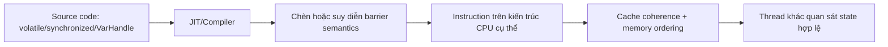
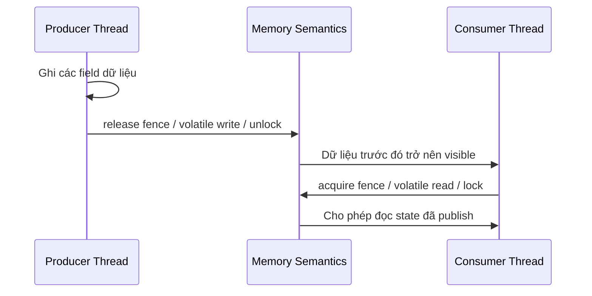

# Memory Barriers & Fences: Ranh giới thật sự giữa đúng và sai trong Java Memory Model

> **Mục tiêu:** Hiểu memory barriers/fences là gì, JVM và CPU dùng chúng để ngăn reorder như thế nào, và vì sao một concurrent bug có thể tồn tại dù source code trông hoàn toàn hợp lý.

## 1. Mục tiêu của task

Memory barriers và fences là cơ chế nền để Java Memory Model (JMM) biến các câu như `volatile`, `synchronized`, `Lock`, `Atomic*`, `VarHandle` thành cam kết quan sát được giữa các thread.

Mục tiêu chính của chúng là:

- **Visibility**: dữ liệu ghi bởi thread A phải nhìn thấy được bởi thread B tại đúng điểm đồng bộ;
- **Ordering**: cấm các phép reorder nguy hiểm vượt qua ranh giới đồng bộ;
- **Publication safety**: cho phép publish object/state một cách đáng tin cậy;
- **Optimization freedom**: vẫn cho JVM/CPU tối ưu trong phạm vi an toàn.

> **Chốt ý:** fence không phải để làm chương trình “chạy tuần tự”, mà để tạo ra các biên mà từ đó trạng thái bộ nhớ trở nên hợp lệ cho thread khác quan sát.

---

## 2. Bản chất và cơ chế hoạt động

### 2.1 Barrier / fence thực sự là gì?

Ở mức thấp, barrier/fence là một chỉ thị cho compiler/JVM/CPU rằng:

- một số loại reorder trước-sau **không được phép vượt qua** điểm này;
- các store/load trước đó phải được đẩy tới trạng thái mà thread khác có thể quan sát theo ngữ nghĩa JMM;
- các load/store sau đó phải được thực hiện theo thứ tự quan sát phù hợp.

Không nên đồng nhất fence với “flush toàn bộ cache” theo nghĩa đơn giản hóa quá mức. Trên thực tế, cơ chế hiện thực phụ thuộc kiến trúc CPU, JIT, và mức semantics được yêu cầu.

### 2.2 Các kiểu fence phổ biến

Theo ngôn ngữ hệ thống, thường thấy bốn loại chính:

1. **LoadLoad**
   - Ngăn một load phía sau vượt lên trước một load phía trước.
   - Hữu ích khi cần bảo đảm một chuỗi đọc quan sát state ổn định.

2. **StoreStore**
   - Ngăn một store phía sau vượt lên trước store phía trước.
   - Quan trọng cho publish dữ liệu trước rồi mới publish cờ/trạng thái.

3. **LoadStore**
   - Ngăn store phía sau vượt lên trước load phía trước.
   - Ít được nhắc hơn nhưng có mặt trong mô hình tổng quát của ordering.

4. **StoreLoad**
   - Loại mạnh nhất và thường đắt nhất.
   - Ngăn load phía sau vượt lên trước store phía trước.
   - Đây là rào chắn hay xuất hiện trong các tình huống đồng bộ mạnh và là lý do `volatile`/monitor có thể tốn chi phí hơn mong đợi.

### 2.3 JVM dùng fence để phục vụ JMM như thế nào?

JMM không bắt dev phải gọi fence trực tiếp trong đa số trường hợp. Thay vào đó, JVM chèn barrier phù hợp khi bạn dùng primitive có semantics bộ nhớ:

- `volatile write` ~ release semantics;
- `volatile read` ~ acquire semantics;
- `monitor exit` / `unlock` ~ release;
- `monitor enter` / `lock` ~ acquire;
- atomic/CAS trên `Atomic*` hoặc `VarHandle` thường đi kèm fence/ordering semantics cụ thể;
- một số tối ưu của JIT bị chặn để tránh tạo hành vi quan sát sai.

### 2.4 Cơ chế thấp tầng: từ source đến phần cứng

Chuỗi thực thi điển hình:



JVM thường phải cân bằng 3 thứ:

- **safety**: không được vi phạm JMM;
- **performance**: không được chèn barrier nặng ở mọi nơi;
- **portability**: cùng một Java code phải đúng trên x86, ARM, và các kiến trúc khác.

### 2.5 Vì sao thiết kế như vậy?

Nếu không có fence/barrier:

- compiler có thể reorder theo logic tối ưu nội bộ;
- CPU có thể reorder để tận dụng pipeline, store buffer, cache hierarchy;
- thread khác có thể đọc được flag trước khi data đi kèm sẵn sàng.

JMM chấp nhận đánh đổi:

- **Không cấm mọi reorder** → hiệu năng còn sống;
- **Chỉ cấm reorder qua biên đồng bộ** → dev phải đặt đúng ranh giới;
- **Semantics cao hơn là fence cụ thể** → code dễ di chuyển giữa kiến trúc.

> **Lưu ý quan trọng:** Sai lầm phổ biến là nghĩ “source code đã ghi sau thì thread khác sẽ đọc sau”. Không đúng. Chỉ có edge đồng bộ/fence semantics mới tạo ra cam kết đó.

---

## 3. Kiến trúc / luồng xử lý / sơ đồ nếu phù hợp

### 3.1 Publish dữ liệu đúng cách bằng release/acquire



Ý nghĩa:

- **release** ở phía writer đảm bảo mọi write trước nó không bị “trôi” ra sau điểm publish;
- **acquire** ở phía reader đảm bảo các read sau nó không bị kéo lên trước điểm nhận publish.

### 3.2 Mô hình lỗi điển hình

```text
Thread A:
    data = 42
    ready = true

Thread B:
    if (ready) print(data)
```

Nếu `ready` không có semantics đồng bộ phù hợp, CPU/JIT có thể cho phép Thread B thấy `ready == true` nhưng `data` vẫn là giá trị cũ.

Bản chất lỗi không phải do code “sai cú pháp”, mà do **không có ranh giới ordering/visibility**.

### 3.3 Ba lớp thứ tự cần phân biệt

1. **Source order**: thứ tự code viết ra.
2. **Execution order**: thứ tự JVM/CPU thực thi nội bộ.
3. **Observed order**: thứ tự thread khác thật sự quan sát.

Fence tồn tại để bảo vệ lớp 3, không phải để làm đẹp lớp 1.

### 3.4 Tại sao StoreLoad thường đắt?

StoreLoad là điểm khó vì nó chạm vào phần sâu của kiến trúc bộ nhớ:

- store có thể nằm trong buffer chờ commit;
- load sau đó có thể bị suy diễn/speculate quá sớm;
- để đảm bảo đúng, hệ thống thường phải chặn hoặc làm rỗng một số pipeline/buffer liên quan.

Do đó các cơ chế đồng bộ mạnh thường có chi phí cao hơn `volatile` thuần đọc/ghi đơn giản.

---

## 4. So sánh các lựa chọn hoặc cách triển khai

### 4.1 So sánh semantics bộ nhớ

| Cơ chế | Semantics chính | Strength | Chi phí tương đối | Khi dùng |
|---|---|---:|---:|---|
| `volatile` read/write | acquire/release | Trung bình | Thấp đến trung bình | Flag, state publish, one-writer-many-reader |
| `synchronized` | acquire/release + mutual exclusion | Mạnh | Trung bình đến cao | Cần atomicity nhiều bước |
| `Lock` | acquire/release | Mạnh | Trung bình | Khi cần timeout, fairness, condition |
| `Atomic*` | volatile-like semantics + CAS | Trung bình đến mạnh | Thấp đến trung bình | Counter, state machine, CAS loop |
| `VarHandle` | acquire/release/opaque/volatile/atomic | Rất linh hoạt | Thấp đến trung bình | Library, low-level concurrent primitives |
| `Unsafe` | phụ thuộc API nội bộ | Rất thấp về độ an toàn | Khó kiểm soát | Nên tránh trong code mới |

### 4.2 Acquire vs Release vs Full Fence

| Loại | Tác dụng | Điểm mạnh | Điểm yếu |
|---|---|---|---|
| Acquire | Không cho read/write sau nó vượt lên trước | Rẻ, đủ cho consumer side | Không đủ để publish nếu đứng một mình |
| Release | Không cho read/write trước nó trôi xuống sau | Rẻ, đủ cho producer side | Không đủ để đảm bảo reader side nhìn thấy đúng nếu thiếu acquire |
| Full fence | Chặn reorder mạnh hơn ở cả hai phía | Dễ suy luận hơn | Đắt hơn, giảm tối ưu |

### 4.3 Khi nào nên chọn gì

- **Chỉ cần publish một snapshot bất biến** → `volatile` reference hoặc immutable object.
- **Cần bảo vệ invariant nhiều field** → `synchronized`/`Lock`.
- **Cần throughput cao trên một state machine đơn giản** → `Atomic*` hoặc `VarHandle`.
- **Cần kiểm soát memory semantics ở mức thư viện** → `VarHandle` là lựa chọn hiện đại hơn `Unsafe`.

> **Nguyên tắc thực chiến:** càng “low-level” càng phải viết ít hơn, kiểm chứng nhiều hơn. Rất nhiều bug production đến từ việc dùng cơ chế mạnh hơn nhu cầu thật.

---

## 5. Rủi ro, anti-patterns, lỗi thường gặp

### 5.1 Anti-pattern phổ biến

- **Nhầm visibility với atomicity**
  - `volatile` giúp thấy được giá trị mới, nhưng không biến `count++` thành atomic.
- **Dùng fence mạnh cho bài toán đơn giản**
  - Tốn hiệu năng và làm code khó bảo trì.
- **Tự chế lock-free khi chưa cần**
  - CAS loop sai còn khó debug hơn lock sai.
- **Trộn nhiều semantics bộ nhớ mà không vẽ luồng publish/consume**
  - `volatile` + `synchronized` + CAS nhưng không biết edge nào là nguồn sự thật.
- **Dùng `opaque`/relaxed semantics như thể nó là `volatile`**
  - Đây là lỗi rất dễ gặp khi dùng `VarHandle`.

### 5.2 Failure modes thực tế

- **Stale read**: reader thấy dữ liệu cũ vì thiếu acquire/release.
- **Out-of-thin-air style confusion**: lập trình viên nghĩ trạng thái “không thể xảy ra” nhưng do reorder/optimization nó có thể xuất hiện dưới một số mô hình sai.
- **Broken publication**: publish reference trước khi object fully initialized.
- **Torn invariant**: một phần state nhìn thấy mới, phần khác vẫn cũ.
- **Performance cliff**: thêm đồng bộ tưởng nhỏ nhưng làm throughput rơi mạnh do contention hoặc barrier đắt.

### 5.3 Edge cases cần nhớ

- **x86 vs ARM**: x86 thường có memory ordering mạnh hơn, khiến bug khó lộ hơn trên máy dev nhưng bùng lên trên môi trường khác.
- **JIT warmup**: bug có thể chỉ xuất hiện sau khi JIT tối ưu xong.
- **False confidence từ test**: test đơn luồng hoặc test ít iteration không đủ bắt race.
- **Reference an toàn không bảo vệ mutable contents**: một `volatile` reference tới object mutable không tự làm các field bên trong an toàn nếu tiếp tục mutate không đồng bộ.

> **Cảnh báo:** Nếu bạn chỉ test trên laptop x86 và thấy “ổn”, điều đó gần như không chứng minh được gì về correctness của memory ordering.

---

## 6. Khuyến nghị thực chiến trong production

### 6.1 Thiết kế

- Giảm shared mutable state đến mức thấp nhất.
- Ưu tiên **immutable snapshot + atomic swap** cho cấu hình, routing table, feature flags, cache metadata.
- Với state có invariant nhiều bước, dùng lock rõ ràng thay vì cố tối ưu bằng fence rời rạc.
- Định nghĩa rõ mô hình owner: chỉ một thread ghi, nhiều thread đọc, hay nhiều thread cùng ghi.

### 6.2 Observability / debugging

- Khi nghi ngờ memory ordering bug, hỏi:
  1. Có edge release/acquire nào giữa writer và reader không?
  2. Invariant có bị tách thành nhiều bước không?
  3. Có đường code nào publish reference trước khi fully initialize không?
- Dùng:
  - JFR để nhìn contention, blocking, safepoint;
  - async-profiler để kiểm tra hot path và spin/CAS retry;
  - logging có correlation ID để gom timeline giữa thread.
- Nếu bug chỉ xuất hiện dưới tải, coi nó là candidate race-condition cho đến khi chứng minh ngược lại.

### 6.3 Versioning / backward compatibility

Nếu bạn thay đổi semantics đồng bộ của một API public, đó là thay đổi contract chứ không chỉ đổi implementation.

Ví dụ:

- từ `synchronized` sang lock-free CAS có thể đổi timing quan sát;
- từ immutable snapshot sang mutable shared object có thể phá correctness của client code;
- từ `volatile` sang plain field là một breaking change ngầm về visibility.

### 6.4 Java 21+ và công cụ hiện đại

- **VarHandle** là lựa chọn chuẩn, rõ ràng hơn `Unsafe` để biểu đạt `getAcquire`, `setRelease`, `compareAndExchange`, `getOpaque`.
- **Virtual threads** không làm biến mất vấn đề ordering; chúng chỉ làm cho scheduling rẻ hơn. Shared mutable state vẫn cần đúng fence/lock semantics.
- **Structured concurrency** giúp quản trị lifecycle và join các task dễ hơn, nhưng không thay thế memory ordering.
- **Scoped values** giảm nhu cầu dùng mutable thread-local state, gián tiếp giảm áp lực đồng bộ.

> **Điểm mấu chốt:** Công cụ mới cho phép diễn đạt semantics rõ hơn, nhưng không xóa bỏ chi phí và rủi ro của memory barriers.

### 6.5 Checklist production ngắn gọn

- [ ] Đã xác định ai là writer, ai là reader
- [ ] Đã xác định điểm publish
- [ ] Đã xác định edge acquire/release hoặc lock tương ứng
- [ ] Đã kiểm tra invariant nhiều field
- [ ] Đã đánh giá contention và chi phí barrier
- [ ] Đã có observability cho race/lock contention

---

## 7. Kết luận ngắn gọn, chốt lại bản chất

Memory barriers/fences là cơ chế ngầm nhưng quyết định toàn bộ correctness của concurrent Java. Chúng không làm code “an toàn” một cách thần kỳ; chúng chỉ tạo ra ranh giới mà JVM/CPU phải tôn trọng để các thread quan sát cùng một sự thật.

Muốn dùng đúng:

- phân biệt **visibility** và **atomicity**;
- biết **ai publish cái gì, cho ai, bằng edge nào**;
- chỉ dùng semantics mạnh đến mức cần thiết.

Không hiểu barriers/fences thì concurrent programming rất dễ biến thành một trò chơi đoán may mắn với benchmark đẹp.

---

## 8. Chỉ thêm code nếu thật sự cần thiết

Ví dụ tối thiểu mô tả release/acquire bằng `VarHandle` trong Java hiện đại:

```java
import java.lang.invoke.MethodHandles;
import java.lang.invoke.VarHandle;

class FlagBox {
    private int data;
    private volatile int ready;
    private static final VarHandle READY;

    static {
        try {
            READY = MethodHandles.lookup().findVarHandle(FlagBox.class, "ready", int.class);
        } catch (ReflectiveOperationException e) {
            throw new ExceptionInInitializerError(e);
        }
    }

    void publish(int value) {
        data = value;                 // write dữ liệu trước
        READY.setRelease(this, 1);    // release: publish state
    }

    Integer consume() {
        if ((int) READY.getAcquire(this) == 0) return null; // acquire: nhận publish
        return data;
    }
}
```

Ý nghĩa quan trọng:

- `setRelease` bảo đảm các write trước đó không bị đẩy xuống sau điểm publish;
- `getAcquire` bảo đảm các read sau đó không bị kéo lên trước điểm nhận publish;
- `data` vẫn là field thường vì cái quan trọng là **quan hệ ordering** quanh `ready`.

Nếu đổi `setRelease/getAcquire` thành access thường, bạn mất edge đồng bộ và mẫu này không còn đáng tin cậy.

> Không nên suy diễn từ ví dụ này rằng `VarHandle` luôn tốt hơn `volatile`. Nếu chỉ cần flag đơn giản, `volatile` vẫn là lựa chọn dễ đọc và ít sai hơn.
