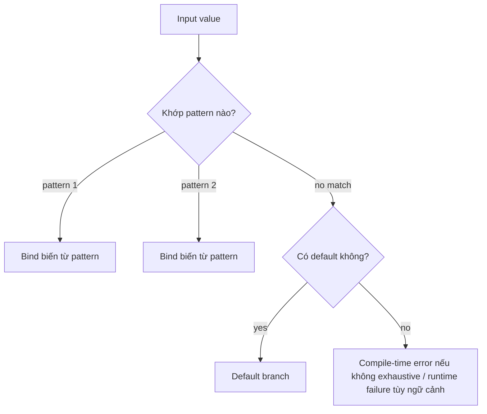
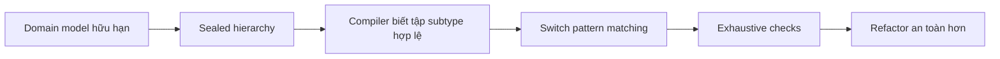

# Pattern Matching & Sealed Classes

## 1. Mục tiêu của task

Task này nghiên cứu hai năng lực ngôn ngữ hiện đại của Java 17+:
- **Pattern Matching**: giảm boilerplate khi kiểm tra kiểu và trích xuất dữ liệu.
- **Sealed Classes**: khóa chặt hệ phân cấp kiểu, giúp biểu diễn domain rõ ràng hơn và cho phép compiler kiểm tra tính đầy đủ.

Mục tiêu thực chiến không phải “viết code ngắn hơn”, mà là:
- mô hình hóa miền nghiệp vụ chặt chẽ hơn,
- giảm lỗi do thiếu nhánh xử lý,
- tăng khả năng refactor an toàn,
- và giữ code xử lý điều kiện phức tạp còn đọc được khi hệ thống lớn lên.

> Bản chất của hai tính năng này là đẩy một phần “luật nghiệp vụ” từ runtime sang compile-time.

---

## 2. Bản chất và cơ chế hoạt động

### 2.1 Pattern Matching là gì về bản chất?

Pattern matching không chỉ là “if type check gọn hơn”. Nó là cơ chế để JVM/compiler cho phép:
- kiểm tra một giá trị có khớp một mẫu hay không,
- nếu khớp thì bind luôn các biến liên quan,
- và tiếp tục luồng xử lý với ngữ cảnh đã được rút gọn.

Ở Java 17+ và đặc biệt 21+, pattern matching hiện diện mạnh nhất trong:
- `instanceof` pattern matching,
- `switch` với pattern,
- record patterns,
- cùng các điều kiện guard (`when`).

### 2.2 Mô hình tư duy

Thay vì:
1. kiểm tra kiểu,
2. ép kiểu,
3. rồi mới lấy dữ liệu,

compiler cho phép viết theo dạng:
1. khớp mẫu,
2. bind dữ liệu ngay khi khớp,
3. xử lý đúng nhánh đó.

Điều này làm giảm lỗi “check xong nhưng cast nhầm”, và giảm khoảng cách giữa ý định nghiệp vụ với code.

### 2.3 Sealed Classes là gì về bản chất?

Sealed classes/interfaces là cơ chế **đóng tập hợp subtype hợp lệ**.

Nó giải quyết một vấn đề rất thực tế: trong domain có nhiều khái niệm chỉ nên có một số biến thể hữu hạn. Nếu để mở hoàn toàn, bất kỳ module nào cũng có thể tạo subtype mới, làm cho:
- compiler không thể chứng minh tính đầy đủ của `switch`,
- người đọc không biết hệ phân cấp có bị mở rộng ở đâu,
- và logic xử lý dễ bị vỡ khi thêm subtype mới.

Sealed types tạo ra một “hàng rào hợp pháp” cho hệ phân cấp.

### 2.4 Cơ chế compiler/runtime

Sealed classes được kiểm tra chủ yếu ở **compile time**:
- lớp cha khai báo `sealed` và chỉ định các subtype được phép qua `permits`.
- các subtype đó phải thỏa điều kiện kế thừa hợp lệ.

Khi kết hợp với pattern matching trong `switch`, compiler có thể kiểm tra:
- các nhánh đã bao phủ hết chưa,
- có nhánh unreachable không,
- có cần `default` không.

Ở mức bytecode/runtime, Java vẫn chạy theo cơ chế dispatch quen thuộc; lợi ích chính là nằm ở **khả năng suy luận của compiler** chứ không phải “có VM magic mới”.

---

## 3. Kiến trúc / luồng xử lý / sơ đồ nếu phù hợp

### 3.1 Luồng xử lý của pattern matching trong `switch`



### 3.2 Luồng tư duy khi dùng sealed + pattern matching



### 3.3 Ví dụ domain điển hình

Một hệ thống thanh toán có thể có:
- `PaymentMethod` gồm `Card`, `BankTransfer`, `Wallet`
- `OrderState` gồm `Pending`, `Paid`, `Cancelled`, `Refunded`
- `Command`/`Event` trong event-driven architecture

Đây là những nơi sealed classes rất hợp lý vì số biến thể có chủ đích là hữu hạn.

---

## 4. So sánh các lựa chọn hoặc cách triển khai

### 4.1 `instanceof` + cast truyền thống vs pattern matching

| Tiêu chí | `instanceof` + cast | Pattern matching |
|---|---|---|
| Độ dài code | Dài, lặp | Ngắn hơn |
| Rủi ro cast sai | Cao hơn | Thấp hơn |
| Khả năng đọc | Ý định bị tách rời | Ý định và binding đi cùng nhau |
| Refactor | Dễ bỏ sót cast/nhánh | An toàn hơn |
| Dùng cho domain phức tạp | Kém hơn | Tốt hơn |

**Kết luận:** pattern matching không chỉ “đỡ gõ”, mà giúp giảm một lớp lỗi kiểu dữ liệu.

### 4.2 Sealed classes vs abstract class truyền thống

| Tiêu chí | Abstract class mở | Sealed class |
|---|---|---|
| Khả năng mở rộng bên ngoài | Cao | Bị kiểm soát |
| Exhaustive checking | Yếu | Mạnh |
| Mô hình hóa domain hữu hạn | Không tối ưu | Rất phù hợp |
| Plugin/extensibility | Tốt hơn | Có thể không phù hợp |
| Độ an toàn khi refactor | Thấp hơn | Cao hơn |

### 4.3 Sealed classes vs enum

| Tiêu chí | Enum | Sealed class |
|---|---|---|
| Giá trị hữu hạn | Có | Có |
| Có state phức tạp theo biến thể | Kém | Tốt |
| Có hành vi riêng theo subtype | Hạn chế | Mạnh |
| Có thể mang dữ liệu khác nhau | Không linh hoạt | Rất linh hoạt |
| Hợp với domain object | Trung bình | Tốt hơn |

**Khi dùng enum:** trạng thái thực sự là danh sách giá trị nguyên tử, gần như không có hành vi/phức tạp dữ liệu riêng.

**Khi dùng sealed:** mỗi biến thể là một “loại” có shape hoặc invariant riêng.

### 4.4 So với Visitor Pattern

Visitor từng là cách kinh điển để xử lý hệ phân cấp kiểu đóng. Nhưng với Java hiện đại:
- pattern matching + sealed thường cho code trực tiếp hơn,
- ít ceremony hơn,
- và dễ hiểu hơn với team không chuyên sâu design pattern.

Visitor vẫn có đất dụng võ khi:
- cần tách nhiều phép toán trên cùng object graph,
- hoặc cần tối ưu extension theo hướng “thêm operation, không đổi hierarchy”.

---

## 5. Rủi ro, anti-patterns, lỗi thường gặp

### 5.1 Dùng sealed cho mọi thứ

Đây là sai lầm phổ biến nhất. Không phải hệ phân cấp nào cũng nên đóng.

> Nếu domain của bạn cần extension từ bên ngoài module, plugin, hoặc framework integration, sealed có thể trở thành cái khóa quá chặt.

### 5.2 Lạm dụng pattern matching để giấu thiết kế kém

Pattern matching không chữa được mô hình domain tệ. Nếu một object vừa chứa quá nhiều responsibility vừa phải bị bóc tách liên tục bằng `switch`, vấn đề có thể nằm ở model chứ không phải ở cú pháp.

### 5.3 Quá nhiều nhánh `switch` trên cùng một hierarchy

Khi một sealed hierarchy bị dùng như “event bag” khổng lồ, các `switch` rải rác khắp nơi sẽ tạo ra coupling ngầm rất cao. Thêm subtype mới lúc này là một thay đổi lan truyền.

### 5.4 Exhaustiveness giả tạo

Compiler chỉ đảm bảo exhaustiveness trong phạm vi hierarchy đã biết. Nhưng nếu:
- bạn để `default` cho mọi thứ,
- hoặc dùng type quá chung (`Object`),
- hoặc tách logic khỏi nơi domain được định nghĩa,

thì bạn tự làm mất lợi ích của sealed.

### 5.5 Fragile compatibility khi thay đổi hierarchy

Thêm subtype mới vào sealed hierarchy là thay đổi có tính phá vỡ ngầm:
- các `switch` exhaustive có thể lỗi compile,
- serialization/deserialization có thể vỡ tương thích,
- JSON schema / API contract có thể cần versioning.

### 5.6 Edge cases với record patterns và nested patterns

Khi patterns lồng nhau sâu, code có thể trở nên “đẹp nhưng nguy hiểm”:
- khó debug,
- khó log giá trị trung gian,
- khó đọc khi điều kiện guard phức tạp.

---

## 6. Khuyến nghị thực chiến trong production

### 6.1 Khi nên dùng sealed classes

Dùng khi:
- domain có tập biến thể hữu hạn và ổn định tương đối,
- bạn muốn compiler hỗ trợ phát hiện thiếu nhánh,
- các subtype chia sẻ contract chung nhưng có invariant khác nhau,
- code xử lý cần an toàn khi refactor.

Ví dụ rất hợp:
- payment state machine,
- command/event hierarchy,
- result type (`Success`, `ValidationError`, `SystemError`),
- AST / parser model,
- workflow step finite state.

### 6.2 Khi không nên dùng sealed classes

Không nên dùng khi:
- framework cần proxy/subclass tự do,
- hệ thống plugin cần mở rộng từ bên ngoài,
- domain thay đổi liên tục và chưa chốt biến thể,
- bạn chỉ cần một vài hằng số đơn giản thì `enum` là đủ.

### 6.3 Khi nên dùng pattern matching

Dùng khi:
- logic phân nhánh dựa trên type/shape là trung tâm của bài toán,
- cần giảm cast và boilerplate,
- muốn xử lý `switch` theo kiểu domain-driven hơn là kiểu procedural.

Không nên dùng khi:
- nhánh quá phức tạp và logic nghiệp vụ nên được đẩy vào polymorphism,
- pattern khiến code trở thành “trình phân loại dữ liệu” khổng lồ,
- một hierarchy quá rộng làm `switch` kém maintainable.

### 6.4 Production concerns

- **Monitoring/Debugging:** pattern lồng sâu nên có log ở biên nghiệp vụ, không chỉ trong nhánh khớp.
- **Versioning:** thay đổi sealed hierarchy nên được coi như thay đổi contract; cần review API, serialization, consumers.
- **Backward compatibility:** đặc biệt cẩn thận với JSON/Avro/Kafka event schema; thêm subtype có thể đòi hỏi strategy versioning.
- **Testing:** phải có test cho exhaustiveness và regression khi thêm subtype mới.
- **Code review:** mọi `default` trong `switch` trên sealed hierarchy cần được soi kỹ; nhiều khi nó đang che đi lỗi thiết kế.

### 6.5 Java 21+ liên quan

Java 21 làm pattern matching thực dụng hơn khi kết hợp với:
- **pattern matching for switch** đã hoàn thiện hơn,
- **record patterns** giúp bóc dữ liệu của record trực tiếp,
- **guarded patterns** (`when`) để biểu đạt điều kiện rõ ràng hơn.

Điểm quan trọng: các cải tiến này không thay thế thiết kế domain, chỉ làm cho model tốt được biểu đạt chính xác hơn.

---

## 7. Kết luận ngắn gọn, chốt lại bản chất

Pattern matching và sealed classes là cặp đôi “đẩy luật miền nghiệp vụ vào compiler”. Pattern matching giảm sai sót khi phân nhánh theo kiểu/shape; sealed classes khóa hệ phân cấp để compiler có thể kiểm tra tính đầy đủ.

Bản chất trade-off là:
- **an toàn và rõ nghĩa hơn** đổi lấy **ít tự do mở rộng hơn**.
- Dùng đúng thì đây là công cụ rất mạnh cho backend domain-heavy.
- Dùng sai thì chỉ tạo thêm ceremony và coupling ẩn.

> Chọn sealed khi bạn muốn một hệ phân cấp có luật rõ ràng. Chọn pattern matching khi bạn muốn biểu diễn luật đó một cách ngắn gọn, an toàn, và dễ kiểm tra hơn.

---

## 8. Chỉ thêm code nếu thật sự cần thiết

### Ví dụ tối thiểu về sealed + pattern matching

```java
sealed interface Payment permits CardPayment, BankTransferPayment, WalletPayment {}

record CardPayment(String maskedPan) implements Payment {}
record BankTransferPayment(String bankCode, String accountNo) implements Payment {}
record WalletPayment(String provider, String walletId) implements Payment {}

static String describe(Payment payment) {
    return switch (payment) {
        case CardPayment c -> "CARD:" + c.maskedPan();
        case BankTransferPayment b -> "BANK:" + b.bankCode();
        case WalletPayment w -> "WALLET:" + w.provider();
    };
}
```

**Ý nghĩa quan trọng:**
- `sealed interface Payment` khóa tập subtype hợp lệ.
- `record` giúp mỗi biến thể mang dữ liệu riêng, immutable, và thể hiện shape rõ ràng.
- `switch` không cần `default` vì compiler biết hierarchy đã exhaustive.
- Nếu thêm subtype mới, compiler sẽ báo ở nơi xử lý, buộc bạn cập nhật logic thay vì âm thầm bỏ sót.
