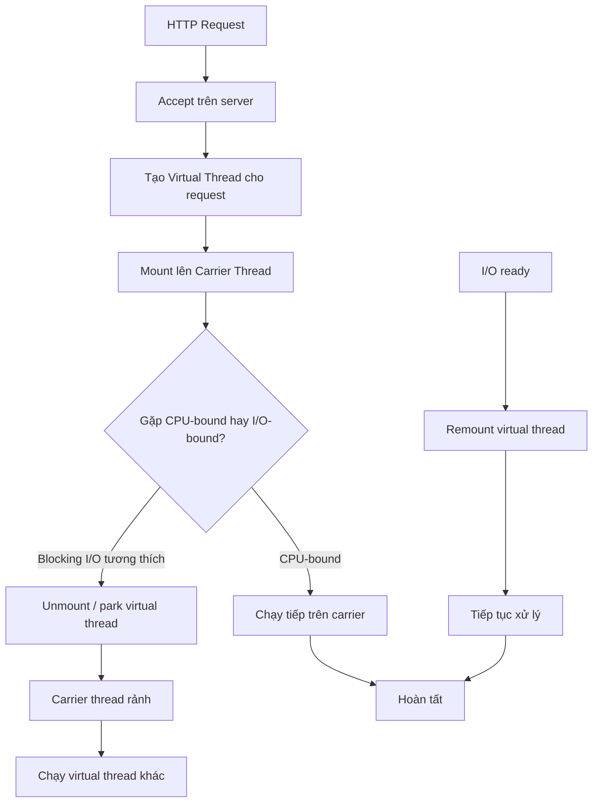

# Virtual Threads Deep Dive

## 1. Mục tiêu của task

Nghiên cứu sâu cơ chế **Virtual Threads** trong Java 21+ để hiểu đúng:
- Virtual thread là gì, khác gì với platform thread truyền thống
- JVM triển khai chúng như thế nào ở tầng runtime
- Vì sao virtual threads giúp scale I/O-bound workload tốt hơn
- Khi nào chúng không phải là lựa chọn tốt
- Những rủi ro production quan trọng: pinning, blocking call, observability, scheduling, compatibility

> Mục tiêu không phải “dùng cho biết”, mà là hiểu bản chất để chọn đúng mô hình concurrency cho backend thực chiến.

---

## 2. Bản chất và cơ chế hoạt động

### 2.1. Virtual thread là gì?

Virtual thread là một **thread do JVM quản lý**, nhẹ hơn rất nhiều so với platform thread (OS thread). 

- **Platform thread**: tương ứng gần 1-1 với thread của hệ điều hành
- **Virtual thread**: JVM tạo ra hàng triệu execution context nhẹ, và multiplex chúng lên một số lượng nhỏ platform threads gọi là **carrier threads**

Bản chất của virtual thread không phải “thread nhanh hơn”, mà là **giảm chi phí giữ một thread bị block chờ I/O**.

### 2.2. Vì sao mô hình cũ đắt?

Trong mô hình truyền thống:

1. Request vào server
2. Một worker thread được gán cho request
3. Nếu thread block ở JDBC / HTTP / file I/O / sleep
4. OS thread bị giữ lại suốt thời gian chờ
5. Mỗi thread tốn stack memory, scheduling overhead, context switch cost

Khi concurrency tăng, hệ thống chết không phải vì CPU tính toán không nổi, mà vì:
- thread pool cạn
- memory cho stack quá lớn
- context switching tăng
- tail latency phình ra

Virtual threads giải bài toán này bằng cách cho thread bị block **“nhường carrier thread”** nếu điểm block tương thích.

### 2.3. Cơ chế thực thi dưới nắp máy

Virtual thread được JVM biểu diễn như một continuation-style execution context.
Khi virtual thread chạy:

- nó được mount lên một carrier thread
- khi gặp blocking point mà JVM hỗ trợ park/unmount, virtual thread có thể bị **unmount** khỏi carrier thread
- carrier thread rảnh để chạy virtual thread khác
- khi I/O sẵn sàng, virtual thread được **remount** và tiếp tục từ chỗ dở dang

Điểm quan trọng: **không phải mọi blocking đều “rẻ”**. Có các trường hợp khiến virtual thread bị **pinning**: carrier thread bị giữ lại, làm mất lợi thế scale.

### 2.4. Pinning là gì?

Pinning xảy ra khi virtual thread đang chạy mà JVM không thể unmount nó khỏi carrier thread, thường do:
- đang giữ monitor `synchronized`
- native call / foreign call không tương thích
- một số vùng code khiến runtime không thể tách execution ra khỏi carrier

Khi bị pin:
- carrier thread bị chiếm giữ trong thời gian block
- nếu pin xảy ra nhiều, virtual threads vẫn có thể tắc nghẽn tương tự thread pool truyền thống

> Virtual thread không chữa được mọi loại blocking. Nó chỉ hiệu quả khi blocking xảy ra ở những điểm JVM có thể park/unpark đúng cách.

---

## 3. Kiến trúc / luồng xử lý / sơ đồ

### 3.1. Luồng xử lý request với virtual threads



### 3.2. Tư duy scheduler

Mô hình này giống M:N scheduling:
- N virtual threads
- M carrier threads nhỏ hơn nhiều

JVM chịu trách nhiệm scheduling ở mức runtime, không đẩy toàn bộ gánh nặng sang OS. Điều này giảm overhead context switch giữa quá nhiều OS threads.

### 3.3. Structured Concurrency và Scoped Values

Virtual threads thường đi cùng 2 hướng thiết kế mới trong Java 21+: 

- **Structured Concurrency**: quản lý nhiều tác vụ con như một đơn vị logic, giúp cancel, timeout, propagate failure rõ ràng hơn
- **Scoped Values**: thay thế an toàn hơn cho một số use case của `ThreadLocal`, đặc biệt khi làm việc với virtual thread và các task ngắn sống

Ý nghĩa kiến trúc:
- giảm tình trạng “task rơi rớt” không được quản lý
- giảm phụ thuộc vào `ThreadLocal` lạm dụng
- làm request context rõ ràng hơn trong hệ thống concurrent lớn

---

## 4. So sánh các lựa chọn hoặc cách triển khai

### 4.1. Virtual thread vs platform thread

| Tiêu chí | Platform thread | Virtual thread |
|---|---|---|
| Chi phí tạo | Cao hơn | Rất thấp |
| Chi phí memory | Stack riêng lớn hơn | Nhẹ hơn nhiều |
| Scale I/O-bound | Kém hơn | Rất tốt |
| Scale CPU-bound | Không tự tạo lợi thế | Không có lợi thế rõ |
| Debug / tooling | Truyền thống, ổn định | Đang cải tiến nhanh |
| Rủi ro pinning | Không có khái niệm này | Có, rất quan trọng |
| Phù hợp blocking code cũ | Ổn | Tốt nếu tương thích, nhưng cần test |

### 4.2. Virtual threads vs reactive programming

| Tiêu chí | Virtual threads | Reactive |
|---|---|---|
| Tư duy lập trình | Imperative, gần code đồng bộ | Event-driven, non-blocking |
| Độ phức tạp | Thấp hơn nhiều | Cao hơn rõ rệt |
| Học / bảo trì | Dễ hơn | Khó hơn |
| Hiệu quả resource | Tốt cho blocking I/O | Rất tốt cho async end-to-end |
| Debug / stack trace | Dễ theo dõi hơn | Khó hơn |
| Yêu cầu rewrite | Thấp hơn | Thường cao |
| Rủi ro hidden blocking | Có, nhưng dễ phát hiện hơn | Dễ phá mô hình nếu chặn sai chỗ |

**Kết luận thực dụng:**
- Nếu hệ thống backend chủ yếu là request/response + blocking I/O truyền thống, virtual threads là bước nâng cấp rất hợp lý.
- Nếu kiến trúc đã thuần non-blocking từ đầu và cần tối ưu cực mạnh ở tầng event-loop, reactive vẫn có chỗ đứng.
- Virtual threads không thay thế reactive ở mọi nơi; nó thay thế tốt nhất cho **“blocking style at scale”**.

### 4.3. Khi nào nên dùng

Nên dùng virtual threads khi:
- service có nhiều I/O chờ DB/HTTP/cache/file
- codebase hiện tại dùng style đồng bộ, muốn scale mà không rewrite toàn bộ
- muốn giảm kích thước thread pool tuning phức tạp
- team ưu tiên maintainability hơn mô hình callback/mono/flux

Không nên dùng hoặc cần cân nhắc kỹ khi:
- workload chủ yếu CPU-bound, cần fixed parallelism rõ ràng
- có nhiều native blocking call không tương thích
- dependency stack còn pinning nặng hoặc khó kiểm soát
- hệ thống phụ thuộc mạnh vào thread affinity / thread-local semantics cũ

---

## 5. Rủi ro, anti-patterns, lỗi thường gặp

### 5.1. Hiểu sai rằng “virtual threads = vô hạn”

Sai. Virtual threads rẻ hơn, nhưng không miễn phí.
Các giới hạn vẫn còn:
- DB connection pool
- downstream rate limits
- CPU
- memory cho object graph
- open file descriptors

Nếu cứ tăng concurrency vô hạn, nghẽn sẽ chuyển từ thread pool sang tài nguyên khác.

### 5.2. Pinning do `synchronized`

Đây là lỗi thực tế rất hay gặp. 
Nếu virtual thread block trong khối `synchronized`, carrier thread có thể bị giữ lại, làm giảm mạnh lợi ích.

Hệ quả:
- throughput kém hơn kỳ vọng
- latency tail xấu
- khó thấy nếu chỉ benchmark happy path

### 5.3. Lạm dụng `ThreadLocal`

Virtual thread là số lượng cực lớn, sống ngắn hơn, và có thể được tạo nhiều hơn rất nhiều.
Nếu giữ quá nhiều context bằng `ThreadLocal`:
- memory tăng
- leak context giữa request nếu cleanup kém
- khó tương thích với structured concurrency

Scoped Values thường là hướng sạch hơn cho context read-only.

### 5.4. Chạy CPU-bound job trong “một virtual thread cho mỗi task” mà không giới hạn

Đây là anti-pattern. Virtual thread không tự tạo thêm CPU.
Nếu task CPU-bound nặng:
- scheduler vẫn phải chia CPU cho các task
- quá nhiều task chỉ làm queue dài hơn và tăng overhead

### 5.5. Hidden blocking

Một số thư viện tưởng là async nhưng bên trong vẫn block:
- JDBC driver cũ
- file I/O sync
- gọi native lib
- library dùng lock nặng

Khi đó virtual threads chỉ che đi phần triệu chứng, không thay bản chất.

---

## 6. Khuyến nghị thực chiến trong production

### 6.1. Dùng virtual threads như một chiến lược “evolutionary”, không phải cách mạng

Cách triển khai an toàn:
1. Chọn một service I/O-bound
2. Chạy canary / A/B
3. Đo throughput, p95/p99 latency, CPU, memory, GC, DB saturation
4. So sánh với baseline platform thread pool
5. Mở rộng dần

### 6.2. Theo dõi đúng tín hiệu

Cần quan sát:
- số lượng virtual threads đang sống
- carrier thread utilization
- pinning events / blocking hotspots
- DB pool saturation
- request latency theo percentile
- thread dump và trạng thái parked/runnable

### 6.3. Thiết kế giới hạn tài nguyên rõ ràng

Virtual threads làm concurrency dễ tăng, nên phải khóa bằng:
- connection pool size
- bulkhead / semaphore ở điểm nhạy cảm
- timeout rõ ràng
- circuit breaker
- backpressure ở rìa hệ thống

> Virtual threads làm cho việc “spawn task” dễ hơn. Vì vậy, kiểm soát tải phải được dời lên tầng tài nguyên và policy, không thể trông chờ vào thread pool nữa.

### 6.4. Versioning / backward compatibility

Khi nâng cấp sang Java 21+:
- kiểm tra framework đã hỗ trợ virtual threads chưa
- test library có giữ thread affinity hay không
- kiểm tra tracing, MDC, request context propagation
- kiểm tra driver và client library có pinning hoặc block ngầm

### 6.5. Observability

Nên có:
- metrics theo endpoint và resource pool
- tracing để nhìn luồng request xuyên qua nhiều task con
- logging có correlation id, không phụ thuộc tuyệt đối vào `ThreadLocal`
- thread dump/flight recorder cho điều tra pinning

### 6.6. Gợi ý thực dụng về mô hình dùng

- **Request/response web API**: rất đáng cân nhắc
- **Batch I/O nhiều**: tốt nếu cần song song hóa việc chờ
- **CPU pipeline**: vẫn nên dùng giới hạn parallelism rõ ràng
- **Hệ thống cực lớn, non-blocking end-to-end**: reactive vẫn có đất

---

## 7. Kết luận ngắn gọn, chốt lại bản chất

Virtual threads là cách JVM biến mô hình “mỗi request một thread” trở nên khả thi ở quy mô lớn bằng cách tách chi phí logical concurrency khỏi OS thread. Giá trị lớn nhất của nó không nằm ở việc làm code đẹp hơn, mà ở việc **giữ style đồng bộ dễ hiểu nhưng vẫn scale được cho I/O-bound workload**.

Điểm cần nhớ nhất:
- mạnh khi chờ I/O
- yếu khi CPU-bound hoặc pinning nặng
- không thay thế nhu cầu kiểm soát tài nguyên, timeout, backpressure
- production success phụ thuộc vào đo đạc và giới hạn đúng chỗ, không phải chỉ bật feature là xong

---

## 8. Ghi chú code tối thiểu nếu cần

Ví dụ dưới đây chỉ để minh họa cách tạo virtual thread, không phải mẫu kiến trúc hoàn chỉnh:

```java
try (var executor = java.util.concurrent.Executors.newVirtualThreadPerTaskExecutor()) {
    executor.submit(() -> {
        // xử lý I/O-bound ở style đồng bộ
        return "done";
    });
}
```

Ý nghĩa:
- `newVirtualThreadPerTaskExecutor()` tạo executor mà mỗi task chạy trên virtual thread riêng
- dùng tốt cho request-level concurrency
- vẫn cần timeout, bulkhead, và giới hạn ở tài nguyên phụ thuộc bên dưới

