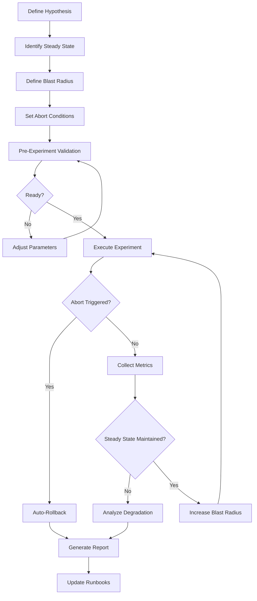

# Chaos Engineering Principles: Blast Radius, Steady State, Abort Conditions

## 1. Mục tiêu của Task

Hiểu sâu bản chất của Chaos Engineering — không phải là "phá hoại hệ thống cho vui", mà là một khoa học về việc **kiểm soát sự không chắc chắn trong distributed systems**. 

Mục tiêu cốt lõi:
- Làm chủ được 3 trụ cột: Blast Radius, Steady State, Abort Conditions
- Hiểu tại sao các nguyên tắc này tồn tại và chúng giải quyết bài toán gì
- Biết áp dụng đúng trong production mà không gây incidents

---

## 2. Bản chất và Cơ chế Hoạt động

### 2.1 Chaos Engineering là gì — định nghĩa từ gốc

Chaos Engineering không phải testing. Testing kiểm tra "system có hoạt động đúng không". Chaos Engineering kiểm tra "system có **tiếp tục hoạt động** khi mọi thứ sai lầm không".

> **Định nghĩa chính xác (Netflix):** "Chaos Engineering là ngành khoa học thực nghiệm về việc tạo ra sự tự tin trong hệ thống phân tán bằng cách làm việc với sự phức tạp có chủ đích."

Bản chất nằm ở 2 từ: **"thực nghiệm"** và **"có chủ đích"**.

- **Thực nghiệm:** Không phỏng đoán, không dựa vào lý thuyết. Inject failure thật, observe behavior thật.
- **Có chủ đích:** Mỗi experiment phải có hypothesis rõ ràng, measurable, và — quan trọng nhất — **reversible**.

### 2.2 Ba trụ cột: Tại sao cần cả ba?

```
┌─────────────────────────────────────────────────────────────┐
│                    CHAOS ENGINEERING                        │
├─────────────────────────────────────────────────────────────┤
│                                                             │
│   ┌─────────────┐    ┌─────────────┐    ┌─────────────┐    │
│   │BLAST RADIUS │    │STEADY STATE │    │   ABORT     │    │
│   │             │    │             │    │ CONDITIONS  │    │
│   │  "How much  │    │  "What is   │    │  "When to   │    │
│   │   can we    │    │   normal?   │    │    stop?"   │    │
│   │   break?"   │    │             │    │             │    │
│   └──────┬──────┘    └──────┬──────┘    └──────┬──────┘    │
│          │                  │                  │           │
│          └──────────────────┼──────────────────┘           │
│                             ▼                              │
│                  ┌─────────────────────┐                   │
│                  │  CONTROLLED FAILURE │                   │
│                  │      INJECTION      │                   │
│                  └─────────────────────┘                   │
└─────────────────────────────────────────────────────────────┘
```

#### 2.2.1 Blast Radius — Kiểm soát "vùng ảnh hưởng"

**Bản chất:** Đây là nguyên tắc **containment** — giới hạn thiệt hại tối đa có thể xảy ra trong một experiment.

Tại sao cần?
- Distributed systems có **cascade failures** — một lỗi nhỏ lan rộng nhanh chóng
- Production traffic không thể dừng để làm experiment
- Humans make mistakes — cần safety net khi experiment configuration sai

**Cơ chế kiểm soát:**

| Layer | Mechanism | Ví dụ thực tế |
|-------|-----------|---------------|
| **Scope** | Giới hạn số instance | Chỉ 1% pods, hoặc 1 AZ |
| **Duration** | Time-bound experiment | Max 5 phút, auto-rollback |
| **Traffic** | Request-based limiting | Chỉ traffic từ canary users |
| **Data** | Read-only operations | Không inject vào write path |
| **Environment** | Isolation boundary | Staging → Canary → Production |

> **Trade-off quan trọng:** Scope nhỏ → Confidence thấp (không đại diện); Scope lớng → Risk cao. Điểm cân bằng thường là **5-10% production traffic** cho mature systems.

#### 2.2.2 Steady State — Định nghĩa "bình thường"

**Bản chất:** Steady state là tập các **metrics và behavior patterns** mà hệ thống thể hiện khoảng 95% thờigian (không phải lúc nào cũng là "không có lỗi").

Tại sao khó?
- "Normal" là relative và thay đổi theo thờigian (seasonality, traffic patterns)
- Systems có nhiều normal states khác nhau (peak vs off-peak)
- Steady state của subsystem A có thể khác với global system

**Các loại Steady State Metrics:**

```
┌────────────────────────────────────────────────────────────┐
│                    STEADY STATE HIERARCHY                  │
├────────────────────────────────────────────────────────────┤
│                                                            │
│  ┌────────────────────────────────────────────────────┐   │
│  │           SYSTEM-LEVEL (Global)                    │   │
│  │  • Error rate < 0.1%                               │   │
│  │  • P99 latency < 500ms                             │   │
│  │  • Throughput matches forecast                     │   │
│  └──────────────────┬─────────────────────────────────┘   │
│                     │                                      │
│  ┌──────────────────┴─────────────────────────────────┐   │
│  │           SERVICE-LEVEL (Per Service)              │   │
│  │  • CPU/Memory utilization bands                    │   │
│  │  • Request queue depth                             │   │
│  │  • Circuit breaker state                           │   │
│  └──────────────────┬─────────────────────────────────┘   │
│                     │                                      │
│  ┌──────────────────┴─────────────────────────────────┐   │
│  │           BUSINESS-LEVEL (Domain)                  │   │
│  │  • Conversion rate                                 │   │
│  │  • Cart abandonment rate                           │   │
│  │  • User session duration                           │   │
│  └────────────────────────────────────────────────────┘   │
│                                                            │
└────────────────────────────────────────────────────────────┘
```

**Quan trọng:** Steady state phải được định nghĩa **trước khi** chạy experiment. Nếu không, bạn sẽ rationalize failure sau khi nó xảy ra.

#### 2.2.3 Abort Conditions — Ngưỡng "dừng lại"

**Bản chất:** Đây là **circuit breaker cho experiment itself** — tự động rollback khi hệ thống thoát khỏi safe zone.

Tại sao không thể thiếu?
- Humans react chậm (30s-2min) so với tốc độ failure lan rộng (seconds)
- Cognitive bias: người chạy experiment thường "chờ thêm chút nữa"
- 3 AM incidents thường bắt nguồn từ daytime experiments không được abort kịp

**Abort Condition Categories:**

| Category | Metric Type | Example Threshold | Priority |
|----------|-------------|-------------------|----------|
| **Hard Stop** | Error rate spike | Error rate > 5% | CRITICAL |
| **Hard Stop** | Latency degradation | P99 > 2000ms | CRITICAL |
| **Hard Stop** | Availability drop | Success rate < 95% | CRITICAL |
| **Soft Stop** | Resource exhaustion | CPU > 90% sustained | HIGH |
| **Soft Stop** | Queue buildup | Queue depth > 1000 | HIGH |
| **Warning** | Business metric drift | Conversion drop > 10% | MEDIUM |
| **Warning** | Degraded experience | Retry rate > 50% | MEDIUM |

> **Nguyên tắc vàng:** Hard stops phải **tự động và immediate**. Soft stops có thể có grace period 30-60s để xác nhận trend.

---

## 3. Kiến trúc và Luồng xử lý

### 3.1 Chaos Experiment Lifecycle



### 3.2 Blast Radius Expansion Strategy

```
Phase 1: Development (Isolated)
├── Single instance, synthetic traffic
├── No customer impact
└── Confidence: Low

Phase 2: Staging (Integrated)
├── Multiple instances, production-like data
├── No customer impact  
└── Confidence: Medium-Low

Phase 3: Canary (Limited Production)
├── 1-5% real traffic
├── 1 availability zone
└── Confidence: Medium

Phase 4: Production (Full)
├── 10-25% traffic
├── Multiple AZs
└── Confidence: High

Phase 5: GameDay (Organization-wide)
├── Full production load
├── Cross-team coordination
└── Confidence: Very High
```

---

## 4. So sánh các lựa chọn và Trade-offs

### 4.1 Blast Radius: Progressive vs. Aggressive

| Approach | Pros | Cons | Use Case |
|----------|------|------|----------|
| **Progressive (5% → 25%)** | Low risk, learn gradually | Long feedback loop, may miss edge cases | New services, critical paths |
| **Aggressive (50%+) ** | Fast learning, realistic stress | High risk, requires mature monitoring | Mature systems, off-peak hours |
| **Time-based (5 min bursts)** | Controlled exposure | May not trigger long-tail issues | Initial validation |
| **Request-based (canary)** | User-level isolation | Complex routing logic | A/B testing with chaos |

### 4.2 Steady State Definition: Static vs. Dynamic

| Approach | Pros | Cons | Implementation |
|----------|------|------|----------------|
| **Static thresholds** | Simple, predictable | Brittle with traffic changes | Hardcoded SLOs |
| **Dynamic baselines** | Adapts to patterns | Requires historical data | ML-based anomaly detection |
| **Hybrid (recommended)** | Best of both | More complex | Static safety + dynamic refinement |

### 4.3 Abort Strategy: Immediate vs. Gradual

| Strategy | When to Use | Risk |
|----------|-------------|------|
| **Immediate kill** | Critical metrics breach | Potential data inconsistency |
| **Graceful degradation** | Non-critical drift | Extended exposure to failure |
| **Escalation ladder** | Unclear severity | Delayed response |

---

## 5. Rủi ro, Anti-patterns và Pitfall

### 5.1 Anti-patterns nguy hiểm

#### ❌ **The "YOLO" Experiment**
Chạy chaos trong production mà không có abort conditions. Nguyên nhân phổ biến: "tôi sẽ watch dashboard closely".

**Hậu quả:** 2017 — một unicorn startup AWS outage 4 giờ vì chaos experiment không abort khi database connection pool cạn kiệt.

#### ❌ **Moving Goalposts**
Thay đổi steady state definition trong lúc chạy experiment để "pass".

**Dấu hiệu:** "Oh, P99 2s là bình thường cho giờ này mà" — khi vừa đặt threshold là 500ms.

#### ❌ **Scope Creep**
Bắt đầu với 1% traffic, thấy OK, tự ý tăng lên 50% mà không validate intermediate states.

#### ❌ **Blind Faith in Automation**
Tin tưởng 100% vào auto-abort mà không test abort path itself.

> **Pitfall:** Abort mechanism phụ thuộc vào cùng system đang bị inject failure → deadlock.

### 5.2 Failure Modes phổ biến

| Failure Mode | Nguyên nhân | Phát hiện |
|--------------|-------------|-----------|
| **Metric Blindness** | Steady state metrics không cover actual user impact | Business metrics drop nhưng system metrics xanh |
| **Insufficient Rollback** | Abort trigger nhưng rollback incomplete | Partial recovery, degraded state |
| **Cascade Ignorance** | Không account cho downstream effects | Service A OK nhưng Service B, C fail |
| **Time-of-day Bias** | Experiment chỉ chạy giờ thấp điểm | Miss peak-time behavior |
| **Confirmation Bias** | Tìm evidence để pass thay vì learn | Ignore warning signals |

### 5.3 Production Pitfalls

1. **Friday Afternoon Experiments** — Không bao giờ. Weekend on-call sẽ căm bạn.

2. **Unannounced Experiments** — Team liên quan phải được notify trước, có channel để escalate.

3. **Data Corruption Risk** — Chaos trên write path có thể corrupt data permanently. Prefer read-path hoặc use cloned data.

4. **Compliance Violations** — GDPR, PCI-DSS có thể cấm một số loại failure injection trên sensitive data.

---

## 6. Khuyến nghị thực chiến trong Production

### 6.1 Maturity Model

```
Level 1: Ad-hoc (Chaos Monkey)
├── Random instance termination
├── No steady state definition
└── Manual monitoring

Level 2: Systematic (Chaos Engineering)
├── Defined experiments with hypothesis
├── Automated steady state checking
├── Pre-defined abort conditions

Level 3: Continuous (Chaos as CI/CD)
├── Automated chaos in pipeline
├── Self-healing validation
├── GameDay exercises quarterly

Level 4: Organizational (Chaos Culture)
├── All teams practice chaos
├── Chaos-driven architecture decisions
├── Customer-obsessed resilience
```

### 6.2 Runbook Template cho Chaos Experiment

```markdown
## Experiment: [Name]

### Hypothesis
Nếu [failure mode] xảy ra trên [component], 
thì [expected behavior] sẽ maintain.

### Steady State Metrics
- Error rate: < 0.5%
- P99 latency: < 200ms  
- Throughput: > 1000 RPS

### Blast Radius
- Scope: 5% production pods in us-east-1
- Duration: 10 minutes max
- Traffic: Non-critical user segment

### Abort Conditions
- Auto-abort: Error rate > 2%, P99 > 1000ms
- Manual abort: Any customer complaint
- Rollback time: < 30 seconds

### Contacts
- Experiment owner: @slack-handle
- Escalation: #incident-response
- Stakeholders: Team A, Team B
```

### 6.3 Tooling Recommendations

| Tool | Strength | Best For |
|------|----------|----------|
| **Chaos Monkey** | Simple, proven | Getting started, AWS |
| **Gremlin** | Enterprise features | Multi-cloud, compliance |
| **Chaos Mesh** | Kubernetes-native | K8s-heavy environments |
| **Litmus** | Open source, extensible | Custom workflows |

### 6.4 Observability Requirements

Bạn **không thể** làm chaos engineering mà không có:

1. **Distributed tracing** — biết request flow qua các services
2. **Real-time metrics** — < 10s delay cho critical metrics  
3. **Log aggregation** — correlate chaos events với application logs
4. **Alerting** — notify khi abort conditions trigger
5. **Dashboard** — single pane of glass cho experiment owner

---

## 7. Kết luận

Chaos Engineering không phải là "phá hoại có chủ đích" — đó là **khoa học của sự tự tin**. Ba trụ cột Blast Radius, Steady State, và Abort Conditions tồn tại để biến chaos từ "risky experiment" thành "controlled learning".

**Bản chất cốt lõi cần nhớ:**

1. **Blast Radius** — Luôn có thể giải thích tại sao scope được chọn. Nếu không, scope quá lớn.

2. **Steady State** — Metrics phải được định nghĩa trước khi chạy experiment. Không có "hindsight steady state".

3. **Abort Conditions** — Phải tự động, tested, và independent khỏi system đang bị test.

**Trade-off quan trọng nhất:** Learning velocity vs. Operational risk. Organizations mature nhất accept rằng **không chạy chaos cũng là một quyết định có risk** — risk của unknown unknowns.

> **Final thought:** Chaos Engineering là insurance. Bạn trả premium (thờigian, complexity) để đổi lấy confidence khi things go wrong. Câu hỏi không phải "có nên làm chaos engineering không", mà là "tôi có đủ confident về hệ thống để không cần làm không?"

---

## 8. Tài liệu tham khảo

1. Netflix Tech Blog — "Chaos Engineering Upgraded"
2. AWS Well-Architected — Reliability Pillar (Chaos Engineering section)
3. Google SRE Book — "DiRT: Disaster Recovery Testing"
4. Chaos Engineering book — Casey Rosenthal & Nora Jones (O'Reilly)
5. Gremlin — Chaos Engineering maturity model
