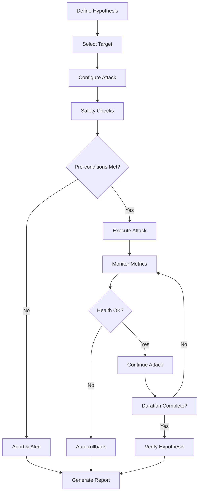

# Resilience Testing - Gremlin, Chaos Mesh, Failure Injection

## 1. Mục tiêu của Task

Hiểu sâu bản chất của **Resilience Testing** (kiểm thử khả năng chịu đựng) trong hệ thống phân tán, phân tích các công cụ Chaos Engineering phổ biến (Gremlin, Chaos Mesh, Litmus), và nắm vững các kỹ thuật failure injection ở nhiều tầng khác nhau.

> **Phân biệt quan trọng**: Chaos Engineering ≠ Resilience Testing
> - **Chaos Engineering**: Triết lý, quy trình khám phá điểm yếu chưa biết
> - **Resilience Testing**: Kỹ thuật cụ thể để xác nhận hệ thống chịu được lỗi đã định nghĩa

---

## 2. Bản Chất và Cơ Chế Hoạt Động

### 2.1. Failure Injection - Tầng Triển Khai

Failure injection hoạt động ở **4 tầng kiến trúc** với cơ chế và độ tin cậy khác nhau:

| Tầng | Cơ chế | Độ tin cậy | Ví dụ công cụ |
|------|--------|-----------|---------------|
| **Application** | Code instrumentation, Middleware hooks | Thấp - có thể bị bypass | Byteman, Chaos Monkey |
| **Container/Pod** | Container runtime manipulation, cgroups | Cao - ép buộc ở OS level | Chaos Mesh, Litmus |
| **Node/VM** | OS kernel interfaces, system calls | Rất cao - tác động OS | Gremlin, Chaos Blade |
| **Network** | Traffic manipulation, packet dropping | Cao - infrastructure level | Toxiproxy, Istio fault injection |

#### Cơ chế ở tầng Container (Chaos Mesh)

```
┌─────────────────────────────────────────┐
│           Chaos Mesh Controller         │
│     (Kubernetes CRD + Scheduler)        │
└─────────────┬───────────────────────────┘
              │ Watch CRDs (Chaos experiments)
              ▼
┌─────────────────────────────────────────┐
│         Chaos Daemon (DaemonSet)        │
│    (Chạy privileged trên mỗi node)      │
│                                         │
│  • Network namespace manipulation       │
│  • Cgroups v1/v2 constraints            │
│  • ptrace system calls                  │
│  • eBPF probes (optional)               │
└─────────────┬───────────────────────────┘
              │ Execute experiments
              ▼
┌─────────────────────────────────────────┐
│    Target Pod/Container                 │
│  (Network delay, CPU stress, I/O fault) │
└─────────────────────────────────────────┘
```

**Bản chất cơ chế**:
1. **Network Chaos**: Sử dụng `tc` (traffic control) + `netem` để inject delay, loss, corruption vào network interface của container
2. **Stress Chaos**: Sử dụng `stress-ng` hoặc cgroups để giới hạn/tiêu thụ CPU/Memory
3. **IO Chaos**: Sử dụng `fuse` filesystem hoặc device mapper để inject latency vào I/O operations

#### Cơ chế ở tầng Node (Gremlin)

Gremlin chạy như một **agent có quyền root** với cơ chế khác biệt:

```
┌─────────────────────────────────────────┐
│       Gremlin Control Plane (SaaS)      │
│    (AWS/GCP/Azure hosted)               │
│  • Scenario definitions                 │
│  • Scheduling & orchestration           │
│  • Compliance & safety checks           │
└─────────────┬───────────────────────────┘
              │ HTTPS/WebSocket
              ▼
┌─────────────────────────────────────────┐
│       Gremlin Agent (on each node)      │
│  (Có quyền root, kernel module access)  │
│                                         │
│  Attack Types:                          │
│  • Process killer (SIGTERM/SIGKILL)     │
│  • Resource exhaustion (memory, disk)   │
│  • Network manipulation (iptables, tc)  │
│  • Disk operations (fill disk, corrupt) │
│  • State attacks (shutdown, reboot)     │
└─────────────────────────────────────────┘
```

### 2.2. Safety Mechanisms - Cơ chế an toàn

**Vấn đề cốt lõi**: Failure injection có thể gây **production outage thực sự** nếu không kiểm soát. Các công cụ hiện đại implement nhiều lớp bảo vệ:

#### Abort Conditions (Điều kiện dừng khẩn cấp)

```
┌─────────────────────────────────────────┐
│         Health Check Monitor            │
│  (Continuous verification during attack)│
│                                         │
│  IF (error_rate > threshold OR          │
│      latency_p99 > threshold OR         │
│      availability < threshold)          │
│  THEN                                   │
│      AUTO_ROLLBACK()                    │
│      ALERT_TEAM()                       │
└─────────────────────────────────────────┘
```

#### Blast Radius Control

| Cơ chế | Mô tả | Triển khai |
|--------|-------|-----------|
| **Percentage-based** | Chỉ affect X% instances/pods | Gremlin, Chaos Mesh |
| **Environment isolation** | Chỉ chạy ở staging/dev | Gremlin Teams, Custom gates |
| **Time-boxed** | Giới hạn duration tối đa | Tất cả công cụ |
| **Blacklist/Whitelist** | Protect critical services | Custom labels/selectors |
| **Circuit Breaker** | Tự động dừng khi hệ thống không ổn định | Gremlin, custom implementation |

---

## 3. Kiến Trúc và Luồng Xử Lý

### 3.1. Chaos Experiment Lifecycle



### 3.2. Phân biệt Architecture: Control Plane vs Data Plane

| Khía cạnh | Gremlin | Chaos Mesh | Litmus |
|-----------|---------|------------|--------|
| **Control Plane** | SaaS (managed) | Self-hosted (Kubernetes) | Self-hosted (Kubernetes) |
| **Deployment model** | Agent-based | Kubernetes-native | Kubernetes-native |
| **Multi-cloud** | Built-in | Cần nhiều cluster | Cần nhiều cluster |
| **RBAC integration** | Basic | Kubernetes RBAC | Kubernetes RBAC |
| **Audit logging** | Built-in | Kubernetes audit | Kubernetes audit |

---

## 4. So Sánh Các Công Cụ

### 4.1. Gremlin - Enterprise SaaS

**Mục tiêu thiết kế**: 
- **Simplicity over flexibility**: UI-first, low learning curve
- **Cross-platform**: Linux, Windows, macOS, container, Kubernetes
- **Enterprise compliance**: SOC2, GDPR, audit trails

**Trade-off**:
- ✅ Dễ setup, không cần maintain infrastructure
- ✅ Scenario library phong phú (pre-built attacks)
- ✅ GameDay coordination features
- ❌ Vendor lock-in, subscription cost
- ❌ Limited customization cho complex scenarios
- ❌ Data sovereignty concerns (SaaS)

### 4.2. Chaos Mesh - Cloud-Native Open Source

**Mục tiêu thiết kế**:
- **Kubernetes-native**: CRD-based, GitOps friendly
- **Flexible & extensible**: Custom resource definitions
- **CNCF Sandbox project**: Community-driven

**Trade-off**:
- ✅ Deep Kubernetes integration
- ✅ Custom chaos scenarios (code-level)
- ✅ Free, open source
- ❌ Chỉ hoạt động tốt trên Kubernetes
- ❌ Steeper learning curve
- ❌ Tự maintain, upgrade

### 4.3. LitmusChaos - GitOps-First

**Mục tiêu thiết kế**:
- **GitOps-native**: Experiments as YAML in Git
- **CI/CD integration**: Chaos trong pipeline
- **Declarative**: Infrastructure as Code cho chaos

**Trade-off**:
- ✅ Tight CI/CD integration
- ✅ Hub-based experiment sharing
- ✅ Cross-cloud (AWS, GCP, Azure specific experiments)
- ❌ Smaller community than Chaos Mesh
- ❌ Documentation chưa đầy đủ

### 4.4. Comparison Matrix

| Tiêu chí | Gremlin | Chaos Mesh | Litmus |
|----------|---------|------------|--------|
| **Setup complexity** | ⭐⭐ (Low) | ⭐⭐⭐⭐ (High) | ⭐⭐⭐ (Medium) |
| **Kubernetes-native** | ⭐⭐⭐ | ⭐⭐⭐⭐⭐ | ⭐⭐⭐⭐⭐ |
| **Multi-platform** | ⭐⭐⭐⭐⭐ | ⭐⭐ (Linux only) | ⭐⭐⭐ |
| **Customization** | ⭐⭐⭐ | ⭐⭐⭐⭐⭐ | ⭐⭐⭐⭐ |
| **Enterprise support** | ⭐⭐⭐⭐⭐ | ⭐⭐⭐ | ⭐⭐⭐ |
| **Cost** | $$$ | Free | Free |

---

## 5. Rủi Ro, Anti-Patterns, Lỗi Thường Gặp

### 5.1. Catastrophic Anti-Patterns

> ⚠️ **ANTI-PATTERN: "Chaos in Production without Safety Net"**
> 
> Chạy failure injection trên production KHÔNG CÓ:
> - Health checks tự động
> - Rollback mechanisms
> - On-call engineer standby
> - Runbook documented

**Hệ quả thực tế**: 
- 2017: Netflix Chaos Monkey accidentally terminated critical cache cluster → 2-hour outage
- 2019: Company X (anonymous) chạy disk fill attack trên production DB → data corruption, 6-hour recovery

### 5.2. Blast Radius Miscalculation

```
Ví dụ thực tế:

Kỳ vọng: "Chỉ affect 10% pods của service Cart"
Thực tế: 
  - Cart service có HPA (Horizontal Pod Autoscaler)
  - CPU spike trigger scale-up
  - New pods cũng bị affect (label selector)
  - Cascade: 10% → 100% pods affected
  
Hệ quả: Service Cart hoàn toàn down
```

### 5.3. Network Partition Misunderstanding

> **Lỗi phổ biến**: Nghĩ rằng network partition chỉ delay traffic
>
> **Thực tế**: 
> - TCP connections bị drop → application phải handle reconnection
> - Database connections pool exhausted
> - Distributed transactions bị treo (in-doubt)
> - Split-brain scenarios với consensus systems

### 5.4. Failure Mode Analysis

| Attack Type | Hidden Risk | Detection Method |
|-------------|-------------|------------------|
| **CPU Stress** | Thermal throttling, noisy neighbor | Monitor CPU throttling metrics |
| **Memory Exhaustion** | OOM killer chọn process sai, kernel panic | Kernel logs, OOM score monitoring |
| **Disk Fill** | Inode exhaustion (không phải space), log rotation failure | df -i, inode monitoring |
| **Network Delay** | Buffer bloat, head-of-line blocking | Queue depth monitoring |
| **DNS Failure** | Caching masks real behavior, TTL confusion | DNS query tracing |
| **Time Drift** | Certificate validation failures, token expiry | NTP monitoring, auth logs |

---

## 6. Khuyến Nghị Thực Chiến Production

### 6.1. Progressive Resilience Testing Roadmap

```
Level 1: Development Environment
├── Kill individual container instances
├── Simulate dependency failures (mock services)
└── Validate basic circuit breaker behavior

Level 2: Staging Environment  
├── Network delay between services
├── Database failover scenarios
└── Cache unavailability handling

Level 3: Production (Read-Only Traffic)
├── Low-impact attacks on non-critical paths
├── Controlled blast radius (1% traffic)
└── Business hours only, full monitoring

Level 4: Production (Critical Path)
├── Full GameDay scenarios
├── Cross-region failover
└── 24/7 on-call, automated rollback
```

### 6.2. Monitoring & Observability Requirements

**Metrics cần track trong suốt experiment**:

| Category | Metrics | Alert Threshold |
|----------|---------|-----------------|
| **Application** | Error rate, Latency p50/p99/p999, Throughput | Error rate > baseline + 5% |
| **Infrastructure** | CPU, Memory, Disk I/O, Network I/O | Resource saturation |
| **Business** | Checkout completion rate, Payment success | Business impact detected |
| **Chaos** | Experiment status, Blast radius coverage | Experiment stuck, auto-rollback triggered |

### 6.3. Tool Selection Decision Tree

```
Bạn đang ở môi trường nào?
├── Non-Kubernetes (VMs, bare metal)
│   └── Gremlin (hoặc Chaos Blade cho open source)
│
├── Kubernetes single cluster
│   ├── Cần GitOps integration? 
│   │   ├── Yes → Litmus
│   │   └── No → Chaos Mesh
│   └──
│
├── Kubernetes multi-cluster
│   ├── Có budget cho SaaS?
│   │   ├── Yes → Gremlin
│   │   └── No → Chaos Mesh + custom federation
│   └──
│
└── Hybrid (K8s + VMs)
    └── Gremlin (hoặc kết hợp tools)
```

### 6.4. Java-Specific Considerations

**Thread pool exhaustion under chaos**:

```
Kịch bản: Network delay được inject vào downstream service

Java application với fixed thread pool:
- Threads block waiting for response
- Thread pool exhausted
- Cascade: Other requests cũng bị reject
- Application "freeze" hoàn toàn

Giải pháp:
1. Bulkhead pattern - separate thread pools per dependency
2. Async/non-blocking I/O (WebFlux, Virtual Threads Java 21+)
3. Proper timeout configuration (connect vs read timeout)
4. Circuit breaker with fallback
```

**JVM behavior under resource stress**:

| Attack | JVM Behavior | Monitoring |
|--------|-------------|------------|
| CPU Stress | GC pauses increase, JIT compilation delayed | GC logs, safepoint stats |
| Memory Pressure | Frequent GC, potential OOM | Heap usage, GC frequency |
| I/O Delay | Thread blocking, connection pool exhaustion | Thread dumps, connection pool metrics |
| Time Chaos | Certificate failures, JWT expiry, cache TTL issues | Auth logs, NTP sync |

---

## 7. Kết Luận

**Bản chất của Resilience Testing** không phải là "phá hệ thống" mà là **xác nhận hệ thống có khả năng tự phục hồi** khi gặp lỗi. 

**Ba nguyên tắc vàng**:

1. **Start small, expand gradually**: Staging trước production, read-only trước critical path
2. **Safety first**: Auto-rollback, blast radius control, abort conditions là bắt buộc
3. **Hypothesis-driven**: Mỗi experiment phải test một giả thuyết cụ thể, không phải random destruction

**Trade-off quan trọng nhất**: 
- Gremlin = Simplicity + Cost
- Chaos Mesh = Flexibility + Complexity  
- Litmus = GitOps + Maintenance burden

**Rủi ro lớn nhất**: 
Chạy chaos experiments mà không có **observability đầy đủ** - bạn sẽ không biết hệ thống đang fail ở đâu và tại sao.

---

## 8. References

- [Chaos Engineering Book (Casey Rosenthal)](https://www.oreilly.com/library/view/chaos-engineering/9781491983850/)
- [Chaos Mesh Documentation](https://chaos-mesh.org/docs/)
- [Gremlin Documentation](https://www.gremlin.com/docs/)
- [LitmusChaos Documentation](https://docs.litmuschaos.io/)
- [CNCF Chaos Engineering White Paper](https://github.com/cncf/tag-app-delivery/blob/main/chaos-engineering-wg/whitepaper.md)
- [AWS Fault Injection Simulator](https://docs.aws.amazon.com/fis/)
- [Azure Chaos Studio](https://docs.microsoft.com/en-us/azure/chaos-studio/)
