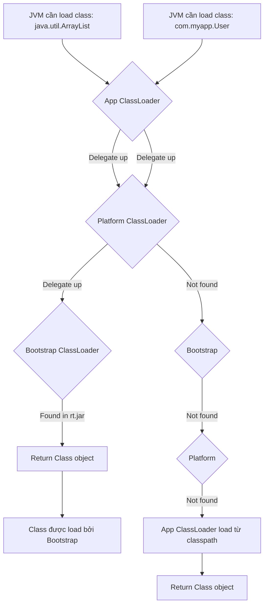

# ClassLoader Hierarchy: Bản Chất và Thực Chiến

## 1. Mục tiêu của Task

Hiểu sâu cơ chế **Class Loading** trong JVM - không chỉ dừng ở "Bootstrap → Extension → Application", mà phải nắm được:
- Bản chất của **Delegation Model** và tại sao nó tồn tại
- Cách JVM thực sự tìm và nạp bytecode
- Các pattern triển khai ClassLoader tùy chỉnh
- Trade-off khi vi phạm nguyên tắc parent-first
- Ứng dụng thực tế: hot-reload, plugin system, container isolation

---

## 2. Bản Chất và Cơ Chế Hoạt Động

### 2.1 ClassLoader là gì ở tầng JVM?

ClassLoader không đơn thuần là "một object load class". Ở tầng JVM, nó là **abstraction layer** giữa:
- **Binary bytecode** (ở disk/network/memory)
- **Runtime Class object** (ở Heap, là template để tạo instance)

```
┌─────────────────────────────────────────────────────────────┐
│                      JVM RUNTIME                            │
├─────────────────────────────────────────────────────────────┤
│  ┌──────────────┐     ┌──────────────┐     ┌─────────────┐ │
│  │   .class     │────▶│  ClassLoader │────▶│  Class<?>   │ │
│  │   (bytes)    │     │  (transform) │     │  (metadata) │ │
│  └──────────────┘     └──────────────┘     └─────────────┘ │
│         │                                            │      │
│         ▼                                            ▼      │
│    [Source]                                     [Heap]      │
│  - File System                               - Method Area  │
│  - Network URL                               - Class object │
│  - Byte array                                - Reflection   │
│  - Generated bytecode                                     │
└─────────────────────────────────────────────────────────────┘
```

> **Lưu ý quan trọng:** Mỗi ClassLoader instance tạo ra một **namespace riêng**. Cùng một class `com.example.User` được load bởi 2 ClassLoader khác nhau → **2 Class object khác nhau** trong JVM → `instanceof` thất bại, cast exception.

### 2.2 Parent-First Delegation Model

JVM sử dụng **Parent-First Delegation** - không phải để tối ưu, mà để **đảm bảo tính nhất quán của core platform classes**.



**Cơ chế chi tiết:**

1. `loadClass(String name)` được gọi
2. Kiểm tra cache local: `findLoadedClass(name)` - **quy tắc số 1**
3. Nếu chưa có, delegate cho parent: `parent.loadClass(name)` - **quy tắc số 2**
4. Nếu parent trả về null, tự load: `findClass(name)` - **quy tắc số 3**

> **Tại sao parent-first quan trọng?**
> - Bảo vệ core classes khỏi bị override (security)
> - Đảm bảo `java.lang.String` từ JDK, không phải từ malicious classpath
> - Singleton classes trong parent scope được share

### 2.3 Ba ClassLoader Chuẩn

| ClassLoader | Implemented in | Loads from | Parent |
|-------------|----------------|------------|--------|
| **Bootstrap** | C++ (native) | `JAVA_HOME/lib` (rt.jar, etc.) | null |
| **Platform**<br/>(Extension) | Java | `JAVA_HOME/lib/ext`,<br/>`java.ext.dirs` | Bootstrap |
| **Application**<br/>(System) | Java | `-cp`, `-classpath`,<br/>`CLASSPATH` env | Platform |

**Code để introspect:**

```java
// Mỗi class "nhớ" classloader đã load nó
Class<?> clazz = String.class;
ClassLoader loader = clazz.getClassLoader(); // null = Bootstrap

// ClassLoader hierarchy
ClassLoader app = Thread.currentThread().getContextClassLoader();
ClassLoader platform = app.getParent();
ClassLoader bootstrap = platform.getParent(); // null
```

---

## 3. Kiến Trúc và Luồng Xử Lý

### 3.1 Class Loading Lifecycle

```
┌─────────────┐    ┌──────────────┐    ┌─────────────┐    ┌─────────────┐
│   Loading   │───▶│  Linking     │───▶│  Initialize │───▶│   Ready     │
│  (Tìm file) │    │ (Verification│    │  (Execute   │    │  (Sử dụng)  │
│             │    │ Preparation  │    │  <clinit>)  │    │             │
│             │    │ Resolution)  │    │             │    │             │
└─────────────┘    └──────────────┘    └─────────────┘    └─────────────┘
       │
       ▼ ClassLoader.findClass()
┌────────────────────────────────────────────────────────────────────┐
│  1. Binary name → locate .class file                               │
│  2. Read bytes into byte[]                                         │
│  3. defineClass(name, bytes, offset, length)                       │
│     → Tạo Class object trong Method Area                           │
└────────────────────────────────────────────────────────────────────┘
```

**Phân biệt rõ 3 phương thức:**

| Method | Visibility | Purpose |
|--------|------------|---------|
| `loadClass(String)` | public | Entry point, có delegation logic |
| `findClass(String)` | protected | **Override point** - tự định nghĩa cách tìm class |
| `defineClass(...)` | protected final | **JVM bridge** - biến byte[] thành Class object |

### 3.2 Custom ClassLoader Pattern

```java
public class PluginClassLoader extends URLClassLoader {
    
    private final boolean parentFirst;
    
    public PluginClassLoader(URL[] urls, ClassLoader parent, boolean parentFirst) {
        super(urls, parent);
        this.parentFirst = parentFirst;
    }
    
    @Override
    protected Class<?> loadClass(String name, boolean resolve) {
        // 1. Kiểm tra đã load chưa
        Class<?> c = findLoadedClass(name);
        if (c != null) return c;
        
        // 2. Quyết định: parent-first hay child-first?
        if (parentFirst || isSystemClass(name)) {
            try {
                return super.loadClass(name, resolve);
            } catch (ClassNotFoundException e) {
                // Parent không tìm thấy, thử local
            }
        }
        
        // 3. Thử load từ local URLs trước
        try {
            c = findClass(name);
            if (resolve) resolveClass(c);
            return c;
        } catch (ClassNotFoundException e) {
            if (!parentFirst) {
                return super.loadClass(name, resolve);
            }
            throw e;
        }
    }
}
```

---

## 4. So Sánh Các Pattern

### 4.1 Parent-First vs Child-First

| Tiêu chí | Parent-First | Child-First |
|----------|--------------|-------------|
| **Mục đích** | Security, consistency | Isolation, versioning |
| **Rủi ro** | Parent classes "lọt" vào child | Inconsistent if parent already loaded |
| **Use case** | Servlet containers (spec compliance) | Plugin systems, OSGi, hot-reload |
| **Memory** | Share classes, efficient | Duplicate classes, isolation |

> **Tomcat mặc định Parent-First**, nhưng cho phép `<Loader delegate="false"/>` để plugin có thể override libs riêng.

### 4.2 ClassLoader Isolation Levels

```
LEVEL 1: Share Everything (Monolith)
┌─────────────────────────────────────────┐
│  Single ClassLoader, tất cả classes     │
│  share cùng namespace                   │
└─────────────────────────────────────────┘
                │
                ▼ Khi có xung đột version
LEVEL 2: Parent-Child (Web Containers)
┌─────────────────────────────────────────┐
│  Bootstrap │ Platform │ Common │ Webapp │
│  (shared)     (shared)  (shared) (isolated)
└─────────────────────────────────────────┘
                │
                ▼ Khi cần hot-reload, dynamic
LEVEL 3: Peer Isolation (OSGi, Plugin)
┌─────────────────────────────────────────┐
│  Bootstrap │ Platform │ [PluginA][PluginB]│
│                         (full isolation)│
└─────────────────────────────────────────┘
```

---

## 5. Rủi Ro, Anti-Patterns, Lỗi Thường Gặp

### 5.1 ClassCastException: Same Class, Different Loader

```java
// Plugin A loaded User.class từ ClassLoader A
Object userFromA = pluginA.loadClass("com.model.User").newInstance();

// Plugin B cố cast về User (được load bởi ClassLoader B)
User user = (User) userFromA; // 💥 ClassCastException

// Kiểm tra
userFromA.getClass().getClassLoader(); // PluginAClassLoader@1234
User.class.getClassLoader();           // PluginBClassLoader@5678
```

**Giải pháp:**
- Định nghĩa **shared API interfaces** ở parent ClassLoader
- Plugin chỉ implement interface, không bundle interface
- Sử dụng **ServiceLoader pattern** hoặc SPI

### 5.2 Memory Leak: ClassLoader Retention

```java
// Anti-pattern: Static field giữ reference
public class PluginManager {
    private static List<Class<?>> loadedClasses = new ArrayList<>();
    
    public void loadPlugin(URLClassLoader loader) {
        Class<?> clazz = loader.loadClass("Plugin");
        loadedClasses.add(clazz); // 💥 Loader và tất cả classes 
                                  // bị giữ mãi mãi
    }
}
```

**Nguyên nhân:** Mỗi Class object reference đến ClassLoader của nó. Nếu giữ Class → giữ ClassLoader → giữ tất cả classes trong loader đó.

**Giải pháp:**
- Dùng `WeakReference<Class<?>>`
- Explicit `close()` cho URLClassLoader (Java 7+)
- Clear ThreadLocal, shutdown hooks, JDBC drivers

### 5.3 Thread Context ClassLoader (TCCL)

JDBC là ví dụ điển hình của **TCCL problem**:

```java
// DriverManager ở Bootstrap ClassLoader
driver = Class.forName("com.mysql.Driver"); // Bootstrap load

// Nhưng Driver cần load từ App classpath
// → Dùng Thread.currentThread().getContextClassLoader()
```

**Quy tắc:**
- Framework code (load bởi Bootstrap/Platform) cần load user classes
- → Dùng `Thread.currentThread().getContextClassLoader()`
- → Không dùng `this.getClass().getClassLoader()` trong framework code

---

## 6. Khuyến Nghị Thực Chiến Production

### 6.1 Khi Nào Viết Custom ClassLoader?

| Scenario | Implementation |
|----------|----------------|
| **Hot-reload** | Load mới ClassLoader, discard old. Cần cleanup thread pools, connections. |
| **Plugin system** | URLClassLoader per plugin + parent delegation cho shared libs. |
| **Multi-tenancy** | ClassLoader isolation per tenant. Cân nhắc memory overhead. |
| **Bytecode transform** | Extend ClassLoader, override `findClass` để transform trước `defineClass`. |

### 6.2 Monitoring và Debugging

```bash
# Liệt kê tất cả ClassLoader và số class đã load
jcmd <pid> VM.classloader_stats

# Chi tiết từng ClassLoader
jcmd <pid> VM.class_hierarchy -i

# Memory: ClassLoader và classes
jmap -clstats <pid>
```

**Red flags:**
- ClassLoader count tăng không giới hạn (plugin leak)
- Metaspace usage tăng sau mỗi deploy (reload không cleanup)
- `ClassCastException` với classes cùng tên

### 6.3 Java Modules (JPMS) và ClassLoader

Java 9+ thay đổi landscape:

```
Pre-Java 9:                    Java 9+:
┌──────────────┐              ┌────────────────────────────┐
│  Bootstrap   │              │  Bootstrap (java.base)     │
│  (rt.jar)    │              │  Platform (java.sql, etc.) │
│              │              │  App ClassLoader           │
│  Extension   │              │  └── ModuleLayer (custom)  │
│  App         │              │      └── Plugin modules    │
└──────────────┘              └────────────────────────────┘
```

- **ModuleLayer** cho phép tạo ClassLoader tree phức tạp
- **Unnamed modules** cho backward compatibility
- Cân nhắc migration khi dùng custom ClassLoader

---

## 7. Kết Luận

**Bản chất:** ClassLoader là **namespace manager** của JVM. Nó quyết định:
1. Class nào được load (security boundary)
2. Class được load từ đâu (flexibility)
3. Class có được share không (isolation)

**Trade-off cốt lõi:**
- **Parent-first:** Security, consistency, memory efficiency
- **Child-first:** Flexibility, versioning, isolation
- **Peer isolation:** Maximum isolation, maximum memory overhead

**Trong production:**
- Đa số ứng dụng không cần custom ClassLoader
- Khi cần (plugins, hot-reload): cẩn thận với memory leak, cleanup, TCCL
- Ưu tiên frameworks đã giải quyết (Spring Boot devtools, OSGi, JPMS)

> **Chốt lại:** Hiểu ClassLoader không phải để viết ClassLoader mới, mà là để **debug ClassCastException, memory leak, và hiểu vì sao Tomcat/Spring Boot devtools hoạt động như vậy**.
