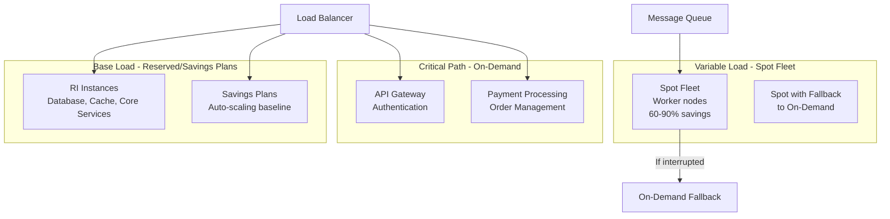

# Cloud Cost Management - Reserved Instances, Spot Instances, Savings Plans

## 1. Mục tiêu của task

Hiểu sâu các mô hình pricing của cloud (AWS/Azure/GCP), cơ chế hoạt động của Reserved Instances (RI), Spot Instances, Savings Plans, và các chiến lược tối ưu chi phí ở quy mô production. Tập trung vào trade-offs, rủi ro vận hành, và khung quyết định khi nào nên dùng phương án nào.

---

## 2. Bản chất và cơ chế hoạt động

### 2.1. Reserved Instances (RIs) / Reserved Capacity

**Bản chất:** Đây là hợp đồng mua trước capacity với cam kết sử dụng 1-3 năm, đổi lấy discount 30-72% so với On-Demand.

**Cơ chế hoạt động ở tầng thấp:**

```
┌─────────────────────────────────────────────────────────────────┐
│                    RI PURCHASE FLOW                            │
├─────────────────────────────────────────────────────────────────┤
│                                                                 │
│   User commits ──► Cloud Provider reserves capacity            │
│   (1-3 years)      in specific AZ/Region                        │
│                                                                 │
│         │                           │                          │
│         ▼                           ▼                          │
│   ┌─────────────┐           ┌──────────────┐                   │
│   │  Financial  │           │   Capacity   │                   │
│   │  Commitment │           │  Reservation │                   │
│   │  (Upfront/  │           │  (Physical   │                   │
│   │  Partial/   │           │   hardware   │                   │
│   │  No upfront)│           │   reserved)  │                   │
│   └─────────────┘           └──────────────┘                   │
│                                                                 │
│   Discount applied via:                                         │
│   - Billing adjustment (AWS)                                    │
│   - Direct price reduction (Azure Reserved VM)                 │
│                                                                 │
└─────────────────────────────────────────────────────────────────┘
```

**Kiến trúc discount application (AWS model):**

```
Hourly Usage ──► Match with RI attributes ──► Apply discount
                    │
                    ├── Instance family (m5, c6g, etc.)
                    ├── Region/AZ
                    ├── Operating System
                    ├── Tenancy (Shared/Dedicated)
                    └── Size (micro, small, large...)
```

**Quan trọng:** RI không gắn với specific instance ID. Nó là **billing discount** được áp dụng vào bất kỳ instance nào match attributes. Điều này cho phép:
- Launch/terminate instance bình thường
- RI discount tự động apply vào usage phù hợp
- Flexibility trong việc thay đổi instance (cùng family)

### 2.2. Spot Instances / Preemptible VMs

**Bản chất:** Sử dụng idle capacity của cloud provider với discount 60-90%, nhưng có thể bị thu hồi (terminate/interrupt) bất cứ lúc nào khi capacity cần cho On-Demand/RI.

**Cơ chế thu hồi (AWS Spot):**

```
┌────────────────────────────────────────────────────────────────┐
│                  SPOT CAPACITY ALLOCATION                      │
├────────────────────────────────────────────────────────────────┤
│                                                                │
│  Available Capacity                                            │
│        │                                                       │
│        ▼                                                       │
│  ┌─────────────┐                                               │
│  │   Reserved  │ ◄── Guaranteed, highest priority             │
│  │  (RIs/OD)   │                                               │
│  └─────────────┘                                               │
│        │                                                       │
│        ▼                                                       │
│  ┌─────────────┐     ┌─────────────────┐                      │
│  │  On-Demand  │ ◄── │   Spot Fleet    │ ◄── Fluctuating      │
│  │   (OD)      │     │   (Spot Inst)   │      capacity         │
│  └─────────────┘     └─────────────────┘                      │
│                              │                                 │
│                              ▼                                 │
│                    ┌─────────────────┐                        │
│                    │  2-min warning  │ ◄── AWS sends          │
│                    │  (rebalance rec)│      termination notice │
│                    └─────────────────┘                        │
│                                                                │
└────────────────────────────────────────────────────────────────┘
```

**Cơ chế bidding (Legacy AWS):**
- Trước đây: User đặt max price, instance terminate khi spot price > max price
- Hiện tại: AWS đã bỏ bidding model, thay bằng **capacity-based interruption**
- Spot price giờ là market-driven nhưng instance chỉ bị interrupt khi AWS cần capacity

**Azure Spot / GCP Preemptible:**
- **Azure Spot**: Tương tự AWS, có eviction policy (Deallocate/Delete)
- **GCP Preemptible**: 24-hour limit tự động terminate, discount ~80%

### 2.3. Savings Plans

**Bản chất:** Flexible RI - commit sử dụng $/giờ thay vì specific instance type.

**Sự khác biệt cốt lõi với RI:**

| Aspect | Reserved Instances | Savings Plans |
|--------|-------------------|---------------|
| **Commitment unit** | Instance type, region, OS cụ thể | Dollar amount/giờ |
| **Flexibility** | Limited (modify attributes, exchange) | High (apply across instance types, regions) |
| **Scope** | Regional or Zonal | Compute (regional) or EC2 Instance |
| **Application** | Match specific attributes | Match spend rate |
| **Modern recommendation** | Legacy, đang được thay thế | Preferred choice |

**Cơ chế Compute Savings Plans:**

```
User commits: $10/hour for 1 year

Actual usage:
├── m5.large @ $0.10/hour × 50 = $5.00
├── c5.xlarge @ $0.17/hour × 20 = $3.40
├── t3.medium @ $0.04/hour × 40 = $1.60
│                                       │
│   Total: $10.00                       │
│   Commitment: $10.00                  │
│   ► 100% covered at discount rate     │
│
Nếu usage vượt commitment:
├── Additional usage: On-Demand pricing
```

---

## 3. Kiến trúc và luồng xử lý

### 3.1. Decision Matrix: Khi nào dùng gì?

```
                    WORKLOAD CHARACTERISTICS
                    │
    ┌───────────────┼───────────────┐
    │               │               │
    ▼               ▼               ▼
Stateful      Stateless        Interrupt
Required      Tolerant         Sensitive
    │               │               │
    ▼               ▼               ▼
┌────────┐    ┌────────┐    ┌────────┐
│   RI   │    │  Spot  │    │  OD/   │
│ 1-3yr  │    │  60-   │    │ Savings│
│commit  │    │  90%   │    │  Plan  │
└────────┘    └────────┘    └────────┘
    │               │               │
    ▼               ▼               ▼
Database       Batch jobs     User-facing
Legacy app     CI/CD          API Gateway
               Data processing Real-time
```

### 3.2. Hybrid Architecture Pattern (Production)



---

## 4. So sánh chi tiết và Trade-offs

### 4.1. Reserved Instances vs Savings Plans

| Criteria | Reserved Instances | Savings Plans | Winner |
|----------|-------------------|---------------|--------|
| **Flexibility** | Low - gắn với instance type | High - chỉ cần match spend | SP |
| **Regional scope** | Regional or single AZ | Regional only | Tie |
| **Instance size flexibility** | Yes (within family) | Yes (automatic) | SP |
| **OS flexibility** | Fixed OS | Fixed OS | Tie |
| **Upfront options** | All upfront, partial, none | Same | Tie |
| **Discount depth** | Slightly deeper for specific configs | Slightly less but more flexible | RI |
| **Future-proofing** | Đang bị phase out | AWS recommended | SP |
| **Complexity** | High (need match attributes) | Low (commit spend) | SP |

**Khuyến nghị 2024+:** Ưu tiên Savings Plans trừ khi có requirement cụ thể cần Regional Scope với Zonal reservation.

### 4.2. Spot Instances - Risk vs Reward

| Aspect | Assessment | Mitigation |
|--------|-----------|------------|
| **Cost savings** | 60-90% | N/A - Core benefit |
| **Interruption risk** | 5-10% daily (varies by AZ/instance) | Spot Fleet with diversification |
| **2-min warning** | AWS provides | Automation: checkpoint, drain, scale |
| **Launch failure** | Spot capacity unavailable | Capacity-optimized allocation |
| **Data loss** | High if not handled | Stateless design, external storage |
| **SLA impact** | Potential degradation | Mixed workload strategy |

**Spot Interruption Rate theo instance type (typical):**
- Large instances (m5.24xlarge): Lower rate (~2-5%)
- Small instances (t3.micro): Higher rate (~10-15%)
- GPU instances: Variable, cao vào giờ cao điểm

### 4.3. Payment Options Trade-off

```
Upfront Payment Options:

All Upfront (AURI)     Partial Upfront (PURI)    No Upfront (NURI)
      │                        │                        │
      ▼                        ▼                        ▼
  Max discount            Balanced                Max flexibility
  (highest %)             (middle %)              (lowest %)
  
  Capital lockup          Moderate lockup         No lockup
  Best for:               Best for:               Best for:
  - Cash available        - Moderate cash         - Tight cash flow
  - Long-term stability   - Balance risk/reward   - Uncertain future
```

---

## 5. Rủi ro, Anti-patterns, và Lỗi thường gặp

### 5.1. Anti-patterns

> **Anti-pattern 1: "Buy RI cho toàn bộ infrastructure"**
>
> Vấn đề: Workload thay đổi, instance type obsolete sau 6 tháng, stuck với RI không dùng được.
> Giải pháp: Chỉ commit 60-70% baseline, để room cho thay đổi.

> **Anti-pattern 2: "Spot cho tất cả"**
>
> Vấn đề: Critical service bị interrupt, downtime ảnh hưởng business.
> Giải pháp: Spot chỉ cho stateless, fault-tolerant workloads.

> **Anti-pattern 3: "Set và quên"**
>
> Vấn đề: RI/Savings Plans mua xong không review, waste khi workload thay đổi.
> Giải pháp: Monthly review, modify/exchange khi cần.

### 5.2. Lỗi thường gặp

| Lỗi | Impact | Detection | Prevention |
|-----|--------|-----------|------------|
| **RI size mismatch** | Discount không áp dụng đúng | AWS Cost Explorer | Regular RI utilization reports |
| **Spot termination không handle** | Job failure, data loss | CloudWatch Events | Rebalance recommendation listener |
| **Savings Plans under-utilization** | Commit không dùng hết | Savings Plans utilization | Right-size commitment |
| **Multi-region waste** | RI mua ở region không dùng | Billing reports | Tagging + governance |
| **Zonal RI trap** | Cannot move across AZ | Instance launch failures | Prefer regional scope |

### 5.3. Failure Modes

```
SPOT INTERRUPTION CASCADE:

Spot Fleet in us-east-1a bị interrupt
         │
         ▼
Auto-scaling group scale up ở us-east-1b
         │
         ▼
us-east-1b Spot capacity unavailable
         │
         ▼
Fallback to On-Demand (cost spike 3-5x)
         │
         ▼
Nếu không có capacity buffer:
► Service degradation
► Queue backlog
► SLA breach
```

---

## 6. Khuyến nghị thực chiến trong Production

### 6.1. Sizing Strategy

```
Total Compute Need: 1000 instances

Tier 1 - Base Load (70%):
├── Savings Plans commitment: 700 instances
├── Coverage: 24/7 core services
└── Expected savings: 30-40%

Tier 2 - Variable Load (20%):
├── Spot Fleet with diversification
├── 3+ instance types, 2+ AZs
└── Expected savings: 60-75%

Tier 3 - Critical/Burst (10%):
├── On-Demand only
├── Payment processing, auth
└── Premium for availability
```

### 6.2. Spot Instance Best Practices

**Architecture requirements:**
- **Stateless design:** No local state, externalize to S3/EFS/Database
- **Checkpoint pattern:** Save progress frequently
- **Graceful shutdown:** Handle SIGTERM trong 2-min window
- **Queue-based work:** SQS/Kafka cho durability
- **Diversification:** Spot Fleet với nhiều instance types

**Spot Fleet Configuration:**
```json
{
  "SpotFleetRequestConfig": {
    "IamFleetRole": "arn:aws:iam::123456789:role/aws-ec2-spot-fleet-tagging-role",
    "AllocationStrategy": "capacityOptimized",
    "TargetCapacity": 100,
    "LaunchSpecifications": [
      {"InstanceType": "m5.large", "WeightedCapacity": 1},
      {"InstanceType": "m5a.large", "WeightedCapacity": 1},
      {"InstanceType": "m4.large", "WeightedCapacity": 1}
    ]
  }
}
```

### 6.3. Monitoring & Observability

**Key Metrics cần track:**

| Metric | Tool | Alert Threshold |
|--------|------|-----------------|
| RI Utilization Rate | AWS Cost Explorer | < 90% |
| Savings Plans Coverage | AWS Cost Explorer | < 80% |
| Spot Interruption Rate | CloudWatch | > 5%/day |
| Spot Instance Hours | Custom dashboard | Trend analysis |
| Effective cost/instance | Cost allocation tags | Baseline + 20% |

**Automation opportunities:**
- Auto-purchase Savings Plans dựa trên 30-day average
- Spot interruption handler: tự động checkpoint và reschedule
- RI exchange khi utilization < 80% trong 30 ngày

### 6.4. Governance & Tagging

```
Required Tags cho Cost Allocation:

Project     : backend-api, data-pipeline
Environment : production, staging, development
Owner       : team-data, team-platform
CostCenter  : cc-12345
RIEligible  : yes/no (để track instances nên move sang RI)
SpotEligible: yes/no (để identify spot candidates)
```

---

## 7. Kết luận

**Bản chất vấn đề:**

Cloud cost optimization là bài toán **resource commitment vs flexibility**. Reserved capacity cho discount nhưng lock-in; spot cho massive savings nhưng accept interruption risk.

**Chốt lại quyết định:**

1. **Savings Plans** là default choice cho baseline workload - balance flexibility và savings
2. **Spot Instances** là must-have cho stateless workloads - 60-90% savings worth the complexity
3. **On-Demand** là safety net cho critical path - cost premium mua availability guarantee
4. **Không bao giờ 100% vào một loại** - hybrid strategy là production reality

**Trade-off quan trọng nhất:**
> Savings Plans vs On-Demand không chỉ là cost difference - nó là **liquidity vs commitment**. Càng commit nhiều, càng khó thay đổi architecture. 70/20/10 split (Savings/Spot/OD) là sweet spot cho hầu hết organizations.

**Rủi ro lớn nhất:**
> Spot interruption cascade và RI lock-in. Cần automation để handle interruption gracefully, và governance để tránh over-commit.

---

## 8. Tài liệu tham khảo

- AWS Reserved Instances Documentation
- AWS Savings Plans User Guide
- AWS Spot Instances Best Practices
- Azure Reserved VM Instances
- GCP Committed Use Discounts
- FinOps Foundation - Cloud Cost Optimization Framework
