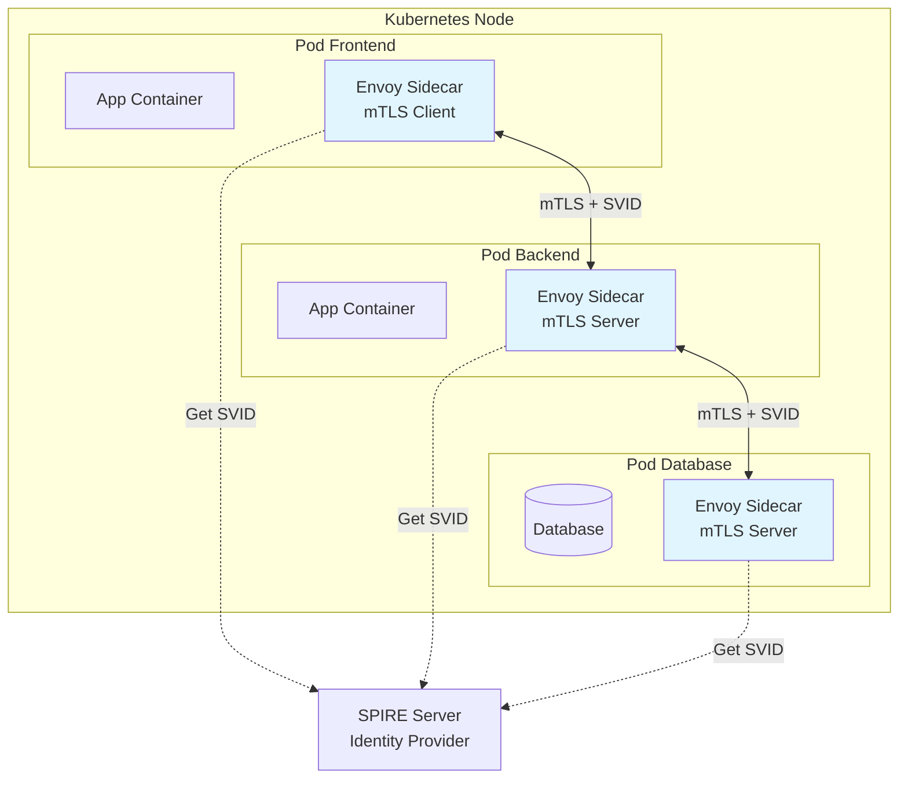

# Zero Trust Architecture - mTLS Everywhere, Identity-Based Security

## 1. Mục tiêu của Task

Hiểu sâu bản chất Zero Trust Architecture (ZTA): tại sao "never trust, always verify" là bước chuyển đổi tư duy từ perimeter-based security, cơ chế mTLS hoạt động ở tầng thấp như thế nào, và identity-based security giải quyết bài toán gì trong hệ thống phân tán hiện đại.

---

## 2. Bản chất và Cơ chế Hoạt động

### 2.1. Bước ngoặt từ Perimeter sang Zero Trust

**Perimeter Model (Legacy)**
```
┌─────────────────────────────────────────┐
│           PERIMETER (FIREWALL)          │
│  ┌─────────────────────────────────┐    │
│  │       TRUSTED INTERNAL ZONE     │    │
│  │  Service A ◄──► Service B       │    │
│  │      ▲              ▲           │    │
│  │      │   TRUSTED    │           │    │
│  │      └──────────────┘           │    │
│  └─────────────────────────────────┘    │
│              ▲                          │
│         [VPN/Bastion]                   │
└─────────────────────────────────────────┘
```

**Vấn đề của Perimeter:**
- **Insider threat blindspot**: Kẻ tấn công đã vào trong perimeter được tin tưởng hoàn toàn
- **Lateral movement**: Compromise một service → di chuyển ngang sang service khác dễ dàng
- **Cloud-native mismatch**: Microservices chạy trên Kubernetes không có "biên giới" rõ ràng
- **BYOD/Remote work**: Perimeter ngày càng mờ nhạt

**Zero Trust Model**
```
┌──────────┐      ┌──────────┐      ┌──────────┐
│ Service A│◄────►│ Identity │◄────►│ Service B│
│   [mTLS] │      │  Plane   │      │  [mTLS]  │
└────┬─────┘      └────┬─────┘      └────┬─────┘
     │                 │                  │
     ▼                 ▼                  ▼
  VERIFY            VERIFY             VERIFY
Every Request    Every Identity      Every Connection
```

### 2.2. Cơ chế mTLS ở Tầng Giao thức

**TLS Handshake thông thường (One-way TLS)**
```
Client                          Server
   │                               │
   ├──── ClientHello ─────────────►│
   │    [Supported cipher suites]  │
   │                               │
   │◄──── ServerHello ─────────────┤
   │    [Selected cipher + cert]   │
   │                               │
   │◄──── Server Certificate ──────┤
   │    [Server's public key]      │
   │                               │
   ├──── Key Exchange ────────────►│
   │    [Encrypted pre-master]     │
   │                               │
   ├────► Encrypted Communication ◄┤
   │    (Client trusts Server)     │
```

**mTLS (Mutual TLS) - Thêm Client Certificate**
```
Client (Service A)              Server (Service B)
        │                              │
        ├──── ClientHello ────────────►│
        │                              │
        │◄──── ServerHello ────────────┤
        │◄──── Server Certificate ─────┤
        │     (Service B's identity)   │
        │                              │
        │◄──── CertificateRequest ─────┤  ← B yêu cầu A chứng minh danh tính
        │                              │
        ├──── Client Certificate ─────►│  ← A gửi certificate của mình
        │     (Service A's identity)   │
        ├──── CertificateVerify ──────►│  ← A ký challenge để chứng minh sở hữu private key
        │                              │
        ├────► Mutual Encrypted Channel├◄┤
        │   (Both sides verified)      │
```

**Bản chất cryptographic:**
1. **Server gửi Certificate**: Chứa public key + identity (SPIFFE ID, DNS, IP) được ký bởi CA
2. **Client verify Server**: Kiểm tra chữ ký CA, expiry, revocation (CRL/OCSP), hostname match
3. **Client gửi Certificate**: Tương tự, chứng minh danh tính của mình
4. **Server verify Client**: Kiểm tra certificate hợp lệ, có trong trust store
5. **Key Exchange**: Cả hai bên thiết lập session key để mã hóa symmetric

### 2.3. Identity Plane - Trái tim của Zero Trust

**SPIFFE/SPIRE - Identity Framework cho Microservices**

```
┌─────────────────────────────────────────────────────────────┐
│                     SPIRE SERVER                            │
│  ┌──────────────┐  ┌──────────────┐  ┌──────────────┐      │
│  │   CA Plugin  │  │  Node Attest │  │  Data Store  │      │
│  │  (Sign SVIDs)│  │ (Verify node)│  │ (Reg entries)│      │
│  └──────┬───────┘  └──────────────┘  └──────────────┘      │
│         │                                                   │
│         │ Issues SVID (SPIFFE Verifiable Identity Document) │
│         ▼                                                   │
│  spiffe://trust-domain/workload/frontend-service            │
└─────────────────────────┬───────────────────────────────────┘
                          │
           ┌──────────────┼──────────────┐
           │              │              │
     ┌─────▼─────┐  ┌────▼────┐  ┌──────▼──────┐
     │SPIRE Agent│  │SPIRE A. │  │  SPIRE A.   │
     │ (Node 1)  │  │(Node 2) │  │  (Node 3)   │
     └─────┬─────┘  └────┬────┘  └──────┬──────┘
           │             │              │
    ┌──────▼──────┐ ┌───▼────────┐ ┌───▼──────────┐
    │Pod Frontend │ │Pod Backend │ │ Pod Payment  │
    │SVID: cert   │ │ SVID: cert │ │ SVID: cert   │
    │+ private key│ │+ prv key   │ │ + prv key    │
    └─────────────┘ └────────────┘ └──────────────┘
```

**SVID (SPIFFE Verifiable Identity Document):**
- **SPIFFE ID**: URI dạng `spiffe://trust-domain/ns/production/sa/frontend-service`
- **X.509-SVID**: Certificate chứa SPIFFE ID trong Subject Alternative Name (SAN)
- **JWT-SVID**: Token dùng cho cross-domain scenarios

**Attestation - Cách SPIRE biết Pod nào là ai:**
| Attestor Type | Mechanism | Use Case |
|--------------|-----------|----------|
| K8s SAT | Service Account Token | Kubernetes pods |
| K8s PSAT | Projected Service Account Token | Enhanced K8s security |
| AWS IID | EC2 Instance Identity Document | EC2 workloads |
| GCP IIT | GCP Instance Identity Token | GCE workloads |
| Azure MSI | Managed Service Identity | Azure VMs |
| Unix | Unix socket ownership | Bare metal/VM |

### 2.4. Authorization Policy - Beyond Authentication

**Authentication (mTLS) chỉ trả lờ: "Bạn là ai?"**
**Authorization Policy trả lờ: "Bạn được phép làm gì?"**

```yaml
# Istio AuthorizationPolicy
apiVersion: security.istio.io/v1beta1
kind: AuthorizationPolicy
metadata:
  name: payment-service-policy
  namespace: production
spec:
  selector:
    matchLabels:
      app: payment-service
  action: ALLOW
  rules:
    # Frontend service được phép gọi /api/v1/payments
    - from:
        - source:
            principals: ["cluster.local/ns/production/sa/frontend-service"]
      to:
        - operation:
            methods: ["POST"]
            paths: ["/api/v1/payments"]
    
    # Order service được phép gọi /api/v1/refunds
    - from:
        - source:
            principals: ["cluster.local/ns/production/sa/order-service"]
      to:
        - operation:
            methods: ["POST"]
            paths: ["/api/v1/refunds"]
      when:
        # Chỉ cho phép khi claim có admin role
        - key: request.auth.claims[role]
          values: ["admin"]
```

---

## 3. Kiến trúc và Luồng xử lý

### 3.1. Service Mesh với mTLS tự động



**Luồng chi tiết:**
1. **Bootstrap**: SPIRE agent trên node attests với SPIRE server, nhận CA bundle
2. **Workload Registration**: Admin đăng ký workload với SPIFFE ID vào SPIRE
3. **SVID Issuance**: SPIRE agent mints SVID cho pod dựa trên attestation
4. **Sidecar Injection**: Istio/Linkerd injects Envoy proxy với SVID mounted
5. **Outbound Request**: 
   - App → Envoy (plaintext localhost)
   - Envoy dùng Client SVID để mTLS với target
6. **Inbound Request**:
   - Envoy nhận mTLS, verify Server SVID
   - Check AuthorizationPolicy
   - Forward plaintext to App (localhost)

### 3.2. Certificate Rotation - Không downtime

```
Time ──────────────────────────────────────────────────────►

Service A (Client)              Service B (Server)
     │                                │
     │  Cert_A_1 (T+0 to T+24h)       │  Cert_B_1 (T+0 to T+24h)
     │         │                      │         │
     │         ▼                      │         ▼
     ├──── mTLS handshake ───────────►│
     │◄──────── OK ───────────────────┤
     │         │                      │
     │    [Traffic flows]             │    [Traffic flows]
     │         │                      │
     │  Cert_A_2 issued (T+18h)       │  Cert_B_2 issued (T+18h)
     │         │                      │
     │  ┌──────┴──────┐               │  ┌──────┴──────┐
     │  │Old Cert     │               │  │Old Cert     │
     │  │Still valid  │               │  │Still valid  │
     │  └──────┬──────┘               │  └──────┬──────┘
     │         │                      │         │
     ├──── mTLS ─────────────────────►│ (Accept cả 2 certs)
     │         │                      │
     │  Cert_A_1 expires (T+24h)      │  Cert_B_1 expires (T+24h)
     │         │                      │
     │  [Only A_2 active]             │  [Only B_2 active]
     │         │                      │
```

> **Critical**: Rotation phải xảy ra trước khi cert hết hạn (thường 50-70% TTL). Cả client và server phải accept cả old và new cert trong overlap period.

---

## 4. So sánh các Lựa chọn

### 4.1. mTLS Implementation Options

| Approach | Complexity | Overhead | Flexibility | Best For |
|----------|-----------|----------|-------------|----------|
| **Service Mesh** (Istio/Linkerd) | Medium | Sidecar CPU/Mem | High (L7 policies) | K8s-native microservices |
| **eBPF** (Cilium) | Low-Medium | Kernel-level | Medium (L3/L4) | High-performance scenarios |
| **Library** (Java SSLContext) | High | None (application) | Low | Legacy systems, specific needs |
| **Sidecar (Manual)** | High | Sidecar overhead | Medium | Non-K8s environments |
| **mTLS at LB** | Low | LB bottleneck | Low | Simple architectures |

### 4.2. Certificate Management Solutions

| Solution | PKI Model | Integration | Rotation | Multi-cluster |
|----------|-----------|-------------|----------|---------------|
| **SPIFFE/SPIRE** | Dynamic workload identity | K8s, cloud-native | Automatic, short-lived | Native support |
| **Cert-manager** | ACME, Vault, self-signed | K8s CRDs | Automatic | Requires federation |
| **HashiCorp Vault** | Enterprise PKI | Broad | Via agent | Replication |
| **AWS PCA** | Managed CA | AWS-native | Manual/limited | Regional |
| **Step CA** | Open source, simple | Good | Automatic | Basic |

### 4.3. Authorization Models

| Model | Decision Point | Latency | Complexity | Audit |
|-------|---------------|---------|------------|-------|
| **L3/L4 (IP + port)** | Kernel/eBPF | Microseconds | Low | Limited |
| **mTLS + SPIFFE ID** | Sidecar | Milliseconds | Medium | Good |
| **RBAC (Kubernetes)** | API Server | Tens of ms | Medium | Good |
| **ABAC/OPA** | Sidecar + Policy Engine | Milliseconds | High | Excellent |
| **External AuthZ** (gRPC/HTTP) | Remote service | Tens of ms | High | Excellent |

---

## 5. Rủi ro, Anti-patterns, Lỗi thường gặp

### 5.1. Certificate Management Failures

| Failure Mode | Cause | Impact | Mitigation |
|-------------|-------|--------|------------|
| **Cert expiry downtime** | Rotation failure, clock skew | Complete service outage | Monitoring: cert_expiry_timestamp; Alert: 7 days before; Hot reload support |
| **CA compromise** | Root key leaked | Entire trust domain broken | Hierarchical CA, intermediate CA rotation, revocation lists |
| **SVID exhaustion** | Too many workloads, rate limiting | New pods can't start | CA capacity planning, batch issuance, caching |
| **Wrong trust domain** | Cross-cluster communication fails | mTLS handshake failure | Trust domain federation, CA bundle distribution |

### 5.2. Anti-patterns nguy hiểm

```java
// ❌ ANTI-PATTERN: Trust all certificates (DEV ONLY!)
TrustManager[] trustAllCerts = new TrustManager[]{
    new X509TrustManager() {
        public void checkClientTrusted(X509Certificate[] chain, String authType) {}
        public void checkServerTrusted(X509Certificate[] chain, String authType) {}
        public X509Certificate[] getAcceptedIssuers() { return new X509Certificate[0]; }
    }
};
SSLContext sc = SSLContext.getInstance("TLS");
sc.init(null, trustAllCerts, new SecureRandom());  // NEVER IN PRODUCTION
```

```java
// ❌ ANTI-PATTERN: Disable hostname verification
HttpsURLConnection conn = (HttpsURLConnection) url.openConnection();
conn.setHostnameVerifier((hostname, session) -> true);  // DANGEROUS!
```

```yaml
# ❌ ANTI-PATTERN: Overly permissive Istio policy
apiVersion: security.istio.io/v1beta1
kind: AuthorizationPolicy
metadata:
  name: allow-all
spec:
  action: ALLOW
  # No rules = allow everything from everyone!
```

### 5.3. Production Gotchas

1. **Clock Skew**: mTLS certs có validity window. NTP drift > vài phút → handshake failures
2. **Certificate Chain Depth**: Một số implementation chỉ support 1-2 intermediate CA
3. **SNI (Server Name Indication)**: Bắt buộc khi multiple services share IP
4. **Session Resumption**: Không configure → mTLS handshake overhead mỗi request
5. **Cipher Suite Mismatch**: Client và server không có common cipher → handshake fails

### 5.4. Observability Blindspots

```
Problem: "Service A không kết nối được Service B"
Without proper observability:
- Logs chỉ thấy "connection refused"
- Không biết là cert expiry, policy deny, hay network issue
- Mất giờ để debug

Solution: Distributed tracing với TLS info
- Trace span ghi TLS version, cipher, SVID
- Jaeger tags: tls.valid=true, tls.svid=spiffe://..., tls.policy=allow
```

---

## 6. Khuyến nghị thực chiến trong Production

### 6.1. Gradual Rollout Strategy

```
Phase 1: PERMISSIVE mode (Istio)
  - mTLS enabled nhưng ALLOW plaintext
  - Monitor xem traffic nào chưa mTLS
  - Fix legacy clients
  
Phase 2: STRICT mode per namespace
  - Namespace by namespace
  - Start với stateless services
  - Rollback plan ready
  
Phase 3: STRICT mode cluster-wide
  - Global mTLS enforcement
  - Exception list cho external services
  - Continuous monitoring
```

### 6.2. Certificate Lifecycle Management

```yaml
# Recommended cert TTLs
shortLived:
  workload: 24h        # SVIDs rotate frequently
  rotationBuffer: 6h   # Start rotation at 75% TTL
  
intermediateCA:
  validity: 90d        # Rotate intermediate CA quarterly
  
rootCA:
  validity: 1y         # Rotate annually, ceremony process
  offlineStorage: true # Root key in HSM/air-gapped
```

### 6.3. Monitoring Checklist

| Metric | Alert Threshold | Why |
|--------|----------------|-----|
| `istio_mtls_connections_total` | Drop > 50% | mTLS adoption regression |
| `cert_expiry_timestamp` | < 7 days | Prevent expiry |
| `spire_agent_svid_update_latency` | > 30s | Rotation issues |
| `tls_handshake_errors_total` | Spike | Cipher/policy issues |
| `authz_denied_count` | Spike | Policy misconfiguration |

### 6.4. Performance Tuning

**TLS Session Resumption (quan trọng cho high-throughput):**
```yaml
# Envoy/Istio
envoy.yaml:
  common_tls_context:
    tls_session_ticket_keys:
      - filename: /etc/tls/ticket_key  # Rotate this key!
```

**Connection Pooling:**
```java
// HttpClient with connection pooling
HttpClient client = HttpClient.newBuilder()
    .connectTimeout(Duration.ofSeconds(10))
    .version(Version.HTTP_2)
    .build();
// Keep connections alive để reuse TLS sessions
```

### 6.5. Debugging Commands

```bash
# Check certificate details
openssl s_client -connect service:443 -showcerts

# Verify mTLS handshake (with client cert)
openssl s_client -connect service:443 \
  -cert client.crt -key client.key \
  -CAfile ca.crt

# Check SPIRE SVIDs
kubectl exec -it spire-agent-xx -- \
  /opt/spire/bin/spire-agent api fetch -socketPath /run/spire/sockets/agent.sock

# Istio mTLS status
istioctl authn tls-check service.namespace.svc.cluster.local

# Envoy TLS config dump
kubectl exec -it pod-name -c istio-proxy -- \
  curl localhost:15000/config_dump | jq '.configs[] | select(.["@type"] | contains("Listener"))'
```

---

## 7. Kết luận

**Bản chất của Zero Trust**: Không phải là "trust nothing" mà là "verify explicitly". Mỗi request phải chứng minh identity và authorization, bất kể network location.

**Trade-off chính:**
| Aspect | With Zero Trust | Without |
|--------|-----------------|---------|
| Security | High (authenticated + authorized) | Medium (perimeter only) |
| Complexity | High (PKI, identity, policies) | Low |
| Latency | +1-5ms (mTLS handshake) | Baseline |
| Operational cost | High (cert management, debugging) | Low |
| Blast radius | Contained | Potentially large |

**Khi nào nên dùng:**
- ✅ Multi-tenant systems
- ✅ Financial/Healthcare (compliance)
- ✅ Cloud-native microservices
- ✅ High-security environments

**Khi nào KHÔNG nên:**
- ❌ Simple monolith với ít users
- ❌ High-frequency trading (latency sensitive)
- ❌ Legacy systems không support mTLS

**Rủi ro lớn nhất**: Certificate management failure. Một CA compromise hoặc mass expiry có thể takedown toàn bộ hệ thống. Cần robust monitoring và runbook.

---

## 8. Tài liệu tham khảo

- NIST SP 800-207: Zero Trust Architecture
- SPIFFE/SPIRE Documentation: spiffe.io
- Istio Security Best Practices
- TLS 1.3 RFC 8446
- mTLS in gRPC: grpc.io/docs/guides/auth/
