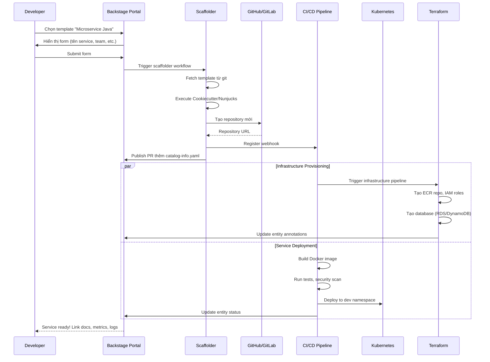
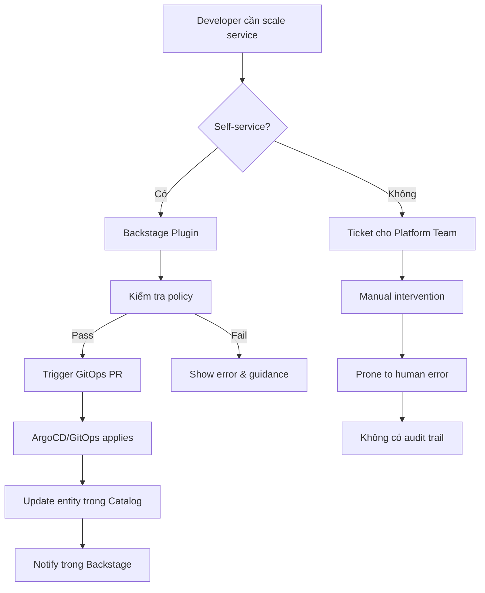

# Internal Developer Platform (IDP) - Backstage, Platform APIs, Self-Service

## 1. Mục tiêu của Task

Hiểu sâu bản chất của Internal Developer Platform (IDP) - tại sao các tổ chức cần nó, cơ chế vận hành ra sao, và làm sao để triển khai hiệu quả trong production với Backstage làm nền tảng cốt lõi.

---

## 2. Bản chất và cơ chế hoạt động

### 2.1 Bản chất vấn đề: Developer Cognitive Load

**Vấn đề gốc rễ:** Khi hệ thống chuyển từ monolith sang microservices/cloud-native, cognitive load của developer tăng theo cấp số nhân. Developer không chỉ viết code mà còn phải hiểu:
- Kubernetes manifests, Helm charts
- Terraform/CloudFormation cho infrastructure
- CI/CD pipeline configuration
- Monitoring, logging, alerting setup
- Service mesh, network policies
- Secrets management, certificate rotation

> **Cognitive Load Theory:** Cognitive load không phải là "lướt qua tài liệu" mà là thông tin cần được giữ trong working memory để thực hiện task. Khi quá tải, developer commit bug nhiều hơn, onboarding kéo dài, và innovation bị chết.

**IDP là gì?** Không phải một tool, mà là **abstraction layer** giữa developer và infrastructure complexity. Nó biến "tôi cần tạo một microservice" từ 20 bước phức tạp thành 1 form đơn giản.

### 2.2 Cơ chế hoạt động: The Platform as a Product

```
┌─────────────────────────────────────────────────────────────────┐
│                    DEVELOPER EXPERIENCE LAYER                    │
│  ┌─────────────┐  ┌─────────────┐  ┌─────────────────────────┐  │
│  │   Portal    │  │   CLI       │  │   GitOps Integration    │  │
│  │  (Backstage)│  │  (Custom)   │  │  (PR-based workflows)   │  │
│  └──────┬──────┘  └──────┬──────┘  └───────────┬─────────────┘  │
└─────────┼────────────────┼─────────────────────┼────────────────┘
          │                │                     │
          └────────────────┼─────────────────────┘
                           │
┌──────────────────────────▼──────────────────────────────────────┐
│              PLATFORM API / ORCHESTRATION LAYER                  │
│  ┌─────────────┐  ┌─────────────┐  ┌─────────────────────────┐  │
│  │  Service    │  │  Infra      │  │     Policy Engine       │  │
│  │  Catalog    │  │  Provisioning│  │  (OPA/Kyverno/Custom)   │  │
│  │  (Backstage)│  │  (Terraform)│  │                         │  │
│  └─────────────┘  └─────────────┘  └─────────────────────────┘  │
└──────────────────────────┬──────────────────────────────────────┘
                           │
          ┌────────────────┼────────────────┐
          │                │                │
┌─────────▼──────┐ ┌───────▼────────┐ ┌─────▼──────────┐
│   Kubernetes   │ │   Cloud        │ │   Security     │
│   (EKS/GKE)    │ │   Resources    │ │   & Compliance │
└────────────────┘ └────────────────┘ └────────────────┘
```

**Cơ chế cốt lõi:**

1. **Golden Path (Paved Road):** Không phải "bắt buộc" mà là "lựa chọn mặc định tốt nhất". Developer có thể đi off-road nhưng phải tự chịu trách nhiệm.

2. **Self-Service Abstraction:** Platform team expose capabilities qua APIs, không phải tickets. Developer tự phục vụ trong guardrails.

3. **Unified Interface:** Một nơi duy nhất cho tất cả thông tin về service: documentation, metrics, logs, ownership, dependencies, API specs.

### 2.3 Backstage Architecture Deep Dive

**Backstage không chỉ là "developer portal" - nó là framework để xây dựng IDP.**

```
┌─────────────────────────────────────────────────────────────┐
│                     BACKSTAGE FRAMEWORK                      │
├─────────────────────────────────────────────────────────────┤
│                                                              │
│  ┌─────────────────────────────────────────────────────┐    │
│  │              PLUGIN ARCHITECTURE                     │    │
│  │  ┌─────────────┐  ┌─────────────┐  ┌─────────────┐  │    │
│  │  │   Software  │  │   TechDocs  │  │   Kubernetes│  │    │
│  │  │   Catalog   │  │             │  │   Plugin    │  │    │
│  │  └─────────────┘  └─────────────┘  └─────────────┘  │    │
│  │  ┌─────────────┐  ┌─────────────┐  ┌─────────────┐  │    │
│  │  │   Scaffolder│  │   Search    │  │   Custom    │  │    │
│  │  │   (Templates)│  │             │  │   Plugins   │  │    │
│  │  └─────────────┘  └─────────────┘  └─────────────┘  │    │
│  └─────────────────────────────────────────────────────┘    │
│                                                              │
│  ┌─────────────────────────────────────────────────────┐    │
│  │              CORE SERVICES                           │    │
│  │  ┌─────────────┐  ┌─────────────┐  ┌─────────────┐  │    │
│  │  │   Config    │  │   Database  │  │   UrlReader │  │    │
│  │  │   (app-config)│  │   (PostgreSQL)│  │   (Git)     │  │    │
│  │  └─────────────┘  └─────────────┘  └─────────────┘  │    │
│  │  ┌─────────────┐  ┌─────────────┐  ┌─────────────┐  │    │
│  │  │   Permissions│  │   Scheduler │  │   Auth      │  │    │
│  │  │   (RBAC)    │  │   (Jobs)    │  │   (OIDC)    │  │    │
│  │  └─────────────┘  └─────────────┘  └─────────────┘  │    │
│  └─────────────────────────────────────────────────────┘    │
│                                                              │
│  ┌─────────────────────────────────────────────────────┐    │
│  │              BACKEND FOR FRONTEND (BFF)              │    │
│  │  ┌─────────────┐  ┌─────────────┐  ┌─────────────┐  │    │
│  │  │   REST API  │  │   Integrations│  │   Proxies   │  │    │
│  │  │   (Plugin   │  │   (GitHub,    │  │   (To       │  │    │
│  │  │   endpoints)│  │   Jira, etc)  │  │   external) │  │    │
│  │  └─────────────┘  └─────────────┘  └─────────────┘  │    │
│  └─────────────────────────────────────────────────────┘    │
└─────────────────────────────────────────────────────────────┘
```

**Software Catalog - Trái tim của Backstage:**

```yaml
# entity.yaml - Định nghĩa một component trong Backstage
apiVersion: backstage.io/v1alpha1
kind: Component
metadata:
  name: payment-service
  description: Xử lý thanh toán
  annotations:
    # Liên kết với external systems
    github.com/project-slug: org/payment-service
    argocd/app-name: payment-service
    grafana/dashboard-tag: payment
    pagerduty.com/service-id: PXXXXX
spec:
  type: service
  lifecycle: production
  owner: team-payments  # Liên kết với Group entity
  system: payment-platform
  dependsOn:
    - resource:payment-database
    - component:notification-service
  providesApis:
    - payment-api
```

**Tại sao YAML-based?**
- Git-native: Version control, audit trail, code review
- Declarative: Developer khai báo desired state
- Discoverable: Backstage scan repositories tự động ingest

---

## 3. Kiến trúc luồng xử lý

### 3.1 Template Scaffolding Flow (Golden Path)



### 3.2 Day-2 Operations Flow



---

## 4. So sánh các lựa chọn

### 4.1 Build vs Buy vs Adopt

| Criteria | Backstage (Adopt) | Port (Buy) | Custom Build |
|----------|-------------------|------------|--------------|
| **Time to Value** | 3-6 tháng | 2-4 tuần | 12-18 tháng |
| **Customizability** | Cao (plugin system) | Trung bình | Cao nhất |
| **Maintenance Burden** | Platform team | Vendor | Platform team |
| **Community Ecosystem** | 100+ plugins | Vendor-built | None |
| **Learning Curve** | Steep (React/Node) | Low | Depends |
| **Cost Model** | OSS (engineering cost) | Per-seat SaaS | Engineering cost |
| **Exit Strategy** | Easy (open source) | Data export | N/A |

**Khuyến nghị:**
- **Startup/Small team (<50 engineers):** Port hoặc Cortex - tập trung vào product-market fit, không phải platform
- **Mid-size (50-200):** Backstage với curated plugin set - balance giữa customization và velocity
- **Enterprise (200+):** Backstage hoặc hybrid - cần deeply integrate với legacy systems

### 4.2 Backstage vs Alternatives

| Feature | Backstage | Cortex | Port | OpsLevel |
|---------|-----------|--------|------|----------|
| **Software Catalog** | ✅ Native | ✅ | ✅ | ✅ |
| **Scaffolding** | ✅ Built-in | ⚠️ Basic | ✅ | ❌ |
| **TechDocs** | ✅ Built-in | ❌ | ⚠️ Basic | ❌ |
| **API Docs** | ✅ OpenAPI | ❌ | ⚠️ | ❌ |
| **Kubernetes Integration** | ✅ Plugin | ⚠️ | ✅ | ⚠️ |
| **Cost Visibility** | ⚠️ Custom | ✅ | ✅ | ✅ |
| **Scorecards** | ⚠️ Plugin | ✅ Native | ✅ | ✅ |

### 4.3 Self-Service Maturity Model

| Level | Mô tả | Ví dụ | Trade-off |
|-------|-------|-------|-----------|
| **L0: Ticket-based** | Request qua Jira/ServiceNow | "Tạo giúp tôi database" | Slow, nhưng controlled |
| **L1: GitOps-based** | PR-driven, manual review | Developer tạo PR, platform review | Audit trail, nhưng vẫn có latency |
| **L2: Guardrailed self-service** | Automated với policy gates | Backstage template với OPA validation | Fast + compliant |
| **L3: Full autonomy** | Direct API access | Developer gọi trực tiếp cloud APIs | Fastest, nhưng cần strong culture |

> **Quan trọng:** Không phải mọi thứ đều nên L3. Data deletion, production access - giữ ở L1/L2.

---

## 5. Rủi ro, Anti-patterns, và Lỗi thường gặp

### 5.1 Anti-pattern: "Platform Team là Help Desk"

**Triệu chứng:** Platform team luôn bận rộn với ad-hoc requests, không có thời gian xây dựng platform.

**Root cause:** Thiếu investment vào self-service capabilities. Platform team bị đối xử như ops team.

**Giải pháp:**
- Platform team phải có product manager
- Đo lường "ticket deflection rate"
- Mục tiêu: 80% requests tự phục vụ

### 5.2 Anti-pattern: "Golden Path = Golden Cage"

**Triệu chứng:** Developer không thể làm gì ngoài template. Innovation bị stifle.

**Root cause:** Platform team over-engineer constraints, biến golden path thành mandatory path.

**Giải pháp:**
- Rõ ràng về "paved road vs off-road"
- Off-road phải có escape hatch (với proper guardrails)
- Regular feedback loop với engineering teams

### 5.3 Rủi ro: Entity Drift

**Vấn đề:** Catalog data không khớp với reality. Service đã xóa nhưng vẫn hiển thị.

**Nguyên nhân:**
- Manual entity registration
- Không có automated cleanup
- Git repo deleted nhưng catalog chưa update

**Giải pháp:**
```yaml
# Entity provider với automated discovery
integrations:
  github:
    - host: github.com
      apps:
        - $include: github-app-credentials.yaml
      catalogPath: /catalog-info.yaml
      filters:
        branch: 'main'
        repository: 'service-*'
      validateLocationsExist: true  # Kiểm tra repo tồn tại
```

**Stale entity detection:**
```javascript
// Scheduled task để detect và mark orphaned entities
const orphanedEntities = await catalogApi.queryEntities({
  filter: {
    'metadata.annotations.github.com/project-slug': CATALOG_FILTER_EXISTS,
  },
}).then(entities => 
  entities.items.filter(async e => {
    const repoExists = await githubApi.repoExists(
      e.metadata.annotations['github.com/project-slug']
    );
    return !repoExists;
  })
);
```

### 5.4 Rủi ro: Permission Sprawl

**Vấn đề:** Backstage mặc định không có granular permissions. Mọi người thấy mọi thứ.

**Giải pháp - Permission Framework:**
```yaml
# permission-policy.ts
export class CustomPermissionPolicy implements PermissionPolicy {
  async handle(
    request: PolicyQuery,
    user?: BackstageUserIdentity,
  ): Promise<PolicyDecision> {
    // Chỉ owner hoặc platform team mới delete entity
    if (isPermission(request.permission, catalogEntityDeletePermission)) {
      const entity = await catalogApi.getEntityByRef(request.resourceRef);
      if (entity?.spec?.owner === user?.ownershipEntityRefs[0] ||
          user?.ownershipEntityRefs.includes('group:platform-team')) {
        return { result: AuthorizeResult.ALLOW };
      }
      return { result: AuthorizeResult.DENY };
    }
    return { result: AuthorizeResult.ALLOW };
  }
}
```

### 5.5 Edge Case: Multi-Region, Multi-Cloud

**Thách thức:** Entity model mặc định không hỗ trợ multi-region deployment.

**Giải pháp - Custom Resource Types:**
```yaml
# Định nghĩa Resource cho deployment region
apiVersion: backstage.io/v1alpha1
kind: Resource
metadata:
  name: payment-service-us-east-1
  annotations:
    aws.amazon.com/region: us-east-1
    aws.amazon.com/account-id: '123456789'
spec:
  type: deployment
  owner: team-payments
  system: payment-platform
  dependsOn:
    - component:payment-service  # Liên kết với logical service
```

---

## 6. Khuyến nghị thực chiến trong Production

### 6.1 Adoption Strategy: "Crawl, Walk, Run"

**Phase 1 - Crawl (Tháng 1-2): Foundation**
- Deploy Backstage với Software Catalog chỉ read-only
- Import existing repositories (auto-discovery)
- Add basic ownership info
- **Success metric:** 100% services có entity

**Phase 2 - Walk (Tháng 3-4): Documentation**
- Enable TechDocs với MkDocs
- Migrate existing wiki/docs vào Git-near code
- Add API specs (OpenAPI/AsyncAPI)
- **Success metric:** 80% services có documentation

**Phase 3 - Run (Tháng 5-6): Self-Service**
- Implement Scaffolder templates (1-2 templates)
- Add Kubernetes plugin
- Implement first golden path
- **Success metric:** 50% new services từ template

**Phase 4 - Fly (Tháng 7+): Advanced**
- Custom plugins cho internal tools
- Cost visibility integration
- Advanced scorecards (DORA metrics)
- **Success metric:** <10% platform requests là tickets

### 6.2 Platform API Design Principles

```
┌─────────────────────────────────────────────────────────────┐
│              PLATFORM API BEST PRACTICES                     │
├─────────────────────────────────────────────────────────────┤
│                                                              │
│  1. GITOPS-FIRST                                             │
│     - Mọi thay đổi phải qua Git                              │
│     - Backstage chỉ tạo PR, không apply trực tiếp            │
│     - Audit trail tự động                                    │
│                                                              │
│  2. POLICY AS CODE                                           │
│     - OPA/Rego cho complex validation                        │
│     - Simple rules trong Backstage config                    │
│     - Fail fast, clear error messages                        │
│                                                              │
│  3. ASYNC OPERATIONS                                         │
│     - Provisioning có thể mất phút đến giờ                   │
│     - Task API với progress tracking                         │
│     - Notification khi hoàn thành                            │
│                                                              │
│  4. IDEMPOTENCY                                              │
│     - Same input = same output                               │
│     - Handle retries gracefully                              │
│     - State reconciliation                                   │
│                                                              │
└─────────────────────────────────────────────────────────────┘
```

### 6.3 Monitoring Platform Health

**Metrics cần track:**

| Metric | Target | Alert Threshold |
|--------|--------|-----------------|
| Template adoption rate | >70% | <50% |
| Average time to provision | <5 min | >15 min |
| Self-service success rate | >90% | <80% |
| Catalog freshness | <1% stale | >5% |
| Platform NPS | >50 | <30 |

**Technical monitoring:**
```yaml
# Backstage health checks
livenessProbe:
  httpGet:
    path: /healthcheck
    port: 7007
  initialDelaySeconds: 30
  periodSeconds: 10

readinessProbe:
  httpGet:
    path: /healthcheck?check=pg&check=catalog
    port: 7007
  initialDelaySeconds: 10
  periodSeconds: 5
```

### 6.4 Team Structure

**Platform Team không phải là:**
- ❌ Ops team xử lý incidents
- ❌ Help desk cho developer requests
- ❌ Team viết infrastructure code cho từng service

**Platform Team là:**
- ✅ Product team với internal customers (developers)
- ✅ Xây dựng self-service capabilities
- ✅ Define standards và guardrails
- ✅ Enable teams, không làm thay

**Staffing ratio:** 1 platform engineer : 10-15 product engineers

### 6.5 Security Considerations

**1. Authentication:**
```yaml
# OIDC integration với corporate SSO
auth:
  environment: production
  providers:
    oidc:
      production:
        metadataUrl: ${AUTH_OIDC_METADATA_URL}
        clientId: ${AUTH_OIDC_CLIENT_ID}
        clientSecret: ${AUTH_OIDC_CLIENT_SECRET}
        tokenSignedResponseAlg: RS256
        scope: 'openid profile email groups'
```

**2. Network Isolation:**
- Backstage backend truy cập internal APIs
- Frontend chỉ gọi backend, không gọi external trực tiếp
- Proxy configuration cho external services

**3. Secret Management:**
```yaml
# KHÔNG hardcode secrets trong config
integrations:
  github:
    - host: github.com
      apps:
        - appId: ${GITHUB_APP_ID}
          webhookSecret: ${GITHUB_WEBHOOK_SECRET}
          privateKey: | 
            ${GITHUB_PRIVATE_KEY}  # From Vault/AWS Secrets Manager
```

---

## 7. Kết luận

**Bản chất của IDP:**
Internal Developer Platform không phải là một tool, mà là **sự chuyển đổi từ ticket-based operations sang product-based self-service**. Nó giảm cognitive load, tăng developer velocity, và đảm bảo compliance thông qua guardrails, không phải gates.

**Trade-off quan trọng nhất:**
Customization vs Maintenance. Backstage cho phép deep customization nhưng đòi hỏi significant engineering investment. Các SaaS alternatives nhanh hơn nhưng có ceiling về flexibility.

**Rủi ro lớn nhất:**
"Platform team bottleneck" - nếu platform team không có product mindset, họ sẽ trở thành help desk mới. Platform phải được đối xử như một product với PM, roadmap, và user research.

**Khi nào KHÔNG nên dùng IDP:**
- Team <20 engineers (overhead không đáng)
- Chưa có standardization (không có gì để abstract)
- Chưa sẵn sàng cho cultural shift (vẫn muốn control mọi thứ)

**Tóm lại:** IDP là force multiplier cho engineering organization ở scale. Nhưng giống như microservices, không phải là "best practice" mà là "trade-off" - cần đúng context và commitment để thành công.

---

## 8. Tài liệu tham khảo

- [Backstage Documentation](https://backstage.io/docs)
- [Platform Engineering - Team Topologies](https://teamtopologies.com/key-concepts-content/platform-engineering)
- [CNCF Platforms White Paper](https://tag-app-delivery.cncf.io/whitepapers/platforms/)
- [Humanitec Platform Engineering Guide](https://humanitec.com/platform-engineering)
