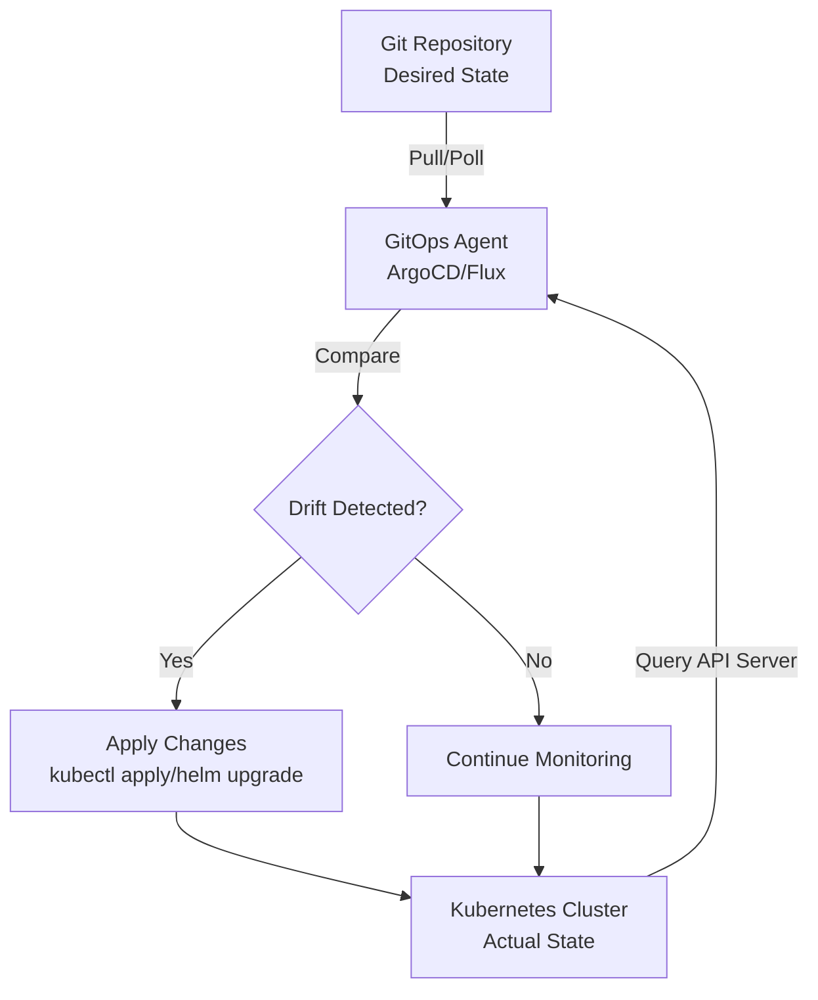
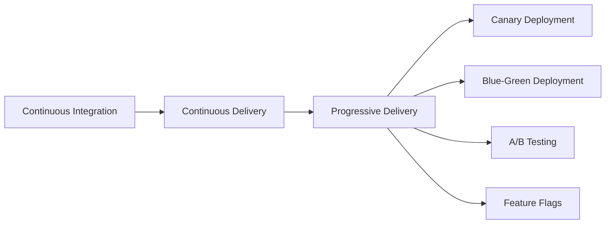
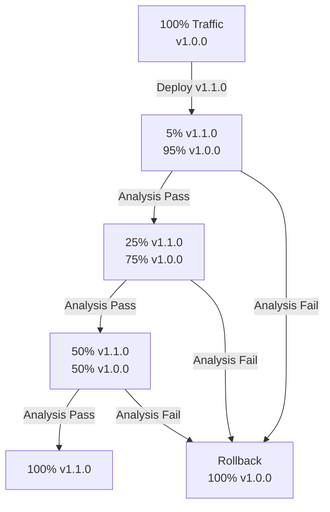
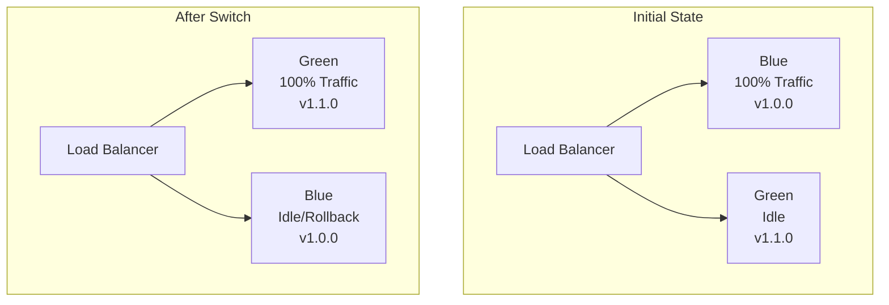

# GitOps & Progressive Delivery

**Mục tiêu nghiên cứu:** Hiểu sâu bản chất GitOps, các công cụ triển khai (ArgoCD, Flux), và chiến lược Progressive Delivery (canary, blue-green) trong môi trường production.

---

## 1. Mục tiêu của Task

GitOps và Progressive Delivery không chỉ là công cụ CI/CD hiện đại — chúng là **paradigm shift** trong cách quản lý infrastructure và triển khai application. Task này đào sâu:

- **GitOps**: Cơ chế declarative infrastructure, reconciliation loop, single source of truth
- **Progressive Delivery**: Chiến lược giảm thiểu blast radius của deployment failures
- **Công cụ**: ArgoCD (pull-based) vs Flux (GitOps Toolkit), so sánh chi tiết cơ chế internal
- **Thực chiến**: Canary analysis, automated rollback, observability integration

---

## 2. Bản chất và Cơ chế hoạt động

### 2.1 GitOps: Declarative Infrastructure + Reconciliation Loop

GitOps được xây dựng trên 4 nguyên tắc:

| Nguyên tắc | Ý nghĩa | Hệ quả Production |
|------------|---------|-------------------|
| **Declarative** | Desired state được mô tả trong Git, không phải imperative scripts | Khôi phục hệ thống chỉ bằng `git revert`, audit trail hoàn chỉnh |
| **Versioned & Immutable** | Mọi thay đổi là commit, có thể trace được ai, khi nào, tại sao | Compliance, rollback nhanh, bisect khi có incident |
| **Pulled Automatically** | Agent trong cluster liên tục pull & reconcile | Không cần external access vào cluster, giảm attack surface |
| **Continuously Reconciled** | Drift detection tự động, state được enforce | Hệ thống tự healing, tránh configuration drift |

#### Cơ chế Reconciliation Loop



**Bản chất quan trọng:** GitOps agent chạy **trong cluster**, pull từ Git repo (có thể qua SSH key hoặc PAT), so sánh desired state với actual state thông qua Kubernetes API server. Nếu có drift → tự động apply.

> **Trade-off quan trọng:** GitOps loại bỏ imperative commands (`kubectl apply` từ laptop engineer), nhưng đổi lại phải chấp nhận **eventual consistency** — thay đổi Git → apply vào cluster có độ trễ (thường 3-5 phút với mặc định).

### 2.2 Pull-based vs Push-based CI/CD

| Đặc điểm | Push-based (Jenkins, GitLab CI) | Pull-based (ArgoCD, Flux) |
|----------|--------------------------------|---------------------------|
| **Trigger** | Git webhook → external CI → push to cluster | Agent poll Git → apply to cluster |
| **Security** | CI cần kubeconfig/k8s access | Cluster cần Git read access only |
| **Blast radius** | CI compromise → full cluster access | Agent compromise → limited to its RBAC |
| **Auditability** | Build logs + Git history | Git history là single source of truth |
| **Drift detection** | Không tự động | Tự động, liên tục |
| **Offline capability** | Không deploy được nếu CI down | Cluster tự quản lý, không phụ thuộc CI |

**Kết luận:** Pull-based GitOps phù hợp cho **production environments** cần high security, auditability, và self-healing. Push-based phù hợp cho **fast iteration** trong development.

---

## 3. Kiến trúc ArgoCD vs Flux

### 3.1 ArgoCD Architecture

```
┌─────────────────────────────────────────────────────────────┐
│                      ArgoCD Namespace                        │
│  ┌──────────────┐  ┌──────────────┐  ┌──────────────────┐  │
│  │ API Server   │  │ Repository   │  │ Application      │  │
│  │ (gRPC/REST)  │  │ Server       │  │ Controller       │  │
│  └──────┬───────┘  └──────┬───────┘  └────────┬─────────┘  │
│         │                 │                    │            │
│  ┌──────▼───────┐  ┌──────▼───────┐  ┌────────▼─────────┐  │
│  │ Redis        │  │ Git Repo     │  │ Kubernetes API   │  │
│  │ (cache)      │  │ (manifests)  │  │ Server           │  │
│  └──────────────┘  └──────────────┘  └──────────────────┘  │
└─────────────────────────────────────────────────────────────┘
```

**Các thành phần cốt lõi:**

1. **Application Controller**: Reconciliation loop chính, so sánh Git vs cluster state
2. **API Server**: Giao tiếp với CLI/UI, xử lý auth (RBAC, SSO, OIDC)
3. **Repository Server**: Clone Git repos, generate manifests (Helm, Kustomize, Jsonnet)
4. **Redis**: Cache manifests, tránh clone lại Git repo mỗi reconciliation

**ArgoCD Application CRD:**

```yaml
apiVersion: argoproj.io/v1alpha1
kind: Application
metadata:
  name: my-app
spec:
  project: default
  source:
    repoURL: https://github.com/org/repo.git
    targetRevision: HEAD
    path: overlays/production
  destination:
    server: https://kubernetes.default.svc
    namespace: production
  syncPolicy:
    automated:
      prune: true        # Xóa resources không còn trong Git
      selfHeal: true     # Tự động sửa drift
    syncOptions:
      - CreateNamespace=true
```

### 3.2 Flux Architecture (GitOps Toolkit)

```
┌─────────────────────────────────────────────────────────────┐
│                      Flux System                             │
│  ┌──────────────┐  ┌──────────────┐  ┌──────────────────┐  │
│  │ Source       │  │ Kustomize    │  │ Helm             │  │
│  │ Controller   │  │ Controller   │  │ Controller       │  │
│  └──────┬───────┘  └──────┬───────┘  └────────┬─────────┘  │
│         │                 │                    │            │
│  ┌──────▼───────┐  ┌──────▼───────┐  ┌────────▼─────────┐  │
│  │ Git/OCI/Helm │  │ Kustomize    │  │ HelmRelease      │  │
│  │ Repository   │  │ Build        │  │ Resources        │  │
│  └──────────────┘  └──────────────┘  └──────────────────┘  │
│                                                              │
│  ┌──────────────┐  ┌──────────────┐  ┌──────────────────┐  │
│  │ Notification │  │ Image        │  │ Image            │  │
│  │ Controller   │  │ Reflector    │  │ Automation       │  │  │
│  └──────────────┘  └──────────────┘  └──────────────────┘  │
└─────────────────────────────────────────────────────────────┘
```

**Kiến trúc modular của Flux:**

Flux sử dụng **GitOps Toolkit** — tách thành các controller độc lập, có thể cài riêng:

| Controller | Chức năng | ArgoCD tương đương |
|------------|-----------|-------------------|
| `source-controller` | Pull từ Git/OCI/Helm repos | Repository Server |
| `kustomize-controller` | Build & apply Kustomize | Application Controller (partial) |
| `helm-controller` | Manage Helm releases | Application Controller (Helm) |
| `notification-controller` | Webhook, Slack, Prometheus alerts | ArgoCD Notifications |
| `image-reflector` | Scan container registries | ArgoCD Image Updater |
| `image-automation` | Update Git với image mới | ArgoCD Image Updater |

**So sánh chi tiết:**

| Tiêu chí | ArgoCD | Flux |
|----------|--------|------|
| **UI/CLI** | Rich Web UI, argocd CLI | Flux CLI only (no built-in UI) |
| **Multi-cluster** | Native support, cluster management | Có thể làm, phức tạp hơn |
| **RBAC** | Granular (project-level permissions) | Kubernetes RBAC |
| **Helm** | First-class support | Helm-controller riêng biệt |
| **Kustomize** | Native | Native (kustomize-controller) |
| **Image updates** | ArgoCD Image Updater (optional) | Built-in image-reflector |
| **Secret management** | Sealed Secrets, SOPS, Vault | SOPS, Mozilla SOPS native |
| **App of Apps** | Native (Application CRD reference) | OCI repositories, depends |
| **Learning curve** | Cao hơn (nhiều concepts) | Modular, pick what you need |
| **Resource usage** | Nặng hơn (Redis, multiple pods) | Nhẹ hơn, scalable |

**Khi nào chọn cái nào:**

- **ArgoCD**: Cần rich UI, multi-cluster management, nhiều teams với complex RBAC
- **Flux**: Cần lightweight, modular, deeply integrated với Kubernetes ecosystem, không cần UI

---

## 4. Progressive Delivery: Canary vs Blue-Green

### 4.1 Bản chất Progressive Delivery

Progressive Delivery là **superset của Continuous Delivery**, thêm các controls:

- **Traffic shaping**: Chuyển traffic từ từ (canary) hoặc instant switch (blue-green)
- **Automated analysis**: Metrics-driven promotion/rollback
- **Rollback**: Tự động hoặc manual, nhanh chóng



### 4.2 Canary Deployment

**Cơ chế:**



**Triển khai với Argo Rollouts:**

```yaml
apiVersion: argoproj.io/v1alpha1
kind: Rollout
metadata:
  name: my-app
spec:
  replicas: 10
  strategy:
    canary:
      steps:
        - setWeight: 5      # 5% traffic to canary
        - pause: {duration: 10m}  # Wait 10 min
        - analysis:         # Run automated analysis
            templates:
              - templateName: success-rate
        - setWeight: 25
        - pause: {duration: 10m}
        - setWeight: 50
        - pause: {duration: 10m}
      analysis:
        templates:
          - templateName: success-rate
        args:
          - name: service-name
            value: my-app
```

**Analysis Template (Prometheus queries):**

```yaml
apiVersion: argoproj.io/v1alpha1
kind: AnalysisTemplate
metadata:
  name: success-rate
spec:
  metrics:
    - name: success-rate
      interval: 1m
      successCondition: result[0] >= 0.95  # 95% success rate required
      provider:
        prometheus:
          address: http://prometheus:9090
          query: |
            sum(rate(http_requests_total{service="{{args.service-name}}",status!~"5.."}[5m]))
            /
            sum(rate(http_requests_total{service="{{args.service-name}}"}[5m]))
```

**Các metrics thường dùng cho canary analysis:**

| Metric | Threshold | Ý nghĩa |
|--------|-----------|---------|
| HTTP Error Rate | < 1% | Canary không gây lỗi nhiều hơn stable |
| Latency P99 | < 500ms | Performance không degrade |
| CPU/Memory | < 120% baseline | Resource consumption hợp lý |
| Custom business | varies | Checkout success rate, v.v. |

**Trade-offs Canary:**

| Ưu điểm | Nhược điểm |
|---------|------------|
| Phát hiện vấn đề sớm với 5% traffic | Phức tạp hơn blue-green |
| Rollback nhanh (instant) | Cần observability tốt |
| Real user testing | Thời gian deployment lâu hơn |
| Data plane complexity thấp | Application phải handle mixed versions |

### 4.3 Blue-Green Deployment

**Cơ chế:**



**Triển khai:**

```yaml
apiVersion: argoproj.io/v1alpha1
kind: Rollout
spec:
  strategy:
    blueGreen:
      activeService: my-app-active    # Service nhận 100% traffic
      previewService: my-app-preview  # Service test trước switch
      autoPromotionEnabled: false     # Manual approval required
      autoPromotionSeconds: 300       # Hoặc tự động sau 5 phút
      maxSurge: 100%                  # Tạo full green environment
      maxUnavailable: 0               # Không downtime
```

**So sánh Blue-Green vs Canary:**

| | Blue-Green | Canary |
|------------|------------|--------|
| **Resource** | 2x (blue + green) | ~1.05-1.5x (gradual) |
| **Rollback** | Instant (switch DNS) | Gradual (drain canary) |
| **Testing** | Preview environment | Production with small % |
| **Complexity** | Đơn giản hơn | Phức tạp hơn |
| **Risk** | All-or-nothing | Incremental |
| **Use case** | Critical apps, cần instant rollback | Large scale, gradual rollout |

### 4.4 Service Mesh Integration (Istio/Linkerd)

Progressive Delivery hiệu quả hơn với service mesh:

```yaml
apiVersion: networking.istio.io/v1beta1
kind: VirtualService
metadata:
  name: my-app
spec:
  http:
    - match:
        - headers:
            x-canary:
              exact: "true"
      route:
        - destination:
            host: my-app-canary
          weight: 100
    - route:
        - destination:
            host: my-app-stable
          weight: 95
        - destination:
            host: my-app-canary
          weight: 5
```

**Lợi ích service mesh:**
- Header-based routing (internal testing trước khi mở public)
- Circuit breaking, retries, timeouts
- Mutual TLS, authorization
- Rich observability (distributed tracing)

---

## 5. Rủi ro, Anti-patterns, Lỗi thường gặp

### 5.1 Rủi ro Production

| Rủi ro | Mô tả | Mitigation |
|--------|-------|------------|
| **Git repo compromise** | Attacker push malicious manifests | Branch protection, signed commits, CODEOWNERS |
| **Secret in Git** | Hardcoded credentials | Sealed Secrets, SOPS, Vault integration |
| **RBAC misconfiguration** | ArgoCD có quyền cluster-admin | Least privilege, project-scoped permissions |
| **Drift without detection** | Manual changes không bị reconcile ngay | Shorter sync intervals, notifications |
| **Canary without metrics** | Blind rollout, không biết khi nào fail | Mandatory analysis templates |
| **Database schema changes** | Canary với breaking schema changes | Schema migrations separate, backward compatible |
| **Resource exhaustion** | Blue-green cần 2x resources | Resource quotas, auto-scaling |

### 5.2 Anti-patterns

**❌ Anti-pattern 1: GitOps without Git discipline**
```bash
# KHÔNG làm thế này
git add .
git commit -m "fix"
git push
```
→ Commit messages phải meaningful, tuân thủ conventional commits

**❌ Anti-pattern 2: One giant monorepo cho tất cả**
→ Tách theo domain/microservice, dùng ApplicationSets (ArgoCD) để quản lý

**❌ Anti-pattern 3: Ignore failed syncs**
→ Failed sync phải trigger alert, không được ignore

**❌ Anti-pattern 4: Canary với breaking API changes**
→ Breaking changes cần blue-green hoặc dual-run period

**❌ Anti-pattern 5: No rollback plan**
→ Luôn test rollback procedure, đo RTO (Recovery Time Objective)

### 5.3 Edge Cases

**Database migrations trong GitOps:**
- Schema migrations phải **backward compatible**
- Deploy app mới → Run migration → Verify → Clean up old schema
- Không bao giờ breaking change schema + app cùng lúc

**StatefulSets canary:**
- StatefulSets khó canary hơn Deployments (pod identity, PVC)
- Argo Rollouts hỗ trợ StatefulSets với partition strategy

**Multi-region deployments:**
- Cân nhắc latency Git repo → remote clusters
- Dùng regional mirrors hoặc OCI registries cho artifacts

---

## 6. Khuyến nghị thực chiến trong Production

### 6.1 GitOps Best Practices

**Repository Structure:**
```
gitops-repo/
├── apps/
│   ├── production/
│   │   ├── kustomization.yaml
│   │   └── patches/
│   └── staging/
├── infrastructure/
│   ├── ingress-nginx/
│   ├── cert-manager/
│   └── monitoring/
└── policies/
    ├── kyverno/
    └── opa-gatekeeper/
```

**ArgoCD Production Setup:**

```yaml
# values.yaml cho ArgoCD HA
redis-ha:
  enabled: true  # Redis HA cho production

controller:
  replicas: 1    # Chỉ 1 controller (stateful), nhưng có HA mode

server:
  replicas: 2    # API server HA

repoServer:
  replicas: 2    # Parallel manifest generation

configs:
  cm:
    url: https://argocd.company.com
    timeout.reconciliation: 180s  # 3 phút sync interval
    resource.customizations: |
      argoproj.io/Rollout:
        health.lua: |
          -- Custom health check cho Argo Rollouts
```

**Secrets Management:**

```bash
# Sealed Secrets workflow
kubectl create secret generic db-creds \
  --from-literal=password=supersecret \
  --dry-run=client -o yaml | \
  kubeseal --controller-namespace=sealed-secrets \
           --controller-name=sealed-secrets \
           --format yaml > sealed-db-creds.yaml
```

### 6.2 Progressive Delivery Checklist

**Pre-deployment:**
- [ ] SLOs/SLIs được define (error rate, latency)
- [ ] Alert rules configured cho canary metrics
- [ ] Runbook cho manual rollback
- [ ] Database migrations tested (backward compatible)

**Deployment:**
- [ ] Canary steps: 5% → 25% → 50% → 100%
- [ ] Pause duration: tối thiểu 2x latency metric window
- [ ] Automated analysis với nhiều metrics (không chỉ 1)
- [ ] Manual gate cho production-critical changes

**Post-deployment:**
- [ ] Monitor 1 hour sau 100% rollout
- [ ] Archive rollout history
- [ ] Update runbook nếu có incident

### 6.3 Observability Integration

**Prometheus recording rules cho canary:**

```yaml
groups:
  - name: canary_analysis
    rules:
      - record: canary:error_rate_5m
        expr: |
          sum(rate(http_requests_total{service="my-app",version="canary",status=~"5.."}[5m]))
          /
          sum(rate(http_requests_total{service="my-app",version="canary"}[5m]))
      
      - record: canary:latency_p99_5m
        expr: |
          histogram_quantile(0.99,
            sum(rate(http_request_duration_seconds_bucket{service="my-app",version="canary"}[5m])) by (le)
          )
```

**Grafana dashboard cho GitOps:**
- Sync status (success/failed)
- Reconciliation duration
- Drift detection count
- Application health by project

---

## 7. Kết luận

**Bản chất cốt lõi của GitOps:**

GitOps không phải là công cụ, mà là **triết lý quản lý infrastructure** — sử dụng Git làm single source of truth, reconciliation loop để tự động enforce desired state. Điều này mang lại auditability, reproducibility, và self-healing cho distributed systems.

**Bản chất Progressive Delivery:**

Không phải deployment nhanh, mà là **deployment an toàn** — giảm blast radius bằng cách expose changes dần dần, verify với real traffic, và rollback tự động khi metrics cho thấy degradation.

**Trade-off quan trọng nhất:**

| Lựa chọn | Khi nào dùng |
|----------|--------------|
| **ArgoCD** | Cần UI, multi-cluster, complex RBAC |
| **Flux** | Lightweight, modular, deeply integrated |
| **Canary** | Large scale, chấp nhận complexity, cần observability |
| **Blue-Green** | Critical apps, cần instant rollback, resource available |

**Rủi ro lớn nhất:**

Không phải tool failure, mà là **operational discipline** — GitOps thất bại khi teams vẫn làm manual changes, ignore failed syncs, hoặc deploy breaking changes mà không có rollback plan.

**Tư duy kiến trúc:**

> GitOps và Progressive Delivery là **foundational patterns** cho modern cloud-native operations. Chúng không thay thế nhau mà bổ sung: GitOps quản lý **state**, Progressive Delivery quản lý **risk** của changes.

---

## 8. Code tham khảo (Minimal)

**ArgoCD ApplicationSet cho multi-environment:**

```yaml
apiVersion: argoproj.io/v1alpha1
kind: ApplicationSet
metadata:
  name: microservices
spec:
  generators:
    - git:
        repoURL: https://github.com/org/gitops.git
        revision: HEAD
        directories:
          - path: apps/*
  template:
    metadata:
      name: '{{path.basename}}'
    spec:
      project: default
      source:
        repoURL: https://github.com/org/gitops.git
        targetRevision: HEAD
        path: '{{path}}'
      destination:
        server: https://kubernetes.default.svc
        namespace: '{{path.basename}}'
      syncPolicy:
        automated:
          prune: true
          selfHeal: true
```

**Flux GitRepository + Kustomization:**

```yaml
apiVersion: source.toolkit.fluxcd.io/v1
kind: GitRepository
metadata:
  name: my-app
  namespace: flux-system
spec:
  interval: 1m
  url: https://github.com/org/repo
  ref:
    branch: main
---
apiVersion: kustomize.toolkit.fluxcd.io/v1
kind: Kustomization
metadata:
  name: my-app
  namespace: flux-system
spec:
  interval: 10m
  path: ./overlays/production
  prune: true
  sourceRef:
    kind: GitRepository
    name: my-app
```
