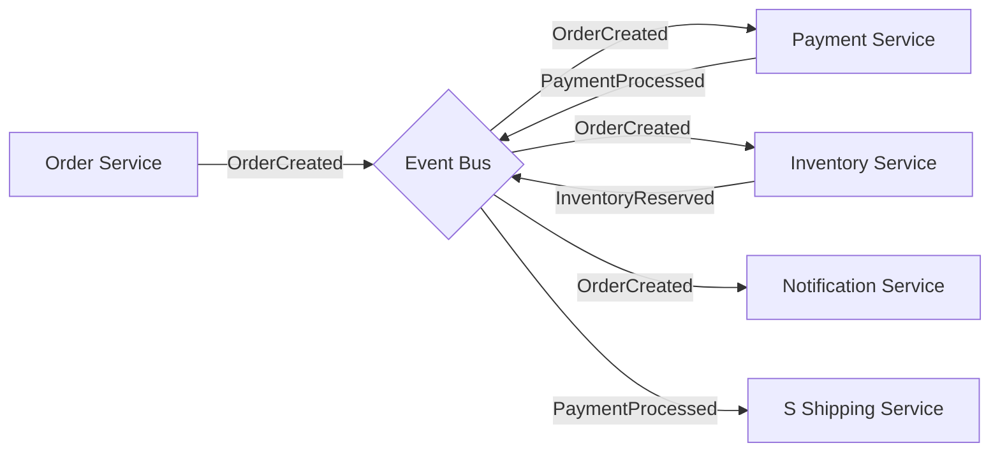
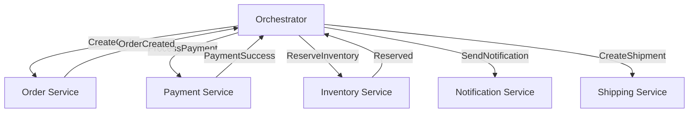

# Event Choreography vs Orchestration - Trade-offs in Distributed Workflows

## 1. Mục tiêu của task

Hiểu sâu bản chất hai phương pháp điều phối workflow phân tán:
- **Choreography**: Các service tự quyết định dựa trên events
- **Orchestration**: Một trung tâm điều phối (orchestrator) chỉ đạo luồng

Mục tiêu là biết **khi nào dùng gì**, **rủi ro của từng approach**, và **cách triển khai production-grade**.

---

## 2. Bản chất và cơ chế hoạt động

### 2.1 Choreography - Distributed Decision Making

**Bản chất**: Không có "bố". Mỗi service là autonomous entity, tự subscribe events, tự quyết định hành động.



**Cơ chế tầng thấp**:
1. Mỗi service maintain **event handler registry** - map từ event type → business logic
2. Event bus phải đảm bảo **at-least-once delivery** (idempotency là trách nhiệm consumer)
3. Service phải handle **out-of-order events** và **duplicate events**

### 2.2 Orchestration - Centralized Control

**Bản chất**: Có "bố" - Orchestrator service biết toàn bộ workflow, gọi command tới từng service.



**Cơ chế tầng thấp**:
1. Orchestrator maintain **state machine** - current state + valid transitions
2. Mỗi step là **command invocation** (synchronous hoặc async via queue)
3. Orchestrator phải track **pending operations** và **timeouts**

---

## 3. Kiến trúc và luồng xử lý

### 3.1 State Management Comparison

| Aspect | Choreography | Orchestration |
|--------|--------------|---------------|
| **State location** | Distributed (mỗi service giữ state riêng) | Centralized (orchestrator giữ global state) |
| **Visibility** | Khó - phải aggregate từ nhiều nơi | Dễ - orchestrator biết status toàn bộ workflow |
| **Debugging** | Khó - trace qua nhiều service logs | Dễ - central log của orchestrator |
| **Recovery** | Phức tạp - cần replay events | Dễ - orchestrator có thể resume từ checkpoint |

### 3.2 Communication Patterns

**Choreography - Event Chain**:
```
OrderCreated → InventoryReserved → PaymentProcessed → ShipmentCreated
```

> **Lưu ý quan trọng**: Event chain có thể trở thành "distributed big ball of mud" nếu không có schema governance. Mỗi service thêm logic mới có thể vô tình break downstream services.

**Orchestration - Command Flow**:
```
Orchestrator decides:
  IF payment.success THEN
    CALL inventory.reserve()
    IF reserve.success THEN
      CALL shipping.create()
```

---

## 4. So sánh chi tiết và trade-off

### 4.1 Coupling Analysis

**Choreography - Temporal Coupling**:
- Service A phát event X, service B phải đang "nghe" để xử lý
- Nếu B down, events queue up → potential data inconsistency nếu B recover sai

**Orchestration - Control Coupling**:
- Orchestrator biết cách gọi từng service (API contract)
- Service thay đổi API → orchestrator phải update

### 4.2 Scalability & Performance

| Metric | Choreography | Orchestration |
|--------|--------------|---------------|
| **Throughput** | Cao - fire-and-forget events | Thấp hơn - orchestrator là bottleneck |
| **Latency** | Thấp - không có intermediate hop | Cao hơn - phải qua orchestrator |
| **Horizontal scale** | Dễ - thêm consumer instances | Khó - orchestrator stateful, cần partitioning |

> **Trade-off cốt lõi**: Choreography scale tốt nhưng mất visibility. Orchestration có visibility nhưng tạo bottleneck và single point of complexity.

### 4.3 Business Logic Location

**Choreography**: Logic phân tán
```
Order Service: "Khi order tạo xong, phát event"
Payment Service: "Khi nghe OrderCreated, charge payment"
Inventory Service: "Khi nghe PaymentProcessed, giảm stock"
```
**Vấn đề**: Business logic nằm rải rác. Thay đổi workflow = đổi nhiều service.

**Orchestration**: Logic tập trung
```
Orchestrator: "Workflow gồm 5 steps, mỗi step gọi service này"
```
**Vấn đề**: Orchestrator thành "god service", chứa logic phức tạp.

---

## 5. Rủi ro, anti-patterns, và lỗi thường gặp

### 5.1 Choreography Anti-Patterns

**Death by Event Storm**:
- Mỗi service emit 5-10 events
- 20 service × 10 events = 200 event types
- Không ai biết workflow thực sự trông như thế nào

**The Callback Hell**:
```
Service A emits Event1
  → Service B consumes, emits Event2
    → Service C consumes, emits Event3
      → Service D consumes... emits EventN
        → Service A phải handle EventN (cyclical dependency!)
```

**Invisible Dependencies**:
- Service X add logic: "Khi nhận OrderCreated, gọi API của Service Y"
- Service Y không biết X phụ thuộc vào nó
- Refactor Y → break X (và cả X2, X3 mà dev không biết tồn tại)

### 5.2 Orchestration Anti-Patterns

**The Orchestrator Bottleneck**:
- Một orchestrator xử lý 1000+ workflows/second
- Database của orchestrator thành hotspot
- Cần shard by workflow ID, nhưng phức tạp

**Smart Orchestrator, Dumb Services**:
- Orchestrator chứa toàn bộ business logic
- Services chỉ là CRUD wrappers
- Vi phạm Service Autonomy principle

**Distributed Monolith in Disguise**:
- Tách thành microservices nhưng orchestrator gọi synchronous
- Network chậm → toàn bộ system chậm
- Mất lợi ích của async processing

### 5.3 Failure Modes

| Failure | Choreography | Orchestration |
|---------|--------------|---------------|
| **Service down mid-workflow** | Event lost hoặc retry storm | Orchestrator timeout, cần compensation |
| **Partial failure** | Khó biết workflow complete hay không | Orchestrator track state, biết incomplete |
| **Long-running workflow** | Events có thể bị purge | Orchestrator dùng persistent state |
| **Compensation** | Mỗi service tự implement rollback | Orchestrator trigger compensation |

> **Pitfall nguy hiểm**: Saga pattern với choreography - nếu compensation cũng fail, system vào trạng thái inconsistent. Orchestration dễ handle hơn vì orchestrator có thể retry compensation.

---

## 6. Khuyến nghị thực chiến trong production

### 6.1 Khi nào dùng Choreography?

✅ **Use cases phù hợp**:
- Simple workflows (≤3 steps)
- High-throughput requirements (>10K events/sec)
- Services thực sự independent (không cần biết nhau tồn tại)
- Event-driven từ đầu, không phải retrofit

❌ **Không dùng khi**:
- Cần biết trạng thái real-time của workflow
- Complex compensation logic
- Cross-service transactions phức tạp
- Compliance cần audit trail rõ ràng

### 6.2 Khi nào dùng Orchestration?

✅ **Use cases phù hợp**:
- Complex workflows (≥5 steps)
- Cần human intervention mid-workflow
- Long-running processes (hours/days)
- Strict ordering requirements
- Financial transactions (cần traceability)

❌ **Không dùng khi**:
- Đơn giản hóa thành point-to-point communication
- Team chưa có kinh nghiệm stateful services
- Latency cực kỳ quan trọng (orchestrator thêm hop)

### 6.3 Hybrid Approach (Production Reality)

**Best practice thực tế**: Dùng cả hai!

```
┌─────────────────────────────────────────┐
│           Orchestrator (Saga)           │
│  - Manages workflow steps               │
│  - Handles compensation                 │
│  - Tracks state                         │
└──────────────┬──────────────────────────┘
               │ Commands
               ▼
┌─────────────────────────────────────────┐
│     Service A (Choreography inside)     │
│  - Receives command                     │
│  - Emits domain events                  │
│  - Other services react via events      │
└─────────────────────────────────────────┘
```

**Ví dụ cụ thể**:
- Orchestrator: "Process Order" workflow
- Inside Payment Service: Event-driven choreography giữa fraud detection, payment gateway, notification

### 6.4 Tooling Recommendations

| Layer | Choreography | Orchestration |
|-------|--------------|---------------|
| **Event Bus** | Kafka, RabbitMQ, NATS | N/A (built-in) |
| **Orchestration Engine** | - | Temporal, Camunda, Netflix Conductor |
| **Saga Implementation** | Eventuate, Axon | Temporal Saga, custom |
| **Observability** | OpenTelemetry, event tracing | Workflow state visualization |

### 6.5 Monitoring & Observability

**Choreography cần**:
- **Event schema registry** (Confluent, AWS Glue)
- **Dead Letter Queues** cho failed events
- **Event correlation IDs** để trace qua services
- **Schema evolution policies** (backward/forward compatible)

**Orchestration cần**:
- **State persistence** (DB + backup strategy)
- **Workflow visibility UI** (hiển thị trạng thái hiện tại)
- **Timeout alerts** cho long-running steps
- **Compensation monitoring** (track success rate)

---

## 7. Kết luận

### Bản chất vấn đề

Choreography và Orchestration không phải "chọn 1 trong 2". Chúng giải quyết bài toán khác nhau:

| | Choreography | Orchestration |
|---|--------------|---------------|
| **Mental model** | Reactive - react to events | Proactive - drive workflow |
| **Complexity** | Simple implementation, complex system | Complex implementation, simple system |
| **Ownership** | Domain logic ở mỗi service | Domain logic ở orchestrator |

### Quyết định chiến lược

> **Rule of thumb**: Bắt đầu với choreography cho simple use cases. Khi workflow phức tạp hơn (cần compensation, strict ordering, human tasks), migrate sang orchestration. Đừng refactor quá sớm - choreography cho phép evolve nhanh.

### Trade-off quan trọng nhất

**Visibility vs Autonomy**:
- Choreography: Service autonomous nhưng system opaque
- Orchestration: System visible nhưng service coupled vào orchestrator

### Rủi ro lớn nhất

**Choreography**: "Death by a thousand events" - system trở nên unmaintainable vì không ai hiểu workflow thực sự.

**Orchestration**: "Distributed monolith" - orchestrator trở thành single point of failure và complexity.

---

## 8. Code minh họa (khi thật sự cần)

### 8.1 Choreography với Kafka

```java
// Consumer service - reactive to events
@Component
public class PaymentEventHandler {
    
    @KafkaListener(topics = "order-events")
    public void handleOrderCreated(OrderCreatedEvent event) {
        // Idempotency check: đã xử lý event này chưa?
        if (processedEvents.contains(event.getEventId())) {
            return; // Skip duplicate
        }
        
        try {
            processPayment(event);
            eventPublisher.publish(new PaymentProcessedEvent(...));
        } catch (Exception e) {
            // Retry logic hoặc DLQ
            throw new RetriableException(e);
        }
    }
}
```

> **Lưu ý**: `processedEvents` có thể là Redis Set hoặc DB table. TTL quan trọng để tránh infinite growth.

### 8.2 Orchestration với Temporal

```java
// Workflow interface
@WorkflowInterface
public interface OrderWorkflow {
    @WorkflowMethod
    void processOrder(Order order);
}

// Implementation
public class OrderWorkflowImpl implements OrderWorkflow {
    
    private final ActivityStub activities = Workflow.newActivityStub(...);
    
    @Override
    public void processOrder(Order order) {
        try {
            // Step 1: Reserve inventory
            activities.reserveInventory(order);
            
            // Step 2: Process payment
            activities.processPayment(order);
            
            // Step 3: Create shipment
            activities.createShipment(order);
            
        } catch (ActivityFailure e) {
            // Automatic compensation
            activities.compensateInventory(order);
            activities.refundPayment(order);
            throw e;
        }
    }
}
```

> **Lưu ý**: Temporal handle retries, timeouts, state persistence tự động. Dev chỉ cần viết business logic.

---

**Ngày nghiên cứu**: 2026-03-28  
**Người nghiên cứu**: Deep Research Agent  
**Trạng thái**: Hoàn thành
