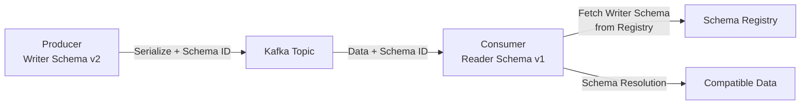
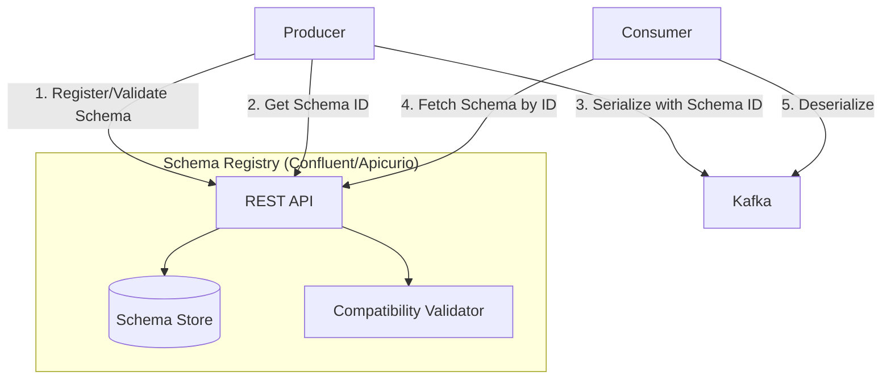
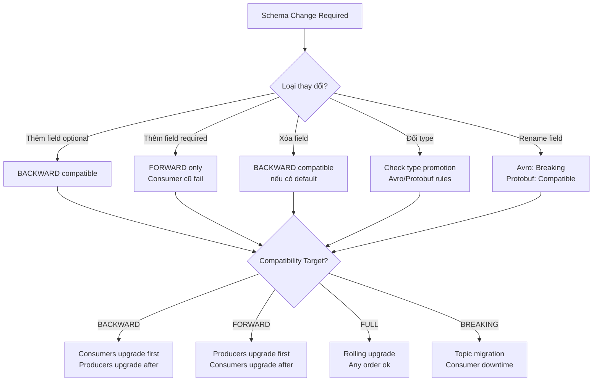

# Event Schema Evolution: Avro, Protobuf, Schema Registry Strategies

## 1. Mục tiêu của task

Hiểu sâu cơ chế quản lý và tiến hóa schema trong hệ thống event-driven, tập trung vào:
- Bản chất serialization của Avro và Protobuf
- Chiến lược Schema Registry và compatibility modes
- Trade-off giữa flexibility và strictness trong evolution
- Production concerns: versioning, migration, failure scenarios

## 2. Bản chất và cơ chế hoạt động

### 2.1 Vấn đề cốt lõi: Tại sao cần Schema Evolution?

Trong hệ thống event-driven, events tồn tại vĩnh viễn (immutability). Khi business requirements thay đổi:
- Producers cập nhật schema mới
- Consumers cũ vẫn cần đọc được events cũ
- Consumers mới cần xử lý cả events cũ và mới

**Vấn đề không có schema management:**
```
Producer v1:  { "userId": 1, "name": "John" }
Producer v2:  { "userId": 1, "firstName": "John", "lastName": "Doe" }
                            ↑ Breaking change - field name changed

Consumer cũ:  Cannot parse v2 → Deserialize failure → Processing halt
```

### 2.2 Avro: Schema-First Binary Serialization

**Cơ chế cốt lõi:**

Avro sử dụng **schema-on-write + schema-on-read** với **schema evolution built-in**:

1. **Write Path:** Data được serialize kèm schema ID (không kèm full schema)
2. **Read Path:** Reader lấy writer schema từ Schema Registry, thực hiện **schema resolution**



**Schema Resolution Rules (Avro Specification):**

| Writer Field | Reader Field | Hành vi |
|-------------|-------------|---------|
| Present | Present (same name) | Map trực tiếp, kiểm tra type compatibility |
| Present | Missing | Ignored (forward compatibility) |
| Missing | Present (default) | Sử dụng default value |
| Missing | Present (no default) | **Resolution error** |
| Present (int) | Present (long) | Type promotion (int → long) |
| Present (string) | Present (bytes) | Không tương thích |

**Bản chất của Avro evolution:**
- Sử dụng **field index** (không phải field name) để matching → **Renaming = Breaking change**
- **Union types** (`["null", "string"]`) cho optional fields → Null phải là union, không phải kiểu riêng
- **Default values bắt buộc** cho backward compatibility → Không có default = consumer cũ crash

### 2.3 Protobuf: Tag-Based Binary Serialization

**Cơ chế cốt lõi:**

Protobuf sử dụng **field numbers (tags)** thay vì names/indexes:

```protobuf
message UserEvent {
  int32 user_id = 1;      // Tag = 1, không phải "user_id"
  string name = 2;        // Tag = 2
  string email = 3;       // Tag = 3
}
```

**Binary encoding:**
```
[Field 1, Wire Type 0, Value] [Field 2, Wire Type 2, Length, Value] ...
```

**Evolution mechanism:**
- **Unknown fields:** Parser gặp tag không nhận biết → **Skip and preserve** (protobuf 3)
- **Tag reuse:** Tag cũ dùng cho field mới → **Silent data corruption**
- **Type changes:** Không thể đổi type (int32 → string) mà không breaking

**Wire Format Compatibility Matrix:**

| Original Type | Có thể đổi sang | Lưu ý |
|--------------|-----------------|-------|
| int32 | int64, uint32, uint64, bool | Numeric promotion ok |
| int64 | int32 | **Data loss risk** |
| string | bytes | Binary compatible nhưng semantic khác |
| enum | int32 | Enum = int trong wire format |
| message | group | **Incompatible** |

### 2.4 Schema Registry Architecture

**Vai trò:** Centralized schema storage + compatibility enforcement



**Compatibility Modes (Confluent Schema Registry):**

| Mode | Định nghĩa | Use Case |
|------|-----------|----------|
| **BACKWARD** | Consumer mới đọc được data cũ | Thêm field optional, xóa field |
| **FORWARD** | Consumer cũ đọc được data mới | Thêm field required, xóa field optional |
| **FULL** | BACKWARD + FORWARD | Gold standard, restrictive |
| **BACKWARD_TRANSITIVE** | BACKWARD với mọi schema trong history | Strict upgrade path |
| **FORWARD_TRANSITIVE** | FORWARD với mọi schema trong history | Rollback safety |
| **FULL_TRANSITIVE** | FULL với mọi schema | Maximum safety |
| **NONE** | No validation | Migration periods, emergency fixes |

**Transitive vs Non-transitive:**
- **Non-transitive:** Chỉ check với schema trước đó (N-1)
- **Transitive:** Check với tất cả schema trong history
- **Rủi ro non-transitive:** Schema v3 compatible với v2, v2 compatible với v1, nhưng v3 incompatible với v1

## 3. Kiến trúc và luồng xử lý

### 3.1 Schema Evolution Strategy Matrix



### 3.2 Avro vs Protobuf: Trade-off Analysis

| Aspect | Avro | Protobuf |
|--------|------|----------|
| **Schema Evolution** | Index-based, strict | Tag-based, flexible |
| **Renaming** | Breaking change | Safe (tags preserved) |
| **Binary size** | Compact (no field names) | Compact |
| **Schema flexibility** | Dynamic schema resolution | Code generation required |
| **Type system** | Rich unions, logical types | Well-defined, proto3 optional |
| **JSON interop** | Native support | Proto3 JSON mapping |
| **Streaming** | Excellent (self-describing) | Requires schema knowledge |
| **Tooling (Java)** | Avro tools, Confluent | Protoc, protoc-jar |
| **Schema Registry** | Native integration | Via Confluent/Buf |

**Khi nào chọn Avro:**
- Dynamic schema resolution cần thiết
- Heavy use of unions và logical types (decimal, timestamp-millis)
- Hadoop ecosystem integration
- Cần schema introspection runtime

**Khi nào chọn Protobuf:**
- Code generation và type safety là ưu tiên
- Cross-language với gRPC
- Frequent field renaming expected
- Mobile clients (smaller generated code)

## 4. Rủi ro, Anti-patterns, Lỗi thường gặp

### 4.1 Critical Anti-patterns

**AP-1: Tag/Index Reuse (Protobuf)**
```protobuf
// v1
message Event {
  string old_field = 1;
}

// v2 - SAI LẦM CHẾT NGƯỜI
message Event {
  int32 completely_different = 1;  // Tag 1 reused!
}
```
**Hậu quả:** Consumer cũ deserialize "completely_different" thành "old_field" → Silent corruption

**AP-2: Missing Default Values (Avro)**
```json
{
  "type": "record",
  "name": "UserEvent",
  "fields": [
    {"name": "userId", "type": "long"},
    {"name": "newField", "type": "string"}  // No default!
  ]
}
```
**Hậu quả:** Consumer v1 không có "newField" → Avro cannot resolve → Deserialization exception

**AP-3: Breaking Change in FULL Mode**
- Giả sử đang ở FULL → Thêm required field → Violation → Registry reject
- Workaround (SAI LẦM): Chuyển sang NONE → Register → Chuyển lại FULL
- **Hậu quả:** History polluted, future compatibility checks bị ảnh hưởng

**AP-4: Union Type Misuse (Avro)**
```json
{
  "name": "data",
  "type": ["null", "string", "int", "long"]  // Quá rộng!
}
```
**Hậi quả:** Type safety giảm, consumer không biết expect gì

### 4.2 Failure Modes trong Production

| Scenario | Triệu chứng | Root Cause | Mitigation |
|----------|-------------|------------|------------|
| **Deserialization Storm** | Consumer lag spike, CPU 100% | Schema cache miss, Registry unavailable | Local schema cache, fallback to file |
| **Schema ID Not Found** | `IOException: Unknown schema ID` | Registry data loss, wrong environment config | Multi-DC registry, bootstrap schemas |
| **Incompatible Evolution** | `SchemaParseException` at producer | CI không validate schema change | Schema validation trong CI/CD |
| **Version Skew** | Partial processing, data loss | Rolling deploy không đồng bộ | Consumer group coordination |

### 4.3 Edge Cases và Gotchas

**Avro Specific:**
- **Field order matters trong union resolution:** `["null", "string"]` vs `["string", "null"]` khác nhau
- **Decimal logical type:** Precision/scale thay đổi = breaking change
- **Timestamp-millis vs micros:** Không tự động convert

**Protobuf Specific:**
- **proto2 vs proto3:** Optional semantics khác nhau hoàn toàn
- **Reserved fields:** Bắt buộc sau khi delete field để prevent tag reuse
- **Oneof evolution:** Không thể thay đổi oneof membership

## 5. Khuyến nghị thực chiến trong Production

### 5.1 Schema Design Principles

**1. Default Values là Mandatory cho Optional Fields**
```json
// Avro - Luôn có default
{"name": "optionalField", "type": ["null", "string"], "default": null}

// Protobuf - proto3 optional hoặc explicit default
string optional_field = 1;
// hoặc
optional string optional_field = 1;
```

**2. Versioning Strategy: Semantic Schema Versioning**
```
Schema evolution không phải software versioning!

- Major: Breaking change (new topic hoặc consumer downtime)
- Minor: Compatible change (FULL compatible)
- Patch: Documentation/metadata change only
```

**3. Topic Naming cho Breaking Changes**
```
// Không breaking: Same topic
inventory.events.v1

// Breaking change: New topic
inventory.events.v2
```

### 5.2 Schema Registry Configuration

**Recommended Setup:**

```bash
# Global default - Maximum safety
confluent.schema.registry.compatibility.level=FULL_TRANSITIVE

# Specific topic - Allow emergency fixes
confluent.schema.registry.subject.inventory.events.compatibility=BACKWARD
```

**Subject Naming Strategies:**

| Strategy | Format | Use Case |
|----------|--------|----------|
| TopicNameStrategy | `{topic}-{key/value}` | Default, đơn giản |
| RecordNameStrategy | `{record-name}` | Same type across topics |
| TopicRecordNameStrategy | `{topic}-{record-name}` | Multiple types per topic |

### 5.3 CI/CD Integration

**Schema Validation Pipeline:**
```yaml
validate-schema:
  steps:
    - checkout
    - run: mvn avro:schema # Generate from IDL
    - run: |
        # Check compatibility before deploy
        curl -X POST \
          "${REGISTRY_URL}/compatibility/subjects/${SUBJECT}/versions" \
          -H "Content-Type: application/vnd.schemaregistry.v1+json" \
          -d '{"schema": "'"$(cat new-schema.avsc | jq -Rs .)"'"}'
    - deploy: # Only if compatible
```

**Breaking Change Detection:**
```bash
#!/bin/bash
# Compare PR schema với latest trong registry
NEW_SCHEMA=$(jq -Rs . < new-schema.avsc)
REGISTRY_URL="http://schema-registry:8081"
SUBJECT="inventory-events-value"

RESULT=$(curl -s -X POST \
  "${REGISTRY_URL}/compatibility/subjects/${SUBJECT}/versions/latest" \
  -H "Content-Type: application/vnd.schemaregistry.v1+json" \
  -d "{\"schema\": ${NEW_SCHEMA}}")

if [ "$RESULT" != "{\"is_compatible\":true}" ]; then
  echo "❌ Breaking change detected!"
  exit 1
fi
```

### 5.4 Monitoring và Observability

**Critical Metrics:**

| Metric | Alert Threshold | Ý nghĩa |
|--------|-----------------|---------|
| `schema.registry.requests.rate` | Baseline + 3σ | Sudden schema churn |
| `schema.registry.schemas.created` | > 10/day | Anti-pattern: Too many versions |
| `consumer.deserialization.errors` | > 0 | Breaking change in production |
| `schema.cache.hit.rate` | < 90% | Registry performance issues |
| `schema.compatibility.check.duration` | > 500ms | Registry under load |

**Log Correlation:**
```json
{
  "trace_id": "abc123",
  "schema_id": 42,
  "subject": "inventory-events-value",
  "version": 5,
  "writer_version": 3,
  "reader_version": 5,
  "resolution_time_ms": 2
}
```

### 5.5 Disaster Recovery

**Schema Registry Backup Strategy:**
```bash
# Daily backup
curl "${REGISTRY_URL}/subjects" | jq -r '.[]' | while read subject; do
  curl "${REGISTRY_URL}/subjects/${subject}/versions" | jq -r '.[]' | while read version; do
    curl "${REGISTRY_URL}/subjects/${subject}/versions/${version}" \
      > "backup/${subject}-${version}.json"
  done
done
```

**Bootstrap from Backup (Registry Down):**
```java
// Consumer config để đọc mà không cần registry
props.put(KafkaAvroDeserializerConfig.SPECIFIC_AVRO_READER_CONFIG, "true");
props.put("schema.registry.url", "mock://"); // Local schemas only
// Hoặc sử dụng schema.provider.class với file-based schema
```

## 6. Kết luận

**Bản chất của Event Schema Evolution:**

Schema evolution không phải là feature optional mà là **requirement bắt buộc** trong event-driven systems. Bản chất của nó là **contract versioning** giữa producers và consumers, được thực thi bởi Schema Registry.

**Trade-off cốt lõi:**

| Flexibility | Strictness | Kết quả |
|-------------|------------|---------|
| Cao | Thấp (NONE mode) | Deployment dễ dàng, runtime failures cao |
| Thấp | Cao (FULL_TRANSITIVE) | Deployment phức tạp, runtime safety cao |

**Quyết định kiến trúc quan trọng nhất:**

> **Luôn sử dụng FULL_TRANSITIVE làm default, và chỉ relax khi có lý do chính đáng.**

Chi phí của vi phạm compatibility trong production (downtime, data loss, rollback phức tạp) luôn cao hơn nhiều so với chi phí tuân thủ strict compatibility trong development.

**Lời khuyên cuối cùng:**
- Schema là **API contract** - treat with same respect
- Default values là **insurance policy** - never skip
- Schema Registry là **single source of truth** - backup religiously
- Compatibility check là **unit test** - run in CI/CD
- Breaking changes = **new topic** - never mutate history
