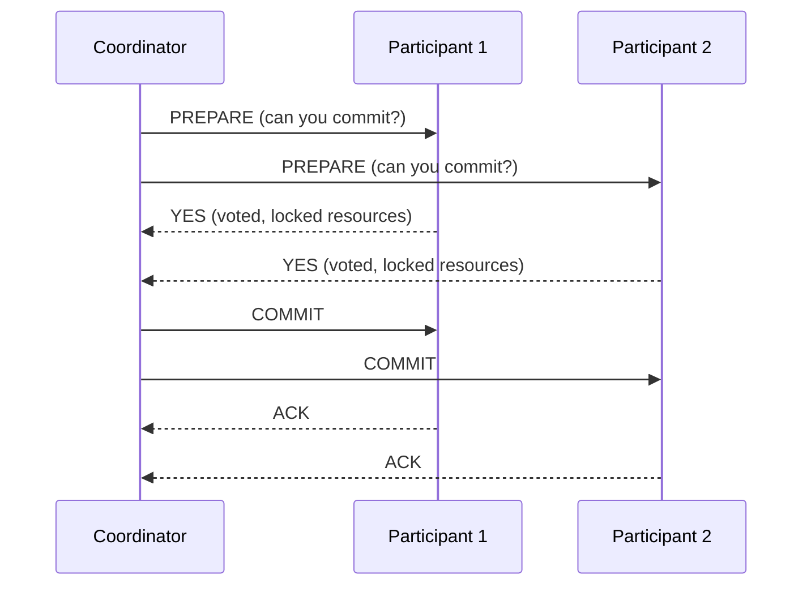
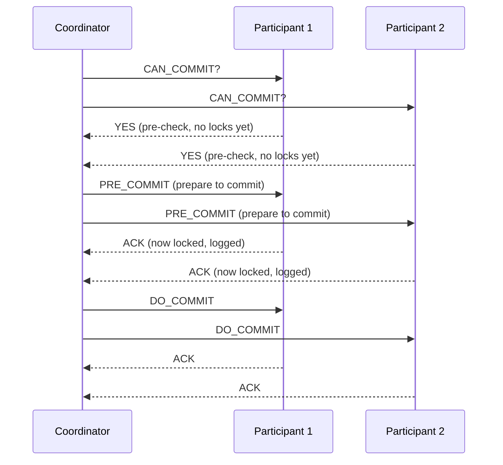
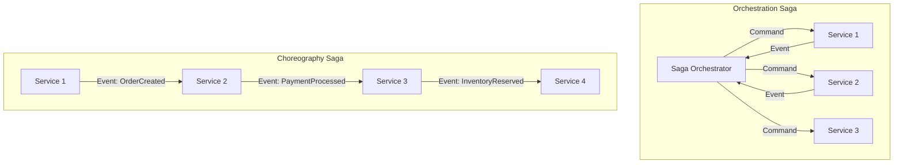

# Distributed Transactions: 2PC, 3PC, Saga & Idempotency

## 1. Mục tiêu của Task

Hiểu sâu các chiến lược đảm bảo tính nhất quán dữ liệu (consistency) trong hệ thống phân tán khi một business operation cần thay đổi trạng thái trên nhiều services/databases khác nhau. Phân tích trade-off giữa tính nhất quán mạnh (ACID) và khả năng chịu lỗi, scale (BASE).

## 2. Bản chất và Cơ chế Hoạt động

### 2.1 Vấn đề cốt lõi của Distributed Transactions

Khi một transaction cần cập nhật dữ liệu trên nhiều nodes khác nhau, chúng ta đối mặt với **Network Partition** và **Node Failures**. Không có cơ chế nào đồng thợp đảm bảo cả 3 thuộc tính:
- **Consistency**: Tất cả nodes nhìn thấy cùng một dữ liệu
- **Availability**: Mọi request đều nhận được response
- **Partition Tolerance**: Hệ thống hoạt động khi network partition xảy ra

→ Theo CAP theorem, chỉ có thể chọn 2/3. Trong thực tế, distributed systems chọn CP hoặc AP.

### 2.2 Two-Phase Commit (2PC)

**Cơ chế hoạt động:**



**Phase 1 - Voting:**
1. Coordinator gửi PREPARE đến tất cả participants
2. Mỗi participant kiểm tra local conditions:
   - Có lock được resources không?
   - Có đủ disk space không?
   - Có constraint violations không?
3. Nếu OK: participant ghi WAL (Write-Ahead Log), lock resources, vote YES
4. Nếu FAIL: vote NO

**Phase 2 - Commit/Rollback:**
- Nếu TẤT CẢ vote YES → Coordinator gửi COMMIT
- Nếu BẤT KỲ vote NO → Coordinator gửi ROLLBACK
- Participants thực thi và gửi ACK

**Bản chất blocking:**
- Sau khi vote YES, participant giữ locks cho đến khi nhận được COMMIT/ROLLBACK
- Nếu coordinator crash giữa 2 phases → participants chờ timeout (có thể vài phút)

**Failure Modes nghiêm trọng:**

| Scenario | Hệ quả | Cách xử lý |
|----------|--------|------------|
| Coordinator crash sau khi nhận YES votes | Participants chờ mãi, giữ locks | Heuristic completion (risky) |
| Network partition giữa phases | Split-brain: một nửa commit, một nửa không | Manual intervention required |
| Participant crash sau voting YES | Coordinator chờ ACK mãi, transaction pending | Timeout + recovery log scan |

### 2.3 Three-Phase Commit (3PC)

3PC thêm một phase để giảm blocking window và cho phép progress khi coordinator fails.

**Cơ chế hoạt động:**



**3 Phases:**
1. **CanCommit**: Pre-flight check, không lock resources
2. **PreCommit**: Giống Phase 1 của 2PC (lock + log)
3. **DoCommit**: Thực thi commit

**Ưu điểm:**
- Nếu coordinator crash sau PreCommit, participants có thể tự quyết định commit (all prepared)
- Blocking window ngắn hơn (chỉ từ PreCommit → DoCommit)

**Trade-off:**
- Thêm 1 network round-trip → latency cao hơn
- Vẫn không hoàn toàn non-blocking (vẫn có thể block nếu partition xảy ra đúng lúc)
- Phức tạp hơn đáng kể, ít implementations trong thực tế

### 2.4 Saga Pattern

**Bản chất:** Thay vì ACID transaction kéo dài, chia thành chuỗi các local transactions, mỗi cái publish event để trigger cái tiếp theo.

**Orchestration vs Choreography:**



| Aspect | Orchestration | Choreography |
|--------|--------------|--------------|
| **Control Flow** | Centralized (Orchestrator) | Decentralized (Event-driven) |
| **Visibility** | Dễ theo dõi, monitor | Cần distributed tracing |
| **Coupling** | Tight (phụ thuộc orchestrator) | Loose (chỉ phụ thuộc events) |
| **Complexity** | Tập trung ở orchestrator | Phân tán, khó debug |
| **Failure Recovery** | Orchestrator điều phối compensation | Service tự xử lý hoặc timeout |
| **Use Case** | Complex workflows | Simple, linear flows |

**Compensating Transactions:**

Khi một step trong saga fails, không thể rollback ACID (vì các steps trước đã commit). Thay vào đó, chạy **compensating transactions** theo thứ tự ngược lại.

```
Order Saga:
  1. Create Order (status=PENDING)  ← [Compensate: Cancel Order]
  2. Process Payment                ← [Compensate: Refund]
  3. Reserve Inventory              ← [Compensate: Release Inventory]
  4. Ship Order

Nếu step 3 fail:
  → Compensate step 2 (Refund)
  → Compensate step 1 (Cancel Order)
```

**Rủi ro của Saga:**
- **Tạm thờ không nhất quán**: Giữa các steps, system ở trạng thái inconsistent
- **Compensation failures**: Nếu compensate cũng fail → cần manual intervention hoặc retry queue
- **Ordering issues**: Events có thể arrive out-of-order (cần event versioning)

### 2.5 Idempotency trong Microservices

**Định nghĩa:** Một operation là idempotent nếu thực thi n lần vẫn cho cùng kết quả như thực thi 1 lần.

**Tại sao cần idempotency:**
- Network timeout không phân biệt "chưa gửi" hay "gửi rồi chưa nhận response"
- Retry logic sẽ gửi lại request → risk duplicate processing
- Trong distributed transactions, các components retry khi không nhận ACK

**Cơ chế implement:**

| Cách | Mô tả | Trade-off |
|------|-------|-----------|
| **Idempotency Key** | Client gửi unique key với mỗi request, server cache kết quả | Tốn memory, cần TTL |
| **Conditional Updates** | Dùng version numbers hoặc ETag | Phức tạp, cần client support |
| **Database Constraints** | Unique constraints, UPSERT | Không work cho complex workflows |
| **Deduplication Log** | Event log với unique message ID | Cần infrastructure (Kafka, etc.) |

**Idempotency Key Pattern:**

```
Client Request:
  POST /orders
  Headers: Idempotency-Key: 550e8400-e29b-41d4-a716-446655440000
  Body: {...}

Server Logic:
  1. Check Redis/cache: key exists?
     - Yes → Return cached response
     - No  → Process + save result to cache (TTL 24h)
  2. Key đang được process?
     - Yes → Return 409 Conflict hoặc wait
```

## 3. So sánh Chiến lược

| Tiêu chí | 2PC | 3PC | Saga |
|----------|-----|-----|------|
| **Consistency** | Strong (ACID) | Strong (ACID) | Eventual |
| **Availability** | Thấp (blocking) | Trung bình | Cao (non-blocking) |
| **Latency** | Thấp (2 rounds) | Cao (3 rounds) | Thấp (async) |
| **Complexity** | Trung bình | Cao | Cao |
| **Failure Recovery** | Hard | Medium | Built-in (compensate) |
| **Throughput** | Thấp (locks) | Thấp (locks) | Cao (no locks) |
| **Use Case** | Legacy monolith | Rare (theoretical) | Modern microservices |

**Khi nào dùng cái nào:**

- **2PC**: Khi cần strong consistency, low latency, và có thể chấp nhận blocking. Ví dụ: banking core systems, inventory reservation trong single DB cluster.

- **Saga**: Khi cần high availability, scale horizontally, chấp nhận eventual consistency. Ví dụ: e-commerce order processing, booking systems.

- **3PC**: Hầu như không dùng trong production vì complexity cao mà benefit không đáng kể so với 2PC.

## 4. Rủi ro, Anti-patterns, Lỗi thường gặp

### 4.1 Anti-patterns

1. **Distributed Transaction qua REST API**
   - Gọi `POST /serviceA/transaction` rồi `POST /serviceB/transaction`, rollback nếu lỗi
   - **Vấn đề**: Network partition giữa 2 calls → data inconsistent
   - **Giải pháp**: Dùng Saga pattern với event-driven hoặc 2PC nếu cùng DB cluster

2. **Long-running 2PC transactions**
   - Giữ locks trong nhiều phút
   - **Hệ quả**: Deadlock, starvation, performance degradation
   - **Giải pháp**: Break thành smaller transactions hoặc dùng Saga

3. **Missing compensating logic**
   - Implement Saga nhưng quên compensate cho một số paths
   - **Hệ quả**: Partial failure, data loss, financial discrepancies
   - **Giải pháp**: Comprehensive testing, audit log, reconciliation jobs

4. **Non-idempotent compensations**
   - Compensation logic không idempotent
   - **Hệ quả**: Double compensation → over-correction
   - **Giải pháp**: Idempotency keys cho cả compensate operations

### 4.2 Edge Cases trong Production

| Scenario | Impact | Mitigation |
|----------|--------|------------|
| Coordinator không bao giờ recover sau crash | Participants giữ locks mãi | Heuristic completion + monitoring alerts |
| Compensate fail do downstream service down | Saga stuck ở inconsistent state | Retry queue + dead letter queue + manual reconciliation |
| Clock skew giữa services | Event ordering wrong | Logical timestamps, vector clocks, hoặc total order broadcast |
| Duplicate idempotency keys | Cache pollution, wrong responses | Key namespacing, client-generated UUID v4 |
| Cascading compensations | Một fail kéo theo chuỗi compensate phức tạp | Circuit breaker, bulkhead pattern |

## 5. Khuyến nghị Thực chiến trong Production

### 5.1 Monitoring & Observability

**Metrics cần theo dõi:**
- Transaction duration (p50, p99)
- Lock wait time (cho 2PC)
- Compensation rate và compensation duration
- Idempotency cache hit rate
- In-flight transaction count

**Distributed Tracing:**
- Mỗi distributed transaction nên có một trace ID xuyên suốt
- Tag: `transaction.type` (2pc, saga, compensate)
- Log: start time, end time, participant list, failure points

### 5.2 Operational Concerns

**Cho 2PC:**
```
1. Never use 2PC across database boundaries (heterogeneous DBs)
2. Set aggressive timeouts (seconds, không phải minutes)
3. Implement heuristic completion chỉ cho critical paths
4. Have manual intervention playbooks ready
5. Monitor pending transactions: alert nếu > 100 pending > 30s
```

**Cho Saga:**
```
1. Event store bất biến (append-only), không delete
2. Compensation phải idempotent và order-independent khi có thể
3. Implement reconciliation jobs chạy định kỳ (detect inconsistency)
4. Use outbox pattern để đảm bảo event publish reliability
5. Version các events để handle schema evolution
```

### 5.3 Công cụ & Libraries

| Mục đích | Công cụ |
|----------|---------|
| **2PC Coordinator** | Atomikos, Bitronix, Narayana |
| **Saga Framework** | Axon Framework, Camunda, Temporal.io, Netflix Conductor |
| **Event Sourcing** | EventStoreDB, Axon Server |
| **Idempotency** | Redis, custom middleware |
| **Outbox Pattern** | Debezium, Kafka Connect |

### 5.4 Modern Approaches (2024-2025)

1. **Temporal.io / Durable Execution**
   - Code looks synchronous, nhưng workflow engine handle persistence và retries
   - Automatically recover từ crashes, replay workflow từ checkpoint
   - Abstract away complexity của Saga orchestration

2. **CRDTs (Conflict-free Replicated Data Types)**
   - Cho phép concurrent updates không cần coordination
   - Merge tự động, không cần conflict resolution
   - Use case: collaborative editing, shopping carts, counters

3. **Calm Theorem (Consistency As Logical Monotonicity)**
   - Subset của computations không cần coordination vẫn đảm bảo consistency
   - Foundation cho "coordination-free distributed systems"

## 6. Kết luận

**Bản chất vấn đề:** Distributed transactions là giải pháp tạm thờ cho sự mâu thuẫn giữa nhu cầu consistency và reality của network partitions. Không có silver bullet.

**Quyết định kiến trúc:**

```
Nếu có thể AVOID distributed transactions → AVOID
  ↓
Nếu phải dùng → Prefer Saga pattern cho microservices
  ↓
Nếu cần strong consistency → Consider 2PC nhưng giới hạn scope
  ↓
Nếu 2PC không đủ → Reconsider: có nên tách service không?
```

**Trade-off cốt lõi:**
- **2PC**: Đổi availability lấy consistency. Phù hợp legacy systems, không phù hợp cloud-native.
- **Saga**: Đổi strong consistency lấy availability và scale. Yêu cầu idempotent operations, compensate logic, và reconciliation.

**Lời khuyên Senior:** Đừng bắt đầu với distributed transactions. Bắt đầu với well-defined bounded contexts, minimize cross-service writes, và chỉ introduce complexity khi business thực sự yêu cầu.
