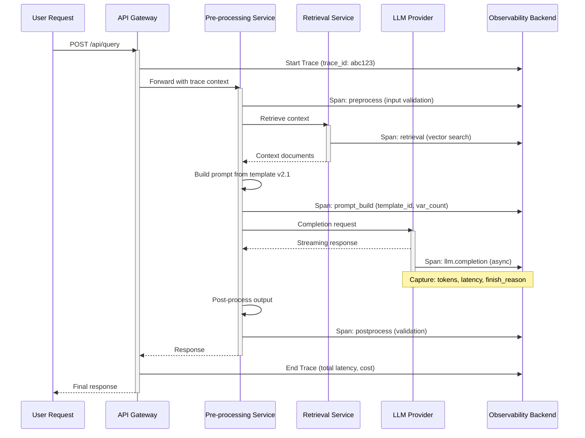
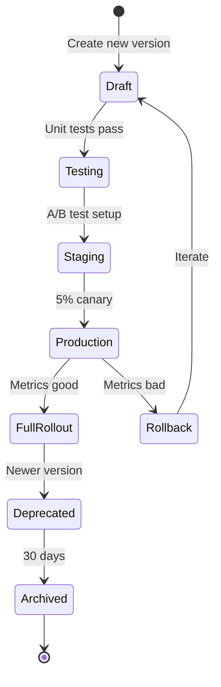

# AI Observability: LLM Tracing, Prompt Versioning & Cost Optimization

## 1. Mục tiêu của Task

Xây dựng khả năng quan sát (observability) toàn diện cho hệ thống AI tích hợp LLM, bao gồm:
- Theo dõi luồng request qua các tầng LLM pipeline
- Quản lý phiên bản prompt một cách có hệ thống
- Kiểm soát và tối ưu chi phí vận hành LLM

> **Tại sao cần AI Observability riêng biệt?** Traditional observability (metrics/logs/traces) không đủ vì LLM có đặc thù: non-deterministic output, prompt như "code", latency cao, cost per-token, context window giới hạn, và hallucination cần được phát hiện.

---

## 2. Bản chất và Cơ chế Hoạt động

### 2.1 LLM Tracing - Kiến trúc Tầng Quan Sát

#### Bản chất vấn đề

LLM call là một "black box operation" trong traditional tracing. Một request đi qua:
```
User Request → Pre-processing → LLM API → Post-processing → Response
              [Embedding]     [Completion]  [Reranking]
              [Retrieval]     [Token usage] [Validation]
```

Mỗi "hop" có đặc tính riêng cần được capture.

#### Cơ chế Tracing cho LLM

**Span Structure cho LLM Call:**

| Field | Ý nghĩa | Ví dụ |
|-------|---------|-------|
| `llm.model` | Model được gọi | gpt-4-turbo, claude-3-opus |
| `llm.prompt.tokens` | Input tokens | 1,247 |
| `llm.completion.tokens` | Output tokens | 89 |
| `llm.prompt.template` | Template ID/version | summarizer-v2.1 |
| `llm.temperature` | Generation parameter | 0.7 |
| `llm.finish_reason` | Why generation stopped | stop, length, content_filter |
| `llm.latency.first_token` | Time to first token (TTFT) | 450ms |
| `llm.retry.count` | Số lần retry | 2 |

**Phân biệt 3 loại Span quan trọng:**

1. **Embedding Span**: Input text → vector. Đặc điểm: deterministic, cacheable, thường gọi batch.
2. **Completion Span**: Prompt → generated text. Đặc điểm: non-deterministic, streaming, highest cost.
3. **Tool/Function Call Span**: LLM quyết định gọi external tool. Đặc điểm: conditional branching, cần track decision reason.

**Context Propagation qua LLM:**

Vấn đề: Traditional trace context (traceparent header) không truyền qua được LLM - LLM không hiểu HTTP headers.

Giải pháp: **Prompt Injection Pattern**
```
[SYSTEM]
You are an assistant. This request is part of distributed trace.
Trace ID: {trace_id}
Span ID: {span_id}
Parent Span: {parent_span_id}

[USER]
{actual_user_query}
```

> **Trade-off**: Thêm ~50-100 tokens mỗi call → tăng 5-10% cost nhỏ để đổi lại distributed tracing capability.

### 2.2 Prompt Versioning - Quản lý "Code" Non-deterministic

#### Bản chất: Prompt là Code

Prompt templates có đặc tính giống code:
- Có logic (if/else qua few-shot examples)
- Có dependencies (dynamic variables injection)
- Có bugs (hallucination, misinterpretation)
- Cần version control và rollback

Khác biệt quan trọng: Prompt không có compiler, chỉ có runtime behavior.

#### Cơ chế Versioning

**Semantic Versioning cho Prompt:**

```
summarizer-v2.1.3
│     │   │
│     │   └── Patch: Bug fix trong example
│     └───── Minor: Thêm instruction mới, behavior change nhỏ
└─────────── Major: Breaking change, output format khác
```

**Prompt Registry Architecture:**

```
┌─────────────────────────────────────────┐
│         Prompt Registry Service         │
├─────────────────────────────────────────┤
│  prompt_id: "summarizer"                │
│  versions:                              │
│    - v1.0.0 (deprecated)                │
│    - v1.1.0 (stable, 99.2% accuracy)    │
│    - v2.0.0-beta (canary, 5% traffic)   │
│  active_version: v1.1.0                 │
│  metadata:                              │
│    - created_by, approved_by            │
│    - test_results, eval_score           │
│    - token_count_avg                    │
└─────────────────────────────────────────┘
```

**A/B Testing Prompts:**

Cơ chế canary deployment cho prompt:
1. Version mới được deploy với `traffic_percentage: 5%`
2. Evaluation framework so sánh output quality (human/LLM-as-judge)
3. Metrics so sánh: latency, token usage, error rate, user satisfaction
4. Auto-rollback nếu metrics degrade

### 2.3 Cost Optimization - Kiểm soát Chi phí Biến động

#### Bản chất Chi phí LLM

Chi phí = `(input_tokens × input_price) + (output_tokens × output_price)`

Vấn đề: Output tokens là biến số không kiểm soát được hoàn toàn.

**Cost Attribution Chain:**

```
User: alice@company.com
  └── Feature: Document Summarization
        └── Prompt: summarizer-v2.1
              └── Model: gpt-4-turbo
                    └── Actual Cost: $0.0234
```

Mỗi layer cần tag để cost allocation chính xác.

#### Cơ chế Cost Control

**1. Token Budget & Guardrails:**

| Strategy | Cơ chế | Trade-off |
|----------|--------|-----------|
| Max Tokens | Đặt `max_tokens` cứng | Có thể cut off response giữa chừng |
| Streaming Limit | Abort khi token count vượt ngưỡng | Partial response handling phức tạp |
| Pre-flight Estimate | Estimate cost trước khi gọi | Chỉ rough estimate, không chính xác |
| Dynamic Model Selection | Input ngắn → cheaper model | Quality consistency risk |

**2. Caching Strategies:**

**Exact Match Cache:**
- Hash(prompt + parameters) → cached response
- Hit rate: 5-15% trong production thông thường
- Implementation: Redis với TTL (responses cũ có thể stale)

**Semantic Cache (Embedding-based):**
- Lưu embedding của prompt → response mapping
- Query mới tìm similar prompts trong vector DB
- Threshold similarity (e.g., 0.95) để accept cache hit
- Hit rate: 20-40% nếu queries có pattern
- Trade-off: Embedding cost vs cache hit savings

---

## 3. Kiến trúc Luồng Xử lý

### 3.1 End-to-End LLM Tracing Flow



### 3.2 Prompt Versioning Lifecycle



---

## 4. So sánh các Giải pháp

### 4.1 LLM Tracing Tools

| Tool | Best For | Limitation | Cost Model |
|------|----------|------------|------------|
| **Langfuse** | Self-hosted, data privacy | UI less polished | Open source |
| **LangSmith** | LangChain ecosystem | Vendor lock-in | Usage-based |
| **OpenLLMetry** | OpenTelemetry native | Setup complexity | Open source |
| **Weights & Biases** | Experiment tracking | Overkill for pure tracing | Seat-based |
| **Custom** | Full control | Maintenance burden | Infrastructure |

**Khuyến nghị:**
- Startup/Small team: Langfuse (self-hosted, free)
- LangChain users: LangSmith (tight integration)
- Enterprise with existing OTel: OpenLLMetry (standardized)

### 4.2 Prompt Management Approaches

| Approach | Implementation | Pros | Cons |
|----------|---------------|------|------|
| **Git-based** | Prompts in repo, version by commit | Simple, reviewable | No runtime dynamic updates |
| **Feature Flag** | LaunchDarkly, Unleash | Dynamic rollout, targeting | Not designed for prompt content |
| **Dedicated Registry** | Langfuse, PromptLayer | Purpose-built, analytics | Another dependency |
| **Config Service** | etcd, Consul | Fast propagation | Manual versioning logic |

**Khuyến nghị Production:** Dedicated Registry cho active development, Git-based cho stable prompts.

### 4.3 Cost Optimization Strategies

| Strategy | Cost Savings | Implementation Complexity | Risk |
|----------|-------------|---------------------------|------|
| Model Downgrade | 50-90% | Low | Quality degradation |
| Prompt Compression | 20-40% | Medium | Context loss |
| Response Caching | 10-30% | Low | Stale responses |
| Batch Processing | 15-25% | Medium | Latency increase |
| Token Limiting | 10-50% | Low | Truncated outputs |
| Fine-tuning | 60-80% (at scale) | High | Upfront cost |

---

## 5. Rủi ro, Anti-patterns, Lỗi Thường gặp

### 5.1 LLM Tracing Pitfalls

**1. Logging Sensitive Data**
```
❌ ANTI-PATTERN: Log full prompt with PII
{
  "prompt": "Patient John Doe, SSN 123-45-6789 has symptoms..."
}

✅ SOLUTION: Hash/mask sensitive fields
{
  "prompt_hash": "sha256:abc123...",
  "prompt_metadata": { "has_pii": true, "entities_masked": 3 }
}
```

**2. Excessive Cardinality in Metrics**
- Tạo metric `llm_cost_by_user` với user_id là label → cardinality explosion
- **Giải pháp:** Aggregate thành `llm_cost_by_tier` (free/paid/enterprise)

**3. Ignoring Streaming Semantics**
- Chỉ log khi stream hoàn thành → mất trace nếu connection drop
- **Giải pháp:** Log span start ngay, update duration khi kết thúc

### 5.2 Prompt Versioning Anti-patterns

**1. "Latest" Tag trong Production**
```python
# ❌ KHÔNG BAO GIỜ làm điều này
prompt = registry.get_prompt("summarizer", version="latest")

# ✅ Luôn pin version
prompt = registry.get_prompt("summarizer", version="2.1.3")
```

**2. No Rollback Plan**
- Deploy prompt mới mà không có cơ chế instant rollback
- **Giải pháp:** Blue/green deployment hoặc circuit breaker

**3. Missing Evaluation Criteria**
- Thay đổi prompt dựa trên "feel" không có số liệu
- **Giải pháp:** Define eval metrics trước khi deploy (accuracy, latency, cost)

### 5.3 Cost Optimization Traps

**1. Aggressive Caching gây Stale Data**
- Cache financial advice với TTL dài → outdated information
- **Rule:** Chỉ cache khi data không time-sensitive

**2. Over-optimization Leading to Model Degradation**
- Switch từ GPT-4 → GPT-3.5 để save cost, accuracy drop 30%
- **Trade-off analysis:** Cost saving $1000/month vs revenue loss từ bad UX

**3. Ignoring Hidden Costs**
- Embedding cost cho semantic cache: $0.0001 per 1K tokens
- Storage cost cho prompt history
- **Solution:** Tính TCO (Total Cost of Ownership), không chỉ LLM API cost

---

## 6. Khuyến nghị Thực chiến trong Production

### 6.1 LLM Tracing Implementation

**Minimum Viable Tracing:**
```yaml
# Các span bắt buộc phải có
required_spans:
  - llm.request: {model, prompt_template, input_tokens}
  - llm.response: {output_tokens, finish_reason, latency}
  - llm.error: {error_type, retry_count}
  
# Context propagation
propagate:
  - trace_id: through all services
  - prompt_version: for debugging
  - user_tier: for cost attribution
```

**Sampling Strategy:**
- 100% sampling cho error cases
- 10% sampling cho successful requests (cost/performance trade-off)
- 100% sampling cho new prompt versions (canary period)

### 6.2 Prompt Versioning Best Practices

**1. Structured Prompt Storage:**
```yaml
prompt_id: summarizer
version: 2.1.3
content: |
  Summarize the following text in {style} style.
  Max length: {max_words} words.
  
  Text: {input_text}
  
  Summary:
variables:
  - name: style
    type: enum [concise, detailed, bullet]
    required: true
  - name: max_words
    type: integer
    default: 100
    constraints: {min: 10, max: 500}
  - name: input_text
    type: string
    required: true
    
evaluation:
  test_cases: 50
  min_accuracy: 0.92
  max_latency_ms: 2000
  
approval:
  required_reviews: 2
  approvers: [senior_ml_engineer, product_owner]
```

**2. Runtime Validation:**
- Validate input variables trước khi render prompt
- Check token count estimate (tiktoken, tokenizer) trước gọi LLM
- Abort early nếu vượt budget

### 6.3 Cost Control Production Rules

**Circuit Breaker cho Cost:**
```python
class CostCircuitBreaker:
    def __init__(self, daily_budget_usd: float):
        self.daily_budget = daily_budget_usd
        self.spent_today = 0
        
    def can_proceed(self, estimated_cost: float) -> bool:
        if self.spent_today + estimated_cost > self.daily_budget:
            logger.warning(f"Daily budget exceeded: {self.spent_today}/{self.daily_budget}")
            return False
        return True
        
    def record_spend(self, actual_cost: float):
        self.spent_today += actual_cost
        metrics.gauge("llm.daily_spend", self.spent_today)
```

**Multi-tier Model Strategy:**
```
Input classification → Select model tier:
├── Simple queries → GPT-3.5 (70% cost savings)
├── Complex reasoning → GPT-4 (20% of queries)
├── Code generation → Claude-3-Opus (10% of queries)
└── Embedding → text-embedding-3-small (cheapest)
```

**Cost Alerting:**
- Alert khi hourly cost vượt 150% baseline
- Alert khi per-request cost vượt $0.50 (potential runaway generation)
- Daily cost report với breakdown by feature/user

### 6.4 Observability Dashboard Essentials

**Golden Signals for LLM:**

| Signal | Metric | Alert Threshold |
|--------|--------|-----------------|
| Latency | P99 TTFT (Time to First Token) | > 2s |
| Quality | Evaluation score (human/LLM judge) | < 0.85 |
| Cost | Daily spend vs budget | > 90% |
| Error | Rate limit errors per minute | > 10 |
| Throughput | Requests per second | Baseline ± 30% |

---

## 7. Kết luận

**Bản chất của AI Observability** là extend traditional observability để handle đặc thù của LLM: non-determinism, prompt-as-code, và cost variability.

**3 Pillars tối quan trọng:**

1. **Tracing**: Capture đầy đủ context (prompt template, parameters, token usage) không chỉ latency/error. Context propagation qua prompt injection là pattern quan trọng.

2. **Prompt Versioning**: Treat prompts như production code với semantic versioning, A/B testing, và rollback capability. "Latest" tag là enemy của reliability.

3. **Cost Optimization**: Không phải chỉ "dùng model rẻ hơn" mà là hệ thống budget guardrails, intelligent caching, và dynamic model selection dựa trên query complexity.

**Trade-off chính:** Chi phí observability (logging, storage, processing) vs visibility gained. Trong thực tế, 10% sampling cho successful requests là sweet spot cho hầu hết use cases.

**Risk lớn nhất cần tránh:** PII leakage trong logs và over-optimization làm degrade user experience. Luôn đặt quality bar trước cost optimization.

---

## 8. Code Tham khảo (Tối thiểu)

### OpenTelemetry Span cho LLM (Java)

```java
import io.opentelemetry.api.trace.Span;
import io.opentelemetry.api.trace.StatusCode;
import io.opentelemetry.api.common.Attributes;

public class LLMTracer {
    
    public LLMResponse traceCompletion(String model, String promptTemplate, 
                                       String renderedPrompt, LLMRequest request) {
        Span span = tracer.spanBuilder("llm.completion")
            .setAttribute("llm.model", model)
            .setAttribute("llm.prompt.template", promptTemplate)
            .setAttribute("llm.prompt.tokens", estimateTokens(renderedPrompt))
            .setAttribute("llm.temperature", request.getTemperature())
            .startSpan();
            
        try (Scope scope = span.makeCurrent()) {
            long startTime = System.currentTimeMillis();
            
            LLMResponse response = llmClient.complete(request);
            
            span.setAttribute("llm.completion.tokens", response.getTokenCount());
            span.setAttribute("llm.latency.total_ms", System.currentTimeMillis() - startTime);
            span.setAttribute("llm.finish_reason", response.getFinishReason());
            span.setAttribute("llm.cost.usd", calculateCost(model, 
                request.getTokenCount(), response.getTokenCount()));
                
            return response;
            
        } catch (Exception e) {
            span.setStatus(StatusCode.ERROR);
            span.recordException(e);
            throw e;
        } finally {
            span.end();
        }
    }
}
```

### Prompt Registry với Version Pinning (Python)

```python
from dataclasses import dataclass
from typing import Optional
import hashlib

@dataclass(frozen=True)
class PromptVersion:
    prompt_id: str
    version: str  # e.g., "2.1.3"
    content: str
    variables: list[str]
    
class PromptRegistry:
    def get_prompt(self, prompt_id: str, 
                   version: Optional[str] = None) -> PromptVersion:
        """
        PRODUCTION RULE: version MUST be specified.
        None is only allowed in development.
        """
        if version is None:
            if self.environment == "production":
                raise ValueError("Version pinning required in production!")
            version = self._get_latest_version(prompt_id)
            
        return self._fetch_version(prompt_id, version)
        
    def render(self, prompt_version: PromptVersion, 
               variables: dict) -> str:
        """Render with validation and cost estimation."""
        # Validate all required variables present
        missing = set(prompt_version.variables) - set(variables.keys())
        if missing:
            raise ValueError(f"Missing variables: {missing}")
            
        rendered = prompt_version.content.format(**variables)
        
        # Pre-flight cost estimate
        estimated_tokens = self.tokenizer.count(rendered)
        if estimated_tokens > self.max_token_budget:
            raise BudgetExceededError(
                f"Prompt too large: {estimated_tokens} tokens"
            )
            
        return rendered
```

---

*Research completed: 2026-03-28*
