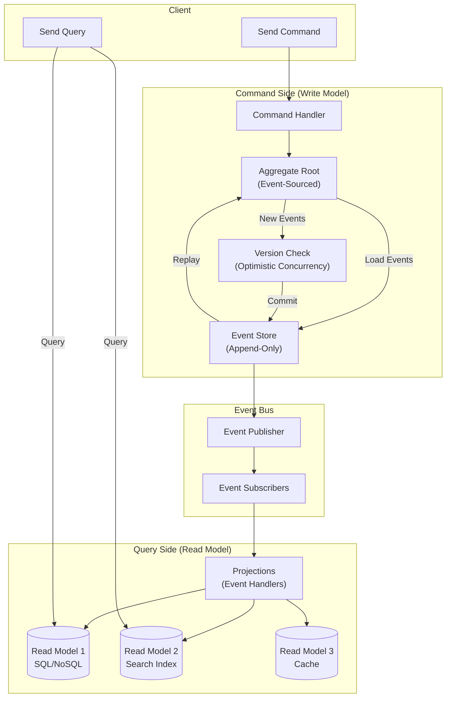

# CQRS & Event Sourcing Implementation: Aggregate Design và Projection Rebuilding

## 1. Mục tiêu của Task

Hiểu sâu bản chất của CQRS (Command Query Responsibility Segregation) và Event Sourcing như hai pattern độc lập nhưng thường đi kèm nhau. Tập trung và:
- **Aggregate Design**: Cách thiết kế aggregate trong hệ thống event-sourced
- **Projection Rebuilding**: Chiến lược rebuild read model khi schema thay đổi
- **Trade-offs thực tế**: Khi nào dùng, khi nào tránh, chi phí vận hành

---

## 2. Bản Chất và Cơ Chế Hoạt Động

### 2.1 CQRS: Không Chỉ Là "Tách Read/Write"

CQRS là sự phân tách **mô hình mental** (mental model) giữa thao tác thay đổi trạng thái (Command) và thao tác đọc trạng thái (Query).

> **Quan trọng**: CQRS không yêu cầu database riêng biệt. Việc dùng database khác nhau cho read/write là **implementation detail**, không phải định nghĩa.

#### Cơ chế cốt lõi:

```
┌─────────────────────────────────────────────────────────────┐
│                    CQRS MENTAL MODEL                        │
├─────────────────────────────────────────────────────────────┤
│                                                             │
│   COMMAND SIDE                    QUERY SIDE               │
│   ┌─────────────────┐            ┌─────────────────┐       │
│   │   Command       │            │   Query         │       │
│   │   (Intent)      │            │   (Question)    │       │
│   │                 │            │                 │       │
│   │ "Đặt hàng #123" │            │ "Đơn hàng #123  │       │
│   │                 │            │  có gì?"        │       │
│   └────────┬────────┘            └────────┬────────┘       │
│            │                              │                │
│            ▼                              ▼                │
│   ┌─────────────────┐            ┌─────────────────┐       │
│   │   Domain Model  │            │   Read Model    │       │
│   │   (Behavior)    │            │   (Data Shape)  │       │
│   │                 │            │                 │       │
│   │ - Validate      │            │ - Optimized for │       │
│   │ - Enforce rules │            │   query patterns│       │
│   │ - Emit events   │            │ - Denormalized  │       │
│   └─────────────────┘            └─────────────────┘       │
│                                                             │
└─────────────────────────────────────────────────────────────┘
```

**Bản chất**: Command side quan tâm **tại sao** thay đổi (business intent); Query side quan tâm **dữ liệu như thế nào** (data shape).

### 2.2 Event Sourcing: Database là Append-Only Log

Event Sourcing định nghĩa lại persistence: thay vì lưu trạng thái hiện tại, lưu chuỗi các sự kiện đã xảy ra.

> **Bản chất**: Event Store là **single source of truth duy nhất**. Trạng thái hiện tại chỉ là **projection** tạm thờI của event stream.

```
TRADITIONAL STATE-BASED                    EVENT SOURCING
┌─────────────────────┐                   ┌─────────────────────┐
│   Order Table       │                   │   Event Store       │
├──────┬──────────────┤                   ├──────┬──────────────┤
│  ID  │   State      │                   │ Seq  │ Event        │
├──────┼──────────────┤                   ├──────┼──────────────┤
│ 123  │ CONFIRMED    │                   │  1   │ OrderCreated │
│      │ Qty: 5       │                   │  2   │ ItemAdded    │
│      │ Total: $500  │  ←─ State         │  3   │ ItemAdded    │
└──────┴──────────────┘                   │  4   │ OrderConfirmed│
                                          └──────┴──────────────┘
                                                    │
                                                    ▼
                                          ┌─────────────────────┐
                                          │  Current State      │
                                          │  = fold(apply,      │
                                          │    events,          │
                                          │    initialState)    │
                                          └─────────────────────┘
```

#### Cơ chế reconstruct state:

```
Stateₙ = fold(apply, [Event₁, Event₂, ..., Eventₙ], State₀)
```

Mỗi event là immutable fact. State được tái tạo bằng cách áp dụng tuần tự các event lên initial state.

---

## 3. Kiến Trúc và Luồng Xử Lý

### 3.1 Kiến trúc tổng thể CQRS + Event Sourcing



### 3.2 Aggregate Design trong Event Sourcing

Aggregate trong Event Sourcing có đặc thù riêng:

```
┌─────────────────────────────────────────────────────────────┐
│              EVENT-SOURCED AGGREGATE                        │
├─────────────────────────────────────────────────────────────┤
│                                                             │
│   ┌─────────────────────────────────────────────────────┐   │
│   │  Aggregate Root (e.g., Order)                       │   │
│   │                                                     │   │
│   │  State:                                             │   │
│   │  - status: CONFIRMED                                │   │
│   │  - items: List<Item>                                │   │
│   │  - total: Money                                     │   │
│   │                                                     │   │
│   │  Behavior (Command Handlers):                       │   │
│   │  - addItem() → ItemAddedEvent                       │   │
│   │  - confirm() → OrderConfirmedEvent                  │   │
│   │  - cancel() → OrderCancelledEvent                   │   │
│   │                                                     │   │
│   │  State Reconstruction (Event Handlers):             │   │
│   │  - on(ItemAddedEvent) → update items, total         │   │
│   │  - on(OrderConfirmedEvent) → status = CONFIRMED     │   │
│   └─────────────────────────────────────────────────────┘   │
│                              │                              │
│                              ▼                              │
│   ┌─────────────────────────────────────────────────────┐   │
│   │  Event Store (External)                             │   │
│   │  ┌─────────────────────────────────────────────┐    │   │
│   │  │ streamId: order-123                         │    │   │
│   │  │ version: 4                                  │    │   │
│   │  │ events: [Created, ItemAdded, ItemAdded,     │    │   │
│   │  │          Confirmed]                         │    │   │
│   │  └─────────────────────────────────────────────┘    │   │
│   └─────────────────────────────────────────────────────┘   │
│                                                             │
└─────────────────────────────────────────────────────────────┘
```

#### Nguyên tắc thiết kế Aggregate:

| Nguyên tắc | Giải thích | Hệ quả |
|------------|------------|--------|
| **Small Aggregates** | Giữ aggregate nhỏ, chỉ bao gồm những gì thực sự cần consistency | Giảm conflict, tăng throughput |
| **Event as API** | Events là contract giữa aggregates | Versioning quan trọng |
| **State via Fold** | State = f(events), không lưu state trực tiếp | Rebuild được từ event stream |
| **Optimistic Concurrency** | Mỗi event có version, reject nếu version mismatch | Tránh lost updates |

### 3.3 Luồng xử lý Command điển hình

```
1. Receive Command (AddItemToOrder)
        │
        ▼
2. Load Aggregate from Event Store
   - Query event stream by aggregateId
   - Replay events to reconstruct state
   - Aggregate now at version N
        │
        ▼
3. Execute Business Logic
   - Validate command against current state
   - Check invariants
   - If valid, create Event(s)
        │
        ▼
4. Optimistic Concurrency Check
   - Expected version = N
   - Actual version in DB = N?
   - If mismatch → ConcurrencyException
        │
        ▼
5. Append Events to Stream
   - Store with version N+1, N+2, ...
   - Atomic append
        │
        ▼
6. Publish Events to Bus
   - Async to event handlers
   - Projections update read models
```

---

## 4. Projection Rebuilding: Chiến Lược và Thực Hành

### 4.1 Vì sao cần Projection Rebuilding?

Projection (read model) là **derived data** - có thể xóa và rebuild từ event stream. Các nguyên nhân rebuild:

1. **Schema Change**: Thêm field mới vào read model
2. **Bug Fix**: Logic projection sai cần fix và recalculate
3. **New Projection**: Thêm view mới cho use case mới
4. **Data Corruption**: Read model bị hỏng

> **Nguyên tắc**: Event Store là source of truth - projections là ephemeral, có thể rebuild.

### 4.2 Chiến lược Rebuilding

```
┌─────────────────────────────────────────────────────────────┐
│              PROJECTION REBUILDING STRATEGIES               │
├─────────────────────────────────────────────────────────────┤
│                                                             │
│  Strategy 1: FULL REBUILD (Offline)                         │
│  ┌─────────────────────────────────────────────────────┐    │
│  │ - Stop all writes                                   │    │
│  │ - Drop old projection                               │    │
│  │ - Replay ALL events from beginning                  │    │
│  │ - Resume writes                                     │    │
│  │                                                     │    │
│  │ Ứng dụng: Small system, maintenance window ok       │    │
│  │  Risk: Downtime                                     │    │
│  └─────────────────────────────────────────────────────┘    │
│                                                             │
│  Strategy 2: DUAL PROJECTION (Online)                       │
│  ┌─────────────────────────────────────────────────────┐    │
│  │ - Create new projection table (v2)                  │    │
│  │ - Catch-up: Replay events từ đầu đến hiện tại       │    │
│  │ - Keep-up: Tiếp tục process new events song song    │    │
│  │ - Cutover: Switch read traffic sang v2              │    │
│  │ - Drop v1                                           │    │
│  │                                                     │    │
│  │ Ứng dụng: Production, zero-downtime                 │    │
│  │  Risk: Storage x2, complexity                       │    │
│  └─────────────────────────────────────────────────────┘    │
│                                                             │
│  Strategy 3: INCREMENTAL MIGRATION                          │
│  ┌─────────────────────────────────────────────────────┐    │
│  │ - New events viết vào cả v1 và v2                   │    │
│  │ - Background job migrate old aggregates sang v2     │    │
│  │ - Read từ v2, fallback v1 nếu chưa migrate          │    │
│  │ - Xóa v1 khi migration hoàn tất                     │    │
│  │                                                     │    │
│  │ Ứng dụng: Large dataset, không thể replay all       │    │
│  │  Risk: Complexity cao, dual-write consistency       │    │
│  └─────────────────────────────────────────────────────┘    │
│                                                             │
└─────────────────────────────────────────────────────────────┘
```

### 4.3 Performance Optimization trong Rebuilding

| Kỹ thuật | Mô tả | Trade-off |
|----------|-------|-----------|
| **Snapshot** | Lưu state tại version N, chỉ replay từ N+1 | Tăng tốc load, thêm complexity quản lý snapshot |
| **Parallel Replay** | Chia event stream, process song song | Tăng throughput, cần ordering guarantees |
| **Batch Processing** | Xử lý events theo batch thay vì từng cái | Giảm I/O, tăng latency nhỏ |
| **Projection Partitioning** | Mỗi projection chỉ subscribe events liên quan | Giảm workload, cần routing logic |

---

## 5. So Sánh Các Lựa Chọn

### 5.1 CQRS + Event Sourcing vs Traditional Architecture

| Tiêu chí | Traditional CRUD | CQRS + Event Sourcing |
|----------|------------------|----------------------|
| **Complexity** | Thấp | Cao |
| **Learning Curve** | Dễ | Khó |
| **Debuggability** | Khó (mất lịch sử) | Dễ (full audit log) |
| **Temporal Queries** | Không hỗ trợ | Native (query at any point) |
| **Scalability Read** | Giới hạn | Tốt (scale read model independently) |
| **Event Replay** | Không thể | Có thể rebuild |
| **Storage** | Nhỏ | Lớn (event history) |
| **Consistency Model** | Đơn giản | Phức tạp (eventual consistency) |

### 5.2 Event Store Options

| Solution | Đặc điểm | Khi nào dùng |
|----------|----------|--------------|
| **Axon Server** | Built for ES, Java-native, commercial features | Java ecosystem, cần enterprise support |
| **EventStoreDB** | Purpose-built, gRPC, projections | Production ES, cần performance |
| **PostgreSQL** | JSONB events, append-only table | Đơn giản, team quen SQL |
| **Kafka** | Log-centric, high throughput | Event streaming, không cần aggregate load |
| **MongoDB** | Change streams, flexible schema | Đã dùng Mongo, cần prototype nhanh |

---

## 6. Rủi Ro, Anti-Patterns, Lỗi Thường Gặp

### 6.1 Fatal Anti-Patterns

> **GOLDEN HAMMER**: Áp dụng CQRS/ES cho toàn bộ hệ thống. **Không phải mọi bounded context đều cần ES.**

#### 1. Anemic Domain Model trong ES

```
❌ ANTI-PATTERN:
   Aggregate chỉ là data container, logic ở service layer
   → Mất benefits của domain model

✅ CORRECT:
   Aggregate encapsulates behavior và invariants
   → Rich domain model, business logic trong aggregate
```

#### 2. Event as State Notification (thay vì Event as Fact)

```
❌ ANTI-PATTERN: "OrderUpdatedEvent" với full state
   → Không biết WHAT changed, chỉ biết state mới

✅ CORRECT: "ItemAddedEvent", "ShippingAddressChangedEvent"
   → Explicit business intent, replayable
```

#### 3. Projection trong Transaction

```
❌ ANTI-PATTERN:
   Commit event + update projection trong cùng transaction
   → Coupling, slow, không scalable

✅ CORRECT:
   Event Store commit trước → Async projection update
   → Eventually consistent, decoupled
```

### 6.2 Production Pitfalls

| Pitfall | Nguyên nhân | Giải pháp |
|---------|-------------|-----------|
| **Large Aggregate** | Thiết kế aggregate quá lớn, nhiều events | Split bounded contexts, snapshot |
| **Event Versioning Hell** | Breaking change events, không migration | Schema registry, upcasters, versioning strategy |
| **Query Side N+1** | Projection thiếu optimization | Denormalize đúng mức, index |
| **Snapshot Race Condition** | Không version snapshot | Snapshot versioning, validate với event stream |
| **GDPR Compliance** | Right to be forgotten vs immutable events | Cryptographic erasure, encryption keys |

---

## 7. Khuyến Nghị Thực Chiến trong Production

### 7.1 Khi nào NÊN dùng CQRS + Event Sourcing

- **Audit Requirements**: Cần full history, compliance (finance, healthcare)
- **Temporal Queries**: "Tài khoản có bao nhiêu tiền vào ngày X?"
- **Complex Domains**: Domain events là first-class concept
- **Event-Driven Architecture**: System đã event-driven, ES là natural fit
- **Multiple Read Models**: Cần nhiều views khác nhau từ cùng data

### 7.2 Khi nào KHÔNG NÊN dùng

> **Team chưa sẵn sàng** là lý do #1 thất bại. ES đòi hỏi mindset shift lớn.

- **Simple CRUD**: Không có business logic phức tạp
- **Small Team**: Không đủ bandwidth maintain complexity
- **Strict Consistency Requirements**: Không chấp nhận eventual consistency
- **Limited Storage**: Event store tăng storage cost đáng kể

### 7.3 Observability & Monitoring

| Metric | Ý nghĩa | Alert Threshold |
|--------|---------|-----------------|
| **Projection Lag** | Delay giữa event commit và projection update | > 5s |
| **Event Store Write Latency** | ThờI gian append event | > 100ms |
| **Aggregate Load Time** | ThờI gian replay events | > 500ms (cần snapshot) |
| **Command Rejection Rate** | Concurrency conflicts | > 1% |

### 7.4 Testing Strategy

```
Unit Tests:
- Given [list of events], When [command], Then [new events]
- Không cần infrastructure

Integration Tests:
- Event store write/read
- Projection handlers
- End-to-end command → query

Acceptance Tests:
- Full workflow với real infrastructure
- Event replay scenarios
```

---

## 8. Kết Luận

### Bản chất cốt lõi:

1. **CQRS** là phân tách mental model giữa command (intent) và query (data shape). Không bắt buộc database riêng.

2. **Event Sourcing** định nghĩa lại persistence thành append-only log của facts. State là derived view.

3. **Aggregate** trong ES là behavioral boundary, state được reconstruct bằng event folding.

4. **Projection** là ephemeral, có thể rebuild. Đây là superpower của ES nhưng cũng là operational burden.

### Trade-off quan trọng nhất:

| Được | Mất |
|------|-----|
| Full audit history, temporal queries | Complexity, learning curve |
| Flexible read models | Eventual consistency |
| Event replay capability | Storage cost, operational overhead |
| Better scalability (read) | Harder to change event schema |

### Rủi ro lớn nhất:

**Team adopting ES mà không hiểu bản chất** → Anemic model, wrong aggregate boundaries, projection trong transaction → Technical debt nặng nề.

### Lời khuyên cuối:

> Bắt đầu với một bounded context nhỏ, đơn giản. Học từ thực tế. Scaling pattern ra toàn hệ thống chỉ khi team đã thực sự comfortable.

---

## Tài liệu tham khảo

- "Implementing Domain-Driven Design" - Vaughn Vernon
- "Exploring CQRS and Event Sourcing" - Microsoft patterns & practices
- Axon Framework Documentation
- EventStoreDB Documentation
- Greg Young's CQRS/Event Sourcing materials
