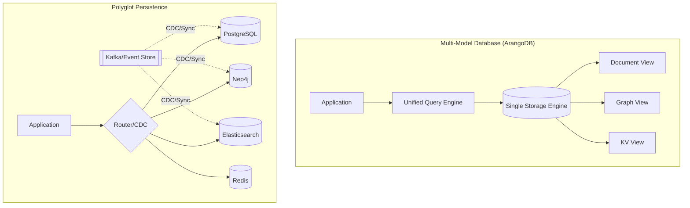
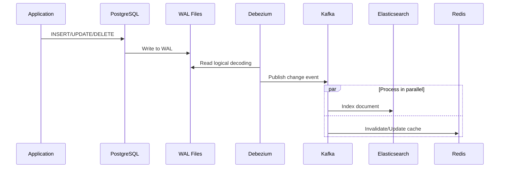

# Multi-Model Databases & Polyglot Persistence Strategies

## 1. Mục tiêu của Task

Task này nghiên cứu hai khái niệm liên quan chặt chẽ trong kiến trúc persistence hiện đại:

1. **Multi-Model Databases**: Cơ sở dữ liệu hỗ trợ nhiều mô hình dữ liệu (document, graph, key-value, relational) trong cùng một engine.
2. **Polyglot Persistence**: Chiến lược sử dụng nhiều loại database chuyên biệt, mỗi loại phục vụ một use case tối ưu.

Mục tiêu là hiểu bản chất của cả hai cách tiếp cận, khi nào nên dùng cái nào, và các chiến lược đồng bộ dữ liệu giữa các hệ thống heterogeneous.

---

## 2. Bản Chất và Cơ Chế Hoạt Động

### 2.1 Multi-Model Database - Kiến trúc đa năng

#### Bản chất cơ chế

Multi-model database không đơn thuần là "nhiều database gộp lại". Đây là một storage engine duy nhất với:

**Unified Storage Layer**
- Một bộ lưu trữ vật lý thống nhất (thường là document-oriented hoặc key-value làm nền tảng)
- Các query engine khác nhau truy cập cùng một underlying data structure
- Metadata layer phân biệt và đánh chỉ mục theo từng mô hình

**Ví dụ cơ chế ArangoDB:**
```
Document Store (JSON) ──┐
                       ├──► RocksDB (Unified Storage)
Graph Engine (Edges) ──┤    với multi-dimensional indexing
                       │
Key-Value (Blobs) ─────┘
```

**Cơ chế query translation:**
- AQL (ArangoDB Query Language) → Unified execution plan → Storage engine
- Gremlin/Cypher queries → Graph traversal optimizer → Document lookups
- Không có data movement giữa các engines vì cùng underlying storage

#### Mục tiêu thiết kế

| Mục tiêu | Giải thích | Giới hạn chấp nhận |
|----------|-----------|-------------------|
| **Operational Simplicity** | Một cluster, một backup strategy, một monitoring stack | Trade-off: Không optimize tối đa cho từng model riêng lẻ |
| **ACID across models** | Transaction xuyên suốt document ↔ graph ↔ KV | Chi phí distributed transaction cao hơn specialized store |
| **Unified Data Model** | Không cần ETL giữa models, join native | Schema complexity tăng khi hỗ trợ nhiều views |
| **Polyglot Query** | Cùng data, nhiều cách truy vấn phù hợp use case | Query planner phức tạp, harder to tune |

#### Trade-off cốt lõi

> **"Multi-model là compromise giữa simplicity và specialization"**

| Dimension | Multi-Model (ArangoDB/Cosmos) | Specialized (PostgreSQL + Neo4j) |
|-----------|------------------------------|----------------------------------|
| **Performance** | 70-80% của specialized tại mỗi model | 100% optimization cho từng model |
| **Operational Cost** | Thấp (1 system) | Cao (N systems) |
| **Feature Depth** | Core features của mỗi model | Full feature set, extensions |
| **Team Skill** | Single skillset | Multiple expertise required |
| **Data Consistency** | Native cross-model ACID | Application-level coordination |

---

### 2.2 Polyglot Persistence - Chiến lược chuyên biệt hóa

#### Bản chất cơ chế

Polyglot persistence nhận ra rằng **không có silver bullet** trong data storage. Mỗi data model sinh ra để giải quyết bài toán cụ thể:

```
┌─────────────────────────────────────────────────────────────┐
│                    Application Layer                        │
│         (Domain-driven design - Bounded Contexts)           │
└─────────────────────────────────────────────────────────────┘
                              │
        ┌─────────────────────┼─────────────────────┐
        ▼                     ▼                     ▼
┌──────────────┐    ┌──────────────────┐   ┌─────────────────┐
│  PostgreSQL  │    │   Elasticsearch  │   │    Redis        │
│  (Relational)│    │    (Search)      │   │   (Cache/KV)    │
├──────────────┤    ├──────────────────┤   ├─────────────────┤
│ • ACID       │    │ • Full-text      │   │ • Speed         │
│ • Complex    │    │ • Faceted        │   │ • Pub/sub       │
│   joins      │    │ • Aggregations   │   │ • Session       │
│ • Reporting  │    │ • Geo-search     │   │   store         │
└──────────────┘    └──────────────────┘   └─────────────────┘
        │                     │                     │
        └─────────────────────┼─────────────────────┘
                              ▼
                    ┌──────────────────┐
                    │   Apache Kafka   │
                    │ (Event Backbone) │
                    └──────────────────┘
```

#### Data Synchronization Patterns

Khi dùng polyglot persistence, dữ liệu phải được đồng bộ giữa các stores. Có 3 pattern chính:

**Pattern 1: Application-Level Dual Write**
```
Service → Write to PostgreSQL ──┐
         → Write to Redis ──────┤──► No coordination
         → Write to ES ─────────┘
```
- **Vấn đề**: Partial failure dẫn đến inconsistency
- **Khắc phục**: Saga pattern, outbox pattern

**Pattern 2: Change Data Capture (CDC)**
```
PostgreSQL → WAL (Write-Ahead Log) → Debezium → Kafka → Consumers
                                                       ├──► Elasticsearch
                                                       ├──► Redis
                                                       └──► Data Warehouse
```
- **Bản chất**: Database ghi log mọi thay đổi → CDC connector parse log → Stream to consumers
- **Ưu điểm**: Source of truth duy nhất, async không ảnh hưởng latency
- **Nhược điểm**: Eventual consistency, complexity của streaming infrastructure

**Pattern 3: Event Sourcing as Source of Truth**
```
Command ─► Aggregate ─► Event Store (Kafka/ES) ─┬──► Projection → PostgreSQL
                                                ├──► Projection → Elasticsearch
                                                └──► Projection → Redis
```
- **Bản chất**: Events là source of truth, databases chỉ là read projections
- **Ưu điểm**: Natural audit log, temporal queries, easy to rebuild
- **Nhược điểm**: Learning curve, event schema evolution complexity

---

## 3. Kiến Trúc & Luồng Xử Lý

### 3.1 Sơ đồ so sánh hai chiến lược



### 3.2 Luồng CDC chi tiết



---

## 4. So Sánh Các Lựa Chọn

### 4.1 Khi nào dùng Multi-Model?

| Use case phù hợp | Use case KHÔNG phù hợp |
|------------------|------------------------|
| Startup/SMB: Ít người, cần nhiều model | High-throughput specialized workload (e.g., time-series) |
| Complex data relationships cần cả document + graph | Cần advanced features của specialized DB (e.g., PostGIS, ML trong PG) |
| Prototype/MVP cần iterate nhanh | Enterprise với dedicated DBA teams cho từng hệ thống |
| Moderate scale (< 10TB, < 100k ops/sec) | Petabyte-scale data warehouse needs |

### 4.2 Khi nào dùng Polyglot Persistence?

| Use case phù hợp | Use case KHÔNG phù hợp |
|------------------|------------------------|
| Large-scale distributed systems | Small team không có expertise vận hành |
| Cần best-in-class performance ở mỗi domain | Simple CRUD app không cần specialization |
| Microservices với bounded contexts rõ ràng | Tight budget (operational cost cao) |
| Complex data pipeline với streaming | Không có infrastructure team |

### 4.3 So sánh các Multi-Model Database

| Database | Storage Engine | Models | Điểm mạnh | Điểm yếu |
|----------|---------------|--------|-----------|----------|
| **ArangoDB** | RocksDB | Document, Graph, KV | Native multi-model, Foxx microservices | Graph performance < Neo4j |
| **Azure Cosmos** | Custom | Document, Graph, Column, KV | Global distribution, SLA | Vendor lock-in, cost |
| **OrientDB** | Custom | Document, Graph, KV | ACID graph transactions | Community smaller |
| **PostgreSQL** | Heap + Index | Relational + JSONB + Graph (pg) | Mature, extensions | JSONB không phải native document |

---

## 5. Rủi Ro, Anti-Patterns, Lỗi Thường Gặp

### 5.1 Multi-Model Anti-Patterns

> **Anti-Pattern 1: "Multi-model nghĩa là dùng tất cả models"**

Chỉ vì database hỗ trợ graph không có nghĩa bạn phải dùng graph. Đây là over-engineering dẫn đến:
- Query complexity không cần thiết
- Performance degradation
- Maintenance burden

> **Anti-Pattern 2: Thiết kế schema cho một model, query bằng model khác**

Ví dụ: Lưu data dạng document nhưng query như graph → Graph traversal phải reconstruct edges runtime → Performance kém.

**Solution**: Thiết kế schema hybrid, pre-compute relationships.

### 5.2 Polyglot Persistence Anti-Patterns

> **Anti-Pattern 1: Dual write không coordination**

```java
// KHÔNG LÀM ĐIỀU NÀY
db.execute("INSERT...");
redis.set(key, value);  // Nếu crash ở đây → inconsistency
es.index(document);
```

> **Anti-Pattern 2: Treating secondary stores as source of truth**

Cache (Redis) hoặc search index (ES) không bao giờ là source of truth. Mọi conflict resolution phải dựa trên primary store.

### 5.3 CDC/Data Sync Failure Modes

| Lỗi | Nguyên nhân | Hệ quả | Khắc phục |
|-----|-------------|--------|-----------|
| **Consumer lag** | Consumer chậm hơn producer | Stale data, old cache | Scale consumers, backpressure |
| **Schema evolution** | Event schema thay đổi | Deserialization failure | Schema registry, backward compatibility |
| **WAL rotation** | CDC miss events trước khi connect | Data loss | Initial snapshot + incremental |
| **Duplicate events** | At-least-once delivery | Duplicate entries | Idempotent consumers |
| **Ordering violation** | Partitioning không đúng key | Inconsistent state | Same partition key for related events |

---

## 6. Khuyến Nghị Thực Chiến trong Production

### 6.1 Monitoring & Observability

**Cho Multi-Model DB:**
- Monitor per-model metrics (document query time vs graph traversal time)
- Storage engine metrics (RocksDB compaction, cache hit ratio)
- Query plan analysis (different execution paths cho different models)

**Cho Polyglot + CDC:**
```yaml
# Key metrics cần monitor
metrics:
  cdc:
    - lag_seconds: < 5s threshold
    - events_per_second: baseline + anomaly detection
    - error_rate: < 0.1%
  consumers:
    - consumer_lag: < 1000 messages
    - processing_latency: p99 < 500ms
    - retry_rate: monitor for poison pills
```

### 6.2 Backpressure & Circuit Breaking

```
Producer ─► Kafka ──┬──► Consumer 1 (healthy) ─► DB
                    ├──► Consumer 2 (slow) ─────► DB
                    │       ↓
                    │   Circuit Breaker OPEN
                    │       ↓
                    └──► Dead Letter Queue
```

**Khuyến nghị**: Luôn có DLQ cho failed events. Không bao giờ drop events silently.

### 6.3 Schema Evolution Strategy

**Với Avro/Protobuf + Schema Registry:**

```
Backward compatible: New code đọc old data ✓
Forward compatible: Old code đọc new data ✓
Full compatible: Cả hai ✓
```

**Strategy cho CDC:**
1. Field addition: Always optional, default value
2. Field removal: Deprecate 2 versions trước khi xóa
3. Type change: Không bao giờ đổi type - tạo field mới
4. Rename: Coi như remove + add (breaking change)

### 6.4 Disaster Recovery

**Multi-Model:**
- Single backup strategy nhưng test restore cho từng model
- Point-in-time recovery critical

**Polyglot:**
- **Primary store**: Daily full backup + continuous WAL archive
- **Secondary stores**: Coi là rebuildable từ CDC stream
- **Recovery procedure**:
  1. Restore primary
  2. Replay CDC từ backup point
  3. Rebuild secondaries

---

## 7. Kết Luận

### Bản chất cốt lõi

**Multi-Model Database** là sự đánh đổi có chủ ý: chấp nhận 80% performance của specialized solutions để đổi lấy operational simplicity và unified data consistency.

**Polyglot Persistence** là recognition rằng specialization tạo ra optimal solutions, nhưng đòi hỏi distributed systems expertise để manage complexity của data synchronization.

### Quyết định kiến trúc

| Câu hỏi | Multi-Model nếu | Polyglot nếu |
|---------|-----------------|--------------|
| Team size? | < 10 engineers | > 50 engineers, dedicated infra |
| Data scale? | < 10TB | > 100TB |
| Use case diversity? | Moderate (2-3 models) | High (5+ specialized needs) |
| Consistency requirement? | Strong cross-model | Eventual acceptable |
| Operational maturity? | Limited DBA resources | Mature SRE practice |

### Lời khuyên cuối

> Đừng chọn multi-model vì "có thể" dùng nhiều models. Chọn nó khi operational simplicity quan trọng hơn tối ưu cuối cùng. Đừng chọn polyglot vì "cool" - chọn khi specialization thực sự tạo ra business value đáng kể so với complexity cost.

---

## 8. Code Reference (Minimal)

### CDC với Debezium (Kafka Connect)

```json
{
  "name": "postgres-cdc-connector",
  "config": {
    "connector.class": "io.debezium.connector.postgresql.PostgresConnector",
    "database.hostname": "postgres",
    "database.dbname": "orders",
    "database.server.name": "dbserver1",
    "table.include.list": "public.orders,public.customers",
    "plugin.name": "pgoutput",
    "transforms": "route",
    "transforms.route.type": "org.apache.kafka.connect.transforms.RegexRouter",
    "transforms.route.regex": "([^.]+)\\.([^.]+)\\.([^.]+)",
    "transforms.route.replacement": "$3"
  }
}
```

### Idempotent Consumer Pattern

```java
@Component
public class OrderEventHandler {
    
    @KafkaListener(topics = "orders")
    public void handle(OrderEvent event) {
        // Idempotency key từ event ID
        if (processedEventRepository.existsById(event.getEventId())) {
            return; // Already processed
        }
        
        // Process
        elasticsearch.index(orderDocument);
        
        // Mark processed
        processedEventRepository.save(new ProcessedEvent(event.getEventId()));
    }
}
```

### ArangoDB Multi-Model Query

```javascript
// AQL query kết hợp Document + Graph
FOR customer IN Customers
  FILTER customer.status == "premium"
  FOR v, e, p IN 1..2 OUTBOUND customer CustomerOrderGraph
    FILTER v.totalAmount > 1000
    RETURN {
      customer: customer.name,
      highValueOrders: v,
      path: p.edges
    }
```

---

**Tài liệu nghiên cứu hoàn thành**  
*Chiều sâu hơn độ dài. Bản chất hơn snippet.*
