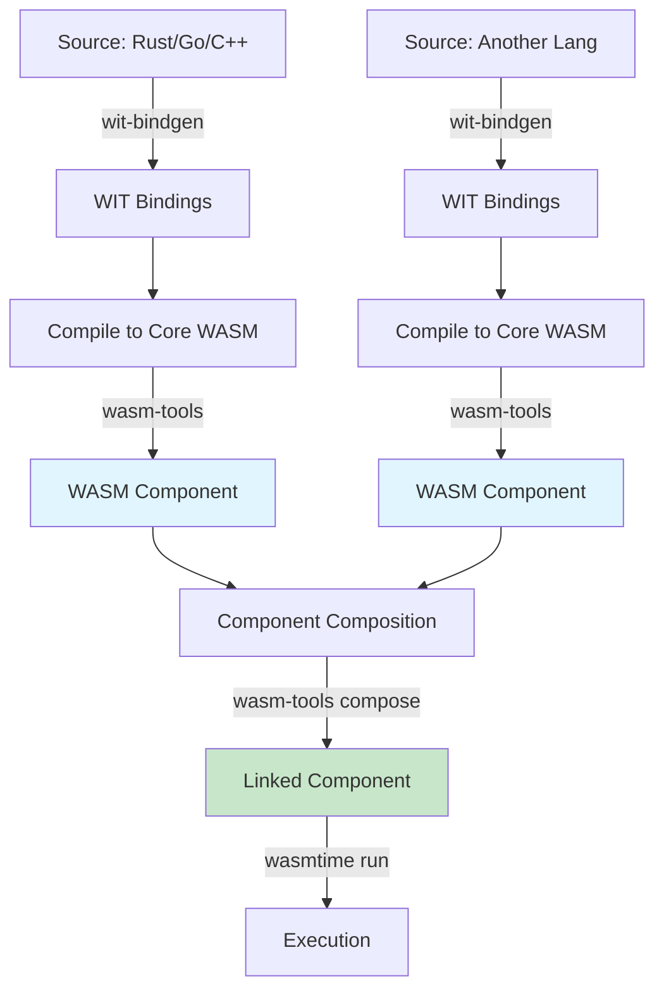

# WASM for Backend - Component Model, WASI Preview 2, Language Interoperability

> **Task:** Nghiên cứu kiến trúc WebAssembly cho backend, tập trung vào Component Model, WASI Preview 2, và khả năng tương tác đa ngôn ngữ trong production.

---

## 1. Mục tiêu của Task

Hiểu sâu bản chất WebAssembly (WASM) như một runtime target cho backend services, phân tích:
- **Component Model**: Kiến trúc modular composition cho WASM modules
- **WASI Preview 2**: Standardized system interface thế hệ mới
- **Language Interoperability**: Cách các ngôn ngữ khác nhau compile xuống WASM và tương tác

---

## 2. Bản chất và Cơ chế Hoạt động

### 2.1 WebAssembly Core Concepts

WebAssembly không phải là một ngôn ngữ lập trình — nó là **binary instruction format** cho stack-based virtual machine.

**Stack-based VM Architecture:**

```
┌─────────────────────────────────────────────────────────────┐
│                    WASM Runtime (Host)                       │
├─────────────────────────────────────────────────────────────┤
│  ┌─────────────┐    ┌──────────────┐    ┌────────────────┐  │
│  │   Memory    │    │   Instance   │    │  Table (funcs) │  │
│  │  (linear)   │    │  (globals)   │    │  (indirect)    │  │
│  └─────────────┘    └──────────────┘    └────────────────┘  │
├─────────────────────────────────────────────────────────────┤
│                     Execution Stack                          │
│  [Operand Stack] ← Push/Pop values during execution         │
│  [Control Stack] ← Blocks, loops, function calls            │
├─────────────────────────────────────────────────────────────┤
│                    Instruction Stream                        │
│  i32.const 42  →  i32.const 8  →  i32.add  →  call $foo     │
└─────────────────────────────────────────────────────────────┘
```

**Điểm then chốt:** WASM thiết kế để làm **compilation target**, không phải để viết tay. Source → WASM compiler → Binary → Runtime.

### 2.2 Component Model - Kiến trúc Thành phần

Component Model là abstraction layer mới (W3C proposal), giải quyết vấn đề fundamental: **WASM modules không biết cách gọi lẫn nhau**.

**Vấn đề với Core WASM:**

```
Module A (Rust)                    Module B (Go)
┌─────────────────┐                ┌─────────────────┐
│ fn calculate()  │───????─────→   │ fn process()    │
│   i32 → i32     │   Không        │   string → i32  │
└─────────────────┘   có interface  └─────────────────┘
                      để gọi!
```

**Giải pháp Component Model:**

```
┌──────────────────────────────────────────────────────────────┐
│                     COMPONENT                                │
│  ┌─────────────────────────────────────────────────────────┐ │
│  │  Interface Definitions (WIT - Wasm Interface Types)     │ │
│  │  ─────────────────────────────────────────────────────  │ │
│  │  interface calculator {                                 │ │
│  │    add: func(a: s32, b: s32) -> s32                    │ │
│  │  }                                                      │ │
│  │  interface datastore {                                  │ │
│  │    get: func(key: string) -> option<string>            │ │
│  │  }                                                      │ │
│  └─────────────────────────────────────────────────────────┘ │
│  ┌─────────────────┐        ┌─────────────────┐              │
│  │   Core Module   │←──────→│  Core Module    │              │
│  │  (Wasm binary)  │  Lift/Lower           │              │
│  │  (Rust/C/Go...) │  Canonical ABI        │              │
│  └─────────────────┘        └─────────────────┘              │
└──────────────────────────────────────────────────────────────┘
```

**Cơ chế Lift/Lower:**

```
Caller (Rust)                              Callee (Go)
┌─────────────┐                          ┌─────────────┐
│ add(5, 3)   │                          │ add(a, b)   │
│  ↓          │    Canonical ABI         │  ↑          │
│  Lower      │◄────────────────────────►│  Lift       │
│  (flatten)  │   Transform types        │  (allocate) │
│  ↓          │   across language        │  ↓          │
│ WASM call   │   boundaries             │ WASM exec   │
└─────────────┘                          └─────────────┘
```

**Bản chất quan trọng:** Component Model **không ép buộc** layout in-memory cụ thể. Thay vào đó, nó define:
- **Interface types**: High-level types (string, list, record, variant)
- **Canonical ABI**: Standardized conversion rules giữa caller/callee

### 2.3 WASI Preview 2 - World của Capabilities

WASI (WebAssembly System Interface) là standardized API để WASM tương tác với system resources.

**Evolution:**

| Version | Philosophy | Key Characteristics |
|---------|------------|---------------------|
| Preview 1 | Capability-lite | Module imports functions directly |
| Preview 2 | **Capability-based** | Everything qua handle, explicit grants |

**WASI Preview 2 Architecture:**

```
┌─────────────────────────────────────────────────────────────────────┐
│                        WORLD DEFINITION                              │
│                        (wasi:cli/command)                            │
├─────────────────────────────────────────────────────────────────────┤
│  ┌──────────────┐  ┌──────────────┐  ┌──────────────┐              │
│  │ wasi:cli/*   │  │ wasi:io/*    │  │ wasi:random  │              │
│  │ - stdout     │  │ - streams    │  │ - insecure   │              │
│  │ - stderr     │  │ - pollable   │  │ - secure     │              │
│  │ - stdin      │  │              │  │              │              │
│  └──────────────┘  └──────────────┘  └──────────────┘              │
│  ┌──────────────┐  ┌──────────────┐  ┌──────────────┐              │
│  │ wasi:filesystem│ │ wasi:sockets │  │ wasi:clocks  │              │
│  │ - types      │  │ - tcp        │  │ - wall-clock │              │
│  │ - preopens   │  │ - udp        │  │ - monotonic  │              │
│  └──────────────┘  └──────────────┘  └──────────────┘              │
└─────────────────────────────────────────────────────────────────────┘
                           │
                           ▼
┌─────────────────────────────────────────────────────────────────────┐
│                      HOST IMPLEMENTATION                             │
│              (Wasmtime, WasmEdge, Spin, browser...)                  │
└─────────────────────────────────────────────────────────────────────┘
```

**Capability-based Security Model:**

> "Không phải "có quyền đọc file", mà là "được cấp handle cụ thể đến file đó""

```rust
// Preview 1: Module import filesystem functions
(import "wasi_snapshot_preview1" "path_open" (func $open))

// Preview 2: Component nhận descriptor qua parameter
(component
  (import "wasi:filesystem/types@0.2.0" (instance $fs-types))
  ;; Sử dụng descriptor được truyền vào, không tự ý mở file
)
```

**Production Impact:**
- **Sandbox mặc định**: WASM module không có bất kỳ capability nào khi khởi động
- **Explicit grants**: Host phải explicitly provide từng capability (file descriptors, sockets, clocks)
- **Fine-grained**: Có thể cấp chỉ read-only access vào một directory cụ thể

### 2.4 Language Interoperability - Multi-language Composition

Component Model cho phép **true polyglot microservices** — không cần gRPC, không cần HTTP.

**Kiến trúc Cross-language:**

```
┌─────────────────────────────────────────────────────────────────────┐
│                     HOST APPLICATION                                 │
│                    (Rust/C/Go/Java...)                               │
├─────────────────────────────────────────────────────────────────────┤
│  ┌─────────────────┐  ┌─────────────────┐  ┌─────────────────┐     │
│  │   Component A   │  │   Component B   │  │   Component C   │     │
│  │    (Rust)       │  │    (Go)         │  │    (C++)        │     │
│  │                 │  │                 │  │                 │     │
│  │  export add()   │──┤  import add()   │  │  export mul()   │◄────┤
│  │  import mul()   │◄─┤  export calc()  │──┤  import calc()  │     │
│  └─────────────────┘  └─────────────────┘  └─────────────────┘     │
│           │                    │                    │               │
│           └────────────────────┴────────────────────┘               │
│                         Link-time                                   │
└─────────────────────────────────────────────────────────────────────┘
```

**Type System Mapping:**

| WIT Type        | Rust              | Go                  | C++                    |
|-----------------|-------------------|---------------------|------------------------|
| `string`        | `String`          | `string`            | `std::string`          |
| `list<u8>`      | `Vec<u8>`         | `[]byte`            | `std::vector<uint8_t>` |
| `option<T>`     | `Option<T>`       | `*T` (nullable)     | `std::optional<T>`     |
| `result<T, E>`  | `Result<T, E>`    | `(T, error)`        | `std::expected<T, E>`  |
| `variant`       | `enum`            | `interface{}` + type| `std::variant`         |
| `record`        | `struct`          | `struct`            | `struct`               |

**Resource Types (RAII in WASM):**

```wit
// Define resource type
resource db-connection {
  constructor: func(conn-string: string) -> result<db-connection, error>
  query: func(sql: string) -> result<list<record>, error>
  close: func()
}
```

Component Model implements **reference counting** cho resources, đảm bảo deterministic cleanup giữa các ngôn ngữ có garbage collector khác nhau.

---

## 3. Kiến trúc / Luồng xử lý

### 3.1 Component Build & Link Flow



### 3.2 Runtime Execution Model

```
┌────────────────────────────────────────────────────────────────────┐
│                         HOST PROCESS                                │
├────────────────────────────────────────────────────────────────────┤
│  ┌──────────────────────────────────────────────────────────────┐  │
│  │                    WASM RUNTIME (e.g., Wasmtime)              │  │
│  │  ┌────────────────────────────────────────────────────────┐  │  │
│  │  │              Component Instance (isolated)              │  │  │
│  │  │  ┌──────────┐  ┌──────────┐  ┌──────────┐             │  │  │
│  │  │  │ Store    │  │ Memory   │  │ Table    │             │  │  │
│  │  │  │ (globals)│  │ (linear) │  │ (funcs)  │             │  │  │
│  │  │  └──────────┘  └──────────┘  └──────────┘             │  │  │
│  │  │  ┌────────────────────────────────────────────────────┐│  │  │
│  │  │  │  Exported Functions (lifted interface)             ││  │  │
│  │  │  │  ┌────────┐    Canonical ABI    ┌────────┐        ││  │  │
│  │  │  │  │ Caller │ ◄─────────────────► │ Callee │        ││  │  │
│  │  │  │  └────────┘    (lower/flatten)  └────────┘        ││  │  │
│  │  │  └────────────────────────────────────────────────────┘│  │  │
│  │  └────────────────────────────────────────────────────────┘  │  │
│  │                                                                 │  │
│  │  ┌────────────────────────────────────────────────────────┐  │  │
│  │  │              WASI Implementation (host)                │  │  │
│  │  │  - Filesystem: host OS calls                          │  │  │
│  │  │  - Sockets: host network stack                        │  │  │
│  │  │  - Clocks: host time APIs                             │  │  │
│  │  └────────────────────────────────────────────────────────┘  │  │
│  └──────────────────────────────────────────────────────────────┘  │
└────────────────────────────────────────────────────────────────────┘
```

---

## 4. So sánh các Lựa chọn

### 4.1 WASM Runtimes Comparison

| Runtime       | Focus              | WASI Support       | Production Ready | Ecosystem Strength |
|---------------|-------------------|-------------------|------------------|-------------------|
| **Wasmtime**  | General purpose   | Preview 2 (full)  | ✅ Yes           | ⭐⭐⭐⭐⭐          |
| **WasmEdge**  | Cloud/Edge        | Preview 2         | ✅ Yes           | ⭐⭐⭐⭐           |
| **Spin**      | Serverless/FaaS   | Preview 2         | ✅ Yes           | ⭐⭐⭐⭐           |
| **WAMR**      | IoT/Embedded      | Preview 1 mostly  | ✅ Yes           | ⭐⭐⭐             |
| **Wasm3**     | Interpreter       | Limited           | ⚠️ Dev only      | ⭐⭐               |

### 4.2 WASM vs Containers - Trade-off Analysis

| Aspect          | WASM Component               | Linux Container           |
|-----------------|------------------------------|---------------------------|
| **Startup**     | Milliseconds (cold)          | Seconds (cold)            |
| **Size**        | MBs (minimal runtime)        | 100s MBs (OS + deps)      |
| **Isolation**   | Capability-based sandbox     | Namespace + cgroups       |
| **Overhead**    | Near-native (AOT/JIT)        | Small overhead (OS shared)|
| **Debuggability**| Limited (stack traces)       | Rich (gdb, strace, etc.)  |
| **Ecosystem**   | Emerging (2024-2025)         | Mature (Docker, K8s)      |
| **Tooling**     | wasm-tools, wit-bindgen      | docker, kubectl, helm     |
| **Portability** | True write-once-run-anywhere | Linux kernel dependency   |

### 4.3 When to Choose WASM over Containers

**✅ Chọn WASM khi:**
- Cần **cold start < 10ms** (FaaS, edge functions)
- **Multi-tenant** với security concerns cao (sandbox by default)
- **Binary size** quan trọng (edge deployment, CDN workers)
- Cần **language interoperability** không HTTP overhead
- **Serverless** scale-to-zero economics quan trọng

**❌ Không chọn WASM khi:**
- Cần **complex debugging** (WASM debugging tools còn immature)
- **Legacy applications** (porting cost cao)
- **Complex system calls** (WASI coverage không complete)
- Team không có expertise với **new toolchain**

---

## 5. Rủi ro, Anti-patterns, Lỗi thường gặp

### 5.1 Critical Risks

**1. WASI Compatibility Gap**

> Không phải mọi system call đều có WASI equivalent. Preview 2 cũng không cover tất cả.

```rust
// ❌ KHÔNG CÓ WASI EQUIVALENT
std::process::Command::new("sh")
    .arg("-c")
    .arg("rm -rf /")  // Shell execution - BLOCKED
    .spawn()

// ❌ Direct kernel syscalls
libc::ptrace(...)  // Process tracing - BLOCKED
```

**Mitigation:** Trước khi chọn WASM, audit tất cả system dependencies.

**2. Memory Growth Unbounded**

```rust
// WASM linear memory không shrink
let mut vec = Vec::new();
for _ in 0..1_000_000 {
    vec.push(42);  // Memory grow
}
vec.clear();  // Memory VẪN giữ nguyên size!
```

**Mitigation:** Implement memory pools, hoặc restart instances periodically.

**3. Component Version Mismatch**

```wit
// Component A export v1
interface calculator@1.0.0 { ... }

// Component B import v2
use calculator@2.0.0;  // ❌ Link-time failure!
```

**Mitigation:** Strict semantic versioning, registry (Warg), automated testing.

### 5.2 Anti-patterns

| Anti-pattern | Why Bad | Better Approach |
|-------------|---------|-----------------|
| Treat WASM như container | Mất benefit của sandbox, cold start | Embrace capability model |
| Synchronous blocking I/O | WASM single-threaded nội bộ | WASI async/streams |
| Large binary bundles | Startup time degradation | Split components, lazy load |
| Direct memory sharing | Violate Component Model safety | Pass data qua interface |

### 5.3 Production Pitfalls

**Stack Overflow:**
- WASM default stack: ~1MB
- Rust: `RUST_MIN_STACK` env var
- Go: `runtime.GOMAXPROCS` tuning

**GC Pressure (Managed Languages):**
```go
// Go compiled to WASM vẫn có GC
// GC pauses ảnh hưởng latency-critical paths
// → Profile GC metrics, tune GOGC
```

**Missing Observability:**
- WASM stack traces không tự động map về source
- Cần: `wasm-split`, `wasm-bindgen` source maps

---

## 6. Khuyến nghị Thực chiến trong Production

### 6.1 Architecture Patterns

**Pattern 1: Sidecar WASM Components**

```
┌─────────────────────────────────────────────┐
│              Main Service (Rust/Go)          │
│  ┌─────────────────────────────────────┐   │
│  │  WASM Component: Policy Engine      │   │
│  │  - Compiled from Rego/Rego-like     │   │
│  │  - Hot-reload without restart       │   │
│  └─────────────────────────────────────┘   │
└─────────────────────────────────────────────┘
```

**Pattern 2: FaaS with Spin**

```yaml
# spin.toml
spin_manifest_version = "2"

[[trigger.http]]
route = "/api/..."
component = "api-handler"

[component.api-handler]
source = "target/wasm32-wasi/release/api.wasm"
allowed_outbound_hosts = ["postgres://db.internal:5432"]
```

**Pattern 3: Plugin System**

```rust
// Host application
let engine = Engine::default();
let component = Component::from_file(&engine, "plugin.wasm")?;
let mut store = Store::new(&engine, ());

// Instantiate with capabilities
let mut linker = Linker::new(&engine);
wasi::cli::command::add_to_linker(&mut linker)?;

let instance = linker.instantiate(&mut store, &component)?;
// Call exported function with type safety
```

### 6.2 Monitoring & Observability

**Key Metrics:**
- **Instantiation time**: Cold start latency
- **Memory usage**: Linear memory growth
- **WASI call latency**: I/O bottlenecks
- **Trap rate**: Runtime errors (out-of-bounds, div-by-zero)

**Tooling:**
```bash
# Wasmtime profiling
wasmtime run --profile=guest,json profile.json module.wasm

# Memory inspection
wasmtime run --wasi-modules=experimental-memory module.wasm
```

### 6.3 Deployment Recommendations

**Version Pinning:**
```dockerfile
# Pin WASM runtime version
FROM ghcr.io/bytecodealliance/wasmtime:16.0.0
COPY component.wasm /app/
CMD ["wasmtime", "run", "/app/component.wasm"]
```

**Graceful Shutdown:**
```rust
// Handle SIGTERM in host, gracefully finish WASM execution
// WASI Preview 2 có exit code handling chuẩn
```

---

## 7. Kết luận

**Bản chất của WASM Backend:**

WebAssembly cho backend không phải là "containers killer", mà là **complementary runtime** cho use cases cụ thể:

1. **Component Model** giải quyết vấn đề interoperability bằng cách define standardized interface (WIT) và canonical ABI cho cross-language calls.

2. **WASI Preview 2** đưa capability-based security vào mainstream — mặc định deny, explicit grant — một mô hình security superior so với traditional OS permissions.

3. **Language interoperability** giờ có thể thực hiện ở link-time thay vì network-time, loại bỏ serialization/deserialization overhead của gRPC/HTTP.

**Trade-off cốt lõi:**
- **Pros**: Sub-millisecond cold start, true sandbox, polyglot composition, small footprint
- **Cons**: Immature tooling, WASI coverage gaps, debugging complexity, ecosystem lock-in risk

**Verdict cho 2025:** WASM backend production-ready cho **FaaS, edge computing, plugin systems**. Chưa sẵn sàng thay thế containers cho **complex stateful services, heavy debugging needs, legacy migrations**.

**Hướng phát triển đáng chú ý:**
- WASI Preview 3 (async/await native)
- Component Model trong browser (JavaScript interop)
- Registry standardization (Warg, OCI artifacts for WASM)

---

## 8. Tài liệu Tham khảo

- [WebAssembly Component Model Proposal](https://github.com/WebAssembly/component-model)
- [WASI Preview 2 Specification](https://github.com/WebAssembly/WASI/tree/main/preview2)
- [Wasmtime Documentation](https://docs.wasmtime.dev/)
- [Fermyon Spin](https://developer.fermyon.com/spin/v2/index)
- [Bytecode Alliance - Component Model Explained](https://component-model.bytecodealliance.org/)

---

*Research completed: 2025-03-28*
