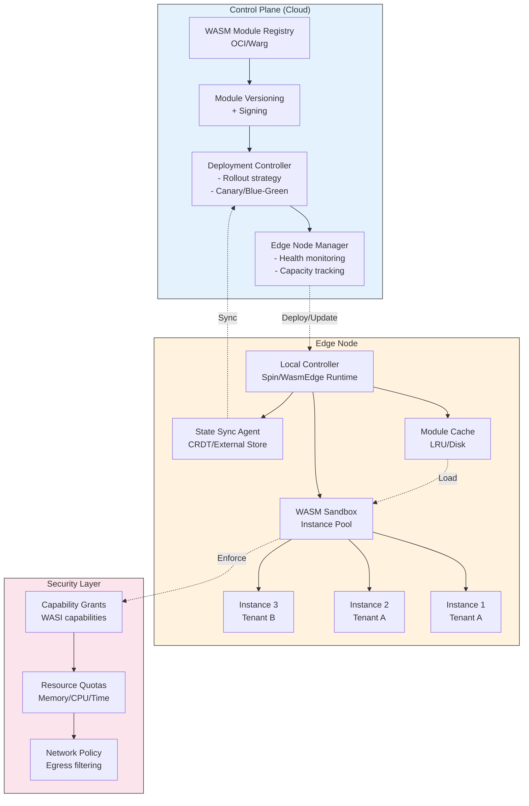

# WASM Edge Computing - Distributed Modules, State Management, Security Sandboxing

> **Task:** Nghiên cứu kiến trúc WebAssembly tại edge computing, tập trung vào phân phối modules, quản lý state trong môi trường distributed, và mô hình sandbox bảo mật cho multi-tenant edge environments.

---

## 1. Mục tiêu của Task

Hiểu sâu bản chất WASM trong ngữ cảnh edge computing — nơi latency, bandwidth, và security constraints khắc nghiệt hơn cloud truyền thống:

- **Distributed WASM Modules**: Cơ chế phân phối, khởi động, và quản lý vòng đợi module tại hàng nghìn edge nodes
- **State Management**: Chiến lược quản lý state giữa stateless WASM modules và ephemeral edge environment
- **Security Sandboxing**: Multi-tenant isolation khi chạy untrusted code tại edge infrastructure

---

## 2. Bản chất và Cơ chế Hoạt động

### 2.1 Edge Computing vs Cloud - Bản chất Khác biệt

**Mô hình Cloud Truyền thống:**

```
┌─────────────────────────────────────────────────────────────┐
│                      CLOUD REGION                            │
│  ┌─────────────────┐  ┌─────────────────┐  ┌──────────────┐  │
│  │   Service A     │  │   Service B     │  │   Database   │  │
│  │   (Container)   │  │   (Container)   │  │  (Stateful)  │  │
│  │                 │  │                 │  │              │  │
│  │  Latency: 1-10ms│  │  Latency: 1-10ms│  │ Latency: <1ms│  │
│  └─────────────────┘  └─────────────────┘  └──────────────┘  │
│         │                      │                    │        │
│         └──────────────────────┴────────────────────┘        │
│                         Internal Network                     │
└─────────────────────────────────────────────────────────────┘
                              │
                         10-100ms latency
                              │
                        ┌─────────────┐
                        │    User     │
                        └─────────────┘
```

**Mô hình Edge Computing:**

```
┌─────────────────────────────────────────────────────────────────┐
│                    EDGE NODE (PoP/5G MEC/IoT)                    │
│  ┌───────────────────────────────────────────────────────────┐  │
│  │              WASM Runtime (Resource Constrained)           │  │
│  │  ┌────────────┐  ┌────────────┐  ┌──────────────────────┐ │  │
│  │  │   Auth     │  │  Transform │  │   ML Inference       │ │  │
│  │  │  (WASM)    │  │   (WASM)   │  │     (WASM)           │ │  │
│  │  │  50KB      │  │   30KB     │  │    200KB             │ │  │
│  │  └────────────┘  └────────────┘  └──────────────────────┘ │  │
│  │                                                           │  │
│  │  Constraints:                                             │  │
│  │  - Memory: 64-512MB per node                              │  │
│  │  - CPU: Shared, bursty                                    │  │
│  │  - Storage: Ephemeral, limited                            │  │
│  │  - Network: Intermittent, expensive                       │  │
│  └───────────────────────────────────────────────────────────┘  │
└─────────────────────────────────────────────────────────────────┘
                              │
                          1-10ms latency
                              │
                        ┌─────────────┐
                        │    User     │
                        └─────────────┘
```

**Điểm then chốt:** Edge environment có constraints khắc nghiệt hơn cloud:
- **Resource**: 10-100x nhỏ hơn cloud instances
- **Connectivity**: Không đảm bảo kết nối liên tục với cloud
- **Ephemeral**: Nodes có thể disappear/reappear bất cứ lúc nào
- **Multi-tenant**: Shared infrastructure giữa nhiều customers

### 2.2 Distributed WASM Module Architecture

**Bản chất vấn đề:** Làm thế nào để deploy, update, và quản lý hàng nghìn WASM modules tại hàng nghìn edge nodes khác nhau?

```
┌─────────────────────────────────────────────────────────────────────┐
│                     CONTROL PLANE (Cloud)                            │
│  ┌───────────────────────────────────────────────────────────────┐  │
│  │              WASM Module Registry (OCI/Warg)                   │  │
│  │  ┌─────────────┐  ┌─────────────┐  ┌─────────────────────┐   │  │
│  │  │ auth-v1.2   │  │transf-v2.0  │  │  ml-infer-v3.1      │   │  │
│  │  │ .wasm (50KB)│  │ .wasm (30KB)│  │  .wasm (200KB)      │   │  │
│  │  │ Sig: SHA256 │  │ Sig: SHA256 │  │  Sig: SHA256        │   │  │
│  │  └─────────────┘  └─────────────┘  └─────────────────────┘   │  │
│  └───────────────────────────────────────────────────────────────┘  │
│                              │                                       │
│                    Pull/Push (on-demand/delta)                       │
│                              │                                       │
└──────────────────────────────┼───────────────────────────────────────┘
                               │
         ┌─────────────────────┼─────────────────────┐
         │                     │                     │
         ▼                     ▼                     ▼
┌────────────────┐  ┌────────────────┐  ┌────────────────┐
│  Edge Node 1   │  │  Edge Node 2   │  │  Edge Node N   │
│  (Tokyo)       │  │  (London)      │  │  (São Paulo)   │
│                │  │                │  │                │
│ ┌────────────┐ │  │ ┌────────────┐ │  │ ┌────────────┐ │
│ │ Local Cache│ │  │ │ Local Cache│ │  │ │ Local Cache│ │
│ │ - auth     │ │  │ │ - auth     │ │  │ │ - auth     │ │
│ │ - transform│ │  │ │ - transform│ │  │ │ - transform│ │
│ └────────────┘ │  │ └────────────┘ │  │ └────────────┘ │
│                │  │                │  │                │
│ ┌────────────┐ │  │ ┌────────────┐ │  │ ┌────────────┐ │
│ │ Runtime    │ │  │ │ Runtime    │ │  │ │ Runtime    │ │
│ │ (Wasmtime) │ │  │ │ (WasmEdge) │ │  │ │ (Wasmtime) │ │
│ └────────────┘ │  │ └────────────┘ │  │ └────────────┘ │
└────────────────┘  └────────────────┘  └────────────────┘
```

**Module Distribution Strategies:**

| Strategy | Mechanism | Use Case | Trade-off |
|----------|-----------|----------|-----------|
| **Eager Push** | Push tất cả modules đến tất cả nodes | Small fleet, critical apps | High bandwidth, fast startup |
| **Lazy Pull** | Pull on-demand khi request đến | Large fleet, sporadic usage | Cold start penalty, low bandwidth |
| **Predictive** | ML-based prefetch dựa trên patterns | Variable workload | Complex, potential misprediction |
| **Tiered** | Hot modules local, cold modules remote | Mixed workload | Balance latency/bandwidth |

**Delta Updates:**

```
Module Update: auth-v1.2 → auth-v1.3

Truyền thống (Container):
  auth-v1.2 image: 150MB
  auth-v1.3 image: 150MB (chỉ thay đổi 5MB layer)
  Pull: 150MB (vì layer mới)

WASM Delta:
  auth-v1.2.wasm: 50KB
  auth-v1.3.wasm: 51KB (chỉ thay đổi function X)
  Diff (bsdiff): 2KB
  Transfer: 2KB (97% reduction!)
```

### 2.3 State Management tại Edge

**Vấn đề cốt lõi:** WASM modules là stateless theo thiết kế, nhưng edge applications cần state. Làm thế nào để reconcile?

**State Categories:**

```
┌─────────────────────────────────────────────────────────────────┐
│                   STATE TYPES AT EDGE                            │
├─────────────────────────────────────────────────────────────────┤
│                                                                 │
│  1. EPHEMERAL STATE (Module-local)                              │
│     ┌──────────────────────────────────────────────────────┐   │
│     │  - Request context                                   │   │
│     │  - In-memory cache (LRU)                             │   │
│     │  - Connection pooling (to upstream)                  │   │
│     │                                                      │   │
│     │  Lifetime: Request-scoped hoặc Instance-scoped      │   │
│     │  Persistence: None                                   │   │
│     └──────────────────────────────────────────────────────┘   │
│                              │                                  │
│  2. LOCAL STATE (Node-scoped)                                   │
│     ┌──────────────────────────────────────────────────────┐   │
│     │  - Module configuration                              │   │
│     │  - Local rate limit counters                         │   │
│     │  - Cached responses (WASI filesystem)                │   │
│     │                                                      │   │
│     │  Lifetime: Node lifetime                             │   │
│     │  Persistence: Ephemeral (tmpfs)                      │   │
│     └──────────────────────────────────────────────────────┘   │
│                              │                                  │
│  3. DISTRIBUTED STATE (Cross-node)                              │
│     ┌──────────────────────────────────────────────────────┐   │
│     │  - User sessions                                     │   │
│     │  - Shared counters                                   │   │
│     │  - Configuration (eventual consistency)              │   │
│     │                                                      │   │
│     │  Lifetime: Application-scoped                        │   │
│     │  Persistence: Cloud/Regional store                   │   │
│     └──────────────────────────────────────────────────────┘   │
│                                                                 │
└─────────────────────────────────────────────────────────────────┘
```

**State Management Patterns:**

**Pattern 1: External State Store (Cloud-backed)**

```
┌─────────────────────────────────────────────────────────────────┐
│                         EDGE NODE                                │
│  ┌───────────────────────────────────────────────────────────┐ │
│  │                   WASM Module                              │ │
│  │  ┌─────────────────────────────────────────────────────┐  │ │
│  │  │  handle_request()                                   │  │ │
│  │  │    │                                                │  │ │
│  │  │    ▼                                                │  │ │
│  │  │  wasi:http/outgoing-handler (to local proxy)        │  │ │
│  │  └─────────────────────────────────────────────────────┘  │ │
│  └───────────────────────────────────────────────────────────┘ │
│                              │                                  │
│                         (localhost)                            │
│                              │                                  │
│  ┌───────────────────────────▼──────────────────────────────┐  │
│  │              Edge State Proxy (Sidecar)                   │  │
│  │  - Local caching (Redis/Valkey)                          │  │
│  │  - Sync with cloud state store                           │  │
│  │  - Conflict resolution (Last-Write-Wins)                 │  │
│  └───────────────────────────────────────────────────────────┘  │
└─────────────────────────────────────────────────────────────────┘
         │                                      │
         │ Cache miss / Sync                    │
         ▼                                      ▼
┌─────────────────────────────────────────────────────────────────┐
│              CLOUD STATE STORE (DynamoDB/Redis Cluster)          │
└─────────────────────────────────────────────────────────────────┘
```

**Pattern 2: CRDTs (Conflict-free Replicated Data Types)**

```rust
// Pseudocode: CRDT Counter trong WASM
struct GCounter {
    // Mỗi node có entry riêng
    node_values: HashMap<NodeId, u64>,
}

impl GCounter {
    fn increment(&mut self, node: NodeId) {
        *self.node_values.entry(node).or_insert(0) += 1;
    }
    
    fn merge(&mut self, other: &GCounter) {
        // Merge: lấy max của mỗi node
        for (node, value) in &other.node_values {
            let entry = self.node_values.entry(*node).or_insert(0);
            *entry = (*entry).max(*value);
        }
    }
    
    fn value(&self) -> u64 {
        self.node_values.values().sum()
    }
}

// Không cần coordination, eventual consistency tự nhiên
```

**Pattern 3: Event Sourcing with Local Projection**

```
┌─────────────────────────────────────────────────────────────────┐
│                         EDGE NODE                                │
│  ┌───────────────────────────────────────────────────────────┐ │
│  │                   WASM Module                              │ │
│  │                                                           │ │
│  │  ┌──────────────┐      ┌──────────────┐                  │ │
│  │  │  Event Store │◄────►│  Projection  │                  │ │
│  │  │  (Local)     │      │  (In-Memory) │                  │ │
│  │  └──────────────┘      └──────────────┘                  │ │
│  │         │                        │                       │ │
│  │         │ Async sync             │ Query                 │ │
│  │         ▼                        ▼                       │ │
│  │  ┌─────────────────────────────────────────────────────┐  │ │
│  │  │  handle_request() → read projection → response      │  │ │
│  │  └─────────────────────────────────────────────────────┘  │ │
│  └───────────────────────────────────────────────────────────┘ │
└─────────────────────────────────────────────────────────────────┘
                              │
                              │ Batch sync
                              ▼
┌─────────────────────────────────────────────────────────────────┐
│                    GLOBAL EVENT STORE (Kafka)                    │
└─────────────────────────────────────────────────────────────────┘
```

### 2.4 Security Sandboxing - Multi-tenancy at Edge

**Threat Model:**

```
┌─────────────────────────────────────────────────────────────────┐
│                    EDGE NODE (Shared Infrastructure)             │
│                                                                  │
│  ┌───────────────────────────────────────────────────────────┐  │
│  │                     TENANT A                               │  │
│  │  ┌────────────┐  ┌────────────┐  ┌────────────┐          │  │
│  │  │ WASM App A1│  │ WASM App A2│  │ WASM App A3│          │  │
│  │  │ (Untrusted)│  │ (Untrusted)│  │ (Untrusted)│          │  │
│  │  └────────────┘  └────────────┘  └────────────┘          │  │
│  │                                                           │  │
│  │  ▶ Không thể: Đọc memory của A2 từ A1                    │  │
│  │  ▶ Không thể: Mở file của A2 từ A1                       │  │
│  │  ▶ Không thể: Chiếm >10MB memory                         │  │
│  │  ▶ Không thể: Chạy >100ms CPU time                       │  │
│  └───────────────────────────────────────────────────────────┘  │
│                                                                  │
│  ┌───────────────────────────────────────────────────────────┐  │
│  │                     TENANT B                               │  │
│  │  ┌────────────┐  ┌────────────┐                          │  │
│  │  │ WASM App B1│  │ WASM App B2│                          │  │
│  │  │ (Untrusted)│  │ (Untrusted)│                          │  │
│  │  └────────────┘  └────────────┘                          │  │
│  │                                                           │  │
│  │  ▶ Cùng node, hoàn toàn cách ly với Tenant A             │  │
│  └───────────────────────────────────────────────────────────┘  │
│                                                                  │
│  ATTACK VECTORS:                                                 │
│  1. Side-channel (timing, cache)                                │
│  2. Resource exhaustion (DoS)                                   │
│  3. Spectre/Meltdown (transient execution)                      │
│  4. WASI hostcall exploitation                                  │
└─────────────────────────────────────────────────────────────────┘
```

**Capability-based Security Layers:**

```
┌─────────────────────────────────────────────────────────────────┐
│              LAYER 1: WASM Core Sandbox                         │
│  ┌───────────────────────────────────────────────────────────┐ │
│  │  • Linear memory isolation (no pointer escape)            │ │
│  │  • Type-safe function calls (signature verification)      │ │
│  │  • No undefined behavior (validation at load time)        │ │
│  │  • Control-flow integrity (indirect call table)           │ │
│  └───────────────────────────────────────────────────────────┘ │
└─────────────────────────────────────────────────────────────────┘
                              │
                              ▼
┌─────────────────────────────────────────────────────────────────┐
│              LAYER 2: WASI Capability System                    │
│  ┌───────────────────────────────────────────────────────────┐ │
│  │  • No ambient authority (default deny)                    │ │
│  │  • Explicit capability grants at instantiation            │ │
│  │  • Directory-based filesystem (chroot-like)               │ │
│  │  • Network capability per address:port                    │ │
│  └───────────────────────────────────────────────────────────┘ │
└─────────────────────────────────────────────────────────────────┘
                              │
                              ▼
┌─────────────────────────────────────────────────────────────────┐
│              LAYER 3: Runtime Resource Limits                   │
│  ┌───────────────────────────────────────────────────────────┐ │
│  │  • Memory limit (max_pages)                               │ │
│  │  • Fuel metering (instruction counting)                   │ │
│  │  • Execution timeout (wall-clock)                         │ │
│  │  • Stack depth limit                                      │ │
│  └───────────────────────────────────────────────────────────┘ │
└─────────────────────────────────────────────────────────────────┘
                              │
                              ▼
┌─────────────────────────────────────────────────────────────────┐
│              LAYER 4: Host Isolation (Process/VM)               │
│  ┌───────────────────────────────────────────────────────────┐ │
│  │  • Separate OS process per tenant                         │ │
│  │  • Linux namespaces (optional)                            │ │
│  │  • Seccomp syscall filtering                              │ │
│  │  • VM-level isolation (Firecracker/microVMs)              │ │
│  └───────────────────────────────────────────────────────────┘ │
└─────────────────────────────────────────────────────────────────┘
```

**Memory Isolation Deep Dive:**

```
WASM Linear Memory Model:

┌─────────────────────────────────────────────────────────────────┐
│                    INSTANCE A (Tenant 1)                         │
│  ┌───────────────────────────────────────────────────────────┐  │
│  │  Linear Memory (4GB max theoretical)                       │  │
│  │  ┌─────────────────────────────────────────────────────┐   │  │
│  │  │  0x00000 - 0x0FFFF: Stack (64KB)                    │   │  │
│  │  │  0x10000 - 0xAFFFF: Heap (576KB)                    │   │  │
│  │  │  0xB0000 - 0xBFFFF: Data Segment                    │   │  │
│  │  └─────────────────────────────────────────────────────┘   │  │
│  │                                                           │  │
│  │  All memory accesses: bounds checked                      │  │
│  │  - load/store instructions validate offset + size         │  │
│  │  - Out-of-bounds → Trap (immediate termination)           │  │
│  └───────────────────────────────────────────────────────────┘  │
└─────────────────────────────────────────────────────────────────┘

┌─────────────────────────────────────────────────────────────────┐
│                    INSTANCE B (Tenant 2)                         │
│  ┌───────────────────────────────────────────────────────────┐  │
│  │  Linear Memory (completely separate allocation)            │  │
│  │  ┌─────────────────────────────────────────────────────┐   │  │
│  │  │  0x00000 - 0x0FFFF: Stack (64KB)                    │   │  │
│  │  │  0x10000 - 0x8FFFF: Heap (512KB)                    │   │  │
│  │  │  ...                                                │   │  │
│  │  └─────────────────────────────────────────────────────┘   │  │
│  │                                                           │  │
│  │  ▶ Không thể truy cập memory của Instance A               │  │
│  │  ▶ Host pointer không exposed cho guest                   │  │
│  └───────────────────────────────────────────────────────────┘  │
└─────────────────────────────────────────────────────────────────┘
```

**Resource Quotas & Metering:**

```rust
// Wasmtime configuration cho edge environment
let mut config = Config::new();

// 1. Memory limit: 10MB per instance
config.memory_limit(Some(10 * 1024 * 1024));

// 2. Fuel metering: Giới hạn số instructions
config.consume_fuel(true);

// 3. Epoch timeout: Giới hạn wall-clock time
config.epoch_interruption(true);

let engine = Engine::new(&config)?;
let mut store = Store::new(&engine, ());

// Cấp fuel cho request
store.add_fuel(10_000_000_000)?; // ~10B instructions

// Set epoch deadline (100ms)
store.set_epoch_deadline(100);

// Khi fuel hết hoặc timeout → Trap
match instance.call(&mut store, "handle", params) {
    Ok(result) => result,
    Err(Trap::OutOfFuel) => Error::ResourceExhausted,
    Err(Trap::Interrupt) => Error::Timeout,
    _ => Error::Internal,
}
```

---

## 3. Kiến trúc và Luồng Xử lý

### 3.1 Edge WASM Orchestration Architecture



### 3.2 Request Flow tại Edge

```
┌─────────────┐
│    User     │
└──────┬──────┘
       │ Request
       ▼
┌─────────────────────────────────────────────────────────────────┐
│                         EDGE NODE                                │
│  ┌───────────────────────────────────────────────────────────┐  │
│  │  1. EDGE LOAD BALANCER (Local)                            │  │
│  │     - Route based on path/tenant                          │  │
│  │     - Rate limiting (local token bucket)                  │  │
│  │     - TLS termination                                     │  │
│  └───────────────────────────────────────────────────────────┘  │
│                              │                                   │
│                              ▼                                   │
│  ┌───────────────────────────────────────────────────────────┐  │
│  │  2. MODULE RESOLVER                                       │  │
│  │     - Map route → WASM module                             │  │
│  │     - Check local cache                                   │  │
│  │     - Pull from registry if missing                       │  │
│  │     - Verify signature (Sigstore/cosign)                  │  │
│  └───────────────────────────────────────────────────────────┘  │
│                              │                                   │
│                              ▼                                   │
│  ┌───────────────────────────────────────────────────────────┐  │
│  │  3. INSTANCE POOL                                         │  │
│  │     ┌─────────────────────────────────────────────────┐   │  │
│  │     │  Pre-warmed Instances (Hot Pool)                 │   │  │
│  │     │  ┌────────┐ ┌────────┐ ┌────────┐              │   │  │
│  │     │  │ Hot-1  │ │ Hot-2  │ │ Hot-3  │ ...          │   │  │
│  │     │  │ (idle) │ │ (idle) │ │ (busy) │              │   │  │
│  │     │  └────────┘ └────────┘ └────────┘              │   │  │
│  │     └─────────────────────────────────────────────────┘   │  │
│  │                              │                            │  │
│  │                              ▼                            │  │
│  │     ┌─────────────────────────────────────────────────┐   │  │
│  │     │  Cold Start (if pool exhausted)                  │   │  │
│  │     │  - Load .wasm from cache                         │   │  │
│  │     │  - Instantiate (1-5ms)                           │   │  │
│  │     │  - Grant capabilities                            │   │  │
│  │     └─────────────────────────────────────────────────┘   │  │
│  └───────────────────────────────────────────────────────────┘  │
│                              │                                   │
│                              ▼                                   │
│  ┌───────────────────────────────────────────────────────────┐  │
│  │  4. WASM EXECUTION                                        │  │
│  │     - Set resource limits (fuel, memory, time)            │  │
│  │     - Execute handle(request)                             │  │
│  │     - WASI calls → Host functions                         │  │
│  │     - Return response or Trap                             │  │
│  └───────────────────────────────────────────────────────────┘  │
│                              │                                   │
│                              ▼                                   │
│  ┌───────────────────────────────────────────────────────────┐  │
│  │  5. POST-EXECUTION                                        │  │
│  │     - Return instance to pool (if healthy)                │  │
│  │     - Log metrics (latency, fuel used, memory)            │  │
│  │     - Async state sync (if needed)                        │  │
│  └───────────────────────────────────────────────────────────┘  │
└─────────────────────────────────────────────────────────────────┘
       │
       ▼
┌─────────────┐
│   Response  │
└─────────────┘
```

---

## 4. So sánh Chi tiết và Trade-off

### 4.1 Edge WASM Runtimes Comparison

| Runtime | Edge Focus | Startup | Memory | Multi-tenant | Production Ready |
|---------|-----------|---------|--------|--------------|------------------|
| **Spin** | FaaS/Edge | 1-2ms | 5-10MB | ✅ Built-in | ✅ Yes |
| **WasmEdge** | Cloud/Edge | 2-5ms | 10-20MB | ✅ Plugin | ✅ Yes |
| **Wasmtime** | General | 5-10ms | 20-50MB | ✅ Configurable | ✅ Yes |
| **WAMR** | IoT/Embedded | 10-50ms | 1-5MB | ⚠️ Limited | ⚠️ Partial |
| **Lunatic** | Actor Model | 5-10ms | 15-30MB | ✅ Process-per-actor | ⚠️ Beta |

### 4.2 State Management Strategies Comparison

| Strategy | Consistency | Latency | Complexity | Use Case |
|----------|-------------|---------|------------|----------|
| **External Store** | Strong | High (10-100ms) | Low | Financial transactions |
| **Local Cache + Sync** | Eventual | Low (<1ms) | Medium | Content delivery |
| **CRDTs** | Eventual | Low (<1ms) | High | Counters, presence |
| **Event Sourcing** | Eventual | Low (<1ms) | Very High | Audit trails |
| **Session Affinity** | N/A | Low (<1ms) | Low | User sessions (anti-pattern) |

### 4.3 Sandboxing Layers Trade-off

| Layer | Isolation Strength | Performance Cost | Complexity |
|-------|-------------------|------------------|------------|
| WASM Core Only | Good | ~0% | Low |
| + WASI Capabilities | Better | ~1% | Low |
| + Resource Limits | Better | ~5% | Medium |
| + Separate Process | Strong | ~10% | Medium |
| + MicroVM (Firecracker) | Very Strong | ~20-30% | High |

> **Recommendation cho Edge:** WASM Core + WASI + Resource Limits là đủ cho hầu hết use cases. Thêm Process-level nếu multi-tenant untrusted code.

---

## 5. Rủi ro, Anti-patterns và Lỗi Thường gặp

### 5.1 Critical Risks

**1. Side-Channel Attacks (Timing/Cache)**

```
Vấn đề: Trên cùng một CPU core, Tenant A có thể:
- Đo thời gian memory access → infer memory layout của Tenant B
- Monitor cache hit/miss patterns → extract sensitive data

Mitigation:
- Disable hyperthreading trên edge nodes
- Constant-time algorithms cho crypto operations
- Process-level isolation cho untrusted tenants
- Time slicing: không chạy đồng thời trên cùng core
```

**2. Resource Exhaustion (DoS)**

```rust
// ❌ KHÔNG giới hạn fuel
store.call(instance, "handle", params)?;
// → Malicious code chạy vô hạn, block node

// ✅ LUÔN giới hạn
store.add_fuel(MAX_INSTRUCTIONS)?;
store.set_epoch_deadline(MAX_TIME_MS)?;
match store.call(instance, "handle", params) {
    Ok(r) => r,
    Err(Trap::OutOfFuel) => Error::Timeout,
    Err(Trap::Interrupt) => Error::Timeout,
}
```

**3. Supply Chain Attacks**

```
Attack vector: Malicious WASM module trong registry
- Typosquatting: auth-v1.2.wasm vs autb-v1.2.wasm
- Compromised build pipeline
- Dependency confusion

Mitigation:
- Content-addressable storage (IPFS-style)
- Reproducible builds
- Sigstore/cosign signatures
- Policy engine: chỉ chạy signed modules từ trusted builders
```

### 5.2 Anti-patterns

| Anti-pattern | Tại sao Sai | Giải pháp |
|--------------|-------------|-----------|
| **Stateful WASM instances** | Khó scale, mất state khi crash | Externalize state, instances stateless |
| **Synchronous cloud calls** | Block instance, waste resources | Async with local queue |
| **Large module size** | Slow deploy, cache thrashing | Split into micro-modules |
| **No circuit breaker** | Cascade failure khi downstream down | Implement timeout + fallback |
| **Hardcoded secrets** | Exposed trong WASM binary | Inject via WASI env/capabilities |

### 5.3 Production Pitfalls

**1. Memory Leak trong Long-running Instances**

```rust
// WASM linear memory KHÔNG shrink
// Mỗi request allocate → memory grow → OOM

// ❌ Sai
fn handle_request() {
    let data = vec![0; 1024 * 1024]; // 1MB
    // process...
    // data dropped nhưng memory vẫn giữ
}

// ✅ Đúng: Reuse buffers
static mut BUFFER: Vec<u8> = Vec::new();
fn handle_request() {
    BUFFER.clear();
    BUFFER.resize(1024 * 1024, 0);
    // process...
}
// Hoặc: periodic instance recycling
```

**2. Cold Start Under Load**

```
Scenario: Traffic spike, pool exhausted
- Spawn new instances → CPU spike
- Slow response → more retries → worse

Mitigation:
- Predictive scaling dựa trên time-of-day
- Warm pool với over-provisioning
- Graceful degradation (serve stale cache)
```

**3. State Synchronization Storm**

```
Scenario: 1000 edge nodes sync với cloud cùng lúc
- Thundering herd problem
- Cloud DB overwhelmed
- Cascading failure

Mitigation:
- Jittered exponential backoff
- Regional aggregation nodes
- CRDTs để giảm sync frequency
```

---

## 6. Khuyến nghị Thực chiến trong Production

### 6.1 Architecture Pattern: Tiered Edge WASM

```
┌─────────────────────────────────────────────────────────────────┐
│                      CLOUD (Control + Origin)                    │
│  ┌─────────────────┐  ┌─────────────────┐  ┌─────────────────┐  │
│  │  Module Registry│  │  Global State   │  │  Analytics      │  │
│  │  (OCI/Warg)     │  │  (DynamoDB)     │  │  (ClickHouse)   │  │
│  └─────────────────┘  └─────────────────┘  └─────────────────┘  │
└─────────────────────────────────────────────────────────────────┘
                              │
                              │ Regional Aggregation
                              ▼
┌─────────────────────────────────────────────────────────────────┐
│                   REGIONAL EDGE (10-20 nodes)                    │
│  ┌───────────────────────────────────────────────────────────┐  │
│  │  Regional Cache + State Aggregation                        │  │
│  │  - Reduce cloud round-trips                                │  │
│  │  - CRDT merge operations                                   │  │
│  │  - Hot module mirroring                                    │  │
│  └───────────────────────────────────────────────────────────┘  │
└─────────────────────────────────────────────────────────────────┘
                              │
                              │ Edge-to-Edge sync
                              ▼
┌─────────────────────────────────────────────────────────────────┐
│                    LOCAL EDGE (100-1000 nodes)                   │
│  ┌─────────────────┐  ┌─────────────────┐  ┌─────────────────┐  │
│  │  WASM Runtime   │  │  Local Cache    │  │  State Agent    │  │
│  │  + Module Cache │  │  (LRU)          │  │  (CRDT/Sync)    │  │
│  │                 │  │                 │  │                 │  │
│  │  Latency: 1ms   │  │  Hit rate: 95%+ │  │  Sync: 30s      │  │
│  └─────────────────┘  └─────────────────┘  └─────────────────┘  │
└─────────────────────────────────────────────────────────────────┘
                              │
                              │ 1-5ms
                              ▼
                        ┌─────────────┐
                        │    User     │
                        └─────────────┘
```

### 6.2 Module Lifecycle Management

```yaml
# Spin application manifest (spin.toml)
spin_manifest_version = "2"

application_name = "edge-api"
version = "1.2.3"

# Module source với integrity check
[[trigger.http]]
route = "/api/auth/*"
component = "auth-service"

[component.auth-service]
source = 
  url = "https://registry.example.com/auth-v1.2.3.wasm"
  digest = "sha256:abc123..."
signature = "cosign.sig"

# Resource limits
max_memory = "10Mi"
fuel_limit = 1_000_000_000  # ~1B instructions
timeout_ms = 100

# Capabilities (explicit grants)
allowed_outbound_hosts = [
  "https://auth-db.internal:5432",
  "https://token-service.internal:8080"
]
key_value_stores = ["default"]

# Instance pool tuning
[component.auth-service.pool]
min_instances = 2
max_instances = 100
idle_timeout_ms = 60000
warm_pool_size = 5
```

### 6.3 Security Hardening Checklist

```
□ Module Integrity
  □ Verify SHA256 digest trước load
  □ Verify cosign/Sigstore signature
  □ Content-addressable storage
  □ Reproducible build verification

□ Runtime Sandboxing
  □ Memory limits (max_pages)
  □ Fuel metering (instruction limits)
  □ Wall-clock timeouts
  □ Stack depth limits
  □ Disable floating-point nếu không cần (side-channel)

□ WASI Capability Minimization
  □ Chỉ grant capabilities cần thiết
  □ Filesystem: read-only, specific paths
  □ Network: specific hosts/ports
  □ No stdin nếu không cần
  □ No random nếu không cần crypto

□ Multi-tenant Isolation
  □ Separate instance pools per tenant
  □ Consider process-level isolation
  □ Network policies (egress filtering)
  □ Resource quotas per tenant

□ Observability
  □ Structured logging (JSON)
  □ Distributed tracing (OpenTelemetry)
  □ Metrics: latency, fuel, memory, errors
  □ Alerting on resource exhaustion
```

### 6.4 Monitoring & Observability

**Key Metrics cho Edge WASM:**

```yaml
# Module metrics
wasm_module_invocations_total{module="auth",status="success"}
wasm_module_duration_seconds{module="auth",quantile="0.99"}
wasm_module_fuel_consumed{module="auth"}
wasm_module_memory_bytes{module="auth"}
wasm_module_cold_starts_total{module="auth"}

# Edge node metrics
edge_node_memory_utilization
edge_node_cpu_utilization
edge_node_module_cache_hit_ratio
edge_node_active_instances
edge_node_state_sync_latency

# Security metrics
wasm_module_trap_rate{reason="out_of_fuel"}
wasm_module_capability_violations_total
edge_node_sandbox_escapes_total  # Should always be 0
```

---

## 7. Kết luận

### Bản chất của WASM Edge Computing

**WASM tại Edge không chỉ là "chạy WASM ở gần user" — nó là sự kết hợp của:**

1. **Distributed Module Management**: Cơ chế phân phối module hiệu quả (delta updates, content-addressable) cho phép deploy hàng nghìn instances tại hàng nghìn nodes với minimal bandwidth.

2. **Ephemeral State Handling**: State management pattern phù hợp với bản chất ephemeral của edge — CRDTs cho local-first, external stores cho strong consistency, event sourcing cho audit trails.

3. **Defense-in-Depth Sandboxing**: Capability-based security của WASI kết hợp với resource metering cho phép multi-tenancy an toàn ngay cả với untrusted code.

### Trade-off cốt lõi

| Aspect | Edge WASM Advantage | Edge WASM Challenge |
|--------|--------------------|---------------------|
| **Latency** | <5ms cold start | State sync latency |
| **Bandwidth** | 100x smaller than containers | Module registry dependency |
| **Security** | Sandboxed by default | Side-channel risks |
| **Scale** | 10,000 instances/node | Instance pool management |
| **DevEx** | Fast iteration | Debugging complexity |

### Quyết định kiến trúc (2025)

```
Chọn Edge WASM khi:
✅ Cold start <10ms là critical (real-time apps)
✅ Deploy tại 1000+ locations (CDN-style)
✅ Multi-tenant untrusted code (user plugins)
✅ Bandwidth cost cao (mobile/IoT networks)

KHÔNG chọn Edge WASM khi:
❌ Strong consistency là bắt buộc (banking transactions)
❌ Complex debugging cần thiết (development phase)
❌ Team không có WASM/toolchain expertise
```

### Xu hướng tương lai

1. **WASI Preview 3** (2025-2026): Native async/await, giảm complexity của state management
2. **Component Model at Edge**: Cross-language composition không cần cloud round-trip
3. **AI Inference WASM**: ONNX Runtime WASM cho ML inference tại edge với sub-10ms latency
4. **WebAssembly System Interface for IoT**: WASI-IoT profile cho resource-constrained devices

**Verdict:** Edge WASM đã production-ready cho FaaS, API gateways, và real-time transformations. Là building block quan trọng của next-generation edge infrastructure.

---

## 8. Tài liệu Tham khảo

- [Fermyon Spin - Edge Computing Documentation](https://developer.fermyon.com/spin/v2/index)
- [WasmEdge - Cloud-native WebAssembly Runtime](https://wasmedge.org/)
- [Cloudflare Workers - V8 Isolates Architecture](https://workers.cloudflare.com/)
- [Fastly Compute@Edge - WebAssembly Platform](https://www.fastly.com/products/edge-compute)
- [WebAssembly Component Model](https://github.com/WebAssembly/component-model)
- [WASI Preview 2 Specification](https://github.com/WebAssembly/WASI/tree/main/preview2)
- [CRDTs: Conflict-free Replicated Data Types](https://crdt.tech/)
- [Sigstore - Software Signing](https://www.sigstore.dev/)

---

*Research completed: 2026-03-28*  
*Focus: Edge-specific concerns, distributed systems, security sandboxing*
