# Micro-runtime vs Container: Kiến trúc Thực thi Mới cho Backend

## 1. Mục tiêu của Task

Hiểu rõ bản chất, cơ chế hoạt động và trade-off giữa **Micro-runtime (WASM runtime)** và **Container (Docker/containerd)** để đưa ra quyết định kiến trúc đúng đắn trong hệ thống production.

> **Tại sao chủ đề này quan trọng?** WebAssembly đang reshape cách chúng ta nghĩ về cloud-native execution. Không phải để thay thế container, mà để bổ sung cho những use case cụ thể đòi hỏi cold start cực nhanh và sandboxing mạnh mẽ.

---

## 2. Bản chất và Cơ chế Hoạt động

### 2.1 Container - Mô hình OS-level Virtualization

```
┌─────────────────────────────────────────────────────────┐
│                    Host OS (Linux)                       │
│  ┌────────────────────────────────────────────────────┐ │
│  │              Container Runtime                       │ │
│  │  (containerd, CRI-O, Docker Engine)                │ │
│  │  ┌──────────────────────────────────────────────┐  │ │
│  │  │           Container (isolated process)        │  │ │
│  │  │  ┌────────────────────────────────────────┐   │  │ │
│  │  │  │  Application + Dependencies           │   │  │ │
│  │  │  │  (Layered filesystem - OverlayFS)     │   │  │ │
│  │  │  └────────────────────────────────────────┘   │  │ │
│  │  │  Cgroups (resource limits) + Namespaces (isolation)│ │ │
│  │  └──────────────────────────────────────────────┘  │ │
│  └────────────────────────────────────────────────────┘ │
└─────────────────────────────────────────────────────────┘
```

**Bản chất kỹ thuật:**

Container **KHÔNG PHẢI** virtual machine. Nó là một process thông thường của Linux với các isolation mechanisms:

| Mechanism | Mục đích | Chi phí |
|-----------|----------|---------|
| **Namespaces** | Isolate view của process (PID, Network, Mount, UTS, IPC, User, Cgroup) | ~0 overhead |
| **Cgroups v2** | Giới hạn và accounting tài nguyên (CPU, memory, I/O, PIDs) | Minimal |
| **Capabilities** | Fine-grained privilege control (drop root, add specific caps) | ~0 overhead |
| **Seccomp** | Filter syscalls - whitelist/blacklist approach | 2-5% syscall overhead |
| **AppArmor/SELinux** | Mandatory Access Control (MAC) | <1% overhead |

**Quá trình khởi động Container:**

```
1. Image pull/extract (layer caching) → 100ms - 10s (depends on size)
2. Create namespaces + cgroups → 10-50ms
3. Mount overlay filesystem → 20-100ms
4. Start init process (PID 1) → 5-20ms
5. Application startup → varies (JVM: 1-5s, Go: 10-50ms)
────────────────────────────────────────────────────────
Total Cold Start: 100ms - 15s (chủ yếu do image size + app init)
```

> **Điểm mấu chốt:** Cold start container bị chi phối bởi **image size** và **application initialization**. Một Spring Boot app trong container có thể mất 5-10s cold start, trong khi Go app chỉ mất 100-200ms.

---

### 2.2 Micro-runtime (WASM) - Capability-based Sandboxing

```
┌────────────────────────────────────────────────────────────┐
│                    Host OS (any)                            │
│  ┌──────────────────────────────────────────────────────┐  │
│  │           WASM Runtime (Wasmtime, Spin, WasmEdge)     │  │
│  │  ┌────────────────────────────────────────────────┐  │  │
│  │  │  WASM Module (sandboxed, capability-based)      │  │  │
│  │  │  ┌──────────────────────────────────────────┐  │  │  │
│  │  │  │  Guest Application (compiled to WASM)     │  │  │  │
│  │  │  │  - Linear memory (isolated heap)          │  │  │  │
│  │  │  │  - No direct OS access                    │  │  │  │
│  │  │  │  - Explicit capability grants via Wasi    │  │  │  │
│  │  │  └──────────────────────────────────────────┘  │  │  │
│  │  │                                                  │  │  │
│  │  │  Hostcalls (controlled interface to host)        │  │  │
│  │  └────────────────────────────────────────────────┘  │  │
│  │                                                        │  │
│  │  JIT/AOT Compilation (Cranelift, LLVM, Winch)         │  │
│  └──────────────────────────────────────────────────────┘  │
└────────────────────────────────────────────────────────────┘
```

**Bản chất kỹ thuật:**

WebAssembly là **stack-based virtual machine** với thiết kế bảo mật-first:

| Đặc điểm | Container | WASM Micro-runtime |
|----------|-----------|-------------------|
| **Isolation model** | OS primitives (namespaces) | Capability-based sandbox |
| **Attack surface** | Full Linux kernel syscall surface | Explicit hostcalls only |
| **Memory model** | Full virtual memory space | Linear memory (sandboxed) |
| **Binary format** | ELF + dynamic libs | WASM binary (.wasm) |
| **Architecture** | Host-dependent (x86_64/ARM64) | Portable (compile once, run anywhere) |

**Quá trình khởi động WASM Module:**

```
1. Module instantiation (parse + validate) → 1-10ms
2. Memory allocation (linear memory) → 0.1-1ms
3. JIT compilation (if not pre-compiled) → 10-100ms (one-time)
4. WASI initialization (capability setup) → 0.5-2ms
5. _start() function execution → varies (rust: 1-5ms, tinygo: 2-10ms)
────────────────────────────────────────────────────────
Total Cold Start: 2-20ms (AOT pre-compiled: <1ms!)
```

> **Điểm mấu chốt:** WASM đạt cold start <1ms với AOT compilation vì:
> - Binary size nhỏ hơn 100-1000x so với container image
> - Không cần OS boot, không cần filesystem mount
> - JIT/AOT compiler native performance sau lần đầu

---

## 3. Kiến trúc và Luồng Xử lý

### 3.1 So sánh Chi tiết Execution Model

```mermaid
flowchart TB
    subgraph Container_Execution["Container Execution"]
        A[Request] --> B[Container Runtime]
        B --> C{Container exists?}
        C -->|No| D[Pull Image]
        D --> E[Create OverlayFS]
        E --> F[Setup Namespaces]
        F --> G[Start Init Process]
        G --> H[App Startup]
        C -->|Yes| I[Resume from frozen?]
        I -->|No| H
        I -->|Yes| J[Restore Checkpoint]
        H --> K[Process Request]
    end
    
    subgraph WASM_Execution["WASM Micro-runtime Execution"]
        L[Request] --> M[WASM Runtime]
        M --> N{Module cached?}
        N -->|No| O[Load .wasm]
        O --> P[Compile to native]
        P --> Q[Instantiate Module]
        N -->|Yes| Q
        Q --> R[Execute _start]
        R --> S[Process Request]
    end
    
    style Container_Execution fill:#f9f,stroke:#333,stroke-width:2px
    style WASM_Execution fill:#bbf,stroke:#333,stroke-width:2px
```



### 3.2 WASI (WebAssembly System Interface) - Điểm then chốt

WASI là standardized system interface cho WASM, thiết kế theo **capability-based security model**:

```
Truyền thống (Container):                    WASI (WASM):
┌─────────────────────────┐              ┌─────────────────────────┐
│  Application            │              │  Application            │
│  └── Mở file /etc/passwd│              │  └── wasi::path_open()  │
│       (có quyền là mở)  │              │       (kiểm tra cap)    │
└─────────────────────────┘              └─────────────────────────┘
         │                                        │
         ▼ (syscall)                              ▼ (hostcall)
┌─────────────────────────┐              ┌─────────────────────────┐
│  Kernel checks UID/GID  │              │  Runtime checks if cap  │
│  + file permissions     │              │  granted at start       │
└─────────────────────────┘              └─────────────────────────┘
```

**Các capability types trong WASI Preview 2 (WASI 0.2):**

| Capability | Mô tả | Use case |
|------------|-------|----------|
| `wasi:filesystem` | Directory access với specific paths | File I/O, config reading |
| `wasi:sockets` | Network socket operations | HTTP clients, databases |
| `wasi:clocks` | Time access (wall-clock, monotonic) | Timeouts, metrics |
| `wasi:random` | Cryptographically secure random | Token generation, crypto |
| `wasi:cli` | STDIN/STDOUT/STDERR, args, env vars | Logging, CLI tools |

> **Lưu ý quan trọng:** WASI capabilities được **grant at instantiation time**, không phải runtime. Điều này có nghĩa là security policy được enforce bởi runtime, không thể bypass bởi malicious code trong module.

---

## 4. So sánh Chi tiết và Trade-off

### 4.1 Performance Comparison (Dữ liệu thực tế)

| Metric | Docker Container | WASM Micro-runtime | Factor |
|--------|-----------------|-------------------|--------|
| **Cold start** | 100ms - 10s | 1-20ms | **10-1000x faster** |
| **Memory footprint** | 50-500MB | 1-10MB | **10-100x smaller** |
| **Binary size** | 50MB-1GB (image) | 100KB-10MB | **100-1000x smaller** |
| **Startup density** | 10-100/container host | 1000-10000/runtime | **100x more** |
| **CPU overhead** | 0-2% (native) | 5-20% (JIT) / 0-5% (AOT) | Acceptable |
| **Network latency** | Native | +0.5-2ms (hostcall) | Minimal |

### 4.2 Chi phí Ẩn (Hidden Costs)

**Container - Chi phí không hiển thị:**

```
1. Image Registry Storage: $0.10/GB/tháng × N images × versions
2. Image Pull Bandwidth: $0.09/GB (cloud egress)
3. Layer caching complexity: Cache invalidation headaches
4. CVE scanning: Continuous security scanning for base images
5. Update overhead: Rebuild + redeploy on base image update
```

**WASM Micro-runtime - Chi phí không hiển thị:**

```
1. Toolchain complexity: Rust/AssemblyScript vs Java/Go ecosystem
2. WASI limitations: Không phải mọi syscall đều available
3. Debugging difficulty: WASM stack traces cần source maps
4. Ecosystem maturity: Libraries hạn chế so với npm/maven
5. AOT pre-compilation: Build time increase để optimize runtime
```

### 4.3 Use Case Matrix

| Use Case | Container | WASM | Lý do |
|----------|-----------|------|-------|
| **Long-running services** | ✅✅✅ | ✅ | Container mature hơn, debugging dễ hơn |
| **Serverless functions** | ✅ | ✅✅✅ | WASM cold start <1ms, phù hợp edge |
| **Edge computing** | ❌ | ✅✅✅ | WASM binary nhỏ, sandbox mạnh |
| **Plugin systems** | ⚠️ | ✅✅✅ | WASM isolation an toàn hơn dlopen() |
| **Multi-tenant FaaS** | ⚠️ | ✅✅✅ | Sandbox mạnh hơn container escape |
| **Legacy migration** | ✅✅✅ | ❌ | JVM apps khó port sang WASM |
| **Compute-intensive** | ✅✅✅ | ✅ | AOT WASM gần native, nhưng cần xem xét toolchain |

---

## 5. Rủi ro, Anti-patterns và Lỗi Thường gặp

### 5.1 Anti-pattern: "Replace all containers with WASM"

> **Tại sao sai:** WASM không phải silver bullet. Container vẫn tốt hơn cho long-running services, complex dependencies, và mature debugging.

**Quyết định đúng:**

```
Đánh giá use case:
├── Cold start critical (<100ms)? → WASM
├── Multi-tenant/untrusted code? → WASM
├── Edge deployment (bandwidth limited)? → WASM
├── Complex dependency tree? → Container
├── Need mature observability? → Container
├── Legacy application? → Container
└── Team skill (Rust vs Java)? → Xem xét ecosystem
```

### 5.2 Rủi ro Production

| Rủi ro | Container | WASM | Mitigation |
|--------|-----------|------|------------|
| **Escape vulnerability** | Container escape (rare but real) | Theoretically harder (no direct kernel access) | Both: Defense in depth |
| **Supply chain** | Base image CVEs | WASM module integrity | SLSA, Sigstore signing |
| **Resource exhaustion** | Cgroups limits | Runtime memory limits | Proper limits + monitoring |
| **Debugging** | Mature tools (strace, gdb) | Limited (WASI debug interface) | Distributed tracing essential |
| **Vendor lock-in** | Docker/OCI standard | WASI still evolving | Abstract behind interface |

### 5.3 Lỗi Thường gặp khi Adopt WASM

```
❌ Lỗi 1: Expect full POSIX compatibility
   → WASI là subset của POSIX, nhiều syscall không available
   → Kiểm tra WASI supported operations trước khi port

❌ Lỗi 2: Ignore AOT compilation benefits  
   → JIT cold start chậm hơn AOT 10-50x
   → Pre-compile WASM → native cho production

❌ Lỗi 3: Không giới hạn linear memory
   → WASM module có thể allocate bộ nhớ không giới hạn
   → Luôn set max_memory trong runtime config

❌ Lỗi 4: Tin tưởng "secure by default" quá mức
   → WASI vẫn có attack surface (hostcall implementation)
   → Audit runtime implementation (Rust-based runtimes tốt hơn C)

❌ Lỗi 5: Không plan cho observability
   → WASM debugging kém hơn container
   → Implement structured logging và metrics từ đầu
```

---

## 6. Khuyến nghị Thực chiến trong Production

### 6.1 Khi nào chọn WASM Micro-runtime

**Green lights (Nên dùng):**

```
✅ Serverless/Edge functions với cold start <10ms requirement
✅ Multi-tenant plugin system (user-uploaded code)
✅ IoT/Edge devices (resource constrained)
✅ Microservices với high churn (scale to zero, rapid scale up)
✅ Polyglot microservices (mix Rust/Go/AssemblyScript)
✅ Security-critical code execution (untrusted input processing)
```

**Red flags (Không nên dùng):**

```
❌ Legacy Java/.NET applications (JVM không compile tốt sang WASM)
❌ Heavy file I/O operations (WASI filesystem overhead)
❌ Complex networking (raw sockets không supported)
❌ Team không có Rust/C++ experience (toolchain learning curve)
❌ Cần mature profiling/debugging tools ngay lập tức
```

### 6.2 Recommended Architecture Pattern

**Hybrid Approach - Best of Both Worlds:**

```
┌─────────────────────────────────────────────────────────────┐
│                    API Gateway (Kong/AWS API GW)             │
└─────────────────────────────────────────────────────────────┘
                              │
           ┌──────────────────┼──────────────────┐
           ▼                  ▼                  ▼
┌─────────────────┐  ┌─────────────────┐  ┌─────────────────┐
│  Edge Functions │  │  Core Services  │  │  Batch Jobs     │
│  (Fermyon Spin) │  │  (Kubernetes)   │  │  (Container)    │
│                 │  │                 │  │                 │
│  • Auth         │  │  • User Mgmt    │  │  • Data import  │
│  • Validation   │  │  • Billing      │  │  • ML training  │
│  • Transform    │  │  • Complex biz  │  │  • Report gen   │
│                 │  │                 │  │                 │
│  WASM Runtime   │  │  Container      │  │  Container      │
│  Cold start: 1ms│  │  Cold start: 5s │  │  Long running   │
└─────────────────┘  └─────────────────┘  └─────────────────┘
```

### 6.3 Technology Stack Recommendation (2025)

**WASM Micro-runtime Stack:**

| Layer | Recommendation | Lý do |
|-------|---------------|-------|
| **Runtime** | Wasmtime hoặc WasmEdge | Wasmtime: Bytecode Alliance, production-ready. WasmEdge: Cloud-native features |
| **Framework** | Spin hoặc WasmCloud | Spin: Simple, FaaS-like. WasmCloud: Actor model, distributed |
| **Language** | Rust hoặc TinyGo | Rust: Best WASM support. TinyGo: Small binary, GC |
| **Build** | cargo component | Native component model support |
| **Deploy** | Fermyon Cloud hoặc self-hosted | Fermyon: Managed, self-hosted: Kubernetes + containerd-wasm-shim |

**Container Stack (cho comparison):**

| Layer | Recommendation |
|-------|---------------|
| **Runtime** | containerd hoặc CRI-O |
| **Orchestration** | Kubernetes v1.29+ |
| **Image** | Distroless hoặc Chainguard (minimal attack surface) |
| **Build** | Ko (Go), Jib (Java), or Buildpacks |

### 6.4 Monitoring và Observability

**WASM-specific metrics cần track:**

```yaml
# Prometheus-style metrics cho WASM runtime
wasm_module_invocations_total{module="auth-service"}
wasm_module_duration_seconds{quantile="0.99"}
wasm_memory_used_bytes{module="auth-service"}
wasm_cpu_seconds_total{module="auth-service"}
wasm_jit_recompilations_total  # Track de-optimization
wasm_hostcall_duration_seconds{hostcall="filesystem"}
```

**Distributed tracing quan trọng:**

> WASM module không có shell, không thể `kubectl exec` để debug. Distributed tracing (OpenTelemetry) là **mandatory**, không phải optional.

---

## 7. Kết luận

### Bản chất của vấn đề

**Container** là **OS-level virtualization** - lightweight nhưng vẫn mang包袱 của Linux userspace. Cold start bị giới hạn bởi filesystem operations và application initialization.

**WASM Micro-runtime** là **capability-based sandbox** - bỏ qua OS userspace, giao tiếp trực tiếp với host thông qua controlled interface. Cold start được optimize đến mức theoretical minimum.

### Trade-off tóm tắt

| Aspect | Winner | Margin |
|--------|--------|--------|
| **Cold start** | WASM | 100-1000x |
| **Ecosystem maturity** | Container | 10 years |
| **Security isolation** | WASM | Capability > Discretionary |
| **Debugging experience** | Container | Mature tools |
| **Team skill availability** | Container | Java > Rust |
| **Resource efficiency** | WASM | 10-100x |

### Quyết định kiến trúc

```
Không phải "WASM thay thế Container" mà là "WASM bổ sung Container"

Container cho: Core services, complex apps, mature ecosystem needs
WASM cho: Edge functions, plugins, security-critical, resource-constrained
```

### Xu hướng tương lai (2025-2027)

1. **Component Model standardization** (WASI Preview 2) sẽ giải quyết interoperability
2. **Kubernetes integration** (containerd-wasm-shim) đang mature
3. **AI/ML inference at edge** sẽ drive WASM adoption (ONNX Runtime WASM)
4. **Java WASM** (GraalWASM, TeaVM) có thể mở cửa cho enterprise Java shops

---

## 8. Tham khảo

- [WebAssembly Component Model](https://github.com/WebAssembly/component-model)
- [WASI Preview 2 Proposal](https://github.com/WebAssembly/WASI/tree/main/wasip2)
- [Spin Framework Documentation](https://developer.fermyon.com/spin)
- [Wasmtime Security Model](https://docs.wasmtime.dev/security.html)
- [Bytecode Alliance](https://bytecodealliance.org/)

---

*Research completed: 2026-03-28*  
*Focus: Architecture depth, production trade-offs, minimal code examples*
