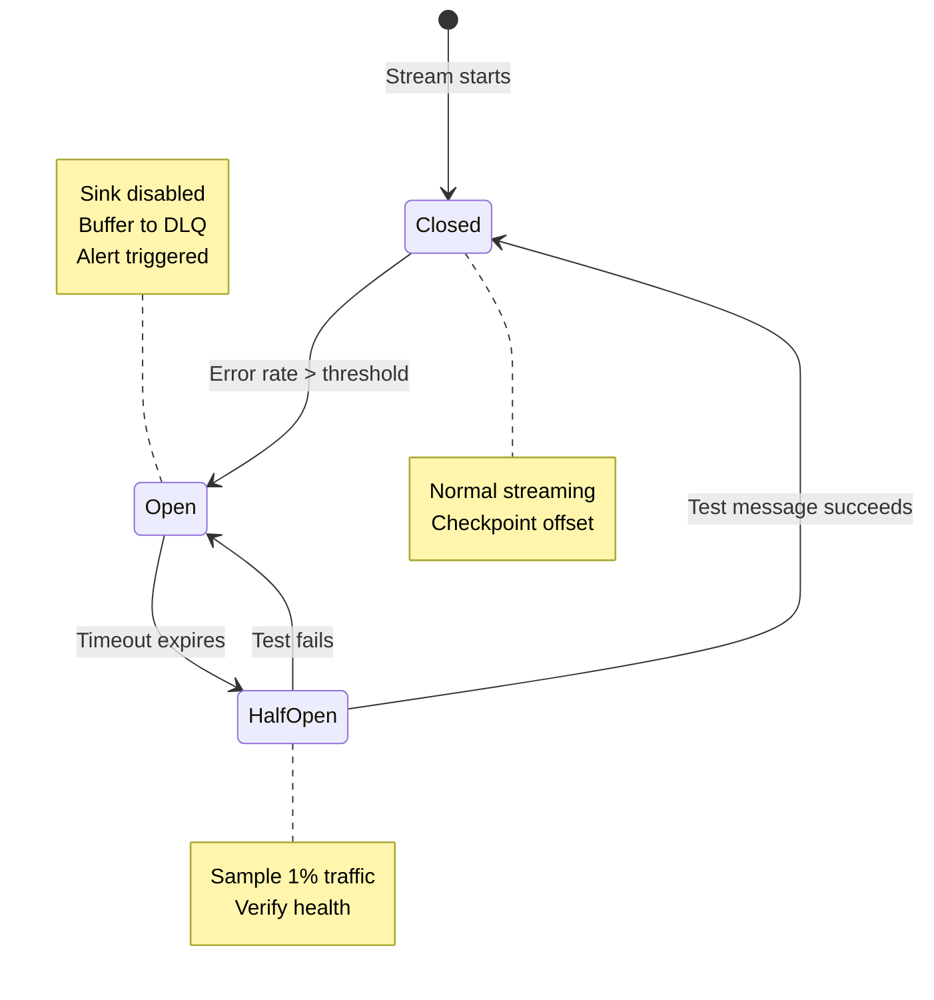
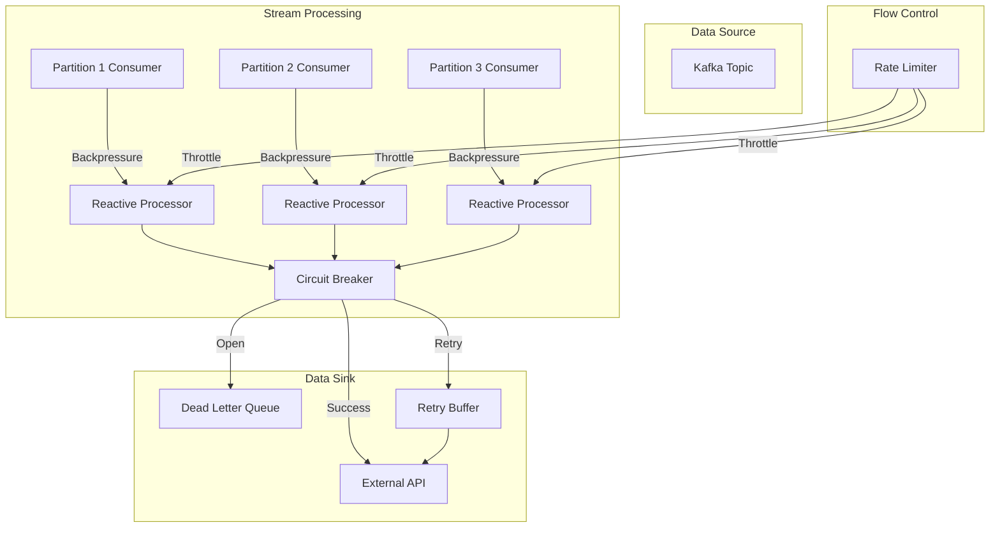

# Reactive Systems: RSockets, Backpressure, Flow Control & Circuit Breakers in Streaming

## 1. Mục tiêu của Task

Tìm hiểu bản chất của **Reactive Systems** trong ngữ cảnh streaming, tập trung vào:
- **RSockets**: Protocol bi-directional streaming hiệu suất cao
- **Backpressure**: Cơ chế kiểm soát khi producer nhanh hơn consumer
- **Flow Control**: Quản lý tốc độ và lưu lượng dữ liệu
- **Circuit Breakers**: Pattern resilience áp dụng trong streaming pipelines

> **Tại sao quan trọng?** Trong hệ thống streaming, sự không đối xứng giữa tốc độ sản xuất và tiêu thụ là nguyên nhân hàng đầu gây sập hệ thống. Reactive Streams giải quyết vấn đề này ở tầng kiến trúc, không chỉ ở mức implementation.

---

## 2. Bản chất và Cơ chế Hoạt động

### 2.1 RSockets - Protocol cho Reactive Communication

#### Bản chất

RSocket không chỉ là một protocol network - nó là **semantic contract** giữa hai bên giao tiếp:

```
┌─────────────────────────────────────────────────────────────┐
│                    RSOCKET SEMANTICS                        │
├─────────────────────────────────────────────────────────────┤
│  REQUEST/RESPONSE    │  Mô hình truyền thống, nhưng async   │
│  REQUEST/STREAM      │  Server trả về stream vô hạn          │
│  FIRE_AND_FORGET     │  Không cần acknowledgment             │
│  CHANNEL             │  Bi-directional streaming             │
└─────────────────────────────────────────────────────────────┘
```

**Tại sao cần RSocket?**

HTTP/REST và gRPC đều có vấn đề cơ bản: **request-response semantics** bắt buộc. Khi client cần streaming dữ liệu thức thờ từ server:
- HTTP: Polling (waste resource) hoặc WebSocket (stateful, phức tạp quản lý)
- gRPC: Streaming support nhưng HTTP/2 based, backpressure implementation phụ thuộc vào framework

RSocket giải quyết ở tầng protocol:

| Feature | HTTP/1.1 | HTTP/2 | gRPC | WebSocket | RSocket |
|---------|----------|--------|------|-----------|---------|
| Multiplexing | ❌ | ✅ | ✅ | ❌ | ✅ |
| Bi-directional | ❌ | ❌ | ✅ | ✅ | ✅ |
| Flow Control (native) | ❌ | ✅ (HTTP level) | ⚠️ (framework) | ❌ | ✅ (message level) |
| Connection Resumption | ❌ | ❌ | ❌ | ❌ | ✅ |
| Protocol Agnostic Payload | ❌ | ❌ | ❌ (Protobuf) | ✅ | ✅ |
| Reactive Streams Semantics | ❌ | ❌ | ⚠️ | ❌ | ✅ |

#### Cơ chế hoạt động

```mermaid
sequenceDiagram
    participant C as Client
    participant S as Server
    participant L as Lease Manager
    
    Note over C,S: Connection Establishment
    C->>S: SETUP (metadata mime-type, data mime-type)
    S->>C: READY
    
    Note over C,S: REQUEST_STREAM với Backpressure
    C->>S: REQUEST_STREAM(n=10)
    Note right of C: Yêu cầu tối đa 10 items
    
    loop Server Stream
        S->>C: PAYLOAD (1)
        S->>C: PAYLOAD (2)
        ...
        S->>C: PAYLOAD (10)
    end
    
    C->>S: REQUEST_N(n=5)
    Note right of C: Sẵn sàng nhận thêm 5 items
    
    S->>C: PAYLOAD (11)
    S->>C: PAYLOAD (12)
    ...
    
    Note over L: Lease-based Flow Control
    S->>C: LEASE (ttl=1000, requests=3)
    Note right of S: Server chỉ chấp nhận 3 requests trong 1s
```

**Key Mechanisms:**

1. **Request-N Semantics**: Client chủ động báo cho server biết có thể nhận bao nhiêu items tiếp theo. Đây là **pull-based backpressure** - consumer điều khiển tốc độ.

2. **Lease Semantics**: Server có thể giới hạn số request mà client được phép gửi trong một timeframe. Đây là **push-based throttling** - producer điều khiển tốc độ.

3. **Connection Resumption**: Khi connection drop, cả hai bên có thể resume từ điểm disconnect mà không mất dữ liệu. Critical cho mobile/long-lived connections.

---

### 2.2 Backpressure - Cơ chế Sinh Tồn của Streaming

#### Bản chất vấn đề

```
PRODUCER RATE > CONSUMER RATE = SYSTEM FAILURE

Không có backpressure:
┌─────────────┐     10,000 msg/s    ┌─────────────┐
│   Kafka     │ ──────────────────> │  Consumer   │
│  Partition  │                     │  (100 msg/s)│
└─────────────┘                     └─────────────┘
                                          │
                                          ▼
                                    OUT OF MEMORY
                                    GC OVERHEAD
                                    SYSTEM CRASH

Có backpressure:
┌─────────────┐     100 msg/s      ┌─────────────┐
│   Kafka     │ <───────────────── │  Consumer   │
│  Partition  │  (điều chỉnh tốc độ)│  (100 msg/s)│
└─────────────┘                    └─────────────┘
       │                                  │
       └──────── STABLE SYSTEM ──────────┘
```

#### Reactive Streams Specification

Java Flow API (Java 9+) và Reactive Streams định nghĩa 4 interfaces:

| Interface | Vai trò | Phương thức quan trọng |
|-----------|---------|----------------------|
| `Publisher<T>` | Sản xuất dữ liệu | `subscribe(Subscriber)` |
| `Subscriber<T>` | Tiêu thụ dữ liệu | `onSubscribe()`, `onNext()`, `onError()`, `onComplete()` |
| `Subscription` | Kết nối P & S | `request(n)`, `cancel()` |
| `Processor<T,R>` | Vừa P vừa S | Kế thừa cả hai |

**Signal Flow:**

```
Publisher                           Subscriber
    │                                   │
    │────── onSubscribe(Subscription) ──>│
    │                                   │
    │<─────────── request(10) ──────────│  ← Consumer yêu cầu 10 items
    │                                   │
    │─────────── onNext(data) ─────────>│
    │─────────── onNext(data) ─────────>│  ← Push 10 items
    │              ...                  │
    │                                   │
    │<─────────── request(10) ──────────│  ← Sẵn sàng nhận tiếp
    │                                   │
    │        (hoặc cancel())            │  ← Hoặc hủy subscription
```

> **Điểm then chốt**: `request(n)` là signal DUY NHẤT cho phép Publisher push data. Không có request, không có data. Đây là **cooperative backpressure**.

#### Triển khai trong Java 21+

Java 21 giới thiệu **Virtual Threads** và cải tiến Structured Concurrency, nhưng Reactive Streams vẫn giữ nguyên giá trị:

| Approach | Thread Model | Memory | Use Case |
|----------|-------------|--------|----------|
| Virtual Threads + Blocking | Platform thread per task | High (stack) | Traditional request-response |
| Reactive Streams | Event loop, non-blocking | Low | High-throughput streaming |
| Structured Concurrency | Scoped tasks | Medium | Parallel decomposition |

> **Quan trọng**: Virtual threads giải quyết blocking problem, nhưng không thay thế backpressure. Bạn vẫn cần reactive streams khi consumer chậm hơn producer.

---

### 2.3 Flow Control - Quản lý Lưu lượng

#### Các chiến lược Flow Control

```
┌────────────────────────────────────────────────────────────────┐
│                    FLOW CONTROL STRATEGIES                     │
├────────────────────────────────────────────────────────────────┤
│                                                                │
│  1. THROTTLE (Giảm tốc producer)                               │
│     └─> Drop messages, Buffer, Sample                          │
│                                                                │
│  2. DEBOUNCE/THROTTLE FIRST                                    │
│     └─> Chỉ lấy message đầu tiên trong time window             │
│                                                                │
│  3. BUFFER (with overflow strategy)                            │
│     └─> Drop oldest, Drop newest, Drop all, Backpressure       │
│                                                                │
│  4. CONFLATE                                                   │
│     └─> Luôn giữ latest value, drop intermediates              │
│                                                                │
│  5. BACKPRESSURE (cooperative)                                 │
│     └─> Consumer điều khiển tốc độ producer                    │
│                                                                │
└────────────────────────────────────────────────────────────────┘
```

**So sánh chi tiết:**

| Strategy | Mất dữ liệu | Độ phức tạp | Use Case |
|----------|------------|-------------|----------|
| **Drop** | ✅ Có | Thấp | Metrics, monitoring (latest is enough) |
| **Buffer** | ✅ Nếu full | Trung bình | Bursty traffic smoothing |
| **Conflate** | ✅ Có | Thấp | Real-time dashboards, sensor data |
| **Backpressure** | ❌ Không | Cao | Financial transactions, audit logs |

#### Burst Handling Pattern

```
Bursty Producer ──> Buffer ──> Rate Limiter ──> Steady Consumer
                    (1000)        (100/s)           (100/s)
                     
Khi burst vượt 1000: 
  - Strategy: Drop oldest (keep latest)
  - Hoặc: Scale consumer (horizontal)
  - Hoặc: Backpressure upstream
```

---

### 2.4 Circuit Breakers trong Streaming Context

#### Tại sao Circuit Breaker khác trong Streaming?

Trong request-response, Circuit Breaker đơn giản: open → reject, closed → allow, half-open → test.

Trong streaming, complexity tăng vì:
- **Stateful operations**: Windowing, aggregation cần maintain state
- **Partial failures**: Một partition fail không nên dừng toàn bộ stream
- **Replay capability**: Cần biết restart từ đâu



#### Triển khai với Kafka Streams

| Component | Vai trò | Implementation |
|-----------|---------|---------------|
| **Circuit Breaker** | Bảo vệ external calls | Resilience4j, custom |
| **Dead Letter Queue** | Lưu failed messages | Kafka topic `*.DLQ` |
| **Retry with Backoff** | Transient error recovery | Exponential backoff |
| **State Store** | Maintain windowed state | RocksDB, changelog topics |

---

## 3. Kiến trúc và Luồng xử lý

### 3.1 End-to-End Reactive Pipeline



### 3.2 Backpressure Flow

```
┌─────────────────────────────────────────────────────────────────┐
│                      BACKPRESSURE CHAIN                         │
├─────────────────────────────────────────────────────────────────┤
│                                                                 │
│  ┌─────────────┐    ┌─────────────┐    ┌─────────────┐         │
│  │   Kafka     │    │   Reactive  │    │   External  │         │
│  │  Consumer   │───>│   Streams   │───>│     API     │         │
│  │             │    │             │    │             │         │
│  │ max.poll    │    │ bufferSize  │    │  timeout    │         │
│  │ .records    │    │ concurrency │    │  circuit    │         │
│  │             │    │             │    │  breaker    │         │
│  └─────────────┘    └─────────────┘    └─────────────┘         │
│         │                  │                  │                 │
│         │                  │                  │                 │
│         ▼                  ▼                  ▼                 │
│    ┌──────────────────────────────────────────────────┐        │
│    │           BACKPRESSURE PROPAGATION               │        │
│    │  API slow ──> Stream buffer full ──> Pause poll  │        │
│    │         (Kafka consumer stops fetching)           │        │
│    └──────────────────────────────────────────────────┘        │
│                                                                 │
└─────────────────────────────────────────────────────────────────┘
```

---

## 4. So sánh Các Giải pháp

### 4.1 Reactive Libraries cho Java

| Library | Maturity | Learning Curve | Java 21+ Support | Best For |
|---------|----------|---------------|------------------|----------|
| **Project Reactor** | ⭐⭐⭐⭐⭐ | Medium | Excellent | Spring ecosystem |
| **RxJava** | ⭐⭐⭐⭐⭐ | High | Good | Android, legacy systems |
| **Akka Streams** | ⭐⭐⭐⭐ | High | Good | Complex workflows |
| **SmallRye Mutiny** | ⭐⭐⭐ | Low | Excellent | Quarkus, cloud-native |
| **JDK Flow** | ⭐⭐⭐ | Low | Native | Interoperability |

### 4.2 Streaming Platforms với Native Backpressure

| Platform | Backpressure Mechanism | Guarantee | Latency |
|----------|----------------------|-----------|---------|
| **Apache Kafka** | Consumer-controlled fetch | At-least-once | ms |
| **Pulsar** | Dispatch throttling | Exactly-once | ms |
| **Flink** | Credit-based flow control | Exactly-once | sub-ms |
| **Kafka Streams** | Buffer + commit sync | At-least-once | ms |

### 4.3 RSocket Implementations

| Implementation | Transport | Features |
|---------------|-----------|----------|
| **rsocket-java** | TCP, WebSocket, Aeron | Full spec |
| **rsocket-js** | WebSocket | Browser support |
| **rsocket-go** | TCP | Native Go interop |
| **Spring RSocket** | TCP, WebSocket | Spring integration |

---

## 5. Rủi ro, Anti-patterns và Lỗi thường gặp

### 5.1 Các Anti-pattern Nguy hiểm

#### ❌ Ignoring Backpressure

```java
// SAI: Subscribe mà không xử lý backpressure
flux.subscribe(data -> process(data)); 
// Nếu process chậm, memory sẽ overflow
```

#### ❌ Blocking trong Reactive Chain

```java
// SAI: Block trong reactive operator
flux.map(data -> blockingHttpCall(data))  // Làm chết thread event loop
    .subscribe();

// ĐÚNG: Non-blocking hoặc offload to bounded elastic
flux.flatMap(data -> Mono.fromCallable(() -> blockingHttpCall(data))
                          .subscribeOn(Schedulers.boundedElastic()))
    .subscribe();
```

#### ❌ Unbounded Buffers

```java
// SAI: Buffer không giới hạn
flux.buffer()  // Không có limit, OOM risk
    .subscribe();

// ĐÚNG: Bounded buffer với strategy
flux.bufferTimeout(100, Duration.ofSeconds(1))  // Max 100 items hoặc 1s
    .onBackpressureBuffer(1000, BufferOverflowStrategy.DROP_OLDEST)
    .subscribe();
```

### 5.2 Production Pitfalls

| Pitfall | Triệu chứng | Giải pháp |
|---------|------------|-----------|
| **Silent Backpressure** | Consumer chậm, không thấy lỗi nhưng lag tăng | Monitoring: track consumer lag, buffer fill rate |
| **Circuit Breaker Thrashing** | CB liên tục open/closed | Tăng timeout, điều chỉnh threshold, exponential backoff |
| **Head-of-line Blocking** | Một slow message làm chận cả batch | Use multiple consumers, partition by key |
| **Checkpoint Overhead** | Commit quá thường xuyên làm giảm throughput | Tune commit interval, use transactional batch |

### 5.3 Edge Cases

```
1. SLOW CONSUMER FAST PRODUCER
   → Backpressure hoạt động tốt nếu consumer chủ động request
   → Nếu producer ignore backpressure: memory leak
   
2. NETWORK PARTITION
   → RSocket connection resumption cứu nguy
   → Nếu không có: message loss hoặc duplicate
   
3. BURSTS VƯỢT BUFFER
   → Phải chọn: drop hoặc block
   → Không có giải pháp "magic" - chỉ có trade-off
```

---

## 6. Khuyến nghị Thực chiến trong Production

### 6.1 Monitoring Checklist

| Metric | Alert Threshold | Ý nghĩa |
|--------|----------------|---------|
| `consumer_lag` | > 1000 messages | Consumer không kịp xử lý |
| `buffer_utilization` | > 80% | Sắp đạt giới hạn buffer |
| `circuit_breaker_state` | Open | External service failure |
| `backpressure_events` | > 10/min | Có vấn đề về flow |
| `request_latency_p99` | > SLA | Performance degradation |

### 6.2 Configuration Patterns

```yaml
# Kafka Consumer với Backpressure tối ưu
kafka:
  consumer:
    max.poll.records: 500          # Giới hạn batch size
    fetch.max.wait.ms: 500         # Max wait nếu không đủ records
    fetch.min.bytes: 1             # Fetch ngay khi có data
    max.poll.interval.ms: 300000   # Timeout nếu processing quá lâu
    
# Reactive Streams Buffer
reactor:
  buffer:
    size: 10000                    # Bounded buffer
    overflow-strategy: DROP_OLDEST # Giữ latest
    
# Circuit Breaker
resilience4j:
  circuitbreaker:
    configs:
      default:
        slidingWindowSize: 100
        failureRateThreshold: 50
        waitDurationInOpenState: 30s
        permittedNumberOfCallsInHalfOpenState: 10
```

### 6.3 Testing Strategy

| Test Type | Tool | Mục tiêu |
|-----------|------|----------|
| Load Test | Gatling, K6 | Xác định breaking point |
| Chaos Test | Chaos Monkey | Verify circuit breaker, recovery |
| Backpressure Test | Custom | Simulate slow consumer |
| Replay Test | Kafka replay | Verify exactly-once, no loss |

---

## 7. Kết luận

### Bản chất cốt lõi

1. **Backpressure không phải feature - là requirement**: Streaming system không có backpressure sẽ sập dưới load.

2. **RSocket giải quyết bài toán giao tiếp reactive ở tầng protocol**: Không phụ thuộc framework, hỗ trợ natively connection resumption và flow control.

3. **Circuit Breaker trong streaming phức tạp hơn request-response**: Cần xử lý state, partial failure, và replay capability.

4. **Flow Control = Trade-off**: Không có strategy hoàn hảo - chọn dựa trên business requirement (lossy vs lossless, latency vs throughput).

### Quyết định kiến trúc

| Scenario | Khuyến nghị |
|----------|-------------|
| Microservices giao tiếp real-time | RSocket + Project Reactor |
| High-throughput event processing | Kafka + Kafka Streams + Backpressure config |
| Mobile/Web socket connections | RSocket WebSocket transport |
| Financial/audit (no loss allowed) | Backpressure + bounded buffer + circuit breaker + DLQ |
| Metrics/telemetry (loss acceptable) | Drop strategy + sampling |

> **Takeaway**: Reactive Systems không phải silver bullet. Nó giải quyết một bài toán cụ thể: **asynchronous data flow với tốc độ không đồng nhất**. Nếu system của bạn không có vấn đề này, đừng thêm complexity không cần thiết.

---

## 8. References

- [Reactive Streams Specification](https://www.reactive-streams.org/)
- [RSocket Protocol](https://rsocket.io/)
- [Project Reactor Documentation](https://projectreactor.io/docs)
- [Kafka Consumer Backpressure](https://kafka.apache.org/documentation/)
- [Resilience4j Circuit Breaker](https://resilience4j.readme.io/)
- Java 21 Virtual Threads vs Reactive Streams comparisons
