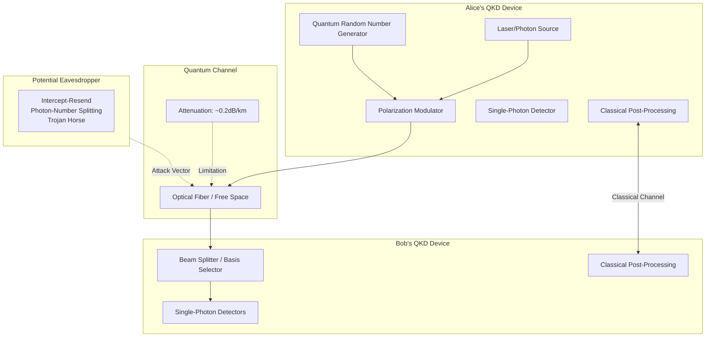

# Quantum Key Distribution: BB84 Protocol & Practical Realities

**Mục tiêu nghiên cứu:** Phân tích bản chất cơ chế của Quantum Key Distribution (QKD), tập trung vào giao thức BB84 - từ nguyên lý vật lý cơ bản đến triển khai thực tế và các hạn chế intrinsic.

---

## 1. Mục tiêu của Task

Hiểu sâu về:
- **BB84 Protocol**: Cơ chế quantum-level đảm bảo tính bảo mật thông tin
- **Practical Implementation**: Các hệ thống QKD thương mại và kỹ thuật triển khai
- **Limitations**: Rào cản vật lý, kỹ thuật và lý thuyết thông tin

---

## 2. Bản Chất và Cơ Chế Hoạt Động

### 2.1 Nguyên Lý Cơ Bản: Quantum Mechanics là Security Foundation

QKD không dựa trên độ phức tạp tính toán (như RSA, ECC) mà dựa trên **các định luật vật lý cơ bản**:

| Nguyên lý | Hệ quả bảo mật |
|-----------|---------------|
| **No-Cloning Theorem** | Không thể sao chép quantum state mà không biết basis → Eavesdropper không thể intercept-and-resend |
| **Measurement Collapse** | Measurement làm sụp đổ superposition → Eavesdropper tự để lại dấu vết |
| **Heisenberg Uncertainty** | Không thể đo chính xác cùng lúc non-commuting observables → Thông tin bị giới hạn bởi vật lý |

> **Quan trọng**: QKD không "mã hóa" dữ liệu. Nó tạo ra **shared secret key** mà bất kỳ interception nào đều bị phát hiện. Sau đó key này dùng cho One-Time Pad (OTP) hoặc symmetric encryption (AES).

### 2.2 BB84 Protocol Deep Dive

#### 2.2.1 Encoding Scheme

Alice (sender) mã hóa mỗi bit bằng **photon polarization** theo 1 trong 2 basis:

**Rectilinear Basis (+):**
- `0°` = bit **0**
- `90°` = bit **1**

**Diagonal Basis (×):**
- `45°` = bit **0**  
- `135°` = bit **1**

```
Bit to Encode:    0     1     0     1     1     0     1     0
Alice's Basis:    +     ×     +     +     ×     ×     +     ×
Photon State:    0°   135°    0°    90°   135°   45°   90°   45°
                                    ↓
                         Quantum Channel (optical fiber / free space)
                                    ↓
Bob's Basis:      ×     ×     +     ×     +     ×     +     +
Bob's Result:     ?     1     0     ?     ?     0     1     ?
```

**Tại sao có "?"?**

Khi Bob đo bằng basis khác Alice:
- Photon là superposition trong basis của Bob
- Measurement có 50% xác suất ra 0, 50% ra 1
- **Hoàn toàn ngẫu nhiên, không thể đoán trước**

#### 2.2.2 Sifting Phase

Sau transmission, Alice và Bob **publicly compare basis** (không tiết lộ bit value):

| Round | Alice Basis | Bob Basis | Match? | Alice Bit | Bob Bit |
|-------|-------------|-----------|--------|-----------|---------|
| 1 | + | × | ❌ | Discard | Discard |
| 2 | × | × | ✅ | 1 | 1 |
| 3 | + | + | ✅ | 0 | 0 |
| 4 | + | × | ❌ | Discard | Discard |

**Expected yield:** ~50% bits được giữ lại (khi basis match).

#### 2.2.3 Error Estimation & Privacy Amplification

**Nếu không có eavesdropper (Eve):**
- Bob đo đúng khi basis match → Error rate ≈ 0%

**Nếu Eve intercept:**
1. Eve đo photon bằng basis ngẫu nhiên
2. 50% trường hợp Eve chọn sai basis → photon bị collapse
3. Eve gửi lại photon mới theo kết quả đo của mình
4. 50% trường hợp đó, Bob nhận sai bit → **25% error rate**

> **Security Threshold**: Nếu error rate > 11% (theo Shor-Preskill proof), key bị compromised.

**Privacy Amplification:**
- Sử dụng Universal Hash Functions để rút gọn key
- N bit đầu vào → M bit đầu ra (M < N)
- Information leaked cho Eve → negligible

```
Raw Key: 100110101001110101100101... (1000 bits)
         ↓ Error Estimation (reveal ~100 bits)
         ↓ Privacy Amplification
Final Key: 7a3f9e2b8c... (400 bits, information-theoretically secure)
```

### 2.3 So Sánh với Post-Quantum Cryptography (PQC)

| Aspect | QKD (BB84) | PQC (Lattice-based) |
|--------|-----------|---------------------|
| **Security Basis** | Laws of Physics | Computational hardness (worst-case) |
| **Key Distribution** | Physical channel | Classical channel (public key) |
| **Authentication** | Cần pre-shared key/classical channel | Digital signatures |
| **Distance** | ~100-400km (fiber) | Unlimited |
| **Rate** | Mbps (current gen) | Gbps+ |
| **Infrastructure** | Specialized hardware | Software-only |
| **Quantum Resistance** | Information-theoretic | Computational |

> **Kết luận**: QKD và PQC không phải đối thủ mà **complementary**. PQC cho authentication và key exchange không cần hardware đặc biệt. QKD cho ultra-secure key distribution khi infrastructure cho phép.

---

## 3. Kiến Trúc Hệ Thống QKD

### 3.1 Component Architecture



### 3.2 Hardware Components Deep Dive

#### Single-Photon Detectors (SPDs)

| Type | Operating Temp | Efficiency | Dark Count | Use Case |
|------|---------------|------------|------------|----------|
| **InGaAs APD** | -30°C to -60°C | 20-30% | 100-1000 Hz | Fiber telecom (1550nm) |
| **Superconducting Nanowire (SNSPD)** | ~2K (liquid He) | >90% | <1 Hz | High-performance |
| **Silicon SPAD** | Room temp | 40-50% | 100-10000 Hz | Visible/free space |

> **Trade-off**: SNSPD có efficiency cao nhất nhưng yêu cầu cryogenic cooling → Cost và operational complexity tăng đáng kể.

#### Quantum Random Number Generators (QRNGs)

Khác với PRNGs, QRNGs dùng **quantum mechanical processes**:
- Photon arrival times (Poisson process)
- Phase noise in spontaneous emission
- Vacuum fluctuations (homodyne detection)

```
Entropy Source → Quantum Measurement → Random Bitstream
      ↓                ↓                    ↓
   Photon path    Beam splitter        Unbiased bits
   superposition  (50/50 chance)
```

**Requirement**: >1 Gbps generation rate cho high-speed QKD.

---

## 4. Triển Khai Thực Tế

### 4.1 Commercial QKD Systems

| Vendor | Product | Distance | Rate | Key Features |
|--------|---------|----------|------|--------------|
| **ID Quantique (Swiss)** | Cerberis | 150km | 1-2 Mbps | First commercial (2007) |
| **Toshiba (Japan)** | QKD System | 600km (with dual-band) | 10 Mbps | Multiplexing with data |
| **QuantumCTek (China)** | QKD-PHA | 100km | 80 kbps | Satellite integration |
| **MagiQ Technologies (US)** | Navajo | 120km | N/A | Government/military focus |

### 4.2 Deployment Patterns

#### 4.2.1 Point-to-Point

```
[Alice HQ] ←───QKD───→ [Bob Branch Office]
     ↓                      ↓
[Encryptor]              [Decryptor]
     ↑                      ↑
Shared key enables AES-256 encryption of bulk data
```

**Use case**: Inter-datacenter replication, government secure comms.

#### 4.2.2 QKD Networks (Trusted Node Architecture)

```
[Alice] ←QKD→ [Node A] ←QKD→ [Node B] ←QKD→ [Bob]
                  ↓              ↓
             Key stored    Key stored
             temporarily   temporarily
```

> **Critical Risk**: Trusted nodes có thể bị compromise. Key bị decrypt tại mỗi node.

#### 4.2.3 Quantum Satellite Links

**Micius Satellite (China, 2016):**
- Distance: 1200km (satellite-to-ground)
- Basis: Decoy-state BB84
- Achievement: Intercontinental QKD (Vienna-Beijing)

**Principle**: Free-space có attenuation thấp hơn fiber ở khoảng cách dài.

### 4.3 Protocol Variants & Improvements

| Variant | Improvement | Mechanism |
|---------|-------------|-----------|
| **Decoy-State BB84** | PNS attack resistance | Gửi pulses với different intensities |
| **SARG04** | Higher tolerance | Different classical sifting |
| **CV-QKD** | Higher rates | Continuous variables (quadratures) |
| **Twin-Field QKD** | Extended distance | Single-photon interference |

**Decoy-State BB84** quan trọng nhất:
- Vấn đề: Imperfect single-photon sources → Multi-photon pulses có thể bị PNS attack
- Giải pháp: Randomly mix "signal" và "decoy" pulses với different intensities
- Eve không biết đâu là decoy → Attack bị phát hiện qua yield analysis

---

## 5. Rủi Ro, Anti-Patterns và Lỗi Thường Gặp

### 5.1 Implementation Attacks (Side-Channel)

> **BB84 chỉ an toàn về lý thuyết nếu implementation hoàn hảo. Thực tế không như vậy.**

#### 5.1.1 Photon-Number Splitting (PNS) Attack

**Scenario:**
- Source phát ra multi-photon pulse (imperfect)
- Eve split 1 photon, để phần còn lại đến Bob
- Eve đo photon lấy được sau khi basis được công bố

**Impact:** Information leakage không bị phát hiện.

**Mitigation:** Decoy-state protocol (Ma et al., 2005)

#### 5.1.2 Trojan Horse Attack

**Mechanism:**
1. Eve shines bright light vào Bob's receiver
2. Light reflect back với encoded information
3. Eve decode từ reflected signal

**Mitigation:** Optical isolators, fiber filters, power monitoring

#### 5.1.3 Detector Blinding & Time-Shift Attacks

| Attack | Mechanism | Detection |
|--------|-----------|-----------|
| **Blinding** | Eve shines CW laser → Detector always "click" → Control which click | Monitor optical power |
| **Time-Shift** | Manipulate photon timing → Exploit detector efficiency mismatch | Time jitter analysis |
| **After-Pulse** | Exploit detector afterpulsing → Information leakage | Dead time optimization |

### 5.2 Architectural Anti-Patterns

#### ❌ Anti-Pattern 1: "QKD = Unbreakable Encryption"

**Reality:**
- QKD chỉ bảo vệ **key distribution**
- Endpoints vẫn vulnerable
- Implementation flaws phổ biến hơn lý thuyết attacks

#### ❌ Anti-Pattern 2: Ignoring Classical Authentication

**Vấn đề:** BB84 yêu cầu authenticated classical channel.

**Nếu không authenticated:** Eve có thể MITM cả quantum và classical channel → Complete compromise.

**Solution:** Pre-shared symmetric key hoặc PQC signatures cho authentication.

#### ❌ Anti-Pattern 3: No Side-Channel Protection

Physical security requirements:
- Tamper-evident enclosures
- Side-channel analysis (power, EM, timing)
- Supply chain security

### 5.3 Production Pitfalls

```
❌ Pitfall: Using QKD key directly for bulk encryption
✅ Best Practice: QKD rotates AES-256 keys frequently

❌ Pitfall: Not monitoring quantum bit error rate (QBER)  
✅ Best Practice: Real-time QBER monitoring with alerts

❌ Pitfall: Single point of failure in QKD devices
✅ Best Practice: Redundant QKD links + failover
```

---

## 6. Khuyến Nghị Thực Chiến trong Production

### 6.1 When to Use QKD

| Use Case | Recommendation | Rationale |
|----------|---------------|-----------|
| **Long-term data protection (>20 years)** | ✅ Strong candidate | Harvest-now-decrypt-later threat |
| **Government/Military classified** | ✅ Industry standard | Regulatory compliance |
| **Financial trading networks** | ⚠️ Evaluate cost/benefit | Latency sensitivity |
| **General enterprise encryption** | ❌ Overkill | PQC sufficient |
| **Cloud data centers** | ⚠️ Infrastructure dependent | Distance limitations |

### 6.2 Hybrid Architecture Recommendation

```
┌─────────────────────────────────────────────────────────────┐
│                    Security Architecture                     │
├─────────────────────────────────────────────────────────────┤
│                                                             │
│  Authentication Layer:  PQC Signatures (Dilithium/Falcon)   │
│                              ↓                              │
│  Key Exchange:         QKD + ECDH (hybrid)                 │
│                              ↓                              │
│  Session Encryption:   AES-256-GCM                         │
│                              ↓                              │
│  Data Integrity:       SHA-3 / BLAKE3                      │
│                                                             │
└─────────────────────────────────────────────────────────────┘
```

### 6.3 Monitoring & Observability

**Critical Metrics:**

| Metric | Alert Threshold | Action |
|--------|-----------------|--------|
| **QBER** | > 5% | Investigate potential eavesdropping |
| **Key Rate** | < 10% baseline | Check fiber/link quality |
| **Detector Dark Count** | > 10× baseline | Cooling/power issue |
| **Authentication Failures** | Any | Immediate security review |

**Key Performance Indicators:**
```
Secret Key Rate (SKR) = Raw Key Rate × Sifting Efficiency 
                        × Error Correction Efficiency
                        × Privacy Amplification Ratio

Example: 1 Mbps raw → ~100 kbps final secret key
```

### 6.4 Operational Best Practices

1. **Regular Calibration**: SPDs, modulators, timing synchronization
2. **Environmental Control**: Temperature, vibration isolation
3. **Backup Authentication Keys**: For classical channel authentication
4. **Fail-Safe Mode**: Stop key generation if QBER exceeds threshold
5. **Audit Logs**: All key management operations, access control

---

## 7. Kết Luận

### Bản Chất Cốt Lõi

**QKD/BB84 là một technological marvel nhưng không phải silver bullet:**

1. **Security promise**: Information-theoretic security dựa trên quantum mechanics - không thể phá bằng computational power, ngay cả với quantum computers.

2. **Practical reality**: Implementation đầy rẫy side-channels, distance limitations, và cost cao.

3. **Optimal use case**: Bảo vệ long-term secrets chống lại "harvest now, decrypt later" attacks, đặc biệt trong government/military contexts.

### Trade-off Quan Trọng Nhất

```
Security (Information-theoretic) ←→ Practicality (Distance, Cost, Rate)
         ↑                                             ↑
    BB84 protocol                            Real-world implementation
```

### Rủi Ro Lớn Nhất

**Implementation attacks vượt trội so với theoretical breaks.** Một QKD system với detector side-channels dễ bị hack hơn nhiều so với một PQC system properly implemented.

### Tương Lai

- **Chip-scale QKD**: Integration giảm cost, tăng adoption
- **Quantum Repeaters**: Solve distance limitation (still 10+ years away)
- **Standardization**: ETSI, ITU-T đang phát triển QKD standards
- **Hybrid approach**: QKD + PQC là architecture ổn định nhất cho next decade

---

## References

1. Bennett, C. H., & Brassard, G. (1984). "Quantum cryptography: Public key distribution and coin tossing." *Proc. IEEE Int. Conf. on Computers, Systems, and Signal Processing*.

2. Shor, P. W., & Preskill, J. (2000). "Simple proof of security of the BB84 quantum key distribution protocol." *Physical Review Letters*, 85(2), 441.

3. Scarani, V., et al. (2009). "The security of practical quantum key distribution." *Reviews of Modern Physics*, 81(3), 1301.

4. Lo, H. K., et al. (2005). "Decoy state quantum key distribution." *Physical Review Letters*, 94(23), 230504.

5. Xu, F., et al. (2020). "Secure quantum key distribution with realistic devices." *Reviews of Modern Physics*, 92(2), 025002.

6. ETSI GS QKD 014 (2020). "Component characterization: Characterizing optical components for QKD systems."

---

*File generated: 2026-03-28*  
*Research Task: Phase 9 - Quantum Key Distribution*
