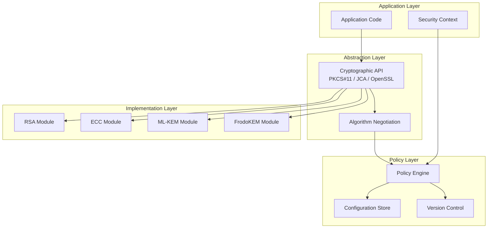
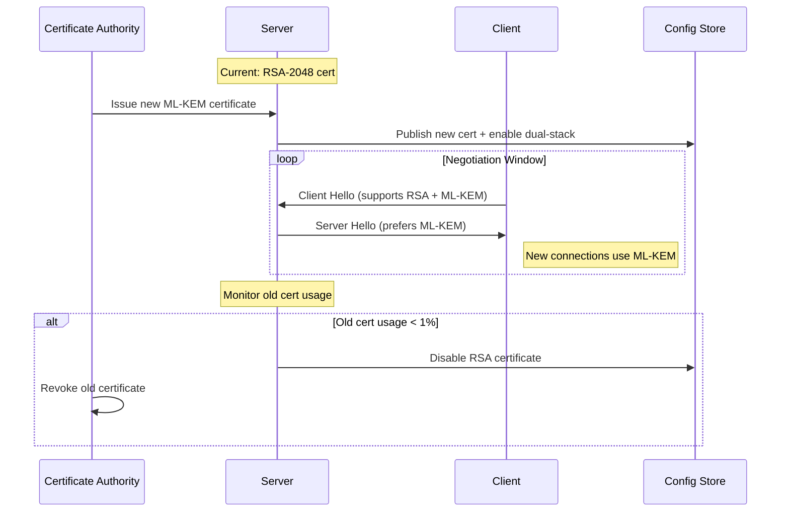

# Cryptographic Agility - Khả năng Thích ứng Mã hóa

## 1. Mục tiêu của Task

Hiểu sâu **Cryptographic Agility** (khả năng thay đổi thuật toán mã hóa mà không làm gián đoạn hệ thống) - một yêu cầu bắt buộc trong kỷ nguyên Post-Quantum và môi trường đe dọa liên tục thay đổi.

> **Bản chất vấn đề**: Không phải thuật toán nào cũng an toàn mãi mãi. RSA-1024 từng được coi là an toàn, giờ đã bị phá vỡ. Mục tiêu là xây dựng hệ thống có thể "thay đổi động cơ khi đang bay" mà không rơi.

---

## 2. Bản chất và Cơ chế Hoạt động

### 2.1 Tại sao cần Cryptographic Agility?

| Giai đoạn | Mối đe dọa | Phản ứng cần thiết |
|-----------|-----------|-------------------|
| **Harvest Now, Decrypt Later** | Kẻ tấn công thu thập dữ liệu mã hóa ngày nay | Cần chuyển sang PQC trước khi máy tính lượng tử sẵn sàng |
| **Quantum Available** | Máy tính lượng tử có thể phá RSA/ECC | Phải có quy trình chuyển đổi trong vài tuần, không phải vài năm |
| **Algorithm Broken** | Phát hiện lỗi trong thuật toán (ví dụ: Dual_EC_DRBG) | Khẩn cấp vô hiệu hóa thuật toán trên toàn hệ thống |
| **Compliance Changes** | NIST, NSA, ENISA cập nhật khuyến nghị | Cần đáp ứng nhanh mà không refactor codebase |

### 2.2 Kiến trúc Cryptographic Agility



### 2.3 Algorithm Negotiation - Cốt lõi của Agility

**Cơ chế cơ bản**: Client và Server phải thương lượng thuật toán an toàn chung mà cả hai đều hỗ trợ.

**Quy trình Negotiation:**

```
Client Hello:
  - Supported algorithms: [ML-KEM-768, Kyber-512, ECDH-P256]
  - Preferred order: ML-KEM-768 > Kyber-512 > ECDH-P256
  - Version: crypto-policy-v3.2

Server Response:
  - Selected: ML-KEM-768
  - Server version: crypto-policy-v3.2
  - Fallback allowed: true

Key Exchange:
  - Execute ML-KEM-768
  - Store algorithm info in session context
```

**Điểm then chốt**: Versioning của crypto policy phải được truyền tải trong handshake để đảm bảo compatibility.

---

## 3. Các Mô hình Triển khai

### 3.1 So sánh các Kiến trúc

| Kiến trúc | Đặc điểm | Ưu điểm | Nhược điểm | Phù hợp |
|-----------|---------|---------|-----------|---------|
| **Plugin-based** | Mỗi thuật toán là plugin độc lập | Dễ thêm/xóa thuật toán | Quản lý dependency phức tạp | Large enterprise systems |
| **Configuration-driven** | Thuật toán được chọn qua config | Không cần redeploy code | Config drift risk | Microservices |
| **Policy Engine** | Central policy server quyết định thuật toán | Consistency toàn tổ chức | Single point of failure | Financial services |
| **Hybrid Approach** | Kết hợp plugin + config + policy | Linh hoạt nhất | Complexity cao | Critical infrastructure |

### 3.2 Certificate Rotation Strategy

**Vấn đề**: Certificate gắn liền với public key algorithm. Khi thay đổi algorithm, phải rotate certificate.

**Chiến lược Rotation:**



**Các chiến lược khác:**

| Strategy | Thứ tự | Risk | Use Case |
|----------|--------|------|----------|
| **Big Bang** | Đồng loạt toàn hệ thống | Downtime nếu lỗi | Non-critical internal services |
| **Canary** | Từng nhóm server nhỏ | Monitoring phức tạp | Large scale services |
| **Blue-Green** | Switch traffic to new stack | Cần double infrastructure | Mission-critical systems |
| **Dual-Stack** | Chạy song song cả hai | Resource overhead | Zero-downtime migration |

---

## 4. Hybrid Cryptographic Schemes

### 4.1 Bản chất Hybrid Approach

**Vấn đề**: Thuật toán PQC mới (như ML-KEM, ML-DSA) chưa được "battle-tested" đầy đủ. Nếu có lỗi, hệ thống bị tấn công ngay lập tức.

**Giải pháp**: Kết hợp thuật toán classical + PQC. Bảo mật = max(classical, PQC).

```
Hybrid Key Encapsulation:
  - ECDH (X25519) tạm thời an toàn trước quantum
  + ML-KEM-768 chống quantum trong tương lai
  = Encrypted key = XOR(ECDH_shared_secret, ML-KEM_shared_secret)
```

### 4.2 Các Hybrid Schemes Chuẩn hóa

| Standard | Classical Component | PQC Component | Status |
|----------|-------------------|---------------|--------|
| **X25519Kyber768** | X25519 | ML-KEM-768 | Draft RFC (Google, Cloudflare) |
| **SecP256r1MLKEM768** | secp256r1 | ML-KEM-768 | NIST SP 800-56C rev 2 |
| **X25519Kyber768Draft00** | X25519 | Kyber-768 | TLS 1.3 draft (deprecated) |
| **Hybrid-Sig** | ECDSA/secp256r1 | ML-DSA-65 | FIPS 204 approved |

> **Lưu ý quan trọng**: Đừng implement hybrid schemes tự chế. Luôn dùng implementations đã được review và standardized.

---

## 5. Rủi ro, Anti-patterns, Lỗi thường gặp

### 5.1 Downgrade Attacks

**Kịch bản tấn công**: Attacker ép buộc client và server dùng thuật toán yếu hơn.

```
Attacker (Man-in-the-Middle):
  1. Intercept Client Hello (supports [AES-256, AES-128])
  2. Modify: Chỉ còn [AES-128]
  3. Server chọn AES-128 (vẫn "an toàn" nhưng yếu hơn)
```

**Phòng chống:**
- **Minimum Version Enforcement**: Config absolute minimum algorithm version
- **Signed Algorithm Lists**: Client Hello phải có signature để không bị modify
- **Certificate Transparency**: Log tất cả algorithm negotiation events

### 5.2 Configuration Drift

**Vấn đề**: Production chạy config khác với intended policy.

**Ví dụ thực tế:**
```yaml
# Intended Policy (Git)
crypto_policy:
  minimum_tls_version: "1.3"
  allowed_kex: ["ML-KEM-768", "X25519Kyber768"]
  
# Actual Production (drift sau 6 tháng)
crypto_policy:
  minimum_tls_version: "1.2"  # Vì "legacy system compatibility"
  allowed_kex: ["RSA", "ML-KEM-768", "X25519Kyber768"]  # "RSA vẫn work"
```

**Phòng chống:**
- Automated compliance scanning
- Policy-as-Code với drift detection
- Immutable infrastructure approach

### 5.3 Algorithm Confusion Attacks

**Vấn đề**: Attacker trick hệ thống sử dụng sai thuật toán để verify signature.

**Ví dụ nổi tiếng - JWT Algorithm Confusion:**
```
JWT Header: {"alg": "RS256", "kid": "key-1"}
Attacker sửa thành: {"alg": "HS256", "kid": "key-1"}
→ Server dùng public key (RSA) như symmetric key (HMAC)
→ Attacker có thể sign token với public key!
```

**Lessons learned cho Agility:**
- Không bao giờ trust algorithm từ input không authenticated
- Key material phải được tag với intended algorithm
- Strict algorithm whitelist enforcement

### 5.4 Hidden Dependencies

**Vấn đề**: Một thành phần trong hệ thống vẫn dùng algorithm cũ mà không ai biết.

**Ví dụ:**
```java
// Microservice A đã migrate sang ML-KEM
// Nhưng service này call Microservice B qua gRPC
// → gRPC config vẫn dùng TLS 1.2 với RSA

// Problem: Microservice A nghĩ mình an toàn, nhưng 
// traffic A→B vẫn dùng RSA
```

**Phòng chống:**
- Service mesh với uniform TLS enforcement
- Network-level cryptographic inventory
- Traffic inspection và logging

---

## 6. Khuyến nghị Thực chiến trong Production

### 6.1 Java Implementation (JCA/JCE)

**Cấu trúc Security Provider:**

```java
// Đăng ký BouncyCastle PQC provider với priority cao
Security.insertProviderAt(new BouncyCastlePQCProvider(), 1);

// Configuration-driven algorithm selection
public class CryptoPolicy {
    private final String kexAlgorithm;
    private final String signatureAlgorithm;
    private final String cipherAlgorithm;
    
    public static CryptoPolicy fromConfig(ConfigStore config) {
        return new CryptoPolicy(
            config.getString("crypto.kex.default"),      // "ML-KEM-768"
            config.getString("crypto.signature.default"), // "ML-DSA-65"
            config.getString("crypto.cipher.default")     // "AES-256-GCM"
        );
    }
}

// Runtime algorithm negotiation
public KeyExchange negotiateKex(List<String> clientSupported) {
    for (String alg : policy.getPreferredOrder()) {
        if (clientSupported.contains(alg) && 
            Security.getProvider(alg) != null) {
            return createKexInstance(alg);
        }
    }
    throw new NoCommonAlgorithmException();
}
```

**KeyStore Management cho Agility:**

```java
// KeyStore phải lưu metadata về algorithm
KeyStore.Entry entry = keyStore.getEntry("server-cert", null);
if (entry instanceof PrivateKeyEntry) {
    PrivateKey key = ((PrivateKeyEntry) entry).getPrivateKey();
    String algorithm = key.getAlgorithm(); // "ML-DSA" hoặc "EC"
    
    // Validate against current policy
    if (!policy.isAlgorithmAllowed(algorithm)) {
        throw new PolicyViolationException(
            "Algorithm " + algorithm + " no longer permitted"
        );
    }
}
```

### 6.2 Monitoring và Observability

**Metrics cần thu thập:**

```yaml
# Prometheus metrics
crypto_negotiation_total:
  labels: [algorithm, version, success]
  
crypto_policy_violation_total:
  labels: [service, requested_algorithm, policy_version]
  
crypto_certificate_expiry_timestamp:
  labels: [certificate_id, algorithm]
  
crypto_rotation_duration_seconds:
  labels: [algorithm_from, algorithm_to]
```

**Logging structure:**

```json
{
  "event": "crypto_negotiation",
  "timestamp": "2026-03-28T11:53:00Z",
  "connection_id": "conn-uuid",
  "client_version": "crypto-policy-v3.2",
  "server_version": "crypto-policy-v3.2",
  "negotiated": {
    "kex": "ML-KEM-768",
    "auth": "ML-DSA-65",
    "cipher": "AES-256-GCM"
  },
  "fallback_used": false,
  "latency_ms": 15
}
```

### 6.3 Incident Response cho Algorithm Compromise

**Runbook khi thuật toán bị phá vỡ:**

```
T+0 phút: Phát hiện CVE cho thuật toán X
T+5 phút: Update policy config: X → DENY
T+10 phút: Broadcast config update to all services
T+15 phút: Monitor connection failures
T+30 phút: Verify 100% connections use alternative algorithms
T+1 giờ: Rotate certificates sử dụng algorithm X
T+24 giờ: Root cause analysis và lessons learned
```

**Tự động hóa:**
- Automated policy updates qua config management
- Circuit breaker cho connections dùng algorithm đã ban
- Auto-rollback nếu failure rate > threshold

---

## 7. So sánh với các Giải pháp Khác

### 7.1 Cryptographic Agility vs. Crypto Agility

| Khía cạnh | Cryptographic Agility (This) | Crypto Agility (Business) |
|-----------|------------------------------|---------------------------|
| **Focus** | Technical capability | Business process |
| **Scope** | Algorithm selection/rotation | Key lifecycle management |
| **Driver** | Security threats | Compliance audits |
| **Implementation** | Code + Config | Process + Governance |

Cần cả hai: Technical agility là nền tảng, Business agility là cách tận dụng.

### 7.2 Agility vs. Formal Verification

**Trade-off:**
- **Agility**: Nhanh chóng đáp ứng threats mới, nhưng có thể giới thiệu bugs
- **Formal Verification**: Chắc chắn đúng, nhưng chậm thay đổi và expensive

**Recommendation:**
- Core cryptographic primitives: Dùng formally verified implementations (HACL*, Fiat-Crypto)
- Algorithm selection logic: Dùng agility approach với extensive testing

---

## 8. Kết luận

**Bản chất của Cryptographic Agility:**

Cryptographic Agility không phải là một feature, mà là một **architectural property**. Nó yêu cầu thiết kế abstraction layers đúng cách, policy enforcement consistent, và operational procedures để thực hiện thay đổi an toàn.

**Trade-off quan trọng nhất:**

> **Complexity vs. Survivability**: Agility thêm complexity (negotiation, versioning, multi-algorithm support), nhưng đây là chi phí bắt buộc để hệ thống sống sót qua các cryptographic transitions trong tương lai.

**Rủi ro lớn nhất:**

> **False sense of security**: Nghĩ rằng "chúng ta có thể thay đổi bất cứ lúc nào" dẫn đến việc không test quy trình thay đổi. Agility chỉ có giá trị khi đã được **practiced và validated**.

**Áp dụng đúng:**

1. **Bắt đầu với abstraction** - Đừng hardcode algorithm names
2. **Implement policy-as-code** - Config có thể audit và rollback
3. **Thực hành rotation** - Quarterly drills cho algorithm transitions
4. **Monitor continuously** - Biết chính xác algorithm nào đang được dùng ở đâu
5. **Plan for compromise** - Runbook sẵn sàng cho "cryptographic emergency"

---

## 9. Tài liệu Tham khảo

- NIST SP 800-152: A Profile for U.S. Federal Cryptographic Key Management Systems
- ENISA Guidelines on Cryptographic Agility (2024)
- RFC 9180: Hybrid Public Key Encryption (HPKE)
- Cloudflare: "Post-Quantum Cryptography: A Q&A with Cloudflare Research"
- Google: "Protecting Chrome Traffic with Hybrid Kyber KEM"
