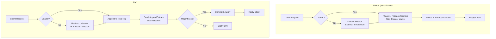
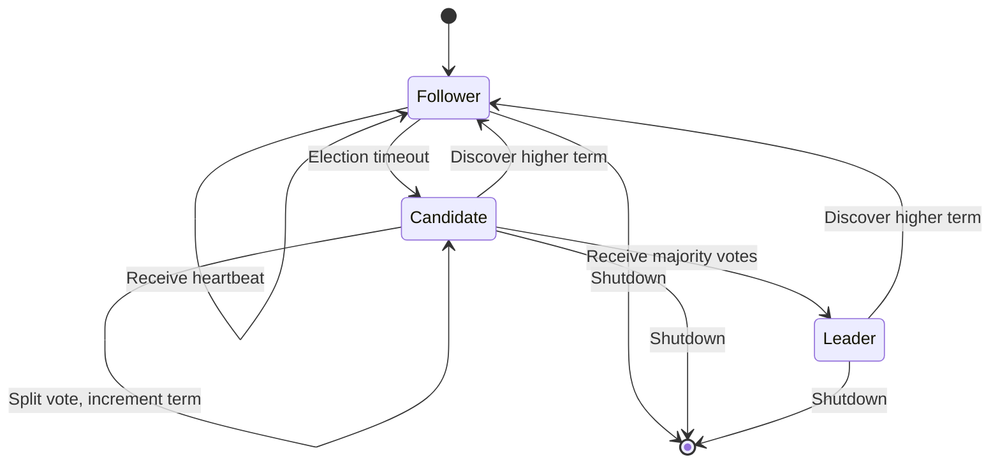

# Consensus Algorithms: Raft và Paxos

## 1. Mục tiêu của Task

Hiểu sâu bản chất các thuật toán đồng thuận (consensus algorithms) - nền tảng của mọi hệ thống phân tán có tính nhất quán cao. Phân tích cơ chế hoạt động, trade-off giữa Paxos (lý thuyết cổ điển) và Raft (thiết kế hiện đại), cùng với việc so sánh các implementation thực tế (etcd, Consul, Zookeeper).

> **Tại sao consensus quan trọng?** Trong hệ thống phân tán, node failure là điều hiển nhiên. Consensus giải quyết bài toán: *làm sao để nhiều node đồng ý về một giá trị/timeline chung khi một số node có thể fail hoặc bị partition?*

---

## 2. Bản Chất và Cơ Chế Hoạt Động

### 2.1 Bài Toán Consensus

Consensus định nghĩa một tập các điều kiện phải thỏa mãn:

| Thuộc tính | Ý nghĩa |
|------------|---------|
| **Agreement** | Mọi node đều đồng ý cùng một giá trị |
| **Validity** | Giá trị được chọn phải do một node đề xuất (không tự sinh) |
| **Termination** | Cuối cùng mọi node đều quyết định (non-faulty nodes) |

> **FLP Impossibility (1985):** Trong hệ thống bất đồng bộ với chỉ 1 node có thể crash, không tồn tại thuật toán consensus deterministic nào đảm bảo termination. Do đó, mọi implementation đều phải dùng timeouts hoặc giả định về timing.

### 2.2 Paxos: Định Lý Cổ Điển

Paxos, do Leslie Lamport đề xuất (1990, công bố 1998), là "tiêu chuẩn vàng" lý thuyết nhưng nổi tiếng khó hiểu.

#### Cơ chế hoạt động

Paxos chia các node thành 3 vai trò:
- **Proposer:** Đề xuất giá trị
- **Acceptor:** Bỏ phiếu chấp nhận/reject
- **Learner:** Học kết quả đã được chọn

Một node có thể đóng nhiều vai trò.

#### Two-Phase Protocol

```
Phase 1: Prepare (Promise)
  Proposer → Acceptor: Prepare(n)  [n là proposal number tăng dần]
  Acceptor → Proposer: Promise(n, [n', v']) hoặc Reject
                      [n',v' là proposal trước đó đã accept]

Phase 2: Accept (Accepted)
  Proposer → Acceptor: Accept(n, v)
  Acceptor → Proposer: Accepted(n, v) hoặc Reject
```

#### Quorum - Trái Tim Củapaxos

Paxos yêu cầu majority quorum: cần > N/2 acceptors đồng ý. Điều này đảm bảo intersection property - hai quorum bất kỳ luôn giao nhau ít nhất 1 node.

> **Bản chất:** Nếu proposal A được accept bởi majority, và proposal B cũng được accept bởi majority, thì chúng phải có ít nhất 1 acceptor chung. Node này sẽ reject B nếu đã accept A (do proposal number).

#### Multi-Paxos (Production)

Single-decree Paxos chỉ chọn 1 giá trị. Trong thực tế cần replicated log (nhiều decisions).

**Optimizations:**
- **Leader election:** Chọn 1 stable leader, bỏ qua Phase 1 cho các entry tiếp theo
- **Batching:** Gộp nhiều client requests thành 1 proposal
- **Pipelining:** Leader gửi Accept cho entry n+1 khi entry n chưa nhận đủ Accepted

> **Vấn đề:** Paxos không định nghĩa rõ leader election. Các implementation tự phát triển, dẫn đến fragmentation.

---

### 2.3 Raft: Thiết Kế Cho Understandability

Raft (2014) - Ongaro & Ousterhout - được thiết kế từ đầu để dễ hiểu hơn Paxos trong khi giữ tính tương đương về correctness.

#### Nguyên tắc thiết kế

| Nguyên tắc | Cách thực hiện |
|------------|----------------|
| **Separation of concerns** | Tách rõ Leader Election, Log Replication, Safety |
| **State reduction** | Minimize state space, loại bỏ trường hợp edge case |
| **Strong leadership** | Log chỉ flow từ leader → followers |

#### State Machine Củaraft

Mỗi node ở 1 trong 3 states:
```
Follower ←──────→ Candidate ←──────→ Leader
           (election timeout)      (win majority)
              (discover leader)
```

#### Leader Election Chi Tiết

**Timeout cơ chế:**
- Mỗi follower đếm ngược random timeout (150-300ms)
- Nếu không nhận heartbeat từ leader → chuyển Candidate
- Candidate tăng term, vote cho bản thân, gửi RequestVote RPC

**RequestVote RPC:**
```java
// Candidate gửi
RequestVote {
    term,           // term của candidate
    candidateId,    // ID candidate
    lastLogIndex,   // index entry cuối cùng
    lastLogTerm     // term của entry cuối
}

// Follower trả lờivoteGranted nếu:
// 1. term >= currentTerm
// 2. chưa vote cho ai trong term này HOẶC candidateId == votedFor
// 3. candidate's log >= follower's log (at least as up-to-date)
```

> **Log comparison rule:** So sánh term của last log entry trước, nếu bằng thì so sánh index. Đảm bảo leader có đầy đủ thông tin nhất.

**Split Vote Handling:**
- Nếu không ai đạt majority (ví dụ 4 nodes, 2 vote A, 2 vote B)
- Timeout hết, các candidate tăng term và bắt đầu lại
- Randomized timeout giảm xác suất split vote lặp lại

#### Log Replication Chi Tiết

```
Client → Leader: Command

Leader:
  1. Append entry vào local log
  2. Gửi AppendEntries RPC đến tất cả followers (parallel)
  3. Chờ majority acknowledgment
  4. Apply entry vào state machine
  5. Trả kết quả cho client

AppendEntries RPC:
  - term
  - leaderId
  - prevLogIndex, prevLogTerm (để kiểm tra consistency)
  - entries[] (có thể empty cho heartbeat)
  - leaderCommit (index cao nhất đã commit)
```

**Log Consistency Check:**
- Follower reject nếu prevLogIndex/prevLogTerm không khớp
- Leader decrement nextIndex cho follower đó và retry
- Đảm bảo property: *if two entries have same index and term, they store same command AND logs are identical up to that point*

#### Commit Rule

Entry được coi là **committed** khi:
1. Replicated trên majority
2. Thuộc term hiện tại của leader

> **Tại sao phải thuộc current term?** Leader của term cũ có thể replicate entry lên majority rồi crash. Entry đó có thể bị ghi đè bởi leader mới. Raft chỉ commit entry của current term để đảm bảo tất cả future leaders đều chứa entry này.

---

## 3. Kiến Trúc và Luồng Xử Lý

### 3.1 So Sánh Luồng Paxos vs Raft



### 3.2 State Machine Flow trong Raft



---

## 4. So Sánh Paxos vs Raft

### 4.1 Bảng So Sánh Chi Tiết

| Tiêu chí | Paxos | Raft |
|----------|-------|------|
| **Ra đời** | 1990 (Lamport) | 2014 (Ongaro, Ousterhout) |
| **Mục tiêu thiết kế** | Tính đúng đắn tối đa | Dễ hiểu, dễ implement |
| **Leader election** | Không định nghĩa rõ | Core component, well-defined |
| **Log replication** | Multi-Paxos (complex) | AppendEntries (straightforward) |
| **Membership changes** | Joint consensus (phức tạp) | Joint consensus (đơn giản hơn) |
| **State space** | Lớn, nhiều edge cases | Nhỏ gọn, tách biệt rõ ràng |
| **Formal proof** | Có, rất nhiều | Có, comprehensive |
| **Implementation** | Rất ít từ đầu | Rất nhiều (etcd, Consul, etc.) |

### 4.2 Trade-off Chi Tiết

**Paxos ưu điểm:**
- Tối ưu cho single-decree consensus
- Linh hoạt hơn trong cấu trúc (nhiều proposers cùng lúc)
- Chứng minh lý thuyết vững chắc hơn (30+ năm)

**Paxos nhược điểm:**
- Multi-Paxos implementation không thống nhất
- Leader election không được định nghĩa → mỗi nơi làm 1 kiểu
- Khó debug (state machine phức tạp)
- Khó optimize cho log replication hiệu quả

**Raft ưu điểm:**
- Dễ hiểu (separation of concerns)
- Leader election deterministic và efficient
- Log replication đơn giản, dễ optimize
- Nhiều implementation chất lượng cao

**Raft nhược điểm:**
- Mạnh mẽ vào leader (leader bottleneck)
- Log chỉ append từ leader → latency khi leader far
- Không tối ưu cho WAN (so với EPaxos, Flexible Paxos)

---

## 5. Rủi Ro, Anti-Patterns, Lỗi Thường Gặp

### 5.1 Lỗi Paxos/Consensus Chung

| Lỗi | Hậu quả | Cách tránh |
|-----|---------|------------|
| **Non-monotonic terms** | Split brain, mất dữ liệu | Đảm bảo term chỉ tăng |
| **Log divergence** | State machine inconsistent | Strict log matching rules |
| **Premature commit** | Committed entry bị overwrite | Chỉ commit current term entries |
| **Stale read** | Đọc dữ liệu chưa commit | Read from leader hoặc quorum read |

### 5.2 Raft-Specific Pitfalls

**1. Leader Election Split Vote Lặp Vô Hạn:**
- **Nguyên nhân:** Timeout range quá hẹp
- **Fix:** Randomization 150-300ms, election timeout >> network latency

**2. Log Inconsistency sau Network Partition:**
```
Scenario:
- Partition: A(leader), B | C, D, E
- A tiếp tục accept writes (không thành công do không đủ quorum)
- A crash
- C thành leader của partition lớn hơn
- A recover: phải roll back uncommitted entries
```
- **Fix:** Raft đảm bảo qua term comparison trong RequestVote

**3. Leader Churn (Frequent Election):**
- **Nguyên nhân:** Network flapping, GC pause, slow disk
- **Fix:** Pre-vote mechanism (Chubby, etcd), larger heartbeat interval

**4. Read Your Writes Không Đảm Bảo:**
- Client ghi xong đọc ngay từ follower → không thấy dữ liệu mới
- **Fix:** Read from leader, hoặc quorum read, hoặc read index

### 5.3 Anti-Patterns trong Production

> **Không implement consensus từ đầu** trừ khi bạn là researcher. Dùng thư viện battle-tested.

| Anti-Pattern | Tại sao tệ | Thay bằng |
|--------------|------------|-----------|
| Tự viết Raft/Paxos | Subtle bugs, không ai review | etcd, Consul, Zookeeper |
| Ignore disk sync | Committed entry có thể mất | fsync trước khi acknowledge |
| Single node "cluster" | Không có HA thật sự | Min 3 nodes cho production |
| No membership change plan | Không thể replace failed node | Joint consensus implementation |

---

## 6. Khuyến Nghị Thực Chiến trong Production

### 6.1 So Sánh Implementation

| System | Algorithm | Ngôn ngữ | Use Case Chính | Trade-off |
|--------|-----------|----------|----------------|-----------|
| **etcd** | Raft | Go | Kubernetes, service discovery | Simple, reliable, good for small-medium clusters |
| **Consul** | Raft | Go | Service mesh, KV store | Built-in DNS, health check, multi-datacenter |
| **Zookeeper** | ZAB (Paxos-like) | Java | Kafka, Hadoop, old systems | Mature, nhiều features, complex |
| **TiKV** | Raft (Multi-Raft) | Rust | Distributed transactional KV | Sharding built-in, scale horizontally |
| **CockroachDB** | Multi-raft | Go | Distributed SQL database | Serializable default, expensive |

### 6.2 etcd Deep Dive (Raft Implementation)

**Kiến trúc:**
```
etcd Cluster:
  - 1 leader + N followers (recommend 3, 5, hoặc 7 nodes)
  - gRPC API
  - MVCC + BoltDB cho persistent storage
  - WAL (Write-Ahead Log) cho durability
```

**Raft Configuration:**
- Heartbeat interval: 100ms
- Election timeout: 1000ms
- Snapshot: mỗi 10000 entries

**Production Checklist:**
- [ ] 3 hoặc 5 nodes (odd number để tránh split brain)
- [ ] SSD cho data dir (WAL latency quan trọng)
- [ ] Separate disk cho WAL và data (optional)
- [ ] Monitoring: leader changes, proposal duration, disk WAL fsync duration

### 6.3 Consul Considerations

**Điểm khác biệt so với etcd:**
- Built-in serf (gossip protocol) cho membership
- Multi-datacenter support (WAN gossip)
- Intent-based networking (service mesh)

**Raft config:**
- Snapshot threshold: 16384 entries
- Trailing logs: 10240 entries

**Trade-off:**
- Feature-rich hơn etcd → phức tạp hơn
- Multi-DC hữu ích nhưng tăng latency

### 6.4 Zookeeper (ZAB - Atomic Broadcast)

**ZAB ≠ Raft/Paxos:**
- Leader-driven atomic broadcast
- Không phải consensus mà là total order broadcast
- Đảm bảo: reliability, total order, causal order

**Khi nào dùng Zookeeper:**
- Legacy systems (Kafka pre-3.0)
- Cần primitives phức tạp (ephemeral nodes, watches, sequential nodes)
- Team có expertise Java

**Khi nào KHÔNG dùng:**
- Greenfield project → prefer etcd/Consul
- Cần simple KV → overkill

### 6.5 Monitoring & Observability

**Metrics quan trọng:**

| Metric | Ý nghĩa | Ngưỡng cảnh báo |
|--------|---------|-----------------|
| `raft_leader` | Leadership status | Alert if no leader > 5s |
| `raft_term` | Term number | Spike indicates election |
| `raft_leader_changes` | Số lần đổi leader | Sudden increase = instability |
| `raft_apply_duration` | Time to apply entry | P99 < 100ms |
| `raft_proposal_drops` | Dropped proposals | > 0 = critical |
| `disk_wal_fsync_duration` | Disk sync latency | P99 < 10ms |

**Log để ý:**
- `election timeout elapsed, restarting election` → Network issue?
- `dropped internal raft message` → Resource exhaustion?

---

## 7. Kết Luận

### Bản Chất Tóm Tắt

Consensus algorithms giải quyài bài toán **fault-tolerant distributed state machine replication** thông qua 2 cơ chế cốt lõi:

1. **Leader Election:** Đảm bảo chỉ có 1 leader tại 1 thời điểm (safety), và luôn có leader nếu majority còn sống (liveness)

2. **Log Replication:** Đảm bảo mọi node áp dụng cùng sequence của commands vào state machine (total order broadcast)

**Raft vs Paxos:** Raft không đơn giản hơn Paxos về lý thuyết (cùng complexity class), nhưng đơn giản hơn về implementation thông qua **separation of concerns** và **minimizing state space**.

### Quyết Định Thực Chiến

| Scenario | Khuyến nghị |
|----------|-------------|
| Kubernetes cluster coordination | etcd (de facto standard) |
| Service discovery + mesh | Consul |
| Legacy big data stack | Zookeeper |
| Distributed database | TiKV/CockroachDB Raft |
| Học tập/research | Raft (dễ hiểu hơn Paxos) |

### Trade-off Quan Trọng Nhất

> **Strong consistency vs Availability during partition:** Consensus chọn consistency (CP trong CAP). Nếu partition xảy ra, minority partition không thể tiến hành (unavailable). Đây là trade-off có chủ đích - dữ liệu đúng quan trọng hơn sẵn sàng nhưng sai.

### Rủi Ro Lớn Nhất trong Production

**Network partition + asymmetric behavior:** Khi network flapping, leader có thể liên tục thay đổi (churn), dẫn đến degraded performance hoặc availability. Giải pháp: proper timeout tuning, pre-vote mechanism, và network redundancy.

---

## 8. Tài Liệu Tham Khảo

1. **In Search of an Understandable Consensus Algorithm** - Ongaro, Ousterhout (USENIX ATC 2014)
2. **The Part-Time Parliament** - Lamport (Paxos original)
3. **Paxos Made Simple** - Lamport (2001)
4. **etcd Raft Implementation** - github.com/etcd-io/raft
5. **Consul Raft Docs** - developer.hashicorp.com/consul/docs/architecture/consensus
6. **Zookeeper Internals** - zookeeper.apache.org/doc/current/zookeeperInternals.html
