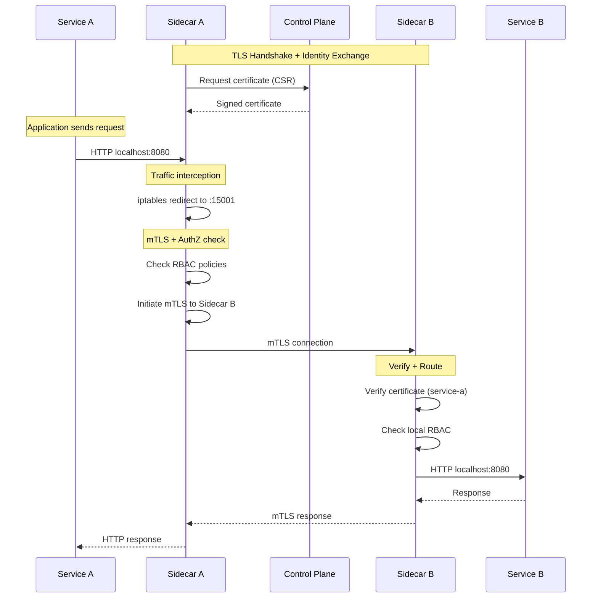

# Service Mesh Deep Dive: Kiến Trúc, Cơ Chế và Thực Chiến Production

## 1. Mục tiêu của Task

Hiểu sâu bản chất Service Mesh như một lớp hạ tầng communication chuyên biệt trong microservices, phân tích kiến trúc sidecar pattern, cơ chế mTLS, traffic management, và các vấn đề vận hành thực tế trong production environment.

---

## 2. Bản Chất và Cơ Chế Hoạt Động

### 2.1 Service Mesh Là Gì Và Tại Sao Cần Nó?

**Bản chất vấn đề:** Trong microservices, communication giữa các service trở thành một distributed system problem phức tạp. Mỗi service phải xử lý:
- Service discovery (tìm địa chỉ service khác)
- Load balancing (cân bằng tải)
- Retry và timeout policies
- Circuit breaking (ngắt mạch khi service lỗi)
- Observability (logging, metrics, tracing)
- Security (mTLS, authentication, authorization)

**Giải pháp truyền thống:** Nhúng tất cả logic này vào mỗi service (fat client libraries). Vấn đề:
- Language-specific (Java client khác Go client)
- Tight coupling: business logic + infrastructure logic
- Khó upgrade: thay đổi retry policy = redeploy tất cả services
- Inconsistent implementation giữa các team

**Service Mesh approach:** Tách hoàn toàn infrastructure communication ra khỏi application logic bằng cách inject một proxy (sidecar) vào mỗi pod/container.

```
┌─────────────────────────────────────────┐
│           Application Pod               │
│  ┌─────────────┐    ┌─────────────┐    │
│  │   Service   │◄──►│   Sidecar   │    │
│  │   (Java)    │    │   Proxy     │    │
│  │   Port 8080 │    │   Port 15001│    │
│  └─────────────┘    └──────┬──────┘    │
│                            │           │
└────────────────────────────┼───────────┘
                             │
                             ▼
                    ┌─────────────────┐
                    │  Service Mesh   │
                    │  Control Plane  │
                    └─────────────────┘
```

### 2.2 Kiến Trúc Data Plane vs Control Plane

**Data Plane (Sidecar Proxy):**
- Thành phần thực thi: Envoy (Istio), Linkerd-proxy
- Chịu trách nhiệm: xử lý tất cả network traffic giữa services
- Triển khai: một instance per pod, chạy cùng lifecycle với application

**Control Plane:**
- Thành phần quản lý: Istiod (Istio), Linkerd control plane
- Chịu trách nhiệm: cấu hình, policy, certificate management
- Không xử lý traffic trực tiếp (trừ một số trường hợp như Istio ztunnel trong ambient mode)

**Luồng traffic thông thường:**

```
Service A ──► Sidecar A ──► Network ──► Sidecar B ──► Service B
(8080)       (15001)                   (15001)       (8080)

Sidecar intercept traffic bằng iptables/eBPF:
- Outbound: redirect 8080 → 15001 (sidecar) → destination
- Inbound: 15001 (sidecar) → 8080 (service)
```

**Cơ chế interception:**

1. **iptables redirection (traditional):**
   - Sử dụng `iptables` rules để redirect traffic
   - PREROUTING chain: intercept incoming
   - OUTPUT chain: intercept outgoing
   - Overhead: mỗi packet qua kernel netfilter → user-space proxy → kernel

2. **eBPF (modern):**
   - Linux kernel program attach vào network hooks
   - Redirect trực tiếp trong kernel space
   - Giảm context switching, zero-copy có thể
   - Cilium Service Mesh sử dụng approach này

### 2.3 Sidecar Pattern Deep Dive

**Tại sao là Sidecar (per-pod proxy) mà không phải Node-level proxy?**

| Aspect | Sidecar (per-pod) | Node-level proxy |
|--------|-------------------|------------------|
| **Resource isolation** | ✅ Resource accounting đúng pod | ❌ Shared resource, noisy neighbor |
| **Security boundary** | ✅ Pod-level identity, mTLS | ❌ Node-level identity, weaker isolation |
| **Upgrade** | ✅ Rolling upgrade với app | ❌ Upgrade ảnh hưởng all pods on node |
| **Blast radius** | ✅ One proxy crash = one pod | ❌ One proxy crash = many pods affected |
| **Latency** | ❌ Extra hop localhost | ✅ Direct routing |
| **Resource overhead** | ❌ N proxies for N pods | ✅ One proxy per node |

**Trade-off cốt lõi:** Isolation vs Efficiency. Sidecar chọn isolation.

**Ambient Mesh (Istio v1.18+):** Thử nghiệm approach lai:
- Node-level ztunnel cho L4 (mTLS, telemetry)
- Sidecar chỉ khi cần L7 (HTTP routing, authz)
- Giảm 70-80% resource overhead cho services không cần L7

### 2.4 mTLS (Mutual TLS) Implementation

**Bản chất:** TLS thông thường chỉ client verify server certificate. mTLS = cả hai bên đều verify nhau.

**Service Mesh mTLS flow:**

```
Service A                    Service B
   │                            │
   ▼                            ▼
Sidecar A ─────── TLS ───────► Sidecar B
(Initiates)                   (Accepts)

1. Sidecar A: "Tôi là service-a, đây là cert của tôi"
2. Sidecar B: verify cert, "OK tôi tin bạn là service-a"
3. Sidecar B: "Tôi là service-b, đây là cert của tôi"  
4. Sidecar A: verify cert, "OK tôi tin bạn là service-b"
5. Established: encrypted + authenticated channel
```

**Certificate Management:**

Control Plane (Istiod) đóng vai trò CA (Certificate Authority):
- Mỗi service nhận X.509 certificate với SPIFFE identity: `spiffe://cluster.local/ns/default/sa/service-a`
- Certificate TTL: thường 24h (short-lived = reduced blast radius if compromised)
- Automatic rotation: control plane push new cert trước khi expire

**Certificate rotation mechanism:**
```
Control Plane          Sidecar
     │                    │
     ├────── CSR ───────►│ (Sidecar generates key pair, sends CSR)
     │◄───── Cert ──────┤ (CA signs and returns cert)
     │                    │
     ├───── Push ───────►│ (When rotation needed, proactively push)
     │                    │
```

**PERMISSIVE vs STRICT mode:**
- PERMISSIVE: Chấp nhận cả plain-text và mTLS (migration phase)
- STRICT: Chỉ chấp nhận mTLS (production)

### 2.5 Traffic Management

**Core concepts:**

1. **VirtualService:** Define routing rules cho một service
   - HTTP routing: path-based, header-based, weight-based
   - Retry policies: số lần retry, per-try timeout
   - Fault injection: chaos engineering (delay, abort)

2. **DestinationRule:** Define policies áp dụng sau khi routing
   - Load balancing algorithms: ROUND_ROBIN, LEAST_CONN, RANDOM
   - Connection pool settings: max connections, max requests
   - Outlier detection: circuit breaker logic

3. **Gateway:** Entry point từ outside cluster (Ingress)
   - L4-L7 load balancing
   - TLS termination
   - VirtualService attachment

**Traffic splitting example:**

```yaml
# VirtualService for canary deployment
apiVersion: networking.istio.io/v1beta1
kind: VirtualService
metadata:
  name: reviews-route
spec:
  hosts:
  - reviews
  http:
  - route:
    - destination:
        host: reviews
        subset: v1
      weight: 90
    - destination:
        host: reviews
        subset: v2
      weight: 10
```

**Circuit Breaker implementation:**

Envoy implement circuit breaker theo "Outlier Detection" pattern:
- **Ejection threshold:** % pods unhealthy trước khi circuit open
- **Ejection time:** Thời gian loại bỏ pod khỏi pool
- **Consecutive errors:** Số lỗi liên tiếp để đánh dấu unhealthy

---

## 3. Kiến Trúc và Luồng Xử Lý

### 3.1 Request Lifecycle Qua Service Mesh



### 3.2 Istio Architecture Chi Tiết

**Istiod (Monolithic Control Plane):**
- Pilot: Service discovery, configuration (xDS protocol)
- Citadel: Certificate authority, key management
- Galley: Configuration validation, ingestion

**Sidecar Injection:**
- Automatic: MutatingWebhookConfiguration intercepts pod creation
- Manual: `istioctl kube-inject`
- Init container: setup iptables rules
- Sidecar container: Envoy proxy

**Configuration Distribution (xDS Protocol):**
- ADS (Aggregated Discovery Service): stream tất cả config qua một gRPC connection
- Resource types: LDS (Listeners), RDS (Routes), CDS (Clusters), EDS (Endpoints)
- Incremental updates: chỉ gửi delta khi có thay đổi

### 3.3 Linkerd Architecture (Simpler Alternative)

**Thiết kế philosophy:** "Simple, lightweight, just works"

**Linkerd2 components:**
- Controller: Destination service (service discovery), Identity service (CA)
- Proxy: Rust-based, ultra-lightweight (~10MB, <10ms p99 latency)
- Tap: Real-time traffic inspection

**Key differences từ Istio:**
- Không cần CNI plugin
- No CRD proliferation (ít custom resource hơn Istio)
- Opinionated defaults (ít cấu hình hơn, smart defaults)

---

## 4. So Sánh Các Giải Pháp

### 4.1 Istio vs Linkerd

| Tiêu chí | Istio | Linkerd |
|----------|-------|---------|
| **Resource overhead** | 100-200MB RAM per sidecar | 10-20MB RAM per sidecar |
| **Latency** | 2-5ms P99 overhead | <1ms P99 overhead |
| **Feature set** | Rich (L7 advanced routing) | Core features, opinionated |
| **Complexity** | High | Low-Medium |
| **Multi-cluster** | Native support (istioctl) | Basic support |
| **Ecosystem** | Large (Kiali, Grafana, Jaeger) | Growing |
| **mTLS by default** | Opt-in | On by default |
| **CNI requirement** | Optional but recommended | Không cần |

**Khi nào chọn Istio:**
- Cần L7 traffic management phức tạp (header routing, rate limit per user)
- Multi-cluster mesh requirement
- Team có capacity để operate complex system
- Cần tích hợp nhiều vendor tools

**Khi nào chọn Linkerd:**
- Ưu tiên simplicity và low overhead
- Team nhỏ, không có dedicated platform engineer
- Chỉ cần core features: mTLS, retries, timeouts, basic metrics
- Production safety > feature richness

### 4.2 Cilium Service Mesh (eBPF-based)

**Differentiator:** Kernel-level implementation, không cần sidecar

**Architecture:**
- L3-L4: eBPF programs trong kernel (zero proxy)
- L7: Envoy per-node (chỉ khi cần HTTP routing)
- Service mesh features: mTLS (beta), load balancing, observability

**Trade-offs:**
- ✅ Cực kỳ hiệu quả: <1% CPU overhead, <0.1ms latency
- ✅ No sidecar injection complexity
- ❌ L7 features còn hạn chế so với Istio
- ❌ Kernel dependency (eBPF support, kernel version)

**Khi nào chọn:** Cloud-native infrastructure, high-performance requirements, team comfortable với eBPF.

---

## 5. Rủi Ro, Anti-Patterns và Lỗi Thường Gặp

### 5.1 Production Failure Modes

**1. Control Plane Outage:**
- **Rủi ro:** Control plane down → không thể rotate certificates → services bị reject khi cert expire
- **Mitigation:** Multi-replica control plane, certificate TTL > control plane MTTR
- **Rule:** Certificate TTL phải >= 3x expected recovery time

**2. Sidecar Resource Starvation:**
- **Triệu chứng:** Application timeout, 503 errors
- **Nguyên nhân:** Sidecar không có đủ CPU/memory để xử lý traffic
- **Solution:** Set proper resource limits/requests cho sidecar

```yaml
# Anti-pattern: No resource limits
- name: istio-proxy
  resources: {}  # DON'T DO THIS

# Best practice
- name: istio-proxy
  resources:
    requests:
      cpu: 100m
      memory: 128Mi
    limits:
      cpu: 500m
      memory: 256Mi
```

**3. mTLS STRICT mode too early:**
- **Vấn đề:** Bật STRICT mTLS trước khi tất cả services có sidecar
- **Kết quả:** Traffic bị từ chối, service disruption
- **Migration path:** PERMISSIVE → STRICT gradually

**4. Headless Service Issues:**
- StatefulSets (databases, message queues) dùng headless services
- Service mesh có thể gây vấn đề với direct pod-to-pod communication
- **Solution:** Disable sidecar injection cho database pods hoặc dùng ServiceEntry

### 5.2 Anti-Patterns

**1. Over-reliance on Mesh Retry:**
- Retry không giải quốc underlying problem, chỉ che giấu nó
- Cascading retries: A retry → B retry → C retry = exponential amplification
- **Rule:** Retry chỉ nên ở entry point (edge), không phải everywhere

**2. Circuit Breaker Misconfiguration:**
- Consecutive errors quá thấp = eject healthy pods (flapping)
- Ejection time quá ngắn = không có recovery time
- **Best practice:** Base on P99 latency + business requirements

**3. Ignoring Sidecar Startup Time:**
- Sidecar cần time để nhận config từ control plane
- Application khởi động nhanh hơn sidecar = traffic đi ra không qua mesh
- **Solution:** Liveness/readiness probes, container startup sequence

**4. No Observability Strategy:**
- Triển khai mesh nhưng không setup tracing/metrics
- Khó debug khi có vấn đề
- **Must have:** Distributed tracing (Jaeger/Tempo), metrics (Prometheus), dashboard (Grafana/Kiali)

### 5.3 Debugging Challenges

**Vấn đề:** "Magic" behavior làm khó debug
- Traffic bị redirect ngầm
- Policies apply ở nhiều layers (sidecar + control plane)

**Tools cần biết:**
- `istioctl proxy-config`: xem config của một sidecar
- `istioctl authn tls-check`: verify mTLS status
- `linkerd tap`: real-time traffic inspection
- Envoy admin interface (`localhost:15000`): statistics, config dump

---

## 6. Khuyến Nghị Thực Chiến Production

### 6.1 Migration Strategy

**Phase 1: Observation (Weeks 1-2)**
- Deploy control plane only
- Sidecar injection: disabled
- Collect baseline metrics

**Phase 2: Opt-in Sidecars (Weeks 3-4)**
- Enable sidecar cho non-critical services
- PERMISSIVE mTLS mode
- Monitor resource usage

**Phase 3: Security Hardening (Weeks 5-6)**
- Enable mTLS STRICT cho internal services
- Implement authorization policies
- Test certificate rotation

**Phase 4: Traffic Management (Weeks 7-8)**
- Add circuit breakers, retries
- Implement canary deployments
- Full observability stack

### 6.2 Resource Planning

**Sidecar resource sizing:**
```
Base usage: 50MB RAM + 50m CPU per sidecar
Traffic-dependent: +10MB RAM per 100 RPS
High-traffic services (10k+ RPS): 256MB+ RAM, 500m+ CPU
```

**Control plane sizing:**
```
< 100 services: 1 replica, 512MB RAM
100-500 services: 2 replicas, 1GB RAM each
500+ services: 3+ replicas, HA setup
```

### 6.3 Monitoring Checklist

**Critical metrics:**
- Sidecar proxy latency (P50, P99)
- mTLS handshake failures
- Certificate expiration (alert at 24h, 12h, 6h, 1h)
- Control plane availability
- Configuration distribution lag

**SLIs/SLOs đề xuất:**
- P99 sidecar latency < 5ms (Istio) or < 1ms (Linkerd)
- Control plane availability > 99.9%
- Certificate rotation success rate > 99.99%

### 6.4 Security Best Practices

1. **Workload Identity:** Sử dụng SPIFFE identity thay vì IP-based policies
2. **Least Privilege:** Authorization policies chỉ cho phép necessary communication
3. **Certificate Management:** Short TTL (24h), automated rotation, audit all cert events
4. **Control Plane Security:** Restrict access to control plane, audit all config changes
5. **Secrets:** Không lưu CA private key trong etcd nếu có thể (HSM integration)

### 6.5 Multi-Cluster Considerations

**Challenges:**
- Service discovery across clusters
- Certificate trust across clusters
- Network latency giữa control planes

**Patterns:**
- **Single mesh, multi-cluster:** Shared control plane (complex, high coupling)
- **Multi-mesh federation:** Independent meshes với trust federation (recommended)

---

## 7. Kết Luận

**Bản chất của Service Mesh:** Một **layer of abstraction** cho service-to-service communication, implement bằng sidecar pattern để đạt được:
- **Decoupling:** Application code không cần biết về infrastructure concerns
- **Consistency:** Same behavior across all languages/frameworks
- **Observability:** Unified view của distributed system

**Trade-off cốt lõi phải chấp nhận:**
- Resource overhead (memory/CPU per pod)
- Latency overhead (mỗi request qua 2 proxies)
- Operational complexity (control plane management)

**Khi nào KHÔNG nên dùng Service Mesh:**
- Monolith hoặc < 10 services
- Team không có platform engineering capacity
- Latency-sensitive applications (< 10ms SLA)
- Resource-constrained environments

**Khi nào NÊN dùng:**
- > 20 microservices
- Multiple teams, multiple languages
- Cần mTLS everywhere, fine-grained traffic control
- Có dedicated platform/SRE team

**Xu hướng tương lai:**
- **Ambient Mesh:** Reduce sidecar overhead
- **eBPF-based:** Kernel-native service mesh (Cilium)
- **Gateway API:** Standardized replacement cho Ingress + Istio Gateway

> **Quy tắc vàng:** Service Mesh là một **infrastructure decision**, không phải application decision. Nó giải quyết organizational complexity (nhiều teams, nhiều services) hơn là technical complexity.
