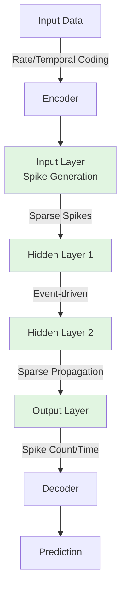

# Spiking Neural Networks (SNN) - Event-driven Computation & Energy Efficiency

## 1. Mục Tiêu Nghiên Cứu

Hiểu sâu bản chất của **Spiking Neural Networks (SNN)** - kiến trúc neural network thế hệ thứ ba, vận hành theo nguyên lý **event-driven** và đạt được hiệu quả năng lượng vượt trội so với ANN truyền thống. Tập trung vào:

- Cơ chế phát xung (spike) và mã hóa thông tin theo thờ gian
- Nguyên lý event-driven và tác động đến kiến trúc backend
- Các kịch bản ứng dụng thực tế trong hệ thống backend hiện đại
- Trade-off giữa độ chính xác và hiệu quả năng lượng

---

## 2. Bản Chất và Cơ Chế Hoạt Động

### 2.1 Sự Khác Biệt Cốt Lõi: SNN vs ANN

| Khía Cạnh | ANN (Artificial NN) | SNN (Spiking NN) |
|-----------|---------------------|------------------|
| **Đơn vị tính toán** | Activation liên tục (ReLU, Sigmoid) | Spike nhị phân (0 hoặc 1) |
| **Mã hóa thông tin** | Giá trị scalar (floating-point) | Thờ gian phát xung (temporal coding) |
| **Năng lượng** | Nhân ma trận dày đặc, tốn năng lượng | Event-driven, sparse computation |
| **Tính toán** | Đồng bộ theo layer | Không đồng bộ, event-triggered |
| **Biological plausibility** | Thấp | Cao (mô phỏng neuron sinh học) |

### 2.2 Cơ Chế Phát Xung (Spiking Mechanism)

SNN mô phỏng **neuron sinh học** với 3 thành phần chính:

```
┌─────────────────────────────────────────────────────────────┐
│                    NEURON MODEL (LIF)                       │
├─────────────────────────────────────────────────────────────┤
│                                                             │
│   Input Spikes      Synaptic Weights      Membrane Potential │
│        ↓                ↓                       ↓            │
│   ┌────────┐      ┌──────────┐         ┌──────────────┐     │
│   │  w₁    │      │          │         │   V(t)       │     │
│   │  w₂    │ ───→ │  Σ(w·s)  │ ──────→ │  dV/dt =     │     │
│   │  w₃    │      │          │         │  -V/τ + I(t) │     │
│   └────────┘      └──────────┘         └──────────────┘     │
│                                               │              │
│                                               ↓              │
│                                         ┌──────────┐        │
│                                         │ V ≥ θ ?  │        │
│                                         └────┬─────┘        │
│                                              │              │
│                    ┌─────────────────────────┘              │
│                    ↓                                        │
│              ┌──────────┐      ┌─────────────┐             │
│              │ FIRE!    │ ───→ │ Reset V=0   │             │
│              │ Output   │      │ Refractory  │             │
│              │ Spike    │      │ Period      │             │
│              └──────────┘      └─────────────┘             │
│                                                             │
└─────────────────────────────────────────────────────────────┘
```

**Các mô hình neuron phổ biến:**

| Mô Hình | Đặc Điểm | Ứng Dụng |
|---------|----------|----------|
| **LIF** (Leaky Integrate-and-Fire) | Đơn giản, 2 ODE | Real-time inference |
| **Izhikevich** | 2 biến, sinh động | Research, pattern recognition |
| **Hodgkin-Huxley** | 4 ODE, chính xác cao | Simulation, neuroscience |
| **AdEx** (Adaptive Exponential) | Có adaptation | Complex temporal patterns |

### 2.3 Event-Driven Computation - Bản Chất

> **Nguyên lý cốt lõi:** "Tính toán chỉ xảy ra khi có spike"

```
Traditional ANN Computation:          SNN Event-Driven Computation:
┌──────────────────────┐              ┌──────────────────────┐
│ Time: t=0  t=1  t=2  │              │ No Activity → IDLE   │
│                      │              │                      │
│ Layer 0: ███████████ │              │ Spike! ────────┐     │
│ Layer 1: ███████████ │              │                ↓     │
│ Layer 2: ███████████ │              │          ┌────────┐  │
│ Layer 3: ███████████ │              │          │Compute │  │
│ Layer N: ███████████ │              │          │+Propagate│ │
│                      │              │          └────────┘  │
│ Energy: ████████████ │              │ Back to IDLE ───┐    │
└──────────────────────┘              └──────────────────────┘
      100% active                           ~5-10% active
```

**Tại sao tiết kiệm năng lượng?**

1. **Sparse Activity:** Chỉ ~1-5% neuron active tại một thờ điểm
2. **Binary Communication:** Spike = 1 bit (thay vì 32/64-bit float)
3. **No Multiplication:** Accumulation thay vì MAC (Multiply-Accumulate)
4. **Local Computation:** Không cần đồng bộ toàn mạng

---

## 3. Kiến Trúc và Luồng Xử Lý

### 3.1 SNN Inference Pipeline



### 3.2 Các Phương Pháp Mã Hóa (Encoding)

| Phương Pháp | Mô Tả | Trade-off |
|-------------|-------|-----------|
| **Rate Coding** | Tần số spike ∝ giá trị đầu vào | Đơn giản, chậm |
| **Temporal Coding** | Thờ gian spike chứa thông tin | Nhanh, phức tạp |
| **Phase Coding** | Spike trong chu kỳ oscillation | Trung gian |
| **Population Coding** | Phân phối trên nhóm neuron | Robust, tốn tài nguyên |

**Ví dụ Rate Coding vs Temporal Coding:**

```
Input Value: 0.8

Rate Coding (10 timesteps):
  Neuron: ■ ■ ■ ■ ■ ■ ■ ■ □ □  (8 spikes = 0.8 × 10)
  
Temporal Coding (10 timesteps):
  Neuron: ■ □ □ □ □ □ □ □ □ □  (1 spike sớm = giá trị cao)
          ↑ spike at t=1 (early = high value)
```

### 3.3 Kiến Trúc Phần Cứng Tối Ưu SNN

```
┌─────────────────────────────────────────────────────────────┐
│              NEUROMORPHIC HARDWARE ARCHITECTURE              │
├─────────────────────────────────────────────────────────────┤
│                                                             │
│  ┌─────────────┐    ┌─────────────┐    ┌─────────────┐     │
│  │   Core 0    │    │   Core 1    │    │   Core N    │     │
│  │ ┌─────────┐ │    │ ┌─────────┐ │    │ ┌─────────┐ │     │
│  │ │Neuron 0 │ │    │ │Neuron K │ │    │ │Neuron M │ │     │
│  │ │Neuron 1 │ │    │ │Neuron K+1│ │   │ │Neuron M+1│ │    │
│  │ │  ...    │ │    │ │  ...    │ │    │ │  ...    │ │     │
│  │ └─────────┘ │    │ └─────────┘ │    │ └─────────┘ │     │
│  │   Router    │◄──►│   Router    │◄──►│   Router    │     │
│  │ (Multicast) │    │ (Multicast) │    │ (Multicast) │     │
│  └──────┬──────┘    └──────┬──────┘    └──────┬──────┘     │
│         │                  │                  │            │
│         └──────────────────┼──────────────────┘            │
│                            │                                │
│                      ┌──────────┐                          │
│                      │   AER    │  (Address Event          │
│                      │  Bus     │   Representation)        │
│                      └──────────┘                          │
│                                                             │
│  Key Features:                                              │
│  • In-memory computing (weights trong SRAM/memristor)       │
│  • Event-driven routing (AER)                               │
│  • No global clock (async)                                  │
│  • Parallel & distributed                                   │
└─────────────────────────────────────────────────────────────┘
```

**Các nền tảng phần cứng chính:**

| Platform | Nhà Sản Xuất | Neuron Cores | Đặc Điểm |
|----------|--------------|--------------|----------|
| **Loihi 2** | Intel | 128 cores/chip | Programmable, research-friendly |
| **TrueNorth** | IBM | 4096 cores/chip | Low power (70mW), production |
| **SpiNNaker** | UoM/ARM | 18 cores/chip | Large-scale simulation |
| **BrainScaleS** | Heidelberg | Analog | Physical model, speed-up 10,000x |
| **DYNAP-SE** | iniLabs | Mixed-signal | Edge applications |

---

## 4. So Sánh và Lựa Chọn

### 4.1 SNN vs ANN: Trade-off Chi Tiết

```
                    Accuracy
                       ▲
                       │    ANN (GPU)
                       │     ●
                       │      ╲
                       │       ╲  Hybrid
                       │        ╲  ●
                       │         ╲
                       │    SNN   ╲
                       │     ●─────╲
                       │            ╲
                       └──────────────► Energy Efficiency
                      Low           High
```

| Yếu Tố | ANN on GPU | SNN on Loihi | Lý Do |
|--------|------------|--------------|-------|
| **Năng lượng/inference** | ~1-10 mJ | ~0.1-1 μJ | 1000-10000x tiết kiệm |
| **Độ trễ** | ~10-100ms | ~1-10ms | Event-driven, không đồng bộ |
| **Throughput** | Cao (batch) | Trung bình | Khó batch SNN |
| **Accuracy** | Cao (~99%) | Thấp hơn (~95%) | Non-differentiable |
| **Training time** | Nhanh | Chậm | Spike timing dynamics |
| **Interpretability** | Thấp | Cao | Temporal patterns |

### 4.2 Khi Nào Dùng SNN?

> ✅ **NÊN DÙNG khi:**
> - Ứng dụng edge/battery-powered (IoT, sensors)
> - Yêu cầu độ trễ cực thấp (<10ms)
> - Real-time streaming với sparse data
> - Cần tính toán liên tục (always-on)
> - Hệ thống neuromorphic hardware sẵn có

> ❌ **KHÔNG NÊN DÙNG khi:**
> - Batch inference với large dataset
> - Yêu cầu accuracy >99% (image classification)
> - Không có phần cứng hỗ trợ (chạy trên CPU/GPU thua ANN)
> - Training từ đầu với dữ liệu lớn
> - Cần interpretability không quan trọng

### 4.3 Các Phương Pháp Training SNN

| Phương Pháp | Nguyên Lý | Ưu Điểm | Nhược Điểm |
|-------------|-----------|---------|------------|
| **ANN-to-SNN Conversion** | Chuyển trained ANN → SNN | Dễ, giữ accuracy | Không tận dụng temporal |
| **Surrogate Gradient** | Approximate gradient qua spike | End-to-end training | Vanishing gradient |
| **Spike Timing Dependent Plasticity (STDP)** | Hebbian learning | Bio-plausible | Local, chậm |
| **Evolutionary Algorithms** | GA/PSO optimize weights | Global search | Tốn tài nguyên |

---

## 5. Rủi Ro, Anti-patterns và Lỗi Thường Gặp

### 5.1 Các Lỗi Nghiêm Trọng

| Lỗi | Triệu Chứng | Giải Pháp |
|-----|-------------|-----------|
| **Dead Neurons** | Neuron không bao giờ fire | Điều chỉnh threshold, weight initialization |
| **Exploding Spikes** | Quá nhiều spike, mất thông tin | Inhibition, refractory period |
| **Temporal Coding Overflow** | Spike nằm ngoài window | Window normalization |
| **Vanishing Spike** | Thông tin mất qua layers | Skip connections, residual |
| **Clock Drift** | Async systems desync | Local clocks, handshaking |

### 5.2 Anti-patterns trong Thiết Kế

> **1. Chạy SNN trên CPU/Von Neumann**
> ```
> ❌ Sai: SNN simulation trên CPU = chậm hơn ANN
> ✅ Đúng: Dùng neuromorphic hardware hoặc đừng dùng SNN
> ```

> **2. Bỏ Qua Temporal Dynamics**
> ```
> ❌ Sai: Treat SNN như ANN với activation khác
> ✅ Đúng: Tận dụng temporal coding, time constants
> ```

> **3. Quên Refractory Period**
> ```
> ❌ Sai: Neuron fire liên tục → saturation
> ✅ Đúng: Implement τ_ref để giới hạn tần số
> ```

> **4. Over-simplification của Synaptic Model**
> ```
> ❌ Sai: Current-based synapses mọi trường hợp
> ✅ Đúng: Conductance-based cho bio-realistic, current-based cho speed
> ```

### 5.3 Edge Cases trong Production

**Case 1: Input Burst**
```
Problem: 1000 spikes trong 1ms → queue overflow
Solution: Input buffering, rate limiting, adaptive threshold
```

**Case 2: Network Silence**
```
Problem: Không có spike output trong window dài
Solution: Timeout detection, default output, monitoring alerts
```

**Case 3: Hardware Fault**
```
Problem: Core failure trong multi-core neuromorphic chip
Solution: Redundancy, graceful degradation, fault tolerance
```

---

## 6. Khuyến Nghị Thực Chiến Production

### 6.1 Monitoring & Observability

| Metric | Ý Nghĩa | Threshold Cảnh Báo |
|--------|---------|-------------------|
| **Firing Rate** | Neuron activity level | <0.1Hz (dead) hoặc >500Hz (burst) |
| **Spike Latency** | Thờ gian từ input → output | >10× bình thường |
| **Energy/Inference** | Hiệu quả năng lượng | Tăng >20% so với baseline |
| **Synaptic Weight Distribution** | Health của training | Bimodal hoặc collapse |
| **AER Bus Utilization** | Hardware bottleneck | >80% sustained |

### 6.2 Architecture Patterns cho Backend

```
┌─────────────────────────────────────────────────────────────┐
│              SNN BACKEND INTEGRATION PATTERN                 │
├─────────────────────────────────────────────────────────────┤
│                                                             │
│   ┌──────────────┐      ┌──────────────┐                   │
│   │   REST/gRPC  │      │   Event      │                   │
│   │     API      │─────►│   Stream     │                   │
│   └──────────────┘      └──────┬───────┘                   │
│                                │                           │
│                                ▼                           │
│                       ┌────────────────┐                   │
│                       │  Preprocessor  │                   │
│                       │  (Rate→Spike)  │                   │
│                       └───────┬────────┘                   │
│                               │                            │
│              ┌────────────────┼────────────────┐           │
│              ▼                ▼                ▼           │
│        ┌─────────┐      ┌─────────┐      ┌─────────┐       │
│        │ SNN Core│      │ SNN Core│      │ SNN Core│       │
│        │  (Chip) │      │  (Chip) │      │  (Chip) │       │
│        └────┬────┘      └────┬────┘      └────┬────┘       │
│             └────────────────┼────────────────┘            │
│                              ▼                             │
│                       ┌────────────────┐                   │
│                       │  Aggregator    │                   │
│                       │  (Ensemble)    │                   │
│                       └───────┬────────┘                   │
│                               │                            │
│                               ▼                            │
│                       ┌────────────────┐                   │
│                       │   Response     │                   │
│                       └────────────────┘                   │
│                                                             │
│  Design Decisions:                                          │
│  • Stateless preprocessing (scalable)                       │
│  • Partitioned SNN cores (fault isolation)                  │
│  • Ensemble aggregation (accuracy ↑)                        │
└─────────────────────────────────────────────────────────────┘
```

### 6.3 Deployment Checklist

**Pre-deployment:**
- [ ] Profile energy consumption trên target hardware
- [ ] Validate temporal accuracy với test dataset
- [ ] Test fault tolerance (core failure simulation)
- [ ] Benchmark độ trễ end-to-end (P50, P99)
- [ ] Calibration với environmental variations (nhiệt độ, voltage)

**Operational:**
- [ ] Real-time firing rate monitoring
- [ ] Automatic threshold adaptation
- [ ] Weight update mechanism (online learning nếu cần)
- [ ] Circuit breaker cho hardware faults
- [ ] Backup ANN fallback cho critical paths

### 6.4 Công Cụ và Framework

| Category | Công Cụ | Mục Đích |
|----------|---------|----------|
| **Simulation** | Brian2, NEST, NEURON | Research, prototyping |
| **Training** | snnTorch, SpykeTorch, Sinabs | Surrogate gradient, STDP |
| **Hardware** | Intel Lava, IBM TrueNorth SDK | Deployment on neuromorphic |
| **Conversion** | SNN Conversion Toolbox | ANN → SNN |
| **Monitoring** | Custom (AER logging) | Production observability |

---

## 7. Kết Luận

### Bản Chất Cốt Lõi

**Spiking Neural Networks không phải là "ANN tốt hơn"** - chúng là một **paradigm khác biệt** với trade-off rõ ràng:

1. **Event-driven là điểm mạnh và điểm yếu:** Tiết kiệm năng lượng nhưng khó batch, khó parallelize theo kiểu traditional

2. **Temporal coding là double-edged sword:** Thông tin thờ gian = hiệu quả cao nhưng sensitivity với timing jitter

3. **Hardware dependency:** SNN chỉ có lợi thế trên neuromorphic hardware - chạy trên CPU/GPU = không hiệu quả

### Khi Nào Áp Dụng

SNN phù hợp cho **always-on, energy-constrained, latency-sensitive** applications:
- Keyword spotting (smart speakers)
- Anomaly detection (industrial sensors)
- Event-based vision (robotics, autonomous)
- Real-time signal processing (health monitoring)

### Tương Lai

Với sự phát triển của:
- **Memristor crossbars** (in-memory analog computing)
- **3D stacking neuromorphic chips**
- **Optical spike communication**

SNN sẽ trở thành lựa chọn hàng đầu cho **edge AI at scale**, không chỉ trong research labs.

---

## 8. Tham Khảo

1. **Davies et al.** (2021) - "Loihi: A Neuromorphic Manycore Processor with On-Chip Learning" - IEEE Micro
2. **Roy et al.** (2019) - "Towards Spike-based Machine Intelligence with Neuromorphic Computing" - Nature
3. **Tavanaei et al.** (2019) - "Deep Learning in Spiking Neural Networks" - Neural Networks
4. **Intel Lava Documentation** - https://lava-nc.org/
5. **snnTorch Documentation** - https://snntorch.readthedocs.io/

---

*Document được tạo bởi Senior Backend Architect Research System*
*Ngày tạo: 2026-03-28*
