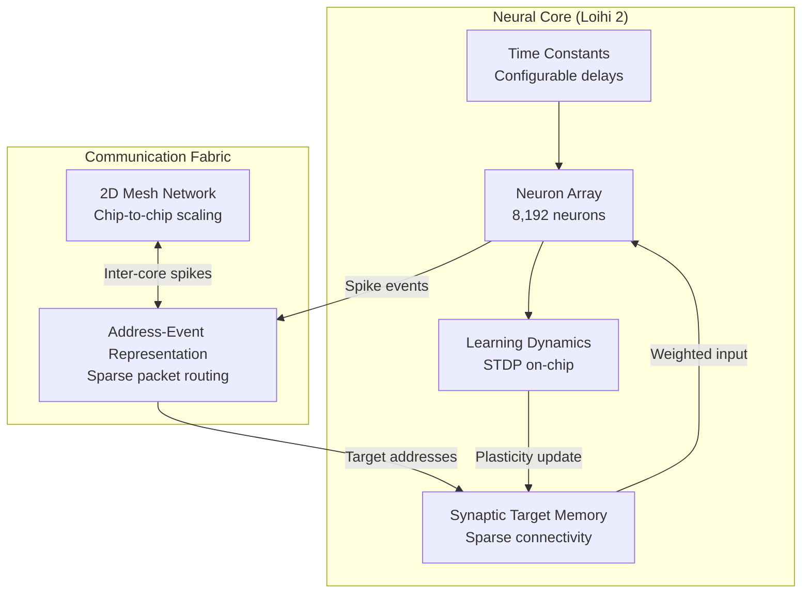
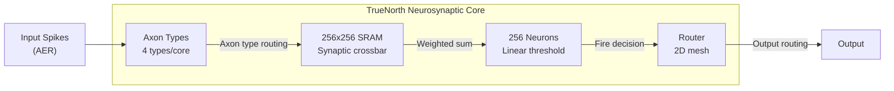
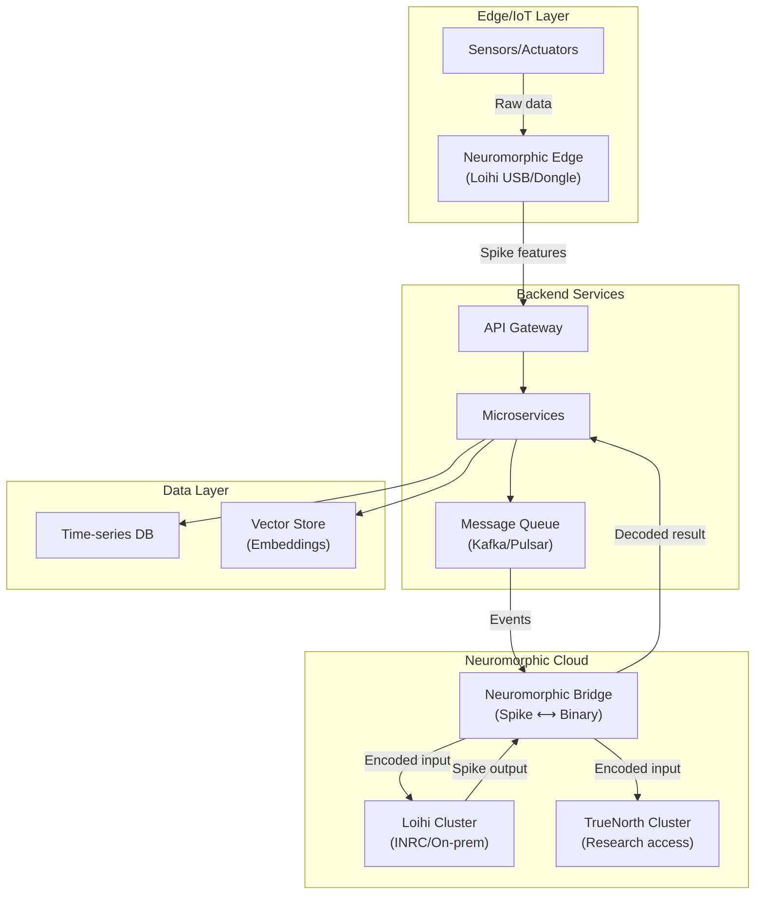

# Neuromorphic Hardware Integration: Intel Loihi, IBM TrueNorth & Backend Applications

## 1. Mục tiêu của Task

Nghiên cứu bản chất kiến trúc neuromorphic hardware, phân tích cơ chế hoạt động của Intel Loihi và IBM TrueNorth, đánh giá khả năng tích hợp vào hệ thống backend hiện đại, và xác định các trade-off, rủi ro production cùng lộ trình áp dụng thực tế.

---

## 2. Bản Chất và Cơ Chế Hoạt Động

### 2.1. Von Neumann vs. Neuromorphic: Sự Khác Biệt Căn Bản

| Aspect | Von Neumann (Traditional) | Neuromorphic |
|--------|---------------------------|--------------|
| **Processing Model** | Sequential, clock-driven | Event-driven, asynchronous |
| **Memory Architecture** | Separate CPU-Memory-Bus | Memory-Compute colocation (in-synaptic) |
| **Power Profile** | Constant high power | Power proportional to activity (spikes) |
| **Parallelism** | SIMD/Vectorization | Massive fine-grained parallelism (neurons) |
| **Precision** | High-precision (32/64-bit) | Low-precision, stochastic (1-8 bit) |
| **Communication** | Synchronous bus transfers | Sparse, spike-based (AER protocol) |

> **Bản chất cốt lõi**: Neuromorphic computing không phải là "AI nhanh hơn" mà là **paradigm shift** từ tính toán đồng bộ sang tính toán dựa trên sự kiện, mô phỏng cách bộ não xử lý thông tin: ít năng lượng cho tác vụ đơn giản, scaling tự nhiên với độ phức tạp.

### 2.2. Intel Loihi: Kiến Trúc Chip Thế Hệ 2

**Cấu trúc vật lý (Loihi 2):**
- **Process**: Intel 4 (7nm-class) với 2.3B transistors
- **Neural Cores**: 128 cores/chip, mỗi core chứa 8,192 neurons
- **Tổng công suất**: 1 triệu neurons, 120 triệu synapses/chip
- **Power**: < 1W ở chế độ hoạt động thông thường
- **Off-chip Scaling**: Hỗ trợ mesh network đến 4,096 chips

**Cơ chế hoạt động sâu:**



**Key Innovation - Microcode Programmable:**
- Loihi 2 cho phép định nghĩa **neuron models tùy chỉnh** qua microcode
- Hỗ trợ axonal delays, synaptic delays, dendritic compartments
- Learning rules on-chip: STDP (Spike-Timing Dependent Plasticity) variants

**Programming Model:**
- Lava Framework (Python-based): Define SNN graphs
- SLURM-based deployment trên Intel Neuromorphic Research Cloud (INRC)
- Async message-passing giữa processes

### 2.3. IBM TrueNorth: Kiến Trúc Brain-Inspired

**Thông số kỹ thuật (TrueNorth NS16e):**
- **Process**: Samsung 28nm FD-SOI
- **Neural Cores**: 4,096 cores/chip
- **Tỗng công suất**: 1 triệu neurons, 256 triệu synapses/chip
- **Power**: 65-300 mW tùy workload
- **Precision**: Binary spikes + 9-bit synaptic weights

**Kiến trúc Core:**



**Design Philosophy:**
- **Rigid but efficient**: Neuron model cố định (LIF - Leaky Integrate-and-Fire)
- **Deterministic timing**: Mỗi time step = 1ms, hoàn toàn đồng bộ trong core
- **Energy per spike**: ~26 pJ/spike (extremely efficient)

**Programming Stack:**
- Corelets: Abstraction of neural networks as reusable components
- Compass: MATLAB-based simulation environment
- TrueNorth ecosystem: NS1e (development) → NS16e (scale-up board)

### 2.4. So Sánh Chi Tiết Loihi vs TrueNorth

| Tiêu chí | Intel Loihi 2 | IBM TrueNorth |
|----------|---------------|---------------|
| **Flexibility** | Cao - programmable neuron models | Thấp - fixed LIF model |
| **Learning** | On-chip unsupervised (STDP) | Off-chip only (external training) |
| **Precision** | Configurable (up to 32-bit) | Binary + 9-bit weights |
| **Programming** | Lava (Python, open-source) | Corelets (MATLAB, proprietary) |
| **Scalability** | Up to 4,096 chips (mesh) | Up to 16 chips/board, multi-board |
| **Power/Neuron** | ~1 µW/neuron (active) | ~0.26 µW/neuron (active) |
| **Availability** | INRC cloud, limited dev kits | IBM Research only, restricted |
| **Use Case** | Research, adaptive systems | Inference, embedded vision |

---

## 3. Backend Applications & Integration Patterns

### 3.1. Use Cases Thực Tế Cho Backend Systems

**Pattern 1: Event-Driven Anomaly Detection**
```
Traditional: Stream → Kafka → Flink → Model (GPU) → Alert (100-500ms, 100W+)
Neuromorphic: Stream → Loihi → Spike-based SNN → Alert (<10ms, <1W)

Trade-off: 
+ Latency: 10-50x improvement
+ Power: 100x reduction
- Precision: Thấp hơn (suitable for binary/directional decisions)
- Training: Khó khăn hơn, cần SNN-aware algorithms
```

**Pattern 2: Real-Time Sensor Fusion**
- IoT edge devices với nhiều sensor streams
- Time-series correlation detection
- Neuromorphic: Inherent temporal processing qua spike timing

**Pattern 3: Sparse Pattern Matching**
- Log analysis với pattern phức tạp, sparse occurrence
- Graph traversal problems với dynamic graphs
- Content-addressable memory patterns

**Pattern 4: Adaptive Load Balancing**
- SNN learns traffic patterns over time
- STDP allows continuous adaptation không cần retraining
- Particularly useful cho bursty workloads

### 3.2. Kiến Trúc Tích Hợp với Backend



### 3.3. Integration Challenges & Solutions

**Challenge 1: Spike-to-Data Conversion Overhead**
- Problem: Encoding/decoding spikes có thể triệt tiêu lợi ích performance
- Solution: 
  - Delta encoding cho time-series
  - Direct spike generation từ event-based sensors (DAVIS camera, AER sensors)
  - Sparse representation trong data pipeline

**Challenge 2: Training Pipeline**
- Problem: SNN training khác biệt hoàn toàn so với DNN
- Solutions:
  - ANN-to-SNN conversion (rate coding)
  - Surrogate gradient methods (backprop through time)
  - Direct SNN training với snnTorch, SpykeTorch

**Challenge 3: Debugging & Observability**
- Problem: Spike-based systems khó debug hơn traditional systems
- Solutions:
  - Spike raster plots visualization
  - Population activity monitors
  - Lava's built-in profiling tools (Loihi)

---

## 4. Trade-off Analysis

### 4.1. Khi Nào Nên Dùng Neuromorphic?

| Nên Dùng | Không Nên Dùng |
|----------|----------------|
| Ultra-low latency (< 10ms) requirements | High precision arithmetic |
| Severe power constraints (edge/battery) | Large batch inference |
| Continuous streaming, sparse activity | Training from scratch (large datasets) |
| Temporal/spike-based data sources | Complex non-temporal logic |
| Adaptive learning on-device | Tasks requiring explainability cao |

### 4.2. Trade-off Chi Tiết

**Power vs. Precision:**
- Neuromorphic: ~mW per inference
- GPU/TPU: ~10-100W per inference
- Trade-off: 100-1000x power reduction đổi lấy 10-30% accuracy reduction (task-dependent)

**Latency vs. Throughput:**
- Neuromorphic: Optimized cho streaming, single-sample latency
- Traditional: Optimized cho batch processing
- Trade-off: Low latency streaming vs. high throughput batching

**Flexibility vs. Efficiency:**
- Loihi 2: Flexible nhưng phức tạp hơn, higher power
- TrueNorth: Rigid nhưng extremely efficient
- Trade-off: General-purpose vs. specialized

---

## 5. Rủi Ro, Anti-Patterns & Lỗi Thường Gặp

### 5.1. Anti-Patterns

**Anti-Pattern 1: "Drop-in Replacement" Mentality**
> Sai lầm: Xem neuromorphic như accelerator cho CNN/RNN models hiện có.
> Hệ quả: Performance tệ hơn cả CPU do overhead conversion.
> Giải pháp: Thiết kế lại algorithm cho spike-based computation từ đầu.

**Anti-Pattern 2: Ignoring Temporal Dynamics**
> Sai lầm: Sử dụng rate coding (spike count = activation) thay vì exploit temporal codes.
> Hệ quả: Mất lợi ích chính của neuromorphic: time-based encoding.
> Giải pháp: Time-to-first-spike coding, phase coding, rank-order coding.

**Anti-Pattern 3: Over-engineering Edge Cases**
> Sai lầm: Cố gắng xử lý mọi edge case trong neuromorphic chip.
> Hệ quả: Complexity vượt quá khả năng của hardware.
> Giải pháp: Hybrid architecture - neuromorphic cho common cases, traditional cho edge cases.

### 5.2. Production Risks

| Risk | Severity | Mitigation |
|------|----------|------------|
| Hardware availability | Cao | Multiple vendor strategy (Loihi + research alternatives) |
| Expertise scarcity | Cao | Training investment, academic partnerships |
| Debugging complexity | Trung bình | Comprehensive simulation trước deployment |
| Vendor lock-in | Trung bình | Abstraction layers, avoid proprietary formats |
| Determinism | Trung bình | Stochastic behavior là feature, cần design accordingly |

### 5.3. Edge Cases

- **Cold start**: Neuromorphic chips warm-up nhanh (no thermal issues), nhưng network state cần initialization
- **Saturation**: Quá nhiều spikes đồng thời có thể saturate interconnect
- **Time constants**: Mismatch giữa time constants của SNN và real-world events

---

## 6. Khuyến Nghị Thực Chiến Production

### 6.1. Lộ Trình Adoption

**Phase 1: Research & Prototyping (3-6 tháng)**
- Access INRC cloud (free for qualified researchers)
- Implement proof-of-concept cho specific use case
- Benchmark against baseline (CPU/GPU)

**Phase 2: Hybrid Architecture (6-12 tháng)**
- Deploy neuromorphic cho subset của workload
- Traditional backend + neuromorphic edge co-processing
- A/B testing với gradual rollout

**Phase 3: Scale-up (12-24 tháng)**
- On-premise neuromorphic clusters (nếu Intel cung cấp commercial availability)
- Custom neuromorphic chips (ASIC) cho specific applications

### 6.2. Technology Stack Recommendation

| Component | Recommendation | Lý do |
|-----------|----------------|-------|
| Framework | Lava (Intel) | Open-source, Python-native, active development |
| Training | snnTorch + conversion | Mature ecosystem, PyTorch-compatible |
| Deployment | Containerized (custom) | No standard orchestration yet, cần custom solution |
| Monitoring | Custom dashboards | Spike rate, core utilization, energy per inference |
| Simulation | NEST/Brian2 cho prototyping | Mature SNN simulators trước porting to hardware |

### 6.3. Team Structure

- **Neuromorphic Architect**: Hiểu cả hardware và algorithms
- **SNN Engineer**: Specialized trong spiking neural networks
- **Backend Integration Specialist**: Bridge giữa neuromorphic và traditional systems
- **DevOps (Neuromorphic)**: Custom deployment, monitoring tools

---

## 7. Tương Lai & Xu Hướng

### 7.1. Cải Tiến Sắp Tới

**Intel Roadmap:**
- Loihi 3: Higher density, better on-chip learning
- Commercial availability dự kiến 2025-2026

**Industry Trends:**
- Neuromorphic + Photonics: Light-based spike communication
- 3D stacking: Tăng synaptic density
- Memristors: Analog neuromorphic (non-digital)

### 7.2. Integration với Java Backend

```java
// Pseudo-code for neuromorphic integration
public class NeuromorphicInferenceService {
    
    // Async spike-based processing
    public CompletableFuture<Prediction> processEventStream(
        EventStream stream
    ) {
        return spikeEncoder.encode(stream)
            .thenApply(neuromorphicClient::submit)
            .thenApply(this::decodeSpikeOutput);
    }
    
    // Hybrid decision: route to appropriate backend
    public Prediction route(InferenceRequest request) {
        if (isSpikeCompatible(request) && 
            latencyRequirement(request) < 10ms) {
            return neuromorphicInference(request);
        }
        return traditionalInference(request);
    }
}
```

---

## 8. Kết Luận

**Bản chất cốt lõi:**
Neuromorphic hardware (Intel Loihi, IBM TrueNorth) đại diện cho **paradigm shift** từ computing đồng bộ, precision-focused sang computing dựa trên sự kiện, energy-proportional. Đây không phải là công nghệ thay thế GPU/TPU mà là **complementary technology** cho specific use cases.

**Trade-off quan trọng nhất:**
Energy efficiency và latency (100-1000x improvement) đổi lấy precision và programming complexity. Phù hợp cho edge computing, real-time streaming, adaptive systems; không phù hợp cho batch processing, high-precision tasks.

**Rủi ro lớn nhất:**
Hardware availability hạn chế, expertise scarcity, và vendor lock-in. Cần lộ trình adoption từ từ với hybrid architecture, bắt đầu từ research cloud trước khi đầu tư vào on-premise infrastructure.

**Khuyến nghị cuối cùng:**
- Bắt đầu với INRC cloud access cho prototyping
- Focus vào use cases có temporal component và severe power constraints
- Xây dựng hybrid architecture thay vì pure neuromorphic
- Đầu tư vào training và partnerships với academic institutions

---

## 9. Tài Liệu Tham Khảo

1. Intel Loihi 2: https://www.intel.com/content/www/us/en/research/neuromorphic-computing.html
2. IBM TrueNorth: https://research.ibm.com/cognitive-computing/chip-form/
3. Lava Framework: https://lava-nc.org/
4. INRC Cloud: https://inrc.intel.com/
5. "Neuromorphic Computing: From Materials to Systems Architecture" - IEEE, 2023

---

*Research completed: 2026-03-28*
*Researcher: Senior Backend Architect Agent*
