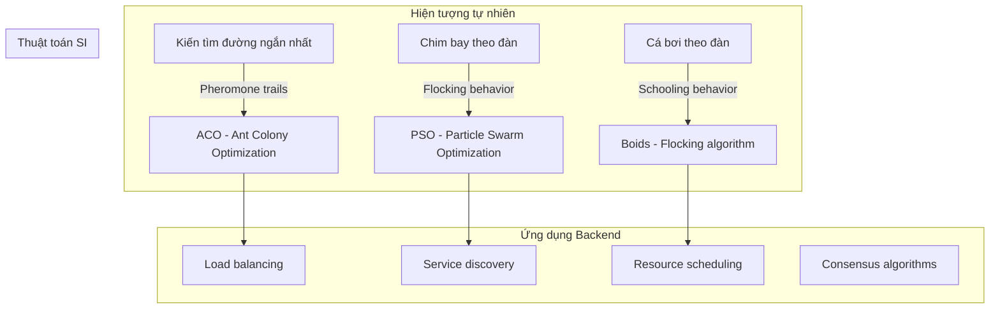
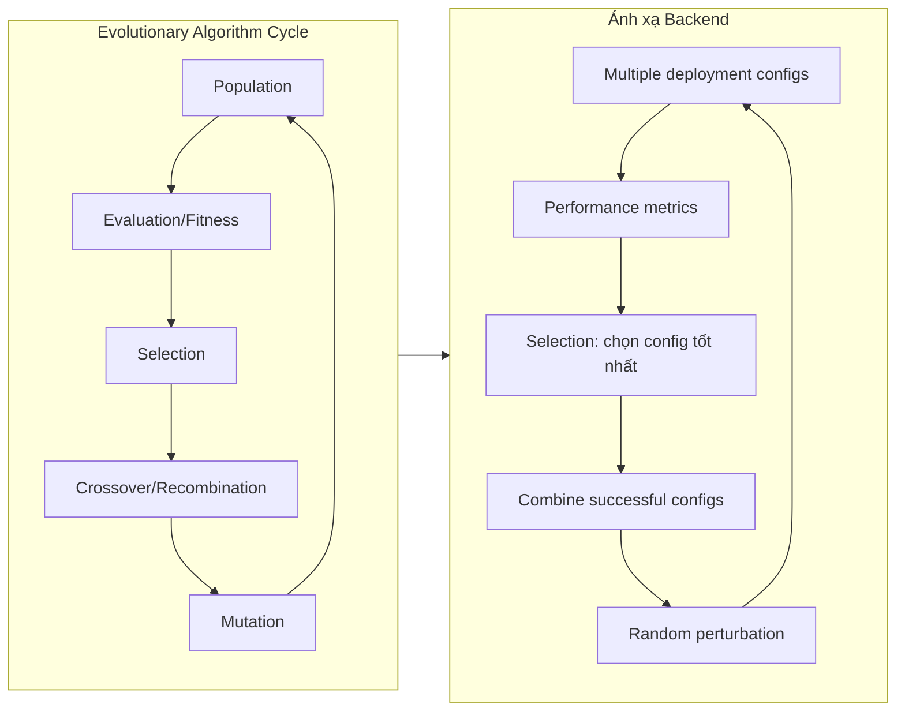
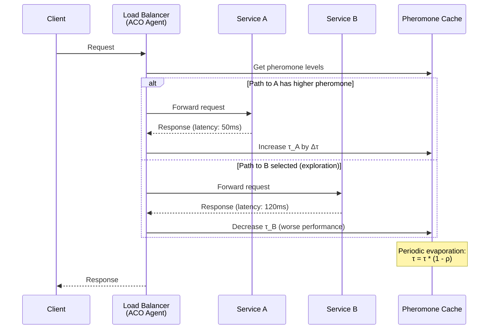
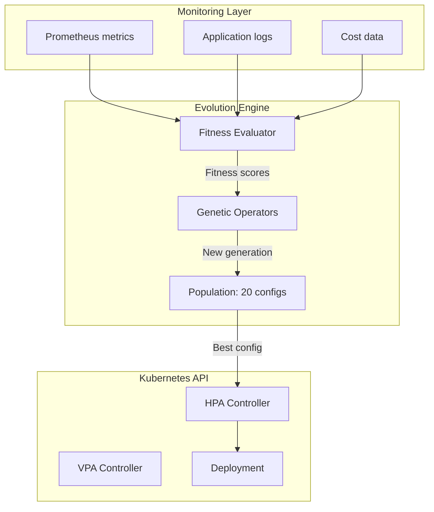
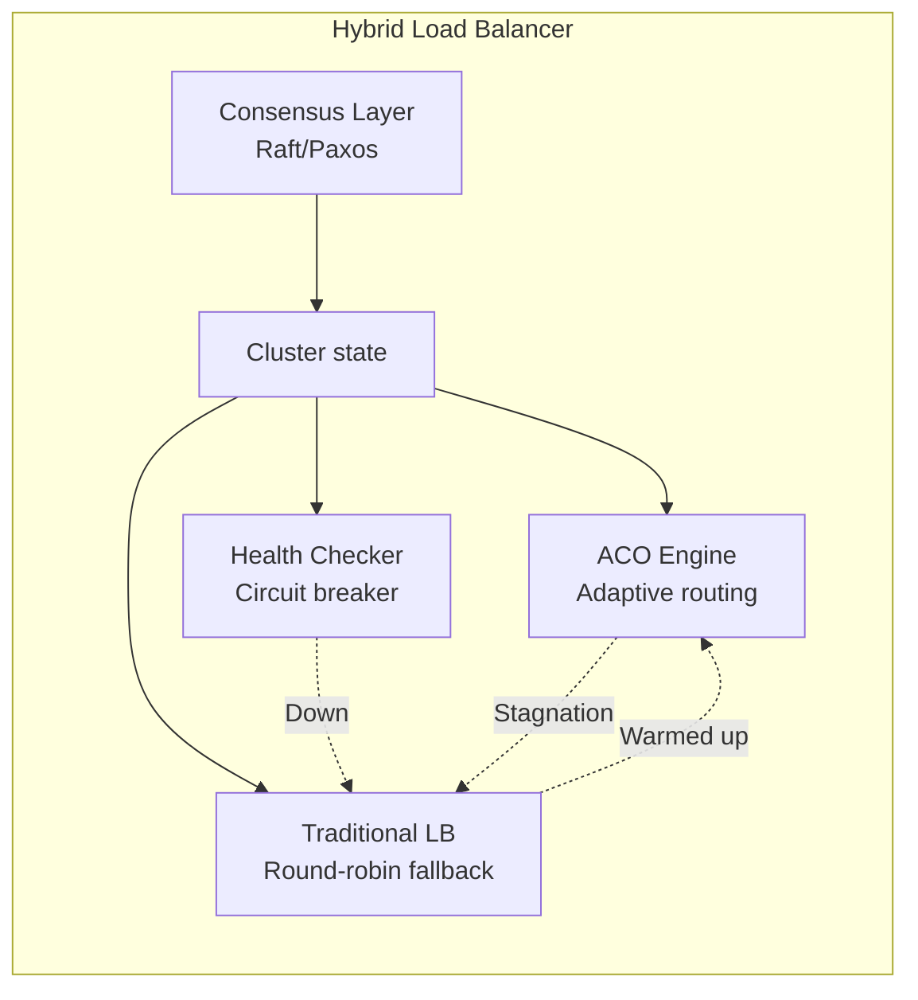

# Bio-inspired Algorithms: Swarm Intelligence & Evolutionary Optimization in Distributed Systems

## 1. Mục tiêu của Task

Tìm hiểu các thuật toán lấy cảm hứng từ sinh học, tập trung vào:
- **Swarm Intelligence (SI)**: Các thuật toán mô phỏng hành vi tập thể của sinh vật đơn giản
- **Evolutionary Optimization**: Các kỹ thuật tối ưu dựa trên quá trình tiến hóa tự nhiên
- Ứng dụng thực tiễn trong thiết kế và vận hành hệ thống phân tán quy mô lớn

## 2. Bản Chất và Cơ Chế Hoạt Động

### 2.1 Swarm Intelligence - Bản Chất Từ Tự Nhiên



**Bản chất cơ chế:**

> Swarm Intelligence dựa trên nguyên lý **Self-Organization** và **Stigmergy** - giao tiếp gián tiếp thông qua môi trường, không cần central coordination.

**ACO (Ant Colony Optimization) trong Load Balancing:**

| Yếu tố | Kiến tự nhiên | Hệ thống phân tán |
|--------|---------------|-------------------|
| Pheromone | Dấu vết hóa học | Request latency, success rate |
| Evaporation | Bay hơi theo thờ gian | Aging factor, time decay |
| Path selection | Xác suất dựa trên nồng độ | Weighted random selection |
| Reinforcement | Đường ngắn → pheromone cao | Đường nhanh → weight tăng |

**Cơ chế evaporation quan trọng:**
- Tại sao cần: Ngăn **premature convergence** (hội tụ sớm vào local optimum)
- Công thức: `τ(t+1) = (1-ρ) * τ(t) + Δτ` với ρ là evaporation rate (0 < ρ < 1)
- Trade-off: ρ cao → exploration tốt, exploitation kém; ρ thấp → ngược lại

### 2.2 Evolutionary Algorithms - Quá Trình Tiến Hóa Trong Tính Toán



**Genetic Algorithm trong Auto-scaling:**

Bản chất: Coi mỗi cấu hình hệ thống (replica count, resource limits, scaling thresholds) như một "chromosome".

| Thành phần GA | Ứng dụng Auto-scaling | Ví dụ |
|--------------|----------------------|-------|
| Gene | Một tham số cấu hình | Min replicas = 3 |
| Chromosome | Toàn bộ cấu hình | [3, 10, 70%, 80%, 30s] |
| Fitness function | Cost-performance ratio | (Throughput / Cost) * Availability |
| Selection | Chọn parents cho generation tiếp | Tournament selection |
| Crossover | Kết hợp 2 cấu hình tốt | Single-point crossover |
| Mutation | Thay đổi ngẫu nhiên | Flip một gene |

## 3. Kiến Trúc và Luồng Xử Lý

### 3.1 Distributed ACO for Service Discovery



**Kiến trúc pheromone cache trong distributed system:**

```
┌─────────────────────────────────────────────────────────┐
│                    Pheromone Table                       │
├────────────────┬─────────────┬─────────────┬────────────┤
│   Destination  │    τ (tau)  │   η (eta)   │  Timestamp │
│                │  (learned)  │ (heuristic) │            │
├────────────────┼─────────────┼─────────────┼────────────┤
│ service-a:8080 │    0.85     │    1/RTT    │  1000234   │
│ service-b:8080 │    0.42     │    1/RTT    │  1000198   │
│ service-c:8080 │    0.67     │    1/RTT    │  1000221   │
└────────────────┴─────────────┴─────────────┴────────────┘

Probability selection: P(i) = [τ(i)^α * η(i)^β] / Σ[τ(j)^α * η(j)^β]
```

### 3.2 Evolutionary Auto-scaling Architecture



## 4. So Sánh Các Lựa Chọn

### 4.1 Swarm Intelligence vs Traditional Algorithms

| Tiêu chí | ACO/PSO | Round-robin | Least-connections | Weighted random |
|----------|---------|-------------|-------------------|-----------------|
| **Adaptability** | ★★★★★ Cao - tự học từ traffic | ★★ Không | ★★★ Thấp | ★★★★ Trung bình |
| **Complexity** | ★★★★ Trung bình | ★ Dễ | ★★ Dễ | ★★ Dễ |
| **Convergence** | Chậm ban đầu, nhanh sau | Ngay lập tức | Ngay lập tức | Ngay lập tức |
| **Exploration** | Tự động balance | Không có | Không có | Cần cấu hình |
| **Cold start** | Vấn đề - cần warmup | Không | Không | Không |
| **State management** | Cần pheromone table | Stateless | Cần connection count | Cần weight table |

### 4.2 Evolutionary vs Gradient-based Optimization

```
                    Optimization Landscape
                    
    Traditional (Gradient-based)     Evolutionary Algorithms
    ━━━━━━━━━━━━━━━━━━━━━━━━━━━━     ━━━━━━━━━━━━━━━━━━━━━━━
    
    • Yêu cầu differentiable         • Không cần gradient
    • Nhanh trên smooth surface      • Chậm hơn nhưng robust
    • Stuck ở local minima           • Escape local minima tốt
    • Deterministic                  • Stochastic
    • Single solution                • Population-based
    
    Backend use case:
    ━━━━━━━━━━━━━━━━━━━
    • Continuous parameters          • Mixed discrete/continuous
    • Predictable traffic            • Highly variable patterns
    • Simple cost functions          • Multi-objective (Pareto)
```

## 5. Rủi Ro, Anti-patterns, và Lỗi Thường Gặp

### 5.1 Swarm Intelligence Pitfalls

> **⚠️ Premature Convergence**
> 
> Khi pheromone tích lũy quá nhanh, toàn bộ swarm "chết" vào một path duy nhất, mất khả năng khám phá.
> 
> **Giải pháp:**
> - Max-min ACO: Giới hạn τ_min và τ_max
> - Evaporation rate động: Tăng ρ khi variance giảm
> - Pheromone reset: Periodic restart khi detect stagnation

> **⚠️ Cold Start Problem**
> 
> Hệ thống mới khởi động không có pheromone, dẫn đến random routing ban đầu.
> 
> **Giải pháp:**
> - Heuristic initialization: η = 1/RTT_estimated
> - Bootstrap từ historical data
> - Warmup phase với exploration cao

> **⚠️ Pheromone Table Explosion**
> 
> Trong hệ thống microservices với hàng trăm instances, table trở nên quá lớn.
> 
> **Giải pháp:**
> - Aggregation theo service type thay vì instance
> - LRU eviction cho stale entries
> - Distributed caching (Redis) với TTL

### 5.2 Evolutionary Algorithm Anti-patterns

```java
// ❌ ANTI-PATTERN: Fitness function không idempotent
// Cùng một config cho fitness khác nhau qua các lần gọi
public double calculateFitness(Config c) {
    // Random noise làm hỏng selection pressure
    return actualPerformance + Math.random() * 0.1;
}

// ✅ CORRECT: Deterministic fitness
public double calculateFitness(Config c) {
    // Hoặc average qua nhiều measurements
    return historicalAveragePerformance(c);
}
```

```java
// ❌ ANTI-PATTERN: Population diversity quá thấp
// Crossover giữa các cá thể quá giống nhau → premature convergence
if (population.diversity() < threshold) {
    // Chỉ dựa vào mutation là không đủ
    // Cần: Immigration (thêm cá thể random) hoặc restart
}

// ✅ CORRECT: Diversity maintenance
public void maintainDiversity() {
    if (diversity < minDiversity) {
        // Inject random immigrants
        replaceWorstWithRandom(immigrationRate);
        // Hoặc: Increase mutation rate temporarily
        adaptiveMutationRate *= 2;
    }
}
```

## 6. Khuyến Nghị Thực Chiến Trong Production

### 6.1 Hybrid Architecture Pattern



**Production checklist:**

| Component | Implementation | Monitoring |
|-----------|---------------|------------|
| Pheromone store | Redis Cluster với TTL | Hit rate, eviction rate |
| ACO parameters | Dynamic adjustment | Convergence metric |
| Fallback | Static weights | Fallback trigger count |
| Exploration | ε-greedy (10% random) | Exploration ratio |

### 6.2 Observability cho Bio-inspired Systems

```yaml
# Key metrics cần theo dõi
metrics:
  # ACO specific
  - pheromone_variance          # Detect stagnation
  - exploration_ratio           # ε parameter
  - path_switch_frequency       # Adaptation speed
  - pheromone_evaporation_rate  # ρ parameter
  
  # Evolutionary specific  
  - population_diversity        # Hamming distance
  - generation_fitness_trend    # Improvement rate
  - selection_pressure          # Tournament size effect
  - mutation_rate_adaptive      # Self-adjustment
  
  # System health
  - convergence_time            # Time to stable state
  - fallback_activation         # Failover events
```

### 6.3 Parameter Tuning Guidelines

**ACO Parameters:**

| Parameter | Khuyến nghị | Lý do |
|-----------|-------------|-------|
| α (pheromone importance) | 1.0 | Balance giữa learned và heuristic |
| β (heuristic importance) | 2.0 | Heuristic slightly more important |
| ρ (evaporation) | 0.1-0.3 | Chậm enough để learning, nhanh enough để adapt |
| Q (pheromone deposit) | Normalized | Phụ thuộc vào fitness range |
| τ_min / τ_max | 0.01 / 1.0 | Max-min ACO stabilization |

**Evolutionary Parameters:**

| Parameter | Khuyến nghị | Lý do |
|-----------|-------------|-------|
| Population size | 20-50 | Trade-off: diversity vs evaluation cost |
| Crossover rate | 0.8 | Most offspring from recombination |
| Mutation rate | 0.01-0.05 | Low but non-zero |
| Elitism | 10-20% | Preserve best solutions |
| Generation gap | 0.9 | Replace 90% mỗi generation |

## 7. Kết Luận

### Bản chất vấn đề

Bio-inspired algorithms cung cấp **self-adaptive mechanism** cho distributed systems - khả năng tự học và tối ưu mà không cần explicit programming cho mọi scenario.

### Trade-off cốt lõi

| Lợi ích | Chi phí |
|---------|---------|
| Adaptability cao | Complexity tăng |
| Self-optimization | Cold start problem |
| Robustness | Slower initial convergence |
| No central coordination | State management challenge |

### Rủi ro lớn nhất trong production

1. **Premature convergence** → Stagnation, mất adaptability
2. **Cold start** → Poor UX ban đầu  
3. **Parameter sensitivity** → Khó tune cho workload đa dạng
4. **Debuggability** → Hard to explain routing decisions

### Khi nào nên dùng

✅ **Nên dùng:**
- Dynamic environment với frequent changes
- Multi-objective optimization (cost vs latency vs availability)
- Non-stationary workload patterns
- Cần balance exploration vs exploitation

❌ **Không nên dùng:**
- Static, predictable workload
- Yêu cầu deterministic routing (financial transactions)
- Resource constraints nghiêm ngặt (embedded systems)
- Team chưa có expertise để debug/tune

### Xu hướng hiện đại

- **Neuro-evolution**: Kết hợp Neural Networks với EA (NEAT, HyperNEAT)
- **Multi-objective ACO**: Pareto front cho conflicting objectives
- **Quantum-inspired algorithms**: QEA (Quantum Evolutionary Algorithm)
- **Federated SI**: Swarm learning across distributed nodes không share data

---

## 8. Code Reference (Minimal)

```java
// Core ACO selection logic
public class ACOLoadBalancer {
    private Map<String, Double> pheromones = new ConcurrentHashMap<>();
    private double alpha = 1.0;
    private double beta = 2.0;
    private double rho = 0.1; // Evaporation rate
    
    public String selectDestination(List<String> candidates, Map<String, Double> heuristics) {
        double total = 0;
        double[] probabilities = new double[candidates.size()];
        
        for (int i = 0; i < candidates.size(); i++) {
            String dest = candidates.get(i);
            double tau = pheromones.getOrDefault(dest, 0.1); // Default exploration
            double eta = heuristics.getOrDefault(dest, 1.0);
            
            probabilities[i] = Math.pow(tau, alpha) * Math.pow(eta, beta);
            total += probabilities[i];
        }
        
        // Roulette wheel selection
        double random = ThreadLocalRandom.current().nextDouble() * total;
        double cumulative = 0;
        
        for (int i = 0; i < candidates.size(); i++) {
            cumulative += probabilities[i];
            if (random <= cumulative) {
                return candidates.get(i);
            }
        }
        
        return candidates.get(candidates.size() - 1);
    }
    
    public void updatePheromone(String destination, double delta) {
        pheromones.merge(destination, delta, (old, d) -> {
            double updated = old + d;
            return Math.min(updated, 1.0); // Max-min ACO: upper bound
        });
    }
    
    // Periodic evaporation
    @Scheduled(fixedRate = 5000)
    public void evaporate() {
        pheromones.replaceAll((k, v) -> Math.max(v * (1 - rho), 0.01)); // Lower bound
    }
}
```

```java
// Genetic Algorithm for auto-scaling
public class ScalingGenome {
    private int minReplicas;      // Gene 1
    private int maxReplicas;      // Gene 2
    private double targetCPU;     // Gene 3
    private double targetMemory;  // Gene 4
    private int scaleUpDelay;     // Gene 5
    
    public double fitness(Metrics history) {
        // Multi-objective: minimize cost, maximize availability
        double availability = calculateAvailability(history);
        double cost = calculateCost(history);
        double latencyPenalty = calculateLatencyPenalty(history);
        
        // Weighted fitness (tunable based on business priority)
        return availability * 0.4 - cost * 0.3 - latencyPenalty * 0.3;
    }
    
    public ScalingGenome crossover(ScalingGenome other) {
        // Single-point crossover
        Random rand = new Random();
        ScalingGenome offspring = new ScalingGenome();
        
        offspring.minReplicas = rand.nextBoolean() ? this.minReplicas : other.minReplicas;
        offspring.maxReplicas = rand.nextBoolean() ? this.maxReplicas : other.maxReplicas;
        // ... similar for other genes
        
        return offspring;
    }
    
    public void mutate(double mutationRate) {
        Random rand = new Random();
        if (rand.nextDouble() < mutationRate) {
            this.minReplicas += rand.nextInt(3) - 1; // -1, 0, +1
            this.minReplicas = Math.max(1, Math.min(this.minReplicas, 10));
        }
        // ... similar for other genes
    }
}
```

---

**Ngày nghiên cứu:** 2026-03-28  
**Researcher:** Senior Backend Architect  
**Task ID:** 30.3 - Bio-inspired Algorithms
