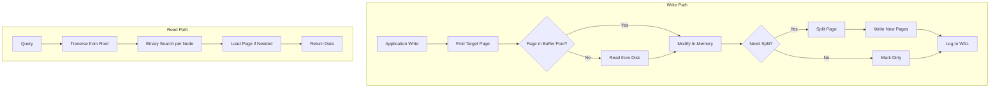

# B-Tree vs LSM-Tree: Bản Chất Storage Engine

## 1. Mục Tiêu

Hiểu sâu bản chất hai họ storage engine phổ biến nhất trong database systems:
- **B-Tree ( và biến thể B+Tree)**: Update-in-place, read-optimized
- **LSM-Tree (Log-Structured Merge-Tree)**: Append-only, write-optimized

Mục tiêu cuối cùng là biết **khi nào chọn cái nào**, **trade-off thực sự** là gì, và **vận hành production** cần chú ý gì.

---

## 2. Bản Chất và Cơ Chế Hoạt Động

### 2.1 B-Tree: Cấu Trúc Cây Cân Bằng

#### Bản Chất

B-Tree là **self-balancing tree** với các đặc điểm:
- Mỗi node chứa nhiều key (multi-way tree)
- Tất cả leaf nodes ở cùng độ sâu (perfectly balanced)
- Mỗi node có độ lấp từ 1/2 đến đầy (đảm bảo space efficiency)

```
[10, 20, 30]                    ← Root node (3 keys, 4 pointers)
    |   |   |
[5,8] [15,18] [25,28] [35,40]   ← Leaf nodes
```

**B+Tree** (biến thể phổ biến nhất):
- Data chỉ lưu ở leaf nodes
- Leaf nodes liên kết với nhau (linked list) → range scan hiệu quả
- Internal nodes chỉ chứa index keys → cache-friendly

#### Cơ Chế Write

Khi insert/update:
1. **Tìm leaf node**: O(log N) comparisons
2. **Nếu còn chỗ**: Insert vào vị trí đúng (giữ sorted order)
3. **Nếu đầy (overflow)**: **Node Split**
   - Tách node thành 2 node mới
   - Promote middle key lên parent
   - Nếu parent đầy → split đệ quy lên root
   - **Có thể split cascade đến root** → tree height tăng

**Vấn đề cơ bản**: B-Tree là **update-in-place**.
- Random write trên disk (seek cost cao)
- Fragmentation theo thờigian
- Page splits gây **write amplification**

#### Cơ Chế Read

```
Point Query:  O(log N) disk reads
Range Query:  O(log N + K) với K = số records
```

Range scan trên B+Tree cực kỳ hiệu quả nhờ linked leaf nodes.

---

### 2.2 LSM-Tree: Append-Only và Merge

#### Bản Chất

LSM-Tree dựa trên ý tưởng: **Sequential write nhanh hơn random write rất nhiều**.

Kiến trúc multi-level:

```
MemTable (in-memory, sorted) ← Writes đến đây trước
      ↓ (flush khi đầy)
Level 0 (SSTable files)      ← Sorted String Tables
      ↓ (compaction)
Level 1 (larger SSTables)
      ↓
Level 2 (even larger)
      ↓
Level N (base level)
```

**SSTable (Sorted String Table)**:
- File immutable, sorted by key
- Gồm: data blocks + index block + bloom filter
- Mỗi file có metadata: key range, size, level

#### Cơ Chế Write

```
Write Flow:
┌─────────────────────────────────────────┐
│ 1. Append vào Write-Ahead Log (WAL)     │ ← Crash recovery
│ 2. Insert vào MemTable (sorted structure)│ ← Thường là Skip List hoặc Red-Black Tree
│ 3. Trả về success cho client            │
└─────────────────────────────────────────┘

Khi MemTable đầy:
┌─────────────────────────────────────────┐
│ 1. Freeze MemTable hiện tại             │
│ 2. Tạo MemTable mới cho writes mới      │
│ 3. Flush frozen MemTable → SSTable L0   │
└─────────────────────────────────────────┘
```

**Tại sao write nhanh?**
- Sequential write vào WAL (append-only)
- In-memory insert (O(log N) hoặc O(1) amortized)
- Không có random disk I/O trong write path

#### Cơ Chế Read

```
Read Flow:
1. Tìm trong MemTable (active + immutable)
2. Nếu không có → tìm trong Block Cache
3. Nếu không có → check Bloom Filter của các SSTable L0
4. Tìm từ L0 → L1 → L2... cho đến khi tìm thấy
5. Trả về giá trị hoặc "not found"
```

**Vấn đề read**: Có thể phải check nhiều levels → **read amplification**.

#### Cơ Chế Compaction

Compaction là **trái tim của LSM-Tree** - quyết định trade-off giữa read và write.

```
Leveled Compaction (RocksDB default):
- Mỗi level có size limit: Level(n) = Level(n-1) × 10
- Khi Level(n) vượt quota → merge sort với Level(n+1)
- Dữ liệu được sort lại, duplicates và tombstones được xóa

Tiered Compaction (Cassandra, ScyllaDB):
- Cho phép nhiều SSTable cùng level trước khi compact
- Giảm write amplification nhưng tăng read amplification
```

**Compaction là background job** - consume CPU và I/O, ảnh hưởng latency.

---

## 3. Kiến Trúc và Luồng Xử Lý

### 3.1 B-Tree Architecture



**Key components**:
- **Buffer Pool**: Cache các data page trong memory
- **WAL (Write-Ahead Log)**: Đảm bảo durability trước khi flush
- **Page Directory**: Index các page trên disk

### 3.2 LSM-Tree Architecture

```mermaid
flowchart TB
    subgraph "Write Path"
        A[Write Request] --> B[Append to WAL]
        B --> C[Insert to MemTable]
        C --> D[Return Success]
        
        E[MemTable Full] --> F[Freeze MemTable]
        F --> G[Create New MemTable]
        G --> H[Flush to SSTable L0]
    end
    
    subgraph "Read Path"
        I[Read Request] --> J[Check MemTable]
        J -->|Miss| K[Check Block Cache]
        K -->|Miss| L[Check Bloom Filters]
        L --> M[Search SSTables L0→LN]
        M --> N[Return Data]
    end
    
    subgraph "Background Compaction"
        O[Compaction Trigger] --> P[Select Input Files]
        P --> Q[Merge Sort Keys]
        Q --> R[Write New SSTables]
        R --> S[Delete Old Files]
    end
```



**Key components**:
- **MemTable**: In-memory sorted structure (Skip List/Red-Black Tree)
- **WAL**: Crash recovery cho unflushed data
- **SSTables**: Immutable sorted files
- **Bloom Filters**: Giảm unnecessary disk reads
- **Block Cache**: Cache frequently accessed blocks
- **Manifest**: Metadata về SSTable organization

---

## 4. So Sánh Chi Tiết

### 4.1 Write Amplification

| Engine | Write Amplification | Nguồn |
|--------|-------------------|-------|
| B-Tree | ~3-5× | Page rewrite, WAL, index updates |
| LSM-Tree (Leveled) | ~10-30× | Multiple rewrites qua compaction levels |
| LSM-Tree (Tiered) | ~2-5× | Ít compaction hơn |

**Giải thích**:
- B-Tree: Mỗi write có thể trigger page split → cascade writes
- LSM-Tree: Mỗi record được viết lại nhiều lần qua các level

### 4.2 Read Amplification

| Engine | Point Read | Range Read |
|--------|-----------|-----------|
| B-Tree | 1 disk seek | log(N) + K sequential |
| LSM-Tree | Check N bloom filters + up to N files | Merge iterators từ nhiều levels |

**Giải thích**:
- B-Tree: Tìm kiếm chính xác, 1-3 page reads
- LSM-Tree: Phải check MemTable → Bloom Filters → multiple SSTables

### 4.3 Space Amplification

| Engine | Space Usage | Lý Do |
|--------|-------------|-------|
| B-Tree | ~1.3-1.5× actual data | Page padding, fragmentation |
| LSM-Tree | ~1.1-1.3× actual data | Old versions chưa compacted, tombstones |

### 4.4 So Sánh Tổng Hợp

| Tiêu Chí | B-Tree | LSM-Tree |
|----------|--------|----------|
| **Write Latency** | Higher (random I/O) | Lower (sequential I/O) |
| **Read Latency** | Lower, predictable | Higher, variable |
| **Range Scan** | Excellent | Good (cần merge iterators) |
| **Write Throughput** | Moderate | Very High |
| **Space Efficiency** | Moderate | Good |
| **Update/Delete** | In-place, efficient | Tombstone-based, cần compaction |
| **Concurrency** | Complex (page locking) | Simpler (MVCC + immutable files) |
| **Crash Recovery** | WAL + checkpoint | WAL replay MemTable |
| **Compaction** | Không cần | Bắt buộc, background cost |

### 4.5 Khi Nào Dùng Cái Nào?

**Chọn B-Tree khi**:
- Read-heavy workload (OLTP với nhiều SELECT)
- Cần predictable latency (không có background compaction spikes)
- Nhiều UPDATE/DELETE operations
- Range scans quan trọng
- Dữ liệu vừa phải, vừa RAM

**Chọn LSM-Tree khi**:
- Write-heavy workload (time-series, logs, events)
- Append-mostly patterns (ít UPDATE)
- Cần high write throughput
- Sequential scans phổ biến hơn random reads
- Chấp nhận read latency variability

**Ví dụ thực tế**:
- **B-Tree**: MySQL InnoDB, PostgreSQL, SQL Server (OLTP)
- **LSM-Tree**: RocksDB (Facebook), Cassandra, ScyllaDB, LevelDB, TiKV

---

## 5. Rủi Ro, Anti-Patterns, và Lỗi Thường Gặp

### 5.1 B-Tree Pitfalls

#### Write Skew (Hot Spots)

```
Vấn đề: Tất cả writes đến cùng một page (ví dụ: auto-increment PK)
→ Page contention cao, lock contention

Giải pháp:
- Sử dụng UUID/random PK thay vì sequential
- Hash partitioning
- Index organized tables với appropriate clustering
```

#### Page Split Storm

```
Vấn đề: Bulk insert vào sorted data → liên tục page splits
→ Write amplification rất cao, index fragmentation

Giải pháp:
- Pre-allocate pages với FILLFACTOR < 100%
- Sort data trước khi bulk load
- Sử dụng OPTIMIZE TABLE/REINDEX định kỳ
```

#### Long-Running Transactions

```
Vấn đề: Transaction giữ lock trên page → blocking other operations
→ Deadlocks, timeout, performance degradation

Giải pháp:
- Keep transactions short
- Optimistic locking khi phù hợp
- Read committed snapshot isolation
```

### 5.2 LSM-Tree Pitfalls

#### Read Amplification Explosion

```
Vấn đề: Quá nhiều levels, quá nhiều SSTable files
→ Point read phải check 10+ files

Triệu chứng:
- Read latency tăng vọt
- High CPU usage (bloom filter checks)
- Disk I/O thrashing

Giải pháp:
- Tune compaction để giữ số files/level thấp
- Sử dụng leveled compaction cho read-heavy
- Increase block cache size
```

#### Compaction Debt

```
Vấn đề: Writes nhanh hơn compaction → accumulation của L0 files
→ "Write stall" - DB tạm ngừng writes để compact

Triệu chứng:
- Write latency spikes
- "Stalling writes" trong logs
- Level 0 file count cao

Giải pháp:
- Tune compaction threads
- Rate limiting writes
- Increase L0→L1 compaction priority
- Monitor "pending compaction bytes"
```

#### Tombstone Accumulation

```
Vấn đề: Nhiều DELETE → nhiều tombstones
→ Chưa compacted đến deepest level → reads phải check tombstones

Triệu chứng:
- Read latency tăng dần theo thờigian
- Space không giảm sau DELETE

Giải pháp:
- Force compaction định kỳ
- TTL-based compaction
- Physical DELETE batch processing
```

#### Space Amplification với Updates

```
Vấn đề: UPDATE nhiều → nhiều versions cùng key ở different levels
→ Wasted space cho đến khi compacted

Giải pháp:
- Sử dụng leveled compaction
- Monitor space amplification metrics
- Periodically run full compaction
```

### 5.3 Anti-Patterns Chung

| Anti-Pattern | Tác Hại | Giải Pháp |
|-------------|---------|-----------|
| **Không monitor amplification metrics** | Không biết khi nào DB đang struggle | Theo dõi read/write/space amp |
| **Default config cho mọi workload** | Suboptimal performance | Tune cho specific use case |
| **Bỏ qua compaction tuning** | Latency spikes, stalls | Điều chỉnh compaction strategy |
| **Không plan cho growth** | Choke point khi scale | Capacity planning với amplification |

---

## 6. Khuyến Nghị Thực Chiến Trong Production

### 6.1 Monitoring Essentials

**B-Tree cần monitor**:
```
- Page hit ratio (buffer pool efficiency)
- Page splits per second
- Lock wait time / deadlock count
- Index fragmentation level
- Checkpoint duration
```

**LSM-Tree cần monitor**:
```
- Compaction pending bytes
- Number of SSTables per level
- Read amplification (files checked per read)
- Write stalls duration/frequency
- MemTable flush duration
- Bloom filter false positive rate
```

### 6.2 Capacity Planning

**B-Tree**:
```
Disk needed = Raw data × 1.5 (fragmentation buffer)
RAM needed = Hot data size + Index size + OS cache
IOPS needed = Write rate × write amplification
```

**LSM-Tree**:
```
Disk needed = Raw data × 1.3 (compaction overhead)
RAM needed = MemTable size × 2 + Block cache + Bloom filters
IOPS needed = (Write rate × write amp) + compaction I/O
Write throughput budget phải account cho compaction cost
```

### 6.3 Tuning Guidelines

**B-Tree Tuning**:
```
- Page size: 8KB-16KB (match OS page size)
- Fill factor: 70-90% (để tránh splits)
- Checkpoint frequency: Balance durability vs performance
- Buffer pool: As large as possible (typically 70-80% RAM)
```

**LSM-Tree Tuning**:
```
- MemTable size: Balance write latency vs flush frequency
- Compaction style: Leveled cho read-heavy, tiered cho write-heavy
- Block cache: 20-30% RAM cho OLTP, 50%+ cho analytics
- Bloom filter bits/key: 10 bits cho 1% false positive
- Compaction threads: Match CPU cores, adjust theo I/O capacity
```

### 6.4 Migration Strategies

**Từ B-Tree sang LSM-Tree**:
```
1. Phân tích access pattern - đảm bảo write-heavy
2. Test với production-like data volume
3. Tune compaction trước khi go-live
4. Plan cho space amplification peak trong migration
5. Dual-write period để validate consistency
```

**Từ LSM-Tree sang B-Tree**:
```
1. Chỉ khi read latency requirements tăng
2. Rebuild indexes sau migration
3. Adjust application cho point query patterns
4. Monitor page splits và fragmentation
```

### 6.5 Hybrid Approaches

**MyRocks (MySQL + RocksDB)**:
- InnoDB cho read-heavy tables
- RocksDB cho write-heavy tables
- Cùng một SQL interface

**TiDB**:
- RocksDB làm storage engine
- Raft consensus cho distributed transactions
- Separation of compute và storage

**PostgreSQL với zheap**:
- Undo-based storage (như LSM-Tree append)
- Giải quyết bloat problem của traditional PostgreSQL

---

## 7. Kết Luận

### Bản Chất Cốt Lõi

**B-Tree** là **read-optimized, update-in-place**:
- Mỗi write tốn 1 random I/O
- Read path ngắn và predictable
- Trade-off: Write amplification đổi lấy read efficiency

**LSM-Tree** là **write-optimized, append-only**:
- Biến random writes thành sequential
- Read path dài hơn, variable
- Trade-off: Read và space amplification đổi lấy write throughput

### Quyết Định Kiến Trúc

Câu hỏi quan trọng khi chọn:
1. **Read/Write ratio?** → >80% read: B-Tree, <50% read: LSM-Tree
2. **Update frequency?** → Nhiều UPDATE: B-Tree, Append-only: LSM-Tree
3. **Latency requirements?** → Strict SLAs: B-Tree, Chấp nhận variability: LSM-Tree
4. **Data volume vs RAM?** → Vừa RAM: B-Tree, >> RAM: LSM-Tree

### Xu Hướng Hiện Đại

**Java Ecosystem**:
- **RocksDBJNI**: Java bindings cho RocksDB (Facebook)
- **LMDB (Lightning Memory-Mapped Database)**: B-Tree với memory-mapped I/O
- **Chronicle Map**: Off-heap storage cho Java

**Java 21+ Implications**:
- Virtual threads giúp handle nhiều concurrent DB operations
- Foreign Function & Memory API cải thiện native interop (RocksDB)
- Structured concurrency cho complex query patterns

### Tóm Lại

> Không có engine "tốt nhất" - chỉ có engine "phù hợp nhất" cho workload cụ thể. Hiểu amplification trade-offs và monitor đúng metrics là chìa khóa để vận hành thành công.

---

## 8. Tham Khảo

1. O'Neil, P., et al. "The log-structured merge-tree (LSM-tree)." Acta Informatica (1996)
2. Graefe, G. "Modern B-Tree Techniques." Foundations and Trends in Databases (2011)
3. Facebook RocksDB Wiki: https://github.com/facebook/rocksdb/wiki
4. MySQL InnoDB Internals Manual
5. LevelDB Documentation: https://github.com/google/leveldb/blob/main/doc/index.md
