# DAG-based Consensus: Hashgraph, IOTA Tangle, Avalanche Protocol

## 1. Mục tiêu của task

Nghiên cứu sâu các cơ chế đồng thuận dựa trên Directed Acyclic Graph (DAG) - một paradigm thay thế cho blockchain truyền thống. Phân tích bản chất, trade-off và production concerns của 3 đại diện tiêu biểu: Hashgraph, IOTA Tangle và Avalanche Protocol.

---

## 2. Bản chất và cơ chế hoạt động

### 2.1. Blockchain vs DAG: Tại sao cần sự thay đổi?

| Đặc điểm | Blockchain | DAG |
|----------|------------|-----|
| **Cấu trúc** | Chuỗi tuyến tính, 1 block parent | Đồ thị phân nhánh, nhiều parent |
| **Throughput** | Giới hạn bởi block size, block time | Song song hóa giao dịch |
| **Finality** | Xác nhận qua n block confirmations | Subjective finality, probabilistic |
| **Trade-off** | Security vs Scalability | Complexity vs Throughput |

> **Bản chất vấn đề:** Blockchain tạo bottleneck cố hữu vì mọi giao dịch phải xếp hàng vào cùng một chuỗi. DAG cho phép các giao dịch "tự xếp hàng" bằng cách tham chiếu lẫn nhau, tạo cấu trúc song song tự nhiên.

### 2.2. Hashgraph (Hedera)

#### Cơ chế cốt lõi: Gossip about Gossip + Virtual Voting

```
┌─────────────────────────────────────────────────────────────┐
│                    GOSSIP ABOUT GOSSIP                       │
├─────────────────────────────────────────────────────────────┤
│                                                              │
│  Node A                    Node B                    Node C  │
│    │                        │                        │      │
│    │  1. Gossip: "Tôi có tx1"  │                        │      │
│    │ ───────────────────────> │                        │      │
│    │                        │                        │      │
│    │                        │  2. Gossip: "A có tx1,  │      │
│    │                        │     tôi có tx2"         │      │
│    │                        │ ──────────────────────>│      │
│    │                        │                        │      │
│    │  3. Gossip: "B nói A có tx1, B có tx2,          │      │
│    │     tôi có tx3"                                    │      │
│    │ <────────────────────────────────────────────────  │      │
│                                                              │
│  → Mỗi message chứa: [payload] + [hash of last message]     │
│  → Tạo hashgraph - đồ thị lịch sử gossip toàn mạng           │
└─────────────────────────────────────────────────────────────┘
```

**Bản chất cơ chế:**
- **Gossip Protocol:** Thay vì broadcast toàn mạng, node chỉ gửi cho ngẫu nhiên 1 peer. Thông tin lan truyền theo cấp số nhân (epidemic broadcast).
- **Hashgraph:** Mỗi event (message) chứa hash của 2 event parent: self-parent (cùng node) và other-parent (node khác). Tạo thành DAG với topological ordering tự nhiên.

#### Virtual Voting

Thay vì gửi vote qua mạng (expensive), Hashgraph sử dụng **local computation** để xác định vote:

```
Strongly Seeing:
┌────────────────────────────────────────┐
│  Event X "strongly sees" Event Y nếu:  │
│  • Tồn tại path từ X → Y trong graph   │
│  • Tồn tại ≥ 2n/3 node tạo event       │
│    trên path đó                        │
└────────────────────────────────────────┘
```

**Consensus qua 3 giai đoạn:**
1. **Famous Witness:** Mỗi round chọn 1 witness. Xác định fame qua strongly seeing.
2. **Consensus Timestamp:** Lấy median timestamp của các witness thấy được event.
3. **Total Order:** Sắp xếp giao dịch theo consensus timestamp.

> **Trade-off quan trọng:** 
> - ✅ **Fairness:** Timestamp đảm bảo thứ tự thực sự của giao dịch (không thể front-run)
> - ✅ **Throughput:** 10,000+ TPS (Hedera mainnet)
> - ❌ **Memory:** Phải lưu toàn bộ hashgraph (unbounded growth)
> - ❌ **Complexity:** Byzantine fault tolerance proof phức tạp, khó audit

### 2.3. IOTA Tangle

#### Cơ chế cốt lõi: Tip Selection + MCMC

```
┌────────────────────────────────────────────────────────────┐
│                    TANGLE STRUCTURE                         │
├────────────────────────────────────────────────────────────┤
│                                                             │
│         tx1 ────┐                                          │
│                  ├────> tx3 ────┐                          │
│         tx2 ────┘              ├────> tx5 ────> tx7        │
│                                 │                          │
│         tx4 ────────────────────┘                          │
│                                                             │
│  • Mỗi transaction phải approve 2 tip (unconfirmed tx)     │
│  • Tạo cấu trúc DAG động, không có block concept           │
│  • Ngưỡng cumulative weight xác định confirmation          │
└────────────────────────────────────────────────────────────┘
```

**Bản chất Tip Selection:**

```java
// Pseudo-code: MCMC Random Walk
function selectTips() {
    // Bắt đầu từ genesis
    current = genesis;
    
    while (current.children.length > 0) {
        // Transition probability tỷ lệ với cumulative weight
        // của các child transactions
        next = weightedRandomChoice(current.children);
        current = next;
    }
    
    return current; // Đây là tip được approve
}
```

**Cumulative Weight (CW):**
- CW(tx) = 1 (chính nó) + số transaction trực tiếp/gián tiếp approve nó
- Confirmation threshold: Thường CW > 100 (subjective)

> **Vấn đề nghiêm trọng - Coordinator:**
> IOTA từng phụ thuộc vào "Coordinator" (centralized milestone) để bảo vệ against attacks. Điều này phá vỡ tính phi tập trung. Phiên bản IOTA 2.0 (Coordicide) đã loại bỏ Coordinator nhưng tăng complexity đáng kể.

### 2.4. Avalanche Protocol (Snow Family)

#### Cơ chế cốt lõi: Repeated Subsampled Voting

Khác với Hashgraph và IOTA, Avalanche **không dùng DAG cho ordering**. DAG chỉ là data structure chứa transactions, còn consensus thông qua **probabilistic sampling**.

```
┌─────────────────────────────────────────────────────────────┐
│               SNOW PROTOCOL MECHANISM                        │
├─────────────────────────────────────────────────────────────┤
│                                                              │
│  Node có transaction chưa quyết định (chit = undecided)     │
│       │                                                      │
│       ▼                                                      │
│  ┌─────────────────────────────────────────┐                │
│  │ 1. Chọn k node ngẫu nhiên (k=10-20)    │                │
│  │ 2. Query: "Bạn thấy tx này accepted?"  │                │
│  └─────────────────────────────────────────┘                │
│       │                                                      │
│       ▼                                                      │
│  Nhận responses: α accept, β reject, (k-α-β) no-opinion     │
│       │                                                      │
│       ▼                                                      │
│  ┌─────────────────────────────────────────┐                │
│  │ Nếu α ≥ threshold (e.g., 8/10):        │                │
│  │   • Tăng confidence score              │                │
│  │   • Nếu confidence > β: mark ACCEPTED  │                │
│  │   • Nếu confidence quá thấp: REJECTED  │                │
│  └─────────────────────────────────────────┘                │
│       │                                                      │
│       └──────► Lặp lại cho đến khi quyết định               │
│                                                              │
│  → Không cần 100% node đồng ý, chỉ cần majority với high    │
│    probability sau n rounds                                  │
└─────────────────────────────────────────────────────────────┘
```

**Bản chất probabilistic finality:**
- Sau mỗi round confidence, probability của wrong decision giảm exponential
- Finality không absolute mà là "safety with probability approaching 1"
- Latency: 1-2 seconds (mainnet)

> **Trade-off quan trọng:**
> - ✅ **Scalability:** Subsampling → không phụ thuộc vào total node count
> - ✅ **Energy efficiency:** Không cần PoW, quyết định qua gossip
> - ⚠️ **Safety threshold:** Chỉ chịu được < 33% Byzantine nodes (tương đương BFT)
> - ❌ **Nothing at stake problem:** Cần staking/slashing để economic finality

---

## 3. Kiến trúc và luồng xử lý

### 3.1. So sánh kiến trúc 3 protocol

```mermaid
graph TB
    subgraph "Hashgraph Architecture"
        A[Client Transaction] --> B[Gossip Network]
        B --> C[Hashgraph Construction]
        C --> D[Virtual Voting]
        D --> E[Consensus Timestamp]
        E --> F[Ordered Output]
    end
    
    subgraph "IOTA Tangle Architecture"
        G[Client Transaction] --> H[Tip Selection]
        H --> I[PoW/Validation]
        I --> J[Attach to 2 Tips]
        J --> K[Cumulative Weight Update]
        K --> L[Confirmation Check]
    end
    
    subgraph "Avalanche Architecture"
        M[Client Transaction] --> N[P2P Gossip]
        N --> O[DAG Storage]
        O --> P[Repeated Subsampling]
        P --> Q[Confidence Accumulation]
        Q --> R[Probabilistic Finality]
    end
```



### 3.2. Luồng xử lý giao dịch chi tiết

#### Hashgraph Flow

```
1. Node nhận giao dịch từ client
   │
2. Tạo new event với:
   • Payload: giao dịch
   • Self-parent: hash event mới nhất của node này
   • Other-parent: hash event nhận được từ peer gần nhất
   │
3. Gossip event cho random peer
   │
4. Peer nhận → thêm vào local hashgraph → gossip tiếp
   │
5. Định kỳ chạy consensus algorithm:
   • Xác định famous witnesses
   • Tính consensus timestamp
   • Sắp xếp total order
   │
6. Output: ordered list of transactions → execute
```

#### IOTA Tangle Flow

```
1. Client tạo transaction với:
   • bundle of transfers
   • PoW (difficulty adjust based on network load)
   │
2. Node chạy tip selection algorithm (MCMC random walk)
   • Weighted by cumulative weight
   • Laziness: ưu tiên approve transactions "gần hơn"
   │
3. Transaction approve 2 tips được chọn
   │
4. Broadcast tangle update
   │
5. Các node update cumulative weight
   │
6. Confirmation khi cumulative weight > threshold
```

#### Avalanche Flow

```
1. Node nhận transaction → validate syntactic/semantic
   │
2. Add to local DAG (chưa quyết định)
   │
3. Start snowball protocol:
   Query k random validators
   │
4. Collect responses, update confidence
   │
5. Decision logic:
   • confidence > β_accept → ACCEPTED
   • confidence < β_reject → REJECTED
   • else → continue sampling
   │
6. Gossip decision cho peers
```

---

## 4. So sánh các lựa chọn

### 4.1. Comparison Matrix

| Tiêu chí | Hashgraph | IOTA Tangle | Avalanche |
|----------|-----------|-------------|-----------|
| **Throughput** | 10,000+ TPS | 1,000+ TPS | 4,500+ TPS |
| **Latency** | 3-5 seconds | Variable (1s-2m) | 1-2 seconds |
| **Finality** | Absolute | Probabilistic | Probabilistic |
| **Sybil Resistance** | Permissioned (governance) | PoW (per tx) | PoS/Staking |
| **Partition Tolerance** | CFT (Crash Fault) | Tolerant | CFT/BFT hybrid |
| **Storage Growth** | Unbounded | Unbounded | Bounded (pruning) |
| **Complexity** | Very High | Medium | High |
| **Byzantine Tolerance** | Up to 1/3 | Coordinator-dependent | Up to 1/3 |

### 4.2. Trade-off Analysis

#### Hashgraph: Fairness vs Storage

```
┌──────────────────────────────────────────────────────┐
│  FAIRNESS GUARANTEE                                  │
│  • Timestamp ordering ngăn front-running            │
│  • Byzantine nodes không thể manipulate order       │
├──────────────────────────────────────────────────────┤
│  STORAGE COST                                        │
│  • Mọi node phải lưu toàn bộ hashgraph              │
│  • Memory unbounded → cần pruning/compression       │
│  • State size grows with transaction volume         │
└──────────────────────────────────────────────────────┘
```

#### IOTA: Feeless vs Security

```
┌──────────────────────────────────────────────────────┐
│  FEELESS MODEL                                       │
│  • Không transaction fee → phù hợp micropayments    │
│  • User chỉ cần làm PoW nhẹ khi gửi                 │
├──────────────────────────────────────────────────────┤
│  SECURITY CONCERN                                    │
│  • Tangle càng nhỏ càng dễ bị attack                │
│  • Coordinator từng là single point of failure      │
│  • 34% attack threshold (lower than Bitcoin 51%)    │
└──────────────────────────────────────────────────────┘
```

#### Avalanche: Scalability vs Finality

```
┌──────────────────────────────────────────────────────┐
│  SUBSAMPLING SCALABILITY                             │
│  • Consensus không phụ thuộc n (total nodes)        │
│  • Network scales horizontally                      │
│  • Sub-second finality                              │
├──────────────────────────────────────────────────────┤
│  PROBABILISTIC FINALITY                              │
│  • Không có 100% guarantee (chỉ 1-10^-20)          │
│  • Cần economic security (staking)                  │
│  • Nothing-at-stake nếu không có slashing           │
└──────────────────────────────────────────────────────┘
```

### 4.3. Use Case Recommendations

| Use Case | Recommended | Lý do |
|----------|-------------|-------|
| Enterprise consortium | **Hashgraph** | Fairness, deterministic finality, permissioned |
| IoT/Micropayments | **IOTA** | Feeless, lightweight PoW, designed for IoT |
| DeFi/High-throughput | **Avalanche** | Sub-second finality, EVM compatible, subnets |
| Public blockchain | Avalanche | Decentralization + performance balance |
| Supply chain | Hashgraph | Audit trail, timestamp certainty |
| M2M Economy | IOTA | Zero fees essential for microtransactions |

---

## 5. Rủi ro, Anti-patterns, Lỗi thường gặp

### 5.1. Hashgraph Risks

#### Risk 1: Memory Exhaustion

```
Anti-pattern: Chạy node mà không giới hạn hashgraph size
→ OOM crash khi transaction volume cao

Mitigation:
• Implement state pruning (archive old events)
• Cấu hình rotation period
• Sử dụng fast sync cho new validators
```

#### Risk 2: Clock Synchronization

> **Critical:** Hashgraph dựa trên local timestamp. Nếu node clocks không đồng bộ, consensus timestamp bị skew.

```
Prevention:
• NTP synchronization bắt buộc
• Clock drift tolerance trong consensus algorithm
• Reject events với timestamp quá xa future/past
```

### 5.2. IOTA Tangle Risks

#### Risk 1: Parasitic Chain Attack

```
Attack scenario:
1. Attacker tạo nhiều transaction approve nhau
2. Build cumulative weight cao trên private branch
3. Publish vào network → orphan honest transactions

Mitigation:
• MCMC với unweighted random walk
• Tip selection không hoàn toàn greedy
• Coordinator milestones (historical)
```

#### Risk 2: Replay Attack

```java
// IOTA transaction không có nonce mặc định
// Cùng 1 bundle có thể re-broadcast

// Fix: Include timestamp và address index
Bundle {
    address,
    value,
    timestamp,      // ← Critical for replay protection
    signature
}
```

### 5.3. Avalanche Risks

#### Risk 1: Nothing at Stake

```
Problem: Validator không mất gì nếu vote cho cả 2 conflicting tx

Mitigation:
• Slashing conditions
• Staking requirements
• Minimum stake lock period
```

#### Risk 2: Subnet Isolation

> **Risk:** Subnet có thể đạt consensus cục bộ nhưng không final globally

```
Prevention:
• Cross-subnet validation
• Primary network validation cho high-value tx
• Checkpointing mechanism
```

### 5.4. Common Anti-patterns (All DAGs)

| Anti-pattern | Hậu quả | Giải pháp |
|--------------|---------|-----------|
| **Over-parallelization** | Conflicting transactions, state inconsistency | Bounded parallelism, conflict detection |
| **Ignoring topological sort** | Double spend, state corruption | Strict causal ordering |
| **Inadequate peer discovery** | Network partition, eclipse attacks | Robust P2P layer, peer diversity |
| **No transaction expiration** | Tangle bloat, unbounded growth | TTL trên transactions |

---

## 6. Khuyến nghị thực chiến trong production

### 6.1. Node Operations

```yaml
# Hashgraph Node Configuration
hashgraph:
  storage:
    max_event_retention: "30d"        # Prune sau 30 ngày
    archive_mode: false               # Chỉ full node mới archive
    
  network:
    gossip_parallelism: 16            # Số concurrent gossip
    sync_interval_ms: 100             # Tần suất đồng bộ
    
  consensus:
    round_created_threshold: 100      # Rounds trước khi quyết định
    coin_rounds: true                 # Randomness cho ties
```

```yaml
# Avalanche Node Configuration
avalanche:
  snow:
    sample_size: 20                   # K validators query
    quorum_size: 14                   # α threshold (70%)
    beta: 150                         # Confidence threshold
    
  staking:
    min_stake: 2000000000000          # 2000 AVAX
    min_stake_duration: "2w"          # Lock period
    
  subnets:
    validator_only: true              # Chỉ validator join subnet
```

### 6.2. Monitoring & Observability

#### Key Metrics

```
Hashgraph:
├── consensus.rounds_per_second     # Throughput của consensus
├── hashgraph.events_pending        # Backlog
├── virtual_voting.latency_ms       # Thời gian đạt consensus
└── gossip.received_bytes_per_sec   # Network load

IOTA:
├── tangle.confirmed_transactions   # TPS thực tế
├── tip_selection.average_walks     # MCMC efficiency
├── cumulative_weight.distribution  # Health của tangle
└── coordinator.milestone_lag       # Coordicide migration status

Avalanche:
├── snow.confidence_histogram       # Phân bố confidence
├── snow.finality_latency_ms        # Latency distribution
├── subnet.validator_uptime         # Participation rate
└── p2p.query_success_rate          # Network health
```

#### Alerting Thresholds

```yaml
alerts:
  hashgraph:
    - metric: consensus.stuck_rounds
      condition: > 5
      severity: critical
      
  iota:
    - metric: tangle.tip_count
      condition: > 10000
      severity: warning  # Bloat indicator
      
  avalanche:
    - metric: snow.low_confidence_ratio
      condition: > 0.1
      severity: warning  # Network partition sign
```

### 6.3. Security Hardening

```
1. Network Layer:
   • TLS 1.3 cho tất cả P2P communication
   • Peer authentication qua certificate pinning
   • Rate limiting trên gossip messages

2. Consensus Layer:
   • Diversified peer selection (không chỉ dựa trên latency)
   • Sybil resistance qua economic stake
   • Equivocation detection và slashing

3. Application Layer:
   • Transaction replay protection
   • Input validation trước khi đưa vào DAG
   • Rate limiting per address
```

### 6.4. Disaster Recovery

| Scenario | Mitigation |
|----------|------------|
| **Network partition** | Automated partition detection, pause consensus, alert operators |
| **Majority Byzantine** | Economic slashing, social consensus for hard fork |
| **Storage corruption** | State snapshotting, fast sync from peers |
| **Clock skew** | NTP monitoring, automatic rejection of drifted nodes |

---

## 7. Kết luận

### Bản chất DAG Consensus

DAG-based consensus là **trade-off between ordering guarantees and throughput**:

1. **Hashgraph** chọn fairness và absolute finality, đánh đổi bằng storage unbounded và permissioned model.

2. **IOTA** chọn feeless và IoT-friendly, chấp nhận security trade-off và complexity trong attack prevention.

3. **Avalanche** chọn horizontal scalability và sub-second finality, chấp nhận probabilistic guarantees và economic security.

### Khi nào dùng DAG?

> **Nên dùng khi:** Throughput > 1000 TPS, latency < 5s, có thể chấp nhận complexity, không cần strict global ordering.

> **Không nên dùng khi:** Cần absolute finality 100%, simple audit trail, hoặc regulatory requirement cho linear history.

### Xu hướng tương lai

- **DAG + Blockchain hybrid:** Các dự án mới kết hợp DAG cho ordering và blockchain cho finality
- **ZK-DAG:** Zero-knowledge proofs để compress DAG history
- **Cross-DAG interoperability:** Atomic swaps giữa các DAG networks

---

## 8. Tham khảo

1. **Hashgraph Whitepaper:** "The Swirlds Hashgraph Consensus Algorithm" - Leemon Baird, 2016
2. **IOTA Whitepaper:** "The Tangle" - Serguei Popov, 2018
3. **Avalanche Whitepaper:** "Scalable and Probabilistic Leaderless BFT Consensus through Metastability" - Team Rocket, 2019
4. **Hedera Hashgraph Technical Documentation:** docs.hedera.com
5. **IOTA 2.0 Specification:** github.com/iotaledger/IOTA-2.0-Research-Specifications
6. **Avalanche Platform Documentation:** docs.avax.network
