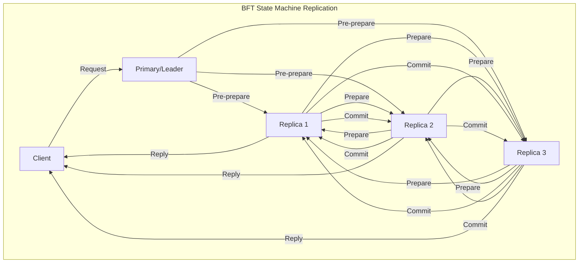
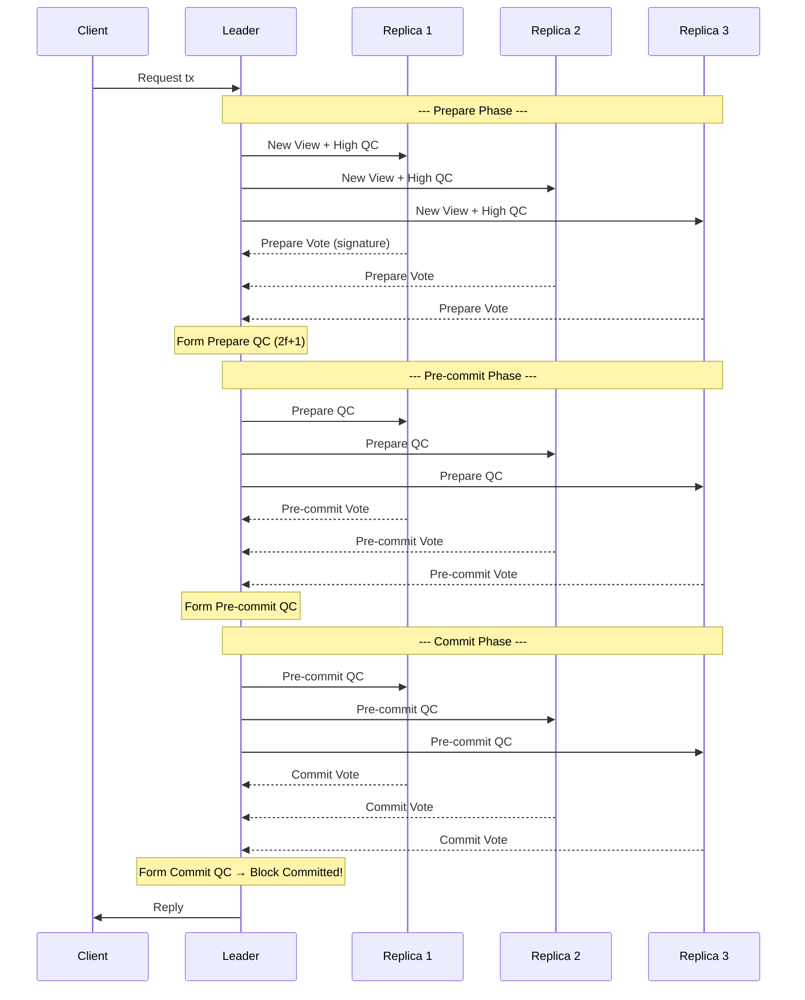
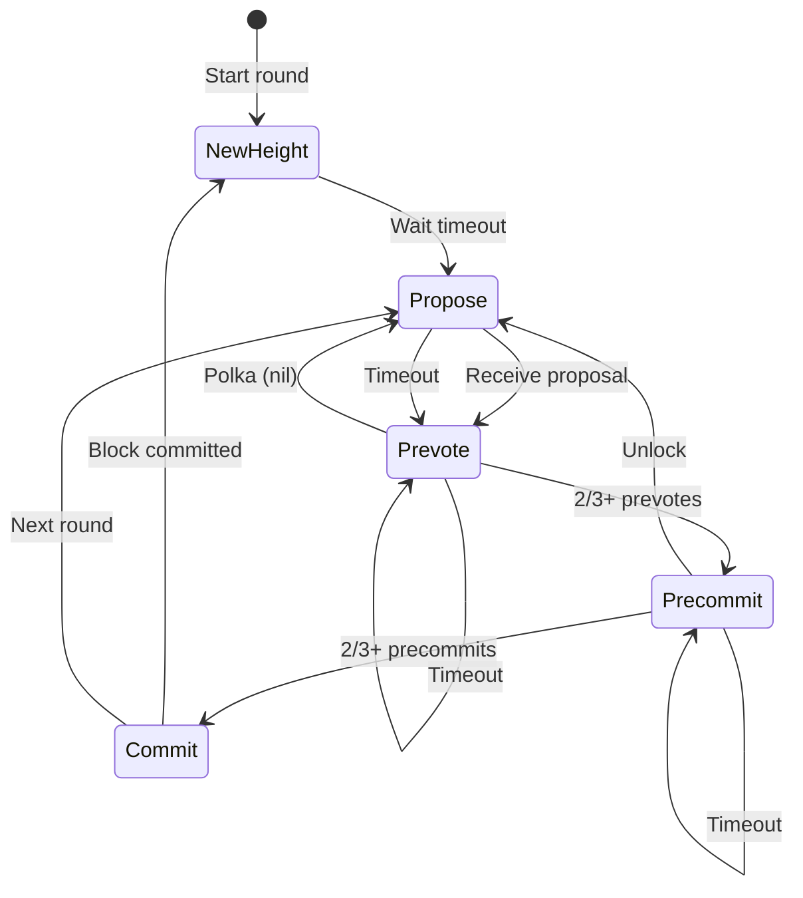

# Byzantine Fault Tolerance at Scale: HotStuff, Tendermint & Practical BFT Variants

## 1. Mục tiêu của task

Hiểu sâu bản chất Byzantine Fault Tolerance (BFT) trong hệ thống phân tán quy mô lớn, phân tích các giao thức BFT hiện đại (HotStuff, Tendermint, PBFT variants), và nắm vững các trade-off khi triển khai trong production.

**Câu hỏi cốt lõi cần trả lờI:**
- Tại sao BFT quan trọng hơn Crash Fault Tolerance (CFT) trong một số hệ thống?
- BFT đạt được consensus như thế nào khi có node malicious?
- Tại sao HotStuff được chọn làm nền tảng cho Diem (Facebook) và nhiều blockchain?
- Khi nào nên dùng Tendermint thay vì HotStuff?

---

## 2. Bản chất và cơ chế hoạt động

### 2.1 Byzantine Generals Problem - Bản chất vấn đề

Bài toán Byzantine Generals mô tả tình huống:
- N vị tướng cần đồng thuận về "tấn công" hay "rút lui"
- Một số tướng là traitor (có thể gửi thông điệp giả mạo)
- Traitor có thể collude để phá hoại consensus
- Mục tiêu: Tất cả loyal generals đồng thuận cùng quyết định

**Kết quả lý thuyết (Lamport 1982):**
> Với N nodes, cần ít nhất N ≥ 3f + 1 để tolerate f Byzantine faults.
> Nghĩa là: Chỉ cần 33% node malicious có thể phá hoại toàn bộ hệ thống.

```
Tại sao là 3f + 1?
┌─────────────────────────────────────────────────────────────────┐
│ Với f Byzantine nodes:                                          │
│ - f nodes có thể không phản hồi                                 │
│ - f nodes có thể gửi thông điệp xung đột cho các loyal nodes   │
│ - Loyal nodes (N-f) cần majority agreement trong số này         │
│                                                                 │
│ Điều kiện: N - f > 2f  →  N > 3f  →  N ≥ 3f + 1                │
└─────────────────────────────────────────────────────────────────┘
```

### 2.2 State Machine Replication (SMR) và BFT

BFT SMR đảm bảo:
1. **Safety**: Tất cả honest nodes thấy cùng log/transactions theo cùng thứ tự
2. **Liveness**: Hệ thống tiếp tục commit transactions mới (không deadlock)
3. **Total Order**: Tất cả nodes đồng ý về thứ tự toàn cục



---

## 3. Các giao thức BFT hiện đại

### 3.1 Practical Byzantine Fault Tolerance (PBFT) - 1999

**Bản chất:** Giao thức BFT đầu tiên thực tiễn, phổ biến trong academic.

**Luồng 3-phase commit:**

```
┌─────────────────────────────────────────────────────────────────────┐
│                    PBFT Normal Case Operation                       │
├─────────────────────────────────────────────────────────────────────┤
│                                                                     │
│  Client    Primary    Replica 1    Replica 2    Replica 3 (f=1)    │
│     │          │          │           │           │                │
│     │─────────>│          │           │           │                │
│     │  Request │          │           │           │                │
│     │          │─────────>│──────────>│──────────>│                │
│     │          │PRE-PREPARE│          │           │                │
│     │          │(View, Seq, Digest)   │           │                │
│     │          │          │           │           │                │
│     │          │<─────────│<──────────│<──────────│                │
│     │          │ PREPARE  │          │           │                │
│     │          │(2f matching pre-prepares)        │                │
│     │          │          │           │           │                │
│     │          │─────────>│──────────>│──────────>│                │
│     │          │ COMMIT   │           │           │                │
│     │          │(2f+1 matching prepares)          │                │
│     │          │          │           │           │                │
│     │<─────────│<─────────│<──────────│<──────────│                │
│     │  Reply (2f+1 matching commits)               │                │
│     │          │          │           │           │                │
└─────────────────────────────────────────────────────────────────────┘
```

**Cơ chế đảm bảo safety:**
1. **Pre-prepare**: Leader gán sequence number cho request, broadcast
2. **Prepare**: Mỗi node broadcast prepare khi nhận pre-prepare hợp lệ
3. **Prepared certificate**: Node có 2f+1 matching prepares (kể cả pre-prepare)
4. **Commit**: Broadcast commit khi có prepared certificate
5. **Committed**: Có 2f+1 matching commits → execute và reply client

**Vấn đề của PBFT trong production:**

| Vấn đề | Mô tả | Hệ quả |
|--------|-------|--------|
| **Quadratic message complexity** | O(n²) messages per request | Không scale quá 20-30 nodes |
| **View change phức tạp** | Chuyển leader tốn O(n³) messages | Downtime đáng kể khi leader fail |
| **Không có optimistic responsiveness** | Phải chờ timeout dù network nhanh | Latency cao trong happy path |
| **State transfer nặng** | New node cần copy toàn bộ state | Join/leave khó khăn |

---

### 3.2 HotStuff - 2018 (Dumbo, Libra/Diem)

**Bản chất:** Linear BFT protocol với chained consensus và optimistic responsiveness.

**Đột phá cốt lõi:**

```
┌──────────────────────────────────────────────────────────────────────┐
│                    HotStuff Chain Structure                          │
├──────────────────────────────────────────────────────────────────────┤
│                                                                      │
│  Block N-2        Block N-1         Block N         Block N+1       │
│  ┌─────────┐      ┌─────────┐      ┌─────────┐     ┌─────────┐      │
│  │ Parent  │─────>│ Parent  │─────>│ Parent  │────>│         │      │
│  │ QC(N-3) │      │ QC(N-2) │      │ QC(N-1) │     │         │      │
│  │ cmds    │      │ cmds    │      │ cmds    │     │         │      │
│  │         │      │         │      │         │     │         │      │
│  │ QC(N-2) │      │ QC(N-1) │      │ QC(N)   │     │         │      │
│  └─────────┘      └─────────┘      └─────────┘     └─────────┘      │
│                                                                      │
│  QC = Quorum Certificate (2f+1 signatures)                          │
│                                                                      │
└──────────────────────────────────────────────────────────────────────┘
```

**Luồng 3-phase linear (chained):**



**Tối ưu hóa chained:**

```
┌──────────────────────────────────────────────────────────────────────┐
│         HotStuff Chained Consensus (Pipelining)                      │
├──────────────────────────────────────────────────────────────────────┤
│                                                                      │
│  Vòng N      Vòng N+1     Vòng N+2     Vòng N+3                     │
│  ────────────────────────────────────────────────────────────────   │
│  Prepare ──> PreCommit ──> Commit ───> Decide Block N               │
│             Prepare ───> PreCommit ──> Commit Block N+1             │
│                          Prepare ───> PreCommit Block N+2           │
│                                       Prepare Block N+3             │
│                                                                      │
│  → Các phase overlap, pipeline liên tục                             │
│  → Throughput cao hơn PBFT rất nhiều                                │
└──────────────────────────────────────────────────────────────────────┘
```

**Ưu điểm then chốt của HotStuff:**

| Đặc điểm | PBFT | HotStuff | Ý nghĩa |
|----------|------|----------|---------|
| **Message complexity** | O(n²) | O(n) | Scale đến hàng trăm nodes |
| **View change** | O(n³) | O(n) | Leader rotation nhanh, liveness tốt |
| **Responsiveness** | Synchronous | Optimistic | Latency thấp khi network ổn định |
| **Chained structure** | No | Yes | Pipeline throughput cao |
| **Modular safety proof** | Complex | Simple | Dễ audit, đảm bảo đúng đắn |

**PAC (Propose-Accept-Commit) trong HotStuff:**

```
Bản chất 3-phase của HotStuff:

Phase 1 - PREPARE: Lock on proposal
  → Node vote nếu proposal tương thích với locked QC
  → Leader tổng hợp thành Prepare QC

Phase 2 - PRE-COMMIT: Acknowledge QC  
  → Node nhận Prepare QC, update locked QC
  → Vote tạo Pre-commit QC

Phase 3 - COMMIT: Finalize
  → Node nhận Pre-commit QC
  → Vote tạo Commit QC → block committed

→ Mỗi phase đảm bảo: Nếu f+1 honest commit block B,
  thì không block khác có thể committed trong cùng view
```

---

### 3.3 Tendermint - 2014 (Cosmos, BFT consensus)

**Bản chất:** BFT consensus kết hợp với Proof-of-Stake, thiết kế cho public blockchain.

**Kiến trúc:**

```
┌──────────────────────────────────────────────────────────────────────┐
│                    Tendermint Core Architecture                      │
├──────────────────────────────────────────────────────────────────────┤
│                                                                      │
│  ┌──────────────────────────────────────────────────────────────┐   │
│  │                    Application Layer (ABCI)                   │   │
│  │  ┌─────────┐  ┌─────────┐  ┌─────────┐  ┌─────────┐          │   │
│  │  │ CheckTx │  │DeliverTx│  │ Begin   │  │  End    │          │   │
│  │  │         │  │         │  │ Block   │  │ Block   │          │   │
│  │  └─────────┘  └─────────┘  └─────────┘  └─────────┘          │   │
│  └──────────────────────────────────────────────────────────────┘   │
│                              │ ABCI                                  │
│  ┌───────────────────────────┼───────────────────────────────┐       │
│  │              Tendermint Core (Consensus + P2P)              │       │
│  │  ┌─────────┐  ┌─────────┐  ┌─────────┐  ┌─────────┐        │       │
│  │  │Mempool  │  │Consensus│  │  P2P    │  │Evidence │        │       │
│  │  │(Tx pool)│  │ Engine  │  │ Layer   │  │  Pool   │        │       │
│  │  └─────────┘  └─────────┘  └─────────┘  └─────────┘        │       │
│  └─────────────────────────────────────────────────────────────┘       │
│                                                                      │
│  → ABCI cho phép Tendermint kết nối với bất kỳ state machine nào      │
│  → Application logic hoàn toàn tách biệt từ consensus                  │
└──────────────────────────────────────────────────────────────────────┘
```

**Luồng consensus (2-round voting):**



**Chi tiết 2-round voting:**

```
┌──────────────────────────────────────────────────────────────────────┐
│              Tendermint Consensus Rounds                             │
├──────────────────────────────────────────────────────────────────────┤
│                                                                      │
│  ROUND 1 (Happy Path):                                              │
│  ─────────────────────                                              │
│                                                                      │
│  Step 1 - PROPOSE:                                                  │
│    → Proposer (được chọn theo round & voting power) gửi block       │
│    → Block chứa: txs, prev block hash, timestamp, proposer sig      │
│                                                                      │
│  Step 2 - PREVOTE:                                                  │
│    → Validator kiểm tra block hợp lệ                                │
│    → Broadcast prevote cho block hash (hoặc nil nếu invalid)        │
│    → Nếu nhận 2/3+ prevotes cho block (POLKA) → chuyển precommit    │
│    → Nếu nhận 2/3+ nil prevotes → chuyển round mới                  │
│                                                                      │
│  Step 3 - PRECOMMIT:                                                │
│    → Validator broadcast precommit nếu đã thấy POLKA                 │
│    → Lock block tại round này (không prevote block khác)            │
│    → Nếu nhận 2/3+ precommits → block committed                     │
│    → Nếu timeout → unlock và chuyển round mới                       │
│                                                                      │
│  ROUND 2+ (Unhappy Path):                                           │
│  ────────────────────────                                           │
│    → Proposer mới được chọn                                         │
│    → Locked validators chỉ có thể prevote block đã lock             │
│    → Cần proof của POLKA từ round cũ để unlock                      │
│                                                                      │
└──────────────────────────────────────────────────────────────────────┘
```

**Tendermint vs HotStuff:**

| Tiêu chí | Tendermint | HotStuff | Nghĩa trong production |
|----------|------------|----------|------------------------|
| **Voting rounds** | 2 (prevote + precommit) | 3 (prepare + precommit + commit) | Tendermint nhanh hơn 1 round |
| **Block production** | Round-robin | Leader-based | Tendermint fairer, HotStuff có thể optimize leader |
| **Finality** | Instant | Instant | Cả hai đều single-block finality |
| **Forks** | Không thể (accountable safety) | Không thể | Cả hai đều fork-accountable |
| **PoS integration** | Native | Cần thêm layer | Tendermint thiết kế cho PoS |
| **Validator set change** | Block-by-block | View-based | Tendermint linh hoạt hơn |
| **Complexity** | Thấp hơn | Cao hơn | Tendermint dễ implement đúng |
| **Throughput** | ~1000-4000 TPS | ~5000-10000 TPS | HotStuff nhanh hơn với pipelining |

---

## 4. So sánh các lựa chọn BFT

### 4.1 Decision Matrix

```
┌──────────────────────────────────────────────────────────────────────────────┐
│                      BFT Protocol Selection Guide                             │
├──────────────────────────────────────────────────────────────────────────────┤
│                                                                              │
│  Use Case                    →    Recommended Protocol                       │
│  ─────────────────────────────────────────────────────────────              │
│                                                                              │
│  Public blockchain, PoS      →    Tendermint, HotStuff                       │
│  (Cosmos, Diem, Celo)                                                        │
│                                                                              │
│  Private/consortium chain    →    HotStuff, PBFT                             │
│  (< 50 nodes, high throughput)                                               │
│                                                                              │
│  High-scale BFT (>100 nodes) →    HotStuff variants (Dumbo, Fast-HotStuff)   │
│                                                                              │
│  Research/academic           →    PBFT (baseline comparison)                 │
│                                                                              │
│  Latency-critical (<1s)      →    HotStuff (optimistic responsiveness)       │
│                                                                              │
│  Simplicity & auditability   →    Tendermint (cleaner design)                │
│                                                                              │
└──────────────────────────────────────────────────────────────────────────────┘
```

### 4.2 Modern BFT Variants

**Dumbo BFT:**
- Loại bỏ assumption về network stability
- Giải quyết " asynchronous BFT" problem
- Nguyên lý: Sử dụng multi-value validated Byzantine agreement (MVBA)
- Phù hợp: WAN environments với network partitions

**Fast-HotStuff:**
- Giảm từ 3 round xuống 2 round trong happy path
- Tích hợp pipelining vào chained structure
- Commit latency: 2 message delays (so với 3 của HotStuff)
- Trade-off: Complex view change logic

**Streamlet:**
- Minimalist BFT: Chỉ 2 message types
- Epoch-based, đơn giản hơn HotStuff
- Trade-off: Throughput thấp hơn

**Narwhal & Tusk/Bullshark:**
- Tách biệt data dissemination khỏi consensus
- Narwhal: DAG-based mempool cho high throughput
- Tusk/Bullshark: Consensus engine trên DAG
- Throughput: 160k+ TPS trong test (Meta/Diem team)

---

## 5. Rủi ro, anti-patterns, lỗi thường gặp

### 5.1 Production Failure Modes

```
┌──────────────────────────────────────────────────────────────────────────────┐
│                    BFT Production Failure Modes                               │
├──────────────────────────────────────────────────────────────────────────────┤
│                                                                              │
│  1. LIVENESS FAILURE - Hệ thống dừng commit                                  │
│     ─────────────────────────────────────────                                │
│     Nguyên nhân:                                                             │
│     • Network partition kéo dài > timeout thresholds                        │
│     • 1/3 nodes crash đồng thời (hoặc malicious)                            │
│     • View change storm (leader liên tục bị suspect)                        │
│     • Clock skew giữa các nodes > threshold                                  │
│                                                                              │
│     Mitigation:                                                              │
│     • Adaptive timeouts dựa trên network conditions                         │
│     • Health monitoring và automatic recovery                               │
│     • Heterogeneous timeouts (different nodes different thresholds)         │
│                                                                              │
│  2. SAFETY VIOLATION - Double spending / Inconsistent commit                 │
│     ────────────────────────────────────────────────                         │
│     Nguyên nhân:                                                             │
│     • Implementation bug (race condition trong vote counting)               │
│     • Cryptographic failure (signature scheme)                              │
│     • Quorum certificate validation bug                                      │
│     • Fork trong view change logic                                           │
│                                                                              │
│     Mitigation:                                                              │
│     • Formal verification cho critical path                                 │
│     • Multiple implementation diversity (khác team/codebase)                │
│     • Extensive fuzz testing + model checking                               │
│                                                                              │
│  3. PERFORMANCE DEGRADATION                                                  │
│     ────────────────────────────                                             │
│     Nguyên nhân:                                                             │
│     • Validator set quá lớn (quadratic overhead trong một số protocol)      │
│     • Block size không tối ưu                                                │
│     • State bloat ảnh hưởng verification time                               │
│     • Network bottleneck tại leader                                          │
│                                                                              │
│     Mitigation:                                                              │
│     • Sharding / committee selection (random subset for consensus)          │
│     • State pruning và snapshotting                                         │
│     • Pipelining và optimistic execution                                    │
│                                                                              │
└──────────────────────────────────────────────────────────────────────────────┘
```

### 5.2 Anti-patterns trong triển khai BFT

**Anti-pattern #1: Đồng bộ network timeouts**
```java
// ❌ Sai: Tất cả nodes dùng cùng timeout
static final long TIMEOUT = 5000; // 5s cho mọi node

// ✅ Đúng: Adaptive timeouts dựa trên RTT percentile
long timeout = calculateAdaptiveTimeout(
    historicalRTTs, 
    percentile(0.99) * 2  // 2x của 99th percentile
);
```

**Anti-pattern #2: Bỏ qua equivocation detection**
```
❌ Sai: Không detect/punish khi validator vote cho 2 conflicting blocks
→ Malicious validator có thể cause fork mà không bị penalty

✅ Đúng: 
• Lưu tất cả votes vào evidence pool
• Slash validator khi phát hiện double vote
• Accountability: Xác định chính xác malicious nodes
```

**Anti-pattern #3: Deterministic execution non-deterministic**
```java
// ❌ Sai: Non-deterministic trong state machine
long timestamp = System.currentTimeMillis(); // Khác nhau mỗi node
Random rand = new Random(); // Khởi tạo khác nhau

// ✅ Đúng: Deterministic execution
long timestamp = block.getTimestamp(); // Từ consensus
Random rand = new Random(block.getHash()); // Seed từ block
```

**Anti-pattern #4: Không xử lý view change đúng cách**
```
❌ Sai: View change chỉ dựa trên local timeout
→ Có thể cause unnecessary view changes
→ Liveness issues

✅ Đúng:
• View change khi: timeout + không thấy 2f+1 cho proposal
• Forward latest QC trong view change message
• Chờ f+1 view change messages trước khi switch
```

### 5.3 Edge Cases

**Case 1: Network partition + Recovery**
```
Scenario: Network chia làm 2 partitions (f và 2f+1 nodes)

Partition A (2f+1 nodes):
  → Tiếp tục commit blocks
  → Height tăng

Partition B (f nodes):
  → Dừng commit (không đủ quorum)
  → Height đứng yên

Khi merge lại:
  → Partition B cần state sync từ Partition A
  → Replay committed blocks
  → CATCH-UP protocol critical!
```

**Case 2: Validator set change mid-consensus**
```
Vấn đề: Validator set thay đổi trong khi đang consensus

Solution:
  • Delay validator set change đến block N+2
  • Block N: Chứa thông tin change
  • Block N+1: Last block với old set
  • Block N+2: First block với new set
  
  → Đảm bảo không có "half-and-half" consensus round
```

---

## 6. Khuyến nghị thực chiến trong production

### 6.1 Monitoring & Observability

```yaml
# Critical metrics cho BFT system
bft_consensus:
  # Liveness metrics
  - block_height: Gauge              # Height hiện tại
  - block_interval: Histogram         # Thời gian giữa các blocks
  - rounds_per_block: Histogram       # Số round cần để commit 1 block
  
  # Consensus metrics  
  - consensus_round_duration: Histogram
  - view_changes_total: Counter
  - view_change_reason: Counter (labels: timeout|suspect|network)
  
  # Validator metrics
  - validator_participation_rate: Gauge
  - missed_blocks_per_validator: Counter
  - equivocation_detected: Counter
  
  # Network metrics
  - message_propagation_time: Histogram
  - quorum_formation_time: Histogram
  - vote_receive_latency: Histogram
```

### 6.2 Configuration Best Practices

```yaml
bft_configuration:
  # Validator set
  max_validators: 100           # >100 validators → dùng committee selection
  min_validators: 4             # 3f+1 với f=1
  
  # Timeouts - GEOMETRIC BACKOFF
  timeout_base: 1s
  timeout_max: 30s
  timeout_multiplier: 1.5       # Exponential backoff
  
  # Block parameters
  block_max_size: 1_000_000     # 1MB
  block_max_txs: 10000
  block_time_target: 1s         # Target block interval
  
  # Memory limits
  mempool_max_size: 10000
  evidence_max_age: 100000      # blocks
  
  # State sync
  snapshot_interval: 1000       # blocks
  state_sync_chunk_size: 10_000_000  # 10MB
```

### 6.3 Deployment Patterns

```
┌──────────────────────────────────────────────────────────────────────────────┐
│                    BFT Production Deployment                                  │
├──────────────────────────────────────────────────────────────────────────────┤
│                                                                              │
│  Validator Node Architecture:                                                │
│  ────────────────────────────                                                │
│                                                                              │
│  ┌──────────────────────────────────────────────────────────────────────┐   │
│  │                         Validator Node                               │   │
│  │  ┌──────────────┐  ┌──────────────┐  ┌──────────────────────────┐   │   │
│  │  │   Sentry     │  │   Sentry     │  │       Validator          │   │   │
│  │  │   Node 1     │  │   Node 2     │  │       (Core)             │   │   │
│  │  │              │  │              │  │  ┌────────────────────┐  │   │   │
│  │  │ P2P ingress  │  │ P2P ingress  │  │  │ Consensus Engine   │  │   │   │
│  │  │ DDoS protect │  │ DDoS protect │  │  │ - HotStuff/        │  │   │   │
│  │  │ Rate limit   │  │ Rate limit   │  │  │   Tendermint       │  │   │   │
│  │  └──────────────┘  └──────────────┘  │  │ - Vote signing     │  │   │   │
│  │           │               │          │  │ - QC validation    │  │   │   │
│  │           └───────┬───────┘          │  └────────────────────┘  │   │   │
│  │                   │                  │  ┌────────────────────┐  │   │   │
│  │                   ▼                  │  │  HSM/Secure Enclave│  │   │   │
│  │           ┌──────────────┐           │  │  - Key storage     │  │   │   │
│  │           │   Private    │◄──────────│  │  - Signing ops     │  │   │   │
│  │           │   Network    │           │  └────────────────────┘  │   │   │
│  │           └──────────────┘           └──────────────────────────┘   │   │
│  └──────────────────────────────────────────────────────────────────────┘   │
│                                                                              │
│  → Validator KHÔNG expose trực tiếp ra public internet                       │
│  → Sentry nodes chịu tải P2P, relay messages                                 │
│  → HSM bảo vệ private key khỏi extraction                                    │
│                                                                              │
└──────────────────────────────────────────────────────────────────────────────┘
```

### 6.4 Upgrade Strategy

```
BFT Consensus Upgrade Process:

Phase 1: Protocol Change Proposal
  → Đề xuất change trong governance (nếu có)
  → Review security audit
  → Testnet deployment

Phase 2: Version Negotiation
  → Nodes advertise supported protocol version
  → Supermajority (2/3+) phải support mới upgrade

Phase 3: Coordinated Switch
  → Upgrade xảy ra tại specific block height
  → Dual-code support trong transition window
  → Rollback plan nếu có issue

Phase 4: Post-upgrade Monitoring
  → Theo dõi consensus metrics
  → Verify all nodes participating
  → Monitor for equivocation/evidence
```

---

## 7. Kết luận

**Bản chất của BFT at scale:**

> Byzantine Fault Tolerance không chỉ là một giao thức consensus — nó là một **trade-off space** giữa safety, liveness, performance, và complexity. Trong production, ưu tiên hàng đầu không phải throughput cao nhất, mà là **predictability** và **graceful degradation**.

**Chốt lại các điểm then chốt:**

1. **HotStuff** phù hợp cho private/consortium chains cần high throughput và low latency, với cost là implementation complexity.

2. **Tendermint** phù hợp cho public PoS blockchains cần simplicity và strong accountability, với cost là slightly lower throughput.

3. **Quadratic message complexity** (PBFT) là enemy của scale — luôn prefer linear protocols (HotStuff variants) khi >20 validators.

4. **Liveness failures** (không thể commit block) phổ biến hơn safety violations — invest vào monitoring và adaptive timeouts.

5. **Deterministic execution** là non-negotiable — bất kỳ non-determinism nào cũng có thể cause consensus divergence.

**When to use BFT vs Raft/Paxos:**

| Scenario | Use | Lý do |
|----------|-----|-------|
| Controlled environment (data center) | Raft/Paxos | Simple, fewer failure modes |
| Multi-party/Byzantine participants | BFT | Tolerate malicious behavior |
| Public blockchain | BFT | Không tin tưởng bất kỳ ai |
| High-value financial system | BFT | Accountability + auditability |
| Internal microservices | Raft | Không cần chống malicious |

---

## 8. References

1. Castro, Liskov - "Practical Byzantine Fault Tolerance" (1999)
2. Yin et al. - "HotStuff: BFT Consensus in the Lens of Blockchain" (2018)
3. Kwon - "Tendermint: Consensus without Mining" (2014)
4. Buchman, Kwon, Milosevic - "The latest gossip on BFT consensus" (2018)
5. Guo et al. - "Dumbo: Faster Asynchronous BFT Protocols" (2020)
6. Danezis et al. - "Narwhal and Tusk: A DAG-based Mempool" (2022)
