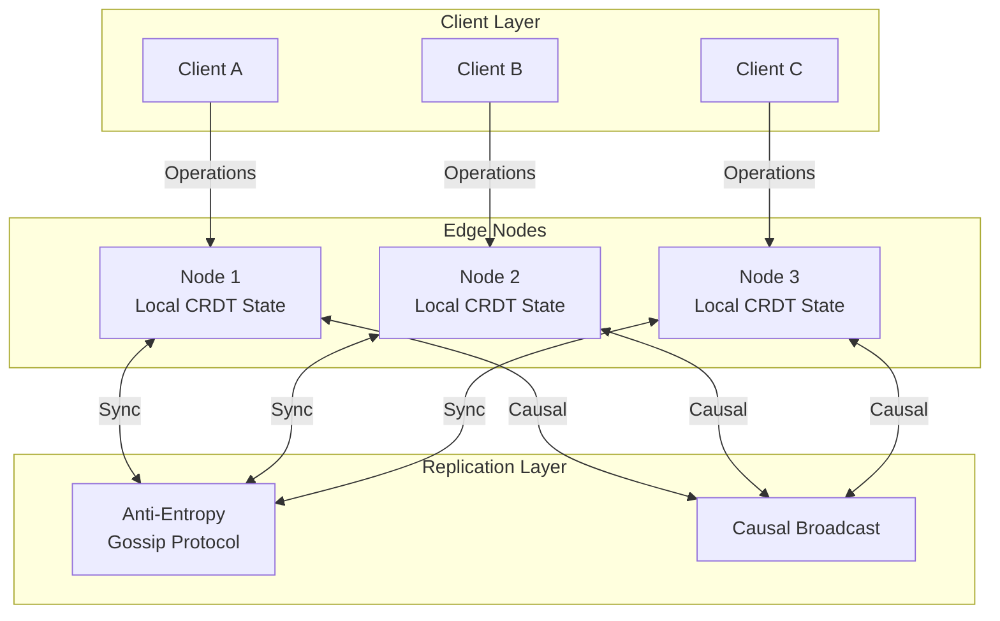
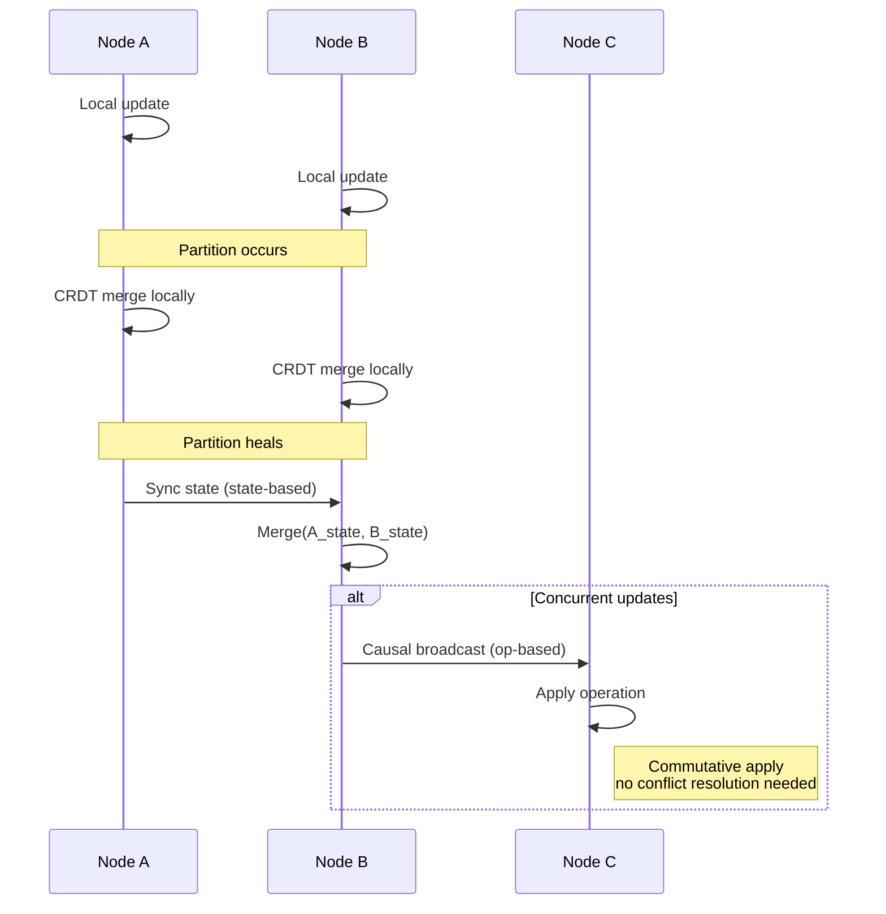
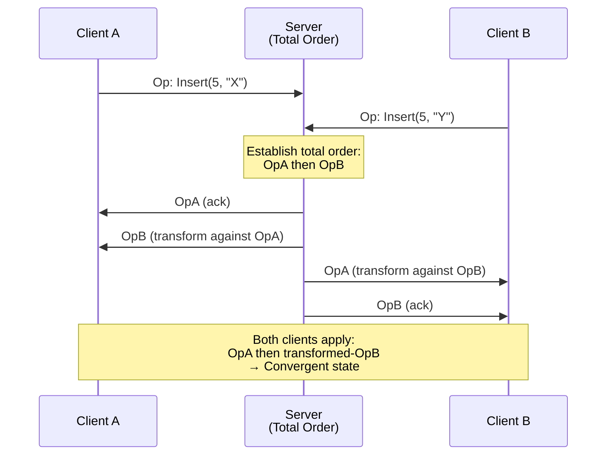

# Consensusless Coordination: CRDTs, Operational Transforms & Conflict-Free Replication

## 1. Mục tiêu của Task

Hiểu sâu các cơ chế **coordination không cần consensus** - những kỹ thuật cho phép hệ thống phân tán đạt được consistency mà không cần đồng thuận toàn cục (global consensus). Đây là nền tảng của các hệ thống highly-available, partition-tolerant với latency thấp.

**Bản chất vấn đề:**
- Consensus protocols (Paxos, Raft) yêu cầu majority quorums → latency cao, không available khi partition
- Coordination-free systems cho phép các node tiến triển độc lập → cần cơ chế merge conflicts tự động
- CRDTs và OT là hai hướng tiếp cận chính: **convergence** vs **serialization**

---

## 2. Bản Chất và Cơ Chế Hoạt Động

### 2.1 Tại Sao Cần Consensusless?

**CAP Theorem reminder:** Trong partition, phải chọn Availability hoặc Consistency. Consensus-based systems chọn Consistency. Consensusless systems chọn Availability + eventual consistency.

**Vấn đề với Consensus:**

| Khía cạnh | Consensus | Consensusless |
|-----------|-----------|---------------|
| Latency | 2-3 RTT (cross-region: 100-500ms) | Local (0-10ms) |
| Availability | Unavailable khi minority partition | Always available |
| Throughput | Limited by leader | Linear scalability |
| Complexity | Complex failure modes | Simpler, predictable |

**Trade-off chính:** Consistency ngay lập tức vs Availability liên tục.

> **Lưu ý quan trọng:** "Consensusless" không có nghĩa là "không cần coordination". Mà là coordination được deferred đến merge time, không phải operation time.

### 2.2 CRDTs (Conflict-Free Replicated Data Types)

**Bản chất:** CRDTs là data structures được thiết kế để **tự động merge** mà không cần conflict resolution manual.

**Hai loại CRDTs:**

#### 2.2.1 State-based CRDTs (Convergent)

**Cơ chế:** Mỗi node giữ toàn bộ state. Khi merge, áp dụng **join semilattice** operation.

```
State tại node A: SA
State tại node B: SB
Merge: SA ⊔ SB (least upper bound)
Yêu cầu: ⊔ phải associative, commutative, idempotent
```

**Ví dụ - G-Counter (Grow-only Counter):**

```
State: vector V[n] (mỗi node có slot riêng)
Increment tại node i: V[i]++
Merge: V[k] = max(VA[k], VB[k]) for all k
Value: sum(V)
```

**Tại sao converge được?**
- `max()` là associative: `max(a, max(b,c)) = max(max(a,b), c)`
- `max()` là commutative: `max(a,b) = max(b,a)`
- `max()` là idempotent: `max(a,a) = a`

**Đặc điểm State-based:**
- State có thể lớn (O(n) với n = số nodes)
- Merge bất kỳ lúc nào
- Phù hợp: sporadic sync, large payloads

#### 2.2.2 Operation-based CRDTs (Commutative)

**Cơ chế:** Chỉ replicate **operations**, không replicate state. Yêu cầu operations phải **commutative**.

```
Node A thực hiện op1 → broadcast
Node B thực hiện op2 → broadcast
Mỗi node nhận: {op1, op2} và apply theo bất kỳ thứ tự nào
Kết quả cuối cùng phải giống nhau
```

**Ví dụ - Add-Wins Set:**

```
Operations: Add(e, timestamp) | Remove(e, timestamp)
Conflict resolution: Timestamp lớn hơn win
Tính chất: Add và Remove không commutative
Giải pháp: Lamport timestamp + bias (add > remove nếu ts equal)
```

**Đặc điểm Operation-based:**
- State nhỏ hơn (chỉ lưu operations hoặc compressed state)
- Yêu cầu reliable broadcast (exactly-once delivery)
- Phù hợp: frequent updates, continuous sync

**So sánh State-based vs Operation-based:**

| Tiêu chí | State-based | Operation-based |
|----------|-------------|-----------------|
| Message size | State (potentially large) | Operations (small) |
| Delivery requirement | At-least-once | Exactly-once |
| Merge timing | Anytime | Sequential apply |
| Network partition | Tolerate well | Needs buffering |
| Implementation | Simpler | Complex (idempotency) |

### 2.3 Operational Transforms (OT)

**Bản chất:** OT giải quyết vấn đề **serialization** của concurrent operations trên shared document.

**Vấn đề cơ bản:**

```
Initial: "Hello"
User A (position 5) insert " World" → "Hello World"
User B (position 5) insert "!" → "Hello!"

Nếu apply tuần tự:
A then B: "Hello World!" (đúng)
B then A: "Hello World" (sai - "!" bị đẩy về position 5)
```

**Cơ chế OT:**

```
Khi operation O2 đến sau O1 đã được apply:
- Transform O2 against O1 → O2'
- Apply O2'

Transformation function: T(O2, O1) = O2'
```

**Properties của transformation functions:**

1. **TP1 (Convergence):** `T(O2, O1) = O2'` và `T(O1, O2) = O1'` thì `apply(O1, O2') = apply(O2, O1')`
2. **TP2 (Intention preservation):** Nếu O1 || O2 (concurrent), thứ tự transform không ảnh hưởng kết quả

**Ví dụ - String Insert/Delete:**

```java
// Insert vs Insert
transform(Insert(pos1, str1), Insert(pos2, str2)):
    if pos1 < pos2: return Insert(pos1, str1)  // Không đổi
    if pos1 > pos2: return Insert(pos1 + len(str2), str1)  // Dịch phải
    if pos1 == pos2: resolve by priority/site ID

// Delete vs Insert
transform(Delete(pos1, len1), Insert(pos2, str2)):
    if pos1 < pos2: return Delete(pos1, len1)
    if pos1 >= pos2: return Delete(pos1 + len(str2), len1)
```

**Complexity của OT:**

- **Cơ chế phức tạp:** Cần định nghĩa transform function cho mọi cặp operation types
- **Hard to prove correctness:** TP1 và TP2 rất khó verify cho complex types
- **Centralized coordination:** Thường cần server để đảm bảo total order

**OT vs CRDTs:**

| Tiêu chí | OT | CRDTs |
|----------|-----|-------|
| Approach | Serialization (total order) | Convergence (partial order) |
| Conflict handling | Transform to avoid | Design để merge tự động |
| Implementation | Complex | Relatively simpler |
| Real-time editing | Google Docs, MS Word | Figma, Apple Notes |
| Offline support | Hard (needs rebase) | Native support |
| Scalability | Limited by coordination | Better scalability |

### 2.4 Conflict-Free Replication

**Bản chất:** Replication strategies cho phép **divergence temporary** rồi **converge eventually**.

#### 2.4.1 Anti-Entropy Mechanisms

**Gossip Protocols:**

```
Mỗi node định kỳ:
1. Chọn random peer
2. Exchange digests (hash trees, bloom filters)
3. Identify missing data
4. Sync differences

Tính chất: O(log n) rounds để propagate toàn bộ cluster
```

**Merkle Trees:**

```
              Root (hash)
            /            \
       H(A+B)           H(C+D)
       /    \            /    \
      A      B          C      D

So sánh trees: chỉ cần traverse path có difference
```

#### 2.4.2 Version Vectors & Vector Clocks

**Mục tiêu:** Track causality giữa events mà không cần global clock.

```
Vector clock: V[node_id] = logical_time

So sánh:
- V1 < V2: V1 happened-before V2
- V1 || V2: Concurrent (conflict!)

Example:
V1 = [1, 0, 0]  // Node A xử lý 1 event
V2 = [1, 1, 0]  // V2 > V1 (happened after)
V3 = [0, 0, 1]  // V3 || V1 (concurrent)
```

**Dotted Version Vectors (DVV):** Optimization cho metadata size.

---

## 3. Kiến Trúc và Luồng Xử Lý

### 3.1 System Architecture với CRDTs



### 3.2 Conflict Resolution Flow



### 3.3 Operational Transform Flow (Centralized)



---

## 4. So Sánh Các Lựa Chọn

### 4.1 When to use what?

| Use Case | Recommended | Lý do |
|----------|-------------|-------|
| Collaborative text editing | OT hoặc CRDT (peritext) | Intention preservation |
| Shopping cart, counters | CRDT (G-Counter, OR-Set) | Simple, always available |
| Real-time game state | CRDT (custom) | Low latency, offline first |
| Distributed configuration | CRDT (LWW-Register) | Simple convergence |
| Calendar/scheduling | CRDT (OR-Map) | Concurrent updates common |
| Financial transactions | **NOT consensusless** | Need strong consistency |
| Inventory management | CRDT với reservations | Availability + constraints |

### 4.2 CRDT Types Selection Guide

```
Counter → G-Counter (increment only) hoặc PN-Counter (increment/decrement)
Set → OR-Set (add-wins) hoặc LWW-Set (timestamp-based)
Map → OR-Map (nested CRDTs)
Register → LWW-Register (last-write-wins) hoặc MV-Register (multi-value)
Graph → CRDT Graph (add/remove edges)
Tree → WOOT hoặc TreeDoc (collaborative editing)
Sequence → RGA, Logoot, YATA (ordered collections)
```

---

## 5. Rủi Ro, Anti-patterns, Lỗi Thường Gặp

### 5.1 CRDTs Anti-patterns

**1. Ignoring Growth of State**

> **Vấn đề:** State-based CRDTs (đặc biệt là OR-Set) có thể grow vô hạn do tombstones.

```
OR-Set cần lưu "removed" elements để handle concurrent add/remove
→ State tăng dần theo thời gian

Giải pháp:
- Causal stability detection: remove tombstones khi tất cả nodes đã thấy remove
- Delta-based CRDTs: chỉ sync differences
- Compaction/Archiving
```

**2. Assuming Causality for Business Logic**

```java
// ANTI-PATTERN: Dùng CRDT timestamp cho business ordering
Order order = crdtMap.get(orderId);
if (order.timestamp > otherOrder.timestamp) {
    // Không đúng! CRDT timestamps chỉ cho causality,
    // không đảm bảo total order cho business logic
}
```

**3. Mixing Strong and Eventual Consistency**

```
Hệ thống cần consistency boundary rõ ràng:
- User profile: CRDT (eventual)
- Account balance: Consensus-based (strong)

Không dùng CRDT cho data cần invariants phức tạp
```

### 5.2 OT Anti-patterns

**1. Missing Transformation Cases**

> **Nguy hiểm:** Nếu thiếu transform function cho một cặp operation types → divergence.

```
Ví dụ: Implement Insert/Delete transform nhưng quên Insert/Format
→ Kết quả phụ thuộc thứ tự apply → mất consistency
```

**2. Ignoring Undo/Redo Complexity**

```
Undo trong OT rất phức tạp:
- Operation đã được transform nhiều lần
- Cần inverse operation + transform lại
→ Thường gây lỗi intention violation

Giải pháp: Dùng CRDT-based approaches cho undo (như Yjs)
```

### 5.3 Common Pitfalls

| Pitfall | Hệ quả | Giải pháp |
|---------|--------|-----------|
| No causality tracking | Lost updates | Vector clocks hoặc hybrid logical clocks |
| Ignoring network delays | False conflicts | Bounded clocks, uncertainty intervals |
| Over-merging CRDTs | Performance degradation | Sharding, delta-sync |
| Missing rollback | Irreversible errors | Versioning, snapshots |
| Naïve LWW | Arbitrary data loss | Hybrid logical clocks + tie-breakers |

---

## 6. Khuyến Nghị Thực Chiến trong Production

### 6.1 Implementation Strategies

**1. Start with Existing Libraries**

```
Java: Akka Distributed Data, Riak CRDTs
JavaScript: Yjs, Automerge
Rust: crdts crate
General: Redis CRDT (Redis Enterprise), AntidoteDB
```

**2. Hybrid Approach**

```
┌─────────────────────────────────────┐
│         Application Layer           │
│  CRDT for user-facing operations    │
│  Consensus for critical invariants  │
└─────────────────────────────────────┘
              │
┌─────────────────────────────────────┐
│        Coordination Layer           │
│  Vector clocks for causality        │
│  Gossip for anti-entropy            │
└─────────────────────────────────────┘
```

**3. Monitoring & Observability**

**Metrics cần track:**
- **Divergence window:** Thời gian state khác nhau giữa nodes
- **Merge frequency:** Số lần merge per second
- **State size growth:** CRDT metadata overhead
- **Causal staleness:** How far behind is each node

```java
// Example: Tracking divergence
public class CRDTMetrics {
    // Histogram of merge times
    private final Histogram mergeLatency;
    
    // Gauge of state size per node
    private final Gauge stateSize;
    
    // Counter of conflicts resolved automatically
    private final Counter autoConflicts;
}
```

### 6.2 Production Checklist

**Before deploying CRDTs:**

- [ ] State growth bounded (tombstone cleanup strategy)
- [ ] Causal stability detection implemented
- [ ] Delta sync optimization enabled
- [ ] Rollback/snapshot capability tested
- [ ] Conflict metrics alerting configured
- [ ] Capacity planning for worst-case state size

**Before deploying OT:**

- [ ] All operation pairs có transform functions
- [ ] TP1, TP2 verified (formal proof hoặc extensive testing)
- [ ] Centralized coordination (server) cho total order
- [ ] Client rebase strategy khi reconnect
- [ ] Undo/redo behavior tested thoroughly

### 6.3 Testing Strategies

**Property-based Testing:**

```
Cần verify:
1. Convergence: ∀ states, merge(a, b) = merge(b, a)
2. Associativity: merge(a, merge(b, c)) = merge(merge(a, b), c)
3. Idempotency: merge(a, a) = a
4. Causality: if a → b then merge(a, b) = b
```

**Jepsen-style Testing:**

```
1. Network partition injection
2. Concurrent operation generation
3. Verify all nodes converge to same state
4. Verify causality preservation
```

---

## 7. Kết Luận

**Bản chất cốt lõi:**

Consensusless coordination chuyển cost từ **operation time** (waiting for consensus) sang **merge time** (resolving conflicts). Đây là trade-off cơ bản giữa latency và complexity.

**Key takeaways:**

1. **CRDTs** phù hợp cho: counters, sets, maps, shopping carts, presence indicators - nơi business logic tolerate eventual consistency.

2. **OT** phù hợp cho: collaborative text editing - nơi intention preservation quan trọng hơn offline availability.

3. **Không có silver bullet:** Financial transactions, inventory constraints cần consensus hoặc hybrid approaches.

4. **State management là core challenge:** Tombstones, causality tracking, và garbage collection quyết định production viability.

**Khi nào dùng:**
- ✅ High availability requirements (99.999%)
- ✅ Geographic distribution (multi-region)
- ✅ Offline-first applications
- ✅ Temporary partitions expected

**Khi nào KHÔNG dùng:**
- ❌ Strong consistency required (banking, inventory)
- ❌ Complex invariants cần validation
- ❌ Sequential ordering quan trọng hơn availability

**Hướng phát triển hiện đại:**
- **Delta CRDTs:** Giảm sync payload
- **Pure operation-based:** Yjs, Automerge approaches
- **Hybrid logical clocks:** Kết hợp physical và logical time
- **Byzantine-tolerant CRDTs:** Chống malicious nodes

---

## 8. Tài Liệu Tham Khảo

1. **"A comprehensive study of Convergent and Commutative Replicated Data Types"** - Shapiro et al. (2011)
2. **"Conflict-free Replicated Data Types"** - Shapiro et al. (2011)
3. **"Operational Transformation in Real-Time Group Editors"** - Sun & Ellis (1998)
4. **"Efficient Reconciliation and Flow Control for Anti-Entropy Protocols"** - Van et al. (2008)
5. **Automerge Documentation** - automerge.org
6. **Yjs: Shared Editing Framework** - yjs.dev

---

*Document này tập trung vào bản chất và trade-offs, không phải implementation details. Mục tiêu là giúp architects đưa ra quyết định đúng về khi nào và tại sao sử dụng consensusless coordination.*
