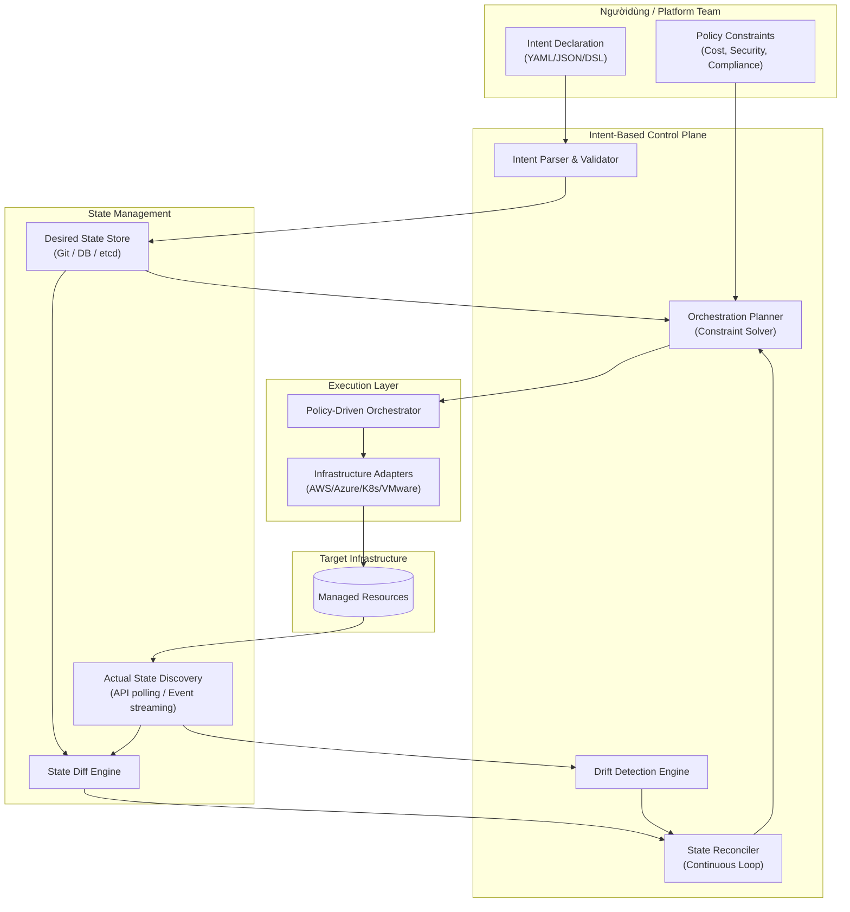
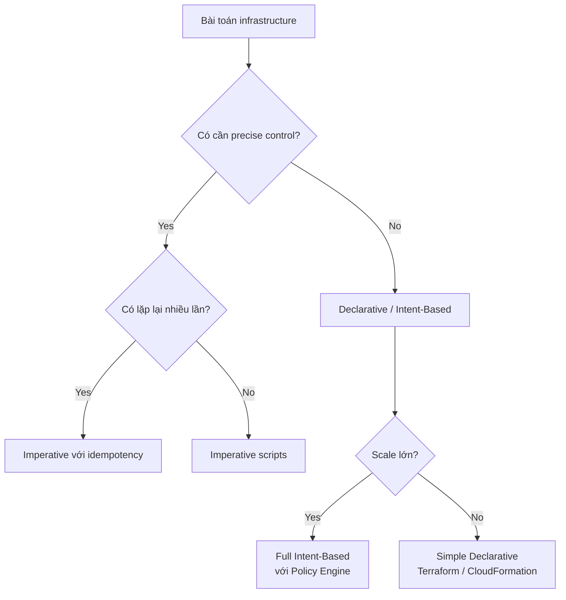

# Intent-Based Infrastructure (IBI)

## 1. Mục tiêu của Task

Hiểu bản chất của **Intent-Based Infrastructure** - paradigm shift từ cách quản lý infrastructure truyền thống (imperative) sang mô hình declarative dựa trên "ý định" (intent). Phân tích cơ chế hoạt động, kiến trúc, trade-offs và ứng dụng thực tế trong production.

---

## 2. Bản Chất và Cơ Chế Hoạt Động

### 2.1 Định nghĩa cốt lõi

> **Intent-Based Infrastructure** là mô hình quản lý hệ thống trong đó ngườidùng khai báo **kết quả mong muốn** (what), hệ thống tự động tính toán và thực hiện các bước cần thiết (how) để đạt được trạng thái đó.

**Sự khác biệt cơ bản:**

| Khía cạnh | Imperative (Traditional) | Declarative/Intent-Based |
|-----------|--------------------------|--------------------------|
| Input | Các bước thực hiện (commands) | Trạng thái mong muốn (desired state) |
| Tư duy | "Làm thế này, rồi làm thế kia" | "Tôi muốn hệ thống như thế này" |
| Idempotency | Khó đảm bảo | Tự nhiên có được |
| Reversibility | Phức tạp, cần undo scripts | Rollback = apply previous state |
| Audit trail | Log commands execution | Versioned desired state |

### 2.2 Kiến trúc tổng quan



### 2.3 Cơ chế hoạt động chi tiết

#### A. Intent Parsing & Validation

Intent không đơn thuần là configuration file. Nó bao gồm:

1. **Functional Intent**: Mô tả resource cần có (VD: "Web service xử lý 10k RPS")
2. **Non-functional Intent**: Ràng buộc về cost, latency, availability
3. **Policy Constraints**: Quy định từ tổ chức (VD: "Không dùng public subnet cho database")

**Ví dụ Intent (Giả lập):**
```yaml
intent:
  service: payment-api
  requirements:
    throughput: "10000 rps"
    latency_p99: "50ms"
    availability: "99.99%"
    max_monthly_cost: "$5000"
  policies:
    - region_restriction: ["us-east-1", "eu-west-1"]
    - encryption: "required_at_rest_and_transit"
    - network_isolation: "private_subnets_only"
```

**Validator** sẽ kiểm tra:
- Intent có hợp lệ về cú pháp không?
- Có feasible solution không? (VD: 10k RPS với cost <$5000 có khả thi không?)
- Có vi phạm hard policies không?

#### B. Orchestration Planner (Constraint Solver)

Đây là phần "brain" của hệ thống. Planner nhận intent và tính toán:

1. **Resource Mapping**: Chuyển abstract intent thành concrete resources
   - "10k RPS" → cần 5 pods x 2 CPU, ELB, Auto-scaling policy
   
2. **Optimization**: Tối ưu theo constraints
   - Minimize cost trong khi đáp ứng throughput
   - Prefer spot instances nếu workload fault-tolerant
   
3. **Dependency Resolution**: Thứ tự provisioning
   - VPC trước Subnet
   - Subnet trước EC2
   - Database trước Application

**Cơ chế solver phổ biến:**
- **SAT Solver**: Boolean satisfiability cho simple constraints
- **SMT Solver**: Satisfiability Modulo Theories cho complex arithmetic constraints
- **Linear Programming**: Tối ưu cost/performance
- **Heuristic Search**: Greedy algorithms, A* cho large-scale

#### C. Continuous Reconciliation Loop

> Pattern này được popularized bởn Kubernetes controllers.

```
while true:
    actual_state = discover_current_state()
    desired_state = fetch_intent_state()
    
    if actual_state != desired_state:
        diff = calculate_diff(desired_state, actual_state)
        remediation_plan = create_plan(diff)
        execute(remediation_plan)
    
    sleep(reconciliation_interval)
```

**Frequency considerations:**
- Real-time (event-driven): Sub-second latency, high API cost
- Polling: 30s-5min interval, trade-off giữa freshness và cost
- Adaptive: Dynamic interval dựa trên stability

### 2.4 Drift Detection

Drift là sự khác biệt giữa desired state và actual state mà **không** đến từ intentional change.

**Các loại drift:**

| Loại | Nguyên nhân | Ví dụ |
|------|-------------|-------|
| **Configuration Drift** | Manual changes, emergency fixes | Sửa Security Group bằn tay trong console |
| **Resource Drift** | External factors | Spot instance bị reclaim, AZ failure |
| **Policy Drift** | Organizational changes | New compliance requirement không được áp dụn |
| **Dependency Drift** | External service thay đổi | Third-party API endpoint deprecated |

**Drift Detection Mechanisms:**

1. **Snapshot Comparison**: So sánh current state với last-known desired state
2. **Event Stream Analysis**: Theo dõi CloudTrail, audit logs để phát hiện out-of-band changes
3. **Reconciliation Loop**: Mỗi lần reconcile đều phát hiện drift
4. **Policy-as-Code Scanning**: Continuous scanning với tools (OPA, Sentinel)

**Drift Remediation Strategies:**

| Strategy | Ưu điểm | Nhược điểm | Khi nào dùng |
|----------|---------|------------|--------------|
| **Auto-remediate** | Nhanh, self-healing | Risky nếu drift là intentional hotfix | Non-critical resources, well-tested policies |
| **Alert-only** | Safe, human decision | Slow response, toil | Critical resources, unverified policies |
| **Quarantine** | Prevent damage | Service disruption | Security violations, compliance breaches |
| **Mark & Continue** | Acknowledge reality | State divergence accumulates | Temporary exceptions, planned deprecations |

---

## 3. So Sánh Các Lựa Chọn Triển Khai

### 3.1 Declarative vs Imperative - Khi nào dùng cái nào?



**Quy tắc thực chiến:**

| Scenario | Recommended Approach | Lý do |
|----------|---------------------|-------|
| One-time setup | Imperative script | Không cần complexity của declarative |
| Multi-environment | Declarative (Terraform) | Consistency, versioning |
| Dynamic auto-scaling | Intent-Based | Optimization theo real-time conditions |
| Complex multi-cloud | Intent-Based + Policy | Abstraction, constraint enforcement |
| Emergency response | Imperative (runbook) | Predictable, debuggable under pressure |

### 3.2 Công nghệ và Tools

| Layer | Tools | Mô tả |
|-------|-------|-------|
| **Intent Definition** | CUE, Dhall, Jsonnet | Typed configuration languages |
| **Policy Engine** | OPA (Open Policy Agent), Sentinel | Policy-as-code validation |
| **Orchestration** | Kubernetes Operators, AWS Controllers | Native reconciliation |
| **GitOps** | ArgoCD, Flux | Git-driven reconciliation |
| **Drift Detection** | CloudQuery, Resoto, Fugue | Continuous state scanning |
| **Full IBI Platform** | Cisco NSO, Juniper Contrail, Anuta | Commercial intent-based networking |

### 3.3 Kubernetes như Intent-Based System

Kubernetes là ví dụ điển hình của Intent-Based Infrastructure:

```yaml
# Intent: "Tôi muốn 3 replicas của nginx chạy"
apiVersion: apps/v1
kind: Deployment
metadata:
  name: nginx
spec:
  replicas: 3  # ← Intent
  selector:
    matchLabels:
      app: nginx
  template:
    metadata:
      labels:
        app: nginx
    spec:
      containers:
      - name: nginx
        image: nginx:1.25
```

**Controller loop:**
1. Deployment controller nhận spec (desired state = 3 replicas)
2. ReplicaSet controller tạo 3 pods
3. Scheduler assigns pods to nodes
4. Kubelet ensures containers running
5. Nếu 1 pod chết → controller tạo pod mới (self-healing)

**Hạn chế của K8s:**
- Intent chỉ ở cluster level, không cross-cluster
- Không tự động optimize cost/performance
- Drift detection limited (không phát hiện manual node changes)

---

## 4. Rủi Ro, Anti-patterns, và Lỗi Thường Gặp

### 4.1 Anti-patterns nghiêm trọng

#### ❌ Hidden Dependencies trong Intent

```yaml
# BAD: Intent không rõ ràng về dependencies
intent:
  service: api
  requirements:
    database: postgres  # Nhưng postgres được define ở đâu?
```

**Hệ quả:** Race condition, circular dependencies, failed deployments.

**Solution:** Explicit dependency graph trong intent schema.

#### ❌ Over-ambitious Intent

```yaml
# BAD: Intent quá abstract, khó implement
intent:
  service: api
  requirements:
    performance: "best"  # "best" là gì? Khó quantify
    security: "maximum"
```

**Hệ quả:** Planner không thể optimize, hoặc tạo ra config quá expensive.

**Solution:** Intent phải measurable, bounded.

#### ❌ Lack of Dry-run

Triển khai intent mà không preview changes → production incidents.

**Best practice:** Mọi intent apply phải có:
- Dry-run mode
- Diff view (what will change)
- Approval gate cho critical changes

### 4.2 Failure Modes trong Production

#### 1. Reconciliation Storm

> Khi hệ thống continuously reconcile với frequency cao, gây API rate limiting và resource exhaustion.

**Nguyên nhân:**
- Drift detection quá nhạy (threshold quá thấp)
- Flapping state (resource oscillates giữa 2 states)
- Conflict giữa multiple controllers

**Mitigation:**
- Exponential backoff cho failures
- Hysteresis trong threshold (chỉ reconcile khi diff > threshold)
- Single controller authority (tránh split-brain)

#### 2. Policy Conflict Resolution

```
Policy A: "All databases must be in us-east-1"
Policy B: "GDPR data must stay in EU"
Intent: "Create database for EU users"
→ CONFLICT!
```

**Strategies resolution:**
- Priority-based: Policy có priority cao hơn win
- Explicit override: Intent can explicitly override with justification
- Escalation: Conflict được đưa lên human review

#### 3. Drift Detection Blind Spots

Không phải mọi drift đều có thể phát hiện:
- **Invisible drift**: Changes không expose qua API (VD: BIOS settings)
- **Delayed drift**: Changes không immediate impact (VD: certificate expiry)
- **Contextual drift**: Behavior change mà không configuration change

**Solution:** Synthetic monitoring, chaos engineering để phát hiện behavioral drift.

### 4.3 Security Risks

| Risk | Mô tả | Mitigation |
|------|-------|------------|
| **Intent Injection** | Malicious intent có thể tạo privileged resources | Intent sandboxing, approval workflows |
| **Privilege Escalation** | Controller có quyền cao, nếu compromise thì toàn bộ infrastructure nguy hiểm | Least privilege, controller isolation |
| **State Store Tampering** | Desired state store bị modify → malicious infrastructure | Immutable history, cryptographic verification |
| **Side-channel Leakage** | Drift detection có thể leak thông tin qua timing attacks | Constant-time comparison |

---

## 5. Khuyến Nghị Thực Chiến trong Production

### 5.1 Adoption Roadmap

```
Phase 1 (Months 1-3): Foundation
├── Terraform/CloudFormation cho static infrastructure
├── Git repo cho state versioning
└── Basic drift detection (daily scan)

Phase 2 (Months 4-6): GitOps
├── ArgoCD/Flux cho Kubernetes
├── Automated reconciliation
├── Policy-as-code với OPA

Phase 3 (Months 7-12): Full Intent-Based
├── Intent DSL definition
├── Constraint solver implementation
├── Auto-remediation cho non-critical resources

Phase 4 (Year 2+): Optimization
├── ML-based intent optimization
├── Predictive drift detection
└── Cross-cloud intent federation
```

### 5.2 Monitoring & Observability

**Key Metrics:**

| Metric | Ý nghĩa | Alert threshold |
|--------|---------|-----------------|
| `reconciliation_latency` | Thờigian từ intent change đến actual state match | P99 > 5min |
| `drift_count` | Số resources bị drift | > 0 trong 1h |
| `policy_violation_rate` | Tần suất intent bị reject do policy | > 5% |
| `remediation_failure_rate` | Tỷ lệ auto-remediate thất bại | > 1% |
| `intent_to_cost_ratio` | Cost / Business value metric | Trending up |

**Observability stack:**
- Intent version history (Git)
- Reconciliation events (structured logs)
- State diff visualization
- Policy decision audit trail

### 5.3 Testing Strategy

| Test Type | Mục đích | Tooling |
|-----------|----------|---------|
| **Unit Tests** | Validate intent parsing, policy evaluation | Jest, pytest, OPA test |
| **Integration Tests** | Controller + infrastructure adapter | LocalStack, Kind |
| **Dry-run Tests** | Preview changes trước apply | Native dry-run mode |
| **Chaos Tests** | Verify drift detection, auto-remediation | Gremlin, Chaos Monkey |
| **Policy Tests** | Ensure policies catch violations | OPA conformance tests |

### 5.4 Team Structure & Skills

| Role | Trách nhiệm | Skills cần thiết |
|------|-------------|------------------|
| **Platform Engineer** | Xây dựn intent platform, controllers | K8s operators, distributed systems |
| **SRE** | Drift detection, remediation, on-call | Observability, incident response |
| **Security Engineer** | Policy definition, compliance | OPA, threat modeling |
| **Product Engineer** | Define intents, consume platform | Domain modeling, cost awareness |

---

## 6. Kết Luận

### Bản chất cốt lõi

> **Intent-Based Infrastructure** không chỉ là "Infrastructure as Code nâng cao". Nó là sự dịch chuyển từ **resource-centric** sang **outcome-centric** - tập trung vào **kết quả mong muốn** thay vì **cách đạt được nó**.

### Trade-offs quan trọng nhất

1. **Abstraction vs Control**: Càng abstract thì càng mất fine-grained control
2. **Automation vs Safety**: Auto-remediation nhanh nhưng risky; human approval safe nhưng slow
3. **Flexibility vs Consistency**: Intent language phải đủ expressive nhưng không quá complex

### Rủi ro lớn nhất trong production

- **Reconciliation storms** gây cascading failures
- **Policy conflicts** không được resolve đúng cách
- **Drift detection blind spots** dẫn đến silent failures
- **Over-reliance on automation** làm mất kỹ năng manual intervention

### Khi nào NÊN áp dụng

- Multi-cloud hoặc hybrid infrastructure
- Dynamic scaling requirements
- Strict compliance & policy requirements
- Team có mature DevOps practices

### Khi nào KHÔNG NÊN áp dụng

- Simple, static infrastructure
- Team chưa mature với basic IaC
- Regulatory requirements mandate manual approval for all changes
- High-churn proof-of-concept environments

---

## References

1. Kubernetes Controller Pattern - https://kubernetes.io/docs/concepts/architecture/controller/
2. Open Policy Agent - https://www.openpolicyagent.org/
3. GitOps Principles - https://opengitops.dev/
4. Borg, Omega, and Kubernetes - ACM Queue
5. Declarative Infrastructure with CUE - https://cuelang.org/
6. "Intent-Based Networking" - Cisco whitepaper
7. Policy as Code - O'Reilly (2018)
