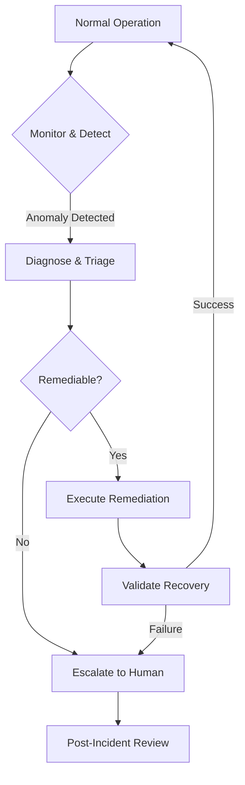
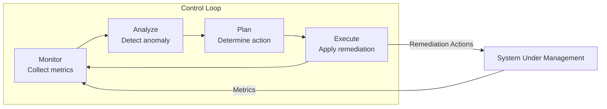
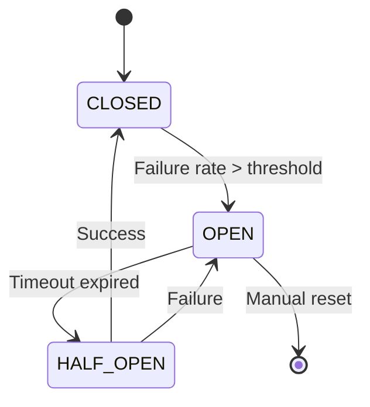
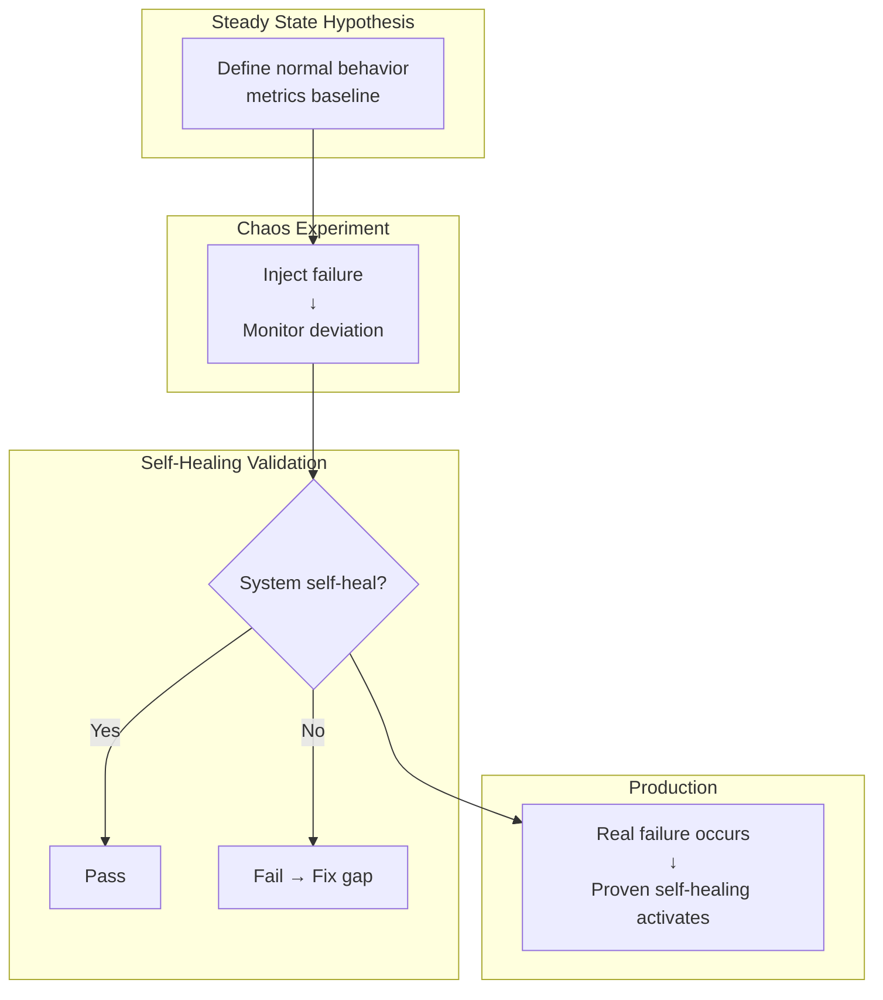

# Self-Healing Systems: Automated Failure Detection & Remediation

## 1. Mục tiêu của Task

Hiểu sâu bản chất của **Self-Healing Systems** - khả năng hệ thống tự động phát hiện, chẩn đoán và phục hồi khỏi failures mà không cần intervention từ con ngườà. Nghiên cứu tập trung vào:

- Cơ chế phát hiện failures ở tầng kiến trúc
- Các patterns remediation và trade-offs
- Tích hợp với Chaos Engineering để validate khả năng tự phục hồi
- Production concerns: blast radius, abort conditions, observability

> **Định nghĩa cốt lõi**: Self-healing không phải là "không bao giờ fail", mà là "fail nhanh, detect nhanh, recover tự động".

---

## 2. Bản chất và Cơ chế Hoạt động

### 2.1. Vòng đỷ của Self-Healing



### 2.2. Ba Tầng của Self-Healing

| Tầng | Phạm vi | Thờ gian phản ờng | Ví dụ |
|------|---------|-------------------|-------|
| **L1: Automatic** | Process/Container/Pod | milliseconds - seconds | Restart container, circuit breaker |
| **L2: Autonomic** | Service/Instance | seconds - minutes | Auto-scaling, failover, rebalancing |
| **L3: Orchestrated** | System/Architecture | minutes - hours | Data migration, DR activation, capacity planning |

**Bản chất quan trọng**: Mỗi tầng có cơ chế failure mode và recovery strategy khác nhau. Không thể dùng cùng một approach cho tất cả.

### 2.3. Cơ chế Phát hiện Failure (Failure Detection)

#### 2.3.1. Health Check Patterns

**Deep vs Shallow Health Checks:**

```
Shallow Check (Liveness):
└── Process có đang chạy không?
    └── HTTP 200 OK /healthz/live
    └── Không kiểm tra dependencies
    └── Nhanh, nhẹ, frequent

Deep Check (Readiness):
└── Service có thể phục vụ request không?
    ├── Database connection pool OK?
    ├── Cache reachable?
    ├── Message queue responsive?
    └── HTTP 200 OK /healthz/ready
    └── Chậm hơn, nặng hơn, less frequent
```

> **Anti-pattern nguy hiểm**: Deep health check trở thành cascading failure trigger khi downstream service chậm → health check timeout → container bị kill → tăng load lên instances còn lại → more timeouts.

#### 2.3.2. Outlier Detection Algorithms

| Algorithm | Khi nào dùng | Trade-off |
|-----------|--------------|-----------|
| **Static Threshold** | Metrics ổn định, đã biết baseline | Đơn giản nhưng không adaptive |
| **Moving Average** | Trend gradual | Lag khi spike đột ngột |
| **Exponential Smoothing** | Dữ liệu có seasonality | Cần tune alpha parameter |
| **Z-Score / IQR** | Distribution normal | Không phù hợp non-normal |
| **Isolation Forest** | Multi-dimensional, không cần label | Tốn compute, cần training |
| **LSTM/Autoencoder** | Complex temporal patterns | Overkill cho simple cases |

**Bản chất vấn đề**: Threshold-based detection dễ dẫn đến **alert fatigue** (quá nhiễu) hoặc **blind spots** (miss edge cases). Adaptive algorithms giải quyết vấn đề này nhưng tăng complexity và risk của false positives.

#### 2.3.3. Distributed Failure Detection

Trong distributed systems, failure detection phải đối mặt với **network partitions**:

```
Scenario: Node A không nhận heartbeat từ Node B

Question: B đã fail hay network partition?
    ├── Nếu A đánh dấu B fail → có thể là false positive
    │   └── B vẫn phục vụ clients khác
    │   └── Split-brain scenario
    │
    └── Nếu A chờ lâu hơn → detection delay
        └── Failover chậm, availability giảm
```

**Giải pháp: Phi Accrual Failure Detector** (như trong Cassandra, Akka)
- Không trả về boolean (fail/không fail)
- Trả về **suspicion level** (confidence score)
- Hệ thống có thể adjust behavior dựa trên suspicion level

---

## 3. Kiến trúc & Luồng xử lý

### 3.1. Control Loop Pattern (Theo dõi-Đánh giá-Điều chỉnh)



**Bản chất**: Pattern này borrowed từ control theory. MAPE loop (Monitor-Analyze-Plan-Execute) là foundation của autonomic computing.

### 3.2. Remediation Patterns

#### 3.2.1. Restart Pattern (L1 - Process Level)

```
Trigger: Process crash / OOM / Deadlock / Health check fail

Remediation Flow:
1. Supervisor detects process exit signal
2. Check restart policy (always/on-failure/never)
3. Check restart counter (rate limiting)
4. If within limits → restart process
5. If exceeded → escalate (mark service degraded)

Key Parameters:
- restart-window: Time window để đếm restarts (e.g., 5m)
- max-restarts: Số lần restart tối đa trong window (e.g., 3)
- backoff-strategy: Linear vs Exponential
```

> **Trade-off quan trọng**: Aggressive restart có thể ẩn underlying issues (memory leak, resource exhaustion) → symptom masking. Nhưng conservative restart làm giảm availability.

#### 3.2.2. Circuit Breaker Pattern (L1 - Request Level)

**State Machine:**



**Các tham số quan trọng:**

| Parameter | Ý nghĩa | Trade-off |
|-----------|---------|-----------|
| `failureThreshold` | Số lỗi trước khi OPEN | Thấp = protective nhưng sensitive; Cao = tolerant nhưng slow to react |
| `successThreshold` | Số success để CLOSE từ HALF_OPEN | Thấp = nhanh recover nhưng có thể premature |
| `timeoutDuration` | Thờ gian ở OPEN | Ngắn = nhanh retry nhưng downstream chưa recover; Dài = availability giảm |
| `slidingWindowSize` | Window để tính failure rate | Nhỏ = nhạy với spikes; Lớn = smooth nhưng lag |

**Advanced: Adaptive Circuit Breaker**
```
Thay vì static threshold, sử dụng:
- Dynamic threshold dựa trên historical baseline
- Different threshold cho different error types
- Context-aware (time of day, traffic pattern)
```

#### 3.2.3. Bulkhead Pattern (L1 - Resource Isolation)

**Bản chất**: Ngăn failure lan rộng bằng cách partition resources.

```
Without Bulkhead:
┌─────────────────────────────┐
│    Shared Thread Pool       │
│  ┌─────┐┌─────┐┌─────┐     │
│  │Fast ││Slow ││Fast │     │
│  │ API ││ API ││ API │     │
│  └──┬──┘└──┬──┘└──┬──┘     │
│     └──────┼──────┘        │
│            ▼                │
│     Slow API độc chiếm pool │
│     → Starvation cho others │
└─────────────────────────────┘

With Bulkhead:
┌──────────────┐┌──────────────┐┌──────────────┐
│  Pool A      ││  Pool B      ││  Pool C      │
│  ┌────────┐  ││  ┌────────┐  ││  ┌────────┐  │
│  │Fast API│  ││  │Slow API│  ││  │Fast API│  │
│  └────────┘  ││  └────────┘  ││  └────────┘  │
│  (10 threads)││  (5 threads) ││  (10 threads)│
└──────────────┘└──────────────┘└──────────────┘
```

> **Trade-off**: Bulkhead giảm resource utilization efficiency (fragmentation) nhưng tăng resilience. Cần right-sizing mỗi pool.

#### 3.2.4. Autoscaling Pattern (L2 - Capacity Level)

**Horizontal Pod Autoscaler (HPA) Logic:**

```
metrics = get_current_metrics(cpu/memory/custom)
desiredReplicas = ceil(currentReplicas * (currentMetric / targetMetric))
desiredReplicas = clamp(desiredReplicas, minReplicas, maxReplicas)

if desiredReplicas != currentReplicas:
    scale(desiredReplicas)
```

**Vấn đề production: Thrashing**
```
Scenario:
T+0: Traffic tăng → HPA scale up
T+30s: Pods mới chưa ready (startup time)
T+60s: Metrics vẫn cao → HPA scale up tiếp
T+90s: Pods mới ready → load giảm
T+120s: Metrics thấp → HPA scale down
→ Loop lặp lại

Giải pháp:
- scale-down-stabilization: Chờ 5m trước khi scale down
- scale-up-delay: Scale up ngay lập tức
- custom metrics: Dựa trên request queue depth thay vì CPU
```

#### 3.2.5. Failover Pattern (L2 - Service Level)

```
Active-Passive Failover:
┌──────────────┐     ┌──────────────┐
│   Active     │────▶│   Passive    │
│   (Primary)  │Sync │   (Standby)  │
└──────────────┘     └──────────────┘
       │
    Detect Fail
       │
       ▼
┌──────────────┐     ┌──────────────┐
│    FAILED    │     │  Active now  │
│   (Primary)  │     │  (Promoted)  │
└──────────────┘     └──────────────┘

Active-Active Failover:
┌──────────────┐     ┌──────────────┐
│   Active     │◀───▶│   Active     │
│   (Region A) │Sync │   (Region B) │
└──────────────┘     └──────────────┘
     Both serve traffic
```

**Trade-off quan trọng:**
- **Active-Passive**: Lower cost (chỉ 1 active) nhưng RTO cao (failover time)
- **Active-Active**: Higher cost (2x resources) nhưng RTO ~0, no data loss nếu synchronous replication

### 3.3. Chaos Engineering Integration



**Continuous Verification:**
```
Automated Chaos Pipeline:
1. Scheduled experiment (weekly)
2. Inject specific failure mode
3. Measure detection time (MTTD)
4. Measure recovery time (MTTR)
5. Compare với SLO
6. Alert nếu degradation
```

---

## 4. So sánh các Lựa chọn

### 4.1. Remediation Trigger Strategies

| Strategy | Khi dùng | Pros | Cons |
|----------|----------|------|------|
| **Reactive** | Failure đã xảy ra | Đơn giản, rõ ràng | MTTR > 0, có thể có data loss |
| **Predictive** | Early warning signals | Prevent failure, zero downtime | False positives, complex |
| **Proactive** | Scheduled maintenance | Controlled window | Requires planned downtime |

### 4.2. Self-Healing vs Manual Intervention

```
Decision Matrix:
                    Low Impact          High Impact
                    ┌──────────────────┬──────────────────┐
Low Frequency       │ Self-heal (L1)   │ Alert + Standby  │
                    │ Restart container│  (human ready)   │
                    ├──────────────────┼──────────────────┤
High Frequency      │ Self-heal (L1-2) │ Self-heal (L2-3) │
                    │ Circuit breaker  │ Automated        │
                    │ Autoscale        │ failover         │
                    └──────────────────┴──────────────────┘
```

### 4.3. Tools & Platforms Comparison

| Tool | Level | Strength | Weakness |
|------|-------|----------|----------|
| **Kubernetes Self-Healing** | L1-L2 | Native, battle-tested | Limited to container lifecycle |
| **Istio + Envoy** | L1-L2 | Fine-grained traffic control | Complexity, resource overhead |
| **Netflix Conductor** | L2-L3 | Workflow-based remediation | Setup complexity |
| **PagerDuty + Runbooks** | L3 | Human-in-the-loop for complex | Not truly automated |
| **AWS Auto Recovery** | L2 | Cloud-native | Vendor lock-in |

---

## 5. Rủi ro, Anti-Patterns, Lỗi thường gặp

### 5.1. Catastrophic Anti-Patterns

#### Anti-Pattern #1: Cascading Remediation
```
Scenario:
1. Database chậm
2. HPA detect high CPU → scale up app servers
3. More app servers → more DB connections
4. DB càng chậm hơn
5. More scaling → DB overwhelmed
6. Total system failure

Fix: Scale upstream before downstream. Circuit breaker trước autoscaling.
```

#### Anti-Pattern #2: Thundering Herd on Recovery
```
Scenario:
1. Service A fail
2. Service B queue requests với retry
3. Service A recover
4. All queued requests flood A simultaneously
5. A fail again
6. Loop lặp lại

Fix: 
- Jittered exponential backoff
- Circuit breaker gradual warm-up
- Rate limit trên recovery
```

#### Anti-Pattern #3: Hidden Failure Accumulation
```
Scenario:
1. Silent data corruption xảy ra
2. Self-healing restart "fix" symptom
3. Corruption persists, spread qua replication
4. Weeks sau: massive data loss

Fix: 
- Checksum validation trước khi accept
- Immutable logs, không tự động fix data
- Canary deployments với validation
```

### 5.2. Edge Cases & Failure Modes

| Scenario | Nguyên nhân | Mitigation |
|----------|-------------|------------|
| **Split Brain** | Network partition + aggressive failover | Consensus algorithm (Raft/Paxos), fencing tokens |
| **Resource Starvation** | Self-healing consume too many resources | Resource quotas, priority classes |
| **Flapping** | Remediation trigger oscillation | Hysteresis bands, cooldown periods |
| **Metastable Failures** | System stuck in degraded state | Breaker to full restart, external reset |

### 5.3. Observability Gaps

> **Critical**: Self-healing systems cần audit trail đầy đủ. Không được "heal silently".

```
Required Telemetry:
┌─────────────────────────────────────────────────────┐
│ Detection Events                                    │
│ - What anomaly was detected?                        │
│ - Confidence score?                                 │
│ - Which detector triggered?                         │
├─────────────────────────────────────────────────────┤
│ Remediation Actions                                 │
│ - What action was taken?                            │
│ - What was the blast radius?                        │
│ - Who authorized it? (manual vs automated)          │
├─────────────────────────────────────────────────────┤
│ Outcome Metrics                                     │
│ - MTTD (Mean Time To Detect)                        │
│ - MTTR (Mean Time To Recover)                       │
│ - Success/failure rate of remediation               │
└─────────────────────────────────────────────────────┘
```

---

## 6. Khuyến nghị Thực chiến trong Production

### 6.1. Implementation Checklist

```
□ Layer 1 (Process): 
  □ Liveness/readiness probes properly configured
  □ Restart policies with rate limiting
  □ Resource limits để prevent runaway healing

□ Layer 2 (Service):
  □ Circuit breakers trên tất cả external calls
  □ Bulkheads cho critical operations
  □ Autoscaling với stabilization windows

□ Layer 3 (System):
  □ Runbook automation cho common failures
  □ Chaos experiments để validate healing
  □ Rollback capability cho mọi change

□ Observability:
  □ Self-healing metrics dashboard
  □ Alert khi automated remediation fails
  □ Audit log cho mọi action
```

### 6.2. Blast Radius Control

```
Principles:
1. Fail small: Partition system để failure không lan rộng
2. Fail fast: Detect nhanh, không wait cho "maybe recovery"
3. Fail visible: Logging đầy đủ, không silent healing
4. Graceful degradation: Reduce functionality thay vì total failure
```

### 6.3. Human-in-the-Loop Strategy

```
Full Automation:     L1 failures (container restart, circuit breaker)
Semi-Automation:     L2 failures (autoscaling, failover with approval)
Human Required:      L3 failures (data corruption, security incident)
Always Human:        Architectural changes, persistent degradation
```

### 6.4. Testing Self-Healing

```
Chaos Engineering Experiments:
1. Pod failure injection → Validate Kubernetes restart
2. Network latency injection → Validate circuit breaker
3. Database slow query → Validate timeout và failover
4. Memory pressure → Validate OOM handling
5. Disk full → Validate log rotation và alert

Metrics to Track:
- MTTD: < 30 seconds cho L1
- MTTR: < 2 minutes cho L1, < 10 minutes cho L2
- False positive rate: < 5%
- Remediation success rate: > 95%
```

---

## 7. Kết luận

**Bản chất của Self-Healing Systems:**

1. **Không phải magic**: Là tập hợp các control loops, patterns, và policies được thiết kế cẩn thận

2. **Trade-off chính**: 
   - Availability vs Consistency (trong distributed scenarios)
   - Automation vs Control (human override capability)
   - Recovery speed vs Safety (blast radius)

3. **Thành phần cốt lõi**:
   - **Fast detection**: Health checks, metrics, outlier detection
   - **Smart remediation**: Pattern matching, decision trees, ML (nếu phù hợp)
   - **Safe execution**: Gradual rollout, rollback capability, blast radius control
   - **Full observability**: Audit trail, metrics, learning from failures

4. **Integration với Chaos Engineering**: Self-healing không thể tin tưởng nếu không được validate liên tục. Chaos engineering là "vaccine" cho self-healing systems.

5. **Con ngườ vẫn quan trọng**: Self-healing xử lý known failure modes. Unknown-unknown vẫn cần human expertise.

> **Final Thought**: Self-healing là capability, không phải feature. Nó emerge từ proper architecture, observability, và operational maturity.

---

## References

1. N. Brown, "Software Architecture: The Hard Parts" - Trade-off analysis
2. M. Nygard, "Release It!" - Stability patterns
3. B. Burns et al., "Designing Distributed Systems" - Sidecar pattern
4. Netflix Tech Blog - Chaos Engineering practices
5. Google SRE Book - Reliability engineering principles
