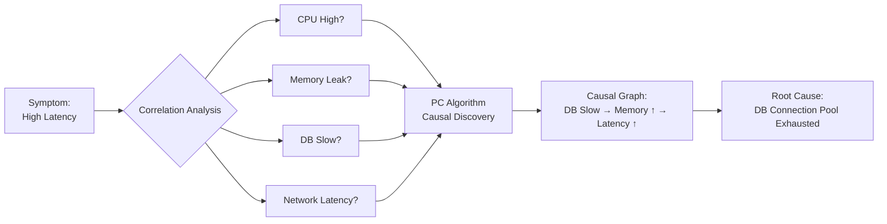
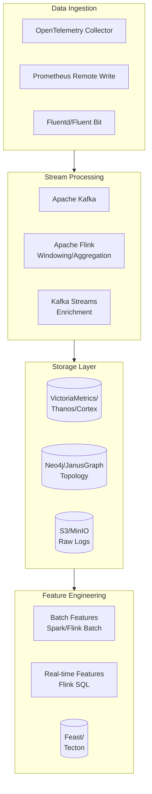
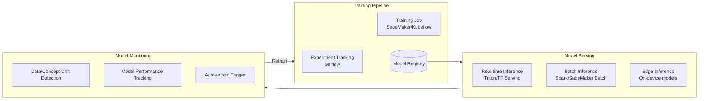
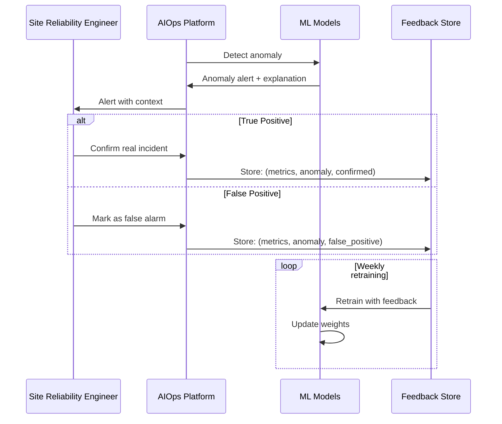
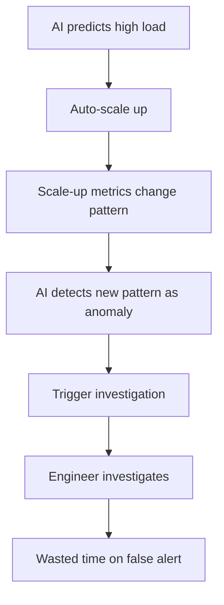
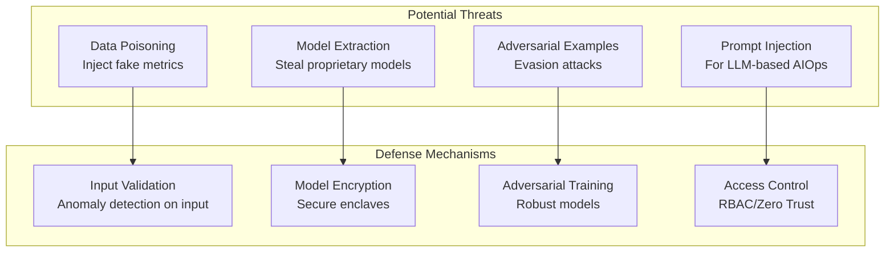

# AI-Driven Operations (AIOps)

## 1. Mục tiêu của task

Hiểu sâu bản chất của AIOps - cách AI/ML được tích hợp vào vận hành hệ thống để tự động hóa phát hiện anomaly, phân tích root cause và thực hiện remediation. Phân tích các thành phần kiến trúc, trade-off giữa automation và human oversight, cùng các rủi ro production khi giao quyền quyết định cho AI.

---

## 2. Bản chất và cơ chế hoạt động

### 2.1 Định nghĩa cốt lõi

AIOps không phải là "Monitoring + AI" đơn thuần. Đó là sự chuyển dịch paradigm từ **reactive operations** sang **predictive & autonomous operations** thông qua việc kết hợp:

| Traditional Ops | AIOps |
|-----------------|-------|
| Rule-based alerting | Pattern-based anomaly detection |
| Threshold static | Dynamic baseline learning |
| Human-driven RCA | ML-assisted root cause analysis |
| Manual remediation | Automated/assisted remediation |
| Siloed metrics | Correlation across data domains |

### 2.2 Kiến trúc tổng quan AIOps Platform

```mermaid
flowchart TB
    subgraph DataCollection["Data Collection Layer"]
        Metrics[Metrics<br/>Prometheus/CloudWatch]
        Logs[Logs<br/>ELK/Loki]
        Traces[Traces<br/>Jaeger/Tempo]
        Events[Events<br/>Kafka/PagerDuty]
        CMDB[CMDB/Topology<br/>Service Graph]
    end
    
    subgraph DataProcessing["Data Processing & Normalization"]
        Streaming[Stream Processing<br/>Flink/Kafka Streams]
        Normalization[Normalization<br/>OpenTelemetry]
        Enrichment[Context Enrichment<br/>Topology/Tags]
        Storage[(Time-Series &<br/>Graph Database)]
    end
    
    subgraph AIEngine["AI/ML Engine"]
        Anomaly[Anomaly Detection<br/>Isolation Forest/LSTM]
        Correlation[Event Correlation<br/>Graph Neural Networks]
        RCA[Root Cause Analysis<br/>Causal Inference]
        Prediction[Predictive Analytics<br/>Forecasting/Prophet]
    end
    
    subgraph ActionEngine["Action & Automation Engine"]
        IncidentMgmt[Incident Management<br/>Auto-ticketing]
        Remediation[Auto-Remediation<br/>Runbook Automation]
        Capacity[Capacity Planning<br/>Auto-scaling]
    end
    
    subgraph HumanInterface["Human-in-the-Loop Interface"]
        Visualization[Visualization<br/>Dashboards/Topology]
        Explanation[XAI Explanations<br/>SHAP/LIME]
        Feedback[Feedback Loop<br/>Reinforcement Learning]
    end
    
    DataCollection --> DataProcessing
    DataProcessing --> AIEngine
    AIEngine --> ActionEngine
    AIEngine --> HumanInterface
    HumanInterface -->|Feedback| AIEngine
    ActionEngine -->|Outcome| DataCollection
```



### 2.3 Các thành phần ML cốt lõi

#### 2.3.1 Anomaly Detection

**Bản chất vấn đề:**
- Dữ liệu operations là **time-series multivariate** với pattern phức tạp (seasonality, trend, cyclic)
- "Normal" là khái niệm động - thay đổi theo business hours, releases, traffic patterns
- Anomaly có nhiều loại: point anomaly, contextual anomaly, collective anomaly

**Các phương pháp chính:**

| Phương pháp | Use case phù hợp | Giới hạn |
|-------------|------------------|----------|
| **Statistical** (3-sigma, MAD) | Univariate, distribution known | Không xử lý seasonality tốt |
| **Isolation Forest** | High-dimensional metrics | Không capture temporal dependencies |
| **LSTM/GRU Autoencoders** | Complex temporal patterns | Cần nhiều dữ liệu, expensive training |
| **Prophet** | Business metrics với seasonality rõ ràng | Không xử lý multivariate tốt |
| **VAE (Variational Autoencoder)** | Unsupervised, high-dimensional | Latent space khó interpret |

**Trade-off quan trọng:**

```
Sensitivity ↑  →  False Positive ↑  →  Alert Fatigue
Sensitivity ↓  →  False Negative ↑  →  Missed Incidents
```

> **Lưu ý production:** Precision-Recall trade-off trong anomaly detection là **business-critical**. Một hệ thống AIOps với 95% accuracy vẫn có thể tạo 100+ false alerts/ngày trong hệ thống lớn.

#### 2.3.2 Root Cause Analysis (RCA)

**Cơ chế hoạt động:**

RCA trong AIOps sử dụng **Causal Inference** thay vì chỉ correlation:



**Các kỹ thuật RCA:**

| Kỹ thuật | Nguyên lý | Độ phức tạp | Độ chính xác |
|----------|-----------|-------------|--------------|
| **PC Algorithm** | Causal discovery từ observational data | Trung bình | 70-80% |
| **Transfer Entropy** | Directional information flow | Cao | 75-85% |
| **Granger Causality** | Time-series causality | Trung bình | 60-75% |
| **Bayesian Networks** | Probabilistic causal reasoning | Rất cao | 80-90% |
| **Knowledge Graph + GNN** | Topology-aware reasoning | Cao | 85-95% |

**Thách thức thực tế:**
- **Confounding variables**: Hai service cùng phụ thuộc vào một third-party (VD: cùng gọi một DB)
- **Feedback loops**: Auto-scaling tạo ra pattern không phải causal thực sự
- **Delayed effects**: Memory leak → GC pressure → Latency (delay 5-10 phút)

#### 2.3.3 Predictive Scaling & Capacity Planning

**Cơ chế Prophet/Facebook cho capacity forecasting:**

```
y(t) = g(t) + s(t) + h(t) + ε(t)

Where:
- g(t): Growth trend (piecewise linear/logistic)
- s(t): Seasonality (Fourier series)
- h(t): Holiday effects
- ε(t): Error term
```

**Trade-off trong predictive scaling:**

| Chiến lược | Cost | Availability Risk | Use case |
|------------|------|-------------------|----------|
| **Reactive** (threshold-based) | Thấp | Cao | Workload ổn định |
| **Predictive** (ML-based) | Trung bình | Trung bình | Có seasonality rõ ràng |
| **Proactive** (scheduled) | Cao | Thấp | Events biết trước (Black Friday) |

---

## 3. Kiến trúc chi tiết các thành phần

### 3.1 Data Pipeline Architecture



**Quan trọng về data pipeline:**

- **Cardinality explosion**: Metrics với high cardinality (user_id, request_id) có thể làm sập TSDB
- **Backpressure handling**: Khi AI model chậm, cần mechanism để drop/sample data thay vì buffer đầy
- **Feature consistency**: Training data và inference data phải cùng preprocessing pipeline

### 3.2 Model Serving Architecture



**Chiến lược serving cho AIOps:**

| Pattern | Latency | Throughput | Use case |
|---------|---------|------------|----------|
| **Synchronous API** | <100ms | Trung bình | Real-time anomaly detection |
| **Async Queue** | Seconds | Cao | Batch RCA analysis |
| **Streaming Inference** | <1s | Rất cao | Flink + embedded models |
| **Edge Inference** | <10ms | Thấp | On-premise/low connectivity |

### 3.3 Feedback Loop & Continuous Learning



---

## 4. So sánh các nền tảng AIOps

### 4.1 Commercial AIOps Platforms

| Platform | Điểm mạnh | Điểm yếu | Giá | Phù hợp |
|----------|-----------|----------|-----|---------|
| **Datadog Watchdog** | Integration tốt, dễ setup | Vendor lock-in, cost scale | $$$ | SMB đến Enterprise |
| **Dynatrace Davis** | Root cause mạnh, topology auto-discovery | Complex, expensive | $$$$ | Large enterprise |
| **New Relic AI** | Full-stack observability | Limited customization | $$$ | Mid-market |
| **PagerDuty AIOps** | Event correlation, incident mgmt | Cần integration nhiều tools | $$ | Teams có tooling phân tán |
| **Moogsoft** | Flexible, good event correlation | Steeper learning curve | $$$ | Complex environments |
| **BigPanda** | Open integrations | Cần nhiều customization | $$$ | Multi-cloud setups |

### 4.2 Open Source AIOps Stack

| Component | Chức năng | Alternative |
|-----------|-----------|-------------|
| **Metabase/Superset** | Visualization | Grafana |
| **Apache Superset** | Anomaly detection UI | Custom dashboards |
| **LinkedIn ThirdEye** | Anomaly detection | Custom models |
| **Elastalert** | Alerting | Prometheus Alertmanager |
| **SignifAI (acquired)** | Event correlation | Moogsoft APIs |
| **Numenta HTM** | Streaming anomaly detection | Custom LSTM |

### 4.3 Build vs Buy Decision Matrix

```
                    Low Complexity    High Complexity
                   ┌─────────────────┬─────────────────┐
    High Strategic │     BUILD       │  BUILD + PARTNER│
                   │  Custom AIOps   │  Core custom,   │
                   │  platform       │  tools integrated│
                   ├─────────────────┼─────────────────┤
    Low Strategic  │      BUY        │      BUY        │
                   │  SaaS platforms │  Enterprise     │
                   │  (Datadog, etc) │  solutions      │
                   └─────────────────┴─────────────────┘
```

**Khi nào nên BUILD:**
- Unique data patterns không phù hợp với generic models
- Strict data privacy/regulatory requirements
- Existing ML infrastructure và team
- Scale rất lớn (cost SaaS vượt quá cost internal team)

**Khi nào nên BUY:**
- Time-to-value là critical
- Không có ML expertise in-house
- Standard use cases (infrastructure monitoring, app performance)
- Cần integration nhanh với existing toolchain

---

## 5. Rủi ro, Anti-patterns và Lỗi thường gặp

### 5.1 Rủi ro Production Critical

#### 5.1.1 The "Black Box" Problem

**Vấn đề:** AI model đưa ra quyết định nhưng không giải thích được tại sao.

**Hệ quả:**
- Engineers không trust alerts
- Không thể validate logic khi incident xảy ra
- Regulatory compliance issues (GDPR "right to explanation")

**Giải pháp:**
- Implement XAI (Explainable AI) - SHAP, LIME, attention mechanisms
- Causal graphs có thể interpret
- Human-in-the-loop cho critical decisions

#### 5.1.2 Feedback Loop của Doom



**Phòng tránh:**
- Exclude auto-scaling actions khỏi anomaly detection input
- Label training data với context ("during scaling event")
- Throttling cho automated actions

#### 5.1.3 Data Drift & Model Staleness

**Các loại drift:**

| Loại drift | Nguyên nhân | Phát hiện | Xử lý |
|------------|-------------|-----------|-------|
| **Concept drift** | Relationship giữa features và target thay đổi | Performance degradation | Retrain model |
| **Data drift** | Input distribution thay đổi | Statistical tests (KS, PSI) | Feature engineering |
| **Label drift** | Ground truth thay đổi | Class distribution shift | Update labeling |

### 5.2 Anti-patterns

#### Anti-pattern 1: "Alert Fatigue Transfer"

Chuyển từ 100 manual alerts → 100 AI alerts không giải quyết vấn đề. AI phải giảm số lượng alerts thông qua correlation và prioritization.

#### Anti-pattern 2: "The Perfect Model Trap"

Chờ model đạt 99% accuracy trước khi deploy. Trong thực tế:
- 70% accuracy với actionable insights > 95% accuracy không deploy
- Iterative improvement qua feedback loop

#### Anti-pattern 3: "Siloed AIOps"

Team ML xây dựng platform nhưng không hiểu operational context. Kết quả:
- Models không phù hợp với actual failure modes
- Features không available trong production

### 5.3 Edge Cases và Failure Modes

| Scenario | Impact | Mitigation |
|----------|--------|------------|
| **Novel failure mode** | Model chưa thấy bao giờ → missed detection | Hybrid: rule-based backup |
| **Cascading failures** | Correlation confuses root cause vs symptom | Temporal causality analysis |
| **Attack on AI** | Adversarial inputs | Input validation, ensemble models |
| **Cold start** | New service chưa có historical data | Transfer learning, default baselines |
| **Multi-modal data loss** | Missing metrics/logs | Robust imputation, uncertainty quantification |

---

## 6. Khuyến nghị thực chiến trong Production

### 6.1 Phased Rollout Strategy

```
Phase 1 (Weeks 1-4): Passive Mode
    └── AI chỉ observe và suggest, không automated actions
    └── Collect feedback, tune thresholds
    
Phase 2 (Weeks 5-8): Assisted Mode  
    └── AI gợi ý actions, human approve
    └── Semi-automated remediation cho low-risk scenarios
    
Phase 3 (Months 3-6): Limited Automation
    └── Automated actions cho known, low-risk patterns
    └── Human escalation cho unknown/new patterns
    
Phase 4 (Months 6+): Full Autonomy
    └── Broad automation với human oversight
    └── Continuous refinement
```

### 6.2 Observability cho chính AIOps Platform

**Meta-monitoring requirements:**

| Metric | Ý nghĩa | Threshold cảnh báo |
|--------|---------|-------------------|
| Model inference latency | Performance của AI system | P99 > 100ms |
| Prediction confidence | Độ tự tin của model | < 0.7 cho critical alerts |
| Feedback loop latency | Thời gian incorporate feedback | > 1 week |
| False positive rate | Alert quality | > 20% |
| Coverage | % incidents được detect | < 90% |

### 6.3 Security Considerations



### 6.4 Integration với Existing Tooling

**Java/Spring Boot specific:**

```yaml
# Micrometer + AIOps integration
management:
  metrics:
    export:
      aiops:
        uri: http://aiops-platform:8080/metrics
        batch-size: 1000
        step: 10s
        # Custom dimensions for better correlation
        tags:
          service: ${spring.application.name}
          team: platform
          criticality: high
```

```java
// Custom health indicator cho AIOps
@Component
public class AIOpsHealthIndicator implements HealthIndicator {
    
    private final AIOpsClient aiOpsClient;
    
    @Override
    public Health health() {
        // Check model serving health
        boolean modelHealthy = aiOpsClient.checkModelHealth();
        
        if (!modelHealthy) {
            // Fallback to traditional monitoring
            return Health.down()
                .withDetail("aiops", "Model serving unavailable")
                .withDetail("fallback", "traditional_alerting_active")
                .build();
        }
        
        return Health.up()
            .withDetail("model_version", aiOpsClient.getModelVersion())
            .withDetail("last_prediction", aiOpsClient.getLastPredictionTime())
            .build();
    }
}
```

---

## 7. Kết luận

### Bản chất cốt lõi của AIOps

AIOps không phải là thay thế SREs - đó là **force multiplier**. Bản chất là:

1. **Pattern recognition at scale**: Con người không thể nhìn 1000 metrics đồng thời, ML có thể.

2. **Causal reasoning**: Xác định root cause trong complex distributed systems nhanh hơn human analysis.

3. **Predictive capacity**: Chuyển từ "firefighting" sang "fire prevention".

### Trade-off quan trọng nhất

```
Automation Level ↑  →  Speed ↑  →  Risk of wrong action ↑
Human Oversight ↑   →  Safety ↑  →  Speed ↓

Optimal: Right level cho từng use case
  - Auto-remediation cho known, low-risk issues
  - Human approval cho novel, high-risk scenarios
```

### Rủi ro lớn nhất

**Over-reliance without understanding.** Teams deploy AIOps như "silver bullet" mà không hiểu:
- Limitations của models
- Khi nào cần human intervention
- Cách validate AI decisions

### Tư duy đúng đắn

> AIOps là **tool trong toolkit**, không phải **replacement for operational expertise**. Platform tốt nhất kết hợp ML pattern recognition với human domain knowledge và judgment.

### Future Directions

- **LLM-based AIOps**: Natural language query, automated runbook generation
- **Federated AIOps**: Learning across organizations without data sharing
- **Neuromorphic computing**: Edge-based anomaly detection với energy efficiency
- **Quantum ML**: Exponential speedup cho certain optimization problems

---

## 8. Tài liệu tham khảo

1. Gartner Market Guide for AIOps Platforms (2024)
2. Google SRE Book - Monitoring Distributed Systems
3. "Machine Learning for Operations" - Coursera MLOps Specialization
4. Papers: "Robust Anomaly Detection for Multivariate Time Series" (Stanford)
5. "Causal Inference in Time Series Analysis" - Pearl et al.
6. ACM Queue: "AIOps: Real-World Challenges and Solutions"
