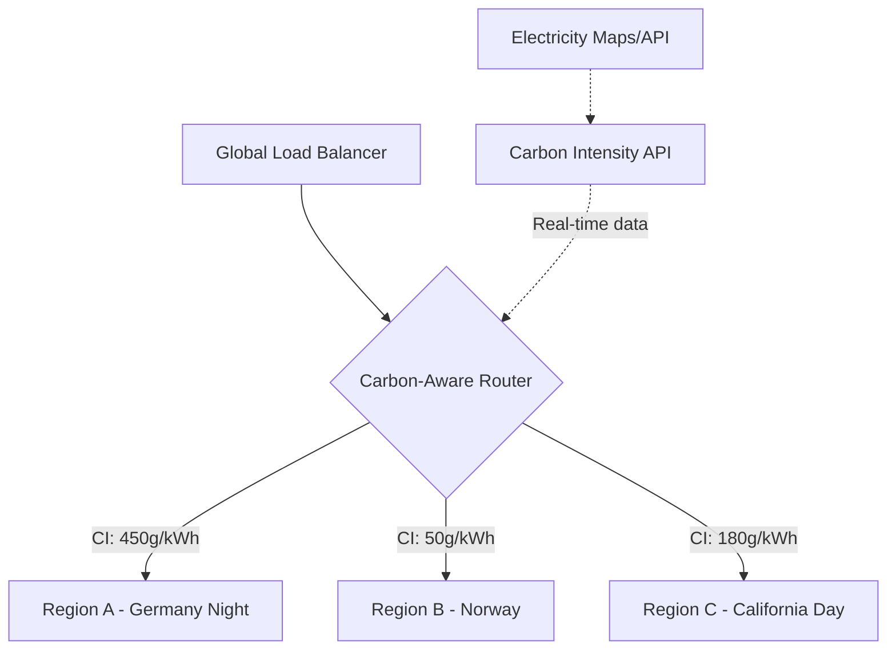
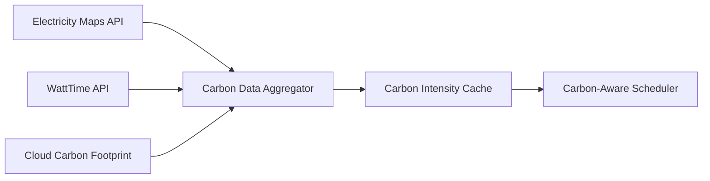

# Carbon-Aware Architecture: Location Shifting, Temporal Shifting & Renewable Energy Optimization

## 1. Mục tiêu của Task

Hiểu sâu bản chất của **Carbon-Aware Architecture** - kiến trúc nhận thức carbon, nơi hệ thống backend không chỉ tối ưu hiệu năng và chi phí mà còn **chủ động giảm phát thải carbon** thông qua:
- **Location Shifting**: Di chuyển workload đến vùng có năng lượng sạch hơn
- **Temporal Shifting**: Dịch chuyển thủ công workload sang thờid iểm năng lượng tái tạo dư thừa
- **Renewable Energy Optimization**: Tối ưu hóa sử dụng năng lượng tái tạo trong vận hành

> **Điểm khác biệt cốt lõi**: Carbon-aware không chỉ là "tối ưu hiệu năng để giảm tiêu thụ" (điều đã có từ lâu), mà là **đưa carbon intensity (gCO₂/kWh) trở thành metric của scheduling decision**.

---

## 2. Bản chất và Cơ chế Hoạt động

### 2.1. Carbon Intensity - Trọng tâm của mọi quyết định

**Carbon Intensity (CI)** = grams CO₂ được thải ra để sản xuất 1 kWh điện.

```
┌─────────────────────────────────────────────────────────────┐
│                 CARBON INTENSITY VARIATION                  │
├─────────────────────────────────────────────────────────────┤
│  Region        │  Solar Peak  │  Wind Peak  │  Fossil Base │
├─────────────────────────────────────────────────────────────┤
│  California    │    200       │    180      │     450      │
│  Iowa          │    400       │     50      │     500      │
│  Germany       │    300       │     80      │     550      │
│  Norway        │     20       │     15      │      30      │
└─────────────────────────────────────────────────────────────┘
```

**Bản chất**: CI không phải hằng số - nó biến động theo:
- **Thờigian trong ngày**: Solar peak giảm CI ban ngày
- **Thờigian trong năm**: Mùa gió, mùa nắng
- **Vị trí địa lý**: Mix năng lượng của từng grid
- **Thờigian thực**: Thờigian có nhiều gió/nắng → CI thấp

### 2.2. Location Shifting - Di chuyển địa lý

**Cơ chế**: Di chuyển workload từ region có CI cao sang region có CI thấp hơn.

**Mô hình kiến trúc**:



**Luồng quyết định**:

```
Request đến
    ↓
Kiểm tra latency requirement
    ↓
Nếu latency flexible → Query Carbon API lấy CI của các candidate regions
    ↓
Tính toán: Carbon Cost = Power Consumption (kW) × CI (g/kWh) × Duration (h)
    ↓
Route đến region có carbon cost thấp nhất, thỏa mãn SLA
```

**Trade-off cốt lõi**:

| Yếu tố | Location Shifting | Comment |
|--------|-------------------|---------|
| Latency | Tăng (data gravity) | Data ở region cũ, phải fetch xa |
| Bandwidth cost | Tăng | Cross-region data transfer |
| Carbon saving | Cao nhất | Có thể giảm 90%+ emissions |
| Complexity | Cao | Multi-region data sync, consistency |

### 2.3. Temporal Shifting - Dịch chuyển thờigian

**Cơ chế**: Delay non-urgent workload đến thờigian CI thấp hơn.

**Mô hình**:

```mermaid
gantt
    title Temporal Shifting Example - Batch Jobs
    dateFormat HH:mm
    axisFormat %H:%M
    
    section Normal Schedule
    ML Training Job    :a1, 14:00, 4h
    Data Processing    :a2, 15:00, 3h
    
    section Carbon-Aware
    ML Training Job    :b1, 02:00, 4h
    Data Processing    :b2, 03:00, 3h
```



**Các loại workload phù hợp**:

| Loại | Delay Tolerance | Ví dụ |
|------|----------------|-------|
| **Flexible** | Hours-Days | ML training, report generation, backup |
| **Interruptible** | Minutes-Hours | Video encoding, CI/CD pipelines |
| **Elastic** | Real-time adjustment | Auto-scaling, queue consumers |

**Constraint quan trọng**:

> **Deadline-Aware Scheduling**: Phải đảm bảo job vẫn hoàn thành trước deadline, dù shift đến thờigian nào.

**Thuật toán cơ bản**:

```
Input: Job with deadline D, duration T, power P
Current time: t₀, Current CI: C₀

For each future time slot tᵢ in [t₀, D-T]:
    Predicted CI at tᵢ: Cᵢ (dựa trên forecast)
    Carbon cost: Eᵢ = P × T × Cᵢ

Choose t* = argmin(Eᵢ) where job finishes before D
```

### 2.4. Renewable Energy Optimization

**Bản chất**: Không chỉ "dùng khi có" mà **chủ động tối ưu hóa việc sử dụng** năng lượng tái tạo.

**Các chiến lược**:

1. **Curtailment Utilization**: Năng lượng tái tạo bị "cắt giảm" (curtailed) khi grid không thể tiêu thụ hết. Data center có thể **chủ động tăng workload** để "hút" năng lượng dư thừa này.

2. **Grid-Interactive Buildings**: Data center hoạt động như **virtual battery** - giảm consumption khi grid căng thẳng, tăng khi năng lượng sạch dư thừa.

3. **On-site Generation Matching**: Đồng bộ workload với production của on-site solar/wind.

---

## 3. Kiến trúc Hệ thống Carbon-Aware

### 3.1. Tầng Data Collection



**Nguồn dữ liệu**:

| API/Nguồn | Coverage | Real-time | Chi tiết |
|-----------|----------|-----------|----------|
| **Electricity Maps** | Global | 1 giờ | Grid level, historical |
| **WattTime** | US, EU, AU | 5 phút | Marginal emissions |
| **Cloud Carbon Footprint** | AWS/GCP/Azure | Delay 24h | Cloud-specific |

### 3.2. Tầng Decision Engine

**Các thành phần**:

```
┌─────────────────────────────────────────────────────────────┐
│                  CARBON-AWARE DECISION ENGINE               │
├─────────────────────────────────────────────────────────────┤
│  ┌─────────────┐  ┌─────────────┐  ┌─────────────────────┐  │
│  │  Latency    │  │   Carbon    │  │   Cost Optimizer    │  │
│  │  Constraint │  │  Forecaster │  │                     │  │
│  │  Validator  │  │             │  │                     │  │
│  └──────┬──────┘  └──────┬──────┘  └──────────┬──────────┘  │
│         └─────────────────┼────────────────────┘             │
│                           ↓                                  │
│                   ┌───────────────┐                          │
│                   │ Multi-Objective │                        │
│                   │   Optimizer     │                        │
│                   │ (Pareto Front)  │                        │
│                   └───────┬───────┘                          │
│                           ↓                                  │
│                   ┌───────────────┐                          │
│                   │  Decision API   │                        │
│                   │  (Schedule/Route)│                       │
│                   └───────────────┘                          │
└─────────────────────────────────────────────────────────────┘
```

### 3.3. Tầng Execution

**Implementation patterns**:

| Pattern | Use Case | Complexity |
|---------|----------|------------|
| **Carbon-Aware K8s Scheduler** | Container workload | Trung bình |
| **Green Load Balancer** | Web traffic | Thấp |
| **Smart Batch Queue** | Delay-tolerant jobs | Cao |
| **VM Migration** | Long-running services | Rất cao |

---

## 4. So sánh Chiến lược và Trade-offs

### 4.1. Location vs Temporal Shifting

| Tiêu chí | Location Shifting | Temporal Shifting |
|----------|-------------------|-------------------|
| **Latency Impact** | Cao (cross-region) | Không có |
| **Data Movement** | Cần replicate/synchronise | Không cần |
| **Carbon Reduction** | 50-90% | 30-70% |
| **Phù hợp với** | Stateless services, batch | Batch, CI/CD, ML training |
| **Độ phức tạp** | Cao | Trung bình |
| **Chi phí networking** | Tăng đáng kể | Không đổi |

### 4.2. Carbon vs Cost Optimization

**Mâu thuẫn cố hữu**:

```
┌────────────────────────────────────────────────────────────┐
│  Spot instances giá rẻ → Thường ở regions có CI cao       │
│  (vì nhu cầu thấp, năng lượng hóa thạch base load)        │
└────────────────────────────────────────────────────────────┘
```

**Giải pháp**: Multi-objective optimization với **carbon budget**:

```
Minimize: α × Cost + β × Carbon
Subject to:
  - Latency < SLA
  - Carbon < CarbonBudget (optional constraint)
  - Availability > 99.9%
```

### 4.3. So sánh Cloud Providers

| Provider | Carbon Tooling | Data Transparency | Region Diversity |
|----------|----------------|-------------------|------------------|
| **GCP** | Carbon Footprint dashboard (free) | Cao | Tốt |
| **AWS** | Customer Carbon Footprint Tool | Trung bình | Rất tốt |
| **Azure** | Sustainability calculator | Trung bình | Tốt |

---

## 5. Rủi ro, Anti-patterns và Lỗi thường gặp

### 5.1. Rủi ro Production

| Rủi ro | Mô tả | Mitigation |
|--------|-------|------------|
| **Latency degradation** | User ở US nhưng được route đến EU vì CI thấp | Hard latency bounds, user proximity preference |
| **Data residency violation** | GDPR/data sovereignty breach | Whitelist compliant regions only |
| **Cost explosion** | Cross-region egress fees | Carbon-cost trade-off analysis |
| **Over-shifting** | Quá aggressive shifting gây instability | Gradual rollout, circuit breakers |
| **Cache thrashing** | Data không local, liên tục fetch | Predictive data placement |

### 5.2. Anti-patterns

**❌ Carbon Washing**:
> "Chỉ" mua renewable energy credits (RECs) mà không thay đổi thực sự workload scheduling. Đây là accounting trick, không phải carbon-aware architecture.

**❌ Ignoring Embodied Carbon**:
> Chỉ tối ưu operational carbon mà bỏ qua embodied carbon (carbon đã thải ra khi sản xuất hardware). Extending hardware lifecycle quan trọng không kém.

**❌ Short-term Thinking**:
> Shift workload đến region có solar peak ban ngày nhưng không xem xét total daily emissions.

### 5.3. Edge Cases

- **Grid emergency**: Khi grid gần collapse, có thể cần giảm consumption ngay lập tức (demand response)
- **Negative pricing**: Khi renewable dư thừa quá mức, giá điện âm → opportunity để "mine" carbon credits
- **Transmission congestion**: Physical limits của power lines có thể ngăn việc dùng năng lượng sạch từ xa

---

## 6. Khuyến nghị Thực chiến trong Production

### 6.1. Bắt đầu từ đâu

**Phase 1: Measure (Weeks 1-4)**
```
1. Tích hợp Cloud Carbon Footprint hoặc Electricity Maps API
2. Tag resources theo environment/team
3. Baseline: đo carbon emissions hiện tại
```

**Phase 2: Pilot (Weeks 5-12)**
```
1. Chọn 1 workload delay-tolerant (batch reports, ML training)
2. Implement temporal shifting đơn giản
3. A/B test: carbon savings vs completion time
```

**Phase 3: Expand (Months 4-6)**
```
1. Thêm location shifting cho stateless services
2. Multi-objective optimization (carbon + cost + latency)
3. Automated carbon reporting
```

### 6.2. Tech Stack Recommendations

| Component | Open Source | Commercial |
|-----------|-------------|------------|
| Carbon Data | Electricity Maps API, WattTime | Climeworks, Carbon Intelligence |
| Scheduling | Karmada (K8s), Carbon-aware KEDA | Google Carbon-Intelligent Computing |
| Monitoring | Cloud Carbon Footprint | GCP Carbon Footprint, Azure Sustainability |
| Optimization | CarbonQL, Scaphandre | Flexera, CloudHealth |

### 6.3. Metrics & SLOs

**Carbon Metrics**:
- `carbon_intensity_g_per_kwh`: CI trung bình của workload
- `carbon_emissions_g`: Total emissions
- `carbon_savings_percent`: % giảm so với baseline
- `shift_efficiency`: % workload được shift thành công

**Operational Metrics**:
- `latency_p99_shifted`: Latency sau khi shift
- `cost_per_carbon_saved`: Efficiency của carbon reduction
- `deadline_miss_rate`: % job miss deadline do shifting

### 6.4. Monitoring & Alerting

```yaml
# Example alerting rules
groups:
  - name: carbon_aware
    rules:
      - alert: HighCarbonRegion
        expr: carbon_intensity_g_per_kwh > 400
        for: 1h
        annotations:
          summary: "Region {{ $labels.region }} has high CI"
          
      - alert: CarbonBudgetExceeded
        expr: carbon_emissions_24h > carbon_budget_24h
        for: 5m
        annotations:
          summary: "Daily carbon budget exceeded"
```

---

## 7. Kết luận

**Carbon-Aware Architecture** không phải là tương lai xa xôi - nó đang được triển khai bởi Google, Microsoft, và nhiều tổ chức lớn ngay bây giờ.

**Bản chất cốt lõi**:
> Carbon-aware = đưa **carbon intensity** vào vị trí ngang hàng với **cost và latency** trong scheduling decisions.

**Trade-off quan trọng nhất**:
- Carbon savings đến từ sự đánh đổi: latency (location shifting) hoặc timeliness (temporal shifting)
- Không phải workload nào cũng phù hợp - cần classification rõ ràng

**Rủi ro lớn nhất**:
- **Carbon washing**: tưởng mình xanh nhưng chỉ là accounting
- **Over-optimization**: làm hỏng user experience vì chase carbon numbers
- **Data gravity**: bị lock vào multi-region complexity

**Lời khuyên Senior**:
1. **Bắt đầu nhỏ**: Temporal shifting cho batch jobs trước
2. **Measure first**: Không optimize cái không đo được
3. **Balance objectives**: Carbon là một dimension, không phải dimension duy nhất
4. **Think lifecycle**: Embodied carbon > operational carbon cho hardware dài hạn
5. **Stay pragmatic**: 80% carbon savings đến từ 20% well-chosen workloads

---

## 8. Tham khảo & Tài nguyên

- [Google Carbon-Intelligent Computing](https://blog.google/inside-google/infrastructure/data-centers-work-harder-sun-shines-wind-blows/)
- [Electricity Maps API](https://www.electricitymaps.com/)
- [WattTime API](https://www.watttime.org/)
- [Cloud Carbon Footprint](https://www.cloudcarbonfootprint.org/)
- [Green Software Foundation](https://greensoftware.foundation/)
- [Carbon Aware SDK](https://github.com/Green-Software-Foundation/carbon-aware-sdk)

---

*Research completed: 2026-03-28*
