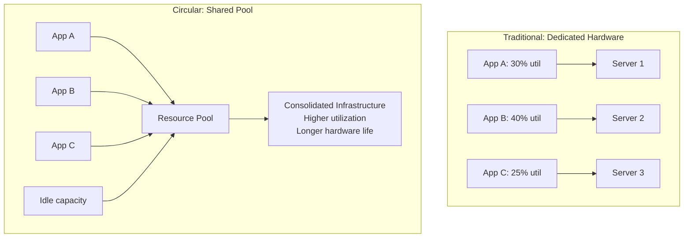
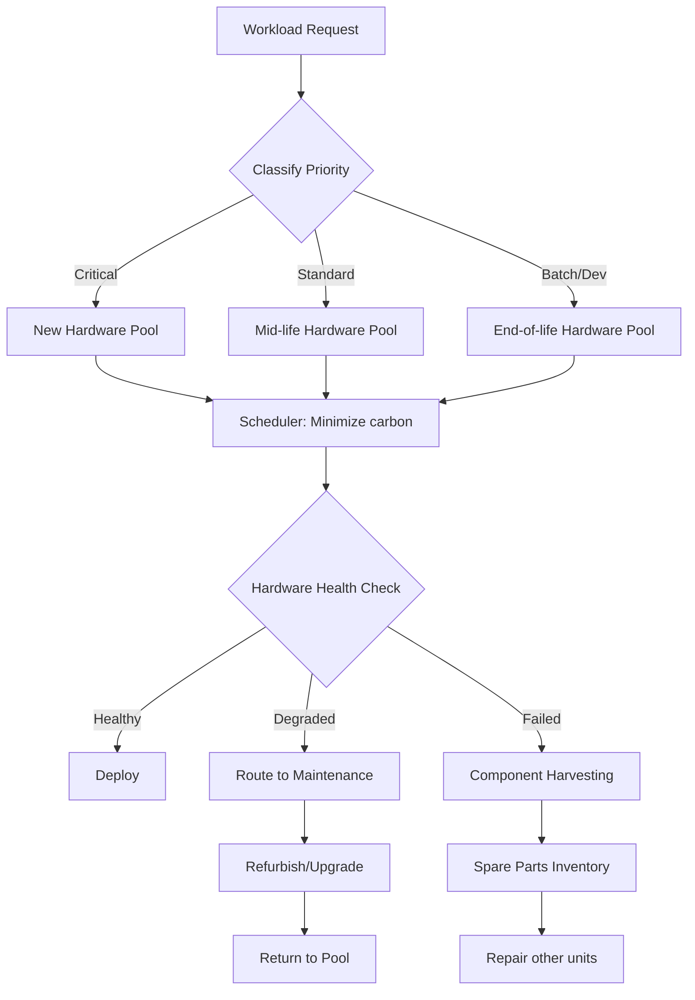

# Circular Economy in Technology: Deep Dive Analysis

## 1. Mục tiêu của Task

Hiểu sâu về **Circular Economy (Kinh tế tuần hoàn)** trong ngữ cảnh công nghệ - từ góc nhìn của Senior Backend Architect. Không chỉ dừng ở khái niệm "xanh" hay trách nhiệm xã hội, mà tập trung vào:

- **Bản chất cơ chế**: Làm thế nào để thiết kế hệ thống backend hỗ trợ tuổi thọ phần cứng dài hạn, tái sử dụng tài nguyên, và giảm thiểu e-waste thông qua kiến trúc phần mềm.
- **Trade-off kinh tế-kỹ thuật**: Chi phí ngắn hạn vs lợi ích dài hạn, performance vs sustainability.
- **Vận hành thực tế**: Monitoring, metrics, và operational practices cho circular tech infrastructure.

> **Lưu ý quan trọng**: Circular Economy không chỉ là "đổi máy cũ lấy máy mới" hay recycling đơn thuần. Đó là **thiết kế để tái sử dụng, sửa chữa, và kéo dài vòng đởi** ngay từ đầu.

---

## 2. Bản Chất và Cơ Chế Hoạt Động

### 2.1 Linear vs Circular Economy Model

```
LINEAR ECONOMY (Traditional):
Extract → Manufacture → Use → Dispose
   ↑________________________________↓
         (one-way, resource depletion)

CIRCULAR ECONOMY:
Extract → Manufacture → Use → Collect → Refurbish/Remanufacture → Reuse
   ↑______________________________________________________________↓
         (closed-loop, resource regeneration)
```

### 2.2 Ba Nguyên Tắc Cốt Lõi trong Tech

| Nguyên tắc | Ý nghĩa trong Backend/Cloud | Ví dụ thực tế |
|------------|----------------------------|---------------|
| **Eliminate Waste** | Thiết kế hệ thống không tạo ra "digital waste" - unused resources, over-provisioning | Right-sizing, auto-scaling chính xác, ephemeral compute |
| **Circulate Products** | Kéo dài vòng đởi phần cứng qua software optimization | ARM-based servers (hiệu quả năng lượng), workload consolidation |
| **Regenerate Nature** | Carbon negativity, renewable energy, biodiversity | Carbon-aware scheduling, water-positive data centers |

### 2.3 Cơ Chế: Hardware Lifecycle Extension qua Software Architecture

Đây là điểm then chốt mà Backend Architect cần hiểu: **Phần mềm có thể kéo dài tuổi thọ phần cứng**.

#### Mechanism 1: Workload Efficiency Optimization

Khi phần cứng cũ đi, thay vì thay thế, ta tối ưu phần mềm để chạy hiệu quả hơn:

```
Hardware Year 1:    100% capacity, 60% utilization
Hardware Year 3:    80% effective capacity (aging), 70% utilization (optimized software)
                    → Vẫn đáp ứng demand mà không cần refresh
```

**Cách thực hiện:**
- **Algorithmic efficiency**: O(n²) → O(n log n) có thể giảm 30-50% CPU cycles
- **Memory optimization**: Reduced allocation pressure = less hardware stress
- **I/O batching**: Giảm số lần disk access, kéo dài SSD lifespan

#### Mechanism 2: Resource Pooling & Virtualization



#### Mechanism 3: Graded Hardware Utilization

Phân loại workload theo yêu cầu phần cứng:

| Tier | Hardware Age | Workload Type | SLA |
|------|-------------|---------------|-----|
| **Tier 1** | 0-2 years | Critical, latency-sensitive | 99.99% |
| **Tier 2** | 2-4 years | Standard business logic | 99.9% |
| **Tier 3** | 4-6 years | Batch jobs, analytics, dev/test | 99% |
| **Tier 4** | 6+ years | Archive, cold storage | Best effort |

> **Insight**: Không phải mọi workload cần hardware mới nhất. Việc **định tuyến đúng workload đến đúng generation hardware** kéo dài tổng vòng đởi fleet.

---

## 3. Kiến Trúc và Luồng Xử Lý

### 3.1 Circular-Aware Resource Scheduler



### 3.2 Hardware Health-Aware Load Balancing

Thay vì round-robin hoặc least-connections, sử dụng **hardware health metrics**:

```java
// Conceptual architecture - NOT production code
class CircularLoadBalancer {
    
    // Health dimensions beyond CPU/Mem
    class HardwareHealth {
        double thermalStressScore;      // Accumulated heat exposure
        int powerOnHours;               // Total runtime
        int thermalCycles;              // Power on/off cycles
        double predictedFailureRisk;    // ML-based prediction
        double carbonCostPerRequest;    // Efficiency degradation
    }
    
    RouteDecision selectTarget(Request req) {
        // Prefer healthy hardware for critical requests
        // Allow degraded hardware for non-critical batch jobs
        // Gradually drain hardware approaching EOL
    }
}
```

### 3.3 Component-Level Circular Economy

Không phải lúc nào cũng thay cả server. **Modular design** cho phép:

```
Server Chassis (10-15 year lifespan)
├── CPU Module: Upgrade every 3-5 years
├── Memory: Add/Replace every 2-4 years  
├── Storage: Replace SSDs as they wear
├── Power Supply: Replace when efficiency drops
└── Network: Upgrade NICs independently
```

**Backend implications:**
- Abstract hardware specs trong code (không hardcode CPU features)
- Graceful degradation khi một component thay đổi
- Storage abstraction layer cho phép mix SSD generations

---

## 4. So Sánh Các Lựa Chọn

### 4.1 Hardware Refresh Strategies

| Strategy | CAPEX Pattern | Sustainability | Risk | Best For |
|----------|---------------|----------------|------|----------|
| **Big Bang** (3-year full refresh) | Spike every 3 years | Low (waste generation) | Low (known state) | Stable, predictable workloads |
| **Rolling Refresh** (continuous) | Smooth, predictable | Medium | Medium | Large fleets, standardization |
| **Life Extension** (use until failure) | Minimal | High (if managed) | High (unpredictable failures) | Non-critical, fault-tolerant systems |
| **Circular Tiering** (this research) | Smooth, optimized | Very High | Medium (requires monitoring) | Cloud-native, diverse workloads |

### 4.2 Cloud vs On-Premises Circular Economy

| Aspect | Cloud Provider | Enterprise On-Prem |
|--------|---------------|-------------------|
| **Hardware Lifecycle** | Provider manages, opaque to user | Full control and visibility |
| **Optimization Lever** | Software efficiency only | Software + Hardware + Facility |
| **Carbon Reporting** | Shared responsibility, limited visibility | Direct measurement and control |
| **Circular Practices** | Limited influence (choose "green" regions) | Full implementation potential |
| **Trade-off** | Convenience vs Control | Complexity vs Impact |

> **Quan điểm của Architect**: Cloud không tự động "xanh" hơn on-prem. Cloud providers có economies of scale cho efficiency, nhưng **khách hàng mất visibility và control** để tối ưu circularity.

### 4.3 E-Waste vs Digital Waste

| Loại | Nguồn gốc | Backend Impact | Giảm thiểu |
|------|-----------|----------------|------------|
| **Physical E-Waste** | Hardware disposal | Indirect (drives refresh decisions) | Life extension, refurbishment |
| **Digital Waste** | Unused cloud resources, over-provisioning | **Direct and immediate** | Right-sizing, auto-shutdown, ephemeral resources |
| **Data Waste** | Orphaned data, duplicates, logs không cần thiết | Storage cost, backup overhead | Lifecycle policies, deduplication, intelligent tiering |

**Digital Waste** là nơi Backend Architect có **impact trực tiếp nhất**.

---

## 5. Rủi Ro, Anti-Patterns, và Lỗi Thường Gặp

### 5.1 Anti-Pattern: "Greenwashing" Metrics

```
❌ Sai: Báo cáo "carbon neutral" nhờ mua carbon offset
   → Không giảm thực tế, chỉ chuyển trách nhiệm

✅ Đúng: Measure và giảm Scope 1, 2, 3 emissions thực tế
   → Transparency về giới hạn và progress
```

### 5.2 Anti-Pattern: Over-Optimization

```
❌ Sai: Ép hardware cũ chạy workload không phù hợp
   → Degraded performance, poor UX, hidden technical debt

✅ Đúng: Match workload requirements với hardware capability
   → Acceptable trade-off giữa sustainability và performance
```

### 5.3 Risk: Hardware Failure Cascade

**Vấn đề**: Khi fleet già đi cùng lúc (batch purchase), failure rate tăng đột biến.

**Mitigation**:
- Staggered procurement (không mua tất cả cùng lúc)
- Predictive maintenance dựa trên ML
- Automated failover và graceful degradation
- Spare capacity buffer (N+1 trên aged hardware)

### 5.4 Risk: Security on Aged Hardware

| Risk | Mô tả | Mitigation |
|------|-------|------------|
| **No TPM 2.0** | Hardware cũ không hỗ trợ modern security | Software-based encryption, isolated networks |
| **No Secure Boot** | Boot chain vulnerable | Network boot, verified boot images |
| **Side-channel vulnerabilities** | Spectre/Meltdown trên CPUs cũ | Microcode updates, workload isolation |
| **Supply chain** | Khó tìm replacement parts | Pre-purchase spare components |

### 5.5 Edge Case: Regulatory Compliance

Một số industries (finance, healthcare) có **compliance requirements** về hardware:
- FIPS 140-2 certification
- Common Criteria evaluation
- Physical tamper evidence

**Hệ quả**: Hardware aged có thể không đáp ứng new compliance requirements → forced refresh despite functional.

---

## 6. Khuyến Nghị Thực Chiến trong Production

### 6.1 Metrics và Monitoring

```yaml
# Circular Economy KPIs cho Backend Infrastructure
circular_metrics:
  hardware:
    - average_server_lifespan_years
    - percentage_refurbished_components
    - e_waste_generated_kg_per_year
    - component_reuse_rate
    
  efficiency:
    - compute_per_watt_trend
    - utilization_efficiency_score
    - carbon_intensity_per_request
    - embodied_carbon_amortization
    
  operational:
    - hardware_failure_prediction_accuracy
    - mean_time_between_failures_by_age
    - cost_per_compute_unit_over_lifecycle
```

### 6.2 Implementation Roadmap

**Phase 1: Assessment (Months 1-2)**
```
1. Inventory current hardware fleet (age, spec, health)
2. Baseline current utilization and efficiency metrics
3. Classify workloads by criticality and resource requirements
4. Calculate current carbon footprint và e-waste generation
```

**Phase 2: Quick Wins (Months 3-4)**
```
1. Implement right-sizing (eliminate over-provisioning)
2. Enable auto-shutdown cho dev/test environments
3. Implement data lifecycle policies (delete orphans)
4. Enable carbon-aware scheduling (shift to low-carbon times)
```

**Phase 3: Circular Integration (Months 5-8)**
```
1. Deploy tiered hardware pools
2. Implement hardware health-aware scheduling
3. Establish refurbishment pipeline
4. Create component harvesting process
```

**Phase 4: Optimization (Ongoing)**
```
1. ML-based failure prediction
2. Automated workload migration based on hardware health
3. Supply chain integration for component sourcing
4. Circular design principles in new architecture
```

### 6.3 Tooling Recommendations

| Category | Tools | Purpose |
|----------|-------|---------|
| **Carbon Measurement** | Cloud Carbon Footprint, Climatiq, Electricity Maps | Quantify emissions |
| **Hardware Monitoring** | Prometheus + node_exporter, Intel RDT, AMD uProf | Track hardware health |
| **Predictive Maintenance** | Custom ML models, Prophet, cloud provider tools | Predict failures |
| **Resource Optimization** | Kubecost, Vantage, CloudHealth | Cost/efficiency visibility |
| **Circular Platform** | Circularise, Provenance | Supply chain tracking |

### 6.4 Design Principles cho Circular-Aware Backend

```
1. ABSTRACT HARDWARE
   - Không hardcode CPU features, core counts, memory sizes
   - Use resource requests/limits, not specific instance types

2. DESIGN FOR DEGRADATION
   - Graceful performance reduction khi resource constrained
   - Circuit breakers và fallback paths

3. EPHEMERAL BY DEFAULT
   - Stateless services có thể migrate dễ dàng
   - Data persisted to durable storage (separate lifecycle)

4. OBSERVABILITY FIRST
   - Monitor cả hardware health lẫn application performance
   - Correlate để detect aging impact

5. AUTOMATED LIFECYCLE MANAGEMENT
   - Auto-scaling cho demand
   - Auto-retirement cho end-of-life hardware
   - Auto-migration dựa trên health metrics
```

---

## 7. Kết Luận

### Bản Chất Cốt Lõi

**Circular Economy trong Tech** không phải là "làm ít đi" hay "từ bỏ hiệu năng". Đó là **thiết kế thông minh hơn** để:

1. **Tối đa hóa giá trị** từ mỗi unit tài nguyên (hardware, energy, data)
2. **Giảm thiểu waste** ở cả physical và digital layers
3. **Kéo dài vòng đởi** thông qua software optimization và operational excellence

### Trade-off Chính

| Trade-off | Lựa chọn |
|-----------|----------|
| **Short-term cost vs Long-term sustainability** | Đầu tư vào life extension thường rẻ hơn refresh sớm |
| **Performance vs Efficiency** | Acceptable degradation cho non-critical workloads |
| **Complexity vs Impact** | On-prem cho full control, Cloud cho convenience |
| **Innovation vs Stability** | Gradual adoption thay vì big bang |

### Rủi Ro Lớn Nhất

**Hardware Failure Cascade** khi fleet aged đồng loạt. **Mitigation**: Staggered procurement, predictive maintenance, và automated failover.

### Khuyến Nghị Cuối Cùng

> Là Senior Backend Architect, bạn có **quyền lực thực sự** để impact sustainability thông qua:
> - **Software efficiency**: Code tốt hơn = hardware sống lâu hơn
> - **Resource scheduling**: Đúng workload đúng hardware
> - **Observability**: Measure để improve
> - **Architecture design**: Abstract, ephemeral, degradable

**Circular Economy bắt đầu từ kiến trúc phần mềm**, không chỉ từ phòng procurement.

---

## 8. Tài Liệu Tham Khảo

1. Ellen MacArthur Foundation - Circular Economy in the Data Center Industry
2. Uptime Institute - Data Center Sustainability Report
3. Google - Carbon Intelligent Computing
4. Microsoft - Circular Centers Program
5. AWS - Customer Carbon Footprint Tool
6. European Union - Circular Economy Action Plan
7. ISO 14040/14044 - Life Cycle Assessment

---

*Research completed: 2026-03-28*  
*Researcher: Senior Backend Architect*
