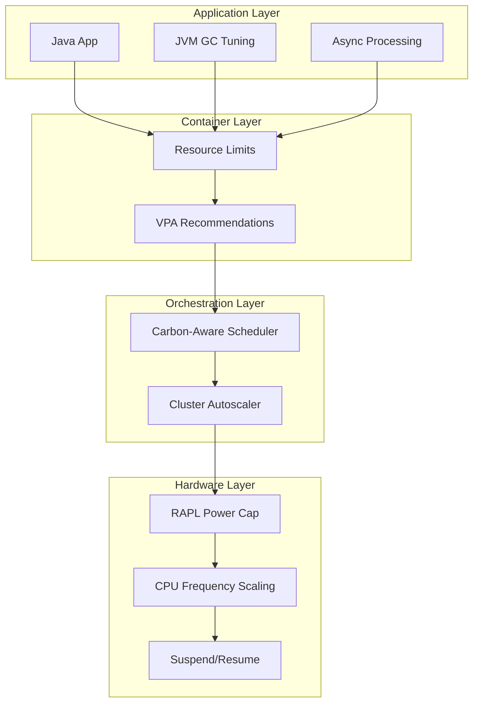

# Energy-Proportional Computing: Power Capping, Right-Sizing và Workload Scheduling

## 1. Mục tiêu của Task

Energy-Proportional Computing (EPC) là khái niệm cốt lõi trong **Sustainable & Green Computing**, nhằm đảm bảo **hệ thống tiêu thụ năng lượng tỷ lệ thuận với công việc thực tế đang thực hiện**. Mục tiêu nghiên cứu:

- Hiểu bản chất: Tại sao hệ thống máy chủ truyền thống **không** energy-proportional
- Phân tích cơ chế: Power capping, right-sizing, workload scheduling hoạt động như thế nào ở tầng phần cứng, kernel, và application
- Đánh giá trade-off: Giữa energy efficiency, performance, reliability, và operational complexity
- Áp dụng thực tế: Các chiến lược áp dụng trong production systems, đặc biệt cho Java backend

---

## 2. Bản Chất và Cơ Chế Hoạt Động

### 2.1. Vấn Đề Cốt Lõi: Tại Sao Máy Chủ Không Energy-Proportional?

Máy chủ truyền thống tuân theo **đường cong tiêu thụ điện không tuyến tính**:

```
Power
  │
  │    ╭─────── Idle Power (~60-70% of peak)
  │   ╱
  │  ╱
  │ ╱
  │╱
  └───────────────────────
   0%    50%    100%   Utilization
```

> **Sự thật đau đớn**: Máy chủ ở trạng thái idle vẫn tiêu thụ **60-70% điện năng đỉnh**. Điều này có nghĩa là khi utilization giảm từ 100% xuống 0%, power consumption chỉ giảm 30-40%.

**Hệ quả**: Data centers thường có average utilization **10-50%** nhưng vẫn trả tiền điện gần như tối đa.

### 2.2. Định Nghĩa Energy-Proportional

Một hệ thống energy-proportional lý tưởng có:

```
P(u) = P_idle + (P_peak - P_idle) × u

Trong đó:
- P(u): Power consumption tại utilization u (0 ≤ u ≤ 1)
- P_idle: Power ở trạng thái idle (càng gần 0 càng tốt)
- P_peak: Power ở trạng thái fully loaded
- u: Utilization (0.0 - 1.0)
```

**Mục tiêu thực tế**: Giảm P_idle và làm cho đường cong power curve gần với đường thẳng nhất có thể.

---

## 3. Kiến Trúc và Cơ Chế Triển Khai

### 3.1. Power Capping - Giới Hạn Công Suất

#### Bản chất cơ chế

Power capping là kỹ thuật **đặt ngưỡng giới hạn công suất tiêu thụ tối đa** cho hệ thống. Khi hệ thống chạm ngưỡng, các cơ chế điều chỉnh được kích hoạt:

**Tầng phần cứng (Intel RAPL, AMD Power Profile):**
- **RAPL (Running Average Power Limit)**: Giới hạn power ở mức CPU package, DRAM
- **DVFS (Dynamic Voltage and Frequency Scaling)**: Giảm tần số CPU khi chạm power cap
- **Turbo Boost throttling**: Tắt/tắt các core hoặc giảm turbo frequency

**Luồng điều chỉnh:**
```
┌─────────────────┐
│  Power Monitor  │◄─── Đọc MSRs (Model-Specific Registers)
└────────┬────────┘
         │
         ▼
┌─────────────────┐
│  So sánh với   │
│   Power Cap    │
└────────┬────────┘
         │
    Vượt quá?
    /        \
   Có         Không
   │           │
   ▼           ▼
┌────────┐  ┌────────┐
│ DVFS   │  │ Normal │
│ Active │  │  Op    │
└────────┘  └────────┘
```

#### Trade-offs của Power Capping

| Ưu điểm | Nhược điểm |
|---------|-----------|
| Giảm tiêu thụ điện trực tiếp | Performance degradation khi cap quá thấp |
| Bảo vệ breaker/thiết bị | Latency tăng do frequency scaling |
| Predictable power budget | Có thể gây tail latency trong distributed systems |
| Cho phép oversubscription | Cần tuning liên tục theo workload |

**Ngưỡng khuyến nghị**: 
- **80-90% của TDP** (Thermal Design Power) cho production workloads
- **60-70% TDP** cho batch processing non-critical

### 3.2. Right-Sizing - Chọn Đúng Kích Thước

Right-sizing là quá trình **matching resource allocation với actual demand** ở mọi tầng:

#### Tầng Instance/VM

```
┌─────────────────────────────────────┐
│  Over-Provisioning (Truyền thống)   │
│  Request: 4 CPU, 16GB RAM           │
│  Actual usage: 1 CPU, 4GB RAM       │
│  Waste: 75% CPU, 75% RAM            │
└─────────────────────────────────────┘
              ↓
┌─────────────────────────────────────┐
│  Right-Sizing                       │
│  Request: 2 CPU, 8GB RAM            │
│  Actual usage: 1.5 CPU, 6GB RAM     │
│  Waste: 25% CPU, 25% RAM            │
└─────────────────────────────────────┘
```

#### Cơ chế Right-Sizing trong Kubernetes

```yaml
apiVersion: apps/v1
kind: Deployment
spec:
  template:
    spec:
      containers:
      - name: app
        resources:
          requests:
            cpu: "500m"        # ← Right-sized dựa trên profiling
            memory: "1Gi"
          limits:
            cpu: "2000m"       # ← Burst capacity
            memory: "2Gi"
```

**Vertical Pod Autoscaler (VPA)** tự động hóa right-sizing:

```
┌──────────────┐     ┌──────────────┐     ┌──────────────┐
│   Metrics    │────►│   VPA Recommender │──►│  New       │
│  (CPU/Mem)   │     │  (ML-based)      │   │  Resources │
└──────────────┘     └──────────────┘     └──────────────┘
                                                    │
                                                    ▼
                                              ┌──────────┐
                                              │ Evict &  │
                                              │ Reschedule│
                                              └──────────┘
```

#### Trade-offs Right-Sizing

| Chiến lược | Ưu điểm | Rủi ro |
|------------|---------|--------|
| Conservative (high request) | Stable performance, no OOM | Resource waste, higher cost |
| Aggressive (low request) | High density, low cost | OOM kills, CPU throttling, latency spikes |
| Auto-scaling reactive | Balance | Delay in response, cold start |
| Predictive auto-scaling | Proactive | Complexity, prediction errors |

> **Quy tắc vàng**: Right-sizing không phải là "set và quên". Workload patterns thay đổi theo mùa, theo tính năng mới. Cần **continuous re-evaluation**.

### 3.3. Workload Scheduling cho Energy Efficiency

#### Carbon-Aware Scheduling

Scheduling dựa trên **carbon intensity của grid** tại thời điểm và địa điểm:

```
Carbon Intensity (gCO2/kWh)
    │
 200├────╭─╮
    │   ╱   ╲    ╭──╮
 150├───╱     ╲──╱  ╲───
    │  ╱                  ╲
 100├─╱                    ╲────
    │
    └──────────────────────────────►
      00:00  06:00  12:00  18:00  24:00
      
      ↑ Flexible workloads
        được schedule vào
        thời điểm carbon thấp
```

**Thuật toán scheduling:**
```
score(node) = w1×(1/carbon_intensity) + 
              w2×(1/latency_to_user) + 
              w3×renewable_energy_ratio
```

#### Temporal Shifting vs Spatial Shifting

| Kỹ thuật | Mô tả | Ứng dụng |
|----------|-------|----------|
| **Temporal Shifting** | Delay workload đến thời điểm carbon thấp hơn | Batch jobs, ML training, CI/CD |
| **Spatial Shifting** | Di chuyển workload đến region có carbon thấp hơn | Geo-distributed systems, CDN |
| **Load Shaping** | Điều chỉnh mức độ parallelism theo available clean energy | Auto-scaling groups |

#### Kubernetes Carbon-Aware Scheduling

```yaml
apiVersion: v1
kind: Pod
metadata:
  annotations:
    # GKE Carbon Autoscaling
    gke.io/carbon-intensity-threshold: "100"  # gCO2/kWh
spec:
  schedulerName: carbon-aware-scheduler
```

---

## 4. Luồng Xử Lý và Sơ Đồ Kiến Trúc

### 4.1. End-to-End Energy-Proportional System



### 4.2. Power Management Stack trong Linux

```
┌─────────────────────────────────────────┐
│         Application (Java)              │
│  - Power-aware algorithms               │
│  - Energy efficiency metrics            │
├─────────────────────────────────────────┤
│         JVM                             │
│  - Energy-efficient GC (ZGC, Shenandoah)│
│  - JIT compilation optimization         │
├─────────────────────────────────────────┤
│         Container Runtime               │
│  - cgroup v2 memory.pressure            │
│  - CPU quota throttling                 │
├─────────────────────────────────────────┤
│         OS Kernel                       │
│  - cpufreq governors (ondemand, powersave)
│  - schedutil (scheduler-guided DVFS)    │
│  - suspend-to-RAM, hibernation          │
├─────────────────────────────────────────┤
│         Firmware/Hardware               │
│  - Intel RAPL / AMD Power Profile       │
│  - ACPI P-states, C-states              │
│  - DDR power down modes                 │
└─────────────────────────────────────────┘
```

---

## 5. So Sánh Các Chiến Lược

### 5.1. Static vs Dynamic Power Management

| Tiêu chí | Static | Dynamic |
|----------|--------|---------|
| **Response time** | Immediate | Có độ trễ |
| **Granularity** | Course (server-level) | Fine (component-level) |
| **Complexity** | Thấp | Cao |
| **Efficiency** | 60-70% | 80-90% |
| **Use case** | Predictable workloads | Variable workloads |
| **Ví dụ** | Fixed power cap, scheduled shutdown | RAPL, DVFS, auto-scaling |

### 5.2. Horizontal vs Vertical Scaling từ Góc Nhìn Energy

```
Energy Efficiency Comparison:

Vertical Scaling (Bigger machine)
├─ Pros: Better PUE, shared resources
├─ Cons: Harder to right-size, single point of failure
└─ Energy: Good for steady workloads

Horizontal Scaling (More small machines)
├─ Pros: Fine-grained right-sizing, fault isolation
├─ Cons: Networking overhead, coordination costs
└─ Energy: Better for bursty, can scale to zero

"Scale to Zero" (Serverless)
├─ Pros: Zero idle energy
├─ Cons: Cold start latency
└─ Energy: Tối ưu cho sporadic workloads
```

---

## 6. Rủi Ro, Anti-Patterns và Lỗi Thường Gặp

### 6.1. Anti-Patterns

#### 1. **Over-Aggressive Power Capping**
```java
// ❌ Sai: Capping quá thấp gây performance degradation
powerCap.setLimit(50); // 50% TDP cho production workload

// ✅ Đúng: Để lại headroom cho burst
powerCap.setLimit(85); // 85% TDP với monitoring
```

#### 2. **Right-Sizing Without Headroom**
```yaml
# ❌ Sai: Không có burst capacity
resources:
  requests:
    cpu: "100m"
  limits:
    cpu: "100m"  # Hard limit = request

# ✅ Đúng: Headroom cho spike
resources:
  requests:
    cpu: "100m"  # Guaranteed
  limits:
    cpu: "500m"  # Burst capacity
```

#### 3. **Carbon Shifting Without Deadline Awareness**
```java
// ❌ Sai: Delay job quá lâu
if (carbonIntensity > threshold) {
    scheduleJob(now().plusHours(6)); // Quá lâu!
}

// ✅ Đúng: Respecting SLAs
Duration maxDelay = job.getSla().getMaxDelay();
if (carbonIntensity > threshold && canDelayWithin(maxDelay)) {
    scheduleJob(findLowCarbonWindow(within=maxDelay));
}
```

### 6.2. Failure Modes trong Production

| Lỗi | Nguyên nhân | Hệ quả | Phòng ngừa |
|-----|-------------|--------|------------|
| **Latency spikes** | DVFS transition delay | User experience degradation | Set min frequency, use latency-critical governor |
| **OOM cascade** | Aggressive memory right-sizing | Service downtime | Buffer pool monitoring, gradual scaling |
| **Cold start storm** | Scale-from-zero + burst | Request timeouts | Pre-warming, predictive scaling |
| **Carbon prediction error** | Inaccurate forecast | Missed optimization window | Ensemble forecasting, fallback to immediate execution |
| **Power cap thrashing** | Oscillating power limit | Unstable performance | Hysteresis in control loop |

### 6.3. Edge Cases

1. **Bursty Workloads**: Power capping không phù hợp cho workload có burst ngắn nhưng intense (ví dụ: flash sale)
   - **Giải pháp**: Sustained power cap thay vì instantaneous

2. **Memory-Bound Workloads**: DVFS ít hiệu quả vì memory không scale với CPU frequency
   - **Giải pháp**: Focus vào memory power management (DRAM self-refresh)

3. **Distributed Transactions**: Temporal shifting có thể vi phạm consistency nếu các phần của transaction được delay khác nhau
   - **Giải pháp**: Atomic shifting decisions

---

## 7. Khuyến Nghị Thực Chiến trong Production

### 7.1. Power Capping Strategy

**Bước 1: Profiling**
```bash
# Intel RAPL - Đọc power consumption
sudo perf stat -a -e power/energy-pkg/

# Turbostat - Chi tiết frequency và power
sudo turbostat --show PkgWatt,CorWatt,GFXWatt,RAMWatt -i 1
```

**Bước 2: Set Power Cap**
```bash
# Intel RAPL - Set power limit (Watts)
echo 65000000 | sudo tee /sys/class/powercap/intel-rapl/intel-rapl:0/constraint_0_power_limit_uw
# 65W limit

# Set time window (microseconds)
echo 1000000 | sudo tee /sys/class/powercap/intel-rapl/intel-rapl:0/constraint_0_time_window_uw
```

**Bước 3: Monitoring**
```yaml
# Prometheus metrics cho power monitoring
- name: node_rapl_power_watts
  help: Current RAPL power consumption in watts
  type: gauge
```

### 7.2. Right-Sizing Best Practices

**VPA Configuration:**
```yaml
apiVersion: autoscaling.k8s.io/v1
kind: VerticalPodAutoscaler
spec:
  targetRef:
    apiVersion: apps/v1
    kind: Deployment
    name: my-app
  updatePolicy:
    updateMode: "Auto"  # Hoặc "Off" để chỉ recommendations
  resourcePolicy:
    containerPolicies:
    - containerName: '*'
      minAllowed:
        cpu: 50m
        memory: 100Mi
      maxAllowed:
        cpu: 4
        memory: 8Gi
      controlledResources: ["cpu", "memory"]
```

**Phân tích recommendations:**
```bash
kubectl describe vpa my-app-vpa
# Kiểm tra: Target vs Current vs Uncapped Target
```

### 7.3. Carbon-Aware Workload Scheduling

**Implementation Pattern:**
```java
@Service
public class CarbonAwareScheduler {
    
    private final CarbonIntensityApi carbonApi;
    private final JobRepository jobRepository;
    
    public void scheduleBatchJob(BatchJob job) {
        Duration maxDelay = job.getMaximumDelay();
        LocalDateTime now = LocalDateTime.now();
        LocalDateTime deadline = now.plus(maxDelay);
        
        // Lấy forecast cho window
        List<CarbonForecast> forecasts = carbonApi.getForecast(now, deadline);
        
        // Tìm thời điểm carbon thấp nhất trong window
        Optional<CarbonForecast> optimal = forecasts.stream()
            .min(Comparator.comparing(CarbonForecast::getIntensity));
        
        if (optimal.isPresent() && 
            optimal.get().getIntensity() < THRESHOLD) {
            job.scheduleAt(optimal.get().getTimestamp());
        } else {
            // Không thể delay hoặc không có window tốt
            job.scheduleAt(now);
        }
    }
}
```

### 7.4. Java-Specific Optimizations

**JVM GC Selection cho Energy Efficiency:**

| GC | Energy Profile | Use Case |
|----|---------------|----------|
| **ZGC** | Thấp pause, predictable | Latency-sensitive, consistent power |
| **Shenandoah** | Low pause, concurrent | Similar to ZGC |
| **G1** | Balanced | General purpose |
| **Parallel** | Throughput max, bursty power | Batch processing |

**Energy-aware JVM flags:**
```bash
# Prefer energy efficiency over raw throughput
-XX:+UseContainerSupport
-XX:InitialRAMPercentage=70.0
-XX:MaxRAMPercentage=70.0

# ZGC for consistent power profile
-XX:+UseZGC
-XX:+ZGenerational  # Java 21+

# JIT compiler tuning
-XX:CICompilerCount=2  # Reduce compiler threads if not CPU-bound
```

---

## 8. Công Cụ và Thư Viện Hiện Đại

### 8.1. Cloud Provider Tools

| Provider | Tool | Chức năng |
|----------|------|-----------|
| **GCP** | Carbon Footprint | Export carbon data, region comparison |
| **GCP** | Carbon Autoscaling | Schedule based on carbon intensity |
| **Azure** | Carbon Optimization | Workload placement recommendations |
| **AWS** | Customer Carbon Footprint Tool | Reporting và optimization |
| **AWS** | Spot Instances | Cost và energy efficient (utilize idle capacity) |

### 8.2. Open Source Tools

```bash
# Kepler - Kubernetes-based Efficient Power Level Exporter
# Đo lường power consumption của từng pod
kubectl apply -f https://github.com/sustainable-computing-io/kepler/releases/download/v0.7.11/kepler.yaml

# Scaphandre - Rust-based power measurement
scaphandre prometheus -p 8080

# PowerAPI - Software-defined power meters
powerapi formula --input hwpc-sensor --output csv

# EcoQoS - Windows quality of service cho efficiency
Set-ProcessEfficiencyClass -ProcessName "java" -EfficiencyClass 1
```

### 8.3. Java Libraries

```java
// JoularJX - Power monitoring cho Java
// https://gitlab.com/joular/joularjx

// Power monitoring trong Java
PowerMonitor monitor = new PowerMonitor();
monitor.start();
// ... code cần measure ...
PowerData data = monitor.stop();
System.out.println("Energy consumed: " + data.getJoules() + " J");
```

---

## 9. Monitoring và Observability

### 9.1. Key Metrics

| Metric | Đơn vị | Ý nghĩa |
|--------|--------|---------|
| **Power Usage** | Watts | Tiêu thụ điện hiện tại |
| **Energy per Request** | Joules/request | Efficiency của application |
| **Carbon per Request** | gCO2/request | Environmental impact |
| **PUE (Power Usage Effectiveness)** | Ratio | Tổng facility power / IT equipment power |
| **Idle Power Ratio** | % | Idle power / Peak power (càng thấp càng tốt) |

### 9.2. Dashboard Example

```yaml
# Grafana dashboard cho energy monitoring
panels:
  - title: "Power Consumption by Service"
    targets:
      - expr: kepler_container_joules_total{container="my-app"}
        legendFormat: "{{pod}}"
  
  - title: "Carbon Intensity"
    targets:
      - expr: carbon_intensity_g_co2_per_kwh{region="us-central1"}
  
  - title: "Energy per Request"
    targets:
      - expr: |
          sum(rate(kepler_container_joules_total[5m])) 
          / 
          sum(rate(http_requests_total[5m]))
```

---

## 10. Kết Luận

### Bản Chất Energy-Proportional Computing

Energy-Proportional Computing không chỉ là "tiết kiệm điện" - đó là **tư duy thiết kế hệ thống** xuyên suốt từ silicon đến software:

1. **Tầng phần cứng**: DVFS, RAPL, heterogeneous cores (ARM big.LITTLE, Intel P-cores/E-cores)
2. **Tầng kernel**: Schedulers, cpufreq governors, power states
3. **Tầng container**: Resource limits, VPA, quality of service
4. **Tầng application**: Algorithms, data structures, concurrency models
5. **Tầng orchestration**: Carbon-aware scheduling, auto-scaling

### Trade-off Quan Trọng Nhất

> **Energy vs Performance vs Reliability - Chọn 2 trong 3**

| Ưu tiên | Kết hợp | Chi phí |
|---------|---------|---------|
| Energy + Performance | Sacrifice reliability | Aggressive optimization risk |
| Energy + Reliability | Sacrifice performance | Conservative settings |
| Performance + Reliability | Sacrifice energy | Traditional approach |

### Rủi Ro Lớn Nhất trong Production

1. **Death by a thousand cuts**: Micro-optimizations không coordinated gây hiệu ứng ngược
2. **Prediction errors**: Carbon/weather forecasting sai dẫn đến SLA violations
3. **Observability gaps**: Không đo được thì không optimize được

### Checklist Triển Khai

- [ ] Profile workload để hiểu power characteristics
- [ ] Set up RAPL monitoring trên tất cả nodes
- [ ] Implement VPA cho Kubernetes workloads
- [ ] Deploy carbon intensity API integration
- [ ] Define energy efficiency SLIs/SLOs
- [ ] Create runbook cho power-related incidents
- [ ] Train team về energy-proportional design patterns

---

## Tài Liệu Tham Khảo

1. Barroso, L.A., & Hölzle, U. (2007). *The Case for Energy-Proportional Computing*. IEEE Computer.
2. Raghavendra, R., et al. (2008). *No "Power" Struggles: Coordinated Multi-level Power Management*. ACM SIGPLAN.
3. Google Carbon Intelligence. *Carbon-Aware Computing*.
4. Microsoft Research. *Towards Carbon-Aware Datacenters*.
5. Sustainable Digital Infrastructure Alliance. *SDIA Standards*.

---

*Document được tạo bởi Senior Backend Architect AI - Focus vào bản chất, trade-offs và production concerns.*
