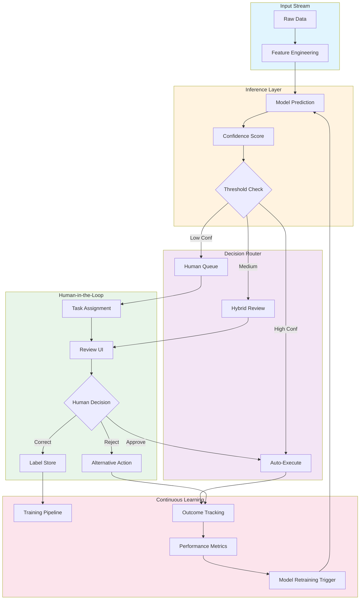
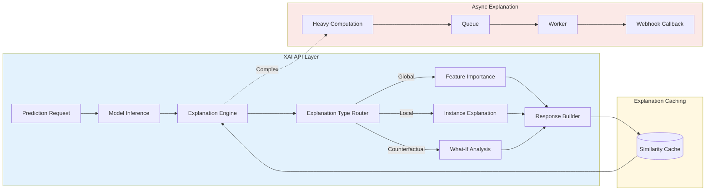

# Augmented Intelligence Patterns

## 1. Mục tiêu của Task

Tìm hiểu các pattern kiến trúc cho hệ thống **Augmented Intelligence (AI tăng cường)** - nơi con ngườivà máy móc cộng tác để ra quyết định, thay vì AI hoàn toàn tự động. Tập trung vào:

- **Human-in-the-loop (HITL)**: Cơ chế tích hợp phản hồi ngườidùng vào pipeline ML
- **Collaborative Decision Systems**: Kiến trúc phân quyền quyết định giữa human và AI
- **Explainable AI (XAI) APIs**: Thiết kế API cung cấp khả năng giải thích quyết định AI

> **Bản chất vấn đề**: Không phải "AI thay thế human", mà là "AI + Human > AI alone hoặc Human alone". Đây là triết lý cốt lõi của Augmented Intelligence.

---

## 2. Bản Chất và Cơ Chế Hoạt Động

### 2.1 Human-in-the-Loop (HITL) Architecture

#### Bản chất cơ chế

HITL không đơn thuần là "gửi notification cho user review". Đó là một **feedback control system** với vòng lặp closed-loop:

```
Model Prediction → Confidence Scoring → Decision Gate → [Low Confidence] → Human Review → Label Feedback → Model Retraining
                                    ↘ [High Confidence] → Auto-execution
```

**Tầng thấp hoạt động như thế nào:**

1. **Confidence Calibration**: Mô hình output probability không đồng nghĩa với "confidence thực". Cần calibration (Platt scaling, isotonic regression) để probability phản ánh đúng khả năng đúng/sai.

2. **Uncertainty Quantification**: Có 2 loại uncertainty:
   - **Aleatoric**: Noise tự nhiên trong data (không giảm được)
   - **Epistemic**: Uncertainty do model chưa học đủ (giảm được bằng cách thu thập thêm data)
   
   HITL hiệu quả khi tập trung vào epistemic uncertainty - những vùng model "không biết là không biết".

3. **Active Learning Loop**: Không phải human review random samples. Hệ thống chọn **most informative samples** (entropy cao nhất, margin thấp nhất) để tối ưu hóa hiệu quả labeling.

#### Mục tiêu thiết kế

| Mục tiêu | Bài toán giải quyết | Giới hạn chấp nhận |
|----------|---------------------|-------------------|
| Cải thiện accuracy | Auto-prediction sai → human catch | Latency tăng, throughput giảm |
| Xử lý edge cases | Data distribution drift, outliers | Cost human time cao |
| Compliance & Audit | Cần "human sign-off" cho quyết định quan trọng | Bottleneck ở quy trình |
| Continuous learning | Human feedback → model improvement | Feedback quality không đảm bảo |

### 2.2 Collaborative Decision Systems

#### Bản chất: Phân quyền ra quyết định

Không phải binary "human decide" hay "AI decide". Là **gradient of autonomy**:

```
Level 0: AI gợi ý, human quyết định (Decision Support)
Level 1: AI quyết định, human phê duyệt (Human Validation)  
Level 2: AI quyết định, human can thiệp khi cần (Exception Handling)
Level 3: AI tự động hoàn toàn (Full Automation)
```

**Cơ chế chuyển level:**

- **Static delegation**: Rule-based (e.g., amount > $10k → Level 0, amount < $100 → Level 3)
- **Dynamic delegation**: AI self-assessment confidence + context (time pressure, availability)
- **Human-initiated escalation**: Operator override

#### Kiến trúc tầng service

```
┌─────────────────────────────────────────────────────────────┐
│  Decision Orchestrator                                      │
│  - Policy evaluation (static rules + ML-based routing)      │
│  - Load balancing human vs AI capacity                      │
└──────────────────────┬──────────────────────────────────────┘
                       │
        ┌──────────────┼──────────────┐
        ↓              ↓              ↓
┌───────────────┐ ┌──────────┐ ┌───────────────┐
│  AI Service   │ │  Human   │ │  Fallback     │
│  - Prediction │ │  Queue   │ │  (conservative)│
│  - Confidence │ │  - UI    │ └───────────────┘
│  - Latency SLI│ │  - SLA   │
└───────────────┘ └──────────┘
```

**Key insight**: Orchestrator là critical component. Nó phải đưa ra quyết định "ai sẽ đưa ra quyết định" nhanh hơn cả việc đưa ra quyết định đó.

### 2.3 Explainable AI (XAI) APIs

#### Bản chất: Transparency vs. Performance

XAI không phải là "thêm text explanation vào response". Là **exposure of reasoning process** ở mức độ phù hợp với audience:

- **For end-users**: "Tại sao loan bị reject?" → Feature-level explanation (income too low, DTI too high)
- **For domain experts**: "Model đang dùng signal nào?" → SHAP values, feature importance
- **For data scientists**: "Local decision boundary như thế nào?" → LIME, counterfactuals
- **For auditors**: "Training data có bias không?" → Fairness metrics, data lineage

#### Cơ chế giải thích

**Model-agnostic methods:**
- **LIME**: Local linear approximation around prediction
- **SHAP**: Game-theoretic feature attribution
- **Counterfactuals**: "Thay đổi input nào sẽ đổi kết quả?"

**Model-specific methods:**
- **Attention weights**: Transformer self-attention visualization
- **Grad-CAM**: Gradient-weighted class activation mapping (CNN)
- **Decision tree paths**: Rule extraction from ensemble

**Trade-off cốt lõi:**

| Phương pháp | Fidelity | Interpretability | Compute Cost | Use case |
|-------------|----------|------------------|--------------|----------|
| LIME | Medium | High | High | Interactive UI |
| SHAP | High | Medium | Very High | Batch analysis |
| Attention | High (for NLP) | Medium | Low | Real-time API |
| Counterfactuals | High | High | Very High | User appeals |

---

## 3. Kiến Trúc và Luồng Xử Lý

### 3.1 End-to-End HITL Pipeline



### 3.2 XAI API Architecture



---

## 4. So Sánh Các Lựa Chọn

### 4.1 HITL Implementation Strategies

| Strategy | Khi nào dùng | Ưu điểm | Nhược điểm |
|----------|--------------|---------|------------|
| **Pre-filtering** | High-volume, low-stakes decisions | Giảm human workload, giữ throughput | Risk bỏ sót edge cases |
| **Post-hoc review** | Compliance requirements, audit trails | Full coverage, auditability | Latency không quan trọng, human cost cao |
| **Active sampling** | Limited human budget, continuous learning | Tối ưu information gain | Phức tạp implement, cần calibration |
| **Real-time escalation** | Time-sensitive, safety-critical | Nhanh, chỉ escalate khi cần | Cần confidence metric tốt |

### 4.2 Human-AI Collaboration Models

| Model | Pattern | Use Case | Trade-off |
|-------|---------|----------|-----------|
| **Advisor** | AI gợi ý, human quyết | Medical diagnosis, creative tasks | Human cognitive load cao |
| **Validator** | AI decide, human approve | Financial transactions, content moderation | Bottleneck ở approval queue |
| **Teammate** | Negotiation giữa AI và human | Complex scheduling, crisis response | Latency cao, cần sophisticated protocol |
| **Monitor** | AI tự chạy, human supervise | Autonomous vehicles, industrial control | Risk của automation errors |

### 4.3 XAI API Design Patterns

| Pattern | Implementation | Best For | Limitation |
|---------|----------------|----------|------------|
| **Synchronous with cache** | Return explanation trong prediction call | Low-latency requirements | Cache invalidation complexity |
| **Async webhook** | Prediction ID → separate explanation call | Complex explanations (SHAP, counterfactuals) | User experience fragmentation |
| **Streaming** | Server-sent events cho progressive explanation | Large models, user patience | Infrastructure complexity |
| **Pre-computed** | Explanation tính trước cho common patterns | Recommendation systems | Không cover edge cases |

---

## 5. Rủi Ro, Anti-Patterns, Lỗi Thường Gặp

### 5.1 HITL Anti-Patterns

#### 1. **Automation Bias**

> **Vấn đề**: Human reviewers tin tưởng quá mức vào AI predictions, bỏ qua lỗi obvious.

**Nguyên nhân**: 
- UI design làm nổi bật AI prediction (màu xanh, checkmark)
- Time pressure + high AI accuracy history → complacency

**Khắc phục**:
- UI "neutral" design, không bias về AI prediction
- Randomly insert "test cases" để đo lường reviewer vigilance
- Calibration: đảm bảo human không over-rely

#### 2. **Feedback Loop Bias**

> **Vấn đề**: Model retrain trên human-labeled data → human bias được amplify.

**Ví dụ**: Content moderation - reviewers có bias nhất định → model học bias đó → predictions biased → reviewers confirm bias.

**Khắc phục**:
- Diverse reviewer pool
- Inter-rater agreement metrics
- Regular audit với "ground truth" panel

#### 3. **Threshold Drift**

> **Vấn đề**: Confidence threshold đặt một lần, không adapt theo model improvement hoặc data drift.

**Hệ quả**: Ban đầu 30% cases go to human. Sau 6 tháng training, model tốt hơn nhưng vẫn 30% human queue.

**Khắc phục**:
- Dynamic threshold dựa trên business metrics (precision target, human capacity)
- Regular threshold tuning pipeline

### 5.2 Collaborative Decision Anti-Patterns

#### **The Handoff Trap**

Luôn chuyển entire case cho human khi AI uncertain. Thay vì:
- AI xác định **specific sub-problems** cần human input
- Human chỉ resolve phần đó
- AI tiếp tục với human-augmented context

#### **The Black Box Handover**

Human nhận case mà không có context tại sao AI escalate:
- Không có confidence score
- Không có "AI would have predicted X"
- Không có similar cases

→ Human phải làm lại từ đầu, inefficient.

### 5.3 XAI Failure Modes

#### **Explanation Deception**

XAI method cho explanation hợp lý nhưng không reflect actual model reasoning:
- **Clever Hans effect**: Model học spurious correlations (e.g., watermark in medical images)
- XAI shows "relevant features" nhưng không phải causal features

**Phát hiện**: Ablation studies, counterfactual testing.

#### **Explanation Overload**

Trả về quá nhiều explanation data (SHAP values cho 1000 features). User không biết focus vào đâu.

**Solution**: Explanation summarization, highlight top-k factors.

#### **Inconsistent Explanations**

Cùng một input, different runs cho different explanations (LIME randomness). User mất trust.

**Solution**: Deterministic seed, stability metrics.

---

## 6. Khuyến Nghị Thực Chiến trong Production

### 6.1 Monitoring & Observability

#### Metrics cần track

```yaml
hitl_metrics:
  # Operational
  - human_queue_depth: Gauge
  - human_review_latency: Histogram (P50, P95, P99)
  - reviewer_throughput: Rate
  - escalation_rate: Ratio (escalated / total)
  
  # Quality
  - ai_accuracy_on_escalated: Is model correctly uncertain?
  - human_ai_agreement: Kappa score
  - reviewer_calibration: Accuracy on test cases
  - inter_rater_agreement: Fleiss' kappa
  
  # Business
  - decision_latency_end_to_end: Total time
  - cost_per_decision: AI cost + human cost
  - auto_decision_rate: Efficiency metric
```

#### Alerting rules

```yaml
alerts:
  - name: Human Queue Backlog
    condition: queue_depth > capacity * 0.8
    action: Page on-call, trigger auto-acceptance with lower threshold
    
  - name: Model Degradation
    condition: escalation_rate > baseline + 2*stddev
    action: Trigger model rollback investigation
    
  - name: Automation Bias
    condition: human_override_rate < 0.01 AND ai_error_rate > 0.05
    action: Reviewer retraining, UI adjustment
```

### 6.2 Architecture Best Practices

#### Circuit Breaker cho Human Queue

Khi human queue backlog quá lớn (outage, peak load), cần graceful degradation:

```
Queue Depth > Threshold 1: Accept higher risk predictions
Queue Depth > Threshold 2: Pause non-critical decisions
Queue Depth > Threshold 3: Emergency mode - AI-only for safety-critical
```

#### Explanation Caching Strategy

```java
// Pseudo-code cho explanation cache
class ExplanationCache {
    // L1: Exact match cache
    Map<InputHash, Explanation> exactCache;
    
    // L2: Similarity cache (LSH for approximate nearest neighbors)
    LSHIndex<Explanation> similarityCache;
    
    Explanation getOrCompute(Input input) {
        // 1. Check exact match
        if (exactCache.contains(input.hash())) {
            return exactCache.get(input.hash());
        }
        
        // 2. Check similarity (within epsilon distance)
        SimilarResult similar = similarityCache.findNearest(input.vector(), epsilon);
        if (similar.similarity > 0.95) {
            return adaptExplanation(similar.explanation, input);
        }
        
        // 3. Compute fresh
        Explanation fresh = computeExplanation(input);
        cache.put(input, fresh);
        return fresh;
    }
}
```

### 6.3 Security & Privacy

**Explanation leakage risk**: XAI APIs có thể leak thông tin về training data:
- Membership inference attacks qua counterfactual explanations
- Model extraction qua nhiều explanation queries

**Mitigations**:
- Rate limiting trên explanation endpoints
- Differential privacy trong explanation generation
- Access control: chỉ expose explanation cho authorized users

### 6.4 Versioning & Backward Compatibility

**Explanation schema evolution**:

```json
{
  "version": "2.1.0",
  "prediction": {...},
  "explanation": {
    "type": "shap",
    "features": [...],
    // New field in v2.1
    "confidence_interval": {...}
  },
  "deprecated_fields": ["old_format_score"]
}
```

**Breaking changes**: Client consuming XAI cần handle schema changes. Semantic versioning cho explanation contracts.

---

## 7. Cập Nhật Hiện Đại (2024-2025)

### 7.1 Emerging Patterns

**LLM-as-Judge**: Sử dụng Large Language Models để evaluate hoặc augment human decisions:
- LLM summary của complex cases trước khi đến human
- LLM verification của human labels (consistency check)
- Multi-agent debate: Multiple LLMs debate, human làm arbitrator

**Reinforcement Learning from Human Feedback (RLHF)**: 
- Không chỉ collect labels, mà là collect **preferences** (A > B)
- Training reward model từ human preferences
- Fine-tune policy model với PPO

### 7.2 Modern Tooling

| Category | Tools |
|----------|-------|
| HITL Platform | Label Studio, Amazon SageMaker Ground Truth, Scale AI |
| XAI Libraries | SHAP, LIME, Captum (PyTorch), AIX360 (IBM) |
| Monitoring | Evidently AI, WhyLabs, Arize AI |
| Experimentation | Weights & Biases, MLflow, DVC |

### 7.3 Java Ecosystem

**Tribuo (Oracle)**: ML library cho Java với built-in XAI support:
```java
// Tribuo explanation example
var model = trainer.train(trainingData);
var explanation = model.getExplanation(input);
```

**DJL (Deep Java Library)**: Integration với Python ML models, XAI qua ONNX runtime.

---

## 8. Kết Luận

### Bản chất đã làm rõ

**Augmented Intelligence không phải là "AI với human backup"**. Đó là kiến trúc **symbiotic**:

1. **Human-in-the-loop** là feedback control system, không phải manual override. Cần optimize cho information gain, không phải coverage.

2. **Collaborative decision** là gradient, không phải binary. Orchestrator là component quan trọng nhất, quyết định "ai đưa ra quyết định".

3. **XAI APIs** là transparency layer với nhiều audience. Trade-off giữa fidelity, interpretability, và latency là central concern.

### Trade-off cốt lõi

```
Accuracy ↑ ←── HITL ──→ Latency ↓
   ↑                      ↓
Human Cost ↑ ←── Automation ──→ Risk ↑
```

Không có "đúng" hay "sai", chỉ có **optimal point** cho specific use case, risk tolerance, và budget.

### Rủi ro lớn nhất

**Automation bias** và **feedback loop bias** là hai rủi ro systemic có thể làm hỏng entire HITL system. Cần deliberate UI design và continuous monitoring.

### Áp dụng production

Bắt đầu với **decision audit trail** (track ai decide, human decide, với lý do), sau đó iterate:
1. Identify high-error regions
2. Add targeted human review
3. Measure improvement
4. Adjust automation level

> **Final thought**: Augmented Intelligence là acknowledgment rằng perfect automation không tồn tại. Thay vì chasing 100% automation, xây dựng systems leverage complementary strengths của human và AI.
