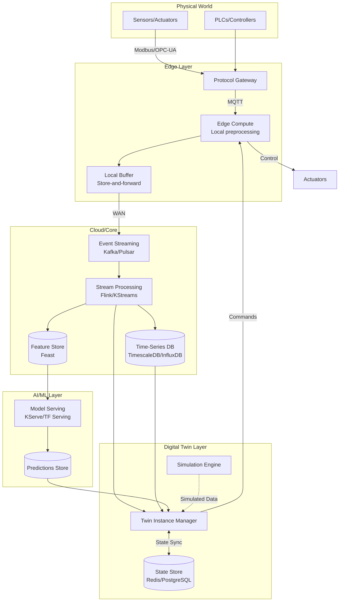

# Digital Twin Ecosystems: Real-time Synchronization, Simulation at Scale & Predictive Modeling Infrastructure

## 1. Mục tiêu của Task

Nghiên cứu bản chất kiến trúc Digital Twin (DT) - hệ sinh thái ảo hóa song song với thế giới vật lý, tập trung vào:
- **Real-time synchronization**: Đồng bộ trạng thái giữa physical asset và digital representation
- **Simulation at scale**: Mô phỏng quy mô lớn với hàng triệu entities
- **Predictive modeling infrastructure**: Nền tảng dự đoán dựa trên dữ liệu DT

> **Định nghĩa cốt lõi**: Digital Twin không chỉ là "3D visualization" hay "dashboard monitoring". Nó là **biểu diễn toán học động (living mathematical model)** của một hệ thống vật lý, được cập nhật real-time thông qua sensor streams và có khả năng predict/simulate behavior trước khi xảy ra.

---

## 2. Bản Chất và Cơ Chế Hoạt Động

### 2.1. Bản Chất Triết Học: "Shadow System"

Digital Twin hoạt động theo nguyên lý **"Shadow System"**:
- **Physical World**: Assets thực tế (turbines, engines, supply chains, cities)
- **Digital Shadow**: Bản sao số được cập nhật liên tục qua IoT/sensors
- **Predictive Layer**: Chạy "what-if" scenarios trên shadow trước khi áp dụng vào physical

```
┌─────────────────────────────────────────────────────────────┐
│                      DIGITAL TWIN LOOP                       │
├─────────────────────────────────────────────────────────────┤
│  ┌──────────────┐        SENSORS         ┌──────────────┐  │
│  │   PHYSICAL   │ ─────────────────────▶ │   DIGITAL    │  │
│  │    ASSET     │   (telemetry data)     │    SHADOW    │  │
│  └──────────────┘                        └──────────────┘  │
│        ▲                                        │           │
│        │         ACTIONS/CONTROL                │ SIMULATE  │
│        └────────────────────────────────────────┘           │
│                           │                                 │
│                           ▼                                 │
│                    ┌──────────────┐                        │
│                    │  PREDICTIVE  │                        │
│                    │    MODEL     │                        │
│                    └──────────────┘                        │
└─────────────────────────────────────────────────────────────┘
```

### 2.2. Cơ Chế Real-time Synchronization

#### 2.2.1. Time-Series Data Ingestion Pipeline

Digital Twins xử lý **high-velocity time-series data** từ sensors:

| Aspect | Characteristic | Implication |
|--------|---------------|-------------|
| **Frequency** | 1Hz - 10kHz+ per sensor | High throughput ingestion |
| **Volume** | TBs per day for industrial DT | Storage must be tiered |
| **Latency** | <100ms for control loops | Critical path optimization |
| **Cardinality** | Millions of unique time-series | Indexing challenge |

**Kiến trúc ingestion pipeline**:

```
Sensors ──▶ Edge Gateway ──▶ Message Queue ──▶ Stream Processor ──▶ Time-Series DB
   │              │                │                   │                  │
   │           [Buffer]        [Kafka/Pulsar]     [Flink/KStreams]  [TimescaleDB]
   │           [Protocol       [Partition by      [Windowed         [Hypertables]
   │            Conversion]      Asset ID]          Aggregations]
   │
   └── Protocols: MQTT/CoAP/OPC-UA/Modbus
```

**Cơ chế quan trọng - Event-time Processing**:
- Sensors có thể gửi out-of-order data
- DT phải xử lý theo **event time**, không phải processing time
- Sử dụng **watermarking** để xác định khi nào có thể trigger computation

```java
// Conceptual watermark mechanism
// Watermark = max_event_time - allowed_lateness

if (event.timestamp < watermark) {
    // Late event - route to side output or drop
} else {
    // Process in window
}
```

#### 2.2.2. State Synchronization Strategies

| Strategy | Use Case | Trade-off |
|----------|----------|-----------|
| **Event Sourcing** | Audit trail quan trọng | Storage overhead cao, replay capability |
| **CRDT (Conflict-free Replicated Data Types)** | Edge-first, intermittent connectivity | Eventually consistent, complex merge logic |
| **Delta Synchronization** | Bandwidth-constrained | Risk of drift if delta lost |
| **Snapshot + Incremental** | Large state objects | Snapshot overhead, consistency windows |

**Khuyến nghị Production**:
- Dùng **Event Sourcing** cho core state (không bao giờ mất history)
- Dùng **CRDT** cho edge devices (offline-first capability)
- Implement **vector clocks** hoặc **hybrid logical clocks** để track causality

### 2.3. Cơ Chế Simulation at Scale

#### 2.3.1. Spatial Partitioning & Federated Simulation

Khi scale lên hàng triệu entities, không thể chạy single monolithic simulation:

```
┌─────────────────────────────────────────────────────────────┐
│              FEDERATED SIMULATION ARCHITECTURE               │
├─────────────────────────────────────────────────────────────┤
│                                                              │
│   ┌────────────┐    HLA/DIS    ┌────────────┐              │
│   │  Region A  │ ◄───────────► │  Region B  │              │
│   │ Simulation │   Protocol    │ Simulation │              │
│   └────────────┘               └────────────┘              │
│         ▲                            ▲                     │
│         │                            │                     │
│   ┌─────┴────────────────────────────┴─────┐               │
│   │         RTI (Runtime Infrastructure)    │               │
│   │  - Time management                      │               │
│   │  - Data distribution                    │               │
│   │  - Ownership transfer                   │               │
│   └─────────────────────────────────────────┘               │
│                                                              │
│   Time Synchronization: Logical Time / Conservative /       │
│                         Optimistic / Time-stepped           │
└─────────────────────────────────────────────────────────────┘
```

**High-Level Architecture (HLA - High Level Architecture)**:
- **Federates**: Independent simulation components (cỗ máy riêng biệt)
- **RTI (Runtime Infrastructure)**: Middleware điều phối
- **FOM (Federation Object Model)**: Shared data model

#### 2.3.2. Time Management Strategies

| Strategy | Mechanism | Use Case |
|----------|-----------|----------|
| **Conservative** | Chỉ advance time khi chắc chắn không có event từ tương lai | Safety-critical systems |
| **Optimistic** | Advance tự do, rollback nếu phát hiện causality violation | High-performance, tolerates rollback cost |
| **Time-stepped** | Tất cả federates sync tại discrete time steps | Balanced approach |

> **Key Insight**: Simulation-time ≠ Wall-clock time. DT có thể **time-warp** - chạy simulation nhanh hơn real-time để predict future states (predictive maintenance, scenario planning).

### 2.4. Cơ Chế Predictive Modeling Infrastructure

#### 2.4.1. ML Pipeline Architecture

```
┌─────────────────────────────────────────────────────────────┐
│              PREDICTIVE MODELING PIPELINE                    │
├─────────────────────────────────────────────────────────────┤
│                                                              │
│  Data Stream ──▶ Feature Engineering ──▶ Model Inference ──▶ │
│      │               │                       │              │
│      │               ▼                       ▼              │
│      │        ┌─────────────┐        ┌──────────────┐      │
│      │        │  Real-time  │        │  Online      │      │
│      │        │  Features   │        │  Prediction  │      │
│      │        │  (sliding   │        │  (low        │      │
│      │        │   windows)  │        │  latency)    │      │
│      │        └─────────────┘        └──────────────┘      │
│      │                                                      │
│      ▼                                                      │
│  ┌──────────────┐    Batch Training    ┌──────────────┐    │
│  │  Historical  │ ◄─────────────────── │  Model       │    │
│  │  Data Lake   │                      │  Registry    │    │
│  └──────────────┘                      └──────────────┘    │
│         │                                                      │
│         ▼                                                      │
│  ┌──────────────┐    Retraining Trigger    ┌──────────────┐ │
│  │  Feature     │ ◄─────────────────────── │  Drift       │ │
│  │  Store       │    (performance decay    │  Detection   │ │
│  │  (Feathr/    │     or scheduled)        │              │ │
│  │   Feast)     │                          │              │ │
│  └──────────────┘                          └──────────────┘ │
└─────────────────────────────────────────────────────────────┘
```

#### 2.4.2. Model Serving Patterns

| Pattern | Latency | Complexity | Use Case |
|---------|---------|------------|----------|
| **In-process** | <1ms | Low | Simple models, high frequency |
| **Sidecar** | 1-10ms | Medium | Model isolation, separate scaling |
| **Remote service** | 10-100ms | High | Complex models, GPU inference |
| **Edge deployment** | <1ms | Very High | Offline operation, low bandwidth |

---

## 3. Kiến Trúc Hệ Thống

### 3.1. Multi-Layer Architecture

```
┌─────────────────────────────────────────────────────────────┐
│  LAYER 5: APPLICATION & VISUALIZATION                        │
│  - 3D visualization (Unity/Unreal/WebGL)                     │
│  - Dashboards & Analytics                                    │
│  - What-if scenario builder                                  │
├─────────────────────────────────────────────────────────────┤
│  LAYER 4: DIGITAL TWIN CORE                                  │
│  - Twin instances management                                 │
│  - State machine orchestration                               │
│  - Simulation engine integration                             │
├─────────────────────────────────────────────────────────────┤
│  LAYER 3: AI/ML & ANALYTICS                                  │
│  - Feature store                                             │
│  - Model serving                                             │
│  - Anomaly detection                                         │
│  - Predictive models                                         │
├─────────────────────────────────────────────────────────────┤
│  LAYER 2: DATA & MESSAGING                                   │
│  - Time-series database                                      │
│  - Event streaming                                           │
│  - Data lake                                                 │
│  - Stream processing                                         │
├─────────────────────────────────────────────────────────────┤
│  LAYER 1: CONNECTIVITY & EDGE                                │
│  - IoT protocols (MQTT/OPC-UA)                               │
│  - Edge computing                                            │
│  - Protocol gateways                                         │
│  - Device management                                         │
└─────────────────────────────────────────────────────────────┘
```

### 3.2. Data Flow Architecture



### 3.3. Twin Instance Lifecycle

```
┌──────────┐    ┌──────────┐    ┌──────────┐    ┌──────────┐    ┌──────────┐
│ DEFINED  │───▶│ CREATED  │───▶│  ACTIVE  │───▶│ UPDATED  │───▶│DEPRECATED│
└──────────┘    └──────────┘    └──────────┘    └──────────┘    └──────────┘
     │               │               │               │               │
     │               │               │               │               │
     ▼               ▼               ▼               ▼               ▼
Model defined   Instantiated   Syncing with    Schema/Model    End of life
Metadata only   No data yet    physical asset  evolution       archived
```

---

## 4. So Sánh Các Lựa Chọn Kiến Trúc

### 4.1. Time-Series Database Selection

| Database | Best For | Partitioning | Compression | Query Language |
|----------|----------|--------------|-------------|----------------|
| **TimescaleDB** | SQL compatibility, complex queries | Hypertables (time) | Gorilla | SQL |
| **InfluxDB** | High write throughput, DevOps | Shards | Snappy | Flux/InfluxQL |
| **QuestDB** | Fast SQL analytics, JOINs | Partitions | LZ4 | SQL |
| **TDengine** | IoT-optimized, edge-cloud | Vnodes | Lossy + lossless | SQL-like |
| **ClickHouse** | Analytics, wide tables | MergeTree | LZ4/ZSTD | SQL |

**Khuyến nghị**:
- **TimescaleDB**: Khi cần full SQL và PostgreSQL ecosystem
- **InfluxDB**: Khi ingestion rate cực cao và query patterns đơn giản
- **TDengine**: IoT-specific với super table abstraction

### 4.2. Stream Processing Framework

| Framework | Throughput | Latency | State Management | Ease of Use |
|-----------|------------|---------|------------------|-------------|
| **Apache Flink** | Very High | <100ms | RocksDB backend | Medium |
| **Kafka Streams** | High | <10ms | Kafka changelog | Easy |
| **Apache Spark** | High | Seconds+ | Checkpointing | Medium |
| **ksqlDB** | Medium | <100ms | Kafka topic | Very Easy |

**Khuyến nghị**:
- **Flink**: Complex event processing, event time semantics, large state
- **Kafka Streams**: Kafka-native, simpler pipelines, tighter latency

### 4.3. Simulation Technologies

| Technology | Paradigm | Scale | Industry |
|------------|----------|-------|----------|
| **AnyLogic** | Agent-based + DES | Enterprise | Manufacturing, logistics |
| **Simulink** | Model-based | Medium | Automotive, aerospace |
| **Unity/Unreal** | 3D + Physics | High | Visualization-heavy DTs |
| **Gazebo** | Physics | Medium | Robotics |
| **Custom (FMI/FMU)** | Standard-based | Flexible | Cross-domain |

**FMI (Functional Mock-up Interface)**:
- Standard để exchange simulation models
- FMU = Functional Mock-up Unit (packaged model)
- Cho phép kết hợp models từ different tools (Simulink + AnyLogic + Custom)

---

## 5. Rủi Ro, Anti-patterns, và Lỗi Thường Gặp

### 5.1. Critical Failure Modes

#### 5.1.1. State Drift - "Split-Brain Twin"

**Vấn đề**: Digital twin và physical asset mất đồng bộ do network partition, data loss, hoặc processing errors.

**Nguyên nhân**:
- Message loss không phát hiện
- Out-of-order processing không xử lý
- Clock skew giữa systems
- Partial failure trong distributed pipeline

**Phát hiện**:
```java
// Health check pattern
public class TwinHealthMonitor {
    public HealthStatus checkTwin(Twin twin) {
        Duration lag = Duration.between(
            twin.getLastPhysicalUpdate(), 
            Instant.now()
        );
        
        if (lag.toMillis() > ACCEPTABLE_LAG_MS) {
            return HealthStatus.DEGRADED;
        }
        
        // Validate checksum/state hash
        if (!twin.validateStateConsistency()) {
            return HealthStatus.INCONSISTENT;
        }
        
        return HealthStatus.HEALTHY;
    }
}
```

**Mitigation**:
- **Periodic full-sync**: Resync state từ authoritative source
- **Checksum chaining**: Mỗi state update kèm hash của state trước đó
- **Heartbeats**: Detect silence vs. no-data
- **Dead letter queue**: Route failed updates để manual intervention

#### 5.1.2. Simulation-Induced Chaos

**Vấn đề**: Simulation results được áp dụng vào production systems mà không validation.

**Anti-pattern**:
```
❌ WRONG: Auto-apply simulation recommendations
Simulation Output ──▶ Direct API Call ──▶ Physical Actuator

✅ RIGHT: Human-in-the-loop with safety bounds
Simulation Output ──▶ Recommendation Engine ──▶ Human Approval 
                                                         │
                              Safety Bounds ◄───────────┘
                                         │
                                         ▼
                                   Physical Actuator
```

#### 5.1.3. Model Staleness

**Vấn đề**: Predictive models không được retrain khi physical system evolves.

**Signals**:
- Prediction accuracy degrades
- Confidence intervals widen
- Feature drift detected

**Giải pháp**:
- Automated retraining triggers
- A/B testing cho model updates
- Canary deployment cho model versions

### 5.2. Performance Anti-patterns

| Anti-pattern | Vấn đề | Giải pháp |
|--------------|--------|-----------|
| **N+1 Query trong Twin Resolution** | Mỗi attribute fetch = 1 query | Batch fetching, denormalization |
| **Synchronous State Updates** | Block trên I/O | Async processing, CQRS |
| **Monolithic Simulation** | Không scale | Federated simulation, spatial partitioning |
| **Unbounded State Growth** | Memory leak | TTL, archiving, state truncation |

### 5.3. Security Risks

**Attack Vectors đặc thù DT**:
1. **Sensor spoofing**: Inject fake data vào pipeline
2. **Twin poisoning**: Corrupt digital twin để mislead decisions
3. **Model extraction**: Steal proprietary ML models
4. **Side-channel**: Infer physical state từ query patterns

**Mitigations**:
- End-to-end encryption từ sensor đến twin
- Digital signatures trên telemetry
- RBAC trên twin state access
- Model encryption at rest

---

## 6. Khuyến Nghị Thực Chiến Production

### 6.1. Observability Strategy

```
┌─────────────────────────────────────────────────────────────┐
│              DT OBSERVABILITY STACK                          │
├─────────────────────────────────────────────────────────────┤
│                                                              │
│  METRICS                    LOGS                    TRACES  │
│  ───────                   ─────                   ───────  │
│  - Twin lag (ms)          - State changes          - Request│
│  - Simulation time ratio   - Sensor disconnects      flow   │
│  - Prediction latency      - Model predictions              │
│  - State size growth       - Sync conflicts                 │
│                                                              │
│  ALERTS:                                                     │
│  - Twin lag > threshold                                      │
│  - State divergence detected                                 │
│  - Simulation divergence from reality                        │
│  - Model accuracy degradation                                │
└─────────────────────────────────────────────────────────────┘
```

### 6.2. Scaling Guidelines

| Scale | Entities | Architecture Pattern |
|-------|----------|---------------------|
| **Small** | <1,000 | Monolith + TimescaleDB |
| **Medium** | 1K-100K | Microservices + Kafka + Flink |
| **Large** | 100K-10M | Federated + Multi-region + Edge |
| **Massive** | 10M+ | Sharded twins + Custom routing |

### 6.3. Data Retention Strategy

```
┌─────────────┬─────────────┬─────────────┬─────────────┐
│   HOT       │   WARM      │    COLD     │   FROZEN    │
│  (7 days)   │  (90 days)  │  (2 years)  │  (archive)  │
├─────────────┼─────────────┼─────────────┼─────────────┤
│ High-res    │ Downsampled │ Aggregated  │ Snapshot    │
│ raw data    │ (1min avg)  │ (hourly)    │ only        │
│ SSD         │ HDD         │ Object      │ Glacier     │
│             │             │ Storage     │             │
│ Query: ms   │ Query: s    │ Query: 10s  │ Restore: hrs│
└─────────────┴─────────────┴─────────────┴─────────────┘
```

### 6.4. Testing Strategy

| Test Type | Purpose | Approach |
|-----------|---------|----------|
| **Shadow Mode** | Validate twin accuracy | Run twin parallel, không affect physical |
| **Chaos Testing** | Resilience | Kill components, measure recovery |
| **Time-warp Testing** | Simulation correctness | Replay historical data, compare |
| **Load Testing** | Scale validation | Synthetic sensors at 10x scale |

---

## 7. Kết Luận

### Bản Chất Cốt Lõi

Digital Twin Ecosystems là **"living bridge"** giữa physical và digital worlds, không chỉ là visualization hay monitoring. Ba pillars cốt lõi:

1. **Real-time synchronization**: Event-driven, time-series data pipeline với strong consistency guarantees
2. **Simulation at scale**: Federated, time-managed architectures cho phép "what-if" scenarios
3. **Predictive modeling**: ML pipelines tích hợp tight với twin state

### Trade-offs Quan Trọng Nhất

| Dimension | Trade-off |
|-----------|-----------|
| **Consistency vs Availability** | DT yêu cầu strong consistency cho control decisions, nhưng edge-first cần availability |
| **Accuracy vs Latency** | Complex models chính xác hơn nhưng latency cao; real-time control cần simple models |
| **Storage vs Query Performance** | High-resolution history giúp debug nhưng cost cao |
| **Scale vs Complexity** | Federated simulation scale tốt nhưng complexity đáng kể |

### Rủi Ro Lớn Nhất

> **State drift** là kẻ thù số 1. Một DT không đồng bộ với physical reality không chỉ vô dụng mà còn nguy hiểm nếu được dùng cho automated control. Monitoring, periodic validation, và graceful degradation là bắt buộc.

### Architectural Principles

1. **Event-first**: Mọi thay đổi là event, audit log là first-class citizen
2. **Time-centric**: Event-time processing, watermarking, và time-series storage
3. **Federated scale**: Decompose thành independent federates có thể evolve riêng
4. **Defensive design**: Assume sensors lie, networks fail, clocks drift
5. **Human-in-the-loop**: Automated actions có safety bounds và escape hatches

---

## 8. Tài Liệu Tham Khảo

- **HLA Standard**: IEEE 1516-2010 - High Level Architecture for Modeling and Simulation
- **FMI Standard**: Functional Mock-up Interface for Model Exchange and Co-Simulation
- **Digital Twin Consortium**: Reference architecture frameworks
- **Industrial DT Papers**: Grieves, M. "Digital Twin: Mitigating Unpredictable, Undesirable Emergent Behavior"
- **Time-Series DB**: TimescaleDB/InfluxDB documentation on IoT patterns

---

*Document này tập trung vào architectural depth và production realities, không phải marketing hype hay basic tutorials.*
