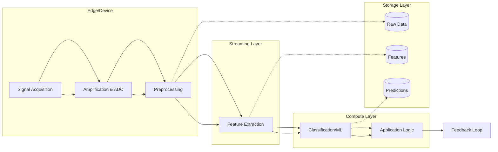
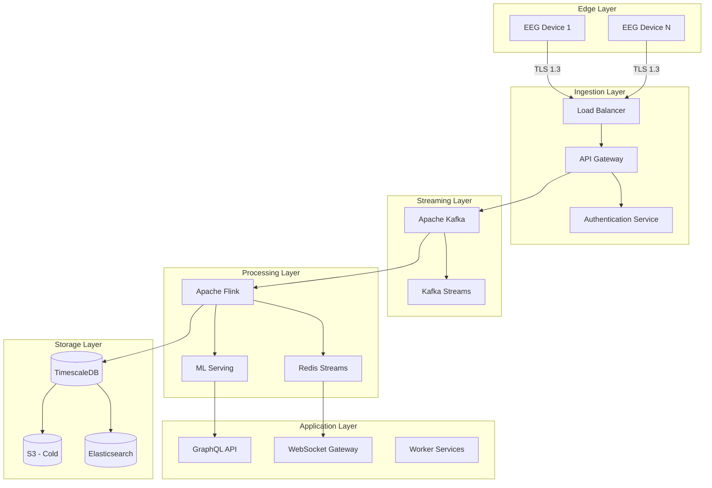

# Brain-Computer Interfaces for Backend: Neural Signal Processing Infrastructure

## 1. Mục Tiêu

Hiểu sâu kiến trúc backend cho **Brain-Computer Interface (BCI) systems** - lĩnh vực kết nối não bộ với máy tính qua neural signals.

Nội dung trọng tâm:
- **Bản chất neural signals**: EEG, ECoG, MEG, fNIRS - đặc điểm và yêu cầu xử lý
- **Real-time signal processing pipeline**: Acquisition → Preprocessing → Feature extraction → Classification
- **Streaming infrastructure**: Kafka/Pulsar cho neural data streams, sub-millisecond latency requirements
- **Data architecture**: High-frequency time-series data, annotation storage, provenance tracking
- **ML inference at scale**: Model serving cho neural signal classification
- **Security & Privacy**: Brain data encryption, GDPR compliance, neuro-rights

Mục tiêu cuối cùng: **thiết kế backend infrastructure** có khả năng xử lý **high-frequency neural data** với **low-latency requirements**, đảm bảo **security** và **scalability** cho BCI applications.

---

## 2. Bản Chất và Cơ Chế Hoạt Động

### 2.1 Neural Signal Types: Đặc Điểm và Yêu Cầu

#### EEG (Electroencephalography)

**Bản chất vật lý:**
- Đo điện thế trên da đầu từ hoạt động điện của neuron
- Amplitude: 10-100 μV (microvolt) - rất nhỏ so với nhiễu môi trường
- Tần số: 0.5-100 Hz, chia thành các band:
  - Delta (0.5-4 Hz): Sleep, unconscious
  - Theta (4-8 Hz): Drowsiness, meditation
  - Alpha (8-13 Hz): Relaxed awareness
  - Beta (13-30 Hz): Active thinking, focus
  - Gamma (30-100 Hz): Higher cognitive functions

**Yêu cầu backend:**
```
Sampling rate: 256-2048 Hz per channel
Channels: 8-256 electrodes (tùy thiết bị)
Data rate: 256Hz × 64 channels × 4 bytes = 65 KB/s per user
                ↓
Với 10,000 concurrent users: ~650 MB/s raw data
```

> **Quan trọng:** EEG data là **time-series đa chiều** (multi-channel) với **temporal correlations** phức tạp giữa các kênh.

#### ECoG (Electrocorticography)

**Bản chất:**
- Electrodes đặt trực tiếp trên cortex (phẫu thuật)
- Signal quality cao hơn EEG (không qua skull)
- Spatial resolution tốt hơn
- Chỉ dùng cho medical/research (invasive)

**Yêu cầu backend:**
- Higher sampling rate: 1000-20000 Hz
- More channels: 64-256
- Strict FDA compliance requirements
- Real-time feedback loops cho brain stimulation

#### MEG (Magnetoencephalography)

**Bản chất:**
- Đo từ trường từ hoạt động neural
- SQUID sensors yêu cầu liquid helium cooling
- Rất nhạy cảm với nhiễu môi trường

**Yêu cầu backend:**
- Ultra-high sampling: 1000-5000 Hz
- 200+ sensors
- Specialized shielding room coordination
- Real-time noise cancellation

#### fNIRS (Functional Near-Infrared Spectroscopy)

**Bản chất:**
- Đo oxyhemoglobin changes qua near-infrared light
- Slower than EEG (hemodynamic response ~6-8s delay)
- Portable, less sensitive to motion artifacts

**Yêu cầu backend:**
- Lower sampling: 10-50 Hz
- Focus trên temporal aggregation
- Correlation với behavioral data

### 2.2 Signal Processing Pipeline



#### Stage 1: Acquisition & Amplification

**Bản chất:**
```
Neural Signal (μV level)
    ↓
Instrumentation Amplifier (CMRR > 80dB)
    ↓
Band-pass Filter (0.5-100 Hz)
    ↓
ADC 24-bit @ 1000+ Hz
    ↓
Digital Stream (USB/BLE/WiFi)
```

**Backend concerns:**
- **Data loss tolerance**: Neural data không thể retransmit (real-time nature)
- **Timestamp synchronization**: NTP/PTP cho multi-device setup
- **Buffer management**: Device-side buffering khi network unstable

#### Stage 2: Preprocessing

**Artifact Removal:**
```python
# Pseudocode: Preprocessing pipeline
def preprocess(raw_signal):
    # 1. Notch filter (remove 50/60Hz power line noise)
    filtered = notch_filter(raw_signal, freq=50)
    
    # 2. Band-pass filter (focus on relevant frequencies)
    filtered = bandpass_filter(filtered, low=0.5, high=100)
    
    # 3. Artifact rejection (ICA - Independent Component Analysis)
    # Tách eye blinks, muscle movements
    components = ica_decompose(filtered)
    cleaned = remove_artifact_components(components)
    
    # 4. Re-referencing (Common Average Reference)
    cleaned = car(cleaned)
    
    return cleaned
```

**Trade-offs:**

| Approach | Latency | Quality | Compute Cost |
|----------|---------|---------|--------------|
| FIR Filter | High (window size) | Excellent | High |
| IIR Filter | Low | Good | Low |
| ICA | Very High | Excellent | Very High |
| Simple Bandpass | Very Low | Moderate | Very Low |

> **Khuyến nghị:** Dùng **IIR filter** cho real-time, **ICA** cho offline analysis.

#### Stage 3: Feature Extraction

**Time-domain features:**
- Mean, Variance, Kurtosis, Skewness
- Hjorth parameters (activity, mobility, complexity)

**Frequency-domain features:**
```python
# Power Spectral Density (PSD) per band
def extract_psd_features(signal):
    psd = welch_psd(signal)
    
    features = {
        'delta_power': band_power(psd, 0.5, 4),
        'theta_power': band_power(psd, 4, 8),
        'alpha_power': band_power(psd, 8, 13),
        'beta_power': band_power(psd, 13, 30),
        'gamma_power': band_power(psd, 30, 100),
        'alpha_beta_ratio': alpha_power / beta_power  # Stress indicator
    }
    return features
```

**Time-frequency features:**
- Wavelet transform (Morlet wavelets)
- Short-time Fourier Transform (STFT)

**Connectivity features:**
- Coherence giữa các kênh
- Phase-locking value (PLV)
- Granger causality

#### Stage 4: Classification

**ML Approaches:**

| Model | Use Case | Latency | Accuracy |
|-------|----------|---------|----------|
| LDA/QDA | Simple BCI (2-4 classes) | <1ms | 70-85% |
| SVM | Multi-class | 5-20ms | 75-90% |
| CNN | Raw signal learning | 10-50ms | 80-95% |
| RNN/LSTM | Temporal patterns | 20-100ms | 75-85% |
| Transformer | Complex patterns | 50-200ms | 85-95% |

> **Quan trọng:** **CSP (Common Spatial Patterns)** là algorithm chuẩn cho motor imagery BCI.

### 2.3 Backend Architecture Components

#### Streaming Infrastructure

**Kafka cho Neural Data:**
```yaml
# Topic design cho EEG streaming
topics:
  eeg.raw.{userId}.{deviceId}:
    partitions: 1  # Ordering critical per user
    replication: 3
    retention: 7d  # Raw data short-term
    
  eeg.preprocessed.{userId}:
    partitions: 1
    retention: 30d
    
  eeg.features.{userId}:
    partitions: 1
    retention: 90d
    
  eeg.predictions.{userId}:
    partitions: 1
    retention: 1y  # Predictions kept longest
```

**Partitioning strategy:**
- **User-level partitioning**: Đảm bảo ordering và locality
- **Time-based indexing**: Truy vấn theo time range hiệu quả
- **Hot/cold separation**: Recent data trên SSD, historical trên S3

#### Time-Series Database

**Lựa chọn so sánh:**

| Database | Best For | Neural Data Fit | Query Pattern |
|----------|----------|-----------------|---------------|
| **InfluxDB** | Metrics, monitoring | Good | Time range, aggregations |
| **TimescaleDB** | SQL-compatible TS | Excellent | Complex joins với metadata |
| **ClickHouse** | Analytics, batch | Good | OLAP queries |
| **TDengine** | IoT optimized | Good | High ingestion |
| **Apache Druid** | Real-time analytics | Moderate | Sub-second analytics |

**Schema design (TimescaleDB):**
```sql
-- Hypertable cho EEG data
CREATE TABLE eeg_data (
    time TIMESTAMPTZ NOT NULL,
    user_id UUID NOT NULL,
    device_id UUID NOT NULL,
    channel SMALLINT NOT NULL,  -- 1-256
    value REAL NOT NULL,
    quality_score REAL,  -- Signal quality metric
    
    PRIMARY KEY (time, user_id, device_id, channel)
);

-- Convert to hypertable với 1-hour chunks
SELECT create_hypertable('eeg_data', 'time', chunk_time_interval => INTERVAL '1 hour');

-- Indexes cho truy vấn phổ biến
CREATE INDEX idx_user_time ON eeg_data (user_id, time DESC);
CREATE INDEX idx_device_time ON eeg_data (device_id, time DESC);

-- Continuous aggregate cho downsampled views
CREATE MATERIALIZED VIEW eeg_1min_agg
WITH (timescaledb.continuous) AS
SELECT 
    time_bucket('1 minute', time) AS bucket,
    user_id,
    device_id,
    channel,
    AVG(value) as mean,
    STDDEV(value) as std
FROM eeg_data
GROUP BY bucket, user_id, device_id, channel;
```

#### Real-Time Processing

**Apache Flink cho Stream Processing:**
```java
// Flink job cho real-time feature extraction
DataStream<EegSample> source = env
    .addSource(new KafkaSource<>())
    .assignTimestampsAndWatermarks(
        WatermarkStrategy.<EegSample>forBoundedOutOfOrderness(Duration.ofMillis(100))
    );

// Sliding window cho feature extraction
DataStream<FeatureVector> features = source
    .keyBy(sample -> sample.getUserId())
    .window(SlidingEventTimeWindows.of(
        Time.milliseconds(500),  // Window size
        Time.milliseconds(100)   // Slide interval
    ))
    .aggregate(new FeatureExtractionAggregate());

// ML inference với side input cho model
DataStream<Prediction> predictions = features
    .map(new MlInferenceFunction(modelState));
```

**Latency breakdown:**
```
Signal acquisition: 1-10ms (device-dependent)
Network transmission: 5-50ms (WiFi/4G/5G)
Kafka ingestion: 1-5ms
Preprocessing: 10-100ms
Feature extraction: 5-50ms
ML inference: 10-200ms (model-dependent)
Application response: 5-20ms
─────────────────────────────────────────
Total: 37-435ms
```

> **Target cho real-time BCI:** <100ms end-to-end latency (perception threshold)

---

## 3. Kiến Trúc Hệ Thống

### 3.1 High-Level Architecture



### 3.2 Data Flow Patterns

**Hot Path (Real-time):**
```
Device → Gateway → Kafka → Flink → Redis → WebSocket → Client
                    ↓
              ML Inference
```
Latency target: <100ms

**Warm Path (Near real-time):**
```
Device → Gateway → Kafka → Feature Extraction → TimescaleDB
```
Latency: <1s

**Cold Path (Batch/Analytics):**
```
TimescaleDB → S3 → Spark/Pandas → ML Training
```
Latency: Minutes to hours

### 3.3 Multi-Tenant Architecture

**Isolation strategies:**

| Level | Pros | Cons | Use Case |
|-------|------|------|----------|
| **Database per tenant** | Max isolation | High cost | Medical/Research |
| **Schema per tenant** | Good isolation | Moderate cost | Enterprise |
| **Row-level security** | Low cost | Complex policies | Consumer apps |
| **Application-level** | Simple | Risky | Internal tools |

> **Khuyến nghị:** **Schema per tenant** cho BCI platforms - balance giữa security và operational complexity.

---

## 4. So Sánh Các Lựa Chọn Kiến Trúc

### 4.1 Edge vs Cloud Processing

**Edge Processing (On-device):**
```
Pros:
- Ultra-low latency (<10ms)
- Privacy (raw data không rời khỏi device)
- Reduced bandwidth
- Works offline

Cons:
- Limited compute power
- Battery constraints
- Model size limitations
- Harder to update

Architecture:
Device → [Preprocessing → Simple ML] → Compressed features → Cloud
```

**Cloud Processing:**
```
Pros:
- Unlimited compute
- Complex models (deep learning)
- Easy updates
- Centralized monitoring

Cons:
- Network latency
- Bandwidth requirements
- Privacy concerns
- Single point of failure

Architecture:
Device → Raw data → Cloud [Full pipeline]
```

**Hybrid Approach (Khuyến nghị):**
```
Device: Acquisition → Basic filtering → Compression
Edge (Local Gateway): Artifact removal → Feature extraction
Cloud: Complex ML → Storage → Analytics
```

### 4.2 Synchronous vs Asynchronous Processing

**Synchronous (Request/Response):**
- Use case: Brain-controlled applications (game, cursor)
- Latency requirement: <50ms
- Trade-off: Blocking, harder to scale

**Asynchronous (Event-driven):**
- Use case: Monitoring, analytics, long-term trends
- Latency tolerance: Seconds
- Trade-off: Complex error handling

### 4.3 Database Comparison

```
┌─────────────────────────────────────────────────────────────┐
│                    NEURAL DATA STORAGE                      │
├─────────────────────────────────────────────────────────────┤
│                                                             │
│  RAW SIGNALS          FEATURES           PREDICTIONS        │
│  ───────────          ────────           ───────────        │
│  Volume: 10TB/day     Volume: 100GB/day  Volume: 1GB/day    │
│  Retention: 30 days   Retention: 1 year  Retention: Forever │
│  Query: Time range    Query: Analytics   Query: User lookup │
│                                                             │
│  ┌─────────┐          ┌─────────┐        ┌─────────┐        │
│  │Parquet/ │          │ClickHous│        │PostgreSQ│        │
│  │S3       │          │e        │        │L        │        │
│  └─────────┘          └─────────┘        └─────────┘        │
│                                                             │
└─────────────────────────────────────────────────────────────┘
```

---

## 5. Rủi Ro, Anti-Patterns, Lỗi Thường Gặp

### 5.1 Security & Privacy Risks

**Brain Data Sensitivity:**
> **Neural data là biometric data ở level cao nhất** - không thể thay đổi như password, tiết lộ thoughts và intentions.

**Rủi ro:**
1. **Thought inference**: ML models có thể decode private thoughts từ neural patterns
2. **Emotional profiling**: Identify emotional states, vulnerabilities
3. **Intent prediction**: Predict actions before conscious decision
4. **Identity theft**: Neural signatures là unique identifier

**Mitigation strategies:**
```yaml
# Defense in depth cho brain data
security_layers:
  transport:
    - TLS 1.3 với mutual authentication
    - Certificate pinning on devices
    
  storage:
    - AES-256 encryption at rest
    - Field-level encryption cho sensitive features
    - HSM cho key management
    
  access_control:
    - RBAC với principle of least privilege
    - Just-in-time access cho researchers
    - Audit logging mọi data access
    
  privacy:
    - Differential privacy cho aggregated analytics
    - Data minimization - chỉ collect cần thiết
    - Consent management với granular controls
    - Right to deletion (GDPR Article 17)
```

### 5.2 Performance Anti-Patterns

**Anti-Pattern 1: Synchronous Database Writes**
```python
# BAD: Blocking database write trong hot path
def on_eeg_sample(sample):
    db.insert(sample)  # Blocks 5-20ms
    process(sample)

# GOOD: Async write với buffering
def on_eeg_sample(sample):
    buffer.append(sample)
    if len(buffer) >= BATCH_SIZE:
        async_flush(buffer)
    process(sample)
```

**Anti-Pattern 2: No Backpressure Handling**
```python
# BAD: Unbounded queue
def process_stream(data):
    queue = Queue()  # Có thể OOM
    for item in data:
        queue.put(item)

# GOOD: Backpressure-aware
def process_stream(data):
    queue = Queue(maxsize=10000)
    for item in data:
        if queue.full():
            drop_or_sample(item)  # Graceful degradation
        else:
            queue.put(item)
```

**Anti-Pattern 3: Single Partition Per Topic**
```yaml
# BAD: No parallelism
topics:
  eeg-data:
    partitions: 1  # Bottleneck!

# GOOD: Partition by user
topics:
  eeg-data:
    partitions: 100
    partitioning_key: user_id
```

### 5.3 Data Quality Issues

**Artifact Contamination:**
- Eye blinks: 100-200 μV (much larger than neural signal)
- Muscle (EMG): Broadband noise
- Power line: 50/60Hz interference

**Solutions:**
- Real-time artifact detection
- Signal quality metrics (SQi)
- Automatic channel rejection
- User feedback khi signal poor

**Clock Drift:**
- Multi-device setups cần sub-millisecond synchronization
- Use PTP (Precision Time Protocol) thay vì NTP
- Hardware timestamping nếu possible

### 5.4 ML-Specific Issues

**Concept Drift:**
- Neural patterns change over time (user fatigue, learning)
- Models cần continuous retraining
- A/B testing cho model updates

**Cold Start:**
- New users cần calibration session
- Transfer learning từ similar users
- Generic models là fallback

---

## 6. Khuyến Nghị Thực Chiến Trong Production

### 6.1 Deployment Architecture

```yaml
# Kubernetes deployment structure
namespaces:
  - bci-ingress:     # API Gateway, Load Balancers
  - bci-streaming:   # Kafka, ZooKeeper
  - bci-processing:  # Flink, Kafka Streams
  - bci-ml:          # Model serving (KServe/Triton)
  - bci-storage:     # TimescaleDB, Redis, MinIO
  - bci-apps:        # Business logic services
  
pod_anti_affinity:
  # Đảm bảo replicas spread across nodes
  requiredDuringSchedulingIgnoredDuringExecution:
    - labelSelector:
        matchLabels:
          app: kafka-broker
      topologyKey: kubernetes.io/hostname
```

### 6.2 Monitoring & Observability

**Key Metrics:**

| Metric | Target | Alert Threshold |
|--------|--------|-----------------|
| End-to-end latency | <100ms p99 | >150ms |
| Signal drop rate | <0.1% | >1% |
| ML inference time | <50ms p99 | >100ms |
| Data ingestion rate | Baseline | ±20% |
| Prediction accuracy | >80% | <70% |

**Distributed Tracing:**
```python
# OpenTelemetry trace cho BCI pipeline
with tracer.start_as_current_span("eeg_pipeline") as span:
    span.set_attribute("user.id", user_id)
    span.set_attribute("device.id", device_id)
    
    with tracer.start_span("preprocessing"):
        cleaned = preprocess(raw_signal)
        
    with tracer.start_span("feature_extraction"):
        features = extract_features(cleaned)
        
    with tracer.start_span("inference"):
        prediction = model.predict(features)
```

### 6.3 Disaster Recovery

**RPO/RPO Targets:**
- Raw data: RPO 1 hour, RTO 4 hours
- Features: RPO 15 minutes, RTO 1 hour
- Predictions: RPO 0 (synchronous replication), RTO 5 minutes

**Backup Strategy:**
- Continuous backup to object storage (S3)
- Cross-region replication cho critical data
- Point-in-time recovery capability

### 6.4 Compliance & Governance

**GDPR Considerations:**
- **Lawful basis**: Consent (Article 6) hoặc Legitimate Interest
- **Special category data**: Neural data có thể là "data concerning health" (Article 9)
- **Data Protection Impact Assessment (DPIA)**: Bắt buộc với high-risk processing
- **Data Protection Officer (DPO)**: Có thể cần appointed

**FDA (US Medical Devices):**
- Nếu BCI là medical device: Class II hoặc III
- 510(k) clearance hoặc PMA (Premarket Approval)
- Quality System Regulation (QSR)
- Post-market surveillance

---

## 7. Kết Luận

### Bản Chất Vấn Đề

**Brain-Computer Interface backend** là **real-time stream processing system** xử lý **high-frequency, multi-dimensional time-series data** với **strict latency requirements** và **extreme privacy sensitivity**.

**Core challenges:**
1. **Volume**: 10K-100K samples/second per user
2. **Latency**: <100ms end-to-end cho real-time feedback
3. **Privacy**: Brain data là ultimate biometric - không thể rotate, tiết lộ inner thoughts
4. **Complexity**: Multi-stage pipeline (acquisition → preprocessing → features → ML)

### Trade-offs Chính

| Dimension | Option A | Option B | Recommendation |
|-----------|----------|----------|----------------|
| **Latency vs Accuracy** | Simple models, fast | Complex models, slow | Hybrid: Edge preprocessing + Cloud ML |
| **Privacy vs Utility** | On-device only | Full cloud | Federated learning + Differential privacy |
| **Cost vs Retention** | Short retention | Long retention | Tiered: Hot (SSD) → Warm (HDD) → Cold (S3) |
| **Consistency vs Availability** | Strong consistency | Eventual consistency | Eventual cho analytics, strong cho control |

### Checklist Production-Ready

```
□ Latency: p99 <100ms cho real-time path
□ Throughput: Scale to 10K+ concurrent users
□ Privacy: End-to-end encryption, field-level encryption
□ Compliance: GDPR, HIPAA (nếu medical), FDA (nếu device)
□ Reliability: 99.9% uptime, automatic failover
□ Observability: Distributed tracing, metrics, alerting
□ ML Ops: Model versioning, A/B testing, rollback
□ Security: Zero-trust architecture, regular audits
```

### Tương Lai

**Emerging trends:**
- **Federated Learning**: Train models without centralizing brain data
- **Neuromorphic Computing**: Hardware acceleration cho neural signal processing
- **Edge ML**: More powerful on-device inference (TPU, NPU)
- **Standardization**: BCI data formats (EDF+, BIDS) và APIs

---

## References

1. Wolpaw, J. R., et al. (2002). "Brain-computer interfaces for communication and control." *Clinical Neurophysiology*.
2. Makeig, S., et al. (2004). "EEG research: standards and publications." *Journal of Neuroscience Methods*.
3. Lotte, F., et al. (2018). "A review of classification algorithms for EEG-based brain-computer interfaces." *Journal of Neural Engineering*.
4. Kübler, A., & Müller, K. R. (2007). "An introduction to brain-computer interfacing." *Toward Brain-Computer Interfacing*.
5. IEEE Standards for BCI: P2731 Working Group
